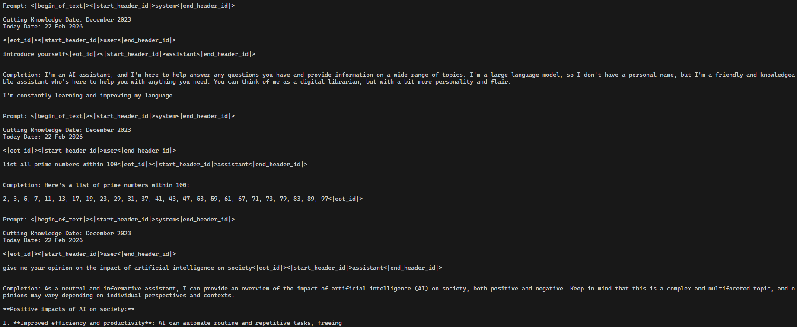

<h1 align="center">vLLM 技术路线</h1>
<p align="center">
| <a href="./HowToApproachvLLM.md"><b>English</b></a> 
| <a href="./HowToApproachvLLM_zh.md"><b>简体中文</b></a> |
</p>

本文档提供了理解和复现一个最小vLLM的分步指南。通过该文档的小结顺序以获得最佳学习体验。

**原始开发环境及测试基于A6000 GPU。**

[配套视频链接](https://www.bilibili.com/video/BV1Vjz1B2EQu)

---

## Step 1: Layers

首先构建基本的神经网络层，`\layers`目录中存放了模型的基础结构块。

### 1.1 激活函数 ✅

具体实现：[activation.py](src/myvllm/layers/activation.py)

首先实现激活函数（如SiLU、GELU）

**关键学习: `torch.compile` 优化**
- 基准测试:
	```python
	for _ in range(10): # 预热循环
		_ = layer(input_tensor)
	
	times = []
	for _ in range(100): # 计算循环
		torch.cuda.synchronize()
		start_time = time.time()
		output_tensor = layer(input_tensor)
		torch.cuda.synchronize()
		end_time = time.time()
		times.append(end_time - start_time)
	```

**测试结果:**
| tensor shape         | torch.compile | time (ms) |
| ---------------      | ------------- | --------- |
| (400, 800)           | on            |  0.2044   |
| (400, 800)           | off           |  0.0823   |
| (4000, 8000)         | on            |  0.4494   |
| (4000, 8000)         | off           |  0.5290   |
| (8, 4000, 8000)      | on            |  2.3865   |
| (8, 4000, 8000)      | off           |  3.7650   |

**要点:** `torch.compile` 由于编译成本，有助于加速大型tensor的计算，对于小型tensor的计算反而会因为编译时间过长降低效率。

---

### 1.2 RMS LayerNorm ✅

具体实现：[layernorm.py](src/myvllm/layers/layernorm.py)

实现RMS层归一化，帮助稳定训练。

**关键知识:**
- 对激活进行归一化，但不做均值中心化（只使用 RMS 均方根）
- 对大模型而言比 LayerNorm 更高效
- 对训练稳定性至关重要
- 基准测试:
	```python
    for _ in range(10): # 预热循环
        _ = layer(x)
    
    # 不使用残差的情况
    times = [] 
    for _ in range(100): # 计算循环
        torch.cuda.synchronize()
        start_time = time.time()
        _ = layer(x)
        torch.cuda.synchronize()
        end_time = time.time()
        times.append(end_time - start_time)
    avg_time = sum(times) / len(times)
    print(f"[Without residuals] Average inference time over 100 runs: {avg_time * 1000:.4f} ms")
	```

**基准测试:**
| tensor shape    | torch.compile | residuals | time (ms) |
| --------------- | ------------- | --------- | --------: |
| (400, 800)      | off           | off       |  0.1630   |
| (400, 800)      | off           | on        |  0.1703   |
| (400, 800)      | on            | off       |  0.2024   |
| (400, 800)      | on            | on        |  0.3470   |
| (4000, 8000)    | off           | off       |  1.3725   |
| (4000, 8000)    | off           | on        |  1.9269   |
| (4000, 8000)    | on            | off       |  0.6029   |
| (4000, 8000)    | on            | on        |  1.1786   |
| (8, 4000, 8000) | off           | off       | 10.4689   |
| (8, 4000, 8000) | off           | on        | 15.3257   |
| (8, 4000, 8000) | on            | off       |  3.6483   |
| (8, 4000, 8000) | on            | on        |  8.1566   |

**要点:** 类似于激活函数的基准测试，`torch.compile` 在计算量较大的场景下更有帮助，但对于小规模算子会带来额外开销。

---

### 1.3 线性层 （支持张量并行） ✅

具体实现：[linear.py](src/myvllm/layers/linear.py)

线性层是最复杂的一层，因为需要支持分布式训练，所以需要实现张量并行。

**核心概念：分布式模型中的权重加载**
```python
# 将 checkpoint 加载到分片（sharded）模型时：
for name, param in model.named_parameters():
    if name in checkpoint:
        loaded_weight = checkpoint[name]  # 完整模型参数 (4096, 4096)
        
        # 检查该参数是否有自定义的 weight_loader
        if hasattr(param, 'weight_loader'):
            # 调用自定义 weight_loader
            param.weight_loader(param, loaded_weight)
            # weight_loader 会自动完成：
            # 1. 取出与当前 GPU 对应的分片（shard）
            # 2. 将其拷贝到 param.data
        else:
            # 默认行为：直接拷贝
            param.data.copy_(loaded_weight)

```

**并行线性层的类型：**

1. **ColumnParallelLinear** ✅
    - 沿输出维度在多张 GPU 上切分
    - 每张 GPU 计算输出特征的一部分
    - 前向传播过程中不需要通信

2. **RowParallelLinear** ✅
    - 沿输入维度在多张 GPU 上切分
    - 需要用 `dist.all_reduce` 对部分结果求和
    - 通常接在 `ColumnParallel` 层之后使用

3. **MergedColumnParallelLinear** ✅
    - 将多个列并行层合并（例如 gate + up 两个投影）
    - 必须同时对 `param_data` 和 `loaded_weight` 进行切分，以匹配对应的矩阵
    - 对 MLP 层更高效

4. **QKVColumnParallel** ✅
    - Attention 中 Q/K/V 投影的特殊情况
    - 每张 GPU 存完整的 heads（不对 `head_size` 维度做切分）
    - 使每张 GPU 可以独立完成注意力计算

**基准测试：**
使用如下指令，进入`src/myvllm/layers`目录，在分布式环境测试运行结果是否正确
```
cd src/myvllm/layers
CUDA_VISIBLE_DEVICES=0,1,2,3 uv run torchrun --nproc_per_node=4 linear.py
```
输出结果`allclose=True`则代表多机并行结果与单机一致
```
[ColumnParallel] allclose=True, max_abs_err=0.000107
[MergedColumnParallel] allclose=True, max_abs_err=0.000103
[QKVColumnParallel] allclose=True, max_abs_err=0.000061
[RowParallel] allclose=True, max_abs_err=0.000011
```
**MLP 层的常见模式:**
    - 一个 `ColumnParallel` → 一个 RowParallel → `dist.all_reduce`
    - 第一层的输出切分方式 = 第二层的输入切分方式


---

### 1.4 词表嵌入（Vocab Embedding）与 LM Head ✅

具体实现：[embedding_head.py](src/myvllm/layers/embedding_head.py)


**词表嵌入（Vocab Embedding）：**
- 将词表按 GPU 进行切分（分片）
- 每张 GPU 只存储词表的一部分

**LM Head：**
- 可以与词表嵌入共享权重（tied embeddings，权重绑定）
- `F.linear` 会自动对权重做转置以完成线性计算
- 最终 logits 可使用 `dist.gather` 或 `dist.all_gather` 汇总

**关键区别（Key Differences）：**
- `dist.gather(tensor, gather_list, dst)`：只有 `dst` 这张 GPU 会收到全部数据
- `dist.all_gather(tensor_list, tensor)`：所有 GPU 都会收到全部数据（没有 `dst` 参数）

**内存布局（Memory Layout）- contiguous()：**
```python
# 连续内存
x = [1, 2, 3, 4, 5, 6]  # 物理存储: [1][2][3][4][5][6]

# 非连续内存
y = x.reshape(2, 3).T   # 逻辑视图: [[1,4],[2,5],[3,6]]
                        # 物理存储: [1][2][3][4][5][6] ← 仍是旧顺序！
                        # 通过 stride() 来访问元素
```
- `contiguous()` 会让内存块保持相邻 → 访问更快，不需要 `stride()`

---

### 1.5 注意力层（Attention Layer）✅

具体实现：[attention.py](src/myvllm/layers/attention.py)
性能测试：[benchmark_decoding.py](benchmark_decoding.py)

**关键张量概念（Key Tensor Concepts）：**
- **`stride()`**：当一个张量存储在内存中时，本质上是一个连续的一维数组。stride 用来描述：沿着某个维度移动到“下一个元素”时，需要在底层内存中跳过多少个元素。
	```
	Memory layout: [a00, a01, a02, a03, a10, a11, a12, a13, a20, a21, a22, a23]
	                  ↑                    ↑                   ↑
	             row 0                  row 1               row 2
	```
- **`numel()`**: 参数总数量

**GPU 架构（A100）：**
- 每个 3D grid 有 4 个 WARP
- 每个 WARP 有 32 个线程
- 每个 grid 会同时处理 128 个线程

**Triton Kernel 备注：**
- 当将 PyTorch 张量传给 Triton kernel 时，**Triton 会自动从张量中提取指针**（内存地址）

---

#### FlashAttention 与 PagedAttention

这两者不是二选一的关系，而是**正交的两个维度**，decode kernel 两者都用：

- **FlashAttention** 是**计算**技术：把序列分块，用 online softmax 逐块合并，从而不需要 materialize `(seq_len, seq_len)` 的分数矩阵。解决的是访存开销。
- **PagedAttention** 是**存储**技术：KV cache 按固定大小的块存放，通过每个序列各自的 block table 间接寻址。解决的是显存碎片化。

|  | Prefill | Decode |
|---|---|---|
| Query 长度 | 整个 prompt（数百到数千 token） | 每个序列恰好 **1** 个 token |
| 计算方式 | 分块 + online softmax（**flash**） | 分块 + online softmax（**flash**） |
| K/V 来源 | 刚算出的 `k`、`v`，varlen 打包 | **paged** KV cache |
| 瓶颈 | 计算（大矩阵乘） | 访存（为产出 1 个 token 要遍历整个 cache） |
| Kernel | `flash_attention_prefill` | `paged_attention_decode` |

所以 decode 是 *flash **加** paged*；本仓库的 prefill 只用了 flash，因为它直接读传进来的张量，不读 cache。

推理引擎的绝大部分时间花在 decode 上，因此本节剩余部分逐步讲解 paged decode kernel。

---

#### Step 1：确定 KV cache 的内存布局

```python
k_cache: (num_blocks, block_size, num_kv_heads, head_dim)
```

cache 是一个由固定大小**块（block）**组成的扁平池。一个序列并不占据其中连续的一段，而是持有一个**块列表** —— `BlockManager` 从空闲块里任意分配。[main.py](main.py) 中 `block_size` 为 256。

展平之后，某个 (block, slot, kv_head, dim) 元素的偏移量为：

```python
offset = (physical_block * block_size * num_kv_heads * head_dim   # 跳过前面整块
          + slot          * num_kv_heads * head_dim               # 跳过块内前面的槽位
          + kv_head       * head_dim                              # 跳过前面的头
          + dim)
```

记住这个公式 —— Step 7 里的每个 bug 都是这个公式中某一项写错了。

#### Step 2：把新的 K/V 写入 cache

`store_kvcache` 启动 `(num_tokens, num_kv_heads)` 的 grid。每个 program 把一个 token 在一个头上的 K 和 V 拷贝到 `slot_mapping[token]` 指定的槽位，该映射由 ModelRunner 预先算好。`slot_mapping` 为 `-1` 表示跳过该 token。

#### Step 3：Prefill —— 变长注意力

同一批次内的序列长度不同，因此它们被首尾拼接，用 `cu_seqlens`（累积长度）划分边界：

```
cu_seqlens = [0, 5, 12, 20]   ->   seq 0 = tokens 0..4, seq 1 = 5..11, seq 2 = 12..19
```

grid 为 `(cdiv(max_seq_len, BLOCK_M), num_heads, num_seqs)`：每个 program 负责一个序列、一个头、一个 query 分块。program 把自己的 Q 块常驻寄存器，让 K/V 块流经它，并不断更新 running softmax。

#### Step 4：Online softmax 递推

两个 kernel 都依赖它。第 `j` 块的注意力结果可以合并进已有结果，全程不需要持有所有分数：

```python
m_new = max(m_old, max(qk_j))          # running max，保证数值稳定
alpha = exp(m_old - m_new)             # 已累积部分需要缩放的比例
acc   = acc * alpha + sum(exp(qk_j - m_new) * V_j)
l     = l   * alpha + sum(exp(qk_j - m_new))
# 最后一块处理完之后：
out   = acc / l
```

`m` 的唯一作用是防止 `exp()` 溢出；`l` 是到目前为止累积的 softmax 分母。

#### Step 5：Decode —— 遍历 paged cache

grid 为 `(batch_size, num_heads)`：每个 program 负责一个（序列，query 头）组合。program 载入它那一个 query 向量，然后以 `BLOCK_N` 个 token 为一块遍历该序列的 KV cache，套用上面的递推。

难点在于：一块**逻辑上**连续的 token，在**物理上**散落在不同的块里。解析一个逻辑 token 需要**两次除法**：

```python
logical_block  = t // block_size                       # 属于本序列的第几块
slot           = t %  block_size                       # 在该块内的第几个位置
physical_block = block_tables[seq, logical_block]      # 间接寻址
```

对 GQA 而言，还需要把 query 头映射到对应的 KV 头：

```python
kv_head_idx = head_idx // (num_heads // num_kv_heads)
```

#### Step 6：如何遍历一个 chunk

为一块 `BLOCK_N` 个 token 填出 `physical_block` 和 `slot`，有三种写法：

**(a) 逐 token 处理** —— 正确但慢。`for i in range(BLOCK_N)` 会展开成 `BLOCK_N` 次标量加载再加 `BLOCK_N` 次 `tl.where` 合并，整个 SIMD 宽度都在闲置。

**(b) 每个 chunk 查一次 block table** —— 快，但仅当一个 chunk 不会跨越两个块时才成立（`block_size % BLOCK_N == 0`），而且仍然需要 `slot = t % block_size`。

**(c) 逐 token gather block table** —— 既快又通用。每条 lane 解析自己的 token，因此一个 chunk 可以跨越任意多个块：

```python
offs_n        = token_start + tl.arange(0, BLOCK_N)
logical_block = offs_n // block_size
offs_in_block = offs_n %  block_size

in_range = (offs_n < context_len) & (logical_block < max_num_blocks)

# 每个 token 一个 block table 条目，而不是每个 chunk 一个
physical_block = tl.load(block_tables_ptr + batch_idx * max_num_blocks + logical_block,
                         mask=in_range, other=-1)
valid = in_range & (physical_block != -1)

# 被 mask 掉的 lane 仍会参与地址运算：把它们指向第 0 块
physical_block = tl.where(valid, physical_block, 0).to(tl.int64)

kv_offset = (physical_block[None, :] * (block_size * num_kv_heads * head_dim)
             + offs_in_block[None, :] * (num_kv_heads * head_dim)
             + kv_head_idx * head_dim
             + offs_d[:, None])
```

K 和 V 共用 `kv_offset`，因此每个 chunk 只 gather 一次 block table，而不是两次。

#### Step 7：容易踩的坑

1. **把全局 token 下标当成块内偏移。** `physical_block * block_size` 已经把指针移到了该块的起始位置，所以下一项必须是 `t % block_size` 而不是 `t`。用 `t` 会越过块尾读到后续块所属的其他序列的数据 —— 越界得足够远时会直接变成非法内存访问。只要测试用的序列都能装进单个块，这个错误就看不出来。
2. **每个 chunk 只查一次 block table。** 只有当 chunk 能装进一个块时才成立。`block_size=16` 配 `BLOCK_N=64` 时，一个 chunk 横跨 4 个块，其中 3 个从未被查过。
3. **被 mask 掉的 lane 仍然会计算地址。** `tl.load(..., mask=...)` 抑制的是**加载**，不是地址运算。`physical_block` 中残留的 `-1` 会算出负偏移，因此要把无效 lane 钳到第 0 块。
4. **int32 溢出。** 每块 256×8×128 = 262144 个元素，`physical_block * block_size * num_kv_heads * head_dim` 在块数超过约 8192 时会溢出 int32。需要把块下标转成 `int64`。
5. **测试里用恒等的 block table。** 如果测试用 `block_tables = torch.arange(...)` 构造，逻辑顺序就等于物理顺序，上面**所有** bug 都会消失。应当使用打乱的映射 —— 真实的 `BlockManager` 产出的就是这样。
6. **丢掉边界检查。** `logical_block < max_num_blocks` 用于防止读越 block table 的尾部。

---

#### 性能测试结果

[benchmark_decoding.py](benchmark_decoding.py) 在完全相同的输入上对比四种实现。每种实现在计时**之前**都会先和 float32 参考结果比对 —— 一个因为读错内存而“变快”的 kernel，会在 correct 列显示 `NO`，而不是显示成加速。

Qwen3-0.6B 的注意力形状（`num_heads=16, num_kv_heads=8, head_dim=128, block_size=256`），fp16，单张 A6000。单次调用耗时（ms），加速比相对 Naive PyTorch：

| batch | seq_len | Naive PyTorch | Fast PyTorch | Triton 逐 token | Triton 分块 |
|------:|--------:|--------------:|-------------:|----------------:|------------:|
| 1 | 128 | 0.385 (1.0x) | 0.778 (0.5x) | 0.088 (4.4x) | **0.028 (14.0x)** |
| 1 | 512 | 0.445 (1.0x) | 0.977 (0.5x) | 0.340 (1.3x) | **0.026 (16.8x)** |
| 1 | 2048 | 0.735 (1.0x) | 0.818 (0.9x) | 1.939 (0.4x) | **0.098 (7.5x)** |
| 8 | 128 | 0.833 (1.0x) | 3.780 (0.2x) | 0.084 (10.0x) | **0.026 (31.8x)** |
| 8 | 512 | 1.232 (1.0x) | 4.029 (0.3x) | 0.465 (2.7x) | **0.040 (31.1x)** |
| 8 | 2048 | 4.297 (1.0x) | 5.042 (0.9x) | 1.848 (2.3x) | **0.127 (33.9x)** |
| 32 | 128 | 2.272 (1.0x) | 14.410 (0.2x) | 0.127 (17.9x) | **0.034 (67.5x)** |
| 32 | 512 | 4.574 (1.0x) | 15.147 (0.3x) | 0.518 (8.8x) | **0.130 (35.1x)** |
| 32 | 2048 | 16.849 (1.0x) | 19.681 (0.9x) | 1.975 (8.5x) | **0.493 (34.2x)** |

如何解读这张表：

- **分块比逐 token 快 3.1x–21.3x**，且上下文越长差距越大。`seq_len=2048` 时逐 token 版本**比 PyTorch 还慢** —— 它的开销取决于 token 数量，而不是访存量。
- **“Fast PyTorch”往往是最慢的。** 它的向量化 gather 会 materialize 一份稠密的 `(batch, max_ctx, kv_heads, head_dim)` cache 副本，batch 32 时这次分配就成了主要开销。而“填充成稠密张量”恰恰是 paged attention 要避免的事情。
- **Triton kernel 在大 batch 下优势最明显**，此时 `(batch, num_heads)` 的 grid 才有足够多的 program 填满 GPU。
- **batch 1 是短板**：只有 16 个 program，GPU 大部分处于空闲。把 KV 序列拆分到多个 program（flash-decoding）是下一步优化 —— grid 变成 `(batch, heads, kv_splits)`，再用第二个 kernel 合并各 split 的 `(m, l, acc)`。

通用的逐 token gather 相比块对齐版本没有可测量的开销（kernel 是访存受限的），而且对任意 `block_size` 都成立：

| block_size | Triton 逐 token | Triton 分块 | 加速比 |
|-----------:|----------------:|------------:|-------:|
| 16 | 0.978 ms | 0.056 ms | 17.5x |
| 32 | 0.979 ms | 0.056 ms | 17.5x |
| 100 | 1.014 ms | 0.057 ms | 17.8x |
| 256 | 0.955 ms | 0.053 ms | 18.0x |

（batch 4，seq_len 1000。`block_size=100` 是刻意选的：既不是 2 的幂，也不是 `BLOCK_N` 的整数倍。）

运行方式：

```bash
uv run python benchmark_decoding.py                                  # 默认扫描
uv run python benchmark_decoding.py --block-size 16 --seq-lens 1000  # 单个配置
```

---

### 1.6 旋转位置编码（RoPE）✅

具体实现：[rotary_embedding.py](src/myvllm/layers/rotary_embedding.py)

为具备位置信息的注意力实现旋转位置嵌入（rotary position embeddings）。

**理解 base 参数（Understanding Base Parameter）：**

1. **base 越大 → 频率越低：**
   - 对远距离位置具有更独特的编码
   - 局部平滑性更弱
   - 不太能很好地区分相邻位置

2. **base 越小 → 频率越高：**
   - 在远距离位置会出现周期性碰撞（重复）
   - 更适合短序列

3. **不同维度会在不同位置发生碰撞：**

	```
	Dim 0 (freq=1.0):   Good for positions 0-10 (then repeats) 
	Dim 2 (freq=0.1):   Good for positions 0-100 (then repeats) 
	Dim 4 (freq=0.01):  Good for positions 0-1000 (then repeats) 
	Dim 6 (freq=0.001): Good for positions 0-10000 (then repeats)
	```

**长上下文策略（当推理时上下文长度超过训练长度）：**

1. 直接使用 RoPE（可能会性能退化）
2. 修改 base：base 越大 = 频率越低 + 平滑性更好
3. 缩放位置：0, 1, 2, 3 → 0, 0.1, 0.2, 0.3
4. **YARN** ✅
   - 高频部分：模型在训练中见过很多周期 → 具备外推能力
   - 低频部分：模型从未见过完整周期 → 通过压缩位置让分布保持在训练范围内
5. **NTK** ✅
   - 针对更长上下文动态增大 base

---

## Step 2: 模型构建 ✅

具体实现：[qwen3.py](src/myvllm/models/qwen3.py)

组合所有层，构建完整的 Qwen 模型。

**关键架构决策（Key Architecture Decisions）：**

**为什么在 Attention 中 `self.num_heads` 是按 GPU（per-GPU）来设置的？**
- 在注意力计算过程中不需要通信
- 每张 GPU 可以独立处理不同的 head
- 完整流程：
  1. 输入在所有 GPU 上复制（replicated）
  2. QKV 投影（ColumnParallel）按输出维度切分
  3. 通过 `.view()` 将本地的 Q、K、V 重新 reshape
  4. 在本地参数上运行 attention
  5. 在本地应用 RMS 和 rotary embedding
  6. 输出投影（RowParallel）使用 `dist.all_reduce` 求和聚合

**为什么 RMS 只作用在 Q 和 K 上？**
- Q 和 K 参与注意力权重（attention score / weight）的计算
- 去除会导致 softmax 不稳定的大数值
- V 不需要归一化（不会影响 score 的计算）

**为什么 gate_up 使用 MergedColumnParallelLinear？**
- 为了与模型 checkpoint 兼容！
- checkpoint 结构：
	```python
	checkpoint = {
	    'mlp.gate_proj.weight': torch.randn(intermediate_size, hidden_size),
	    'mlp.up_proj.weight': torch.randn(intermediate_size, hidden_size),
	    'mlp.down_proj.weight': torch.randn(hidden_size, intermediate_size),
	}
	```
- 不能直接用普通 ColumnParallel，把维度简单写成 `intermediate_size * 2`

**残差连接（Residual Connections）：**
- 始终在 attention 输出的 layernorm 之后加上 residual
- 始终在最后一层的 normalization 之后加上 residual

**验证正确运行！** ✅


---

## Step 3：序列管理

现在模型已经能跑起来了，接下来实现调度（scheduling）与内存管理（memory management）系统。

### 3.1 序列类（Sequence Class）

具体实现：[sequence.py](src/myvllm/engine/sequence.py)

**目的：** 存储一个序列的全部信息（prompt + 生成的 tokens）。

**关键实现细节：**


```python
# In __init__:
self.token_ids = copy(token_ids)  # MUST copy! Creates new list
```

**为什么要使用`copy()`？** 如果不使用 `copy()`，`self.token_ids` 会引用外部传入的 list，并且会受到外部修改的影响。使用 `copy()` 可以保证内部数据独立。

**序列状态跟踪：**
- Waiting
- Running  
- Finished

**重要属性：**
- `token_ids`：所有 token（prompt + 生成）
- `num_tokens`：当前长度
- `block_table`：该序列的 KV cache 存储在哪些内存块中
- `status`：该序列在系统中的当前状态


---

### 3.2 内存块类（Block Class）

具体实现：[block_manager.py](src/myvllm/engine/block_manager.py)


**目的：** 表示一个固定大小的内存块，用于存储 KV cache。

**关键概念：**

**引用计数（`ref_count`）：**
- 用于跟踪有多少个序列正在使用该 block
- 对 **前缀缓存** 至关重要 —— 当多个序列共享前缀时复用 KV cache
- 释放一个序列时，需要检查 `ref_count` 来决定该 block 是否应该被清空

**为什么要做哈希？**
- 目的：通过按内容查找 block 来启用 **前缀缓存**
- 不做哈希：无法知道 tokens `[1,2,3,...,256]` 是否已经被缓存
- 做哈希：`hash_value = compute_hash([1,2,3,...,256])` → `block_id = hash_to_block_id.get(hash_value)`
- 只有当 block 被填满（256 个 token 全部就位）时才计算 hash

**为什么哈希函数的参数要包含 prefix？**
- 即使当前 block 的 tokens 相同，也能在不同上下文中保持唯一性
- 例子：`[prefix_hash_1][1,2,3]` 与 `[prefix_hash_2][1,2,3]` 是不同的

**为什么在 reset() 里设置 `ref_count = 1`？**
- 当一个 block 被分配时（`_allocate_block` 会调用 `reset()`），它会立刻被某个序列使用
- 从 1（而不是 0）开始，反映了这种“立即被使用”的状态

**缓存未命中检测：**
```python
if block_id == -1 or self.blocks[block_id].token_ids != token_ids:
    cache_miss = True
```

**为什么要同时检查这两个条件？**
- `block_id == -1`：哈希表中未找到对应项
- `token_ids != ...`：避免哈希碰撞！不同的 tokens 可能会产生相同的哈希值

---

### 3.3 内存块管理器类（BlockManager Class）

具体实现：[block_manager.py](src/myvllm/engine/block_manager.py)

**目的：** 管理所有序列的 KV cache 显存分配/释放。

**关键方法：**

**`can_append(seq)`：**
- 检查 GPU 上是否还有可用的 block / 空间，用于给该序列再追加一个 token
- 返回 True/False

**`append()`：**
- 在需要时实际分配新的 block
- 在 `can_append()` 返回 True 之后调用
- 负责维护与更新 block table

**`allocate_with_cache(seq)`：**
- 尝试复用已缓存的 block（前缀缓存 prefix caching）
- 只为未命中的 tokens 分配新 block

**`deallocate(seq)`：**
- 将该序列使用到的所有 block 的 `ref_count` 递减
- 当 `ref_count` 变为 0 时释放对应 block


---

## Step 4：模型运行器（Model Runner）✅

具体实现：[model_runner.py](src/myvllm/engine/model_runner.py)

**目的：** 作为序列与模型执行之间的桥梁。负责数据准备、CUDA Graph 优化以及采样。

### 4.1 权重加载

可以在CPU或GPU中加载权重，不同设备中进行模型的权重加载可能会导致权重出现问题。具体可以查看 [Issues #36](https://github.com/Wenyueh/MinivLLM/issues/36)。

```python
# Load weights in GPU (model moved to GPU before loading weights)
self.model = self.model.cuda(rank)

# Load pretrained weights if model_name_or_path is provided
if config.get('model_name_or_path'):
    from myvllm.utils.loader import load_weights_from_checkpoint
    load_weights_from_checkpoint(self.model, config['model_name_or_path'])

# Load weights in CPU (move the model to GPU after loading weights)
# self.model = self.model.cuda(rank)
```

### 4.2 核心函数概览

```python
class ModelRunner:
    def __init__(self): pass
    
def read_shm(self): pass          # 从共享内存读取（worker 进程）
def write_shm(self): pass         # 写入共享内存（master 进程）

def warmup_model(self): pass      # 测量峰值显存占用
def allocate_kv_cache(self): pass # 分配 KV cache 显存

def prepare_prefill(self): pass   # 为 prefill 前向推理准备数据
def prepare_decode(self): pass    # 为 decode 前向推理准备数据  
def prepare_sample(self): pass    # 为采样准备温度（temperature）

def run_model(self): pass         # 执行模型（decode 阶段使用 CUDA graph）
def run(self): pass               # 主入口：prepare → run → sample

def capture_cudagraph(self): pass # 捕获 CUDA graphs 用于优化

```

---

### 4.3 共享内存通信

**`read_shm()`：**（Worker 进程从 master 进程读取）

```python
n = int.from_bytes(self.shm.buf[0:4], "little")
```
**为什么长度用 4 字节？** 写入端无论 `n` 的值是多少，都固定用 4 字节来写：`n.to_bytes(4, "little")`。

**同步机制（Synchronization）：**
- `self.event.wait()`：阻塞等待，直到 master 调用 `event.set()` 发出“消息已就绪”的信号
- `self.event.clear()`：清除信号，为下一条消息重置状态（回到“未就绪”）

**`write_shm()`：**（Master 进程写入给 workers）


```python
for event in self.events:  # Note: plural, list of events
    event.set()
```
**为什么使用循环?** 每个worker对应一个event - master 将信号分别发送给每个worker.

**关于 `self.event` vs `self.events` 的说明：**
- Master：`self.events = [Event(), Event(), Event()]`（列表）
- Worker：`self.event = Event()`（单个）

---

### 4.4 内存管理

**`warmup_model()`:**

**为什么在处理请求前先 warmup？**
- 用于测量显存：跑一遍最大 batch 来估计峰值显存占用
- 测量的是模型显存（权重 + 激活），**不包含** KV cache
- 使用 `torch.cuda.memory_stats()['allocated_bytes.all.peak']`
- 结果会在 `allocate_kv_cache()` 中用于计算可用显存

**`allocate_kv_cache()`:**

**目的：** 基于 block_size，确定能够分配多少个 KV cache block。

**关键设计：**
- 为峰值占用预留显存（即使并非全部在用）
- 预留的是**模型级别**的显存，而不是每个序列各自预留
- 使用 `slot_mapping` 跟踪“哪个序列的哪个 token”写到哪个位置
- 这是实现 **PagedAttention** 的关键

---

### 4.5 数据准备

**`prepare_prefill(seqs)`：**

**目的：** 为 prefill 前向计算准备数据，并支持前缀缓存（prefix caching）。

**输出：**
- `input_ids`：所有序列的全部 tokens 合并成一个 list
- `positions`：每个 token 的 position 索引
- `cu_seqlens_q/k`：累计序列长度（用于标记边界）
- `slot_mapping`：新 KV 应写入的位置
- `block_tables`：KV 应从哪里读取


**为什么把 input_ids 展平成一个 list？**
- FlashAttention 的要求：单次 kernel launch
- `cu_seqlens_q` 用于标记边界：`[0, 3, 5, 9]`
  ```
  │ │ │ │
  │ │ │ └─ end of seq3 (position 9)
  │ │ └──── end of seq2 (position 5)
  │ └─────── end of seq1 (position 3)
  └────────── start (position 0)
  ```

**为什么没有 `cu_seqlens_v`？**
- 与 K 相同（key 和 value 的序列结构一致）

**为什么要准备长度匹配的 block_tables？**
- Attention kernel 需要读取 KV cache：
  ```python
  k = kv_cache[..., block_id * block_size : (block_id+1) * block_size, ...]
  ```

**为什么 `pin_memory=True`?**
- **Pinned memory** = 物理内存页锁定（不能被 swap 到磁盘）
- 支持通过 DMA（Direct Memory Access）直接进行 CPU→GPU 传输
- 更快:
  ```
  普通情况:    pageable → pinned buffer → GPU (2次拷贝)
  Pinned:    pinned → GPU (1次拷贝, DMA)
  ```

**为什么 `non_blocking=True`?**
- 控制 CPU 是否等待拷贝完成
- `non_blocking=False`: CPU 阻塞直到 GPU 拿到数据
- `non_blocking=True`: CPU 立即继续（异步传输）
- 支持并行拷贝！

**为什么 `slot_mapping` 只包含未缓存的 blocks？**
- 只为**新token** 写入 KV，不重复写已缓存的 KV
- 已缓存的 KV 已经存在于显存中

---

**`prepare_decode(seqs)`:**

**目的:** 为解码阶段准备数据（每个序列一个 token）。

**新的 slot 映射:**
```python
new_slot = seq.block_table[-1] * self.block_size + seq.last_block_num_tokens - 1
```

**为什么不用担心 slot 重叠？**
- BlockManager 的 `append()` 保证不会重叠:
  ```python
  # Seq has 256 tokens (block full)
  seq.num_tokens = 256
  256 % 256 = 0  → Block full, finalize it
  
  # Next token appended → num_tokens = 257
  257 % 256 = 1  → Need new block!
  block = self._allocate_block(self.free_block_ids[0])
  seq.block_table.append(block.block_id)
  ```

---

**`prepare_sample(seqs)`:**

**目的:** 准备温度（temperature）数值（并通过 padding 对齐 batch size）。

---

### 4.6 模型执行

**`run_model()`:**

**用于 Prefill：** 直接计算前向传播。

**用于 Decode：** 使用 CUDA Graph 来提升速度！

```python
graph = self.graphs[next(x for x in self.graph_bs if x >= bs)]
```
**为什么要找到能容纳的最小图？**
- 并不是每个 batch size 都一定有已捕获的图
- 通过 padding 复用更大的图

**为什么要用哨兵值填充 `slot_mapping` 和 `context_lens`？**
- 使用的图比实际需求更大 → 用虚拟值填充未使用的槽位
---

**`run()`:**

**主入口：**
1. 组合 `prepare_prefill` + `run_model` + `sample`
2. 调用 `reset_context()` 清除缓存数据

**为什么只有 rank 0 进行采样？**
- 在张量并行中，**所有 rank 计算得到相同的 logits**（或通过 reduce/gather 汇总到 rank 0）
- 只需要 **采样一次** 即可得到 token ID
- 避免重复采样或采样结果不一致

---

### 4.7 CUDA Graph 优化

**`capture_cudagraph()`:**

**目的：** 记录 CUDA kernel 的执行序列以便快速回放（消除 kernel 启动开销）。

**为什么只用于 decoding？**
- Decode 的输入模式固定（每个序列 1 个 token）
- Prefill 的输入长度可变

**捕获策略：**
- 在最大尺寸上预分配 buffer
- 针对常见 batch size 进行捕获：`[1, 2, 4, 8] + list(range(16, max_bs + 1, 16))`
- 先捕获最大 batch（内存池按最大场景进行尺寸规划）

**为什么在 capture 前要 warmup？**
- CUDA graph 要求在 capture 之前完成所有内存分配
- Warmup 会触发惰性分配 → 确保 capture 期间内存分配稳定

**为什么在 `reset_context()` 前要 `torch.cuda.synchronize()`？**
- 确保当前 capture 完成后，再为下一次 capture 重置状态

**`@torch.inference_mode()`:**
- 禁用梯度跟踪的装饰器
- 优化推理性能

---

### 4.8 辅助方法

**`loop()`:**
- worker 进程的主循环
- 等待事件并调用被请求的方法

**`call()`:**
- 同时被 master 和 workers 调用
- master 写入共享内存
- workers 从共享内存读取

---

### 4.9 关系：torch.compile vs CUDA Graph

**torch.compile：**
- 将多个操作融合成一个 kernel
- 节省 kernel 执行时间
- 示例：
  ```python
  @torch.compile
  def attention(q, k, v):
      scores = q @ k.T         # ┐
      probs = softmax(scores)  # ├─ Fused into ONE kernel
      output = probs @ v       # ┘
      return output
  ```

**CUDA Graph：**
- 记录 kernel 执行序列以便回放
- 节省 kernel 启动开销（无需 CPU 参与）
- 捕获执行图

**组合使用：** `torch.compile` 减少 kernel 数量，CUDA graph 消除启动开销。


---

## Step 5：调度器（Scheduler） ✅

具体实现：[scheduler.py](src/myvllm/engine/scheduler.py)

**目的：** 决定每次迭代运行哪些序列，并管理 waiting/running 队列。

### 5.1 核心设计

**两类队列：**
1. **Waiting 队列**：尚未开始的新序列
2. **Running 队列**：正在运行的序列

---

### 5.2 调度逻辑

**优先级：Prefill > Decode**

调度器 **总是先尝试 prefill**，即使 running 队列不为空！

**调度流程：**
1. **尝试加入 prefill 序列：**
   - 检查 waiting 队列里的新序列能否放得下
   - 没有空间继续 prefill 时停止

2. **如果没有新增 prefill，则调度 decode：**
   - 继续运行现有的 running 序列
   - 若没有空间容纳更多，则 **抢占** 优先级最低的序列

---

### 5.3 后处理

**生成之后：**
- 检查序列是否结束（EOS token 或达到最大长度）
- 若结束：通过 BlockManager 释放 block
- 将已完成序列从 running 队列移出

---

## Step 6: LLM Engine ✅

具体实现：[llm_engine.py](src/myvllm/engine/llm_engine.py)

**目的：** 顶层 API，用于编排 scheduler、model runner 和请求处理。


### 6.1 核心方法

**`add_request(prompt_str)`:**
- 将 prompt 字符串 → 转换为 Sequence 对象
- 加入 scheduler 的 waiting 队列

**`step()`:**
- 调用 `scheduler.schedule()` 获取要运行的序列
- 调用 `model_runner.run()` 执行
- 更新序列状态

**`generate(prompts)`:**
- 推理主入口
- 对每个 prompt：
  1. 加入 scheduler
  2. 反复调用 `step()` 直到完成
  3. 打印生成速度统计

---

### 6.2 初始化顺序

**为什么 Scheduler 要在 ModelRunner 之后初始化？**

当 `world_size > 1` 时，`ModelRunner.__init__` 会调用 `dist.init_process_group('nccl', ...)`，这是一个**集合屏障（collective barrier）**——rank-0 会阻塞，直到所有 worker 进程也完成该调用后才继续执行。只有在所有 rank 都完成汇合后，`ModelRunner.__init__` 才会返回。Scheduler 在此之后创建，确保分布式环境完全就绪后引擎才进入可用状态。

当 `world_size == 1` 时，不会启动任何 worker 进程，也不存在屏障，因此此时初始化顺序没有实际影响。

---

### 6.3 清理

**为什么要 `exit()` 以及 `atexit.register(self.exit)`？**
```python
def exit(self):
    # Cleanup code
    self.workers.join()  # Wait for workers to finish

atexit.register(self.exit)
```

**目的：** 当 Python 程序停止时，自动：
1. 调用 `engine.exit()` 清理资源
2. 等待 worker 进程优雅退出
3. 防止出现僵尸进程或状态损坏

---

## 总结：学习顺序

1. **层组件**（activation → layernorm → linear → vocab/lmhead → attention → rotary）
2. **模型**（组装各层，并验证可运行）
3. **序列管理**（Sequence → Block → BlockManager）
4. **Model Runner**（数据准备、CUDA graphs、采样）
5. **调度器**（队列管理、prefill/decode 调度）
6. **LLM Engine**（顶层编排）

每一步都建立在前一步之上，逐步构建一个完整的推理系统，并加入诸如 PagedAttention、CUDA graphs 与 prefix caching 等高级优化。

## 课程练习

感兴趣的读者可以在本地尝试向 MinivLLM 添加 `meta-llama/Llama-3.2-1B-Instruct` 作为练习。

`meta-llama/Llama-3.2-1B-Instruct`（以下简称 Llama3.2） 和 `Qwen/Qwen3-0.6B` 有着相似的结构，模型组件上仅有 Rotary Embedding 的实现略有不同，在保持字段名相同的前提下，现有的权重加载代码 `loader.py` 不需要修改就能直接用在 Llama3.2 上。

参考资料：
- Llama3.2 的实现可以参考 [mini-sglang 中的 Llama3.2](https://github.com/sgl-project/mini-sglang/blob/main/python/minisgl/models/llama.py)
- Rotary Embedding 实现的不同可以在 [mini-sglang 中的 Rotary Embedding](https://github.com/sgl-project/mini-sglang/blob/dae78f6bb97d5c5aaadbc0772fc964d48a8ee726/python/minisgl/layers/rotary.py#L72-L86) 中找到。
- 各种模型参数可以在 [Hugging Face 中的 Llama3.2](https://huggingface.co/meta-llama/Llama-3.2-1B-Instruct/tree/main) 的 `config.json` 文件中找到。

为了完成练习，可以先把仓库克隆到本地，然后删除仓库中的 Llama3.2 实现：`rm src/myvllm/models/llama.py`，再自己创建一个 `src/myvllm/models/llama.py` 文件，通过参考链接中的 Llama3.2，自己基于 MinivLLM 实现 Llama3.2。

添加 Llama3.2 只涉及以下文件的修改：
- `src/myvllm/models/llama.py`: 模型实现。需要你动手实现
- `src/myvllm/layers/rotary_embedding.py`: 需要添加 Llama3.2 的不同实现。
- `src/myvllm/engine/model_runner.py`: ModelRunner 需要能够调用实现的 Llama3.2。
- `main_llama32.py`: 负责测试 Llama3.2 的实现效果。

运行 `main_llama32.py`，效果如下：



由于后三个文件 `rotary_embedding.py`、`model_runner.py`、`main_llama32.py` 中要修改的地方不多，MinivLLM 已经实现好了，你所要做的就只是删除 `src/myvllm/models/llama.py` 文件，然后反复对照 [mini-sglang 中的 Llama3.2](https://github.com/sgl-project/mini-sglang/blob/main/python/minisgl/models/llama.py) 和 `src/myvllm/models/qwen3.py`，在 `src/myvllm/models/llama.py` 中实现你自己的 Llama3.2。实现好后，运行 `uv run main_llama32.py` 进行测试。如果实现无误，你应该可以看到和上面相似的效果。如果实在不会，请及时参考仓库中的原始 `src/myvllm/models/llama.py`。
