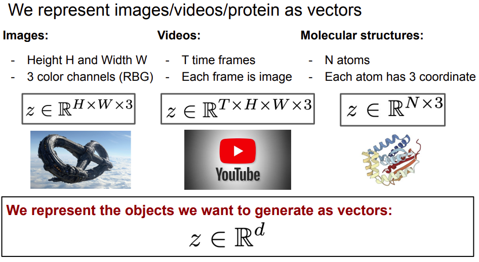
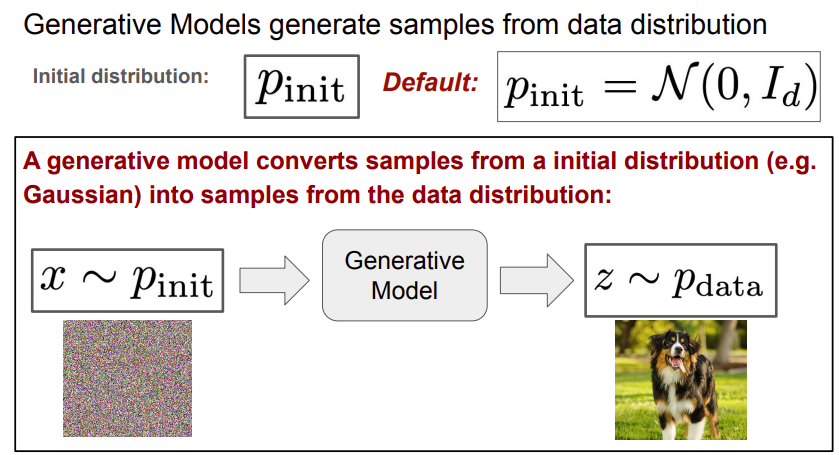
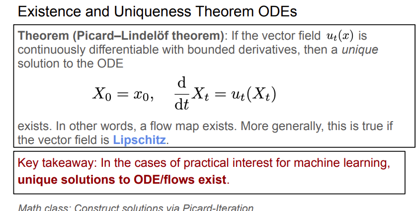
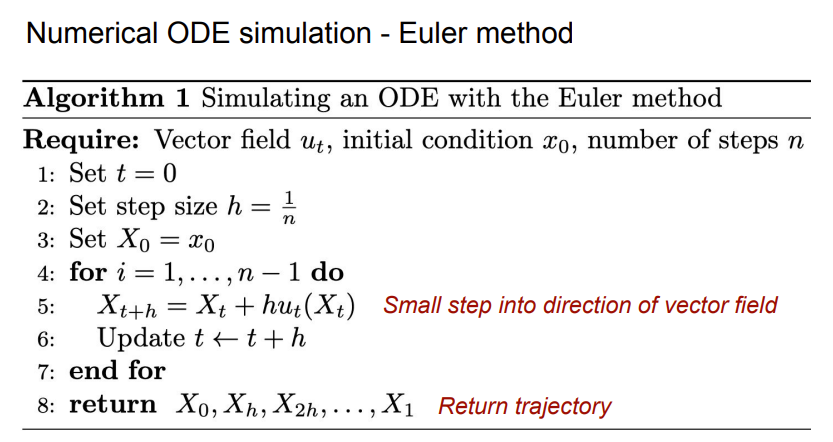
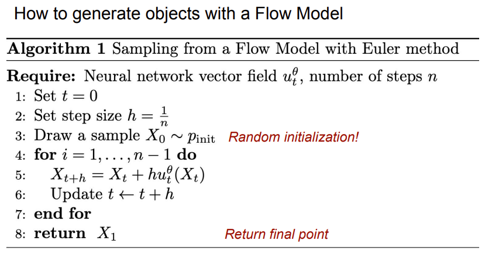
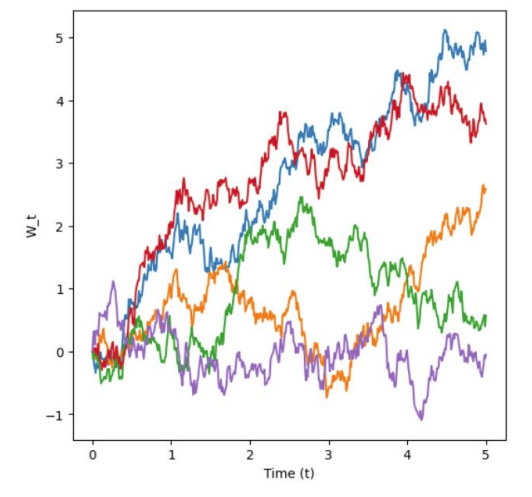
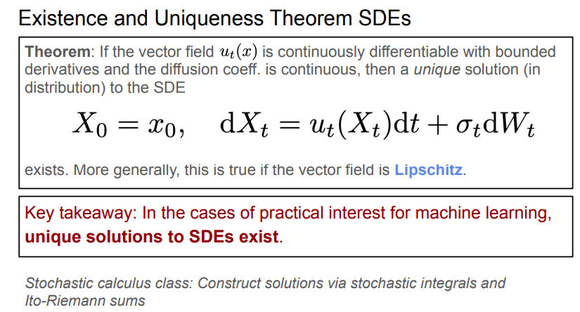
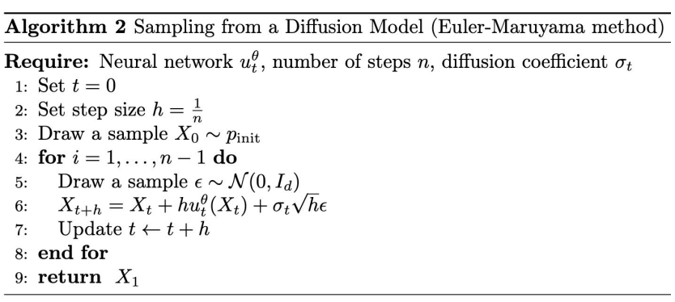

# Flow and Diffusion Models

## 目录
- [Problem Formulation](#problem-formulation)
    - [Data Representation](#data-representation)
    - [Generation as Sampling](#generation-as-sampling)
    - [Conditional Generation](#conditional-generation)
- [ODE & Flow Models](#ode--flow-models)
    - [Intuition of Flow](#intuition-of-flow)
    - [ODE](#ode)
    - [Euler Method](#euler-method)
- [SDE & Diffusion Models](#sde--diffusion-models)
    - [Brownian Motion](#brownian-motion)
    - [SDE](#sde)
    - [Euler-Maruyama Method](#euler-maruyama-method)
- [Summary & Comparison](#summary--comparison)
    - [ODE vs SDE](#ode-vs-sde)

## Problem Formulation

### Data Representation


我们将不同类型的数据模态(Data Modalities)统一表示为数值向量：
* 图像(Image): 一个 $H \times W$ 像素的图像，每个像素包含RGB三个通道，可以表示为 $z \in \mathbb{R}^{H \times W \times 3}$。
* 视频(Video): 视频是时间上的图像序列。如果有 $T$ 帧，则表示为 $z \in \mathbb{R}^{T \times H \times H \times 3}$。
* 分子结构(Molecular structure): 一个包含 $N$ 个原子的分子，其原子位置坐标可表示为矩阵 $z \in \mathbb{R}^{3 \times N}$。

核心理念(Key Idea 1): 我们将要生成的对象统一视为向量 $z \in \mathbb{R}^{d}$。

### Generation as Sampling



"生成"并非寻找某一个"最佳"的对象，而是从可能的对象分布中进行采样。
* 数据分布($p_{data}$): 我们将这种多样性建模为概率分布 $p_{data}$。这也就是一个概率密度函数 $p_{data}: \mathbb{R}^{d} \rightarrow \mathbb{R}_{\ge 0}$，它为每个可能的对象 $z$ 分配一个似然值(likelihood)。
* 任务定义: 生成对象 $z$ 被建模为从数据分布中采样： $z \sim p_{data}$。
* 数据集(Dataset): 在训练中，我们无法直接获取 $p_{data}$，而是通过有限的样本集合 $z_1, ..., z_N \sim p_{data}$ 作为真实分布的代理。
* 生成模型: 这是一个机器学习模型，经过训练后能够返回服从 $p_{data}$ 分布的样本。

### Conditional Generation

在许多情况下，我们需要基于某些额外信息(条件变量) $y$ 来生成对象。例如，基于文本提示词 $y=$"a dog running..."生成图像。

核心理念(Key Idea 4 - Guided Generation):
* 引导生成(Guided Generation)涉及从条件分布中采样：$z \sim p_{data}(\cdot|y)$ 。其中 $y$ 是条件变量。
* $p_{data}(\cdot|y)$ 被称为引导数据分布(guided data distribution)。
* 我们的目标是构建一个能够根据任意给定的 $y$ 进行条件生成的单一模型。

## ODE & Flow Models

### Intuition of Flow
* 向量场(Vector Field, $u_t$): 定义了空间中每个位置在特定时间 $t$ 的速度。
* 流(Flow, $\psi_t$): 回答了"如果我们从 $x_0$ 开始，在时间 $t$ 我们会在哪里？"的问题。它描述了整个空间的轨迹变换。
* 直观理解: 向量场定义了ODE，而ODE的解就是流(Flow)。流可以被视为一种随时间变化的平滑映射，它将空间"扭曲"或"变形"。

### ODE


* 定义: ODE描述了轨迹 $X_t$ 的变化率由向量场 $u_t$ 决定：

$$
\frac{d}{dt}X_t = u_t(X_t), \quad X_0 = x_0
$$
    
* 存在性与唯一性(Picard-Lindelöf定理): 只要向量场 $u_t$ 满足一定的平滑条件(如Lipschitz连续，这在神经网络中通常满足)，ODE就存在唯一的解(轨迹)。这意味着我们生成的映射是确定且可逆的。

### Euler Method




* 数值模拟: 对于复杂的神经网络向量场，我们无法获得解析解，必须使用数值方法进行模拟。
* 欧拉法(Euler Method): 最简单直观的数值积分方法。它在每个时间步 $h$ 沿着当前向量场的方向移动一小步：

$$
X_{t+h} = X_t + h \cdot u_t(X_t)
$$

* 流模型生成(Sampling from a Flow Model):
    1. 随机初始化: 从简单分布(如高斯分布)采样 $X_0 \sim p_{init}$。
    2. 模拟: 使用欧拉法，利用学习到的神经网络向量场 $u_t^\theta$，从 $t=0$ 逐步推演到 $t=1$。
    3. 输出: 最终状态 $X_1$ 即为生成的数据样本。

PyTorch Implementation of Euler Method for ODEs:

```python
import torch

def euler_ode_solver(vector_field, x0, t_start=0.0, t_end=1.0, steps=100):
    """
    使用欧拉法模拟 ODE 轨迹。
    
    Args:
        vector_field: 神经网络 u_t(x), 接收 (x, t) 并输出速度向量
        x0: 初始状态张量 (batch_size, dim)
        t_start: 开始时间
        t_end: 结束时间
        steps: 模拟步数
        
    Returns:
        x_final: t_end 时刻的状态
        trajectory: 完整的轨迹列表
    """
    dt = (t_end - t_start) / steps  # 步长 h
    x = x0
    t = t_start
    
    trajectory = [x]
    
    for _ in range(steps):
        # 1. 计算当前时刻和位置的速度 u_t(X_t)
        # 注意：需要将标量 t 扩展为与 batch 相同的维度以便输入网络
        t_tensor = torch.ones(x.shape[0], device=x.device) * t
        u = vector_field(x, t_tensor)
        
        # 2. 欧拉更新: X_{t+h} = X_t + h * u
        x = x + dt * u
        
        # 3. 更新时间
        t += dt
        trajectory.append(x)
        
    return x, trajectory
```

## SDE & Diffusion Models

随机微分方程(SDEs)通过引入随机噪声扩展了ODE的确定性轨迹。在生成模型中，SDE允许我们将简单的噪声分布逐步转化为复杂的数据分布。

### Brownian Motion


* 定义: 布朗运动(Brownian Motion，也称为维纳过程 $W_t$)是SDE的随机源。可以将其视为连续的随机游走。
* 核心性质:
    1. 起始点: $W_0 = 0$。
    2. 正态增量(Normal Increments): 对于任意时间段 $s < t$，增量 $W_t - W_s$ 服从方差随时间线性增加的高斯分布 $\mathcal{N}(0, (t-s)I_d)$。
    3. 独立增量: 不同时间段的增量是相互独立的。
* 直观理解: 尽管轨迹是连续的，但它处处不可导，表现出如图所示的"锯齿状"随机路径。

### SDE


* 公式: SDE将确定性的漂移(Drift)与随机的扩散(Diffusion)结合在一起，其中 $u_t(X_t)$: 向量场(Drift)，类似于ODE中的速度，决定了轨迹的主要移动方向。 $\sigma_t$: 扩散系数(Diffusion coefficient)，决定了注入噪声的强度。

$$
dX_t = \underbrace{u_t(X_t)dt}_{\text{确定性漂移}} + \underbrace{\sigma_t dW_t}_{\text{随机扩散}}
$$

* 存在性与唯一性: 与ODE类似，只要向量场 $u_t$ 平滑且导数有界，且扩散系数 $\sigma_t$ 连续，SDE就存在唯一的解(随机过程 $X_t$)。
* 生成模型: 扩散模型通过参数化神经网络 $u_t^\theta$ 来近似漂移项，通过模拟SDE将噪声($X_0 \sim p_{init}$)转化为数据($X_1 \sim p_{data}$)。

### Euler-Maruyama Method


* 数值模拟: Euler-Maruyama方法是欧拉法在SDE中的推广。它在每一步不仅沿着向量场移动，还加上了一个缩放后的高斯噪声。
* 更新规则: 给定步长 $h$，更新公式为：

$$
X_{t+h} = X_t + \underbrace{h u_t(X_t)}_{\text{漂移步}} + \underbrace{\sigma_t \sqrt{h} \epsilon}_{\text{扩散步}}, \quad \epsilon \sim \mathcal{N}(0, I_d)
$$

* 关键点: 注意噪声项缩放的是 $\sqrt{h}$ 而不是 $h$。这是因为布朗运动的方差与时间线性相关($Var \propto h$)，所以标准差(即幅度)与 $\sqrt{h}$ 成正比。

Pytorch Implementation of Euler-Maruyama Method for SDEs:

```python
import torch

def euler_maruyama_solver(drift_func, diffusion_func, x0, t_start=0.0, t_end=1.0, steps=100):
    """
    使用 Euler-Maruyama 方法模拟 SDE 轨迹。
    
    Args:
        drift_func: 漂移函数 u_t(x)，返回确定性方向 (batch, dim)
        diffusion_func: 扩散函数 sigma_t(t)，返回噪声强度标量或向量
        x0: 初始状态 (batch, dim)，通常采样自标准高斯分布
        t_start: 开始时间
        t_end: 结束时间
        steps: 模拟步数
    """
    dt = (t_end - t_start) / steps  # 步长 h
    x = x0
    t = t_start
    
    trajectory = [x]
    
    for _ in range(steps):
        # 1. 采样标准高斯噪声 epsilon ~ N(0, I)
        z = torch.randn_like(x)
        
        # 2. 获取当前的漂移项 u_t(X_t)
        t_tensor = torch.ones(x.shape[0], device=x.device) * t
        drift = drift_func(x, t_tensor)
        
        # 3. 获取当前的扩散系数 sigma_t
        # 注意：sigma 可能只与时间有关，也可能与状态有关，这里假设传入函数处理
        sigma = diffusion_func(t_tensor)
        
        # 4. Euler-Maruyama 更新: X_{t+h} = X_t + u*h + sigma*sqrt(h)*z
        # 注意噪声项乘以 sqrt(dt)
        x = x + drift * dt + sigma * torch.sqrt(torch.tensor(dt)) * z
        
        # 5. 更新时间
        t += dt
        trajectory.append(x)
        
    return x, trajectory
```

## Summary & Comparison

### ODE vs SDE

ODE(Flow Models)和SDE(Diffusion Models)是两种不同的生成模型范式，它们在数学形式、随机性和实现细节上存在显著差异：

数学形式上的差异:
* Flow Models基于常微分方程 $\frac{d}{dt}X_t = u_t(X_t)$，描述确定性的轨迹演化
* Diffusion Models基于随机微分方程 $dX_t = u_t(X_t)dt + \sigma_t dW_t$，在确定性漂移基础上增加了随机扩散项

随机性特征:
* Flow Models是完全确定性(Deterministic)的，给定相同的初始状态 $X_0$，总会得到相同的输出
* Diffusion Models具有随机性(Stochastic)，即使初始状态相同，每次采样也会因布朗运动产生不同结果

数值模拟方法:
* Flow Models采用Euler Method进行轨迹模拟，更新规则为 $X_{t+h} = X_t + h \cdot u_t(X_t)$
* Diffusion Models采用Euler-Maruyama Method，更新规则为 $X_{t+h} = X_t + h \cdot u_t(X_t) + \sigma_t\sqrt{h}\cdot\epsilon$，其中 $\epsilon \sim \mathcal{N}(0, I_d)$

训练方法差异:
* Flow Models通常使用Flow Matching方法训练，直接学习向量场 $u_t$
* Diffusion Models使用Score Matching或Denoising Score Matching，学习分数函数 $\nabla \log p_t(x)$

### 核心联系

从理论层面来看，SDE和ODE之间存在深刻的统一性：

SDE是更一般的框架，ODE实际上是SDE的一个特例。当扩散系数 $\sigma_t = 0$ 时，SDE退化为ODE。换句话说，Flow Models可以被视为没有扩散项的Diffusion Models。

两者的训练目标本质上是一致的：学习一个向量场，使得从简单的初始分布 $p_{init}$(通常是高斯分布)出发，经过时间 $t \in [0,1]$ 的演化，最终到达目标数据分布 $p_{data}$。

采样过程的灵活性:
* Flow Models的采样是确定性的，相同的初始噪声总是产生相同的输出，这使得采样过程可控且可重现
* Diffusion Models的采样具有随机性，每次运行都会因布朗运动的不确定性产生不同的结果，提供了更丰富的多样性

实际应用中的权衡:
* Flow Models的优势在于采样速度更快(所需步数更少)，可逆性允许精确的似然计算，适合需要确定性和高效推理的场景
* Diffusion Models在理论上更加灵活，可以通过调整扩散系数 $\sigma_t$ 在采样时权衡多样性与质量，在实践中往往能生成更高质量的样本，但代价是采样速度较慢

### 生成过程对比

Flow Models的生成过程:
* 初始状态: $X_0 \sim p_{init}$
* 演化方程: $\frac{d}{dt}X_t = u_t^\theta(X_t)$
* 目标分布: $X_1 \sim p_{data}$
* 训练损失: Conditional Flow Matching使用损失函数 $\mathcal{L}_{\text{CFM}}(\theta) = \mathbb{E}[||u_t^\theta(x) - u_t^{\text{target}}(x|z)||^2]$

Diffusion Models的生成过程:
* 初始状态: $X_0 \sim p_{init}$
* 演化方程: $dX_t = u_t^\theta(X_t)dt + \sigma_t dW_t$
* 目标分布: $X_1 \sim p_{data}$
* 训练损失: Denoising Score Matching使用损失函数 $\mathcal{L}_{\text{DSM}}(\theta) = \mathbb{E}[||s_t^\theta(x) - \nabla \log p_t(x|z)||^2]$

### 统一视角: 从Flow Matching到Score Matching

在更深层次上，Flow Matching和Score Matching这两种训练方法在数学上是可以统一的。对于高斯概率路径，向量场和分数函数之间存在明确的转换关系：

$$
u_t^{\text{target}}(x) = a_t \nabla \log p_t(x) + b_t x
$$

这一关系揭示了两种方法的本质联系:
* Flow Matching直接学习向量场 $u_t$，描述数据如何从噪声演化到真实分布
* Score Matching学习分数函数 $\nabla \log p_t(x)$，描述概率密度的梯度方向

两者在理论上是等价的，可以通过上述公式相互推导和转换。这种统一性为现代生成模型(如Stable Diffusion 3)提供了理论基础，使得我们能够在同一框架下理解和使用Flow和Diffusion方法，并根据具体应用场景选择最合适的实现方式。