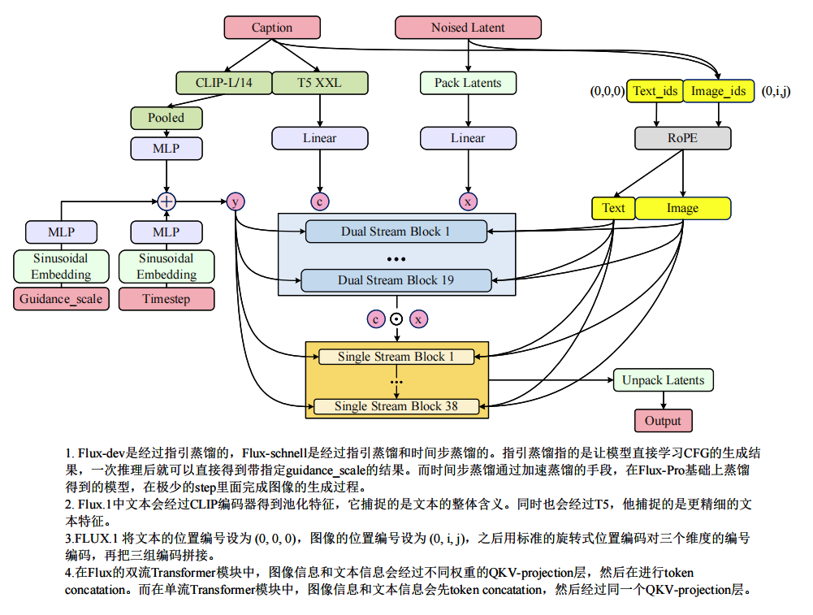
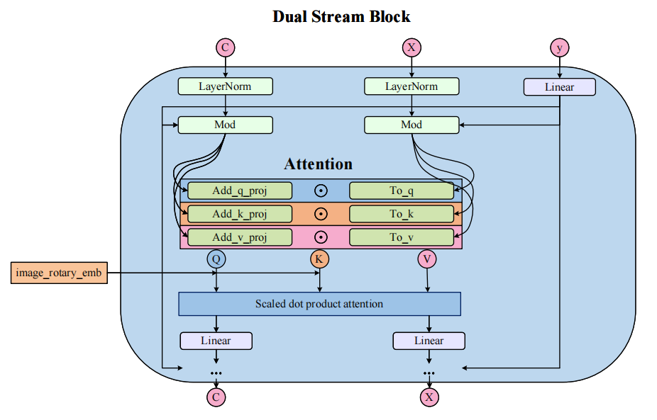
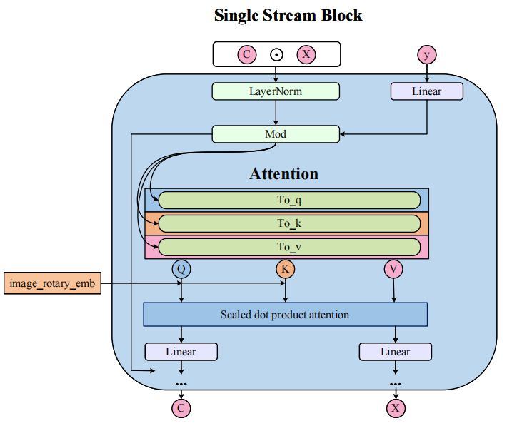

# FLUX: 模型架构与生成流程

## 目录
- [模型生成流程概览](#模型生成流程概览)
- [1. VAE 架构详解：从 4 通道到 16 通道的质变](#1-vae-架构详解从-4-通道到-16-通道的质变)
- [2. 文本编码器的变化 (Text Encoders)](#2-文本编码器的变化-text-encoders)
- [3. 核心 Transformer 主干 (The Backbone)](#3-核心-transformer-主干-the-backbone)
  - [图像分支处理 (Noised Latent & Packing)](#图像分支处理-noised-latent--packing)
  - [全局条件与位置编码 (Conditioning & RoPE)](#全局条件与位置编码-conditioning--rope)
  - [第一阶段：双流模块 (Dual Stream Block 1-19)](#第一阶段双流模块-dual-stream-block-1-19)
  - [过渡：特征拼接 (Concatenation)](#过渡特征拼接-concatenation)
  - [第二阶段：单流模块 (Single Stream Block 1-38)](#第二阶段单流模块-single-stream-block-1-38)
  - [输出与解包 (Output & Unpacking)](#输出与解包-output--unpacking)
- [4. 时间步调度与偏移 (Timestep Scheduling & Shift: $\mu$)](#4-时间步调度与偏移-timestep-scheduling--shift-mu)
- [5. FLUX 与 SD 系列模型架构的区别](#5-flux-与-sd-系列模型架构的区别)

## 模型生成流程概览

FLUX 作为一个先进的扩散模型，它的生成流程主要分为四个核心步骤：输入处理、条件注入与位置编码、主干网络（Transformer Backbone）处理以及最终特征输出。其最核心的创新在于主干网络中采用的“先双流、后单流”的深度跨模态融合机制。



## 1. VAE 架构详解：从 4 通道到 16 通道的质变

这是 FLUX 强于 SD 系列的根本原因之一。

* **SD1.5 / SDXL**：只有 4 个通道。这意味着 VAE 必须将海量的视觉信息（颜色、纹理、结构、光影）高度压缩进一个极小的向量空间。4 通道是一个“信息瓶颈”，导致在还原精细文字、手部指甲、眼睛神态时，Decoder 无法获得足够的原始信息，只能靠扩散模型去“猜”。
* **FLUX**：增加到 **16 个通道**，潜空间承载的信息量增加了 4 倍。它能够更完整地保留图像的结构特征（Structural Information）。这就是为什么 FLUX 生成的文字几乎不乱码，因为文字的几何拓扑结构在 16 通道的潜空间里被保留得非常完整。

## 2. 文本编码器的变化 (Text Encoders)

文本被送入两个不同特点的编码器，用于捕捉不同维度的语义信息：
- **CLIP-L/14**：负责捕获文本的“整体全局含义”。它的输出经过池化（Pooled）和多层感知机（MLP）处理后，提取出文本的全局特征，准备作为后续的全局条件。
- **T5 XXL**：负责捕获更“精细的文本特征”。它的输出保留了文本的长序列长度，经过线性层（Linear）映射后，变成序列特征向量 $c$。

## 3. 核心 Transformer 主干 (The Backbone)

这是模型最核心的部分，总共包含 57 层 Transformer。在网络架构上，它分为两个显著不同的处理阶段：“双流”和“单流”。

### 图像分支处理 (Noised Latent & Packing)

带噪声的图像潜变量经过打包（Pack Latents）操作，并由线性层进行映射，最终变成图像序列特征向量 $x$。这样处理后，图像数据被转换成了与文本特征维度兼容的序列格式，为后续的注意力机制做好准备。

> 💡 **原理解析：如何进行 Pack Latents 与 Unpack Latents？**
>
> 图像数据默认是 `[Batch, Channels, Height, Width]` 的 4D 张量，而 Transformer 需要处理 3D 的序列数据 `[Batch, Length, Dim]`。FLUX 并没有简单地把所有像素拉平，而是采用了一种 **空间分组（Spatial Packing）** 技术（类似于 ViT 中的 Patch Embedding）。
> 
> 在 `pipeline_flux.py` 中，Pack 操作的实现如下：
> ```python
> def _pack_latents(latents, batch_size, num_channels_latents, height, width):
>     latents = latents.view(batch_size, num_channels_latents, height // 2, 2, width // 2, 2)
>     latents = latents.permute(0, 2, 4, 1, 3, 5)
>     latents = latents.reshape(batch_size, (height // 2) * (width // 2), num_channels_latents * 4)
>     return latents
> ```
>
> 1. 首先通过 `view` 将图像在空间维度上拆分成 $(2 \times 2)$ 的块（Patch）：`[B, C, H/2, 2, W/2, 2]`。
> 2. 然后通过 `permute` 和 `reshape` 操作，将这 $(2 \times 2)$ 共 4 个像素的通道合并在一起。
> 3. 最终潜变量从 `[B, C, H, W]` 变成了 `[B, (H/2 * W/2), C * 4]` 的序列形式。
>
> 这样做的好处是：在特征维度增加4倍的同时，序列长度缩短为原来的1/4。这极大地降低了Transformer计算全局注意力时的显存消耗和时间复杂度（Self-Attention的复杂度随序列长度呈平方增长），显著提升了处理高分辨率图像的效率。

### 全局条件与位置编码 (Conditioning & RoPE)

为了让模型知道“要生成什么”以及“在图像的哪个位置生成”，需要注入时间/引导条件和空间位置信息。

**全局条件 $y$**
模型将 引导尺度 (Guidance_scale) 和 时间步 (Timestep) 通过正弦嵌入（Sinusoidal Embedding）和 MLP 处理后，与前面由 CLIP 提取的文本全局特征相加（`+`）。融合后的结果 $y$ 会作为全局条件，注入到后续所有的 Transformer 模块中，控制生成过程的方向与进度。

**位置编码 (RoPE)**
模型使用旋转位置编码（RoPE，Rotary Positional Embedding）来让网络具备空间感知能力：
- 文本的位置 ID 被固定为 `(0, 0, 0)`。
- 图像的位置 ID 根据其在潜空间的排列，被赋予三维坐标 `(0, i, j)`。

它们共同经过旋转位置编码（RoPE），分别输出 Text 和 Image 的位置信息，让 Transformer 在计算注意力时能够明确每个 token 的绝对与相对空间位置关系。

### 第一阶段：双流模块 (Dual Stream Block 1-19)

在这个初期阶段（共 19 层），文本特征 $c$ 和图像特征 $x$ 是平行且分开进入模块的。

如图所示，它们各自保留自己的特征空间，并经过不同权重的 QKV-projection（投影层）计算注意力，之后再进行 token 维度的运算与拼接更新。这种设计允许模型在初期阶段，分别对“文本语言”和“图像视觉”的独立特征进行深层理解和特征提取。



### 过渡：特征拼接 (Concatenation)

经过 19 层双流处理后，文本特征 $c$ 和图像特征 $x$ 的内在语义已经互相融合得较为成熟。此时，在物理层面将这两个序列进行拼接（Concatenate），组合成一个单一的跨模态数据流。

### 第二阶段：单流模块 (Single Stream Block 1-38)

合并后的单一序列进入单流模块阶段（共 38 层）。

在这个阶段，图像和文本 token 已经完全混在一起。它们会经过同一个 QKV-projection 层并计算全局注意力。这意味着模型在此阶段进行极深度的“跨模态融合”，让文本细节能够直接、逐像素地指导图像内容的去噪和生成，消除模态间的隔离。



> 💡 **思考：双流（Dual Stream）和单流（Single Stream）模块的区别是什么？**
> 
> - **双流模块（Dual Stream Block）**：
>   - **机制**：文本和图像虽然相互“看”对方（Cross-Attention 或 Joint-Attention），但它们各自维持独立的表示空间（Hidden States），并且使用**不同的投影层**（即两套不同的 QKV 权重：一套针对文本，一套针对图像）和独立的 MLP 进行特征提取。
>   - **目的**：在网络初期，文本语言和图像视觉的底层特征差异极大。双流设计允许模型在不互相破坏各自模态本质特征的情况下，分别对各自的模态进行深层理解和对齐，就像“求同存异”。
> 
> - **单流模块（Single Stream Block）**：
>   - **机制**：文本 Token 和图像 Token 被简单地拼接在一起形成一个超长序列，然后所有 Token 共享一套**完全相同**的自注意力机制参数（统一的 QKV 权重和 MLP 权重）。
>   - **目的**：在网络的后半段，经过初步对齐的特征已经被映射到了一个统一的跨模态联合空间。此时采用单流架构强制所有 Token 被一视同仁地处理，能够进行极深层次的“逐像素-词汇”特征绑定（Cross-Modal Fusion），将文本的语义细节“融化”到图像的像素结构中。
>
> 💡 **思考：为什么要“先双流、后单流”？**
>
> - **为什么双流在前？**
>   文本和图像是两种截然不同的信号：文本特征通常来自T5、CLIP等编码器，是高维、高语义密度的离散符号压缩；图像特征则来自VAE编码，是包含空间结构的密集连续信号。如果在网络一开始就将两者强行拼接到同一个单流序列中，模型需要同时适应差异很大的特征分布，容易造成模态信息相互干扰。
>
>   因此，双流模块更像是一个**跨模态对齐阶段**：文本和图像仍然保留各自独立的表示空间、投影层和MLP参数，同时通过注意力机制进行信息交互。这样既能保护各自模态的底层特征，又能逐步拉近两者的语义空间。
>
> - **为什么单流在后？**
>   当双流模块已经完成初步对齐后，文本和图像特征被映射到更统一的跨模态联合空间，此时继续维持两套独立的流会变得冗余，也会增加计算和参数开销。
>
>   单流模块将文本Token和图像Token合并到同一个序列中，让文本Token直接作为图像Token的上下文参与全局Self-Attention。这样不仅能增强模型对文本精确控图的能力，例如生成文字、复杂空间关系和多主体组合，也能借助参数共享，在更深层的网络中更高效地完成跨模态融合。

### 输出与解包 (Output & Unpacking)

经过总共 57 层（19层双流 + 38层单流）的 Transformer 深度处理后，融合了丰富文本语义指导和空间信息的特征流来到网络的末端。

该特征流会经过解包操作（Unpack Latents），将一维序列重新还原回图像格式（即执行前面 Pack 操作的逆过程：从 `[B, L, C * 4]` 拆分成 `[B, C, H, W]`）。

在生成完成后，需要执行逆操作 Unpack，将其还原回 4D 图像格式送入 VAE 解码：

```python
def _unpack_latents(latents, height, width, vae_scale_factor):
    batch_size, num_patches, channels = latents.shape
    height = 2 * (int(height) // (vae_scale_factor * 2))
    width = 2 * (int(width) // (vae_scale_factor * 2))

    latents = latents.view(batch_size, height // 2, width // 2, channels // 4, 2, 2)
    latents = latents.permute(0, 3, 1, 4, 2, 5)
    latents = latents.reshape(batch_size, channels // (2 * 2), height, width)
    return latents
```

最终的输出（Output）通常是模型预测出的噪声残差，用于在扩散过程的去噪步中逐步去除图像中的噪声，经过多次采样迭代后，最终生成清晰的高质量画面。

## 4. 时间步调度与偏移 (Timestep Scheduling & Shift: $\mu$)

在采样推理过程中，FLUX 引入了一个关键的动态参数 $\mu$，用于调整不同分辨率下的去噪节奏。这个过程主要发生在推理阶段的 `prepare_timesteps` 步骤中，通过计算图像序列长度来动态调整去噪节奏。

### $\mu$ 是如何推导出来的？（线性映射计算）

$\mu$ 是一个用来控制时间步偏移程度的实数变量。它并不是一个固定值，而是根据生成图像的分辨率（Latent 后的 token 数量）线性映射计算出来的：

```python
def calculate_shift(
    image_seq_len,
    base_seq_len: int = 256,
    max_seq_len: int = 4096,
    base_shift: float = 0.5,
    max_shift: float = 1.15,
):
    m = (max_shift - base_shift) / (max_seq_len - base_seq_len)
    b = base_shift - m * base_seq_len
    mu = image_seq_len * m + b
    return mu
```

在推理代码 `pipeline_flux.py` 中，这一步发生在准备时间步的阶段：

```python
# 5. Prepare timesteps
image_seq_len = latents.shape[1]
mu = calculate_shift(
    image_seq_len,
    self.scheduler.config.get("base_image_seq_len", 256),
    self.scheduler.config.get("max_image_seq_len", 4096),
    self.scheduler.config.get("base_shift", 0.5),
    self.scheduler.config.get("max_shift", 1.15),
)
```

- 如果生成的是低分辨率图像（token 数量少，如 256），$\mu$ 的值较小（约为 0.5）。
- 如果生成的是高分辨率图像（token 数量多，如 4096），$\mu$ 的值较大（约为 1.15）。

### “偏移（Shift）”在推理时如何应用？

在推理时，计算出的 $\mu$ 会通过 `retrieve_timesteps` 传递给调度器（Scheduler），用于改变噪声下降的曲线。在流匹配（Flow Matching）模型中，原本线性的时间步 $t$ 会参与到一个指数公式的计算中：

$$
\frac{\exp(\mu)}{\exp(\mu) + (1 / t - 1)^\sigma}
$$

- 数学表现：当 $\mu = 0$ 时，曲线保持不变。随着 $\mu$ 的增大（高分辨率场景），这条原本笔直的噪声衰减曲线会变得越来越上凸。
- 物理意义：曲线变凸意味着在总采样步数不变的情况下，模型会在“高噪声状态（去噪初期）”停留更长的步数，而在“低噪声状态（去噪末期）”快速滑过。

### 为什么要偏移？（核心目的：照顾高分辨率图像）
这是基于流匹配/扩散模型研究中的一个重要发现：分辨率越高的图像，包含的原始信号就越强。如果你用普通的均匀时间步去处理高分辨率图像，模型在初期加的噪声和处理步数不够，无法完全打破原有的像素依赖，导致构图或者大体结构生成得不好。

加入 $\mu$ 偏移后，因为高分辨率图像算出的 $\mu$ 很大，导致时间步发生严重偏移。比如，原本前 50% 的步数处理了 50% 的噪声；偏移后，前 50% 的步数可能只处理了 30% 的噪声。

> 一句话总结：**时间步偏移强迫模型把更多的“精力和计算步数”倾斜到生成早期的高噪声阶段。这样模型就能在早期更仔细地勾勒高分辨率图像的整体框架和宏观结构，从而大幅提升高清大图的生成质量。** 

## 5. FLUX 与 SD 系列模型架构的区别

### 1. 核心架构：从 UNet 到 DiT 的范式转移
SD1.5 和 SDXL 代表了基于 UNet 的传统扩散模型时代，而 FLUX 则彻底转向了基于 Transformer 的 DiT（Diffusion Transformer）架构。

- SD1.5/SDXL (UNet)：采用的是带有残差模块（ResNet Block）和交叉注意力机制（Cross-Attention）的 Encoder-Decoder 结构。虽然通过 GroupNorm 和卷积层保持了良好的感官偏置（Inductive Bias），但在参数量扩展（Scaling Up）上存在瓶颈。
- FLUX (DiT/MM-DiT)：借鉴了 DiT 的思想，采用了 Multimodal Diffusion Transformer 架构。它取消了传统的卷积下采样，转而将图像和文本特征平铺（Flatten）为序列，通过双流（Double Stream）和单流（Single Stream）Block 进行处理。这种架构的 Scaling Law 效应更强，能更有效地处理高分辨率长序列。

### 2. 生成范式：从 Noise Prediction 到 Flow Matching
这是 FLUX 在数学原理上对 SD 系列的最重大改进。

- SD1.5/SDXL：基于 DDPM 或 LDM 框架，本质是在学习噪声预测（Noise Prediction）。其推理过程依赖于复杂的调度器（Schedulers，如 DPMSolver++），且在处理高分辨率时容易出现颜色偏差或结构崩坏。
- FLUX：采用了流量匹配（Flow Matching）。它不直接预测噪声，而是学习 from 噪声空间到数据空间的概率密度路径（Probability Path）。Flow Matching 使得模型在更少的推理步数（如 FLUX.schnell 只需 4 步）下，能获得更稳定的收敛效果和更高的一致性。

### 3. 文本条件注入与语义理解
- SD1.5：仅使用单一的 CLIP ViT-L/14。语义空间较小，难以理解复杂的长描述词（Prompt Overload）。
- SDXL：引入了双 Text Encoder（CLIP ViT-L + OpenCLIP ViT-bigG），并加入了 Micro-conditioning（如图像尺寸、裁剪坐标填充）。这提升了构图控制力，但对逻辑细节（如文字书写）的理解依然有限。
- FLUX：采用了 T5-v1.1-XXL 与 CLIP-L 的组合。T5 作为强大的大语言模型，赋予了 FLUX 极强的语义对齐能力和文本渲染能力（文字书写几乎不出错），能够精准执行极其复杂的复杂指令。

### 4. 位置编码与分辨率适应性
- SD系列：主要依赖卷积层的平移不变性，或者在 SDXL 中使用固定的 2D 位置嵌入。对于非训练比例的分辨率，容易出现重复人体（多头多手）现象。
- FLUX：引入了 2D 旋转位置编码（RoPE）。通过将绝对位置信息转化为旋转相位，FLUX 能够自适应不同长宽比的分辨率，且对图像局部结构的捕捉远比 SDXL 精准，这也是 FLUX 手部表现大幅提升的关键。
