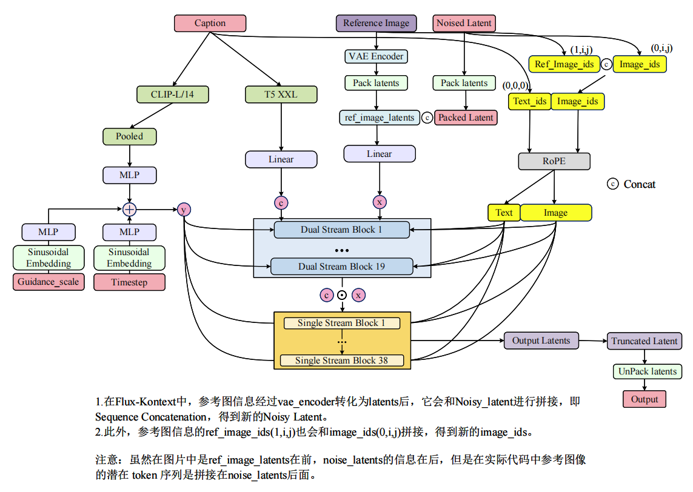

# FLUX.1 Kontext: 统一上下文图像生成与编辑的流匹配模型

## 目录
- [1. 模型定位与核心创新](#1-模型定位与核心创新)
- [2. 架构概览：在 FLUX.1 之上注入上下文](#2-架构概览在-flux1-之上注入上下文)
  - [2.1 Token 序列构建：上下文图像的拼接机制](#21-token-序列构建上下文图像的拼接机制)
  - [2.2 3D RoPE 位置编码：虚拟时间步偏移](#22-3d-rope-位置编码虚拟时间步偏移)
  - [2.3 双流与单流模块的上下文处理](#23-双流与单流模块的上下文处理)
- [3. 训练目标：条件流匹配与分布建模](#3-训练目标条件流匹配与分布建模)
  - [3.1 条件分布建模：p(x | y, c)](#31-条件分布建模px--y-c)
  - [3.2 修正流匹配损失（Rectified Flow Loss）](#32-修正流匹配损失rectified-flow-loss)
  - [3.3 时间步调度与 Logit-Normal 偏移（μ）](#33-时间步调度与-logit-normal-偏移μ)
- [4. 推理加速：LADD 蒸馏与多版本策略](#4-推理加速ladd-蒸馏与多版本策略)
  - [4.1 潜在对抗扩散蒸馏（LADD）](#41-潜在对抗扩散蒸馏ladd)
  - [4.2 模型版本差异：Pro / Dev / Max](#42-模型版本差异pro--dev--max)
- [5. 与 FLUX.1 及 SD 系列的本质区别](#5-与-flux1-及-sd-系列的本质区别)

## 1. 模型定位与核心创新

FLUX.1 Kontext 是 Black Forest Labs 在 FLUX.1 基础上推出的统一图像生成与编辑模型。它通过 **简单的序列拼接（Sequence Concatenation）** 机制，将上下文图像（Context Image）注入流匹配（Flow Matching）框架，实现了单架构下的多模态图像处理。

与当前编辑模型普遍存在的三大短板——**(i) 合成数据带来的编辑多样性受限、(ii) 多轮编辑中角色/物体外观漂移、(iii) 自回归或多步采样导致的交互延迟**——相比，FLUX.1 Kontext 提供了三大核心优势：

* **角色一致性**：在多轮迭代编辑中保持人物身份、物体外观和纹理细节的稳定性。
* **交互速度**：1024×1024 图像生成仅需 **3–5 秒**，比同类系统快一个数量级。
* **统一架构**：同一网络同时处理文本到图像（T2I，当 y = ∅）和图像到图像（I2I，当 y ≠ ∅）任务，无需针对编辑任务单独微调或训练 LoRA。

> 💡 **原理解析：为什么“简单拼接”反而有效？**
>
> 在早期的多模态扩散模型中，常见的上下文注入方式包括通道拼接（Channel-wise Concatenation）或交叉注意力（Cross-Attention）。FLUX.1 Kontext 的论文指出，他们在初始实验中测试了通道拼接，但发现性能更差。
>
> 序列拼接（将上下文图像的 Latent Token 直接拼接到目标图像 Token 序列末尾）的优势在于：
> 1. **保留空间结构**：每个图像 Token 仍通过 3D RoPE 编码保持其内部空间坐标关系，不会因通道维度的压缩而丢失几何信息。
> 2. **支持任意分辨率**：拼接操作天然兼容不同长宽比和分辨率的输入/输出，无需固定尺寸。
> 3. **可扩展至多图**：逻辑上可直接扩展为 y₁, y₂, ..., yₙ 的多上下文输入，尽管当前版本主要聚焦单图上下文。

---

## 2. 架构概览：在 FLUX.1 之上注入上下文

FLUX.1 Kontext 完全继承了 FLUX.1 的 DiT（Diffusion Transformer）骨干，包括 16 通道 VAE、T5-XXL + CLIP-L 双文本编码器，以及 19 层双流 + 38 层单流的 Transformer 结构。其创新点在于**如何在不修改主干网络结构的前提下，将上下文图像作为条件注入**。

### 2.1 Token 序列构建：上下文图像的拼接机制

与 FLUX.1 类似，图像首先通过冻结的 FLUX 自编码器编码为潜在 Token。设目标图像（去噪目标）的 Latent 为 x，可选的上下文图像为 y，文本指令为 c。

**在视觉流（Visual Stream）中，目标图像的潜变量 x 和上下文图像的潜变量 y 分别经过 Pack Latents 操作，将原本 `[Batch, Channels, Height, Width]` 的 4D 张量转换为 3D 序列张量 `[Batch, Length, Dim]`。随后，两个序列在序列长度维度（Length）上进行拼接，形成统一的视觉 Token 流。**

具体而言，目标图像经空间分组（Spatial Packing）后得到长度为 L_x 的 Token 序列；上下文图像经相同操作后得到长度为 L_y 的序列。二者拼接后的总长度为 L_x + L_y，维度保持不变。文本条件 c 经 T5-XXL 和 CLIP-L 编码后，与拼接后的视觉序列共同进入双流 Transformer 模块。

* **当 y ≠ ∅（图像编辑/上下文生成）**：上下文图像 Token 被拼接到目标图像 Token 之后，两者共享相同的视觉流权重。
* **当 y = ∅（纯文本生成）**：直接省略所有上下文 Token，模型退化为标准的 FLUX.1 文本到图像生成器。

> 💡 **思考：为什么不在像素空间拼接？**
>
> FLUX 系列（包括 Kontext）完全在 Latent 空间操作。VAE 将 1024×1024 的图像压缩为 128×128×16 的 Latent，序列长度和计算复杂度降低了 64 倍。如果在像素空间拼接，Transformer 的 Self-Attention 复杂度将随像素数平方增长，根本无法实现 3–5 秒的交互式推理。

### 2.2 3D RoPE 位置编码：虚拟时间步偏移

FLUX.1 Kontext 使用 **3D 旋转位置编码（3D RoPE）** 来区分目标图像和上下文图像的空间位置。每个 Token 的位置由三元组 `(t, h, w)` 索引，其中 h 和 w 为潜空间中的空间坐标，t 为虚拟时间步（Temporal Coordinate），用于区分不同图像。

具体设置：
* **目标图像 Token x**：位置三元组设为 `(0, h, w)`，即虚拟时间步 t = 0。
* **上下文图像 Token y**：位置三元组设为 `(i, h, w)`，其中 i = 1, ..., N（N 为上下文图像数量）。对于单图上下文条件，i 恒为 1。

它们共同经过旋转位置编码（RoPE），分别输出文本与图像的位置信息，让 Transformer 在计算注意力时能够明确每个 Token 的绝对与相对空间位置关系。

这种设计的精妙之处在于：
1. **空间结构保留**：上下文图像内部的空间坐标 `(h, w)` 保持原样，因此模型仍能感知其内部的几何关系。
2. **模态隔离**：通过 t 维度的偏移，模型在注意力计算中能清晰区分“我要生成的内容”（t=0）和“我参考的内容”（t=1），避免两者在空间上的混淆。
3. **多图扩展性**：当支持多图上下文时，只需递增 i 即可。

### 2.3 双流与单流模块的上下文处理

FLUX.1 Kontext 保留了 FLUX.1 的 **19 层双流（Dual Stream）+ 38 层单流（Single Stream）** 架构，但上下文 Token 的流动方式值得深入分析：

**第一阶段：双流模块（Block 1-19）**
* 文本特征 c 和视觉特征（x 与 y 的拼接序列）分别进入独立的流。
* 上下文图像 Token y 和目标图像 Token x 在视觉流中**共享同一套 QKV 投影权重**
* 在此阶段，模型初步建立“文本指令 ↔ 上下文图像 ↔ 目标图像”的三方对齐关系。

**过渡：特征拼接（Concatenation）**
* 经过 19 层双流处理后，文本 Token 和视觉 Token（含 x 和 y）在序列维度上被拼接为一个统一的跨模态序列。

**第二阶段：单流模块（Block 1-38）**
* 统一序列中的目标 Token、上下文 Token 和文本 Token 现在**共享完全相同的自注意力参数**。
* 上下文图像 y 的信息通过全局 Self-Attention 直接“融化”到目标图像 x 的每个 Token 中，实现像素级的精确指导。
* 由于上下文 Token 带有 t=1 的 RoPE 偏移，模型能在深度融合的同时，保持对参考图像和生成图像的身份区分。

---

## 3. 训练目标：条件流匹配与分布建模

FLUX.1 Kontext 的训练目标是学习条件分布 `p(x | y, c)`，其中 x 是目标图像，y 是上下文图像（或空集 ∅），c 是文本指令。

### 3.1 条件分布建模：p(x | y, c)

与经典文本到图像生成（仅建模 p(x | c)）不同，Kontext 需要学习**图像之间的关系**，这种关系由文本指令 c 中介。因此，训练数据的核心是**关系对（Relational Pairs）**：

$$
(x, y, c) \sim \mathcal{D}_{\text{edit}}
$$

其中：
* x：编辑后的目标图像（或新生成图像）。
* y：原始上下文图像（或 ∅）。
* c：自然语言指令（如 "make her laugh"、"remove the thing from her face"）。

模型从预训练的 FLUX.1 文本到图像检查点初始化，然后在数百万这样的关系对上继续训练。

### 3.2 修正流匹配损失（Rectified Flow Loss）

FLUX.1 Kontext 沿用 FLUX.1 的修正流（Rectified Flow）框架，但将条件扩展为 `(y, c)`。其训练损失为：

$$
\mathcal{L}_{\theta} = \mathbb{E}_{t \sim p(t), x, y, c, \varepsilon} \left[ \| v_{\theta}(z_t, t, y, c) - (x - \varepsilon) \|_2^2 \right]
$$

其中：
* $z_t = (1-t)x + t\varepsilon$：线性插值的潜变量（从数据 x 到噪声 ε）。
* $v_{\theta}$：模型预测的速度场（Velocity Field）。
* $x - \varepsilon$：真实的速度方向（从噪声指向数据的直线）。

> 💡 **思考：为什么是 Velocity Prediction，而不是 Noise Prediction？**
>
> 这是 Flow Matching 与 DDPM 的本质区别。在 SD1.5/SDXL 中，模型学习预测噪声 $\varepsilon$，然后通过重参数化逐步去噪。而在 Rectified Flow 中，模型学习的是**概率路径的切线方向**（即速度场 $v$）。
>
> * 数学优势：Rectified Flow 的传输路径是直线（ODE），推理时可以用更少的步数（甚至单步）逼近目标分布。
> * 速度优势：这使得 FLUX.1 Kontext 在配合 LADD 蒸馏后，能够实现 3–5 秒的极速生成。

### 3.3 时间步调度与 Logit-Normal 偏移（μ）

在训练时，时间步 $t$ 从 Logit-Normal 分布中采样：

$$
p(t) = \frac{\exp\left(-0.5 \cdot (\text{logit}(t) - \mu)^2 / \sigma^2\right)}{\sigma \sqrt{2\pi} \cdot (1-t) \cdot t}
$$

其中 $\text{logit}(t) = \log\frac{t}{1-t}$。

**关键创新：基于分辨率的动态 μ 偏移**

FLUX.1 Kontext 继承了 FLUX.1 的动态调度策略，但将其应用于上下文编辑任务。μ 根据图像序列长度（分辨率对应的 Token 数量）进行线性映射。设基础序列长度为 256，最大序列长度为 4096，基础偏移为 0.5，最大偏移为 1.15，则 μ 的计算遵循线性插值：

$$
\mu = 0.5 + \frac{0.65 \cdot (L - 256)}{3840}
$$

其中 L 表示当前图像经 Pack 后的序列长度。在推理时，偏移后的时间步通过以下公式重分布：

$$
t' = \frac{\exp(\mu)}{\exp(\mu) + (1/t - 1)^\sigma}
$$

* **低分辨率（如 256 Token）**：μ ≈ 0.5，去噪曲线接近线性。
* **高分辨率（如 4096 Token）**：μ ≈ 1.15，曲线变得上凸，模型在**高噪声阶段（初期）停留更久**，更仔细地构建宏观结构。

> 💡 **核心目的：照顾高分辨率编辑**
>
> 高分辨率图像包含更强的原始信号。如果均匀去噪，模型在初期无法充分打破像素依赖，导致构图或结构生成不佳。μ 偏移强制模型将更多计算步数倾斜到早期高噪声阶段，确保高清编辑时的整体结构稳定性。

---

## 4. 推理加速：LADD 蒸馏与多版本策略

### 4.1 潜在对抗扩散蒸馏（LADD）

标准流匹配推理需要 50–250 步网络评估，这对于交互式应用过于缓慢。FLUX.1 Kontext 采用 **Latent Adversarial Diffusion Distillation (LADD)** 来加速：

* **核心思想**：使用对抗训练（Adversarial Training）将多步采样蒸馏为少步（甚至单步）生成。
* **优势**：不仅减少步数，还通过判别器（Discriminator）的反馈提升样本质量，避免传统蒸馏常见的模糊或模式崩溃问题。
* **副作用**：偶尔会在高纹理区域引入轻微的视觉伪影。

### 4.2 模型版本差异：Pro / Dev / Max

FLUX.1 Kontext 提供三个版本，针对不同的计算资源和应用场景：

| 版本 | 训练策略 | 参数量 | 特点 | 适用场景 |
|------|---------|--------|------|----------|
| **[pro]** | 流目标 + LADD | 完整 | 最高质量，支持 T2I 和 I2I | 专业创作、高质量编辑 |
| **[dev]** | Guidance Distillation 到 12B DiT | 12B | 仅专注 I2I（图像编辑），速度更快 | 快速原型、交互式编辑 |
| **[max]** | 更多计算资源（Pro 的扩展版） | 完整 | 在 Pro 基础上增加推理计算，质量最佳 | 极致质量要求 |

> 💡 **思考：为什么 Dev 版本只训练 I2I？**
>
> Dev 版本通过 Guidance Distillation（引导蒸馏）将 12B 的 DiT 压缩为高效的编辑专用模型。由于蒸馏过程需要精确对齐教师模型的条件分布，排除纯 T2I 任务可以让模型将所有容量集中在图像到图像的映射学习上，从而在编辑任务上获得更优的性价比。

---

## 5. 与 FLUX.1 及 SD 系列的本质区别

| 维度 | SD1.5 / SDXL | FLUX.1 | FLUX.1 Kontext |
|------|---------------|--------|----------------|
| **核心架构** | UNet (CNN) | DiT (Transformer) | DiT (Transformer) |
| **生成范式** | Noise Prediction (DDPM/DDIM) | Rectified Flow Matching | **条件流匹配 + 上下文拼接** |
| **上下文注入** | 无原生支持（需 ControlNet/IP-Adapter） | 无 | **序列拼接 + 3D RoPE 偏移** |
| **文本编码器** | CLIP-L (SD1.5) / CLIP-L + OpenCLIP-G (SDXL) | T5-XXL + CLIP-L | T5-XXL + CLIP-L |
| **VAE 通道** | 4 通道 | 16 通道 | 16 通道 |
| **位置编码** | 2D 正弦/卷积归纳偏置 | 3D RoPE | **3D RoPE + 虚拟时间步 t** |
| **编辑一致性** | 差（多轮漂移严重） | 中等 | **优秀（AuraFace 相似度 > 0.9）** |
| **推理速度** | 中等（20–50 步） | 较快（4–50 步） | **极快（3–5 秒 @ 1024²）** |
| **训练方式** | 独立训练 | 独立训练 | **从 FLUX.1 检查点微调** |