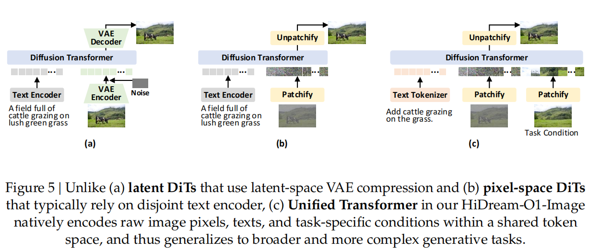
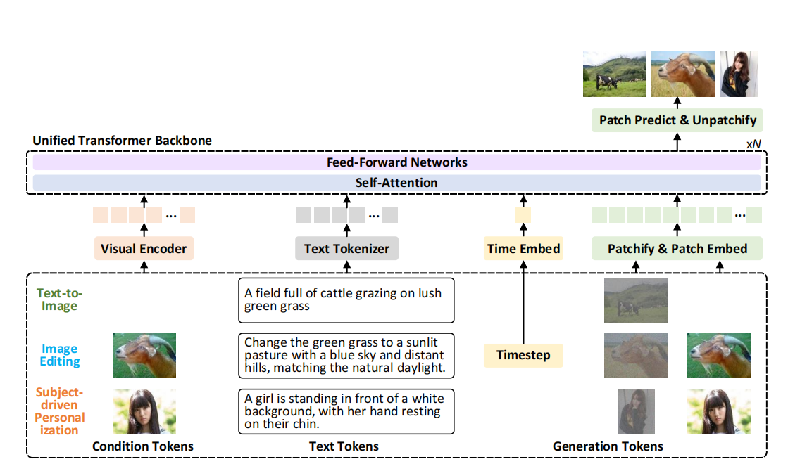

# HiDream-O1-Image: 原生统一的像素级统一Transformer图像生成基础模型

## 目录
- [一、背景与核心动机：从模块化到原生统一](#一背景与核心动机从模块化到原生统一)
  - [1.1 传统 latent-space DiT 的瓶颈](#11-传统-latent-space-dit-的瓶颈)
  - [1.2 现有 pixel-space DiT 的局限](#12-现有-pixel-space-dit-的局限)
  - [1.3 HiDream-O1-Image 的范式革新](#13-hidream-o1-image-的范式革新)
- [二、数据筛选与 Prompt 构建](#二数据筛选与-prompt-构建)
  - [2.1 数据源收集与任务覆盖](#21-数据源收集与任务覆盖)
  - [2.2 数据去重策略](#22-数据去重策略)
  - [2.3 质量与安全过滤](#23-质量与安全过滤)
  - [2.4 VLM-based Prompt 构建](#24-vlm-based-prompt-构建)
- [三、模型架构：HiDream-O1-Image](#三模型架构hidream-o1-image)
  - [3.1 推理驱动的 Prompt Agent](#31-推理驱动的-prompt-agent)
  - [3.2 统一多模态 Tokenization](#32-统一多模态-tokenization)
    - [文本 Tokens](#文本-tokens)
    - [条件 Tokens](#条件-tokens)
    - [生成 Tokens](#生成-tokens)
  - [3.3 统一 Transformer (UiT) 架构](#33-统一-transformer-uit-架构)
    - [Backbone 设计](#backbone-设计)
    - [混合统一注意力机制 (Hybrid Unified Attention)](#混合统一注意力机制-hybrid-unified-attention)
  - [3.4 整体训练目标](#34-整体训练目标)
- [四、模型训练策略](#四模型训练策略)
  - [4.1 渐进式通用预训练](#41-渐进式通用预训练)
  - [4.2 后训练：SFT + RLHF](#42-后训练sft--rlhf)
- [五、对抗扩散蒸馏：加速推理](#五对抗扩散蒸馏加速推理)
- [六、性能对比与评测](#六性能对比与评测)
  - [6.1 通用文本到图像生成](#61-通用文本到图像生成)
  - [6.2 高保真文本渲染](#62-高保真文本渲染)
  - [6.3 图像编辑能力](#63-图像编辑能力)
  - [6.4 主体驱动个性化生成](#64-主体驱动个性化生成)
- [七、总结与核心贡献](#七总结与核心贡献)

---

## 一、背景与核心动机：从模块化到原生统一

### 1.1 传统 latent-space DiT 的瓶颈

当前主流的视觉生成模型仍然以 **Latent Diffusion Models (LDMs)** 为范式核心。如上图 (a) 所示，这类模型依赖一个模块化的、碎片化的流水线：

1. **预训练 VAE**：将原始图像压缩到 latent 空间，通常有 4~16 个通道。
2. **独立的文本编码器**：使用 CLIP 或 T5 等预训练语言模型对文本 prompt 进行编码。
3. **扩散 Transformer (DiT)**：在 latent 空间中进行去噪。

虽然计算效率较高，但这种**分离式编码**（disjoint encoding）不可避免地引入了信息瓶颈：
- **高频视觉细节丢失**：VAE 的压缩过程会损失细粒度纹理、文字笔画、边缘结构等高频信息，从而限制了生成保真度的上限。
- **语义对齐受限**：视觉和文本编码空间是分离的，两者并非从底层开始联合优化，存在固有的语义错位（semantic misalignment）。

### 1.2 现有 pixel-space DiT 的局限

为了绕过 latent-space 压缩的结构限制，近期一些工作探索了 **pixel-space Diffusion Transformers**（上图 (b)）。这类方法直接在原始图像像素上建模扩散过程，在文本到图像生成中展现了 promising 的视觉保真度和细节保留能力。

然而，大多数现有的 pixel-space DiT 仍然**严重依赖分离的、现成的文本编码器**（如 T5 或 CLIP）。这种视觉与文本编码空间的隔离仍然面临语义错位问题。此外，这些模型通常**只针对单一任务**（主要是 T2I）进行专门化设计，难以泛化到更广泛的复杂场景，如基于指令的图像编辑（instruction-based editing）和主体驱动的个性化生成（subject-driven personalization）。

### 1.3 HiDream-O1-Image 的范式革新

HiDream-O1-Image 提出了 **Pixel-level Unified Transformer** 架构，彻底抛弃了传统的碎片化编码范式（上图 (c)）。其核心思想是：

> **将原始图像像素、离散文本 token 和辅助任务特定条件直接映射到一个单一的、连续的共享 token 空间。**

这种结构统一使得所有多模态输入能够在统一的 Transformer 架构中以端到端方式协同处理。由此，多样化的生成和编辑任务不再被视为需要专门模块的孤立问题，而是被重构为**一致的上下文视觉推理过程**（consistent in-context visual reasoning process）。

此外，为了弥合复杂用户意图与模型偏好输入之间的语义鸿沟，HiDream-O1-Image 引入了**推理驱动的 Prompt Agent**，具备显式的"思考"（thinking）机制，能够在送入生成流水线前对复杂用户指令进行推理和精炼。

> 💡 **思考：为什么"统一 token 空间"如此重要？**
>

> 在 NLP 领域，将多样化任务统一到单一共享 token 空间的成功（即 LLM 的 in-context reasoning）为视觉生成模型提供了关键启示。HiDream-O1-Image 的核心创新在于将这一范式迁移到视觉生成：
> - **消除模态边界**：不再区分"文本编码器输出"和"图像编码器输出"，所有信号都是同一空间中的 token。
> - **端到端联合优化**：视觉和语言从底层开始联合训练，避免了分离编码器带来的语义错位。
> - **任务统一**：T2I、编辑、个性化等任务本质上都变成了"在共享 token 空间中的上下文推理"，模型通过统一的 self-attention 机制处理所有输入，无需为不同任务设计专门模块。

---

## 二、数据筛选与 Prompt 构建

高质量、大规模的训练数据是扩展通用图像生成的基础。HiDream-O1-Image 构建了一个专门的数据引擎，将异构原始源转换为高质量的图像-文本对、编辑三元组和主体参考样本。

### 2.1 数据源收集与任务覆盖

数据收集从公共网络语料库和内部授权集合中组装了一个大型候选池。除了标准图像-文本对外，刻意扩展了源分布以覆盖所有主要训练场景：

| 任务类型 | 数据来源与特点 |
| :--- | :--- |
| **文本到图像 (T2I)** | 标准图像-文本对；额外增加复杂图文排版数据（演示文稿、海报、文档、长文本图像），提供密集排版、结构化构图和混合图文布局的监督；增加风格导向样本（摄影风格、插画风格、设计模板等） |
| **指令编辑 (Editing)** | 公共编辑数据集、内部合成的前后对比对、视频派生样本（不同帧提供物体变化、背景转换、动作变化、局部属性修改的自然监督） |
| **主体个性化 (IP)** | 以人为中心的参考集（同一人的多张照片，覆盖姿势、表情、视角、光照、场景）；以物体为中心的参考集（同一物品在不同背景和配置下的重复出现） |
| **多面板生成 (Multi-panel)** | 网格图像 + 视频不同片段的帧组合样本，使模型学习序列变化、面板级一致性和更丰富的空间组织 |

### 2.2 数据去重策略

大规模网络集合不可避免地包含重复或高度相似的图像。直接全量两两比较不可行，因此采用两步去重：

1. **视觉特征分组**：使用 SSCD 模型提取图像表示。用 200 万样本的代表性子集拟合 k-means 质心，将特征空间划分为 16,000 个簇，使潜在重复项被路由到相同的局部搜索空间。
2. **簇级相似性搜索**：在每个簇内，使用 GPU 加速的 Faiss 进行最近邻检索。相似度分数超过预设阈值的样本被视为近重复项，仅保留一个代表性图像。

此阶段约移除 **20%** 的初始候选，同时保留数据的语义覆盖度。

### 2.3 质量与安全过滤

去重后，使用一组互补模型进行进一步过滤：

| 过滤维度 | 方法 |
| :--- | :--- |
| **安全评估** | 预训练 NSFW 分类器检测并移除不当图像 |
| **美学评估** | 美学评分模型抑制视觉吸引力差的图像，同时保持风格多样性 |
| **水印检测** | 专用水印检测器过滤含显著水印的图像 |
| **任务一致性评估** | 对编辑和 IP 数据，使用 VLM 验证样本是否构成有效任务实例（编辑数据：前后对是否有可解释的视觉变化；IP 数据：参考图像是否对应同一人/物） |
| **技术质量评估** | 移除低 Top-IQ 分数样本；临时编码为 JPEG 估计 bytes-per-pixel 比率，异常低的比率表明严重压缩伪影或视觉细节不足 |

### 2.4 VLM-based Prompt 构建

对于大规模 prompt 生成，使用 **Qwen3-VL** 将每个过滤样本的元数据和提取的视觉-文本信号转换为训练 prompt。模型利用可用的辅助信息（用户标签、源描述、OCR 文本、布局线索、风格标签），生成更符合 Unified Transformer 期望的指令格式。

Prompt 构建强调**事实性、视觉特异性和可控多样性**：

- **自然图像**：描述显著物体、属性、空间关系、场景上下文和风格。
- **图文排版/长文本**：保留关键文本内容、阅读顺序和布局结构。
- **编辑样本**：比较源图像和目标图像，生成简洁的编辑指令，解释预期的视觉变换，同时避免对保留区域的不必要修改。
- **IP 样本**：总结参考人或物体的身份定义属性，构建将主体置于新场景同时显式保留其外观的 prompt。
- **多面板样本**：描述全局排列和面板级差异，使模型学习网格构图和时间帧一致性。

此外，通过短、中、详细描述变化 prompt 粒度，使最终训练语料更好地反映真实用户输入的多样性。

---

## 三、模型架构：HiDream-O1-Image

HiDream-O1-Image 是一个**像素级统一 Transformer**，在单一共享 token 空间中桥接高保真像素空间合成与通用上下文推理。为了验证结构的可扩展性和通用性，实例化了两个不同规模：
- **8B 参数版本**：高效部署，从 Qwen3-VL-8B-Instruct 初始化以利用其鲁棒的多模态预对齐能力。
- **200B+ 参数版本**：推动像素级统一 Transformer 架构的极限，解锁更强的复杂视觉推理和高分辨率合成能力。

### 3.1 推理驱动的 Prompt Agent

当前图像生成模型的显著瓶颈在于**原始用户意图与生成流水线所需的密集描述性 prompt 之间的语义鸿沟**。用户输入往往模糊、抽象或过于简洁，而模型需要结构化、详细的条件才能生成高质量结果。

HiDream-O1-Image 引入了基于 **Gemma** 的**推理驱动 Prompt Agent**，具备显式的"思考"机制：

1. **接收复杂用户查询**：不直接转发文本，而是显式推理查询中隐含的空间布局、主体属性、物理逻辑和上下文关系。
2. **生成思维链（Chain of Thought）**：在输出最终 prompt 前，先生成一段内部推理过程，逐步分解和细化用户意图。
3. **输出精炼 Prompt**：将原始输入转换为高度明确、结构对齐的文本条件。

> 💡 **思考：Prompt Agent 的作用是什么？**
>

> 这类似于 LLM 中的"推理时扩展"（inference-time scaling）。对于视觉生成而言，复杂指令（如"生成一张带有特定排版、多主体交互、特定光照和风格的广告图"）需要被分解为模型可理解的结构化描述。Prompt Agent 的"思考"机制确保：
> - 空间关系被正确解析（如"左边是 A，右边是 B，A 拿着 C"）。
> - 属性被完整保留（如"穿着蓝白条纹衬衫、黑色裤子、棕色便鞋的 8-10 岁男孩"）。
> - 物理逻辑被尊重（如"日落时的暖金色光线"、"木质甲板的剥落蓝漆"）。
>

> 这种显式推理显著增强了模型对复杂、推理密集型视觉生成和编辑任务的指令跟随能力。

### 3.2 统一多模态 Tokenization

HiDream-O1-Image 的核心是**将异构模态结构统一到一个单一共享 token 空间**。如下图所示，训练期间定义了全面的统一多模态 tokenization 方案，将各种输入编码到共享空间：

#### 文本 Tokens ($y$)

由推理驱动 Prompt Agent 输出的精炼文本 prompt $y$，通过主干网络的原生词汇表转换为离散 token，进一步映射到共享空间。

#### 条件 Tokens ($c$)

对于需要视觉 grounding 的生成任务（如编辑或主体驱动个性化），输入上下文图像 $c$（如编辑源图像或参考主体）使用**视觉编码器（SigLip2）**投影为语义丰富的 token。然后通过**可学习的投影层**将这些语义丰富的 token 对齐到共享空间。

#### 生成 Tokens ($x_t$)

对于每个目标图像 $x$，通过 clean 图像 $x$ 与高斯噪声 $\varepsilon \sim \mathcal{N}(0, I)$ 的线性插值构建生成 token $x_t$（即噪声样本）：

$$
x_t = t \cdot x + (1 - t) \cdot \varepsilon
$$

其中 $t$ 表示扩散时间步。生成 token 被划分为不重叠的 patch，并通过**可学习的 patch embedding 层**投影到共享空间。

> 💡 **思考：三种 token 如何在共享空间中协同？**
>

> 三种 token 在输入序列中拼接后，由统一的 Transformer 块堆栈进行上下文编码：
> - **文本 token**：提供高层语义指令和描述。
> - **条件 token**：提供具体的视觉参考（如"把这个人换成参考图中的样子"）。
> - **生成 token**：表示当前需要去噪的目标图像（带噪声的像素 patch）。
>

> 这种设计使得模型能够在统一的 self-attention 机制下，让文本描述、视觉参考和噪声图像 patch 之间自由交互。例如，在编辑任务中，模型可以让"生成 token" attend to "条件 token"（源图像）和"文本 token"（编辑指令），从而精确地只修改指定区域，同时保留未编辑区域。

### 3.3 统一 Transformer (UiT) 架构

#### Backbone 设计

主干网络基于**解码器-only Transformer 架构**（即统一 Transformer 块的堆栈），继承自大语言模型。两个变体均采用：
- **RMSNorm** 进行归一化
- **SwiGLU** 作为激活函数
- **RoPE** 进行位置编码

为了继承预训练的自回归能力，扩散时间步被编码为额外的专用 token。为了支持像素空间扩散过程，进一步引入了**可学习的输入和输出 patch embedding**，使主干网络能够直接建模像素空间，而无需修改不同规模下的核心 Transformer 结构。

#### 混合统一注意力机制 (Hybrid Unified Attention)

这是 UiT 架构中最精妙的设计之一。需要调和两个看似矛盾的注意力范式：

| 范式 | 特点 | 典型应用 |
| :--- | :--- | :--- |
| **因果注意力（Causal Attention）** | 每个 token 只能 attend to 序列中前面的 token，保持自回归性质 | 语言建模（LLM） |
| **全自注意力（Full Self-Attention）** | 每个 token 可以 attend to 所有其他 token，捕获全局空间依赖 | 图像合成（DiT） |

HiDream-O1-Image 通过**混合统一注意力机制**优雅地调和了这两种范式：

- **条件 token 和文本 token**：遵循**因果掩码（causal masking）**，只能 attend to 序列中前面的多模态 token。这保留了语言建模的自回归结构。
- **生成 token**：采用**全注意力（full attention）**，可以 attend to 所有 token，在去噪过程中实现全局上下文聚合。

> 💡 **思考：为什么需要混合注意力？**
>

> 这种设计的关键在于不同 token 类型的本质差异：
> - **文本/条件 token**：它们本质上是"指令"和"参考"，具有序列性和因果性。文本的生成（或理解）天然适合自回归方式——读到一个词后，下一个词依赖于前面的所有词。
> - **生成 token**：它们代表图像的像素 patch，在空间上是无序的（或至少不需要严格的因果顺序）。图像生成需要全局一致性——左上角的 patch 需要知道右下角的内容，才能确保整体结构协调。
>

> 如果强制所有 token 都使用因果注意力，图像 patch 之间无法充分交互，导致生成图像的空间一致性差。如果强制所有 token 都使用全注意力，会破坏文本的预训练自回归能力，且计算效率低。
>

> 因此，**混合注意力**是最佳折中：文本侧保持因果性以继承 LLM 能力，图像侧保持全局性以确保生成质量。

### 3.4 整体训练目标

为了在原始像素空间实现高保真图像合成，采用**联合优化目标**，平衡结构回归与感知对齐：

- **流匹配损失（Flow Matching Loss）**：用于图像预测，建模像素空间的细粒度空间细节。
- **感知监督约束**：扩散过程在像素空间虽然能捕获细粒度空间细节，但常难以建模长程语义一致性。因此耦合了：
  - **LPIPS 损失**：学习感知图像块相似度，确保生成图像在感知空间与目标一致。
  - **感知 DINO 损失**：利用 DINO 特征提供语义级监督。

联合目标确保模型既能重建精确像素，又能保持语义和感知层面的高质量。

---

## 四、模型训练策略

### 4.1 渐进式通用预训练

采用**三阶段渐进训练策略**，从基础对齐过渡到高分辨率通用合成。数据从粗到精筛选，图像分辨率逐步提升。所有阶段保留原始宽高比以支持灵活的多分辨率生成。

| 阶段 | 分辨率 | 核心目标 | 训练任务 | 关键配置 |
| :--- | :--- | :--- | :--- | :--- |
| **Stage I: 基础对齐** | 512 × 512 | 建立基础视觉-语言关联 | T2I + 语言建模 (LM) + 多模态理解 (MMU) | 混合图像-文本对和纯文本语料；**冻结 LLM，仅训练视觉编码器和适配器**；较大 batch size |
| **Stage II: 通用上下文学习** | 1,024 × 1,024 | 增强空间保真度和细粒度细节；扩展任务覆盖 | T2I + LM + MMU + 上下文生成/编辑（图像编辑、主体驱动个性化） | **全参数激活**；集成 Prompt Agent 的显式推理过程 |
| **Stage III: 高保真精修** | 2,048 × 2,048 | 超高分率下的细粒度细节和感知质量精修 | 仅限超高分辨率子集 | 专注细节 refinement |

> 💡 **思考：为什么第一阶段要冻结 LLM？**
>

> 第一阶段的核心目标是**让视觉编码器学会将像素 patch 映射到语言模型的语义空间**，而不是改变语言模型本身的语言能力。如果一开始就全参数训练，强大的视觉信号可能会"冲垮" LLM 预训练获得的语言知识和推理能力，导致灾难性遗忘。
>

> 通过冻结 LLM，强制视觉侧（编码器 + 适配器）去"适配" LLM 的语义空间，确保模型在学会"看图"的同时，保留"读懂 prompt"和"遵循指令"的基础能力。

### 4.2 后训练：SFT + RLHF

预训练后，采用两阶段后训练范式逐步精炼推理能力和生成质量：

**Stage I: SFT（监督微调）**
- 构建包含数十万样本的混合训练语料，反映高质量构图一致性、光照一致性、摄影真实感和跨艺术域的风格保真度。
- 包含**高质量推理轨迹**来微调 Prompt Agent，确保其持续生成结构对齐且明确的 prompt。
- **关键变化**：将预训练中的 Logit-Normal 采样策略替换为**均匀采样**，确保时间步覆盖平衡，增加对捕获细粒度视觉细节的后期去噪步骤的有效训练 emphasis。

**Stage II: RLHF（基于人类反馈的强化学习）**
- 采用 **GRPO** 进一步对齐模型与人类偏好。
- 构建**复合优势函数**，聚合多个奖励模型的信号：
  - OCR 准确性
  - 美学评估
  - 指令跟随保真度
  - 推理质量
- 该聚合目标能够针对性地提升摄影真实感、美学质量、文本渲染准确性、语义一致性和逻辑推理，同时有效抑制伪影。

---

## 五、对抗扩散蒸馏：加速推理

完整版 HiDream-O1-Image 推理通常采用约 **50 步**去噪。虽然确保了强视觉质量，但迭代过程在延迟敏感场景中可能受限。

为此，构建 **HiDream-O1-Image-Dev** 作为高效变体，采用 **28 步**采样器实现更快生成。蒸馏过程训练学生模型在减少步数下近似教师模型的生成行为。

**核心目标：DMD (Distribution Matching Distillation)**
- 对齐学生模型预测的轨迹分布与完整 HiDream-O1-Image 模型的轨迹分布。
- 保留标准扩散损失作为辅助监督项，提高训练稳定性并缓解蒸馏过程中的优化振荡。

**对抗学习**
- 将学生模型视为生成器，与判别器网络联合优化。
- 判别器比较真实图像与学生模型像素空间预测重建的图像。
- 判别器的分类由冻结教师主干提取的多级特征引导。

**最终蒸馏目标**：

$$
\mathcal{L}_{\text{total}} = \mathcal{L}_{\text{DMD}} + \lambda_{\text{diff}} \mathcal{L}_{\text{diff}} + \lambda_{\text{adv}} \mathcal{L}_{\text{adv}}
$$

> 💡 **思考：为什么需要对抗学习？**
>

> 纯蒸馏（DMD + 扩散损失）虽然能让学生模型模仿教师的"去噪动态"，但在像素空间直接预测时，学生模型的输出往往比教师更"模糊"或缺乏锐度。这是因为少步数蒸馏本质上是一个压缩问题——学生需要在更少迭代中完成相同的信息量恢复。
>

> 引入对抗判别器后，判别器强制学生输出的图像在感知上与真实图像难以区分，且教师的多级特征指导确保对抗信号与教师的高级语义一致。这有效保留了感知保真度和图像锐度，使 28 步版本仍能保持接近 50 步版本的视觉质量。

---

## 六、性能对比与评测

### 6.1 通用文本到图像生成

在 GenEval、DPG 和 HPSv3 上的定量结果表明：

- **HiDream-O1-Image (8B)**：显著超越同规模现有开源模型（如 Z-Image-Turbo、SD3.5 Large、Janus-Pro-7B）。
- **HiDream-O1-Image-Pro (200B+)**：达到 SOTA 保真度，超越领先闭源模型（如 GPT Image 2 和 Seedream-4.0）。

这种优势源于结构统一设计：通过将视觉和语言投影到原生共享 token 空间，HiDream-O1-Image 绕过了传统范式中分离文本编码器和图像生成器固有的语义鸿沟，实现了更优越的跨模态对齐。

### 6.2 高保真文本渲染

在 CVTG-2K 和 LongText-Bench 上严格测试：

- **CVTG-2K**：HiDream-O1-Image 在大多数指标上获得最高分。
- **LongText-Bench**：8B 模型与参数量大得多的 Qwen-Image (27B) 表现相当；200B+ 模型进一步突破超长文本渲染边界，建立新 SOTA。

这一飞跃直接源于端到端像素空间生成框架：通过绕过分离模态编码中的中间文本到视觉转换瓶颈，并避免有损 VAE 压缩，模型实现了精确的文本-图像对齐，同时缓解了视觉文本渲染中的结构扭曲。

### 6.3 图像编辑能力

在 GEdit 和 ImgEdit 上全面评估：

- **8B 模型**：与多个显著更大的竞争对手（如 16.8B FLUX.1 Kontext 和 27B Qwen-Image-Edit）取得可比结果。
- **200B+ 模型**：建立新 SOTA，超越顶级专有模型处理高度复杂、细粒度操作的能力。

这验证了核心方法选择的有效性：在原生共享 token 空间内统一视觉和语言输入，本质上消解了模态壁垒，鼓励语义概念精确 grounding 到对应空间区域，触发有效的上下文生成过程。

### 6.4 主体驱动个性化生成

在自建的 **UniSubject** 测试集（300 个测试案例，共 1.8K 主体）上评估：

- 8B 模型在 4-8 主体和 9-11 主体配置下，相比基线（如 Scone、Echo-4o）有显著提升。
- 200B+ 旗舰模型在极端多主体场景下仍保持优越的多主体组合性和身份保留。

核心催化剂是共享 token 空间：文本提示中的语义概念被精确锚定到对应的细粒度视觉提示（映射的视觉 token），产生连贯的融合主体表示。随着参考主体数量增加，这种表示有效缓解了典型分离编码器设计中指令与参考图像之间的干扰。

---

## 七、总结与核心贡献

HiDream-O1-Image 是一个**原生统一的生成基础模型**，通过像素级统一 Transformer 超越了传统分离 latent-space VAE 压缩和文本编码范式的限制。

### 核心贡献

1. **原生统一生成架构**：提出端到端像素级统一 Transformer，完全摒弃外部 VAE 和分离文本编码器。将原始像素、文本 token 和任务条件映射到单一共享 token 空间，将多样化视觉生成和编辑任务重构为一致的上下文视觉推理过程。

2. **推理驱动 Prompt Agent**：引入并开源具备"思考"机制的 Prompt Agent。通过显式推理和精炼复杂用户指令，显著提升模型对复杂、推理密集型视觉生成任务的指令跟随能力。

3. **8B 规模的卓越效率与通用性**：统一范式以高效率实现 SOTA 性能，全面覆盖多样化生成场景。包括多样化电影镜头、艺术风格、复杂长文本渲染、指令编辑、主体个性化和故事板多面板生成。在多方面场景中，与参数量显著更大的开源 latent-space DiT（如 27B Qwen-Image）和领先闭源商业模型（如 Nano Banana 2.0）达到同等或超越性能。

4. **200B+ 参数的极致可扩展性**：成功将架构扩展到超过 200B 参数，验证原生统一范式的 scaling laws。该大规模版本解锁前所未有的生成能力、视觉保真度和复杂推理，在广泛生成任务中建立新 SOTA 基准。

> 💡 **思考：HiDream-O1-Image 的范式意义**
>

> HiDream-O1-Image 的核心价值不仅在于性能数字，而在于它证明了**视觉生成模型可以像 LLM 一样走"统一架构 + 规模扩展"的路线**：
> - 不再需要为每个任务设计专门模块（ControlNet、IP-Adapter、InstructPix2Pix 等都可以被统一上下文推理吸收）。
> - 不再需要依赖外部预训练编码器的"缝合"（VAE、CLIP、T5 的分离组合被单一端到端架构替代）。
> - 像素空间的直接建模 + 共享 token 空间 + 混合注意力，为下一代多模态 AI 指明了一条高度可扩展的路径。
