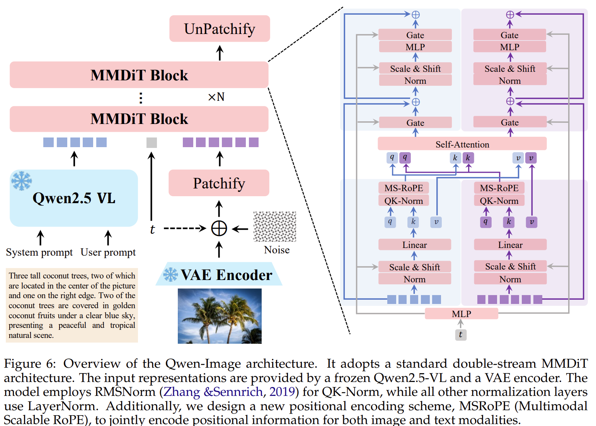
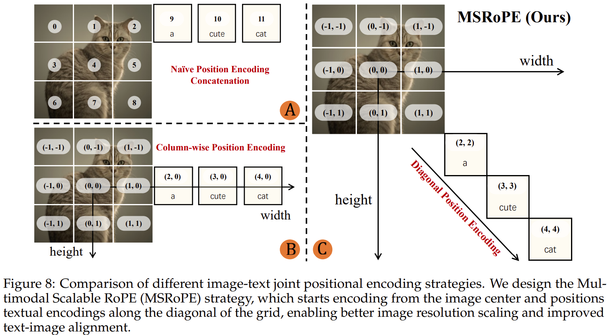
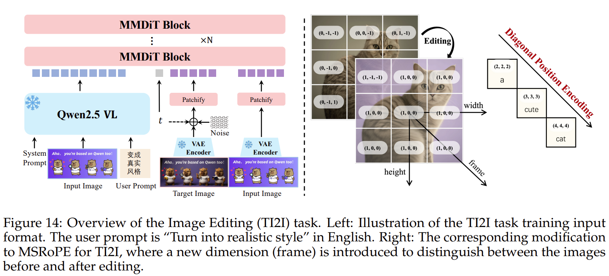

# Qwen-Image

## 目录
- [1. 生成范式与训练目标：Flow Matching + Rectified Flow](#1-生成范式与训练目标flow-matching--rectified-flow)
  - [1.1 为什么采用 Flow Matching 作为训练目标？](#11-为什么采用-flow-matching-作为训练目标)
  - [1.2 基于速度预测的 MSE 损失](#12-基于速度预测的-mse-损失)
- [2. 模型架构：Qwen2.5-VL + 双解码器 VAE + MMDiT](#2-模型架构qwen25-vl--双解码器-vae--mmdit)
  - [2.1 多模态大语言模型：Qwen2.5-VL 作为条件编码器](#21-多模态大语言模型qwen25-vl-作为条件编码器)
  - [2.2 双解码器 VAE：图像与视频的共享表征](#22-双解码器-vae图像与视频的共享表征)
  - [2.3 MMDiT 主干与 MS-RoPE 位置编码](#23-mmdit-主干与-ms-rope-位置编码)
- [3. 数据工程：七阶段过滤流水线与课程学习](#3-数据工程七阶段过滤流水线与课程学习)
  - [3.1 数据收集与四域分类](#31-数据收集与四域分类)
  - [3.2 七阶段过滤流水线 (S1-S7)](#32-七阶段过滤流水线-s1-s7)
  - [3.3 文本渲染数据合成：三级渲染策略](#33-文本渲染数据合成三级渲染策略)
- [4. 训练策略：从预训练到后训练的全栈优化](#4-训练策略从预训练到后训练的全栈优化)
  - [4.1 多阶段预训练：分辨率、文本、质量的渐进提升](#41-多阶段预训练分辨率文本质量的渐进提升)
  - [4.2 Producer-Consumer 分布式训练框架](#42-producer-consumer-分布式训练框架)
  - [4.3 后训练：SFT + DPO + GRPO 三阶段对齐](#43-后训练sft--dpo--grpo-三阶段对齐)
- [5. 图像编辑：双编码机制与多任务统一](#5-图像编辑双编码机制与多任务统一)
  - [5.1 语义表征 vs 重建表征的双流注入](#51-语义表征-vs-重建表征的双流注入)
  - [5.2 MS-RoPE 的 Frame 维度扩展](#52-ms-rope-的-frame-维度扩展)
- [6. Qwen-Image 与 SD 系列、FLUX、SD3 的架构对比](#6-qwen-image-与-sd-系列fluxsd3-的架构对比)

## 1. 生成范式与训练目标：Flow Matching + Rectified Flow

Qwen-Image 在生成范式上选择了与 SD3、FLUX 一致的 **Flow Matching + Rectified Flow (RF)** 框架，彻底抛弃了传统扩散模型（如 SD1.5/SDXL 的 DDPM/LDM）的弯曲加噪路径。

### 1.1 为什么采用 Flow Matching 作为训练目标？

Flow Matching 通过常微分方程 (ODE) 定义了从噪声到数据的直线路径。相比传统扩散模型的非线性路径，RF 具有以下优势：

1. **理论简洁性**：前向过程是数据 $x_0$ 与噪声 $x_1$ 的线性插值：
$$
x_t = t \cdot x_0 + (1-t) \cdot x_1, \quad t \in [0, 1]
$$
   注意这里的参数化与 SD3 略有不同：Qwen-Image 使用 $t$ 作为数据权重，1-t 作为噪声权重（SD3 则相反）。

2. **采样效率**：直线路径使得模型在少量采样步（甚至单步）下即可获得高质量结果，无需依赖额外的蒸馏模型。

3. **训练稳定性**：ODE 框架提供了更稳定的学习动态，同时保持与最大似然目标的等价性。

> 💡 **与 SD3/FLUX 的对比**
>
> | 维度 | SD3 | FLUX | **Qwen-Image** |
> |:---|:---|:---|:---|
> | 基础范式 | Rectified Flow | Flow Matching | **Flow Matching** |
> | 时间步采样 | Logit-Normal (偏置中间步) | $\mu$-Shift (分辨率自适应) | **Logit-Normal** |
> | 插值权重 | $(1-t)x_0 + t\epsilon$ | 类似 SD3 | **$tx_0 + (1-t)x_1$** |

### 1.2 基于速度预测的 MSE 损失

在 RF 框架下，中间潜变量 $x_t$ 对应的速度（Velocity）为：

$$
v_t = \frac{dx_t}{dt} = x_0 - x_1
$$

模型的训练目标是最小化预测速度与真实速度之间的均方误差：

$$
\mathcal{L} = \mathbb{E}_{(x_0, h) \sim \mathcal{D}, x_1, t} \left[ || v_\theta(x_t, t, h) - v_t ||^2 \right]
$$

其中：
- $h = \phi(S)$ 是由 Qwen2.5-VL 从用户输入 $S$（文本或图文）提取的条件潜变量
- $t$ 从 Logit-Normal 分布采样（与 SD3 一致）
- $v_\theta(x_t, t, h)$ 是 MMDiT 预测的速度场

> 💡 **关键细节：时间步分布的选择**
>
> Qwen-Image 继承了 SD3 的发现——中间时间步的学习难度最大，因此采用 Logit-Normal 分布进行非均匀采样，将更多优化精力投入到感知相关的中间尺度。这与 FLUX 的 $\mu$-Shift 策略形成互补：FLUX 侧重于**推理阶段**根据分辨率动态调整时间步，而 Qwen-Image 侧重于**训练阶段**的采样密度优化。

---

## 2. 模型架构：Qwen2.5-VL + 双解码器 VAE + MMDiT

Qwen-Image 的整体架构由三大核心组件构成，形成一个完整的条件生成流水线：



推理时的数据流可概括为：

```
用户输入 (Prompt / Image+Prompt)
        │
        ▼
  [Qwen2.5-VL] ──→ 语义条件 h (文本/图像特征)
        │
        ▼
[VAE Encoder] ──→ 图像潜变量 z (压缩表征)
        │
        ▼
    [Noise] ──→ 加噪潜变量 x_t
        │
        ▼
[MMDiT Backbone] ──→ 预测速度 v_θ
        │
        ▼
 [VAE Decoder] ──→ 重建图像
```

### 2.1 多模态大语言模型：Qwen2.5-VL 作为条件编码器

Qwen-Image 最大的架构特色，是采用了 **Qwen2.5-VL**（而非传统的 CLIP/T5 组合）作为文本和图像的条件编码器。这一选择基于三个关键原因：

| 优势 | 说明 |
|:---|:---|
| **模态对齐** | Qwen2.5-VL 的语言和视觉空间已经预对齐，比纯语言模型（如 Qwen3）更适合 T2I 任务 |
| **语言能力保留** | 相比其他多模态模型，Qwen2.5-VL 保留了强大的语言建模能力 |
| **多模态输入支持** | 天然支持图像输入，为图像编辑 (TI2I) 等任务提供统一接口 |

**具体实现**：
- 对于纯文本输入 (T2I)：使用系统 Prompt 引导模型生成详细的图像描述
- 对于图文输入 (TI2I)：将输入图像的 ViT Patch 与文本 Token 拼接，送入 Qwen2.5-VL
- 提取最后一层隐藏状态作为表征 $h$

> 💡 **思考：为什么不用 CLIP + T5 的组合？**
> 
> SD3 使用 CLIP-L + OpenCLIP-G + T5-XXL 三编码器，FLUX 使用 CLIP-L + T5-XXL 双编码器。Qwen-Image 则完全摒弃了这种"拼接式"文本编码方案，转而使用单一的多模态大语言模型。这样做的好处是：
> 1. **统一表征空间**：避免了多个编码器输出维度不一致需要 Zero-Pad/拼接的麻烦
> 2. **更强的语义理解**：Qwen2.5-VL 作为 7B 参数的多模态模型，其文本理解能力远超 T5-XXL 在短文本上的局限
> 3. **原生支持图像理解**：无需额外的图像编码器即可处理 TI2I 任务

### 2.2 双解码器 VAE：图像与视频的共享表征

Qwen-Image 的 VAE 设计极具前瞻性，采用了 **单编码器、双解码器 (Single-Encoder, Dual-Decoder)** 架构：

| 组件 | 参数 | 功能 |
|:---|:---|:---|
| **Encoder** | 54M (19M 图像有效) | 图像/视频共享编码器，冻结自 Wan-2.1-VAE |
| **Image Decoder** | 73M (25M 图像有效) | 专门微调用于高质量图像重建 |
| **Video Decoder** | (预留) | 未来将用于视频生成 |

**关键设计决策**：

1. **编码器冻结**：直接复用 Wan-2.1-VAE 的预训练编码器，保持与视频模型的兼容性
2. **解码器微调**：仅对图像解码器进行微调，使用文本丰富的内部数据集（PDF、PPT、海报、合成段落）
3. **损失函数选择**：
   - 重建损失 (Reconstruction Loss) + 感知损失 (Perceptual Loss)
   - **不使用对抗损失**：因为当重建质量足够高时，判别器无法提供有效梯度

> 💡 **文本重建的质变**
> 
> 表 2 显示，Qwen-Image-VAE 在文本图像重建上达到 **PSNR 36.63 / SSIM 0.9839**，远超 FLUX-VAE (32.65/0.9792) 和 Hunyuan-VAE (32.83/0.9773)。图 17 的定性对比更直观：在密集文档的小字重建上，只有 Qwen-Image 能清晰还原 "double-aspect" 这样的小字，其他模型均出现模糊或失真。

### 2.3 MMDiT 主干与 MS-RoPE 位置编码

Qwen-Image 的扩散骨干采用 **MMDiT (Multimodal Diffusion Transformer)**，与 SD3 和 FLUX 属于同一家族，但在位置编码上进行了关键创新。

#### MMDiT 基础架构

| 配置 | 参数 |
|:---|:---|
| 总层数 | 60 |
| 注意力头数 (Q/KV) | 24 / 24 |
| Head Size | 128 |
| 中间层维度 | 12,288 |
| 总参数量 | **20B** |

#### MS-RoPE：多模态可扩展旋转位置编码

Qwen-Image 提出了 **MS-RoPE (Multimodal Scalable RoPE)**，解决了文本-图像联合位置编码中的核心问题：

**传统方案的问题**：
- **Naïve Concatenation (图 8-A)**：文本 Token 直接拼接在图像序列后，文本使用 1D RoPE，图像使用 2D RoPE，两者语义不连贯
- **Scaling RoPE / Column-wise (图 8-B)**：将文本视为 $[1, L]$ 的 2D Token，与图像某一列对齐。但文本行与图像的 0-th 中间行位置同构，导致模型难以区分

**MS-RoPE 的解决方案 (图 8-C)**：



*图 8：三种图文联合位置编码策略对比。(A) 朴素拼接：文本 Token 直接接在图像序列后，使用连续 1D 索引；(B) 列对齐：文本视为图像某一行的水平延伸；(C) MS-RoPE：图像以中心为原点使用 2D 坐标，文本 Token 沿对角线 $(i, i)$ 排布。*

将文本 Token 沿图像的**对角线 (Diagonal)** 进行概念化排布：
- 图像 Patch 的位置 ID：$(h, w)$，从图像中心 $(0,0)$ 开始编码
- 文本 Token 的位置 ID：$(i, i)$，即沿对角线分布，两个维度使用相同的位置 ID

$$
\text{Text Pos: } (2,2), (3,3), (4,4), \dots \quad \text{Image Pos: } (-1,-1), (0,-1), (1,-1), \dots
$$

> 💡 **MS-RoPE 的优势**
> 
> 1. **分辨率可扩展**：图像侧保留 2D RoPE 的优势，支持任意分辨率缩放训练
> 2. **文本侧等价 1D-RoPE**：文本两个维度使用相同位置 ID，数学上等价于传统的 1D-RoPE，无需确定最优拼接位置
> 3. **避免模态混淆**：对角线排布确保文本 Token 不会与图像的特定行/列产生位置同构

---

## 3. 数据工程：七阶段过滤流水线与课程学习

Qwen-Image 的核心竞争力之一在于其**系统性的数据工程**。模型训练了数十亿图像-文本对，并通过七阶段渐进式过滤确保数据质量。

### 3.1 数据收集与四域分类

数据集按内容分为四大领域（见图 9）：

| 领域 | 占比 | 子类别 | 作用 |
|:---|:---|:---|:---|
| **Nature** | ~55% | 物体、风景、城景、植物、动物、室内、食物 | 通用生成能力基础 |
| **Design** | ~27% | 海报、UI、PPT、绘画、雕塑、数字艺术 | 文本渲染、复杂布局、艺术风格 |
| **People** | ~13% | 肖像、运动、活动 | 人像生成质量与多样性 |
| **Synthetic** | ~5% | 受控文本渲染合成数据 | 增强低频字符、多语言、字体多样性 |

> 💡 **关键决策：保守的 AI 生成数据策略**
> 
> Qwen-Image 明确排除了其他 AI 模型生成的合成图像。因为这些图像常包含视觉伪影、文本扭曲、偏见和幻觉，训练于低质量或误导性数据会削弱模型的泛化能力和可靠性。

### 3.2 七阶段过滤流水线 (S1-S7)

图 10 展示了完整的七阶段数据过滤流程，每个阶段针对特定质量维度：

| 阶段 | 分辨率 | 核心目标 | 关键过滤器 |
|:---|:---|:---|:---|
| **S1** | 256p | 初始预训练数据筛选 | 损坏文件过滤、文件大小过滤、分辨率过滤、去重、NSFW 过滤 |
| **S2** | 256p | 图像质量增强 | 旋转/翻转过滤、清晰度过滤、亮度过滤、饱和度过滤、熵过滤、纹理过滤 |
| **S3** | 256p | 图文对齐改进 | 原始/重标注/融合 Caption 分流、Chinese CLIP / SigLIP-2 对齐过滤、Token 长度过滤、无效 Caption 过滤 |
| **S4** | 256p | 文本渲染增强 | 英/中/其他语言/无文本分流、合成数据注入、密集文本过滤、小字过滤 |
| **S5** | 640p | 高分辨率精修 | 图像质量过滤、分辨率过滤、美学过滤、异常元素过滤（水印/二维码/条形码） |
| **S6** | 640p | 类别平衡与人像增强 | 通用/人像/文本渲染三分类重平衡、人脸马赛克/模糊过滤 |
| **S7** | 640p + 1328p | 平衡多尺度训练 | 层次化分类体系（受 WordNet 启发）、文本渲染重采样策略 |

> 💡 **思考：为什么分阶段逐步提升分辨率？**
> 
> 这种"从低到高"的渐进策略类似于课程学习 (Curriculum Learning)：
> 1. **早期低分辨率 (256p)**：让模型快速学习基本的视觉概念和语义对齐
> 2. **中期中分辨率 (640p)**：引入更严格的质量过滤，提升细节生成能力
> 3. **后期多尺度 (640p + 1328p)**：保留已学知识的同时适应高分辨率输入，避免灾难性遗忘
> 
> 如果一开始就严格限制 1328p，会导致严重的数据分布偏移和数量损失。

### 3.3 文本渲染数据合成：三级渲染策略

针对真实世界图像中文本数据的长尾分布（尤其是中文低频字），Qwen-Image 设计了三种互补的合成策略（见图 13）：

| 策略 | 场景 | 方法 | 作用 |
|:---|:---|:---|:---|
| **Pure Rendering** | 简单背景 | 从大规模语料提取段落，动态布局算法渲染到干净背景 | 基础字符识别与生成 |
| **Compositional Rendering** | 上下文场景 | 模拟文字写在纸张/木板等物理媒介上，合成到多样背景 | 真实环境中的文本理解 |
| **Complex Rendering** | 结构化模板 | 基于 PPT/UI 模板的程序化编辑，保持布局结构 | 复杂布局、多行文本、精确空间控制 |

**质量控制机制**：若段落中任一字符因字体缺失或渲染错误无法渲染，则**整段丢弃**。这种严格过滤确保了字符级文本保真度。

---

## 4. 训练策略：从预训练到后训练的全栈优化

### 4.1 多阶段预训练：分辨率、文本、质量的渐进提升

Qwen-Image 的预训练采用五维渐进策略：

| 维度 | 渐进路径 | 说明 |
|:---|:---|:---|
| **分辨率** | 256p → 640p → 1328p | 逐步提升多分辨率、多宽高比输入 |
| **文本渲染** | 无文本 → 有文本 | 先学通用视觉表征，再习得文本渲染能力 |
| **数据质量** | 海量数据 → 精修数据 | 早期用大规模数据建立基础能力，后期用严格过滤的高质量数据提升细节 |
| **分布平衡** | 不平衡 → 平衡 | 渐进平衡领域和分辨率分布，防止过拟合 |
| **合成数据** | 真实数据 → 合成数据 | 针对超现实风格、高分辨率富文本等真实数据稀缺的领域进行补充 |

### 4.2 Producer-Consumer 分布式训练框架

为了在大规模 GPU 集群上实现高吞吐量和训练稳定性，Qwen-Image 设计了 **Ray 风格的 Producer-Consumer 框架**，将 CPU 密集的数据预处理与 GPU 密集的训练解耦：

```
Producer Node (CPU/RAM 密集)                Consumer Node (GPU 密集)
├── 原始图像-Caption 对加载                  └── 异步拉取预处理 Batch
├── 过滤操作（分辨率、检测算子）                      │
├── MLLM 编码 (Qwen2.5-VL)                          ▼
├── VAE 编码                          Megatron-LM 训练 MMDiT
└── 按分辨率分桶缓存 ──────────→ [共享存储] ──→   (4-way Tensor Parallel)
```

**关键技术细节**：
- **混合并行**：数据并行 + Tensor 并行（使用 Transformer-Engine 库），注意力层采用 Head-wise 并行减少通信开销
- **分布式优化器**：All-gather 使用 bfloat16，Gradient Reduce-Scatter 使用 float32，兼顾效率与数值稳定性
- **显存优化**：禁用 Activation Checkpointing（虽节省 11.3% 显存，但迭代时间增加 3.75×，性价比不高）

### 4.3 后训练：SFT + DPO + GRPO 三阶段对齐


#### Stage 1: Supervised Fine-Tuning (SFT)

- 构建层次化语义类别数据集
- 人工精选：清晰、细节丰富、明亮、照片级真实感
- 针对性修复预训练模型的特定缺陷

#### Stage 2: Direct Preference Optimization (DPO)

**数据准备**：对同一 Prompt 用不同随机种子生成多张图像，人工标注最佳/最差。

**目标函数**（基于 Flow Matching）：

$$
\begin{cases}
\text{Diff}_{\text{policy}} = ||v_\theta(x_t^{win}, h, t) - v_t^{win}||_2^2 - ||v_\theta(x_t^{lose}, h, t) - v_t^{lose}||_2^2 \\
\text{Diff}_{\text{ref}} = ||v_{\text{ref}}(x_t^{win}, h, t) - v_t^{win}||_2^2 - ||v_{\text{ref}}(x_t^{lose}, h, t) - v_t^{lose}||_2^2 \\
\mathcal{L}_{DPO} = -\mathbb{E}\left[ \log\sigma\left(-\beta(\text{Diff}_{\text{policy}} - \text{Diff}_{\text{ref}})\right) \right]
\end{cases}
$$

> 💡 **Flow Matching DPO 的特点**
> 
> 与传统 LLM 的 DPO 不同，图像生成模型的 DPO 直接在速度预测空间上计算偏好差异。参考模型 (Ref) 提供稳定的比较基准，防止策略模型过度优化。

#### Stage 3: Group Relative Policy Optimization (GRPO)

基于 **Flow-GRPO** 框架进行细粒度优化：

- 对每组 $G$ 个生成图像，计算奖励模型的相对优势：
  $$
  A_i = \frac{R(x_0^i, h) - \text{mean}(\{R(x_0^i, h)\})}{\text{std}(\{R(x_0^i, h)\})}
  $$

- 将确定性 ODE 采样重构为随机 SDE 过程以增强探索：
  $$
  dx_t = \left(v_t + \frac{\sigma_t^2}{2t}(x_t + (1-t)v_t)\right)dt + \sigma_t dw
  $$

- KL 散度有闭式解，可直接计算

> 💡 **DPO vs GRPO 的分工**
> 
> - **DPO**：擅长流匹配的离线偏好建模，计算高效，适合大规模训练
> - **GRPO**：在线策略采样，Reward Model 评估每条轨迹，适合小规模的细粒度精修

---

## 5. 图像编辑：双编码机制与多任务统一

Qwen-Image 的图像编辑 (TI2I) 能力是其区别于纯 T2I 模型（如 SD3）的关键特色。它通过**双编码机制**实现了语义一致性与视觉保真度的平衡。

### 5.1 语义表征 vs 重建表征的双流注入

传统图像编辑模型（如 InstructPix2Pix）通常只将输入图像的 VAE 潜变量与噪声潜变量在通道维度拼接。Qwen-Image 则引入了**两个互补的图像表征**：

| 表征类型 | 编码器 | 输入 | 作用 |
|:---|:---|:---|:---|
| **语义表征** | Qwen2.5-VL (ViT) | 输入图像 + 用户指令 | 捕获高层场景理解、上下文语义、指令意图 |
| **重建表征** | VAE Encoder | 输入图像 | 保留低层视觉细节、像素级结构信息 |



*图 14：图像编辑 (TI2I) 任务总览。左侧为训练输入格式——Qwen2.5-VL 编码系统 Prompt、输入图像与用户指令；目标图像与输入图像分别经 VAE Encoder 后 Patchify，与噪声潜变量共同送入 MMDiT。右侧为 MS-RoPE 的 Frame 维度扩展，用 $frame \in \{0, 1\}$ 区分编辑前/后的图像 Token。*

**具体实现**：
1. **文本流**：Qwen2.5-VL 编码用户图像和文本指令，提取语义特征 $h$
2. **图像流**：VAE 编码输入图像得到潜变量 $z_{input}$，与噪声潜变量 $z_{noised}$ 在**序列维度**拼接
3. 两者共同送入 MMDiT 进行联合去噪

> 💡 **为什么需要两个表征？**
> 
> - **仅有语义表征 (MLLM)**：擅长理解"把头发变红"这样的指令，但可能丢失原图的脸部细节、纹理特征
> - **仅有重建表征 (VAE)**：保留了像素级信息，但缺乏对编辑指令的语义理解
> - **双编码融合**：语义指导"改哪里、怎么改"，重建约束"保留什么、保真度多少"，实现精准且一致的编辑

### 5.2 MS-RoPE 的 Frame 维度扩展

为了区分输入图像和生成图像，Qwen-Image 对 MS-RoPE 进行了扩展：

- 原始 MS-RoPE：$(height, width)$ 二维位置编码
- **编辑任务扩展**：引入第三维度 $frame \in \{0, 1\}$
  - $frame=0$：输入图像的 Patch
  - $frame=1$：目标生成图像的 Patch

这样，模型可以明确区分"编辑前"和"编辑后"的 Token，避免跨图像的注意力混淆。

---

## 6. Qwen-Image 与 SD 系列、FLUX、SD3 的架构对比

| 维度 | SD1.5 | SDXL | FLUX | SD3 | **Qwen-Image** |
|:---|:---|:---|:---|:---|:---|
| **骨干网络** | UNet (860M) | UNet (2.6B) | DiT / MM-DiT | MM-DiT (8B) | **MMDiT (20B)** |
| **生成范式** | DDPM/DDIM 噪声预测 | DDPM/DDIM 噪声预测 | Flow Matching | Rectified Flow | **Flow Matching** |
| **文本编码器** | CLIP-L (1个) | CLIP-L + OpenCLIP-G | CLIP-L + T5-XXL | CLIP-L + OpenCLIP-G + T5-XXL | **Qwen2.5-VL (7B)** |
| **VAE 通道** | 4 | 4 | 16 | 16 | **16 (双解码器)** |
| **位置编码** | 卷积平移不变性 | 固定 2D 嵌入 | RoPE | 2D 正弦频率 | **MS-RoPE (对角线文本)** |
| **文本-图像交互** | Cross-Attention | Cross-Attention | 先双流后单流 | 双流独立权重+联合注意力 | **双流独立权重+联合注意力** |
| **图像编辑** | 需额外训练 (InstructPix2Pix) | 需额外训练 | FLUX.1 Kontext | SD3 Edit (LoRA) | **原生多任务统一 (TI2I)** |
| **编辑条件注入** | 文本-only | 文本-only | VAE Latent 拼接 | VAE Latent 拼接 | **语义 (MLLM) + 重建 (VAE) 双编码** |
| **后训练** | 无 | 无 | 无 | DPO (LoRA) | **SFT + DPO + GRPO** |
| **中文支持** | 弱 | 弱 | 中等 | 中等 | **原生强支持 (课程学习+合成数据)** |
| **长文本渲染** | 差 | 差 | 中等 | 中等 | **SOTA (段落级)** |

### 核心差异总结

1. **统一的多模态编码器**：Qwen-Image 用单一的 Qwen2.5-VL 替代了 SD3/FLUX 的多编码器拼接方案，实现了文本理解和图像理解的真正统一。这使得模型在图像编辑任务中无需额外的图像编码器即可理解输入图像内容。

2. **双解码器 VAE 的前瞻设计**：与 FLUX/SD3 的纯图像 VAE 不同，Qwen-Image 的 VAE 编码器与视频模型共享，为未来的视频生成扩展奠定了基础。图像解码器的独立微调则确保了当前图像生成的最高重建质量。

3. **MS-RoPE 的位置编码创新**：解决了文本-图像联合位置编码中长期存在的"模态混淆"问题。对角线排布策略既保留了 2D RoPE 的分辨率可扩展性，又确保了文本侧的位置语义清晰。

4. **数据驱动的文本渲染优势**：通过三级合成渲染策略和七阶段过滤流水线，Qwen-Image 在中文文本渲染上建立了显著优势。ChineseWord 基准显示其 Level-1 准确率 97.29%，远超 Seedream 3.0 (53.48%) 和 GPT Image 1 (68.37%)。

5. **生成-理解的统一范式**：Qwen-Image 不仅是图像生成模型，还能通过图像编辑的框架执行深度估计、新视角合成等传统"理解"任务。这种"通过生成来理解"的范式，代表了多模态基础模型的新方向。

