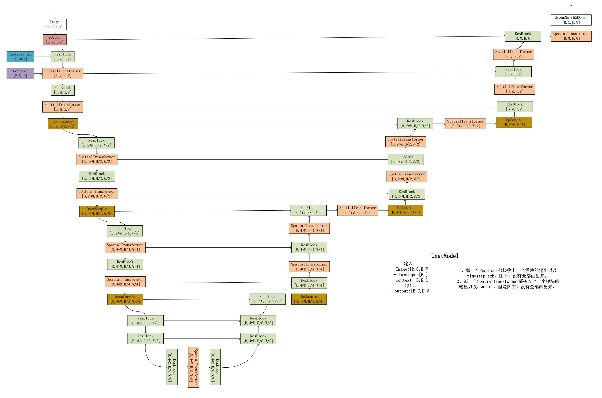
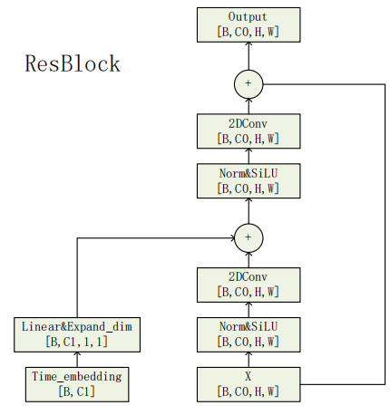
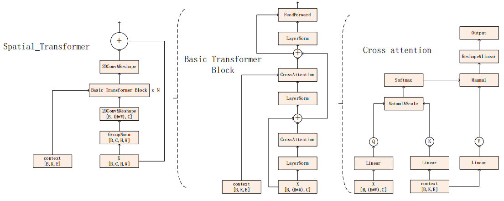

# Stable Diffusion 1.5 模型架构深度解析

## 目录
- [1. Diffusion 调度算法：从 DDPM 训练到 DDIM 推理](#1-diffusion-调度算法从-ddpm-训练到-ddim-推理)
  - [1.1 为什么模型用 DDPM 训练，但是可以用 DDIM 推理？](#11-为什么模型用-ddpm-训练但是可以用-ddim-推理)
  - [1.2 为什么 DDIM 可以加速推理？](#12-为什么-ddim-可以加速推理)
- [2. VAE: 潜在空间的压缩与还原](#2-vae-潜在空间的压缩与还原)
  - [2.1 VAE 的损失函数 (ELBO)](#21-vae-的损失函数-elbo)
  - [2.2 VQ-VAE 的损失函数](#22-vq-vae-的损失函数)
  - [2.3 VQGAN 的损失函数：从重建到感知](#23-vqgan-的损失函数从重建到感知)
  - [2.4 关键细节：为什么 Latent 需要乘以 0.18215？](#24-关键细节为什么-latent-需要乘以-018215)
- [3. 条件控制：CLIP Text Encoder](#3-条件控制clip-text-encoder)
- [4. 去噪网络：U-Net 架构细节](#4-去噪网络u-net-架构细节)
  - [A. 整体流程与输入](#a-整体流程与输入)
  - [B. ResBlock：残差与时间注入](#b-resblock残差与时间注入)
  - [C. Spatial Transformer：跨模态交互](#c-spatial-transformer跨模态交互)
- [5. 推理时的无分类器引导 (Classifier-Free Guidance, CFG)](#5-推理时的无分类器引导-classifier-free-guidance-cfg)
  - [5.1 CFG 引导强度的边界：guidance_scale 是越大越好吗？](#51-cfg-引导强度的边界guidance_scale-是越大越好吗)

## 1. Diffusion 调度算法：从 DDPM 训练到 DDIM 推理

Stable Diffusion 1.5 (SD1.5) 的核心逻辑建立在扩散模型的基础上。在训练阶段，模型遵循 DDPM (Denoising Diffusion Probabilistic Models) 框架。其过程包含前向加噪和逆向去噪。前向过程通过以下公式，在时间步 `t` 直接向原始图像注入高斯噪声：

```math
q(x_t|x_0) = \mathcal{N}(x_t; \sqrt{\bar{\alpha}_t}x_0, (1 - \bar{\alpha}_t)I)
```

训练的目标是优化去噪损失 `L_simple`，即让网络预测的噪声 `ε_θ` 逼近真实注入的噪声 `ε`：

```math
Loss = \mathbb{E}_{x_0, \epsilon, t} \left[ ||\epsilon - \epsilon_\theta(x_t, t)||^2 \right]
```

在实际推理中，SD1.5 通常采用 DDIM (Denoising Diffusion Implicit Models) 采样器。DDIM 引入了一类非马尔可夫的前向过程，虽然训练时使用的是 DDPM 的目标函数，但采样时可以跳步。

### 1.1 为什么模型用 DDPM 训练，但是可以用 DDIM 推理？

这个问题的答案藏在损失函数的数学本质中。DDIM 论文揭示了一个核心发现：**DDPM 的损失函数 $L_{simple}$ 仅依赖于边缘分布 $q(x_t | x_0)$，而不依赖于联合分布 $q(x_{1:T} | x_0)$**。

在 DDPM 中，加噪过程被建模为马尔可夫链。而 DDIM 巧妙地构造了一类更具一般性的**非马尔可夫扩散过程**。通过数学归纳法可以证明，尽管 DDIM 的前向联合分布与 DDPM 不同，但其在**任意时刻 $t$ 的边缘分布 $q(x_t | x_0)$ 均与 DDPM 保持一致**（即都服从 $\mathcal{N}(\sqrt{\alpha_t}x_0, (1 - \alpha_t)I)$）。

因此，只要我们在训练时对齐了边缘分布，模型预测噪声的能力就是通用的。这使得我们能够直接复用 DDPM 的预训练权重，而在推理阶段通过调整超参数 $\sigma_t$（例如设为 0）来实现确定性采样和加速推理。

### 1.2 为什么 DDIM 可以加速推理？

DDIM 的核心加速手段是 respacing (重采样) 技术。DDPM 的前向过程遵循马尔可夫性质，采样时必须逐步进行且具有不确定性（随机性采样），这导致推理速度缓慢。**DDPM 虽然也可以尝试 respacing，但由于其生成过程对完整马尔可夫链的依赖更强，跳步采样会显著损害样本质量。相比之下，DDIM 设计为确定性采样（当 `σ_t = 0` 时），采样过程不再依赖随机噪声，而是沿着一条确定的 ODE 路径运行。** 这种确定性映射对路径压缩具有极强的鲁棒性，在推理时只需使用原先 1000 步中的一个小部分（如 20-50 步）即可生成高质量图像，从而实现 10x 至 50x 的实际加速。

## 2. VAE: 潜在空间的压缩与还原

SD1.5 并不是直接在像素空间进行计算，而是通过变分自编码器 (VAE) 在潜在空间 (Latent Space) 操作。VAE Encoder 将 `512 × 512` 的图像压缩为 `64 × 64` 的隐变量，下采样倍数 `f = 8`。这一步通过将高维特征压缩到 4 个通道的隐空间，大幅降低了计算成本。

### 2.1 VAE 的损失函数 (ELBO)

VAE 的目标是最大化证据下界 (ELBO)，等价于最小化以下 Loss:

$$
\mathcal{L}_{VAE} = \underbrace{\mathbb{E}_{q(z|x)}[\log p(x|z)]}_{\text{Reconstruction Loss}} - \underbrace{D_{KL}(q(z|x)||p(z))}_{\text{KL Regularization}}
$$

- **Reconstruction Loss**: 确保解码器能还原输入（如 MSE 或交叉熵）。
- **KL Divergence**: 强迫后验分布 $q(z|x)$ 接近先验分布 $p(z)$（通常是标准正态分布）。这虽然保证了隐空间的连续性，但也限制了表示能力，常导致生成的图像模糊。

### 2.2 VQ-VAE 的损失函数

VQ-VAE 放弃了 KL 散度，引入了 Codebook (代码本)。其 Loss 由三部分组成：

$$
\mathcal{L}_{VQ-VAE} = \underbrace{||x - D(e_q)||_2^2}_{\text{Reconstruction Loss}} + \underbrace{||sg[z_e(x)] - e||_2^2}_{\text{Codebook Loss}} + \underbrace{\beta ||z_e(x) - sg[e]||_2^2}_{\text{Commitment Loss}}
$$

其中 `z_e(x)` 是 Encoder 的输出，`e` 是 Codebook 中的向量，`sg[·]` 表示 Stop Gradient（停止梯度传播）。

1. **Reconstruction Loss**: 基础的重建损失，衡量生成图像与原图的差异。
2. **Codebook Loss** ($L_2$ Loss):
   - 目的：让 Codebook 中的向量 `e` 向 Encoder 的输出 `z_e(x)` 靠近。
   - 因为量化过程（最近邻搜索）是不可导的，所以需要这个项来更新 Codebook。
3. **Commitment Loss**:
   - 目的：防止 Encoder 的输出 `z_e(x)` 波动过大。
   - 它强迫 Encoder 的输出“承诺” (Commit) 到特定的 Codebook 向量上，防止 `z_e` 在不同的 Embedding 之间频繁跳变，维持训练稳定性。

### 2.3 VQGAN 的损失函数：从重建到感知

VQGAN 在 VQ-VAE 的基础上，为了解决 MSE 损失导致的图像边缘模糊问题，引入了更符合人类视觉感知的 Loss 组合：

$$
\mathcal{L}_{VQGAN} = \mathcal{L}_{VQ-VAE} + \lambda \mathcal{L}_{GAN} + \gamma \mathcal{L}_{Perceptual}
$$

1. 感知损失 (Perceptual Loss):
   - 目的：让生成图像在“语义”和“纹理”上与原图接近，而不仅仅是像素级相等。
   - 原理：将生成图和原图同时输入一个预训练好的网络（如 VGG），提取它们的高层特征图并计算差异。这能有效保留图像的锐利边缘 and 复杂的细节纹理，避免产生“塑料感”。
2. 对抗损失 (Adversarial Loss):
   - 目的：通过判别器（Discriminator）逼迫生成器产生更加真实、符合自然图像分布的结果。
   - 原理：判别器试图区分“真实图像”和“重建图像”，而生成器则努力“欺骗”判别器。这种博弈机制能够显著提升图像的局部清晰度和整体真实感。

结论：SD1.5 选择 KL-VAE 是因为连续的潜在空间更利于扩散模型进行细微的去噪更新。

### 2.4 关键细节：为什么 Latent 需要乘以 0.18215？

在 SD1.5 的工程实现中，VAE Encoder 输出的 Latent 并不能直接喂给 U-Net。如果你观察源码，会发现它先被乘以了一个缩放因子（Scaling Factor）约为 `0.18215`。

*   为什么要缩放？ 扩散模型预设的 $\beta$ 调度算法是基于“标准差为 1”的数据分布设计的。然而，VAE Encoder 输出的原始 Latent 方差通常很大。
*   如果不缩放会怎样？ 如果直接输入，Latent 的原始分布会与加噪调度强行“对不上”，导致模型在前向加噪阶段就产生分布偏移，训练过程会迅速崩溃，推理时则会产生纯噪声或极度崩坏的图像。
*   0.18215 的由来： **这是开发者在训练初期对 Latent 统计后得到的倒数（即 $1/std$），目的是为了将 Latent 的标准差强行拉回到 1 附近。**

## 3. 条件控制：CLIP Text Encoder

为了实现文本对生成的控制，SD1.5 采用了 CLIP ViT-L/14 作为文本编码器。它将输入的 Prompt 经过分词和编码后，输出形状为 `[B, 77, 768]` 的特征张量。其中 77 是包含起始和结束符的最大 Token 长度，768 是嵌入维度。其主要限制在于 77 Token 的硬性截断，导致长文本描述无法被完整解析。

## 4. 去噪网络：U-Net 架构细节

U-Net 是 SD1.5 的去噪核心 `ε_θ(x_t, t)`。它通过对称的 Encoder-Decoder 结构在不同尺度上提取特征。



### A. 整体流程与输入

根据模型图示，U-Net 的输入包括：图像潜在表示：`[B, C, H, W]`, 时间步嵌入 (Timestep Embedding)：`[B, 4 × M]` 和文本上下文 (Context)：`[B, K, E]`。

> 💡 思考：Timestep 如何转化为 Embedding？
> 
> 1. 正弦位置编码 (Sinusoidal Encoding)：将标量时间步 $t$ 映射为频率向量，维度为 $M$。
> 2. MLP 映射：经过两层线性层和 SiLU 激活函数，将其维度提升至 $4 \times M$。这样得到的稠密向量能更好地捕捉时间步之间的细微差异。

特征图首先经过一个 2D 卷积将通道数提升至基准 `M = 320`。Encoder 部分包含三个主阶段，通道数随下采样逐层翻倍：`320 → 640 → 1280`。

### B. ResBlock：残差与时间注入



根据模型图示，ResBlock 的详细结构包括：输入特征首先经过 GroupNorm 和 SiLU 激活层、第一个 2D 卷积层，随后将预先算好的 Time Embedding 经过线性层投影并进行元素级加法注入，最后再次经过 Norm、SiLU 和第二个 2D 卷积，并与原始输入通过残差连接相加。

> 💡 思考：为什么残差连接能够避免梯度消失现象？
> 
> 在反向传播中，残差结构 `Output = F(x) + x` 的导数为 `∂Output/∂x = ∂F(x)/∂x + 1`。即使深层网络中 `F` 的导数项由于连乘变得极小，由于加法项 1 的存在，总梯度依然能够有效传导至浅层，保证了训练的稳定性。

### C. Spatial Transformer：跨模态交互



Spatial Transformer 是实现提示词引导的核心：
*   输入特征经过 GroupNorm 和 1x1 卷积调整通道，随后将空间维度 `H × W` 拉平。
*   内部包含 `N` 个 Basic Transformer Block。
*   交叉注意力层 (Cross-Attention)：图像特征作为 Query (Q)，由 CLIP 提供的 Context 作为 Key (K) 和 Value (V)。计算公式如下：

```math
Attention(Q, K, V) = softmax\left(\frac{QK^T}{\sqrt{d}}\right)V
```

这使得文本语义能够精确地指导图像中每个像素点的特征更新。

## 5. 推理时的无分类器引导 (Classifier-Free Guidance, CFG)

在推理阶段，Stable Diffusion 利用了无分类器引导 (Classifier-Free Guidance, 简称 CFG) 技术来增强生成图像与文本提示的匹配度。它通过平衡“无条件生成”和“有条件生成”来引导模型。

具体在代码实现中（如 `pipeline_stable_diffusion.py`）：

1. **组合文本嵌入**：
   模型同时提取无条件提示词（通常为负向提示词或空字符串 `""`）的 Embedding 和带有条件提示词（用户输入的 Prompt）的 Embedding。为了避免在 U-Net 中进行两次独立的推理计算，代码会将它们在 Batch 维度上拼接。
   ```python
   # 将无条件与有条件的文本嵌入拼接成一个 Batch
   prompt_embeds = torch.cat([negative_prompt_embeds, prompt_embeds])
   ```

2. **组合 Latents**：
   为了匹配拼接后的文本嵌入的 Batch 大小，输入的潜变量 (Latents) 也会被复制拼接。
   ```python
   # 如果开启了 CFG，Latents 输入翻倍
   latent_model_input = torch.cat([latents] * 2) if do_classifier_free_guidance else latents
   ```

3. **执行 Guidance 计算**：
   U-Net 预测出拼接后的噪声结果后，通过 `chunk(2)` 将分离为无条件预测和有条件预测，最后利用 `guidance_scale` (引导尺度) 计算最终的预测噪声：
   ```python
   # 分离无条件和有条件的预测噪声
   noise_pred_uncond, noise_pred_text = noise_pred.chunk(2)
   # 执行无分类器引导公式
   noise_pred = noise_pred_uncond + guidance_scale * (noise_pred_text - noise_pred_uncond)
   ```
   **原理解析**：公式中的 `(noise_pred_text - noise_pred_uncond)` 代表了文本条件所指引的方向的增量向量。通过乘以 `guidance_scale`（通常取值在 7.0 到 8.0 之间），模型在原有的无条件预测基础上，被强行向更符合 Prompt 的方向推进，从而获得与文本更贴合、质量更好的生成结果。

### 5.1 CFG 引导强度的边界：guidance_scale 是越大越好吗？

虽然增加 `guidance_scale` 能让图像更符合提示词，但它绝对不是“越大越好”。

*   适中（7.0 - 9.0）：这是 SD1.5 的黄金区间，兼顾了图像质量和提示词契合度。
*   过大（15.0 - 20.0+）的后果：
    1.  色彩饱和与过度锐化：图像会出现极高的对比度，看起来像被“烧焦”了一样，失去自然的光影过渡。
    2.  出现伪影：由于引导力过强，Latent 会被推向训练分布的边缘甚至之外，导致画面出现密集的杂色或结构性崩坏。
    3.  动态范围丢失：暗部变黑死，亮部变白死。
*   总结：过高的 `guidance_scale` 实际上是在牺牲“图像真实性”来换取“文本服从度”。在追求极端效果时，通常建议配合 `Dynamic Thresholding`（动态阈值）等技术来缓解高分下的画面崩溃。
