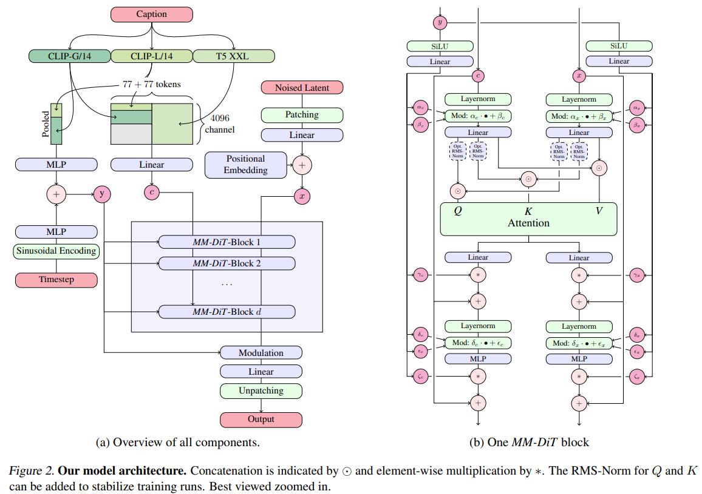

# SD3 (Stable Diffusion 3)

## 目录
- [1. 生成范式革新：从扩散模型到 Rectified Flow](#1-生成范式革新从扩散模型到-rectified-flow)
  - [1.1 为什么 Rectified Flow 理论上更优？](#11-为什么-rectified-flow-理论上更优)
  - [1.2 针对感知尺度的 Timestep 重加权采样](#12-针对感知尺度的-timestep-重加权采样)
- [2. 多模态扩散 Transformer：MM-DiT 架构详解](#2-多模态扩散-transformermm-dit-架构详解)
  - [2.1 双流独立权重与双向信息流](#21-双流独立权重与双向信息流)
  - [2.2 文本编码器：三编码器协同与 Dropout 策略](#22-文本编码器三编码器协同与-dropout-策略)
  - [2.3 QK-归一化：大模型训练的稳定器](#23-qk-归一化大模型训练的稳定器)
- [3. 高分辨率生成的工程实践](#3-高分辨率生成的工程实践)
  - [3.1 16 通道 VAE：潜空间的信息瓶颈突破](#31-16-通道-vae潜空间的信息瓶颈突破)
  - [3.2 多宽高比训练与 2D 位置编码](#32-多宽高比训练与-2d-位置编码)
- [4. 数据、训练策略与缩放定律](#4-数据训练策略与缩放定律)
  - [4.1 合成 Caption 与 50/50 混合策略](#41-合成-caption-与-5050-混合策略)
  - [4.2 可预测的缩放趋势与验证损失](#42-可预测的缩放趋势与验证损失)
  - [4.3 DPO 偏好对齐微调](#43-dpo-偏好对齐微调)
- [5. SD3 与 SD 系列及 FLUX 的架构对比](#5-sd3-与-sd-系列及-flux-的架构对比)

---

## 1. 生成范式革新：从扩散模型到 Rectified Flow

SD3 最根本的范式转移，是抛弃了传统扩散模型（如 SD1.5/SDXL 使用的 DDPM/LDM 框架）中“弯曲”的加噪路径，转而采用 **Rectified Flow (RF, 整流流)** 作为其生成骨架。在 RF 框架下，数据与噪声之间的前向路径被约束为一条直线。

### 1.1 为什么 Rectified Flow 理论上更优？

传统扩散模型的前向过程通常遵循一个非线性的、曲率较大的路径（如 DDPM 的 $\sqrt{\bar{\alpha}_t} x_0 + \sqrt{1-\bar{\alpha}_t} \epsilon$）。这意味着在推理阶段，模型需要大量的积分步数来模拟这条弯曲的反向 ODE 路径，且容易累积误差。

Rectified Flow 的核心思想极其简洁：它定义前向过程为数据 $x_0$ 与噪声 $\epsilon$ 之间的线性插值：

$$
z_t = (1-t) \cdot x_0 + t \cdot \epsilon, \quad \text{其中 } t \in [0, 1]
$$

此时，条件向量场（Conditional Vector Field）为：

$$
u_t(z_t | \epsilon) = \epsilon - x_0
$$

网络直接参数化速度场 $v_\Theta(z_t, t)$，训练目标为 Flow Matching 损失：

$$
\mathcal{L}_{RF} = \mathbb{E}_{t, x_0, \epsilon} \left[ || v_\Theta(z_t, t) - (\epsilon - x_0) ||_2^2 \right]
$$

> 💡 **思考：直线路径为什么能带来更快的采样？**
>
> 在 RF 中，由于前向路径是直线，理论上最优的反向速度场也是常数。这意味着如果网络完美拟合了这条直线流，整个生成过程可以通过 **单步（Single Step）** 完成。即使网络拟合不完美，直线路径也显著降低了 ODE 求解器的截断误差，使得在 5-10 步的少步采样下，RF 的性能衰减远小于传统扩散模型（见图 3 的实验对比）。

### 1.2 针对感知尺度的 Timestep 重加权采样

标准的 RF 训练均匀采样 $t \sim \mathcal{U}[0,1]$。然而，SD3 的研究发现，不同时间步的学习难度并不相同：
- 在 $t=0$（纯数据）和 $t=1$（纯噪声）附近，最优预测分别接近数据均值和噪声均值，相对简单。
- 在 $t \in (0,1)$ 的中间区域，模型需要同时处理数据和噪声的复杂混合，难度最大。

因此，SD3 提出通过非均匀采样密度 $\pi(t)$ 来给中间时间步更高的权重。改变采样密度等价于对损失函数施加时间依赖的权重 $w_\pi(t) = \frac{1}{t(1-t)\pi(t)}$。

SD3 探索了三种新的 Timestep 采样器，其中表现最优的是 **Logit-Normal 采样**：

$$
\pi_{ln}(t; m, s) = \frac{1}{s\sqrt{2\pi}} \cdot \frac{1}{t(1-t)} \exp\left( -\frac{(\text{logit}(t) - m)^2}{2s^2} \right)
$$

其中 $\text{logit}(t) = \log\frac{t}{1-t}$。参数 $m$ 控制偏置方向（负值偏向数据，正值偏向噪声），s 控制分布宽度。

> 💡 **原理解析：为什么 `rf/lognorm(0.00, 1.00)` 是全局最优？**
>
> 论文通过大规模对比实验（在 ImageNet 和 CC12M 上训练了 61 种不同配方）发现，`rf/lognorm(0.00, 1.00)` 在全局排名、少步采样（5 steps）和多步采样（50 steps）下均表现优异。它既不像 `rf/mode(1.29)` 那样过度偏向中间步导致端点拟合不足，也不像 EDM 或 LDM-Linear 那样在少步采样时性能急剧退化。这种“中间重、两端轻”的采样策略，让模型将更多优化精力投入到最难的感知相关尺度上。

---

## 2. 多模态扩散 Transformer：MM-DiT 架构详解

SD3 彻底抛弃了 UNet 架构，转而采用基于 Transformer 的骨干网络。但它并非简单复用 DiT，而是提出了 **MM-DiT (Multimodal Diffusion Transformer)**，专门为文本-图像这种跨模态任务设计。

下图展示了 SD3 的完整 MM-DiT 架构。

**(a)** 为系统总览：Caption 经 CLIP-G/14、CLIP-L/14、T5-XXL 三路编码后分别得到全局条件 $y$ 与序列上下文 $c$；Noised Latent 经 Patching 与位置编码得到图像序列 $x$；三者共同驱动 $d$ 层 MM-DiT Block，最终经 Unpatching 输出去噪潜变量。

**(b)** 为单个 MM-DiT Block 的内部结构：c 与 $x$ 双流各自拥有独立的 LayerNorm、调制（Mod）与 MLP 权重，在 Attention 层拼接后计算联合注意力，y 通过 SiLU + Linear 生成各层的 AdaLN 调制参数。

### 2.1 双流独立权重与双向信息流

传统文本到图像模型（如 SD1.5/SDXL）通常将固定文本表征通过 Cross-Attention 注入图像流。SD3 认为这种单向信息流不够理想。

MM-DiT 的核心设计是：**文本 Token 和图像 Token 拥有各自独立的权重，但在 Attention 操作中共享同一个序列空间。**

具体架构流程如下：

1. **图像分支**：Noised Latent 经过 $2\times2$ Patching 后展平为序列 $x$，加入位置编码。
2. **文本分支**：Caption 经过三个 Text Encoder 编码后，得到 Pooled 向量 $c_{vec}$ 和序列上下文 $c_{ctxt}$。
3. **序列拼接**：将文本序列和图像序列在长度维度上拼接（Concatenate），形成一个联合序列。
4. **双流模块**：在网络的初期阶段（可视为独立的两套 Transformer），文本和图像各自经过独立的 LayerNorm、QKV-Projection 和 MLP。但在 Attention 层，两个模态的 Q、K、V 被拼接在一起计算联合注意力：

$$
\text{Attention}(Q, K, V) = \text{softmax}\left(\frac{QK^T}{\sqrt{d}}\right)V
$$

这允许文本 Token 直接“看到”所有图像 Token，反之亦然，实现了真正的**双向信息流（Bidirectional Flow）**。

> 💡 **思考：MM-DiT 与 FLUX 的双流/单流设计有何异同？**
>
> SD3 的 MM-DiT 与 FLUX 都采用了“双流”思想，但实现方式不同：
> - **SD3 (MM-DiT)**：文本和图像始终在同一个序列中计算联合注意力，但使用**两套独立的权重**（两套 QKV-Proj 和 MLP）。这相当于“求同存异”——共享注意力空间但保留模态特异性。
> - **FLUX**：前 19 层是严格的双流（完全独立的 Hidden States 和权重），之后通过 Concatenation 强行合并为单流（Single Stream）。
>
> SD3 的设计在概念上更接近“联合注意力下的模态隔离”，而 FLUX 是“先隔离后融合”。实验表明，MM-DiT 在文本理解、排版（Typography）和人类偏好上显著优于 UViT 和 DiT。

> 💡 **思考：SD3 的 PatchEmbed 与 FLUX 的 Pack Latents 有何本质区别？**
> 
> 两者虽然都操作 2×2 的 spatial patch，且输出的序列长度相同（均为原图的四分之一），但在信息处理方式上截然不同：
> 
> - **SD3 (PatchEmbed)**：将 2×2 区域内的所有像素 Flatten 后，通过一个可学习的 Linear（或 Conv2d）投影到模型的隐藏维度 $D$。这是一种**学习式的降维/升维操作**，带有可训练参数，相当于让网络自己决定如何压缩这 4 个空间位置的信息。它的好处是 token 维度直接对齐模型内部维度，无需额外适配；代价是信息经过了一次有参变换，可能丢失部分原始结构。
> 
> - **FLUX (Pack Latents)**：将 2×2 区域内的像素直接在**通道维度堆叠 (Stack/Concat)**，通过纯张量重排（permute + reshape）完成，**不引入任何可学习参数**。这是一种**无损的信息重排操作**，完整保留了 4 个空间位置的所有通道信息，只是换了一种排列方式。后续的 MMDiT 第一层 Linear 再负责将这个 $C \times 4$ 的输入投影到模型维度。
> 
> 简言之：SD3 的 PatchEmbed 是**"先压缩，再进网络"**，让模型从更高的抽象层次开始处理；FLUX 的 Pack 是**"先完整保留，让网络自己学怎么压缩"**，把信息保真度留给了后续的自注意力机制去决定。两者序列长度一致，但 SD3 的 token 是经过学习的"特征嵌入"，FLUX 的 token 是原始 latent 的"堆叠视图"。

### 2.2 文本编码器：三编码器协同与 Dropout 策略

SD3 使用了**三个冻结的文本编码器**来提取不同粒度的语义信息：

| 编码器 | 角色 | 输出维度 | 作用 |
|:---|:---|:---|:---|
| **CLIP-G/14** (OpenCLIP) | 全局语义 + 序列特征 | Pooled: 1280 / Seq: 77×1280 | 提供强语义对齐 |
| **CLIP-L/14** | 全局语义 + 序列特征 | Pooled: 768 / Seq: 77×768 | 补充细节理解 |
| **T5-XXL** | 长文本精细特征 | Seq: 77×4096 | 复杂Prompt、长文本、排版 |

具体处理流程：
- **Pooled 输出**：CLIP-G 和 CLIP-L 的 Pooled 特征拼接后经过 MLP，得到全局条件 $y$，与时间步嵌入相加。
- **序列输出**：CLIP 的序列特征（77 tokens）与 T5 的序列特征（77 tokens）在通道维度上被 Zero-Pad 对齐到 4096 维，然后在序列长度上拼接，形成最终的 $c_{ctxt} \in \mathbb{R}^{154 \times 4096}$。

> 💡 **关键技巧：文本编码器的灵活推理**
>
> 训练时，三个编码器以 46.3% 的独立概率被随机 Dropout（即每个编码器有 46.3% 概率被置零），这使得模型对编码器的缺失具有鲁棒性。在推理时，用户可以**仅使用 CLIP 双编码器而省略 T5-XXL**，以节省约 4.7B 参数的显存开销。实验表明，省略 T5 对美学质量和大部分 Prompt 遵循度影响很小（胜率约 46%-50%），但在**复杂长文本和精确排版**任务上性能下降明显（胜率降至 38%）。

### 2.3 QK-归一化：大模型训练的稳定器

当模型规模扩展到数十亿参数并在高分辨率上微调时，SD3 观察到训练不稳定现象：注意力 Logits 会无限制增长，导致注意力熵崩溃（Attention Entropy Collapse），最终 Loss 发散为 NaN。

SD3 借鉴了判别式 ViT 领域的发现，在 Attention 计算前对 Q 和 K 进行 **RMSNorm 归一化**：

$$
Q' = \text{RMSNorm}(Q) \cdot \gamma_q, \quad K' = \text{RMSNorm}(K) \cdot \gamma_k
$$

其中 $\gamma_q, \gamma_k$ 是可学习的缩放因子。

> 💡 **工程细节：为什么 QK-Norm 能拯救混合精度训练？**
>
> 在没有 QK-Norm 的情况下，大 Transformer 的注意力 Logits 在训练初期会指数级增长，在 bf16 混合精度下很快溢出。QK-Norm 将 Logits 严格约束在一个稳定范围内，使得 8B 参数的模型可以在 bf16-mixed 精度下稳定训练，避免了全精度训练带来的 2× 性能损失。值得注意的是，即使预训练模型未使用 QK-Norm，也可以在微调阶段直接插入该层，模型能快速适应。

---

## 3. 高分辨率生成的工程实践

### 3.1 16 通道 VAE：潜空间的信息瓶颈突破

SD3 沿用了 LDM 的“先在潜空间训练扩散模型，再解码到像素空间”的范式，但对 VAE 进行了关键升级：

| 模型 | 潜空间通道数 | 重建 FID (↓) | 感知相似度 (↓) | PSNR (↑) |
|:---|:---|:---|:---|:---|
| SD1.5 / SDXL | 4 | - | - | - |
| SD3 (d=4) | 4 | 2.41 | 0.85 | 25.12 |
| SD3 (d=8) | 8 | 1.56 | 0.68 | 26.40 |
| **SD3 (d=16)** | **16** | **1.06** | **0.45** | **28.62** |

从 4 通道增加到 16 通道，VAE 的重建质量发生了质变。16 通道的潜空间能够更完整地保留图像的结构信息（Structural Information），尤其是**文字的几何拓扑、手部细节和复杂纹理**。这直接解释了为什么 SD3 在排版（Typography）和精细 Prompt 遵循上远超 SDXL。

> 💡 **权衡与选择**
>
> 虽然 16 通道 VAE 重建更好，但它对扩散骨干网络的容量要求也更高（因为需要预测更高维的潜变量）。在小模型（depth=12）上，16 通道的生成 FID 反而不如 8 通道；但当模型深度达到 22 层以上时，16 通道的优势完全释放。因此 SD3 最终选择了 **d=16** 以配合其大规模 Transformer 骨干。

### 3.2 多宽高比训练与 2D 位置编码

SD3 原生支持多宽高比生成，其技术实现与 SDXL 类似但有所改进：

1. **分桶策略 (Bucketing)**：将训练图像按宽高比分组，每桶总像素数接近 $1024^2$。
2. **位置编码**：使用 2D 正弦/余弦频率位置编码。对于非正方形分辨率，SD3 不是简单插值，而是先构建一个扩展的位置网格，然后根据实际尺寸从中 **中心裁剪（Center-Crop）** 出对应的位置嵌入。
3. **拼接与插值结合**：对于目标尺寸 $S^2$，先计算 latent 空间的最大高 $h_{max}$ 和宽 $w_{max}$，构造完整的位置坐标网格，再裁剪到实际 patch 数量。

---

## 4. 数据、训练策略与缩放定律

### 4.1 合成 Caption 与 50/50 混合策略

受 DALL-E 3 启发，SD3 使用 CogVLM 为训练数据生成**合成 Caption**。但纯合成数据可能导致模型遗忘训练集中某些 VLM 未覆盖的概念。

因此 SD3 采用 **50% 原始 Caption + 50% 合成 Caption** 的混合策略。GenEval 基准测试显示，这种混合在各项组合生成任务上均优于纯原始 Caption：

| 指标 | 原始 Caption | 50/50 混合 |
|:---|:---|:---|
| Color Attribution | 11.75% | **24.75%** |
| Position | 6.50% | **18.00%** |
| Counting | 33.44% | **41.56%** |
| Overall Score | 43.27% | **49.78%** |

### 4.2 可预测的缩放趋势与验证损失

SD3 进行了系统性的 Scaling Study，训练了从 15 层到 38 层（对应 8B 参数）的一系列模型。核心发现：

1. **验证损失平滑下降**：随着模型参数量和训练步数增加，验证损失呈现**可预测的、单调的下降趋势**，且未出现饱和迹象。
2. **验证损失是强预测器**：验证损失与 GenEval、T2I-CompBench 等自动指标以及人类偏好 Elo 评分呈现强负相关（相关系数 $r$ 在 -0.89 到 -0.98 之间）。

> 💡 **思考：为什么验证损失在扩散模型中如此可靠？**
>
> 传统扩散模型的损失在不同时间步上量纲差异巨大，难以直接比较。SD3 的改进在于：它采样 8 个等间距的时间步，分别计算每个步的验证损失，然后**平均除 $t=1$（纯噪声）外的所有层级**。这种分层评估消除了时间步方差的影响，使得验证损失成为模型能力的稳定代理指标。

3. **大模型更高效采样**：表 6 显示，38 层（8B）模型在 5 步采样下相对 50 步的 CLIP 分数下降仅 0.14%，而 15 层模型下降 4.30%。这说明更大的模型不仅质量更高，还能用更少的采样步达到峰值性能，因为大模型更好地拟合了 RF 的直线路径目标。

### 4.3 DPO 偏好对齐微调

SD3 在基础模型训练完成后，使用 **Direct Preference Optimization (DPO)** 进行对齐微调。具体实现：
- 不微调全部参数，而是为所有线性层插入 **LoRA (Rank=128)**。
- 2B 模型微调 4k 步，8B 模型微调 2k 步。
- 人类评估显示，DPO 模型在 Prompt 遵循度和视觉质量上均显著优于基础模型。

---

## 5. SD3 与 SD 系列及 FLUX 的架构对比

| 维度 | SD1.5 | SDXL | FLUX | **SD3** |
|:---|:---|:---|:---|:---|
| **骨干网络** | UNet (860M) | UNet (2.6B) | DiT / MM-DiT (变体) | **MM-DiT (8B)** |
| **生成范式** | DDPM/DDIM 噪声预测 | DDPM/DDIM 噪声预测 | Flow Matching | **Rectified Flow** |
| **VAE 通道** | 4 | 4 | 16 | **16** |
| **文本编码器** | CLIP-L (1个) | CLIP-L + OpenCLIP-G (2个) | CLIP-L + T5-XXL (2个) | **CLIP-L + OpenCLIP-G + T5-XXL (3个)** |
| **文本-图像交互** | Cross-Attention | Cross-Attention | 先双流后单流 | **双流独立权重 + 联合注意力** |
| **位置编码** | 卷积平移不变性 | 固定 2D 嵌入 | RoPE (旋转位置编码) | **2D 正弦频率 + 中心裁剪** |
| **分辨率适应** | 固定 512² | 多宽高比分桶 | 动态 $\mu$ 偏移 | **Resolution-dependent Shift ($\alpha=3$)** |
| **训练稳定性** | 常规 | 常规 | 常规 | **QK-Norm (关键)** |
| **少步采样** | 依赖蒸馏 (Turbo) | 依赖蒸馏 (Turbo) | Schnell (4步) | **原生 RF 支持 (5步高质量)** |

### 核心差异总结

1. **整流流 vs 噪声预测**：SD3 的 RF 框架使其在数学上天然支持少步采样，无需像 SD1.5/SDXL 那样依赖额外的蒸馏模型（如 SDXL-Turbo）来实现实时生成。

2. **MM-DiT 的模态隔离**：与 FLUX 的“先严格隔离、后强制融合”不同，SD3 的 MM-DiT 在整个网络中保持了文本和图像的独立权重，但通过联合注意力实现持续的双向交互。这种设计在排版和复杂空间关系理解上表现尤为突出。

3. **三编码器策略**：SD3 是首个在开源领域同时使用 CLIP 双编码器 + T5-XXL 的模型。T5 的引入赋予了 SD3 对长文本和复杂逻辑的深刻理解能力，这是 SDXL 的双 CLIP 架构难以企及的。

4. **可预测的缩放**：SD3 的 Scaling Law 实验明确展示了验证损失与下游指标的高度相关性，这为未来继续扩大模型规模（ beyond 8B ）提供了坚实的理论信心。