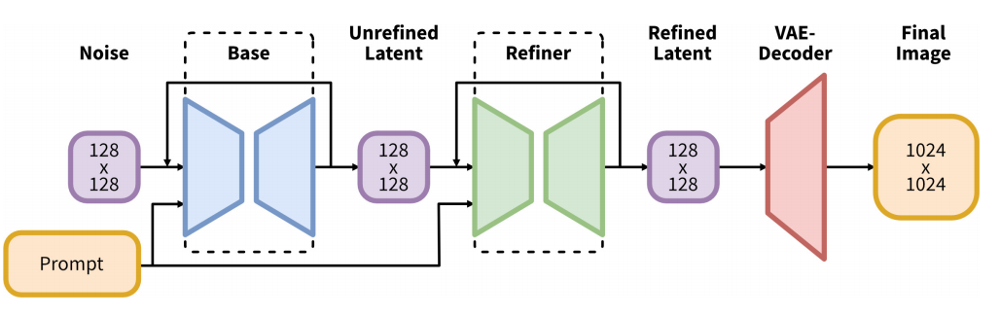

# SDXL 相比 SD 1.5 的五维架构革新

## 目录
- [1. 模型规模与架构深度：3 倍参数量的质变](#1-模型规模与架构深度3-倍参数量的质变)
- [2. 显式坐标与尺寸建模：SDXL 微条件化的算法实现](#2-显式坐标与尺寸建模sdxl-微条件化的算法实现)
- [3. 多宽高比训练（Multi-Aspect Training）：打破正方形桎梏](#3-多宽高比训练multi-aspect-training打破正方形桎梏)
- [4. 两阶段生成流水线：基座 + 精修的质量跃升](#4-两阶段生成流水线基座--精修的质量跃升)
- [5. VAE 重建能力的系统性重构](#5-vae-重建能力的系统性重构)



## 1. 模型规模与架构深度：3 倍参数量的质变

* UNet 参数量扩张：SDXL 的 UNet 骨干网络参数量达到 26 亿（2.6B），是 SD 1.5（860M）的 3 倍。
* 双编码器架构：**相较 SD1.5 仅依赖单一 CLIP ViT-L/14 提供 768 维序列条件（`[B, 77, 768]`），SDXL 引入 OpenCLIP ViT-bigG 与 CLIP ViT-L 双路并行编码，将二者倒数第二层隐藏状态在通道维度拼接，使注入 UNet Cross-Attention 的上下文维度由 768 扩展至 2048，文本语义表征容量显著增强。**

以下代码展示了在推理过程（`pipeline_stable_diffusion_xl.py` 的 `encode_prompt` 方法）中，如何将两个 Text Encoder 输出提取倒数第二层特征并进行拼接。需要注意的是，这里的 `prompt` 和 `prompt_2` 默认是相同的文本（在 `prompt_2` 未提供时会使用 `prompt` 的内容），它们会被分别送入两个不同的 Text Encoder（`clip-vit-large-patch14` 和 `openclip-vit-bigG`）中提取特征：

```python
prompt_embeds_list = []
prompts = [prompt, prompt_2]
for prompt, tokenizer, text_encoder in zip(prompts, tokenizers, text_encoders):
    # ... 省略 tokenization 过程 ...
    
    # 获取文本编码器的特征输出
    prompt_embeds = text_encoder(text_input_ids.to(device), output_hidden_states=True)

    # ... 获取 pooled_prompt_embeds ...

    # 提取倒数第二层 (penultimate layer) 的隐藏层特征
    if clip_skip is None:
        prompt_embeds = prompt_embeds.hidden_states[-2]
    else:
        # "2" because SDXL always indexes from the penultimate layer.
        prompt_embeds = prompt_embeds.hidden_states[-(clip_skip + 2)]

    prompt_embeds_list.append(prompt_embeds)

# 在通道维度（dim=-1）将两个 Text Encoder 的隐藏层输出拼接，实现维度至 2048 的扩展
prompt_embeds = torch.concat(prompt_embeds_list, dim=-1)
```

* 全局语义增强：引入了 OpenCLIP 的池化文本嵌入（Pooled text embedding）作为全局条件，显著增强了模型对复杂提示词的语义解析能力。

## 2. 显式坐标与尺寸建模：SDXL 微条件化的算法实现

在传统的生成模型（如 SD 1.5）训练中，为了凑齐 Batch，通常会对图像进行强制的中心裁剪（Center Crop）。这种做法虽然简单，但会导致模型学到错误的先验：它不知道自己看到的是一张完整的图，还是被切掉了一半的残次品。**SDXL 的 Micro-Conditioning 核心思想是将“裁剪”和“尺寸”这两个导致画质退化的因素，从隐含的噪声变为显式的条件输入。**

### 1. 核心逻辑：从数据剔除转向偏好打标

SDXL 不再因为图片分辨率低或裁剪位置不佳而丢弃数据，而是通过以下三个参数告诉模型图像的真实状态：

*   `original_size` $(h, w)$：图像进入预处理流程前的原始宽高。它让模型意识到：“这张图现在的模糊是因为它本来就小，而不是世界长得模糊”。
*   `crops_coords_top_left` $(y, x)$：裁剪框左上角在原图中的坐标。
*   `target_size`：模型最终训练/输出的分辨率（如 $1024 \times 1024$）。

**在推理时，我们通过输入 y = 0, x = 0 来下达指令：“请给我生成一张像是在原图左上角开始、完全没有被裁剪过的完整图像。”**

### 2. 代码实现与特征拼接

在 diffusers 库的训练脚本中，这些参数会被处理成 `add_time_ids`。其计算逻辑如下：

```python
def compute_time_ids(original_size, crops_coords_top_left):
    # original_size: 尺寸条件化输入 (例如输入图像真实的宽高)
    # crops_coords_top_left: 裁剪条件化输入 (例如 CenterCrop 时的左上角坐标 y1, x1)
    # target_size: 目标尺寸 (模型生成输出的宽高)
    target_size = (args.resolution, args.resolution)
    
    # 核心动作：将 3 组元组拼接成一个包含 6 个标量的列表
    # 例如：[1024, 1024, 0, 0, 1024, 1024]
    add_time_ids = list(original_size + crops_coords_top_left + target_size)
    
    # 转化为 Tensor，准备注入 U-Net
    add_time_ids = torch.tensor([add_time_ids], device=accelerator.device, dtype=weight_dtype)
    return add_time_ids

# 批量处理：为 Batch 中的每张图生成对应的微条件向量
add_time_ids = torch.cat(
    [compute_time_ids(s, c) for s, c in zip(batch["original_sizes"], batch["crop_top_lefts"])]
)
```

### 3. 深度解析：为什么要注入 Timestep Embedding？

你可能会问：既然是条件，为什么不放在 Cross-Attention 里，而是与时间步（Timestep）绑在一起注入？

**傅里叶特征编码（Fourier Feature Encoding）** 正是将尺寸与裁剪信息送入模型的关键环节。U-Net 并不会直接读取前述 6 个标量；在进入网络之前，它们会先经傅里叶频率编码——思路与 Transformer 的位置编码 $PE$ 类似——将每个标量 $v$ 映射为一组高维向量：

$$
[\sin(f_1 v), \cos(f_1 v), \dots, \sin(f_n v), \cos(f_n v)]
$$

神经网络对原始数值不敏感，但对频率极其敏感。这种编码让模型能够精确感知到“移动 1 个像素”带来的分布差异。

全局环境注入
SDXL 将这些编码后的向量与 `timestep_embedding` 相加（或拼接），最终注入到 U-Net 的每个 ResNet Block 中。

*   理由一：全局一致性。裁剪坐标和原始尺寸属于“环境参数”，它们决定了整张图的基调（是高清还是模糊，是局部还是全身）。放在 Timestep 路径上可以确保这些信息在每一层特征提取时都作为“底噪”存在，保持全局一致。
*   理由二：计算效率。Cross-Attention 适合处理 Prompt 这种具有局部空间对应关系的信息。而对于坐标这种全局属性，直接在 Residual 路径上进行线性投影（Linear Projection）注入，计算开销极小，效果却最直接。

## 3. 多宽高比训练（Multi-Aspect Training）：打破正方形桎梏

* 分桶策略（Bucketing）：SDXL 突破了固定 $512 \times 512$ 输出的限制，采用分桶技术将数据按比例分组（覆盖 0.25 至 4.0 范围），每桶总像素数保持在接近 $1024^2$。
* 目标尺寸嵌入：训练时将目标 Bucket 尺寸 ($h_{tgt}, w_{tgt}$) 同样经傅里叶编码作为条件输入。这使得模型原生支持 16:9、3:2 等显示比例，生成构图更加自然，无需后期拉伸。

## 4. 两阶段生成流水线：基座 + 精修的质量跃升

* 级联架构设计：SDXL 由 Base（基础模型） 与 Refiner（细化模型） 组成两阶段管线。
* SDEdit 细节精修：Refiner 专门针对高分辨率细节优化，专注于处理去噪流程最后阶段（前 200 个高噪声尺度）的潜变量。
* 用户研究验证：带 Refiner 的 SDXL 用户胜率高达 48.44%，远超 SDXL Base (36.93%) 和 SD 1.5 (7.91%)，尤其在面部和背景保真度上提升巨大。

## 5. VAE 重建能力的系统性重构

* 模型独立重训：虽然保持了与 SD 1.5 相同的 8 倍下采样架构，但 SDXL 的 VAE 是完全从头开始训练的。
* 训练参数优化：训练批次规模（Batch size）从 9 提升至 256，并引入了指数移动平均（EMA）权重追踪技术。