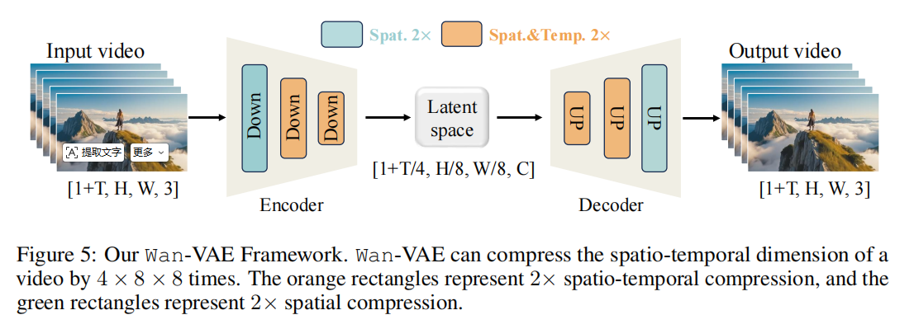
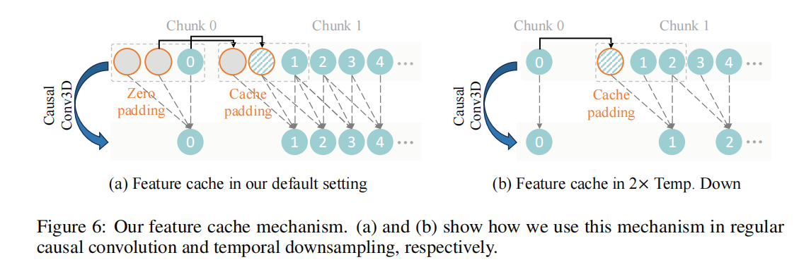

# Wan-VAE: 面向视频生成的3D因果变分自编码器

## 目录
- [背景：为什么视频生成需要专门的VAE](#背景为什么视频生成需要专门的-vae)
  - [三大核心挑战](#三大核心挑战)
- [模型设计](#模型设计)
  - [关键设计决策](#关键设计决策)
    - [首帧仅做空间压缩](#首帧仅做空间压缩)
    - [GroupNorm → RMSNorm的替换](#groupnorm--rmsnorm-的替换)
    - [空间上采样层通道减半](#空间上采样层通道减半)
- [训练策略：三阶段渐进式训练](#训练策略三阶段渐进式训练)
  - [第一阶段：2D图像VAE预训练](#第一阶段2d-图像-vae-预训练)
  - [第二阶段：扩展为3D因果VAE](#第二阶段扩展为-3d-因果-vae)
  - [第三阶段：高质量视频微调+ GAN损失](#第三阶段高质量视频微调--gan-损失)
- [高效推理：Feature Cache机制](#高效推理feature-cache-机制)
  - [分块处理策略](#分块处理策略)
  - [默认场景：时间维度不变的因果卷积](#默认场景时间维度不变的因果卷积)
  - [时间下采样场景：Stride = 2](#时间下采样场景stride--2)
  - [为什么Feature Cache能支持无限长度视频](#为什么-feature-cache-能支持无限长度视频)

- --

## 背景：为什么视频生成需要专门的VAE

变分自编码器（VAE）在生成模型中承担着"像素空间 ↔ 潜空间"的桥梁角色。它将高维的视觉数据（尤其是视频）压缩到低维的紧凑表征，从而让扩散模型等生成模型能够在更小、更高效的潜空间中进行训练和推理。

在Wan2.1的整体架构中，Wan-VAE是整个流程的第一环：给定输入视频 $V \in \mathbb{R}^{(1+T) \times H \times W \times 3}$，Wan-VAE的Encoder将其从像素空间编码到潜空间 $x \in \mathbb{R}^{(1+T/4) \times H/8 \times W/8 \times C}$，随后潜变量被送入后续的DiT（Diffusion Transformer）模型进行生成建模。

### 三大核心挑战

为视频生成任务设计高效的VAE并非易事，主要面临以下三个挑战：

1. **复杂的时空依赖建模**：视频同时具备空间（高、宽）和时间（帧）维度，VAE必须同时捕捉三维的时空依赖关系，而非仅处理静态图像的二维特征。

2. **显存与计算的指数级增长**：视频数据的维度极高（多帧 × 高分辨率 × 像素通道），导致显存占用和计算成本急剧攀升，使得VAE难以扩展到长视频序列。

3. **时间因果性的保证**：未来帧不应影响过去帧（Temporal Causality），这是生成连贯、真实视频内容的关键约束，但该约束引入了额外的架构复杂度。

为解决上述挑战，Wan2.1提出了一种专为视频生成设计的 **3D因果VAE架构（Wan-VAE）**，通过多策略组合提升时空压缩效率、降低显存占用，并严格保证时间因果性。

> **Wan-VAE的核心参数一览**
>
> | 参数 | 配置 |
> | :--- | :--- |
> | 压缩倍率 | $4 \times 8 \times 8$（时间4×，空间8××8×） |
> | 潜空间通道数 $C$ | 16 |
> | 参数量 | 127M（精简设计） |
> | 因果卷积核大小 | 3 |
> | 首帧处理 | 仅空间压缩（时间维度不变） |

- --

## 模型设计

### 关键设计决策

#### 首帧仅做空间压缩

Wan-VAE借鉴了MagViT-v2的设计：**输入视频的第一帧只进行空间压缩，不压缩时间维度。**这样做的原因是：

- 视频生成模型通常需要同时支持**图像生成**和**视频生成**两种任务
- 如果首帧也被时间压缩，单张图像输入时需要额外的填充或特殊处理逻辑
- **首帧保持时间维度不变（即始终保留1帧），使得图像数据可以被直接当作"单帧视频"处理，无需修改架构**

#### GroupNorm → RMSNorm的替换

Wan-VAE将架构中所有的GroupNorm层替换为RMSNorm层。这一改动看似简单，实则至关重要：

- **GroupNorm**在计算归一化统计量（均值、方差）时，需要跨通道组内的所有样本参与计算
- **RMSNorm**仅基于当前样本的均方根（RMS）进行缩放，不需要跨样本的统计量

> **为什么必须替换为RMSNorm？**
>
> 因果关系要求"当前帧的计算不能依赖未来帧"。GroupNorm在计算均值和方差时，如果涉及到时间维度上的分组，会不可避免地引入未来帧的信息，从而破坏因果性。
>
> RMSNorm的另一个关键优势是它与 **Feature Cache机制**天然兼容——因为RMSNorm不需要维护跨样本的运行统计量，每个chunk可以独立计算归一化，无需担心批次间统计不一致的问题。

#### 空间上采样层通道减半

在Decoder的空间上采样层中，Wan-VAE将输入特征通道数减半。这一优化直接带来了 **33%的推理显存占用降低**，使得高分辨率视频的解码更加高效。

- --

## 训练策略：三阶段渐进式训练

Wan-VAE采用三阶段渐进式训练策略，从简单的2D图像逐步过渡到复杂的3D视频：

### 第一阶段：2D图像VAE预训练

首先构建一个与Wan-VAE **相同网络结构**的2D图像VAE，在大量图像数据上进行预训练。

- 这一步的目标是让模型先学会**高质量的空间压缩与重建**
- 2D图像训练收敛快、数据丰富，能为后续3D扩展提供良好的空间先验
- 训练损失：L1重建损失+ KL散度损失+ LPIPS感知损失

### 第二阶段：扩展为3D因果VAE

将训练好的2D图像VAE "膨胀"（Inflate）为3D因果VAE：

- 将2D卷积核沿时间维度扩展为3D因果卷积核
- 利用第一阶段学到的空间压缩先验，大幅提升训练速度（相比从零训练视频VAE）
- 在此阶段，使用低分辨率（$128 \times 128$）、少帧数（5帧）的视频数据进行训练，加速收敛
- 训练损失及权重系数：
  - L1重建损失（权重3）
  - KL散度损失（权重 $3 \times 10^{-6}$）
  - LPIPS感知损失（权重3）

### 第三阶段：高质量视频微调+ GAN损失

在高质量视频数据上进行最终微调：

- 使用不同分辨率和帧数的多样化视频数据
- 引入 **3D判别器的GAN损失**（来自VQGAN），提升重建视频的真实感和细节锐利度
- 三阶段损失组合：

$$
\mathcal{L}_{total} = 3 \cdot \mathcal{L}_{L1} + 3 \times 10^{-6} \cdot \mathcal{L}_{KL} + 3 \cdot \mathcal{L}_{LPIPS} + \mathcal{L}_{GAN}
$$

> **渐进式训练的核心思想**
>
> 视频VAE的训练空间极大（同时优化空间压缩、时间压缩、因果性、重建质量），直接端到端训练容易陷入局部最优或收敛缓慢。
>
> 三阶段训练的本质是**课程学习（Curriculum Learning）**：先学简单的空间压缩（2D），再引入时间维度（低分辨率短视频），最后在复杂数据上精调。每一阶段都为下一阶段提供更好的初始化，避免冷启动。

- --

## 高效推理：Feature Cache机制

为了高效支持**任意长度视频**（理论上无限长）的编码和解码，Wan-VAE在因果卷积模块中实现了Feature Cache机制。Wan-VAE 的特征缓存机制（Feature Cache Mechanism）是为了在严格保持时间因果性的前提下，实现对任意长视频的高效编解码而设计的。它的核心思想是：**把长视频切成小段（chunk）逐块处理，但将历史块的关键特征缓存下来，供当前块复用，从而避免一次性加载全部帧，同时保证块与块之间的时间连续性。**

### 分块处理策略

输入视频帧遵循 $1 + T$的格式，模型将视频分成 $1 + T/4$个chunk，与潜特征的数量一致。每个编码/解码操作只处理对应单个潜特征的视频chunk，每chunk最多处理4帧，有效防止显存溢出。

### 默认场景：时间维度不变的因果卷积

如图6(a)所示，在默认设置下（因果卷积不改变帧数）：

- 因果卷积核大小为3，因此需要维护 **2个历史帧的特征缓存**
- **初始chunk**：使用2帧零填充（Zero Padding）初始化缓存
- **后续chunk**：复用前一个chunk的最后2帧作为缓存特征，同时丢弃更早的历史数据

### 时间下采样场景：Stride = 2

如图6(b)所示，当涉及 $2\times$时间下采样时（Stride = 2）：

- 此时只需要维护 **1帧的缓存**
- **非初始chunk**：在缓存帧前做单帧填充（Cache Padding），确保维度一致性
- 该配置保证输出序列长度严格遵循下采样比例，同时维持跨chunk边界的因果关系

### 为什么Feature Cache能支持无限长度视频

Feature Cache机制本质上是一种**流式处理（Streaming Processing）**策略：

1. **显存与视频长度解耦**：无论输入视频是25帧还是10000帧，每时刻处理的chunk大小固定（最多4帧），显存占用不随视频长度增长
2. **跨chunk特征连续性**：通过缓存前一chunk的末尾帧特征，当前chunk的卷积计算能够"看到"必要的历史上下文，保证输出在chunk边界处无缝衔接
3. **严格的时间因果性**：由于只缓存历史帧（过去），不使用未来帧，因果约束始终被满足

> **Feature Cache的工程价值**
>
> 在实际部署中，这意味着Wan-VAE可以：
> -编码/解码任意时长的视频而不会出现OOM
> -支持流式实时处理（如直播场景的逐段编码）
> -在处理高分辨率长视频时，速度优势更加明显（因为避免了整视频加载的巨大显存开销）

- --

