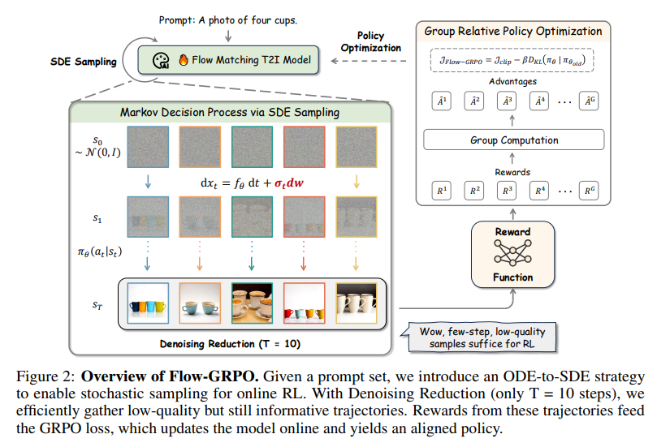

# Flow-GRPO : Training Flow Matching Models via Online RL

Flow-GRPO 是首个将GRPO（Group Relative Policy Optimization）成功引入 Flow Matching（流匹配）生成模型的强化学习框架。该方法解决了将大语言模型（LLM）中的在线 RL 迁移到扩散/流匹配模型时的三大核心挑战，显著提升了模型在复杂指令遵循（如物体计数、空间关系、长文本渲染）上的表现。

## 核心挑战与解决方案

### 1. 探索性难题：从确定性 ODE 到等效随机 SDE

**难点**：标准 Flow Matching 模型的生成过程由一个**确定性常微分方程**（ODE）驱动:

$$
\frac{d\mathbf{x}_t}{dt} = \mathbf{v}_\theta(\mathbf{x}_t, t)
$$

对于固定的初始噪声和提示词Prompt，该 ODE 总是生成**完全相同的图像轨迹** 。这种确定性使得模型无法进行强化学习所必需的**策略探索**——因为 RL 需要从同一状态采样多个不同动作（即不同图像变体）以评估其优劣。

**解决方案**：Flow-GRPO 提出 **ODE-to-SDE 转换**，将原始 ODE 重构为一个**统计等效的随机微分方程**（SDE）。关键在于：新 SDE 在任意时刻 $t$ 的边际分布 $p_t(\mathbf{x})$ 与原 ODE 完全一致，因此不会损害模型的生成质量，但**引入了可控的随机性以支持探索**。

具体而言，转化后的ODE形式为：

$$
d\mathbf{x}_t = \underbrace{\left[ \mathbf{v}_\theta(\mathbf{x}_t, t) + \frac{\sigma_t^2}{2t} \big( \mathbf{x}_t + (1 - t)\mathbf{v}_\theta(\mathbf{x}_t, t) \big) \right]}_{\text{修正漂移项}} dt + \underbrace{\sigma_t \, d\mathbf{w}_t}_{\text{随机扩散项}}
$$

在离散化实现中（Euler-Maruyama，参考论文 Eq. 9），每一步的采样更新为：

$$
\mathbf{x}_{t - \Delta t} = \mathbf{x}_t - \left[ \mathbf{v}_\theta(\mathbf{x}_t, t) + \frac{\sigma_t^2}{2t} \big( \mathbf{x}_t + (1 - t)\mathbf{v}_\theta(\mathbf{x}_t, t) \big) \right] \Delta t + \sigma_t \sqrt{\Delta t} \, \boldsymbol{\epsilon}, \quad \boldsymbol{\epsilon} \sim \mathcal{N}(0, \mathbf{I})
$$

> ✅ **效果**：  
> - **探索性**：相同输入下，每次采样因 $\boldsymbol{\epsilon}$ 不同而产生多样化的轨迹；  
> - **保真性**：由于修正漂移项的存在，所有轨迹的统计特性（边际分布）与原始 ODE 严格对齐，确保生成质量无损。

这一转换是 Flow-GRPO 的基石——它在**不修改预训练模型权重**的前提下，为其注入了 RL 所需的探索能力。

### 2. 采样效率难题：去噪步数缩减策略 (Denoising Reduction)

**难点**：GRPO 算法要求对每一个 Prompt 采样一组（Group）样本来计算相对奖励（Relative Reward）。Flow Matching 模型（如 SD3.5）生成单张图像通常需要 40 步甚至更多迭代。如果按照常规 RL 训练，计算开销和显存占用将呈倍数增加，导致训练极其缓慢。

**解决方案**：论文提出了 **Denoising Reduction（去噪缩减策略）**。
* **核心发现**：在训练阶段，即使将去噪步数大幅缩减（例如从 40 步减到 10 步），虽然单次采样的图像质量会有所下降，但模型依然能提供足够的奖励信号用于梯度更新。
* **效果**：该策略极大地缩短了训练时的 Wall-clock time。而在推理阶段，模型依然可以使用完整的步数来保证最终生成的图像质量。

### 3. 概率计算难题：从离散 Token 到连续高斯密度

**难点**：在 LLM-GRPO 中，计算的是离散 Token 的分类概率，直接取 Logits 即可。但在 Flow Matching 中，由于输出是连续的 Latent 变量，没有离散的概率分布。

**解决方案**：基于 SDE 的公式，将每一步去噪动作 $\pi_\theta(x_{t-1}|x_t)$ 建模为**各向同性高斯分布**（Isotropic Gaussian Distribution）。

在计算新旧策略比率（Importance Sampling）所需的 `log_prob` 时，直接利用高斯分布的概率密度函数：

$$
\log \pi_\theta(x_{t-1} | x_t) = -\frac{\|x_{t-1} - \mu_\theta(x_t, t)\|^2}{2\sigma_t^2} -\log(\sigma) - \log(\sqrt{2\pi})
$$

其中：
* $\mu_\theta$ 是模型预测的下一步均值（由 $v_\theta$ 计算得出）。
* $\sigma_t$ 是预设的噪声强度。

通过这种方式，Flow-GRPO 成功地将 GRPO 应用于连续图像生成任务，并保持了高效的训练性能。

## Flow-GRPO 训练全流程

Flow-GRPO 的训练流程如上图所示，可以概括为以下步骤：

1.  **基础生成器**：使用预训练的 **Flow Matching 文本到图像 (T2I) 模型** 作为策略网络（Policy Network）。
2.  **SDE 随机采样 (Stochastic Sampling)**：通过 **ODE-to-SDE** 转换，将确定性生成过程转变为随机过程，从而支持 RL 所需的探索。
3.  **分组采样与去噪缩减 (Group Sampling & Denoising Reduction)**：
    *   针对每一个 Prompt，采样 $G$ 个不同的图像样本（即一个 Group）。
    *   在训练过程中应用 **Denoising Reduction**（如 $T=10$ 步），在保证奖励信号有效的前提下，极大地提高采样效率。
4.  **奖励计算 (Reward Function)**：利用预定义的 Reward Function（如 CLIP Score, Aesthetic Score 等）对生成的 $G$ 个图像进行评分，得到奖励值 $\{R^1, R^2, \dots, R^G\}$。
5.  **GRPO 优化 (Policy Optimization)**：
    *   **计算优势函数 (Advantages)**：在同一 Group 内计算每个样本的相对奖励作为 Advantage $\hat{A}^i$。
    *   **计算 KL 散度**：计算当前策略 $\pi_\theta$ 与参考策略 $\pi_{\theta_{old}}$ 之间的 KL 散度以限制模型偏离。
    *   **损失函数与反向传播**：结合 Advantage 和 KL 惩罚项计算 **GRPO Loss**，并通过反向传播更新模型参数，实现策略对齐。

