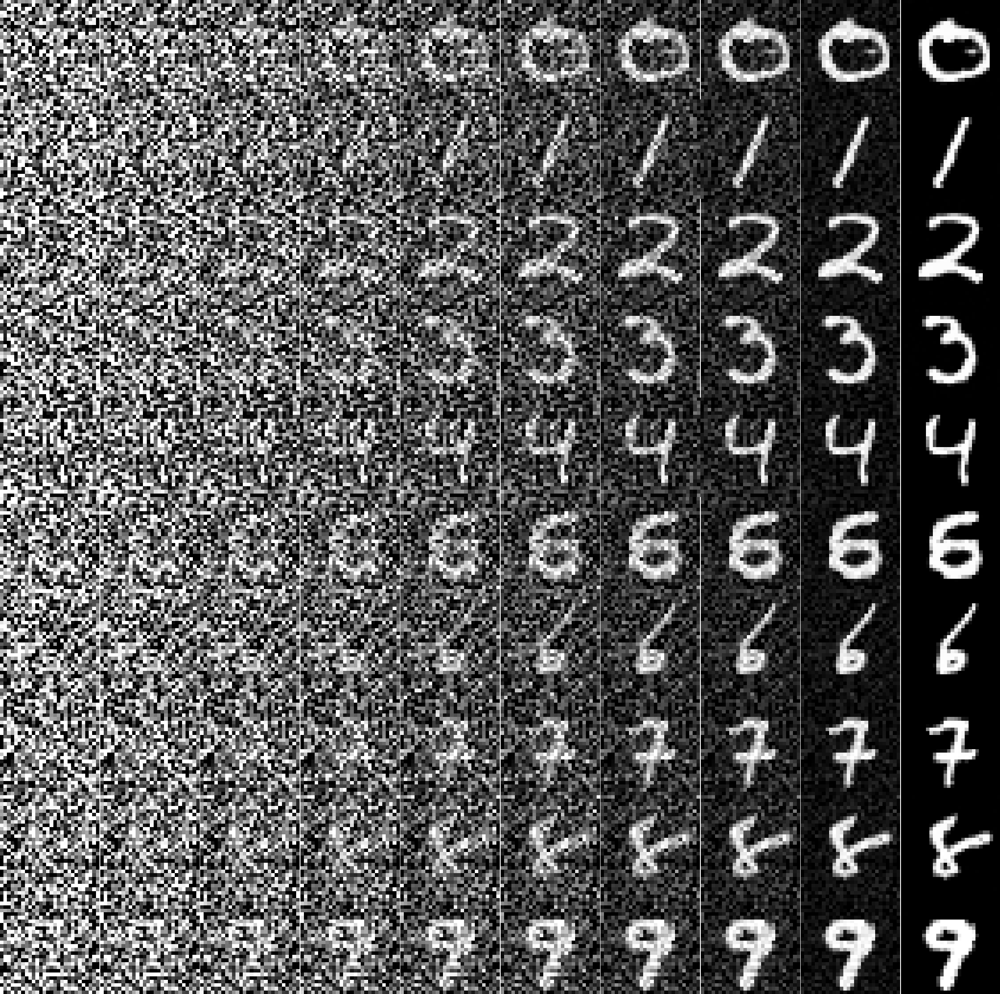
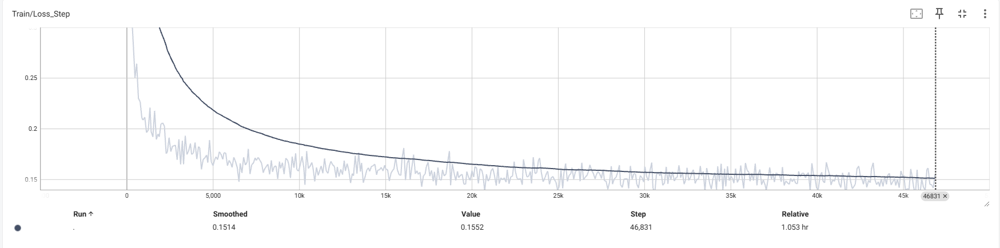

# Conditional Flow Matching for MNIST Generation

## Introduction
Pytorch版本实现的Flow Matching, 用于学习目的, 根据指定数字类别(0-9)生成对应的手写数字图像.

## Overview
</img>

## Core Algorithm

```python
def conditional_flow_matching_training(x_batch, class_labels):
    """
    Conditional Flow Matching训练流程
    Args:
        x_batch[B, C, H, W] - 真实图像batch
        class_labels[B] - label信息
        model - 预测网络，预测速度场 v_θ(x_t, t, c)
        t ∈ [0,1] - 连续时间参数
    Return:
        loss - Flow Matching目标函数
    """
    t = torch.rand(B, device=device)
    x_0 = torch.randn_like(x_batch) 
    
    # 线性插值: x_t = (1-t) * x_0 + t * x_1
    x_t = (1 - t) * x_0 + t * x_batch 
    u_t = x_batch - x_0 
    v_pred = model(x_t, t, class_labels) 
    
    # Flow Matching损失函数：L_FM = E[||v_θ(x_t, t, c) - u_t||²]
    loss = F.mse_loss(v_pred, u_t)
    
    return loss
```

## Train & Inference

### Train
```bash
python src/train.py
```

### Inference
```bash
python src/generate.py --checkpoint ./checkpoints/best_model.pth --generate_progression --output_dir ./samples
```

## Result


## Loss


## Acknowledgements

- [通俗易懂理解Flow Matching](https://zhuanlan.zhihu.com/p/16113190076)