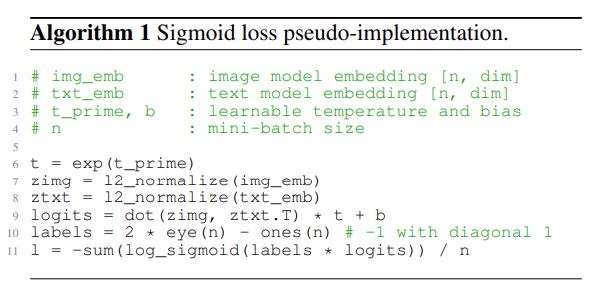

# pytorch_siglip

A Pytorch implementation of Siglip built from scratch

## Installation

### Environment Setup
```bash
git clone https://github.com/xinli2008/aigc_related.git
cd aigc_related/pytorch_siglip

conda create -n siglip python=3.10 -y && conda activate siglip
pip install -r requirements.txt -i https://pypi.tuna.tsinghua.edu.cn/simple
```

### Data Preparation

Training Dataset
```bash
cd dataset && wget https://hf-mirror.com/datasets/jingyaogong/minimind-v_dataset/resolve/main/pretrain_data.jsonl
wget https://hf-mirror.com/datasets/jingyaogong/minimind-v_dataset/resolve/main/pretrain_images.zip
unzip pretrain_images.zip && rm pretrain_images.zip
```

### Pretrained Model Weights
```bash
cd pretrained_models && mkdir -p bert-base-chinese && mkdir -p vit-base-patch16-224
modelscope download --model google-bert/bert-base-chinese  --local_dir ./bert-base-chinese
modelscope download --model google/vit-base-patch16-224 --local_dir ./vit-base-patch16-224
```

## Siglip pseudocode



## Tranining

```bash
cd dataset 
python3 preprocess_data.py --input_file pretrain_data.jsonl --output_file pretrain_data_processed.jsonl && cd ..
python3 train.py
```

## Test
```bash
python3 inference.py
```

## Acknowledgements
1. our code is heavily inspired by [this project](https://github.com/wyf3/llm_related). Please refer to their repository for more details.