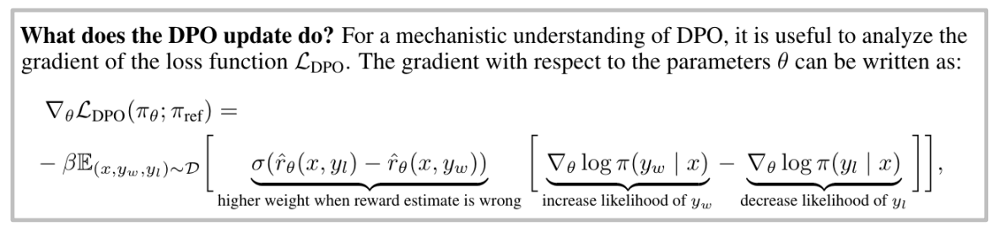
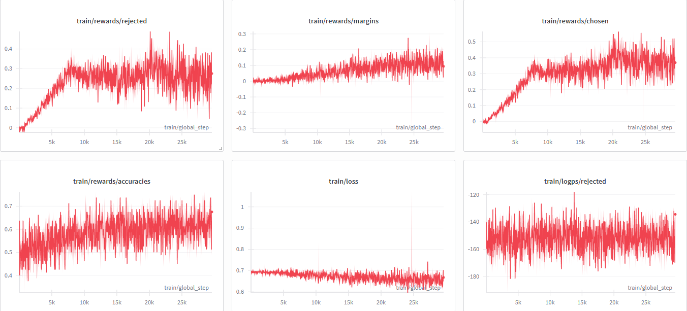

# Direct Preference Optimization (DPO)

该项目包含了对DPO(Direct Preference Optimization)的理论介绍与实践代码。

## 目录
- [Introduction](#introduction)
  - [核心优势](#核心优势)
  - [核心局限](#核心局限)
- [DPO 原理推导](#dpo-原理推导)
- [DPO 的梯度分析 (Mechanistic Understanding)](#5-dpo-的梯度分析-mechanistic-understanding)
- [DPO 长度偏好 (Length Bias)](#dpo-长度偏好-length-bias)
  - [一、为什么 DPO 偏好更长输出？](#一为什么-dpo-偏好更长输出)
  - [二、输出变长会带来什么问题？](#二输出变长会带来什么问题)
  - [三、如何缓解 DPO 长度偏好？](#三如何缓解-dpo-长度偏好)
  - [四、面试精简口述版](#四面试精简口述版)
- [PyTorch 代码示例](#pytorch-代码示例)
  - [核心细节：Logits Shift（错位对齐）](#核心细节logits-shift错位对齐)
- [Online DPO (Iterative DPO)](#online-dpo-iterative-dpo)
- [训练监控指南 (Wandb Metrics)](#训练监控指南-wandb-metrics)
- [Diffusion-DPO](#diffusion-dpo)
- [Flow Matching DPO](#flow-matching-dpo)

## Introduction

DPO 的核心思想是：绕过传统的 RLHF 中复杂的奖励模型（Reward Model）训练和强化学习（PPO）阶段，直接通过偏好数据来微调语言模型。它利用了奖励函数与最优策略之间的解析映射关系，将偏好对（Chosen vs Rejected）的分类损失函数直接转化为对策略模型的优化指标。DPO 的最终 Loss 函数形式为：

$$
\mathcal{L}_{DPO}(\pi_\theta; \pi_{ref}) = -\mathbb{E}_{(x, y_w, y_l) \sim D} \left[ \log \sigma \left( \beta \log \frac{\pi_\theta(y_w|x)}{\pi_{ref}(y_w|x)} - \beta \log \frac{\pi_\theta(y_l|x)}{\pi_{ref}(y_l|x)} \right) \right]
$$

其中：
- $\pi_\theta$ 是当前正在训练的策略模型。
- $\pi_{ref}$ 是参考模型（通常是冻结的 SFT 模型）。
- $y_w$ 和 $y_l$ 分别代表优选（winning）和拒绝（losing）的回答。
- $\beta$ 是一个超参数，控制对参考模型的偏差（KL 散度约束的强度）。
- $\sigma$ 是 Sigmoid 函数。

### 核心优势：
- **稳定性高**：不需要像 PPO 那样调优多个超参数（如 Value Function, KL Penalty 等）。
- **效率高**：只需要一个参考模型（Reference Model）和一个训练模型，计算开销更小。
- **简单直观**：本质上是一个在偏好数据上的二元交叉熵（BCE）优化。

### 核心局限：
- **极度依赖数据质量**：DPO 没有显式奖励模型作为"缓冲层"，偏好标注的噪声会直接反映在策略梯度中。一旦偏好对标注有误（即 $y_w$ 和 $y_l$ 被标反），模型会直接朝错误方向优化，且没有任何自纠正机制。
- **隐式奖励不可控**：DPO 将奖励函数隐含在策略比率中，无法像 PPO 那样对奖励信号做显式的监控与干预，训练过程的可解释性较差。

$$
r(x,y) = \beta \log \frac{\pi_\theta(y|x)}{\pi_{ref}(y|x)}
$$

- **Off-policy / Offline 分布偏移（DPO 最大痛点）**：
  - 从本质上看，DPO 确实是一个 **Off-policy（更准确地说是 Offline）** 的优化方法：它依赖一批固定的偏好数据（`Chosen` vs `Rejected`），并在这批静态样本上持续更新策略模型。
  - 问题在于，数据来自历史行为策略（Behavior Policy），而被优化的却是不断变化的当前策略（Target Policy, $\pi_\theta$）。随着训练推进，$\pi_\theta$ 的能力、措辞风格和 token 组合会逐渐偏离原始数据分布，形成显著的 **Data Distribution Shift / OOD**。
  - 换句话说，模型在中后期会进入一片训练数据覆盖不足的“盲区”，但离线训练过程缺少在线交互反馈来及时纠偏。
  - 这种分布偏移常见地带来两类后果：  
    1) **过度优化（Over-optimization）**：模型会对离线数据中的相关性进行过度放大；  
    2) **奖励钻空子（Reward Hacking）**：模型可能学会“伪特征”而非真正的人类偏好（例如把“回答更长”错误地当作“回答更好”，从而变得啰嗦、注水）。这是 DPO 最典型、也最常被忽视的偏差之一，详见 [DPO 长度偏好](#dpo-长度偏好-length-bias) 专节。
  - 因此，当前学术界和工业界普遍将“离线分布偏移”视为标准 DPO 的核心瓶颈，这也是 Online/Iterative DPO 受到重视的根本原因。

## DPO 原理推导

DPO 的精髓在于它通过数学变换，将强化学习目标转化为分类目标。

1.  **RLHF 的目标**：最大化奖励并满足 KL 约束。

$$
\max_{\pi} \mathbb{E}_{x \sim D, y \sim \pi} [r(x, y)] - \beta \mathbb{D}_{KL}(\pi || \pi_{ref})
$$

> 💡 **思考：这里的 $\beta$ (KL 惩罚系数) 太大或者太小，会带来什么现象呢？**
> 
> $\beta$ 控制着模型探索新策略与保留原有策略（参考模型 $\pi_{ref}$）之间的平衡：
> - **当 $\beta$ 太小时（惩罚力度弱）**：模型为了追求高奖励，会过度偏离参考模型。这容易导致**Reward Hacking（奖励作弊）**，模型可能会生成一些人类难以理解、乱码或极度重复的文本，仅仅因为这些文本在奖励模型（或偏好数据）中凑巧得分很高。模型的语言能力和泛化性会急剧下降。
> - **当 $\beta$ 太大时（惩罚力度强）**：模型被死死限制在参考模型 $\pi_{ref}$ 的分布内，不敢越雷池一步。这会导致**优化不足（Under-optimization）**，模型很难学到新的偏好模式，RLHF/DPO 的训练效果微乎其微，输出几乎和 SFT（监督微调）阶段一模一样。
> 
> 在实际 DPO 训练中，$\beta$ 通常设置在 $0.1$ 到 $0.5$ 之间，需要根据具体任务和参考模型的能力进行精细调参。
    
2.  **最优策略的解析解**：
    数学上可以证明，上述目标的最优解 $\pi^*$ 满足：

$$
\pi^*(y|x) = \frac{1}{Z(x)} \pi_{ref}(y|x) e^{\frac{1}{\beta}r(x,y)}
$$
    
3.  **反解奖励函数 (Implicit Reward)**：
    如果我们把上面的公式反过来，就可以用策略来表示奖励：

$$
r(x, y) = \beta \log \frac{\pi^*(y|x)}{\pi_{ref}(y|x)} + \beta \log Z(x)
$$
    
4.  **代入 Bradley-Terry 模型**：
    将这个 $r(x,y)$ 代入人类偏好概率公式 $P(y_w > y_l) = \sigma(r(x, y_w) - r(x, y_l))$，神奇的事情发生了：Z(x)被消掉了！最终得到了 DPO 的 Loss：
    
$$
\mathcal{L}_{DPO} = -\log \sigma \left( \beta \log \frac{\pi_\theta(y_w|x)}{\pi_{ref}(y_w|x)} - \beta \log \frac{\pi_\theta(y_l|x)}{\pi_{ref}(y_l|x)} \right)
$$

## 5. DPO 的梯度分析 (Mechanistic Understanding)

为了更直观地理解 DPO 究竟是如何更新模型参数的，我们可以对 DPO 的损失函数 $\mathcal{L}_{DPO}$ 求梯度。这能帮助我们从机制上拆解 DPO 的学习过程。



如上图所示，DPO 的参数更新梯度可以拆解为两个主要部分，本质上它是在做 **“对好回答进行正向梯度更新（推高概率），对坏回答进行负向梯度更新（压低概率）”** ，并且这种更新步长是 **被当前模型对偏好的预测误差所动态缩放的** 。

具体拆解如下：

1. **动态缩放权重 (Scaled by prediction error)**：
   梯度公式的前半部分是一个 Sigmoid 函数，它代表了 **“当前模型对偏好的预测错误率”**：

$$
\sigma(\hat{r}_\theta(x, y_l) - \hat{r}_\theta(x, y_w))
$$

   - 这里的隐式奖励：

$$
\hat{r}_\theta(x, y) = \beta \log \frac{\pi_\theta(y|x)}{\pi_{ref}(y|x)}
$$

   - **当模型预测错误时（即模型错误地认为 $y_l$ 的奖励高于 $y_w$ ）**：上述隐式奖励的差值会大于 0，Sigmoid 的输出接近于 1，这意味着此次更新将被赋予**更高的权重**。
   - **当模型预测正确时（即模型已经确信 $y_w$ 远好于 $y_l$ ）**：上述差值会小于 0，Sigmoid 输出接近 0，此次更新的权重会被极大地削弱。
   - **结论**：DPO 的这种机制会自动把主要的优化精力集中在那些模型还“算不准”的困难样本上（Hard Examples），而对那些已经学好的样本不再强求，从而避免了过拟合。

2. **梯度的方向 (Increase & Decrease Likelihood)**：
   梯度公式的后半部分指明了参数更新的具体方向：
   - 增加模型生成优选回答 $y_w$ 的概率（**Increase likelihood of $y_w$**）：

$$
\nabla_\theta \log \pi(y_w|x)
$$

   - 降低模型生成拒绝回答 $y_l$ 的概率（**Decrease likelihood of $y_l$**）：

$$
-\nabla_\theta \log \pi(y_l|x)
$$

通过上述分析我们可以得出结论，DPO 并没有引入复杂的 RL 机制，它在本质上是一个**带自适应权重的最大/最小似然估计（Maximum Likelihood Estimation）**。这种设计既优雅又高效，这也是它能取代传统 RLHF 复杂流程的核心原因。

> 💡 上述梯度分析中，隐式奖励 $\hat{r}_\theta(x, y)$ 是对序列所有 token 的 log-ratio **逐 token 求和**。这一设计正是 DPO **长度偏好（Length Bias）** 的数学根源——下文将系统展开成因、危害与缓解方案。

## DPO 长度偏好 (Length Bias)

> **本质：算法固有偏差 + 数据统计偏差，双重放大。**

### 一、为什么 DPO 偏好更长输出？

#### 1. 算法层面（损失函数与梯度根源）

标准 DPO 的隐式奖励定义为：

$$
r_\theta(x, y) = \beta \log \frac{\pi_\theta(y|x)}{\pi_{ref}(y|x)} = \beta \sum_{t=1}^{|y|} \Big[ \log \pi_\theta(y_t|x, y_{\lt t}) - \log \pi_{ref}(y_t|x, y_{\lt t}) \Big]
$$

- **逐 token log-ratio 求和，非均值**：奖励大小与序列 token 总数强绑定。即使单个 token 差异很小，累加后长序列的 $r_\theta(x, y_w)$ 会系统性远大于短序列的 $r_\theta(x, y_l)$。
- **梯度存在长度累积效应**：DPO 损失梯度展开后，梯度规模随序列长度放大。更长的 chosen 回复会产生更大的梯度更新，模型被激进地推向生成长回复。
- **本质**：token 级 KL 散度求和时，长短序列项数不对等，造成奖励估值扭曲，模型学会"变长就能提升收益"。

#### 2. 数据层面

偏好数据集（无论人工标注还是 GPT-4 等大模型标注）本身存在长度偏差：几乎所有偏好数据集中，chosen 回复的平均长度和中位数都天然大于 rejected。算法本身会放大长度信号，再叠加数据中天然的长短分布差异，形成**双重打击**，"偏好长输出"现象进一步恶化。

### 二、输出变长会带来什么问题？

#### 1. 奖励劫持 + OOD 自举（Reward Hacking + Distribution Shift）

- 模型不再学习真实人类偏好，而是学会投机——"输出更长 = 奖励更高"。
- 训练后期，模型生成内容偏离训练数据分布（OOD），长度与奖励的相关性进一步升高，出现**长度爆炸**。
- **落地表现**：文本冗余、无意义扩写、重复改写、过度细节堆砌、废话率上升。

#### 2. 评测污染，形成恶性反馈循环

- 用作评测判官的 LLM（如 GPT-4）本身也偏好长文本，更长输出更容易拿高分。
- **逻辑链**：DPO 训练让输出变长 → LLM 打分 win rate 上涨 → 指标虚高，看似对齐成功。
- **实质**：模型"刷长度"骗过评测指标，无法反映真实对齐能力；长度校正后，开源模型的真实能力可能与闭源模型差距显著。

#### 3. 对 SFT 基座极度敏感，放大前置分布缺陷

- DPO 优化高度依赖 SFT 基座的初始分布。
- 若 SFT 数据长短分布不均，DPO 的长度偏差会将该缺陷成倍放大；SFT 基座对齐能力差、长短回复区分度低时，DPO 很难实现有效的人类偏好对齐。

### 三、如何缓解 DPO 长度偏好？

缓解方案分为三类：**算法改进**、**数据预处理**、**工程落地**。

#### 方案 1：长度归一化奖励（SimPO，治本主流方案）

**核心思路**：将序列级求和奖励改为单 token 平均奖励，消除长度对奖励的缩放影响。

$$
r_{\mathrm{SimPO}}(x, y) = \frac{\beta}{|y|} \sum_{t=1}^{|y|} \log \pi_\theta(y_t \mid x, y_{\lt t})
$$

**关键特性**：

- 除以序列长度 $|y|$，从数学根源消除长度依赖；
- 新增奖励间隔 $\gamma$，强制长短回复间保持区分度；
- 无需参考模型 $\pi_{ref}$，显存与训练门槛更低；
- 训练目标和推理目标对齐，工业界常用、主流框架原生支持。

#### 方案 2：长度正则化约束（R-DPO、LD-DPO，低改造成本）

**R-DPO（Regularization-DPO）**：在标准 DPO 隐式奖励后增加长度差惩罚项，损失新增 $+\alpha |y_w| - \alpha |y_l|$ 正则项。降低长 chosen 样本的梯度权重，提升短 chosen 样本梯度权重，平衡长短更新幅度。优势是基于现有 DPO 流水线小幅修改即可实现，改造成本极低。

**LD-DPO**：对超长 chosen 回复、超出 rejected 长度的尾部 token，降低其对数似然权重，限制无意义加长。

#### 方案 3：偏好数据集长度去偏（数据层面根治）

- **SamPO**：对 chosen、rejected 序列按相同 token 数量随机采样，保证梯度计算时长短 token 项数对等；
- **LIFT-DPO**：在指令数据中加入长度约束提示词，过滤超出指定长度的超长 chosen 样本；
- **通用预处理**：多模型投票校正打分偏见、Prompt 工程约束回复长度、重采样均衡长短样本分布。

#### 工程落地最优实践

| 场景 | 推荐方案 |
|------|----------|
| 快速迭代、已有成熟 DPO 训练管线 | 优先 **R-DPO**，改动最小 |
| 新搭建对齐流程、追求稳定效果 | **SimPO + 长度均衡预处理数据集**，综合效果最优 |
| 配套措施 | 数据预处理阶段提前做长度去偏，从源头减轻算法长度偏移压力 |

### 四、面试精简口述版

<details>
<summary><b>Q：DPO 训练后为什么偏好更长输出？</b></summary>

两点核心原因：**算法层面**，DPO 隐式奖励是逐 token log 比值求和，序列越长累加奖励越高，梯度更新幅度也随长度放大，长回复天然占优；**数据层面**，偏好数据集中优质 chosen 回复本身就普遍比 rejected 更长，和算法偏置叠加后，模型疯狂倾向生成长文本。

</details>

<details>
<summary><b>Q：会造成什么问题？</b></summary>

**奖励劫持**：模型只会靠加长文本刷奖励，输出大量冗余废话，训练后期出现分布外长度爆炸；**评测失真**：LLM 打分判官偏爱长文本，模型靠刷长度虚涨指标，无法衡量真实对齐能力；**放大 SFT 缺陷**：SFT 阶段长短分布不平衡会被 DPO 成倍放大，基座质量差时对齐效果崩盘。

</details>

<details>
<summary><b>Q：如何缓解？</b></summary>

三类思路：**归一化奖励 SimPO**（奖励除以序列长度，把求和改为均值，彻底消除长度依赖）；**正则化 R-DPO**（在损失里加长度惩罚项，削弱长文本梯度更新权重，适配现有 DPO 管线）；**数据去偏**（采样均衡长短样本、增加长度约束 Prompt，从数据集源头减少长短分布差）。工程最优组合是 **SimPO 搭配长度均衡数据集**。

</details>

## PyTorch 代码示例

### 核心细节：Logits Shift（错位对齐）

在计算序列的 Log Probability 时，有一个极其关键却容易忽略的细节——**Logits 与 Labels 必须错位对齐**。

Transformer 语言模型的本质是**自回归预测**：在位置 $t$ 的输出 `logits[t]` 表示的是"**在看完前 $t$ 个 token 之后，预测第 $t+1$ 个 token 是什么**"。

因此，如果我们有一个长度为 $L$ 的序列 `[t₀, t₁, t₂, ..., t_{L-1}]`，模型的输入输出关系为：

```
输入 tokens:   [ t₀,  t₁,  t₂, ..., t_{L-2}, t_{L-1} ]
                 ↓    ↓    ↓           ↓
输出 logits:  [ l₀,  l₁,  l₂, ..., t_{L-2}             ]  （预测下一个）
                 ↓    ↓    ↓           ↓
对齐的 label: [ t₁,  t₂,  t₃, ..., t_{L-1}             ]  （真实的下一个）
```

即：`logits[:, :-1, :]` 需要与 `labels[:, 1:]` 对齐，Mask 也同步 Shift。

**如果不做 Shift，直接用 `logits[t]` 去对 `labels[t]`，就会变成用"预测第 $t+1$ 个"的分布去评估"第 $t$ 个"的概率，导致 Log Prob 计算完全错误，Loss 无意义。**

Pytorch 代码示例：

```python
import torch
import torch.nn.functional as F

class DPOInterviewCore:
    def __init__(self, beta: float = 0.1, label_smoothing: float = 0.0):
        self.beta = beta
        self.label_smoothing = label_smoothing

    @staticmethod
    def get_batch_logps(logits: torch.Tensor, labels: torch.Tensor, mask: torch.Tensor) -> torch.Tensor:
        """
        计算序列的 log 概率 (面试核心考点：Logits 错位处理)
        """
        # 1. Shift (错位对齐): 
        # 模型输出的 logits[t] 是预测第 t+1 个 token 的，所以要和 labels[t+1] 对齐
        if logits.shape[1] == labels.shape[1]:
            logits = logits[:, :-1, :]
            labels = labels[:, 1:]
            mask = mask[:, 1:]
        
        # 2. 计算 Log Softmax
        # [Batch, Seq-1, Vocab]
        per_token_logps = F.log_softmax(logits, dim=-1)
        
        # 3. Gather: 提取 Label 对应的概率
        # index unsqueeze 后变成 [Batch, Seq-1, 1]，gather 后再 squeeze 回来
        log_probs = torch.gather(per_token_logps, dim=2, index=labels.unsqueeze(2)).squeeze(2)
        
        # 4. Mask 求和: 忽略 Padding 部分，算出整句的 Log Prob
        return (log_probs * mask).sum(dim=-1)

    def compute_loss(self, pi_logps_w, pi_logps_l, ref_logps_w, ref_logps_l):
        """
        计算 DPO Loss 及辅助指标 (对应文档中的 Loss 公式和 Wandb 监控)
        """
        # 1. 计算 Log Ratios (策略 / 参考)
        pi_logratios = pi_logps_w - pi_logps_l
        ref_logratios = ref_logps_w - ref_logps_l

        # 2. 计算 Logits (对应 DPO 核心公式内部)
        # logits = beta * log( (pi_w/ref_w) / (pi_l/ref_l) )
        logits = pi_logratios - ref_logratios

        # 3. 计算 Loss (使用 LogSigmoid 数值更稳定)
        # Loss = -log(sigmoid(beta * logits))
        losses = -F.logsigmoid(self.beta * logits) * (1 - self.label_smoothing) - \
                 F.logsigmoid(-self.beta * logits) * self.label_smoothing
        
        # 4. 计算隐式奖励 (Implicit Rewards) 用于监控
        # 对应文档: r(x,y) = beta * (log pi - log ref)
        with torch.no_grad():
            chosen_rewards = self.beta * (pi_logps_w - ref_logps_w)
            rejected_rewards = self.beta * (pi_logps_l - ref_logps_l)
            reward_accuracies = (chosen_rewards > rejected_rewards).float()

        return losses.mean(), chosen_rewards.mean(), rejected_rewards.mean(), reward_accuracies.mean()

    def step(self, batch, policy_model, ref_model):
        """
        模拟一次训练前向传播过程
        """
        # 1. 获取 Policy Model 的 LogProbs
        pi_logps_w = self.get_batch_logps(policy_model(batch['chosen_ids']).logits, batch['chosen_ids'], batch['chosen_mask'])
        pi_logps_l = self.get_batch_logps(policy_model(batch['reject_ids']).logits, batch['reject_ids'], batch['reject_mask'])

        # 2. 获取 Reference Model 的 LogProbs (注意: 必须 no_grad)
        with torch.no_grad():
            ref_logps_w = self.get_batch_logps(ref_model(batch['chosen_ids']).logits, batch['chosen_ids'], batch['chosen_mask'])
            ref_logps_l = self.get_batch_logps(ref_model(batch['reject_ids']).logits, batch['reject_ids'], batch['reject_mask'])

        # 3. 计算 Loss
        loss, reward_w, reward_l, acc = self.compute_loss(pi_logps_w, pi_logps_l, ref_logps_w, ref_logps_l)

        return loss, reward_w, reward_l, acc
```

## Online DPO (Iterative DPO)

虽然标准 DPO 是异策（Off-policy）的，但目前的趋势是让 DPO 走向同策（On-policy），即 Online DPO。

### 1. 核心流程
Online DPO 不再依赖于固定的静态偏好数据集，其训练流程是一个闭环迭代过程：
- **采样**：使用当前正在训练的策略模型 $\pi_\theta$ 对 Prompt 进行实时推理，生成多个不同的回答。
- **打标**：利用一个高质量的奖励模型（Reward Model）或更强的语言模型（如 GPT-4）作为裁判，对生成的结果进行实时打分，并构建出新的优选对 $(y_w, y_l)$。
- **训练**：在这些由当前模型实时生成的偏好数据上执行 DPO 损失函数更新。
- **循环**：重复上述步骤，使模型在自己生成的分布下不断进化。

### 2. 为什么需要 Online DPO？
- **解决分布偏移**：标准 DPO 只在历史数据上优化。如果模型在推理阶段生成了全新的 token 组合，可能会出现过度自信或胡言乱语。Online DPO 强制模型在自己当前的输出分布中学习正确方向。
- **探索能力更强**：类似于 PPO，Online DPO 能够探索模型当前的策略空间，而不仅仅是模仿旧数据的分布。
- **性能上限更高**：实验证明，经过多轮迭代的 Online DPO 效果通常优于单轮的 Offline DPO，在 AlpacaEval 等榜单上表现更强。

### 3. 与 PPO 的区别
- **稳定性**：Online DPO 依然沿用了 DPO 的分类损失函数，不需要训练 Critic 网络，也不需要复杂的优势函数估计，收敛比 PPO 更快。
- **资源消耗**：虽然比静态 DPO 多了实时采样的步骤，但由于去掉了 PPO 中的价值函数对齐，整体架构依然更轻量。

## 训练监控指南 (Wandb Metrics)

在DPO训练中，应重点关注以下指标以判断训练是否正常：

1. **`train/rewards/margins` (最关键)**：
    - **逻辑**：代表 `Chosen` 奖励与 `Rejected` 奖励的差值，对应 DPO 损失函数中的：
      $$ \beta \log \frac{\pi_\theta(y_w|x)}{\pi_{ref}(y_w|x)} - \beta \log \frac{\pi_\theta(y_l|x)}{\pi_{ref}(y_l|x)} $$
    - **正常表现**：从 0 左右稳定上升并保持为正值。如果该值不涨或为负，说明模型未学到偏好。

2. **`train/rewards/accuracies`**：
    - **逻辑**：模型正确区分优选与拒绝回答的准确率，即隐式奖励满足以下条件的样本比例：
      $$ r(x, y_w) > r(x, y_l) $$
    - **正常表现**：从 0.5（由于模型初始与参考模型一致，等同于随机猜测）开始稳步上升，通常最终处于 0.6~0.8 之间。该值若接近 1.0 可能意味着过拟合。

3.  **`train/loss`**：
    - **正常表现**：DPO 的 Loss 下降通常非常缓慢且伴随波动。只要 `margins` 在涨，Loss 的小幅波动是完全正常的，无需追求像 SFT 那样的剧烈下降。

4.  **`train/logps/chosen & rejected`**：
    - **正常表现**：反映模型输出概率的偏移。只要 `chosen` 的增长趋势强于 `rejected`，即代表优化方向正确。




## Diffusion-DPO

DPO 同样可以应用于扩散模型（Diffusion Models）的微调。其核心思想与语言模型中的 DPO 类似，都是通过偏好数据直接优化模型参数。

Diffusion-DPO 的最终 Loss 函数形式为：

$$
\mathcal{L}_{DPO} = -\mathbb{E} \left[ \log \sigma \left( -\frac{\beta}{T} \omega(\lambda_t) \cdot \Delta \right) \right]
$$

其中，$\Delta$ 代表在 $x_w$ 与 $x_l$ 上的相对误差之差：

$$
\Delta = \underbrace{ (\|\epsilon - \epsilon_\theta(x_t^w, t)\|^2 - \|\epsilon - \epsilon_{ref}(x_t^w, t)\|^2) }_{\text{在 } x_w \text{ 上的相对误差}} - \underbrace{ (\|\epsilon - \epsilon_\theta(x_t^l, t)\|^2 - \|\epsilon - \epsilon_{ref}(x_t^l, t)\|^2) }_{\text{在 } x_l \text{ 上的相对误差}}
$$

参数说明：
- $\epsilon$：扩散过程中加入的真实噪声。
- $\epsilon_\theta(x_t^w, t)$：训练模型在 $x_w$ (preferred image) 上的噪声预测。
- $\epsilon_{ref}(x_t^w, t)$：参考模型在 $x_w$ 上的噪声预测。
- $\epsilon_\theta(x_t^l, t)$：训练模型在 $x_l$ (rejected image) 上的噪声预测。
- $\epsilon_{ref}(x_t^l, t)$：参考模型在 $x_l$ 上的噪声预测。
- $\omega(\lambda_t)$：时间步相关的权重系数。
- $\beta$：控制偏离参考模型的程度。
- $T$：总时间步长。

## Flow Matching DPO

如果预测目标是 Flow Matching（流匹配），其 Loss 函数形式如下，主要通过预测的“速度”（velocity/flow）来计算：

$$
\begin{cases}
\text{Diff}_{\text{policy}} = (\|v_\theta(x_t^w, h, t) - v_t^w\|_2^2 - \|v_\theta(x_t^l, h, t) - v_t^l\|_2^2) \\
\text{Diff}_{\text{ref}} = (\|v_{\text{ref}}(x_t^w, h, t) - v_t^w\|_2^2 - \|v_{\text{ref}}(x_t^l, h, t) - v_t^l\|_2^2) \\
\mathcal{L}_{\text{DPO}} = -\mathbb{E}_{h, (x_0^w, x_0^l) \sim \mathcal{D}, t \sim U(0,1)} [\log \sigma (-\beta (\text{Diff}_{\text{policy}} - \text{Diff}_{\text{ref}}))]
\end{cases}
$$

参数说明：
- $v_\theta(x_t, h, t)$：训练模型在条件 $h$ 和时间步 $t$ 下对状态 $x_t$ 的速度预测。
- $v_{\text{ref}}(x_t, h, t)$：参考模型对状态 $x_t$ 的速度预测。
- $v_t^w, v_t^l$：目标速度（Target Flow），通常由 $x_0$ 和噪声 $\epsilon$ 通过插值得到。
- $x_t^w, x_t^l$：在时间步 $t$ 下，由 $x_w$ 和 $x_l$ 分别插值得到的中途状态。
- $h$：条件信息（如 Prompt）。
- $\epsilon$：采样过程中使用的基础高斯噪声。
- $\beta$：超参数，控制偏离参考模型的程度。