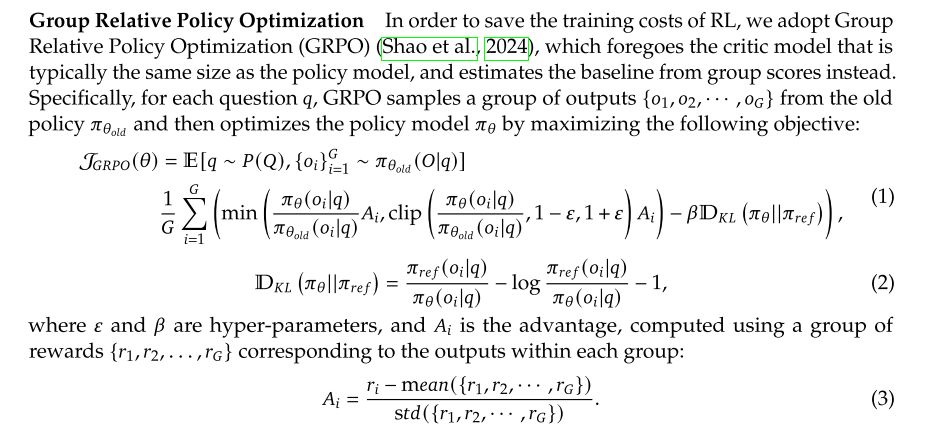
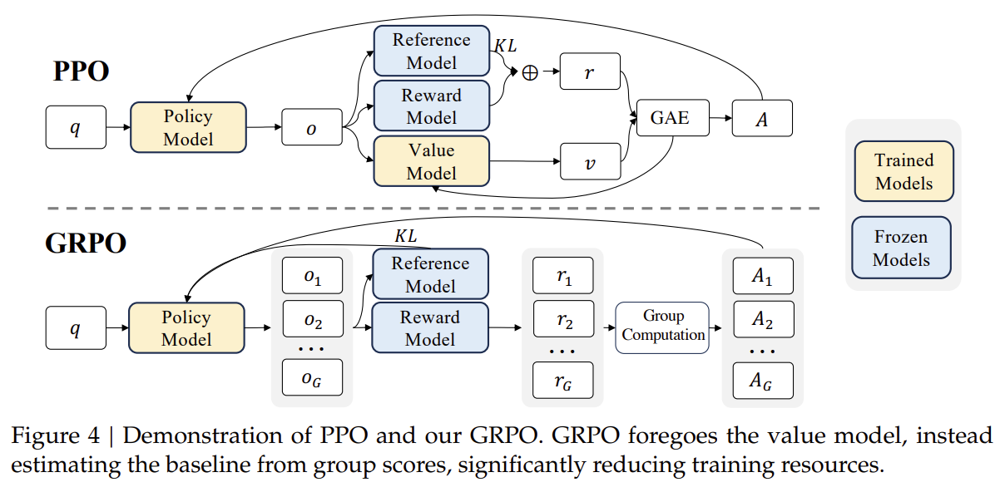
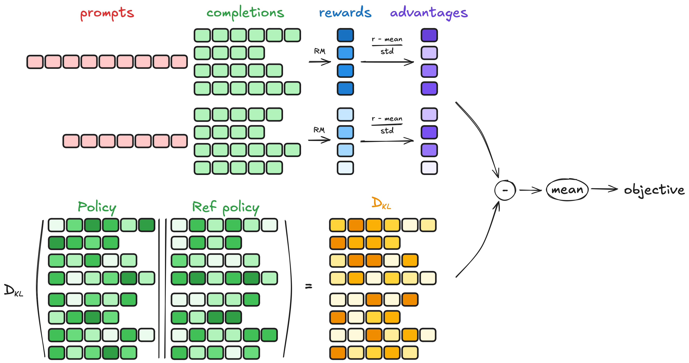
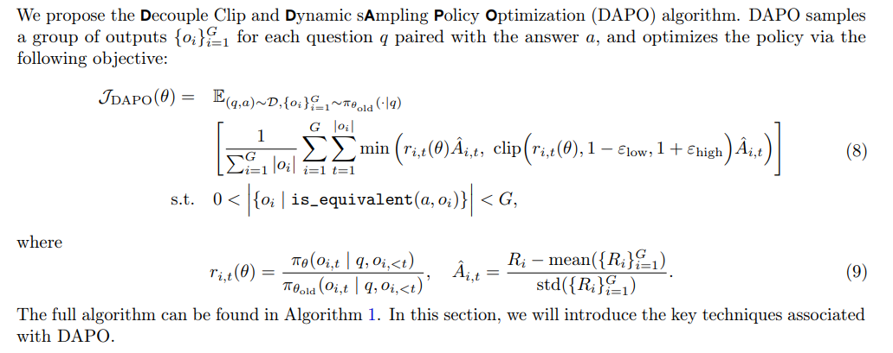
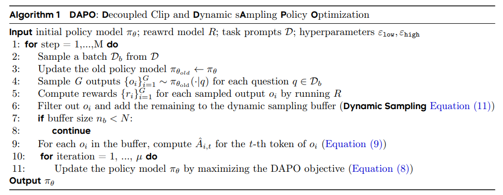
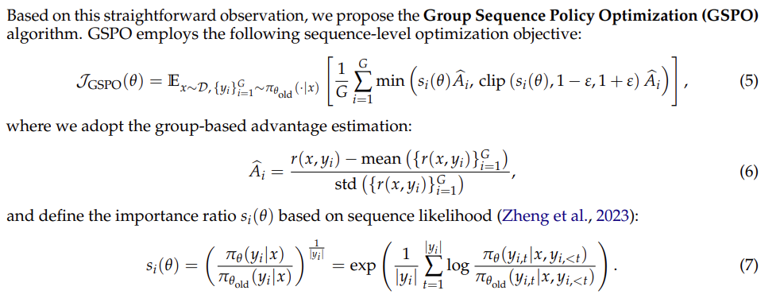

# Group Relative Policy Optimization (GRPO)

Group Relative Policy Optimization (GRPO) 是 DeepSeek-R1 中使用的一种强化学习算法。为了节省 RL 的训练成本，GRPO 放弃了传统 PPO 中所需的价值函数估计机制（通常通过在策略模型主干上附加一个轻量级的 Value Head 来实现），转而利用同一 prompt 下多个生成响应的组内奖励统计量（如均值）来估计优势函数的基线（baseline）。

## 目录
- [算法流程对比](#算法流程对比)
- [核心公式](#核心公式)
  - [1. 目标函数 (Objective Function)](#1-目标函数-objective-function)
  - [2. KL 散度计算 (KL Divergence)](#2-kl-散度计算-kl-divergence)
  - [3. 优势函数估计 (Advantage Estimation)](#3-优势函数估计-advantage-estimation)
- [GRPO 与 PPO 的区别](#grpo-与-ppo-的区别)
- [GRPO的核心流程](#grpo的核心流程)
- [PyTorch 代码示例](#pytorch-代码示例)
- [GSPO (Group Sequence Policy Optimization)](#gspo-group-sequence-policy-optimization)
  - [GSPO 与 GRPO 的核心区别](#gspo-与-grpo-的核心区别)
  - [PyTorch 代码示例 (GSPO 核心实现)](#pytorch-代码示例-gspo-核心实现)

---

## 算法流程对比

相比于传统的 PPO 算法，GRPO 显著减少了训练过程中的资源消耗。



*图 1: PPO 与 GRPO 的流程对比。GRPO 省去了价值函数模型（Value Function Model），通过组计算（Group Computation）来估计基准。*

## 核心公式

对于每个问题 $q$，GRPO 从旧策略 $\pi_{\theta_{old}}$ 中采样一组输出 $\{o_1, o_2, \dots, o_G\}$，然后通过最大化以下目标函数来优化策略模型 $\pi_\theta$：



### 1. 目标函数 (Objective Function)
$$\mathcal{J}_{GRPO}(\theta) = \mathbb{E} [q \sim P(Q), \{o_i\}_{i=1}^G \sim \pi_{\theta_{old}}(O|q)] \left[ \frac{1}{G} \sum_{i=1}^G \left( \min \left( \frac{\pi_\theta(o_i|q)}{\pi_{\theta_{old}}(o_i|q)} A_i, \text{clip} \left( \frac{\pi_\theta(o_i|q)}{\pi_{\theta_{old}}(o_i|q)}, 1-\varepsilon, 1+\varepsilon \right) A_i \right) - \beta \mathbb{D}_{KL}(\pi_\theta || \pi_{ref}) \right) \right]$$

### 2. KL 散度计算 (KL Divergence)
$$\mathbb{D}_{KL}(\pi_\theta || \pi_{ref}) = \frac{\pi_{ref}(o_i|q)}{\pi_\theta(o_i|q)} - \log \frac{\pi_{ref}(o_i|q)}{\pi_\theta(o_i|q)} - 1$$

### 3. 优势函数估计 (Advantage Estimation)
GRPO 不需要价值函数（Value Function），其优势函数通过组内奖励的相对得分来计算：
$$A_i = \frac{r_i - \text{mean}(\{r_1, r_2, \dots, r_G\})}{\text{std}(\{r_1, r_2, \dots, r_G\})}$$



## GRPO 与 PPO 的区别

1.  **取消价值函数模型（Value Function Model）**：
    *   **PPO**：需要训练一个价值函数网络（通常在 Policy Model 后面接一个 Value Head）来预测状态价值，以此计算基准。
    *   **GRPO**：完全去掉了价值函数模型，通过在同一个问题下采样的 $G$ 个答案的平均得分作为基准，显著降低了显存占用（约节省 50%）。
2.  **采样方式（Multi-Output Sampling）**：
    *   **PPO**：通常针对每个问题采样一个答案构成轨迹。
    *   **GRPO**：针对每一个问题采样一组（Group）答案，利用组内的相对质量来驱动模型优化。
3.  **优势函数计算**：
    *   **PPO**：依赖价值函数模型预测的值来计算优势。通常使用 GAE（Generalized Advantage Estimation）：
    
        $$\delta_t = r_t + \gamma V(s_{t+1}) - V(s_t)$$
        
        $$A_t = \sum_{k=0}^{\infty} (\gamma \lambda)^k \delta_{t+k}$$
        
    *   **GRPO**：直接使用采样组内 Reward 的标准差归一化结果，简单高效：
    
        $$A_i = \frac{r_i - \text{mean}(\{r_1, r_2, \dots, r_G\})}{\text{std}(\{r_1, r_2, \dots, r_G\})}$$
    *   **关键粒度差异——句子级 vs Token 级**：
        *   **PPO 的优势函数是 Token 级别的**：GAE 通过逐步递归为序列中**每个 Token 单独计算一个优势值**，同一条回复中不同位置的 Token 优势值各不相同。        
        *   **GRPO 的优势函数是句子级别的**：A_i 是对整条回复打的一个**标量分数**，在实际计算 Loss 时，通过广播（`expand_as`）将这个值**复制到该回复的每一个 Token 上**，同一条回复中所有 Token 共享同一个优势值。这是 GRPO 去掉 Value Head 后必然的取舍——没有逐步的状态价值预测，就无法做到 Token 级别的细粒度评估。
4.  **KL 散度的处理**：
    *   **PPO**：通常将 KL 散度作为惩罚项合在 Reward 中（ $r' = r - \beta KL$ ）。
    *   **GRPO**：将 KL 散度直接放在目标函数（Objective）中参与优化，数学表达更直观。

## GRPO的核心流程

### 1. 组采样 (Group Sampling)
对于每一个输入的提示词（Prompt） q，模型根据当前策略 $\pi_{\theta}$ 同时采样生成一组共 $G$ 个不同的回答候选：

$$ \{o_1, o_2, \dots, o_G\} $$

* **目的**：通过对同一问题生成多个变体，为后续的相对评估提供对比基准。

### 2. 奖励计算 (Reward Calculation)
利用奖励函数（Reward Function）或奖励模型对该组内的每个输出进行打分，得到对应的奖励值 r_1, r_2...
* **规则奖励**：如数学题答案是否正确、代码是否可运行。
* **模型奖励**：如语言质量、安全性、逻辑严密性等主观维度打分。

### 3. 优势估计 (Advantage Estimation)
这是 GRPO 的核心步骤。它通过计算组内奖励的归一化分数来衡量某个输出的“优劣”，而不需要额外的价值模型（Value Function）：

$$ A_i = \frac{r_i - \text{mean}(r_1, \dots, r_G)}{\text{std}(r_1, \dots, r_G)} $$

* **逻辑**：如果一个回答的分数高于本组平均水平，则认为该动作具有正向优势，反之则为负向。

### 4. 损失优化 (Loss Optimization)
基于计算出的优势值 $A_i$ 更新策略网络参数 $\theta$。损失函数通常包含：

* **策略损失**：采用 PPO 的裁剪（Clip）机制，确保策略更新平稳。

* **KL 散度惩罚**：计算当前策略与参考策略之间的 KL 散度，防止模型由于过度优化奖励而产生“模式崩坏”或失去表达能力。

## PyTorch 代码示例
```python
import torch
import torch.nn as nn
import torch.nn.functional as F

class GRPOInterviewCore:
    def __init__(self, clip_ratio: float = 0.2, beta: float = 0.01):
        self.clip_ratio = clip_ratio
        self.beta = beta  # KL 惩罚系数 (在 GRPO 中通常直接加在 Loss 里)

    @staticmethod
    def masked_mean(tensor: torch.Tensor, mask: torch.Tensor) -> torch.Tensor:
        """计算带 Mask 的均值"""
        return (tensor * mask).sum() / (mask.sum() + 1e-8)

    def compute_group_advantage(self, outcome_rewards: torch.Tensor, group_size: int, epsilon: float = 1e-8):
        """
        计算组内优势 (Group Relative Advantage)
        """
        # outcome_rewards shape: [Batch_Size] (其中 Batch_Size = Num_Prompts * Group_Size)
        
        # 1. 重塑形状：[Num_Prompts, Group_Size]
        # 把同一个 Prompt 生成的 Group_Size 个回答聚在一起
        grouped_rewards = outcome_rewards.view(-1, group_size)
        
        # 2. 计算组内均值和标准差 (Baseline)
        mean_rewards = grouped_rewards.mean(dim=1, keepdim=True)
        std_rewards = grouped_rewards.std(dim=1, keepdim=True)
        
        # 3. 标准化：(x - mean) / std
        # 这一步让优于组内平均的回答得到正优势，劣于平均的得到负优势
        grouped_advantages = (grouped_rewards - mean_rewards) / (std_rewards + epsilon)
        
        # 4. 恢复形状返回
        return grouped_advantages.view(-1)

    def compute_loss(self, log_probs, old_log_probs, ref_log_probs, advantages, response_mask):
        """
        计算 GRPO Loss
        包含：PPO Clipped Loss + KL Penalty
        """
        # 1. 优势对齐
        # advantages 是句子级别的 (scalar)，需要扩展到 Token 级别
        # [Batch, 1] -> [Batch, Seq_Len]
        token_advantages = advantages.unsqueeze(-1).expand_as(log_probs)

        # 2. 计算 PPO Clipped Loss (和标准 PPO 一样)
        ratio = torch.exp(torch.clamp(log_probs - old_log_probs, min=-20, max=20))
        surr1 = ratio * token_advantages
        surr2 = torch.clamp(ratio, 1.0 - self.clip_ratio, 1.0 + self.clip_ratio) * token_advantages
        
        # 注意：PPO 是最大化目标，这里算 Loss 要取负号
        surrogate_loss = -torch.min(surr1, surr2)

        # 3. 计算 KL 散度 (Per-Token KL)
        # 这里使用的是一种近似计算方式: exp(log_ratio) - log_ratio - 1
        # 这种方式保证 KL >= 0，且计算稳定
        ref_log_ratio = ref_log_probs - log_probs
        per_token_kl = torch.exp(ref_log_ratio) - ref_log_ratio - 1

        # 4. 总 Loss = 策略损失 + beta * KL惩罚
        # GRPO 的论文中，KL 常常作为正则项直接加在 Loss 里，而不是扣在 Reward 里
        total_token_loss = surrogate_loss + self.beta * per_token_kl
        
        final_loss = self.masked_mean(total_token_loss, response_mask)
        
        # 计算平均 KL 用于监控
        with torch.no_grad():
            mean_kl = self.masked_mean(per_token_kl, response_mask)

        return final_loss, mean_kl

    def step(self, batch_data, group_size: int = 4):
        """执行一步训练"""
        # 1. 计算组内优势 (替代了 PPO 中的 GAE)
        advantages = self.compute_group_advantage(batch_data['outcome_rewards'], group_size=group_size)
        
        # 2. 计算 Loss
        return self.compute_loss(
            log_probs=batch_data['log_probs'], 
            old_log_probs=batch_data['old_log_probs'], 
            ref_log_probs=batch_data['ref_log_probs'], 
            advantages=advantages, 
            response_mask=batch_data['response_mask']
        )
```

## DAPO (Decoupled Clip and Dynamic sAmpling Policy Optimization)

DAPO 是在 GRPO 基础上的一次针对“采样质量”和“梯度信号利用率”的改进。它关注的问题是：GRPO 在实际训练中会浪费大量本来有价值的学习信号，尤其是在裁剪过严、样本组没有区分度、长回答梯度被稀释时，训练效率会明显下降。

### DAPO 相比 GRPO 的核心改进

#### 1. Clip-Higher：放宽正向更新的裁剪上限

GRPO 通常使用对称裁剪区间，例如 $[1-\varepsilon, 1+\varepsilon]$。这会导致一个问题：如果某个好 token 在旧模型里的概率本来很低，例如 0.2，而新模型成功把它提升到 0.4，那么重要性比例就是 2.0，很容易被 $1+\varepsilon$ 的上限直接截断。

DAPO 将裁剪上下限解耦，并调高正向优势样本的上限，例如使用 $1+\varepsilon_{high}$。这样可以给那些“好但旧策略不容易采到”的 token 更多放大空间，避免过早压住有价值的提升信号。



#### 2. Dynamic Sampling：过滤没有梯度信息的样本组

**GRPO 依赖组内相对优势来计算更新信号。如果同一个问题采样出的多个回答全对，或者全部错误，那么组内奖励没有差异，优势值会全部接近 0，几乎不能提供有效梯度。**

DAPO 在采样阶段加入动态过滤：保留既有正确回答、也有错误回答的样本组，丢弃全对或全错的组。这样每个 batch 中的样本都更可能包含可学习的偏好差异，减少“自浪费算力”的情况。



#### 3. Token-Level Gradient Loss：缓解长回复中的梯度稀释

在长文本生成任务中，如果把整条回复的优势信号平均到所有 token 上，长回复里的有效梯度可能会被大量普通 token 稀释。DAPO 使用 token 级别的梯度损失调整，让每个有效 token 都能更直接地贡献策略梯度。

这个设计可以提升长回答训练中的信号利用率，避免模型因为回复长度变长而逐渐丢失关键 token 上的学习强度。

> **一句话总结**：DAPO 仍然沿用 GRPO 的组内相对优势思想，但通过更灵活的裁剪、更有信息量的动态采样，以及 token 级别的梯度调整，让训练信号更集中、更稳定。

## GSPO (Group Sequence Policy Optimization)

GSPO（Group Sequence Policy Optimization）是由 Qwen 团队提出的一种用于训练大语言模型的强化学习算法变种，旨在解决大规模语言模型（尤其是处理长回复任务和训练 MoE 模型时）在强化学习阶段面临的训练稳定性问题。

### GSPO 与 GRPO 的核心区别

**GSPO与GRPO的核心区别在于重要性采样权重（Importance Ratio）的计算层级以及由此带来的梯度优化方式和工程实现收益。简而言之：GRPO是Token级别的，而GSPO是Sequence级别的。**

#### GRPO训练MoE模型的问题：为什么GRPO在MoE里会崩？

因为GRPO是在Token（词）级别去做重要性采样（Importance Sampling）和概率修正的。在MoE架构中，不同的Token会被路由（Routing）给不同的专家。Token级别的微小概率扰动，在MoE的动态路由放大下，会产生巨大的方差和结构性噪声，导致训练极度不稳定。

#### 1. 核心动机：优化单元与奖励单元的对齐
- **GRPO 的痛点**：**GRPO 错误地将重要性采样权重应用在了词元（token）级别。优化的目标单元应当与奖励单元相匹配，既然奖励是基于整个回复序列（sequence）评估发放的，那么在单个词元级别上进行离线策略（off-policy）校正就是有问题的。本质上，GRPO 的优化单元（token）与奖励单元（整条 sequence 的 reward）是不匹配的。**
- **GSPO 的改进**：GSPO 放弃了 token 级别的目标，改为利用序列似然（sequence likelihood）来定义重要性权重，并直接在 sequence 级别进行 clipping、奖励和优化。

#### 2. 数学定义与公式差异

两者在计算重要性比例时的数学形式有显著的不同。

**GRPO 的 Token 级重要性比例**：
GRPO 计算的是当前策略和旧策略在单个 token 上的概率比：

$$\mathcal{J}_{GRPO}(\theta) = \mathbb{E} [q \sim P(Q), \{o_i\}_{i=1}^G \sim \pi_{\theta_{old}}(O|q)] \left[ \frac{1}{G} \sum_{i=1}^G \left( \min \left( \frac{\pi_\theta(o_i|q)}{\pi_{\theta_{old}}(o_i|q)} A_i, \text{clip} \left( \frac{\pi_\theta(o_i|q)}{\pi_{\theta_{old}}(o_i|q)}, 1-\varepsilon, 1+\varepsilon \right) A_i \right) - \beta \mathbb{D}_{KL}(\pi_\theta || \pi_{ref}) \right) \right]$$

**GSPO 的 Sequence 级重要性比例**：
GSPO 计算的是整条回复序列的似然比，并进行了长度归一化（Length Normalization）以控制数值范围并降低方差：



如果不进行长度归一化，少数 token 的似然变化就会导致 sequence 级别重要性比例的剧烈波动。

> **一句话总结**：GRPO 的重要性权重是在**单个 Token**上取「当前策略概率 / 旧策略概率」的比值；GSPO 则是先把整条序列上每个 token 的「当前策略对数概率 - 旧策略对数概率」全部相加，再除以序列长度取平均，最后对结果取指数，得到**整条序列**层面的重要性比例。

#### 3. 梯度更新与裁剪（Clipping）机制
- **梯度权重的分配**：在计算梯度时，GRPO 会根据每个 token 自己的重要性权重 $w_{i,t}(\theta)$ 不平等地对 token 的对数似然梯度进行加权。这种不平等的权重会导致不稳定性。相反，GSPO 对同一条回复中的所有 token 分配完全相等的权重，从而消除了这个不稳定因素。
- **Clipping 的对象**：GRPO 裁剪的是单个 token，而 GSPO 对整条回复进行裁剪，将过度“偏离策略（off-policy）”的样本排除在梯度估计之外。尽管 GSPO 裁剪掉的 token 比例比 GRPO 高出两个数量级（意味着用于实际梯度估计的样本更少），但其训练效率和信号可靠性依然远超 GRPO。

### PyTorch 代码示例 (GSPO 核心实现)

以下代码展示了如何将 GRPO 中的 Token 级别重要性权重替换为 GSPO 中的 Sequence 级别权重：

```python
import torch

def compute_gspo_importance_weights(
    per_token_logps: torch.Tensor, 
    old_per_token_logps: torch.Tensor, 
    mask: torch.Tensor
) -> torch.Tensor:
    """
    计算 GSPO 的 Sequence 级别重要性采样权重
    
    Args:
        per_token_logps: 当前策略的对数概率，形状 [Batch_Size, Seq_Len]
        old_per_token_logps: 旧策略的对数概率，形状 [Batch_Size, Seq_Len]
        mask: 补全序列的有效 mask (1 表示有效 token, 0 表示 padding)，形状 [Batch_Size, Seq_Len]
        
    Returns:
        coef_1: Sequence 级别的重要性比例 (对应公式中的 s_i(theta))，形状 [Batch_Size, 1]
    """
    # 1. 计算每个 Token 的对数概率差 (等价于 log(P_theta / P_old))
    log_ratio = per_token_logps - old_per_token_logps
    
    # 2. Sequence 级别求和并进行长度归一化 (对应公式中的 1/|y_i| * sum(...))
    # 计算每个序列的有效 Token 数量 |y_i|
    seq_len = mask.sum(dim=-1).clamp(min=1.0)
    
    # 对有效 token 的 log_ratio 求和，然后除以有效长度
    log_importance_weights = (log_ratio * mask).sum(dim=-1) / seq_len
    
    # 扩展维度以匹配后续计算 [Batch_Size] -> [Batch_Size, 1]
    # 这样在计算 Loss 时，这个权重会广播给序列中的所有 Token
    log_importance_weights = log_importance_weights.unsqueeze(-1)
    
    # 3. 通过指数函数还原为真实的比例 (对应公式最外层的 exp)
    coef_1 = torch.exp(log_importance_weights)
    
    return coef_1
```