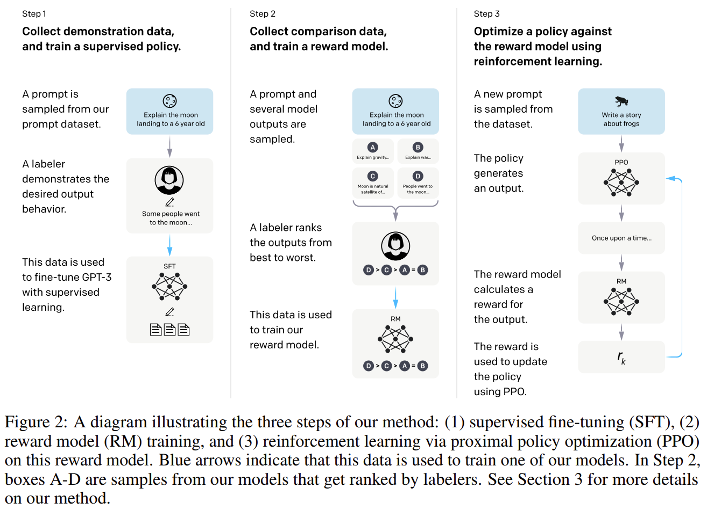
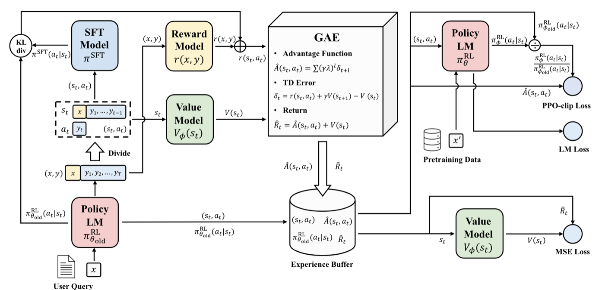

# Reinforcement Learning from Human Feedback (RLHF) 

## 目录
- [Introduction](#introduction)
- [Reward Model (RM)](#reward-model-rm)
  - [模型架构 (Architecture)](#模型架构-architecture)
  - [损失函数 (Loss Function)](#损失函数-loss-function)
- [On-policy vs. Off-policy](#on-policy-vs-off-policy)
- [PPO 推导过程](#ppo-推导过程)
  - [初始目标：最大化期望回报](#初始目标最大化期望回报)
  - [轨迹采样 (Trajectory Sampling)](#轨迹采样-trajectory-sampling)
  - [降低方差（一）：因果性与未来奖励](#降低方差一因果性与未来奖励)
  - [降低方差（二）：引入基线与优势函数](#降低方差二引入基线与优势函数)
  - [重要性采样 (Importance Sampling)](#重要性采样-importance-sampling)
- [PPO 核心思想](#ppo-核心思想)
  - [PPO 流程拆解](#ppo-流程拆解)
    - [1. 采样与评价阶段（左侧及中间）](#1-采样与评价阶段左侧及中间)
    - [2. 优势估计 (GAE 部分)](#2-优势估计-gae-部分)
    - [3. 更新与优化阶段（右侧）](#3-更新与优化阶段右侧)
  - [1. 策略损失 (Clipped Objective)](#1-策略损失-clipped-objective)
    - [A. 核心变量：概率比率 ratio](#a-核心变量概率比率-r_ttheta)
    - [B. 为什么要“剪切” (Clip)？](#b-为什么要剪切-clip)
    - [C. 为什么取“最小值” (Min)？](#c-为什么取最小值-min)
    - [总结：PPO 在保护什么？](#总结ppo-在保护什么)
  - [2. 价值损失 (Value Function Loss)](#2-价值损失-value-function-loss)
    - [流程拆解：](#流程拆解)
    - [为什么要这么做？](#为什么要这么做)
- [PPO的痛点](#ppo的痛点)
- [PyTorch 代码实现](#pytorch-代码实现)

## Introduction



在大型语言模型（LLMs）的训练中，仅仅通过在大规模语料上进行无监督的预训练（Pre-training）往往无法保证模型输出的内容符合人类的价值观、偏好或特定意图（例如：有用性、真实性和无害性）。为了解决这种“对齐（Alignment）”问题，基于人类反馈的强化学习（RLHF, Reinforcement Learning from Human Feedback） 应运而生。

标准的 RLHF 流程（如 InstructGPT 和 ChatGPT 所采用的）通常包含以下三个关键步骤：

1. 监督微调 (Supervised Fine-Tuning, SFT)

   首先，收集一批高质量的人类示范数据（即 Prompt 和对应的理想回答），利用这些数据对预训练模型进行有监督微调。这一步让模型初步学会“如何遵循指令”并输出符合格式要求的文本。
   
2. 训练奖励模型 (Reward Model Training)

   由于直接获取大量高质量的示范数据成本极高，因此转而让人类对模型针对同一 Prompt 生成的多个回答进行偏好排序。利用这些对比数据，训练一个独立的奖励模型（Reward Model, RM），使其能够模仿人类的评判标准，自动为模型生成的文本给出一个标量奖励分数。
   
3. 通过强化学习优化策略 (RL Optimization)

   有了可以自动打分的奖励模型后，就可以利用强化学习算法来持续优化生成模型。在这个阶段，模型根据输入的 Prompt 生成回答，并由奖励模型对其进行评分。由于文本生成是一个离散的采样过程，无法直接通过梯度反向传播来最大化奖励，因此需要借助强化学习算法来更新模型参数，引导模型生成更高分的回答。同时，为了防止模型过度迎合奖励模型而导致输出退化，通常还会引入 KL 散度惩罚，限制其偏离初始的 SFT 模型太远。虽然 InstructGPT 等工作采用了 PPO（近端策略优化） 作为主流算法，但这一阶段本质上是强化学习的最优化过程，也可以使用其他对齐算法（如 DPO 等）。

本项目重点剖析 RLHF 流程中的核心难点——PPO 算法的理论推导与核心思想，并结合代码实现来帮助理解。

## Reward Model (RM)

奖励模型的目标是学习人类的偏好，将每一个回答（Response）映射为一个标量分数（Reward）。

### 模型架构 (Architecture)
奖励模型的构建通常基于预训练的 Transformer 模型：
- 输入：将 Query 与 Response 拼接后的 Token 序列。
- 特征提取：序列通过 Transformer 层得到对应的隐藏状态（Hidden States）。
- 奖励生成：不同于语言模型将线性层投射到词汇表（Vocabulary），奖励模型仅取最后一个 Token 的隐藏状态，通过一个输出维度为 1 的线性层，直接得到该回答的数值奖励分。

### 损失函数 (Loss Function)
奖励模型通过偏好对（Pairwise Preferences）进行训练，其损失函数形式为：

$$ Loss = -\log(\sigma(r(x, y_w) - r(x, y_l))) $$

其中：
- $x$ 是输入的 Prompt/Query。
- $y_w$ 是人类偏好的优选回答（winning response）。
- $y_l$ 是被拒绝的较差回答（losing response）。
- $r(x, y)$ 是奖励模型给出的标量分数值。
- $\sigma$ 是 Sigmoid 函数。

训练逻辑：
- 如果模型给优选回答的分数高于较差回答 $r(x, y_w) > r(x, y_l)$，Sigmoid 的值将大于 0.5，Loss 较小。
- 反之，如果预测顺序错误，Loss 将会变得非常大。通过这种方式，模型被迫学习为符合人类偏好的回答打出更高分。

## On-policy vs. Off-policy

在强化学习中，根据数据采样策略与参数更新策略的关系，算法可以分为两类：

### On-policy (同策/在线策略)
- 定义：学习的策略（Target Policy）与采样数据的策略（Behavior Policy）是同一个。
- 特点：必须使用当前最新的策略去与环境交互获取数据。一旦策略进行了一次梯度更新，旧的数据就不能再用于训练，必须重新采样。
- 优缺点：收敛较稳定，但样本利用率低，计算开销巨大。

### Off-policy (异策/离线策略)
- 定义：学习的策略与采样数据的策略可以不同。
- 特点：可以学习其他智能体的数据、历史版本策略的数据或人类演播数据。通常使用 经验回放缓存 (Replay Buffer)。
- 优缺点：样本利用率高，但由于分布偏差（Distribution Shift），训练可能不稳定。

### PPO 是什么模型？
PPO 属于 On-policy 算法。

**虽然 PPO 引入了 重要性采样 (Importance Sampling) 机制，允许在同一个 Batch 的数据上进行多次小步长的梯度更新，但这仅限于"近端"更新。**
- 本质原因：PPO 要求新旧策略之间的差异不能太大（由 Clip 机制约束）。当采样数据对应的策略与当前待更新策略偏差过大时，重要性采样的权重会失效。
- 结论：相比于 DPO 这种直接在静态偏好数据集上更新的算法，PPO 需要不断进行在线采样，且采样数据在经过几轮内循环更新后就会被视为过时并被丢弃。同样，GRPO 作为 PPO 的变体，也遵循 On-policy 的基本约束。

## PPO 推导过程

PPO 全称为 Proximal Policy Optimization（近端策略优化）。**其中 Proximal（近端）是该算法的核心：它通过限制新策略与旧策略之间的差异，确保新策略始终在旧策略的"邻域"内进行更新。这种"近端"更新机制有效避免了传统策略梯度中可能出现的更新剧烈、训练不稳定的问题。**PPO 的诞生是通过解决策略梯度算法（Policy Gradient）在实际应用中的三大痛点（复杂性、高方差、低数据利用率）逐步推导而出的。

### 初始目标：最大化期望回报
我们的核心目标是找到最优策略参数 $\theta$，使得期望回报 $J(\theta)$ 最大：

$$ J(\theta) = \mathbb{E}_{\tau \sim \pi_{\theta}} [R(\tau)] $$

### 轨迹采样 (Trajectory Sampling)
在现实中，由于无法遍历环境的所有可能状态和路径，我们必须通过采样 $N$ 条轨迹来近似估算梯度：

$$ \nabla_{\theta} J(\theta) \approx \frac{1}{N} \sum_{i=1}^N \left( \sum_{t=0}^T \nabla_{\theta} \log \pi_{\theta}(a_{i,t}|s_{i,t}) \right) R(\tau_i) $$

问题：这种直接采样的梯度估计具有极高的方差，导致模型训练非常不稳定。

### 降低方差（一）：因果性与未来奖励
为了优化，我们首先引入"因果性"：当前时刻 $t$ 的动作 $a_t$ 只能影响未来的奖励。因此，我们将整条轨迹的回报 $R(\tau)$ 替换为"当前时刻起的后续回报"：

$$ \nabla_{\theta} J(\theta) \approx \frac{1}{N} \sum_{i=1}^N \sum_{t=0}^T \nabla_{\theta} \log \pi_{\theta}(a_{i,t}|s_{i,t}) Q^\pi(s_{i,t}, a_{i,t}) $$

### 降低方差（二）：引入基线与优势函数

为了进一步降低方差，我们可以减去一个与动作无关的基线 $b$（通常取状态价值 $V^\pi(s)$）。这不会改变梯度的期望，但能显著平滑更新过程：

$$\nabla_{\theta} J(\theta) \approx \frac{1}{N} \sum_{i=1}^N \sum_{t=0}^T \nabla_{\theta} \log \pi_{\theta}(a_{i,t}|s_{i,t}) (Q^\pi(s_{i,t}, a_{i,t}) - V^\pi(s_{i,t}))$$

#### 1. 什么是优势函数 (Advantage Function)?

在 Actor-Critic 框架下，我们需要评估一个动作的好坏。

- 状态价值函数 $V(s_t)$：表示在状态 $s_t$ 下，遵循当前策略所能获得的期望总回报。它是对当前状态好坏的“平均评估”。
- 动作价值函数 $Q(s_t, a_t)$：表示在状态 $s_t$ 下，采取动作 $a_t$ 后，遵循当前策略所能获得的期望总回报。

优势函数 $A(s_t, a_t)$ 定义为两者之差，用来衡量“当前动作 $a_t$ 比平均表现好多少”：

$$ A(s_t, a_t) = Q(s_t, a_t) - V(s_t) $$

如果 $A > 0$，说明该动作比平均情况好，策略更新时应该增加该动作的概率；反之则降低。

> 💡 PPO 中优势函数是 Token 级别的：在将 PPO 应用于 LLM 时，一次生成（Response）由多个 Token 组成。PPO 不会对整条回复只计算一个优势值，而是为序列中的每一个 Token $t$ 单独计算一个优势值 $\hat{A}_t$。这意味着同一条回复中，不同位置的 Token 所获得的"好坏评价"是不同的——前面的 Token 的优势值会受到后续所有 Token 的影响（通过 GAE 递归向前传播）。这种细粒度的 Token 级优势估计，使得策略更新可以精确到每一个生成步骤，而不是对整条回复"一刀切"地奖励或惩罚。

#### 2. RLHF 中的奖励修正 (Modified Reward)

在 RLHF 训练中，计算优势函数之前，必须先定义每一步的即时奖励。为了防止策略模型（Policy Model）为了高分而产生奖励这一刻的过拟合（Reward Hacking）或输出填补，我们在奖励模型的原始打分基础上，引入了 KL 散度惩罚项。

注：**此处的 KL 惩罚是针对参考模型（即训练前的 SFT 模型）进行的，目的是约束当前模型不要偏离原始人类语言分布太远，有效防止 Reward Hacking。**

这一步计算出的 修正奖励 $r_t$ 是后续计算优势函数的基础输入：

$$r_t = r_\varphi(q, o \leq t) - \beta \log \frac{\pi_\theta(o_t | q, o < t)}{\pi_{ref}(o_t | q, o < t)}$$

其中：
- $r_\varphi$ 是奖励模型（RM）给出的最终分数。
- $\beta$ 是 KL 惩罚系数。
- $\pi_\theta(o_t | q, o < t)$：当前策略模型（Policy Model）在给定上文的条件下，生成当前 Token $o_t$ 的概率。
- $\pi_{ref}(o_t | q, o < t)$：初始参考模型（SFT 模型）在同样的上下文条件下，生成同一个 Token $o_t$ 的基准概率。

比值 $\frac{\pi_\theta}{\pi_{ref}}$ 衡量了当前策略在生成这个 Token 时，偏离原始人类表达习惯的程度。

> 💡 工程实现中的KL散度估计(Estimators)
>
> 在标准的概率论中，KL散度的精确计算需要遍历全词表求积分：
> $$D_{KL}(P || Q) = \sum_{i=1}^n P(x_i)\log\frac{P(x_i)}{Q(x_i)}$$
> 但在LLM训练中，词表往往高达十几万，对每个Token计算精确KL散度的计算开销是不可承受的。因此，在实际工程(如TRL库或各种RLHF框架)中，通常采用蒙特卡洛单次采样来进行近似估计，定义对数概率差值 $r = \log\pi_\theta - \log\pi_{ref}$，衍生出了以下三种常见的估计量：
> 
> 1. k1估计量(朴素估计)：
> $$k_1 = r = \log\pi_\theta - \log\pi_{ref}$$
> 这是直接基于单次采样的无偏估计。计算成本最低，但方差较大，单次采样可能出现负值。本节上述公式中的惩罚项即采用了此估计量的思想。
>
> 2. k2估计量(泰勒展开近似)：
> $$k_2 = \frac{1}{2}r^2 = \frac{1}{2}(\log\pi_\theta - \log\pi_{ref})^2$$
> 通过平方操作强制保证KL惩罚非负，缓解了k1方差大、可能为负带来的优化方向混乱问题，但改变了KL散度的非对称性，变成了一个对称惩罚。
>
> 3. k3估计量(Schulman估计量)：
> $$k_3 = e^{-r} + r - 1 = \frac{\pi_{ref}}{\pi_\theta} + \log\frac{\pi_\theta}{\pi_{ref}} - 1$$
> 该公式保证了单次采样值严格非负，既无偏又解决了方差带来的负值问题，是目前诸多对齐框架的默认选项。

#### 3. 广义优势估计 (GAE)

有了修正后的奖励 $r_t$（含 KL 惩罚）和价值函数 $V(s)$，我们需要估计优势函数。

##### (1) 为什么需要 GAE？（偏差与方差的权衡）

在实际计算中，我们不知道真实的 $Q$ 值和 $V$ 值，需要通过采样来估计优势函数 $\hat{A}_t$。这里存在两种极端的方法：

方法 A：蒙特卡洛估计 (Monte Carlo, $\lambda = 1$)

利用实际跑完一个回合的真实回报 $R_t$ 来代替 $Q$ 值：

$$ \hat{A}_t = \sum_{l=0}^{\infty} \gamma^l r_{t+l} - V(s_t) $$

- 特点：无偏差 (Low Bias)（因为用了真实回报），但方差极大 (High Variance)（因为路径太长，每一步的随机性都会累加）。

方法 B：单步时序差分估计 (1-step TD, $\lambda = 0$)

利用下一步的价值估计和当前的奖励来计算：

$$ \hat{A}_t = r_t + \gamma V(s_{t+1}) - V(s_t) $$

这也是我们在强化学习中常说的 TD 误差 (TD Error)，记作 $\delta_t$：

$$ \delta_t = r_t + \gamma V(s_{t+1}) - V(s_t) $$

- 特点：方差极小 (Low Variance)（只依赖一步实际奖励），但偏差较大 (High Bias)（极度依赖模型 $V$ 的准确性，如果 $V$ 估计得不准，误差会很大）。

> 💡 补充理解：什么是偏差 (Bias) 和方差 (Variance)？
> 
> 在强化学习的价值估计中，我们可以这样直观地理解：
> 
> * 偏差 (Bias - 预测准不准)：指我们的估计值与“真实最优值”之间的系统性误差。
>     * 高偏差场景：如果我们只看眼前一步的真实奖励，未来全靠 Critic 模型来预测（即单步 TD 误差）。由于 Critic 模型在训练早期往往是不准确的，这种“过于迷信模型预测”的做法就会引入很高的偏差，模型可能会学到错误的经验。
> * 方差 (Variance - 波动大不大)：指我们在多次不同的轨迹采样中，算出来的估计值自身的波动幅度。

GAE 的核心思想：既然这两种方法各有缺点，我们能不能把单步 TD、两步 TD、三步 TD 直到无穷步的 TD 误差做个加权平均，从而在偏差和方差之间找到一个完美的平衡点？这就是 GAE 的由来。

##### (2) GAE 的核心公式推导

GAE 通过引入一个衰减参数 $\lambda \in [0, 1]$，将所有多步的 TD 误差进行指数加权求和。

首先，我们定义 $k$ 步的优势估计器为 $\hat{A}_t^{(k)}$：

1 步估计：

$$
\hat{A}_t^{(1)} = \delta_t
$$

2 步估计：

$$
\hat{A}_t^{(2)} = \delta_t + \gamma \delta_{t+1}
$$

k 步估计：

$$
\hat{A}_t^{(k)} = \sum_{l=0}^{k-1} \gamma^l \delta_{t+l}
$$

GAE 的定义是所有 $k$ 步估计器的指数加权平均：

$$ \hat{A}_t^{GAE(\gamma, \lambda)} = (1 - \lambda) \sum_{k=1}^{\infty} \lambda^{k-1} \hat{A}_t^{(k)} $$

经过优雅的数学化简，上面这个复杂的式子可以化简为一个极其简洁的形式：

$$ \hat{A}_t^{GAE(\gamma, \lambda)} = \sum_{l=0}^{\infty} (\gamma \lambda)^l \delta_{t+l} $$

其中：
- $\gamma$ 是折扣因子 (Discount Factor)，用于衡量未来奖励对现在的价值。
- $\lambda$ 是 GAE 参数，用于权衡偏差与方差。
- $\delta_{t+l}$ 是 $t+l$ 时刻的 TD 误差。

##### (3) $\lambda$ 参数的深刻意义

通过观察 GAE 的最终公式，我们可以清楚地看到 $\lambda$ 是如何控制偏差和方差的：

当 $\lambda = 0$ 时，退化为单步 TD 误差（高偏差、低方差）：

$$
\hat{A}_t^{GAE} = \delta_t = r_t + \gamma V(s_{t+1}) - V(s_t)
$$

当 $\lambda = 1$ 时，退化为蒙特卡洛估计（无偏差、高方差）

$$
\hat{A}_t^{GAE} = \sum_{l=0}^{\infty} \gamma^l \delta_{t+l} = \sum_{l=0}^{\infty} \gamma^l r_{t+l} - V(s_t)
$$

当 $0 < \lambda < 1$ 时：
GAE 成为了两者的折中。在 PPO 的实际应用中，通常设置 $\gamma = 0.99$，lambda = 0.95。这是一个经过大量实验验证的“黄金组合”，能大幅提高模型训练的稳定性和收敛速度。

> 💡 思考：为什么 GAE 的 $\lambda$ 参数通常设置为 0.95？
>
> 这是一个在强化学习实践中被广泛验证的最佳甜点（Sweet Spot）。要理解为什么是 0.95，我们需要看 $\lambda$ 的两个极端：
> 
> - 如果 $\lambda = 0$：GAE 公式退化为 $\hat{A}_t = \delta_t$（单步 TD 误差）。这意味着我们完全只看当前这一步的奖励，未来的好坏全靠价值网络（Critic）的预测。此时方差极小（只看一步，波动小），但偏差极大（如果 Critic 预测不准，模型就会学歪）。
> - 如果 $\lambda = 1$：GAE 公式退化为蒙特卡洛估计（Monte Carlo）。这意味着我们完全不相信 Critic，而是把整条轨迹一直到最后的真实奖励全加起来。此时偏差为 0（用的全是真实发生的数据），但方差极大（一条长序列可能有无数种发展，单次采样的波动极其剧烈）。
> 
> 为什么选 0.95？
> 1. 保留了长远眼光：0.95 是一个非常接近 1 的数值，意味着我们在计算当前 Token 的优势时，会很大程度上参考后续生成的所有 Token 带来的实际奖励。这对于 LLM 尤为重要，因为一句话的好坏往往要在生成完毕后（拿到 Reward Model 评分）才能最终确定。
> 2. 有效控制了方差：随着步数的增加，指数加权 $\lambda^k$ 会让极远处的真实奖励权重逐渐衰减。这有效过滤掉了序列末尾由于随机采样带来的剧烈噪声，使得梯度的方差得到了控制，训练更加稳定。
> 3. 工程经验：在 OpenAI 的原始 PPO 论文和后续的 InstructGPT (RLHF) 论文中，lambda=0.95都被证明是平衡 Bias-Variance 的最优配置。如果将其调小（例如 0.8），模型会变得过于短视；如果调成 1.0，训练往往会因为梯度爆炸或震荡而难以收敛。

### 重要性采样 (Importance Sampling)
传统的策略梯度是 On-policy 的，意味着一旦参数更新，旧的采样数据就失效了。为了提高效率，我们允许模型使用"旧政策"采样的数据来训练"新政策"，即引入重要性采样（Importance Sampling）：

$$ \nabla_{\theta_{\text{new}}} J \approx \mathbb{E}_{s, a \sim \pi_{\text{old}}} \left[ \frac{\pi_{\theta_{\text{new}}}(a|s)}{\pi_{\theta_{\text{old}}}(a|s)} A^{\pi_{\text{old}}}(s, a) \right] $$

这样我们就可以在同一批数据上进行多次小步长的参数更新。

## PPO 核心思想

这张图片展示了在 RLHF（基于人类反馈的强化学习）阶段，使用 PPO（Proximal Policy Optimization，近端策略优化）算法训练大语言模型（LLM）的标准流程。



在这个过程中，通常涉及四个核心模型：

1. Policy Model (Actor): 正在训练的强化学习模型。
2. SFT Model (Ref): 经过监督微调后的基准模型，用于约束训练。
3. Reward Model: 奖励模型，给模型的回答打分。
4. Value Model (Critic): 价值模型，预测当前状态的期望回报。

### PPO 流程拆解

我们可以将整个流程分为两个主要阶段：采样阶段（Rollout） 和 优化阶段（Optimization）。

#### 1. 采样与评价阶段（左侧及中间）
这一步的目标是让模型生成预测，并计算每一个 token 的“奖励”。

*   生成回答: `User Query (x)` 输入到当前的 `Policy LM`（即 $\pi_{\theta_{old}}^{RL}$），生成一段回答 `(y)`。
*   计算奖励 ($r$):
    *   外部奖励: 整段对话 $(x, y)$ 被输入到 Reward Model，得到一个标量分数。
    *   内部约束 (KL Divergence): 为了防止模型为了骗高分而变得“面目全非”，系统会计算当前模型与 SFT Model 之间的 KL 散度。如果当前模型偏离 SFT 太远，会受到惩罚。
    *   最终奖励: 将 Reward Model 的分数与 KL 惩罚合并，得到每个步长 $t$ 的奖励 $r(s_t, a_t)$。
*   价值估计 ($V$): Value Model 对当前状态 $s_t$（即已经生成的 token 序列）进行评估，预测未来能获得的奖励期望值 $V(s_t)$。

#### 2. 优势估计 (GAE 部分)
这是 PPO 的核心，用于判断某个动作（生成的 token）到底比平均水平“好”多少。

*   TD Error ($\delta_t$): 计算实际获得的奖励加上下一时刻的价值估计，与当前价值预测之间的差距。
*   GAE (Generalized Advantage Estimation): 通过加权求和的方式计算 优势函数 $\hat{A}(s_t, a_t)$。
    *   如果 $\hat{A} > 0$，说明这个动作比预期好，应该增加其出现的概率。
    *   如果 $\hat{A} < 0$，说明这个动作表现较差。
*   经验回放池 (Experience Buffer): 将这一批次的 $(s_t, a_t, \hat{A}, \hat{R}, \pi_{old})$ 存储起来。

#### 3. 更新与优化阶段（右侧）
使用采样得到的数据来更新模型参数。

*   Policy Loss (PPO-clip Loss):
    *   利用重要性采样比率 $\frac{\pi_{\theta}(a_t|s_t)}{\pi_{\theta_{old}}(a_t|s_t)}$ 来更新策略。
    *   Clipping (剪切) 机制会限制更新幅度，防止策略在单次更新中发生剧烈震荡，确保训练的稳定性。
*   Value Loss (MSE Loss):
    *   通过均方误差损失更新 Value Model，使其预测的 $V(s_t)$ 越来越接近实际的回报 $\hat{R}_t$。
*   LM Loss (可选):
    *   有些实现会加入预训练数据（Pretraining Data）的梯度，以防止模型在强化学习过程中丧失原有的通用语言能力（即退化）。

在上述推导和 KL 约束的基础上，PPO 最终的目标函数由两部分组成：策略裁剪损失、价值函数损失。

$$ L_{PPO} = L_{POLICY} + c_1 L_{VF} $$

### 1. 策略损失 (Clipped Objective)

这就是 PPO 算法最核心的 Clipped Surrogate Objective（剪切代理目标函数）。它的设计初衷非常明确：既要让模型变强，又要防止模型“步子迈得太大”导致崩盘。

我们可以把这个复杂的公式拆解为三个层次来理解：

$$ L_{POLICY} = \mathbb{E} \left[ \min\left( \frac{\pi_{\theta}(a_t|s_t)}{\pi_{\theta_{old}}(a_t|s_t)} \hat{A}_t, \text{clip}\left(\frac{\pi_{\theta}(a_t|s_t)}{\pi_{\theta_{old}}(a_t|s_t)}, 1-\epsilon, 1+\epsilon\right) \hat{A}_t \right) \right] $$

#### A. 核心变量：概率比率 $r_t(\theta)$

公式中的 $\frac{\pi_{\theta}(a_t|s_t)}{\pi_{\theta_{old}}(a_t|s_t)}$ 通常记作 $r_t(\theta)$。

*   它表示：在相同的状态 $s_t$ 下，新策略采取动作 $a_t$ 的概率与 旧策略 概率的比值。
*   $r_t > 1$：说明新策略下，这个动作出现的概率增加了。
*   $r_t < 1$：说明新策略下，这个动作出现的概率减少了。

#### B. 为什么要“剪切” (Clip)？

如果没有剪切，目标函数就是简单的 $r_t(\theta) \cdot \hat{A}_t$。这意味着如果某个动作表现很好 $\hat{A}_t > 0$ ，模型会疯狂增加它的概率。
但在深度学习中，过大的梯度更新会导致策略发生剧变，一旦策略变差，后续采集的数据全是垃圾，模型就再也救不回来了。

Clip 机制 引入了超参数 $\epsilon$（通常取 0.1 或 0.2）：

*   它将 $r_t(\theta)$ 限制在 $[1-\epsilon, 1+\epsilon]$ 之间。
*   这意味着：即便这个动作再好，新策略相对于旧策略的变动也不能超过 20%（以 $\epsilon=0.2$ 为例）。

#### C. 为什么取“最小值” (Min)？

这是最精妙的地方。公式取了“未剪切项”和“剪切项”的 最小值：

$$L = \min(\text{未剪切}, \text{剪切})$$

我们可以分两种情况来看：

情况 1：优势函数 $\hat{A}_t > 0$（动作表现好）

*   我们希望增加该动作的概率，即提高 $r_t$。
*   由于取的是 `min`，当 $r_t$ 超过 $1+\epsilon$ 时，损失函数会“封顶”。
*   直观理解：见好就收。虽然动作好，但别改太猛，安全第一。

情况 2：优势函数 $\hat{A}_t < 0$（动作表现差）

*   我们希望降低该动作的概率，即减小 $r_t$。
*   由于取的是 `min`，当 $r_t$ 低于 $1-\epsilon$ 时，损失函数不再继续变小（即不再提供更多梯度）。
*   直观理解：止损机制。既然已经知道这个动作很差且概率已经降得够多了，就没必要在这个方向上死磕，防止过度惩罚。

#### 总结：PPO 在保护什么？

这个 `min` 运算实际上是在做一种 “悲观估计” (Pessimistic Bound)：

1.  防止过度乐观：好动作的概率增加有上限。
2.  防止过度悲观：坏动作的概率减少有下限。

通过这种方式，PPO 保证了新旧策略之间的 KL 散度（差异）不会太大，从而实现了非常稳健的策略迭代。这也是为什么 PPO 成为了目前大模型 RLHF 阶段最主流的选择。

### 2. 价值损失 (Value Function Loss)

这部分展示了 Value Model (价值模型/批评者) 的学习过程。其核心逻辑是：教模型学会“预判未来”。

#### 流程拆解：

1.  Experience Buffer (经验回放池)：
    这里存储了采样阶段计算好的数据。其中最关键的是 $\hat{R}_t$ (Return, 实际回报)。它是根据 Reward Model 给出的总分，结合 GAE 算法回传到每个时刻 $t$ 的真实得分。你可以把它理解为“标准答案”。
    **也就是说，PPO中Value Model的GT是：由GAE（广义优势估计）计算出来的优势值，加上旧价值模型预测的基线值Value_old**

2.  Value Model $V_{\phi}(s_t)$：
    这是一个神经网络。它输入当前的上下文 $s_t$，输出一个预测值 $V(s_t)$。这个值的含义是：“基于目前的对话，我预测最后能拿多少分？”

3.  MSE Loss (均方误差损失)：
    我们将模型的“预测值”与“真实回报”进行对比，公式如下：

$$
\mathcal{L}_{value} = (V_{\phi}(s_t) - \hat{R}_t)^2
$$

#### 为什么要这么做？

*   减少方差：强化学习的奖励往往不稳定。如果 Value Model 预判得足够准，它就能告诉 Policy Model：“这个动作本身不错，最后的低分是因为后面其他词搞砸了”，从而让训练更稳定。
*   自我修正：通过 MSE Loss，我们不断调整 Value Model 的参数 $\phi$，让它变成一个越来越准的“预言家”。只有它预言准了，计算出来的优势函数 $\hat{A}$ 才有参考价值。


## PPO的痛点

1. 在传统的PPO模型中，通常需要维护四个模型：策略模型（policy）、参考模型（Reference）、奖励模型（Reward）和价值模型（Value/Critic），这带来了巨大的显存压力。

## PyTorch 代码实现
```python
import torch
import torch.nn as nn

class PPOInterviewCore:
    def __init__(self, gamma: float = 0.99, lam: float = 0.95, clip_ratio: float = 0.2, clip_value: float = 0.2, kl_coef: float = 0.1, kl_penalty: str = "k3"):
        self.gamma = gamma
        self.lam = lam
        self.clip_ratio = clip_ratio
        self.clip_value = clip_value
        self.kl_coef = kl_coef
        self.kl_penalty = kl_penalty  # 支持 "k1", "k2", "k3"

    """辅助函数：计算带Mask的均值"""
    @staticmethod
    def masked_mean(tensor: torch.Tensor, mask: torch.Tensor) -> torch.Tensor:
        return (tensor * mask).sum() / (mask.sum() + 1e-8)

    """辅助函数：对张量进行带Mask标准化，用于稳定Advantage"""
    @staticmethod
    def masked_whiten(tensor: torch.Tensor, mask: torch.Tensor, shift_mean: bool = True) -> torch.Tensor:
        mean = PPOInterviewCore.masked_mean(tensor, mask)
        centered = tensor - mean
        variance = PPOInterviewCore.masked_mean(centered ** 2, mask)
        std = torch.sqrt(variance + 1e-8)
        
        # 如果 shift_mean=True，则执行 (x-u)/std；否则只执行 x/std (缩放)
        whitened = (centered / std) if shift_mean else (tensor / std)
        return whitened * mask

    def get_logprobs(self, logits: torch.Tensor, input_ids: torch.Tensor):
        """计算 Token 级别的对数概率 (log probs)"""
        
        # logits 形状: (batch_size, seq_len, vocab_size)
        # input_ids 形状: (batch_size, seq_len)
        log_probs = torch.log_softmax(logits, dim=-1)

        # 提取对应真实 token 的对数概率
        # 注意：实际语言模型中，预测下一个词时 logits 通常需要 [:, :-1] 来对齐 input_ids[:, 1:]
        token_log_probs = torch.gather(log_probs, dim=-1, index=input_ids.unsqueeze(-1)).squeeze(-1)
        return token_log_probs

    def compute_rewards(self, scores: torch.Tensor, log_probs: torch.Tensor, ref_log_probs: torch.Tensor, mask: torch.Tensor):
        """
        计算 Token 级别的 Reward = 奖励模型得分 - 动态 KL 惩罚
        scores: 奖励模型给出的序列级别得分，形状 (batch_size,)
        log_probs: 当前策略的 log probs
        ref_log_probs: 参考模型(SFT模型)的 log probs
        """
        # 1. 定义对数概率差值 r = log(pi) - log(pi_ref)
        r = log_probs - ref_log_probs

        # 2. 根据不同工程估计量计算 KL 惩罚项
        if self.kl_penalty == "k1":
            # 朴素估计：直接相减
            kl_penalty = r
        elif self.kl_penalty == "k2":
            # 泰勒展开近似：强制非负且对称
            kl_penalty = 0.5 * r**2
        elif self.kl_penalty == "k3":
            # Schulman 估计量：严格非负且无偏 (TRL 默认)
            kl_penalty = torch.exp(-r) + r - 1
        else:
            raise ValueError(f"Unsupported KL penalty type: {self.kl_penalty}")

        # 3. 初始化 rewards，每一步都受到 KL 惩罚系数 beta 的加权
        rewards = -self.kl_coef * kl_penalty
        
        # 4. 将 RM (Reward Model) 的得分只加到每个回答的最后一个有效 Token 上
        for i in range(scores.size(0)):
            last_valid_idx = mask[i].nonzero()[-1]
            rewards[i, last_valid_idx] += scores[i]
            
        return rewards * mask

    def compute_gae(self, rewards: torch.Tensor, values: torch.Tensor, response_mask: torch.Tensor):
        """计算 GAE (Generalized Advantage Estimation)"""
        seq_len = rewards.shape[1]
        advantages = torch.zeros_like(rewards)
        lastgaelam = 0
        # 假设最后一步的下一个状态价值为 0
        next_v = 0

        for t in reversed(range(seq_len)):
            # delta_t = r_t + gamma * V_{t+1} - V_t
            # 注意：这里的 next_v 在循环第一轮是 0，之后是 values[:, t+1]
            delta = rewards[:, t] + self.gamma * next_v - values[:, t]
            
            # A_t = delta_t + (gamma * lambda) * A_{t+1}
            # response_mask 用于截断 padding 或不同 episode 之间的联系
            lastgaelam = delta + self.gamma * self.lam * lastgaelam * response_mask[:, t]
            advantages[:, t] = lastgaelam
            
            # 更新 next_v 供下一次循环 (即上一个时间步) 使用
            next_v = values[:, t]

        returns = advantages + values
        # 对 Advantage 进行标准化，这是 PPO 训练稳定的关键 Trick
        advantages = self.masked_whiten(advantages, response_mask)
        return advantages, returns

    def compute_actor_loss(self, log_probs: torch.Tensor, old_log_probs: torch.Tensor, advantages: torch.Tensor, response_mask: torch.Tensor):
        """计算 Actor 的 PPO Clipped Loss"""
        # ratio = exp(log_new - log_old)
        ratio = torch.exp(log_probs - old_log_probs)
        
        surr1 = ratio * advantages
        surr2 = torch.clamp(ratio, 1.0 - self.clip_ratio, 1.0 + self.clip_ratio) * advantages
        
        # PPO Objective 是最大化，Loss 是最小化，所以加负号
        pg_loss = -torch.min(surr1, surr2)

        final_actor_loss = self.masked_mean(pg_loss, response_mask)
        
        # 顺便计算 KL 散度用于监控
        ppo_kl = self.masked_mean(old_log_probs - log_probs, response_mask)
        
        return final_actor_loss, ppo_kl

    def compute_critic_loss(self, v_preds: torch.Tensor, old_values: torch.Tensor, returns: torch.Tensor, response_mask: torch.Tensor):
        """计算 Critic 的 MSE Loss (带 Clip 机制)"""
        # Critic Loss 的 Clip 机制：防止 Value 预测偏离太远
        v_preds_clipped = old_values + torch.clamp(v_preds - old_values, -self.clip_value, self.clip_value)
        
        vf_losses1 = (v_preds - returns) ** 2
        vf_losses2 = (v_preds_clipped - returns) ** 2
        
        # 取两者中较大的 Loss
        vf_loss = 0.5 * torch.max(vf_losses1, vf_losses2)
        
        return self.masked_mean(vf_loss, response_mask)

    def compute_loss(self, rewards: torch.Tensor, old_log_probs: torch.Tensor, curr_log_probs: torch.Tensor, old_values: torch.Tensor, curr_values: torch.Tensor, response_mask: torch.Tensor):
        """
        串联所有计算过程的主入口
        注意：传入的 rewards 应该是已经调用 compute_rewards 计算好 KL 惩罚后的结果
        """
        # 1. 计算优势函数 (不需要梯度)
        with torch.no_grad():
            advantages, returns = self.compute_gae(rewards, old_values, response_mask)

        # 2. 计算 Actor Loss
        actor_loss, kl = self.compute_actor_loss(curr_log_probs, old_log_probs, advantages, response_mask)
        
        # 3. 计算 Critic Loss
        critic_loss = self.compute_critic_loss(curr_values, old_values, returns, response_mask)
        
        # 4. 总 Loss (Critic 系数通常为 0.5，本实现中去除了熵奖励)
        total_loss = actor_loss + 0.5 * critic_loss

        return total_loss, actor_loss, critic_loss, kl
```

## 推荐阅读

- [长文干货！从 SFT 到 PPO 全解：拒绝采样、Reward Model、REINFORCE、Actor-Critic](https://mp.weixin.qq.com/s/VixfKU_17qh_nN6J2g_-eA)
- [大厂实战中，如何判断SFT到什么程度开始做RL](https://mp.weixin.qq.com/s/DQcrP2iSaGKchEkKbQd9dw)
- [在线 RL 与离线 RL 的本质区别是什么，在 LLM 训练中又如何权衡？](https://mp.weixin.qq.com/s/lU-QufFdRNAemx7A7OqLAg)
- [非对称的保护：深入解析 PPO/GRPO 中 Clip 机制的梯度逻辑](https://mp.weixin.qq.com/s/fTBK1UeU_IkD9zIwR6-c9w)
- [LLM 强化学习中 KL 正则到底能不能去掉？](https://mp.weixin.qq.com/s/_Wu6G3XaLiveiv6f5bD1AQ)
- [聊聊如何在大模型 RL 中灵活地控制熵增熵减](https://mp.weixin.qq.com/s/ExWrb6V-xNQGKB65icsZvQ)
- [MOE 架构如何做 SFT 和 RL？聊聊 post-training 难点与经验](https://mp.weixin.qq.com/s/DJZrRkP30rC4bULRMT0W5Q)
