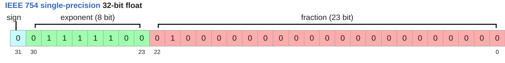
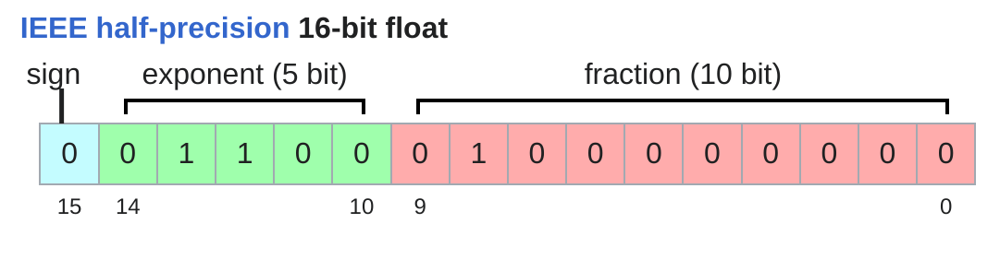
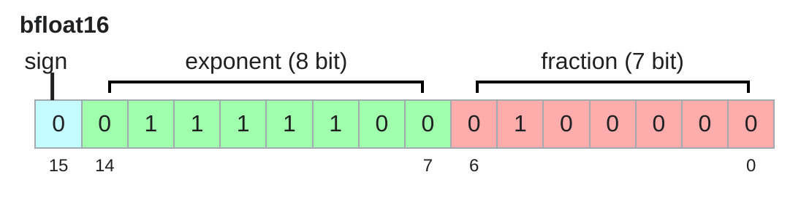

# Introduction to float32 float16 bfloat16

## 目录
- [Float32 (IEEE 754)](#float32-ieee-754)
- [Float16 (Half Precision)](#float16-half-precision)
- [Bfloat16 (Brain Floating Point)](#bfloat16-brain-floating-point)

### Float32 (IEEE 754)
这是深度学习中的基准数据类型，通常被称为单精度。
- 结构：1位符号位 + 8位指数位 + 23位尾数位。
- 内存占用：4字节(32bit)。
- 特点：拥有8位指数位，提供了约1e-38到1e38的宽动态范围。23位尾数位提供了极高的数值精度。
- 缺点：对于大模型训练而言，内存占用过大，计算速度相对较慢。

### Float16 (Half Precision)
为了减少内存占用，工业界引入了半精度格式。
- 结构：1位符号位 + 5位指数位 + 10位尾数位。
- 内存占用：2字节(16bit)。
- 特点：内存占用仅为Float32的一半。
- 致命弱点：它的指数位被砍到了只有5位。这意味着它能表示的最小正数约为6e-5。而在深度学习训练中，梯度往往非常小(如1e-7)，这会导致数值直接下溢(Underflow)变成0，使模型无法收敛。

### Bfloat16 (Brain Floating Point)
由Google Brain设计，专门用于解决Float16下溢问题的数据类型。
- 结构：1位符号位 + 8位指数位 + 7位尾数位。
- 内存占用：2字节(16bit)。
- 特点：它的核心设计理念是截断Float32的尾数，但完整保留Float32的8位指数。
- 优势：因为指数位与Float32完全一致，所以它具有和Float32一样的动态范围，彻底解决了下溢问题。虽然牺牲了尾数精度(只有7位)，但神经网络对绝对精度不敏感，而对数值范围非常敏感，因此它是目前大模型训练的首选低精度格式。
