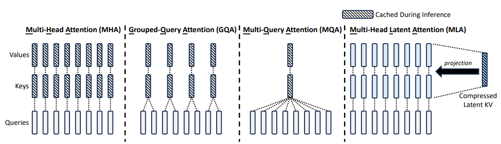
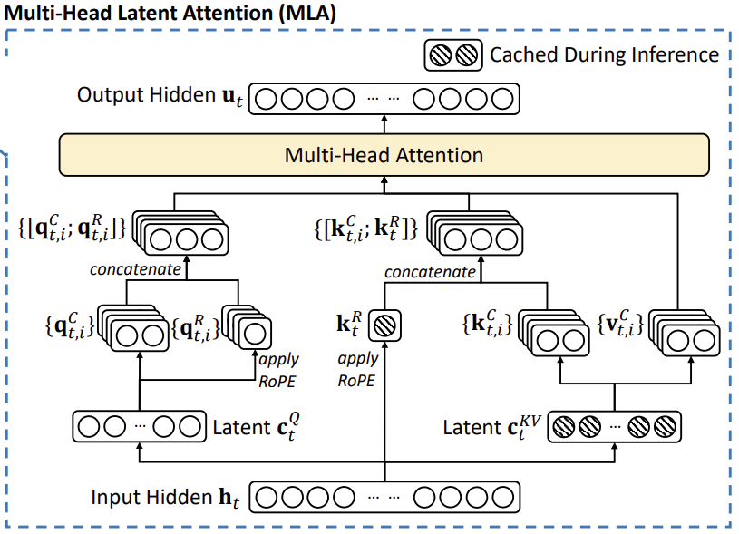

# Attention Variants

这三种机制(GQA、MQA、MLA)都是为了解决Transformer模型在推理(Inference)阶段的一个核心痛点：KV Cache(键值缓存)过大导致的显存瓶颈。它们的核心思路都是在保证模型性能(Performance)的前提下，尽可能压缩KV Cache的大小，从而提高推理速度和吞吐量。

## 目录

1. [MHA(Multi-Head Attention)](#1-mhamulti-head-attention)
2. [MQA(Multi-Query Attention)](#2-mqamulti-query-attention)
3. [GQA(Grouped Query Attention)](#3-gqagrouped-query-attention)
4. [通用MHA/GQA/MQA代码实现](#4-通用mhagqamqa代码实现)
5. [MLA(Multi-Head Latent Attention)](#5-mlamulti-head-latent-attention)



## 1. MHA(Multi-Head Attention)

MHA即标准的多头注意力机制，是Transformer模型的基石。

### 原理概述
在MHA中，每一个Query头(Head)都拥有自己独立的Key头和Value头。如果模型有N个Query头，那么它也必须有N个Key头和N个Value头。这意味着KV Cache(键值缓存)的大小与Head数量成正比。

### 显存瓶颈
由于KV Cache需要存储所有的K和V，随着上下文长度(Context Length)的增加和Batch Size的扩大，显存占用会呈线性爆炸式增长。这成为了制约大模型推理长文本的主要瓶颈，往往导致显存溢出(OOM)。

### 特点总结
* 结构：Query头数等于KV头数。
* 优点：拥有最强的模型表达能力和泛化性能，不丢失任何信息。
* 缺点：推理阶段KV Cache显存占用极大，吞吐量低，内存带宽压力大。

## 2. MQA(Multi-Query Attention)

MQA由Google提出，旨在极端地压缩显存占用。

### 原理概述
MQA采取了极致的共享策略：所有的Query头共享同一个Key头和同一个Value头。无论模型有多少个Query头，KV头始终只有1组。

### 性能权衡
这种方法将KV Cache的大小压缩了N倍(通常是8倍以上)，极大地降低了显存需求并提高了内存带宽利用率。但是，由于所有的Query只能“看到”同一组KV信息，模型的容量(Capacity)和细节捕捉能力会受到显著削弱，导致生成质量下降。

### 特点总结
* 结构：KV头数固定为1。
* 优点：推理速度极快，显存占用最小。
* 缺点：模型性能会有明显损失，通常需要更多训练数据来弥补。

## 3. GQA(Grouped Query Attention)

GQA是MHA和MQA的折中方案，目前被Llama 3、Qwen 2等主流开源模型广泛采用。

### 原理概述
GQA将Query头分成多个组(Group)。在每一个组内部，所有的Query头共享同一组Key和Value头。例如，如果有32个Query头，分成4组，那么总共只需要4个KV头。

### 均衡之道
GQA试图在速度和质量之间找到平衡点。实验表明，通过适度的分组(如8个Query共享1个KV)，GQA可以在保持接近MHA性能的同时，获得接近MQA的推理效率和显存节省。

### 特点总结
* 结构：KV头数介于1和Query头数之间。
* 优点：显存占用和推理速度适中，且性能几乎无损。
* 缺点：实现稍微复杂于MQA，需要处理分组复制逻辑。

## 4. 通用MHA/GQA/MQA代码实现

这三种其实可以写在一个统一的类里，区别仅仅是num_key_value_heads（KV 头数）的配置不同。这是目前 HuggingFace Transformers 库中的主流写法。

```python
import torch
import torch.nn as nn
import torch.nn.functional as F
import math

class StandardAttention(nn.Module):
    def __init__(self, embed_dim, n_q_heads, n_kv_heads):
        """
        统一实现 MHA, GQA, MQA
        
        参数:
        - embed_dim: 嵌入维度 (例如 4096)
        - n_q_heads: Query 的头数 (例如 32)
        - n_kv_heads: Key/Value 的头数
            - MHA: n_kv_heads == n_q_heads
            - GQA: 1 < n_kv_heads < n_q_heads (且能整除)
            - MQA: n_kv_heads == 1
        """
        super().__init__()
        self.n_q_heads = n_q_heads
        self.n_kv_heads = n_kv_heads
        self.head_dim = embed_dim // n_q_heads
        
        # GQA 核心: 计算每个 KV 头对应多少个 Q 头 (Replication Factor)
        self.n_rep = self.n_q_heads // self.n_kv_heads
        
        # 定义投影层
        self.q_proj = nn.Linear(embed_dim, embed_dim, bias=False)
        self.k_proj = nn.Linear(embed_dim, self.head_dim * self.n_kv_heads, bias=False)
        self.v_proj = nn.Linear(embed_dim, self.head_dim * self.n_kv_heads, bias=False)
        self.o_proj = nn.Linear(embed_dim, embed_dim, bias=False)

    def repeat_kv(self, x, n_rep):
        """
        这是 GQA/MQA 的核心：将 KV 头的数据复制 n_rep 份以匹配 Q 的头数
        x shape: (Batch, n_kv_heads, SeqLen, HeadDim)
        output:  (Batch, n_q_heads, SeqLen, HeadDim)
        """
        batch, n_kv_heads, seq_len, head_dim = x.shape
        if n_rep == 1:
            return x
            
        # 扩展并复制
        # (B, n_kv, 1, S, D) -> (B, n_kv, n_rep, S, D) -> (B, n_kv * n_rep, S, D)
        return x[:, :, None, :, :].expand(batch, n_kv_heads, n_rep, seq_len, head_dim).reshape(batch, n_kv_heads * n_rep, seq_len, head_dim)

    def forward(self, x):
        batch_size, seq_len, _ = x.shape
        
        # 1. 投影
        q = self.q_proj(x)
        k = self.k_proj(x)
        v = self.v_proj(x)
        
        # 2. Reshape 为多头形式
        # Q: (B, Seq, n_q_heads, D) -> (B, n_q_heads, Seq, D)
        q = q.view(batch_size, seq_len, self.n_q_heads, self.head_dim).transpose(1, 2)
        # K, V: (B, Seq, n_kv_heads, D) -> (B, n_kv_heads, Seq, D)
        k = k.view(batch_size, seq_len, self.n_kv_heads, self.head_dim).transpose(1, 2)
        v = v.view(batch_size, seq_len, self.n_kv_heads, self.head_dim).transpose(1, 2)
        
        # 3. GQA/MQA 关键步骤：复制 KV 头
        # 如果是 MHA，self.n_rep 是 1，不做改变
        # 如果是 MQA，k, v 会被复制 n_q_heads 次
        k = self.repeat_kv(k, self.n_rep)
        v = self.repeat_kv(v, self.n_rep)
        
        # 此时 Q, K, V 的维度都是 (B, n_q_heads, Seq, D)，可以做标准的 Attention 了
        
        # 4. Scaled Dot-Product Attention
        attn_output = F.scaled_dot_product_attention(q, k, v, is_causal=True)
        
        # 5. 输出投影
        attn_output = attn_output.transpose(1, 2).contiguous().view(batch_size, seq_len, -1)
        return self.o_proj(attn_output)

# --- 使用示例 ---
embed_dim = 512
n_heads = 8

# MHA: KV头数 = 8
mha = StandardAttention(embed_dim, n_q_heads=8, n_kv_heads=8) 

# GQA: KV头数 = 2 (每组4个Q共享1个KV)
gqa = StandardAttention(embed_dim, n_q_heads=8, n_kv_heads=2)

# MQA: KV头数 = 1 (所有8个Q共享1个KV)
mqa = StandardAttention(embed_dim, n_q_heads=8, n_kv_heads=1)
```

## 5. MLA(Multi-Head Latent Attention)

MLA是DeepSeek-V2/V3架构中提出的创新机制，全称为Multi-Head Latent Attention。

### 原理概述



与GQA/MQA通过减少头数来压缩不同，MLA通过低秩压缩(Low-Rank Compression)技术，在物理维度上压缩KV向量。它将KV矩阵投影到一个低维的潜在向量(Latent Vector)中进行缓存。

### 核心创新点

#### 1. 低秩键值联合压缩 (Low-Rank Key-Value Joint Compression)
MLA将巨大的KV矩阵联合压缩成一个很小的潜在向量 $C_{KV}$ 存入Cache。在注意力计算时，再通过上采样矩阵（Up-Projection）将其恢复为全维度的K和V。由于 $C_{KV}$ 的维度（`dim_kv`）远小于原本所有头的KV维度之和，这就极大地减少了显存占用。

值得注意的是，结合 MLA 的整体设计（如上图所示），系统在推理阶段真正存入 KV Cache 的数据实际上包含两部分：
1. **KV 潜在向量 ($C_{KV}$)**：正如后文代码的 `self.cache_kv`，形状仅为 `(max_batch_size, max_seq_len, dim_kv)`，作为内容信息的低维压缩表示。
2. **解耦的 RoPE Key ($k^{pe}$)**：正如代码中的 `self.cache_rk`，形状为 `(max_batch_size, max_seq_len, dim_rope)`，专门用于保留精确的位置信息。

这意味着不管你有多少个注意力头，系统每个 Token 仅需缓存这两份低维向量（总维度为 `dim_kv + dim_rope`）！相比于传统 MHA 缓存所有头的全维度 K 和 V，这极大地减少了 KV Cache 的显存占用。

在实际推理优化中，可以通过“矩阵吸收”的技巧，将恢复K和V的上采样矩阵提前吸收到Query的投影矩阵和Output投影矩阵中，从而避免在推理时真正去恢复庞大的K和V。

> **💡 拓展思考：MLA 的低秩压缩机制在思路上与 LoRA 颇为相似，在此顺便复习几个关于 LoRA 的关键问题：**
> **1、LoRA 矩阵的初始化是如何进行的？** 
> 答：LoRA 包含两个低秩矩阵 A 和 B。通常 A 矩阵采用随机高斯分布初始化，B 矩阵采用全零初始化。这样能保证训练开始时，旁路 (BA) 的输出为 0，对原模型权重没有任何影响，等同于从预训练的起点开始平滑过渡到微调阶段。
>
> **2、LoRA 矩阵中的 rank 和 alpha 分别有什么作用？** 
> 答：**rank** (秩) 决定了低秩矩阵的尺寸，从而控制了可训练参数的数量以及信息瓶颈的宽度；**alpha** (缩放因子) 则用于控制 LoRA 旁路更新的强度，权重更新时通常会乘上 $\alpha / r$ 这个系数，以此确保在调整 rank 大小时无需大幅度重新调整学习率。

#### 2. 解耦的旋转位置编码 (Decoupled Rotary Position Embedding)

**为什么会出现这个问题？**
在标准的自注意力机制中，RoPE（旋转位置编码）是直接作用在Query和Key上的。这意味着Key向量在与Query计算点积前，必须携带位置信息。
如果我们对KV进行了低秩压缩，在缓存中只有低维的 $C_{KV}$。此时：
- 如果在压缩前加RoPE，RoPE的旋转操作与线性压缩矩阵是不满足交换律的。
- 如果在恢复K后再加RoPE，那么每个Token的K都会因为其绝对位置的不同而带有不同的位置信息。由于位置信息的引入，K矩阵变得位置依赖 (Position-dependent)。这会导致我们无法使用前面提到的“矩阵吸收”技巧（即无法将恢复K的矩阵直接吸收到Query的投影中，因为中间隔了一个与位置相关的RoPE操作）。

**解决方案：**
为了解决这个矛盾，MLA设计了解耦的旋转位置编码。它将携带位置信息的Key和Query单独剥离出来：使用一个很小的、不参与压缩的维度（`dim_rope`）专门用于计算RoPE。结合下方的代码实现，我们可以清晰地看到这一过程：

- **主分支（内容信息）**：如代码所示，Query（`Q_state`）和 KV（`K_state`、`V_state`）经历低秩压缩和恢复，负责捕获内容信息。这部分完全不参与 RoPE 计算，因此完美支持后续的矩阵吸收优化。
- **RoPE分支（位置信息）**：如代码所示，模型单独生成了低维的 `Q_rotate` 和 `K_rotate`，并在调用 `apply_rotary_emb` 应用 RoPE 后，专门负责提供位置信息。

最终在计算注意力分数前，两者会通过拼接操作结合（正如代码中的 `torch.cat([Q_state, Q_rotate], dim=-1)` 等步骤）。这样做既保住了精确的位置编码，又成功保留了低秩压缩带来的矩阵吸收优化潜力。

### 优势
MLA 实现了“既要又要”的目标，主要体现在以下两个方面：

1. **显著降低 KV 缓存 (KV Cache)**
   - **低秩键值联合压缩**：MLA 将传统的键 (Key) 和值 (Value) 向量压缩到一个共享的低秩潜在向量空间中，这意味着在推理过程中，需要存储的 KV 缓存大小大幅减小。
   - **极致的显存优化**：根据 DeepSeek-V2 的论文，MLA 能够将 KV 缓存减少高达 **93.3%**。这对于处理长序列或大批量 (batch size) 推理至关重要，因为 KV Cache 通常是 LLM 推理中最主要的显存消耗瓶颈。

2. **保持甚至提升模型性能**
   - **解耦旋转位置编码 (Decoupled RoPE)**：这是 MLA 的关键组成部分。它将位置信息从 K 和 V 的压缩中分离出来，确保了在经过低秩压缩后，依然能对长程依赖和位置信息进行准确建模。
   - **潜在的正则化和更优表征**：低秩压缩本身可能起到了正则化的作用，迫使模型学习更鲁棒和关键的核心特征。同时，用于压缩和解压缩的额外学习参数在训练中被不断优化，可能捕获了更高效的语义表示，从而有助于提升模型性能（这一点在 MoE 混合专家架构中表现尤为突出）。

### 特点总结
* **结构**：引入低秩键值联合压缩技术大幅降低显存占用，同时设计解耦的旋转位置编码单独处理位置信息。
* **优点**：极致缩减了 KV 缓存（高达 93.3%），拥有 MQA 级别的显存占用；潜在的正则化作用和更优表征甚至能提升模型性能，尤其在 MoE 架构中。
* **缺点**：架构设计相对复杂，在实际部署时可能需要定制专门的底层算子或矩阵吸收优化以发挥最大效能。

### 代码实现

下面是参考DeepSeek-V2的MLA核心机制的完整实现。

```python
import torch
import torch.nn as nn
import torch.nn.functional as F
from typing import Tuple
import math

def precompute_freqs_cis(dim_model: int, end: int = 2048, theta: float = 10000.0):
    # Llama: concat cos/sin to match [x_left, x_right] pairing
    freqs = 1.0 / (theta ** (torch.arange(0, dim_model, 2)[: (dim_model // 2)].float() / dim_model))
    t = torch.arange(end, device=freqs.device)
    freqs = torch.outer(t, freqs).float()

    # 生成 [cos0, cos1, ..., cos0, cos1, ...] 的形式 (前半部分和后半部分重复)
    freqs_cos = torch.cat([torch.cos(freqs), torch.cos(freqs)], dim=-1)
    freqs_sin = torch.cat([torch.sin(freqs), torch.sin(freqs)], dim=-1)
    return freqs_cos, freqs_sin

def apply_rotary_emb(
    xq: torch.Tensor,
    xk: torch.Tensor,
    freqs_cos: torch.Tensor,
    freqs_sin: torch.Tensor,
    unsqueeze_dim: int = 2,
) -> Tuple[torch.Tensor, torch.Tensor]:
    """
    Llama 风格 RoPE，输入 shape: [batch, seq, n_heads, dim_rope]
    unsqueeze_dim=2 对应 n_heads 维度（在 transpose 之前调用）
    """
    def rotate_half(x):
        x1, x2 = x[..., :x.shape[-1] // 2], x[..., x.shape[-1] // 2:]
        return torch.cat((-x2, x1), dim=-1)

    q_len = xq.shape[1]
    k_len = xk.shape[1]

    # freqs_cos/sin shape: [seq, dim_rope]
    # xq/xk shape: [batch, seq, n_heads, dim_rope]
    # 在 batch(0) 和 n_heads(unsqueeze_dim) 两个维度插入 1 以支持广播
    q_cos = freqs_cos[:q_len].unsqueeze(0).unsqueeze(unsqueeze_dim)  # [1, q_len, 1, dim_rope]
    q_sin = freqs_sin[:q_len].unsqueeze(0).unsqueeze(unsqueeze_dim)
    k_cos = freqs_cos[:k_len].unsqueeze(0).unsqueeze(unsqueeze_dim)  # [1, k_len, 1, dim_rope]
    k_sin = freqs_sin[:k_len].unsqueeze(0).unsqueeze(unsqueeze_dim)

    xq_out = (xq * q_cos) + (rotate_half(xq) * q_sin)
    xk_out = (xk * k_cos) + (rotate_half(xk) * k_sin)
    return xq_out.type_as(xq), xk_out.type_as(xk)

class MultiHeadLatentAttention(nn.Module):
    """
        Multi-Head Latent Attention(MLA) Module As in DeepSeek_V2 paper
        Key innovation from standard MHA:
             1. Low-Rank Key-Value Joint Compression 
             2. Decoupled Rotary Position Embedding
    """
    def __init__(
        self, 
        dim_model,             # Infer dim_head from dim_model
        num_head, 
        dim_kv, 
        dim_query, 
        dim_rope, 
        dropout=0.1, 
        bias=True,
        max_batch_size=32,   # For KV cache sizing
        max_seq_len=2048     # For KV cache sizing 
        ):
        super().__init__()
        
        self.dim_model = dim_model
        self.num_head = num_head
        self.dim_head=dim_model//num_head
        self.dim_kv = dim_kv
        self.dim_query = dim_query
        self.dim_rope = dim_rope

        # 【核心创新1：低秩键值联合压缩】 
        # 将巨大的KV矩阵压缩成很小的潜在向量存入Cache
        self.DKV_proj = nn.Linear(dim_model, dim_kv, bias=bias)
        self.DQ_proj = nn.Linear(dim_model, dim_query, bias=bias)
        
        # 从低维潜在向量恢复出完整的K和V（实际推理中这些矩阵会被吸收到其他权重中）
        self.UQ_proj = nn.Linear(dim_query, dim_model, bias=bias)
        self.UK_proj = nn.Linear(dim_kv, dim_model, bias=bias)
        self.UV_proj = nn.Linear(dim_kv, dim_model, bias=bias)

        # 【核心创新2：解耦的旋转位置编码】
        # 单独的低维投影用于计算带有RoPE的位置信息
        self.RQ_proj = nn.Linear(dim_query, num_head*dim_rope, bias=bias)
        self.RK_proj = nn.Linear(dim_model, dim_rope, bias=bias)
        
        self.output_proj = nn.Linear(dim_model, dim_model, bias=bias)
        self.dropout = nn.Dropout(p=dropout)
        self.scaler = float(1.0 / math.sqrt(self.dim_head + dim_rope))

        # ⚠️ 注意这里：缓存的是压缩态！
        # self.cache_kv 的形状只有 (max_batch_size, max_seq_len, dim_kv)
        # 不管有多少个注意力头，系统只缓存这一份低维的 C_KV！
        self.cache_kv = torch.zeros((max_batch_size, max_seq_len, dim_kv))
        # 缓存一份用于 RoPE 的解耦 key，形状也很小
        self.cache_rk = torch.zeros((max_batch_size, max_seq_len, dim_rope))

        self.freqs_cos, self.freqs_sin = precompute_freqs_cis(dim_rope, max_seq_len * 2)

    def forward(
        self, 
        sequence, 
        key_value_states = None, 
        att_mask=None,
        use_cache=False,
        start_pos: int = 0
    ):
        batch_size, seq_len, model_dim = sequence.size()
        
        # 准备 RoPE
        self.freqs_cos = self.freqs_cos.to(sequence.device)
        self.freqs_sin = self.freqs_sin.to(sequence.device)
        freqs_cos = self.freqs_cos[start_pos:]
        freqs_sin = self.freqs_sin[start_pos:]

        is_cross_attention = key_value_states is not None
        kv_seq_len = key_value_states.size(1) if is_cross_attention else seq_len
        
        # 1. Query 的降维压缩和恢复，以及 RoPE 分支
        C_Q = self.DQ_proj(sequence)     #[batch_size, seq_len, dim_query]
        Q_state = self.UQ_proj(C_Q)      #[batch_size, seq_len, dim_model]
        Q_rotate = self.RQ_proj(C_Q)      #[batch_size, seq_len, num_head*dim_rope]

        if use_cache:
            # 推理阶段：核心在于我们只需要缓存和更新低维的 C_KV 和 K_rotate
            self.cache_kv = self.cache_kv.to(sequence.device)
            current_kv = self.DKV_proj(key_value_states if is_cross_attention else sequence)
            self.cache_kv[:batch_size, start_pos:start_pos + kv_seq_len] = current_kv
            C_KV = self.cache_kv[:batch_size, :start_pos + kv_seq_len]

            self.cache_rk = self.cache_rk.to(sequence.device)
            current_K_rotate = self.RK_proj(key_value_states if is_cross_attention else sequence)
            self.cache_rk[:batch_size, start_pos:start_pos + kv_seq_len] = current_K_rotate
            K_rotate = self.cache_rk[:batch_size, :start_pos + kv_seq_len]
            
            if att_mask is not None:
                cached_len = start_pos + kv_seq_len        
                extended_mask = torch.zeros((batch_size, 1, seq_len, cached_len), device=att_mask.device, dtype=att_mask.dtype)
                for i in range(seq_len):
                    extended_mask[:, :, i, :(start_pos + i + 1)] = 0
                    extended_mask[:, :, i, (start_pos + i + 1):] = float('-inf')
                att_mask = extended_mask
        else:
            # 训练或没有 cache 阶段
            C_KV = self.DKV_proj(key_value_states if is_cross_attention else sequence)
            K_rotate = self.RK_proj(key_value_states if is_cross_attention else sequence)
            
        # 2. 从压缩后的 C_KV 恢复全量 K 和 V（仅做前向演示，实际推理可以用吸收优化）
        K_state = self.UK_proj(C_KV)               #[batch_size, actual_kv_len, dim_model]
        V_state = self.UV_proj(C_KV)               #[batch_size, actual_kv_len, dim_model]

        Q_state = Q_state.view(batch_size, seq_len, self.num_head, self.dim_head)

        actual_kv_len = K_state.size(1) 
        K_state = K_state.view(batch_size, actual_kv_len, self.num_head, self.dim_head) 
        V_state = V_state.view(batch_size, actual_kv_len, self.num_head, self.dim_head)

        # 3. 对 Query 和 解耦的 Key 应用 RoPE
        Q_rotate = Q_rotate.view(batch_size, seq_len, self.num_head, self.dim_rope)
        K_rotate = K_rotate.unsqueeze(2).expand(-1, -1, self.num_head, -1)
        Q_rotate, K_rotate = apply_rotary_emb(Q_rotate, K_rotate, freqs_cos=freqs_cos, freqs_sin=freqs_sin)

        # 4. 拼接内容分支和位置分支
        Q_state = torch.cat([Q_state, Q_rotate], dim=-1)  # [batch_size, seq_len, num_head, dim_head + dim_rope]
        K_state = torch.cat([K_state, K_rotate], dim=-1)  # [batch_size, actual_kv_len, num_head, dim_head + dim_rope]

        Q_state = Q_state * self.scaler
        Q_state = Q_state.transpose(1, 2)
        K_state = K_state.transpose(1, 2)
        V_state = V_state.transpose(1, 2)

        # 5. 计算 Attention 
        self.att_matrix = torch.matmul(Q_state, K_state.transpose(-1,-2)) 
    
        if att_mask is not None:
            self.att_matrix = self.att_matrix + att_mask
        
        att_score = F.softmax(self.att_matrix, dim = -1)
        att_score = self.dropout(att_score)
    
        att_output = torch.matmul(att_score, V_state)
        
        att_output = att_output.transpose(1, 2).contiguous().view(batch_size, seq_len, self.num_head*self.dim_head) 
        att_output = self.output_proj(att_output)

        return att_output
```
