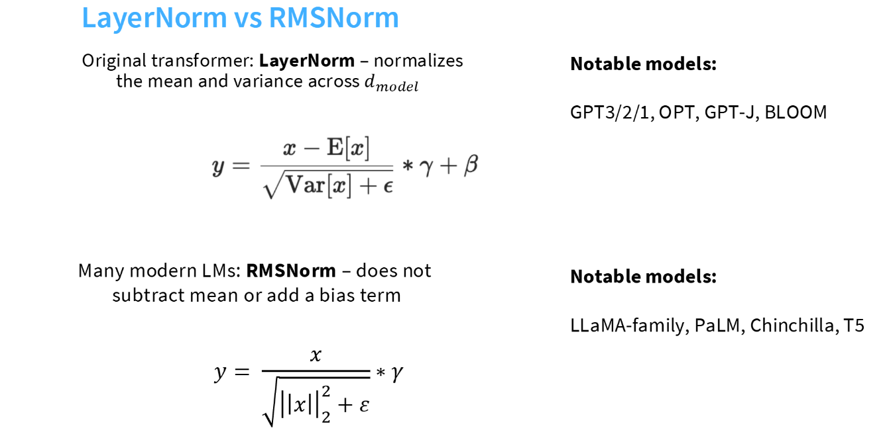

# LayerNorm vs RMSNorm in Large Language Models

## 目录
- [BatchNorm与LayerNorm的回顾](#)
- [从LayerNorm到RMSNorm](#从layernorm到rmsnorm)
- [核心区别：减法vs除法](#核心区别)
- [为什么现代大模型（Llama等）倾向于RMSNorm？](#为什么现代大模型llama等倾向于rmsnorm)
- [代码实现](#代码实现)

---

## BatchNorm与LayerNorm的回顾

### 核心区别：切得方向不同

如果不看公式，最直观的区别就在于归一化时“切数据”的方向。

假设我们有一批自然语言处理的数据，Tensor 形状为 $[N, L, C]$：

- $N$: Batch Size (例如 32 句话)
- $L$: Sequence Length (每句话的长度)
- $C$: Hidden Dimension (词向量维度，例如 512)

#### 1. Batch Normalization (BN) —— “纵向切”

- 逻辑：它是跨样本的。它固定住特征维度 $C$，计算整个 Batch ($N$ 个样本) 在该维度上的均值和方差。
- 计算依赖：强依赖于其他样本。如果其他样本变了，你的归一化结果也会变。

#### 2. Layer Normalization (LN) —— “横向切”

- 逻辑：它是样本内的。它固定住样本 $N$ (甚至固定住时间步 $L$)，计算该样本所有特征维度 $C$ 的均值和方差。
- 计算依赖：独立于其他样本。不管班里其他人考多少分，都不影响你的归一化结果。

> 💡 **思考：BatchNorm 在训练和推理时的计算逻辑是一样的吗？**
> 
> 不一样。在训练阶段，BatchNorm 依赖当前 Batch 内的实时数据计算均值和方差，并同步更新全局的滑动平均值；而在推理（预测）阶段，由于往往没有完整的 Batch 供计算，它必须直接使用训练时累积好的全局滑动平均值（Running Mean/Var）。这种训练与推理间的不一致性增加了模型部署和工程实现的复杂度，而 LayerNorm 无论在训练还是推理阶段，其计算逻辑都是完全一致的（仅依赖当前样本自身的特征）。

---

### 为什么 Transformer (NLP) 更爱选择 LayerNorm？

这不仅仅因为“效果好”，而是因为 BN 在 Transformer 的场景下存在着三个致命的机制缺陷，其中你提到的 Padding 问题最为关键。

#### 1. 变长序列与 Padding 造成的“统计量污染” (最致命)

这是 NLP 区别于 CV (计算机视觉) 最大的特点。

- BN 的崩溃点：
  - 为了凑成一个 Batch，短句子后面必须补大量的 0 (Padding)。
  - BN 是跨样本计算均值和方差的。当计算某一维度的均值时，大量的 Padding 0 会混入计算。
- 后果：
  - 真实的均值被拉低 (趋向于 0)，真实的方差被弄小 (因为 0 非常集中)。用这种被污染的统计量去归一化真实的词向量，会导致数据分布扭曲，模型根本学不到正确的东西。
- LN 的免疫力：
  - LN 是在单个词向量 (或单句) 内部做计算。
  - 针对真实词：就算旁边有一堆 Padding，LN 也是只算自己内部的 $C$ 个维度的均值方差，完全不受干扰。
  - 针对 Padding：就算对 Padding 做了归一化，后续的 Attention Mask 也会把它盖住，不会产生负面影响。

#### 2. Batch Size 的显存瓶颈

- BN 的软肋：
  - BN 假设 Batch 里的样本能代表全局分布。这需要较大的 Batch Size (通常 > 32)。如果 Batch Size 太小 (比如 2 或 4)，算出来的均值方差噪声极大，训练会震荡甚至发散。
- Transformer 的现状：
  - BERT、GPT 等大模型参数量巨大，显存极其紧张。训练时往往只能开很小的 Batch Size (Micro-batch size 甚至只有 1)。
- LN 的优势：
  - LN 对 Batch Size 不敏感。哪怕 Batch Size = 1，LN 也能照样精确计算，因为它只需要当前这个样本的信息。

#### 3. 训练与推理阶段的一致性优势

* Batch Normalization (BN) 的计算差异：
  BN 存在训练与推理行为不一致的问题。在训练阶段，BN 依赖当前 Mini-batch 的均值和方差；而在推理阶段，由于输入往往是单条数据（Batch Size = 1），BN 必须切换为使用训练阶段累积的“全局滑动平均统计量”。这种状态的切换增加了计算图的复杂度，且在部署环节容易引入潜在的对齐错误。

* Layer Normalization (LN) 的机制统一：
  LN 实现了训练与推理环节的计算统一。由于 LN 是在单一特征维度上进行归一化，其计算完全不依赖 Batch 维度。因此，模型在训练和预测时采用完全相同的数学逻辑和前向传播过程，无需额外维护全局状态变量，大幅提升了工程实现的稳健性与友好度。

---

## 从LayerNorm到RMSNorm

在确定了使用Pre-Norm（前置归一化）结构来保证训练稳定性之后，下一个问题是：具体使用哪种归一化算法？

* LayerNorm (LN)：经典的Transformer组件，由Hinton等人在2016年提出。它是BERT、GPT-2和早期GPT-3的标准配置。
* RMSNorm (Root Mean Square Norm)：LayerNorm的简化变体，由Zhang & Sennrich在2019年提出。目前已被Llama 2/3, PaLM, Gopher, Chinchilla等主流大模型广泛采用。



---

## 核心区别：

两者最本质的区别在于：RMSNorm认为"减去均值"是不必要的，只需要"缩放"即可。

### 1. LayerNorm（标准版）

LayerNorm包含两个步骤：Re-centering（去均值）和Re-scaling（缩放）。它强制将输入分布转换为均值为0、方差为1的形态。

$$
y = \frac{x - \mu}{\sqrt{\sigma^2 + \epsilon}} \cdot \gamma + \beta
$$

其中：
* 我们要计算均值 $\mu$ 和方差 $\sigma^2$ 。
* $\gamma$ (scale)和 $\beta$ (bias)是可学习参数。

### 2. RMSNorm（简化版）

RMSNorm去掉了减去均值（ $\mu$ ）的操作，也不计算标准差，而是计算均方根（Root Mean Square）来进行缩放。

$$
y = \frac{x}{\text{RMS}(x)} \cdot \gamma
$$

$$
\text{RMS}(x) = \sqrt{\frac{1}{n} \sum_{i=1}^{n} x_i^2 + \epsilon}
$$

关键点：RMSNorm通常不使用Bias（偏置项 $\beta$ ），只保留Scale（缩放项 $\gamma$ ）。

---

## 为什么现代大模型（Llama等）倾向于RMSNorm？

Llama选择RMSNorm的核心逻辑是：RMSNorm可以达到和LayerNorm相似的效果，但计算更高效、更简单。

### 1. 计算效率更高（Speed）
这是最直接的优势。
* LayerNorm需要计算均值和方差，涉及两次全向量的遍历和减法操作。
* RMSNorm省去了计算均值和减去均值的步骤。
* 收益：尽管在单层上的提升看起来微乎其微（约10%-40%的算子加速），但在千亿参数模型、万亿Token训练的规模下，这种细微的节省能累积出显著的训练加速。

### 2. "平移"并不重要（Theory）
研究表明，LayerNorm之所以有效，主要是因为它的缩放（Scaling）效应，即通过归一化方差来稳定梯度的幅度。而平移（Centering/Shifting）属性对于深层神经网络的收敛贡献甚微。既然减均值没用，不如直接去掉。

### 3. 简化显存开销（Memory）
由于公式更简单，反向传播时不需要存储均值相关的中间变量，稍微降低了显存占用。

### 总结
| 特性 | LayerNorm (Classic) | RMSNorm (Modern) |
| :--- | :--- | :--- |
| 操作 | 减均值+除标准差 | 仅除以均方根 |
| 参数 | Scale ($\gamma$) + Bias ($\beta$) | 仅Scale ($\gamma$) |
| 计算量 | 较高 | 较低（更少操作） |
| 代表模型 | BERT, GPT-2, Original Transformer | Llama 2/3, PaLM, Qwen |

---

## 代码实现

以下是基于 PyTorch 的手动实现对比（BatchNorm → LayerNorm → RMSNorm）。

### 1. Batch Normalization 实现

`torch.nn.BatchNorm1d(C)` 的标准输入是 `[N, C, L]`；若数据写成 `[N, L, C]`（与上文约定一致），则对每个通道在 **N 与 L** 两个维度上聚合统计量，效果等价于先 `x.permute(0, 2, 1)` 再交给 `BatchNorm1d`。下面直接按 `[N, L, C]` 手写一版，便于和 LayerNorm（只在最后一维上算）对照。

```python
import torch
import torch.nn as nn


class BatchNorm1dForNLC(nn.Module):
    """对 [N, L, C]：每个通道跨 batch 与序列维做 BN；推理阶段使用 running 统计量。"""

    def __init__(self, num_features, eps=1e-5, momentum=0.1):
        super().__init__()
        self.eps = eps
        self.momentum = momentum
        self.gamma = nn.Parameter(torch.ones(num_features))
        self.beta = nn.Parameter(torch.zeros(num_features))
        self.register_buffer("running_mean", torch.zeros(num_features))
        self.register_buffer("running_var", torch.ones(num_features))

    def forward(self, x):
        # x: [N, L, C]
        if self.training:
            mean = x.mean(dim=(0, 1))
            var = x.var(dim=(0, 1), unbiased=False)
            with torch.no_grad():
                self.running_mean.mul_(1 - self.momentum).add_(mean, alpha=self.momentum)
                self.running_var.mul_(1 - self.momentum).add_(var, alpha=self.momentum)
        else:
            mean = self.running_mean
            var = self.running_var

        mean = mean.view(1, 1, -1)
        var = var.view(1, 1, -1)
        x_norm = (x - mean) / torch.sqrt(var + self.eps)
        return self.gamma * x_norm + self.beta
```

> 工程上优先使用 `nn.BatchNorm1d`；若输入为 `[N, L, C]`，可写 `nn.BatchNorm1d(C)` 并在 `forward` 里对 `x` 做 `permute(0, 2, 1)`，与上述逻辑一致。

### 2. Layer Normalization实现
虽然`torch.nn.LayerNorm`是内置的，但为了理解原理，我们手动写一个：

```python
import torch
import torch.nn as nn

class LayerNorm(nn.Module):
    def __init__(self, d_model, eps=1e-5):
        super().__init__()
        self.eps = eps
        # 可学习参数：gamma（缩放）和beta（偏移）
        self.gamma = nn.Parameter(torch.ones(d_model))
        self.beta = nn.Parameter(torch.zeros(d_model))

    def forward(self, x):
        # 1. 计算均值
        mean = x.mean(dim=-1, keepdim=True)
        # 2. 计算方差（未校正方差）
        var = x.var(dim=-1, keepdim=True, unbiased=False)
        
        # 3. 归一化：减均值，除以标准差
        x_norm = (x - mean) / torch.sqrt(var + self.eps)
        
        # 4. 仿射变换（Scale & Shift）
        return self.gamma * x_norm + self.beta
```

### 3. RMS Normalization实现

```python

import torch
import torch.nn as nn

class RMSNorm(nn.Module):
    def __init__(self, d_model, eps=1e-6):
        super().__init__()
        self.eps = eps
        # RMSNorm通常只有gamma（weight），没有beta（bias）
        self.weight = nn.Parameter(torch.ones(d_model))

    def _norm(self, x):
        # 1. 计算均方根（RMS）的倒数
        # rsqrt = reciprocal square root (1 / sqrt(x))
        # mean(x^2)
        return x * torch.rsqrt(x.pow(2).mean(-1, keepdim=True) + self.eps)

    def forward(self, x):
        # 2. 归一化并乘以缩放参数
        # 注意：这里直接将x转化为float32进行计算以保证精度（Llama源码细节）
        output = self._norm(x.float()).type_as(x)
        return output * self.weight
```
