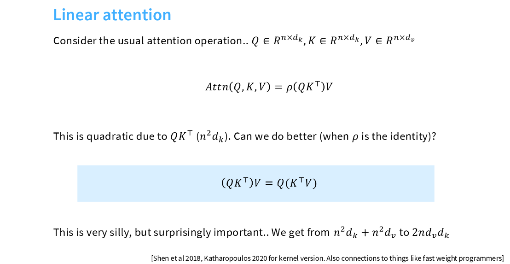

# Linear Attention

## 目录

- [1. 在 Transformer 中，计算量最多的是 Attention 还是 MLP？](#1-在-transformer-中计算量最多的是-attention-还是-mlp)
- [2. 线性注意力机制 (Linear Attention)](#2-线性注意力机制-linear-attention)

---

## 1. 在 Transformer 中，计算量最多的是 Attention 还是 MLP？

针对这个问题的简单直接结论是：在绝大多数目前的实际应用场景（如 GPT-4, Llama 3 等大语言模型）中，MLP 的计算量通常比 Attention 更大。不过，这个结论有一个重要的前提：序列长度 $n$ 不能极端大。

### 1.1 功能的对比

| 组件 | 主要任务 | 核心作用 |
| :--- | :--- | :--- |
| Attention (MHA) | 捕捉序列间的关联信息 | 负责让不同位置的 Token 进行“对话”，通过加权求和的方式实现信息交换，处理空间 (Token) 上的交互。 |
| MLP (Feed-Forward) | 知识存储与特征转换 | 负责对每个 Token 的表示进行非线性变换，处理通道 (维度) 上的加工。研究表明，MLP 层实际上存储了模型大部分的隐式知识。 |

### 1.2 参数与计算量的对比

在 Transformer Block 的参数量和计算量分配上，两者展现出显著的差异（参考最后一张图片的分析）：

*   参数量对比：
    *   MLP 占大头： 通常约占整个模型参数量的 $2/3$。分析：MLP 包含两个大矩阵（d -> 4d$ 和 4d -> d），总参数量为 $8d^2$。
    *   Attention 占小头： 通常约占整个模型参数量的 $1/3$。分析：Attention 包含 $W_Q, W_K, W_V, W_O$ 四个矩阵（均为 $d \times d$），总参数量为 $4d^2$。
*   计算量 (FLOPs) 定量分析： 假设隐藏层维度为 $d$，序列长度为 $n$，MLP 的中间层维度通常为 $4d$。
    *   MLP 计算量： 约 $16nd^2$。它随序列长度 $n$ 线性增长。
    *   Attention 计算量： 约 $8nd^2 + 4n^2d$。其中 $4n^2d$ 部分随序列长度 $n$ 平方增长。

### 1.3 详细定量分析（参考 FLOPs 推导）

为了更深入理解上述结论，我们可以根据矩阵运算的本质进行分解：

#### MLP 部分
MLP 通常由两个线性层组成：
1.  第一层： 从 $d$ 映射到 $4d$，权重矩阵大小为 $[d, 4d]$。计算量约为 $2 \cdot n \cdot d \cdot 4d = 8nd^2$。
2.  第二层： 从 $4d$ 映射回 $d$，权重矩阵大小为 $[4d, d]$。计算量约为 $2 \cdot n \cdot 4d \cdot d = 8nd^2$。
*   MLP 总计算量约为： $16nd^2$。

#### Attention 部分
Attention 的计算分为线性投影和注意力得分计算两部分：
1.  线性投影： 包含 $Q, K, V$ 以及输出投影 $O$。这四个矩阵大小都是 $[d, d]$。计算量约为 $4 \cdot (2 \cdot n \cdot d^2) = 8nd^2$。
2.  注意力得分计算：
    *   $QK^T$：矩阵大小为 $[n, n]$，深度为 $d$。计算量为 $2n^2d$。
    *   $AV$ (权重矩阵乘以 $V$)：计算量同样为 $2n^2d$。
*   Attention 总计算量约为： $8nd^2 + 4n^2d$。

### 1.4 核心结论

1.  当 $n$ 较小 ($n < 2d$) 时：在大模型中（如 $d = 8192$），只要序列长度没有达到上万级别，MLP 的计算量依然占据统治地位，约为 Attention 的两倍。
2.  当 $n$ 极大（长文本场景）时：(4n^2)d 这一项会迅速膨胀，Attention 的平方复杂度就会成为整个模型的瓶颈。

---

## 2. 线性注意力机制 (Linear Attention)

为了解决标准 Attention 随序列长度 $n$ 平方增长的瓶颈，Linear Attention (线性注意力) 应运而生。**它的核心思想是利用矩阵乘法的结合律。**

### 2.1 标准 Attention 的瓶颈

在标准的 Attention 中，公式为：

$$
\text{Attn}(Q, K, V) = \text{Softmax}(QK^T)V
$$

1. 计算顺序：先计算 $Q \cdot K^T$。
2. 矩阵维度：Q 是 $(n \times d)$，K^T 是 $(d \times n)$。
3. 代价：相乘后得到一个 $(n \times n)$ 的巨型矩阵 (注意力得分矩阵)，计算和存储需要 $O(n^2d)$ 的复杂度。当 $n$ 很大时，计算量会按平方级爆炸。

### 2.2 矩阵相乘的“神奇”变换

如果我们假设激活函数 $\rho$ (如 Softmax) 是单位矩阵 (Identity)，公式变为：

$$
\text{Attn} = (QK^T)V
$$

根据矩阵乘法的结合律 $(AB)C = A(BC)$，我们可以改变计算顺序：

$$
(QK^T)V = Q(K^TV)
$$

### 2.3 为什么计算量变小了？

对比两种方案（假设 $d_k = d_v = d$）：

*   方案 A (标准方式): $(QK^T)V$
    1.  $Q(n, d) \times K^T(d, n) \to (n, n)$ 矩阵。计算量约为 $n^2d$。
    2.  $(n, n) \times V(n, d) \to (n, d)$ 矩阵。计算量约为 $n^2d$。
    *   总计： $O(n^2d)$（平方级增长）

*   方案 B (线性方式): $Q(K^TV)$
    1.  $K^T(d, n) \times V(n, d) \to (d, d)$ 矩阵。计算量约为 $nd^2$。
    2.  $Q(n, d) \times (d, d) \to (n, d)$ 矩阵。计算量约为 $nd^2$。
    *   总计： $O(nd^2)$（线性级增长）

结论：只要序列长度 $n$ 远大于维度 $d$，方案 B 就会比方案 A 快得多。

### 2.4 为什么说这“看起来愚蠢但极其重要”？

1. 处理“无限长”文本：由于计算量随 $n$ 线性增长，处理超长上下文变得可行。
2. 揭示 Transformer 与 RNN 的关系：在方案 B 中，K^TV 算出的 $(d, d)$ 矩阵可以看作是一个累积的“状态” (Hidden State)。每增加一个 Token，只需要更新这个状态即可，不需要重新计算整个历史。

### 2.5 现实中的难点：Softmax 怎么办？

图中提到一个前提：`when ρ is the identity`。但在真正的 Transformer 中，Softmax 是必不可少的，因为它引入了非线性并起到归一化作用。

如果直接去掉 Softmax，模型效果会变差。因此，目前学界 (如 Linear Transformer, Performer, FlashLinear 等) 的研究重点是：寻找一个核函数 (Kernel Function) $\phi(\cdot)$，使得：

$$
\text{Softmax}(QK^T) \approx \phi(Q)\phi(K)^T
$$

这样既保留了类似 Softmax 的特性，又能利用结合律把复杂度降下来。

总结：
这张图告诉我们，只要改变矩阵相乘的顺序，就能把 Transformer 从“吃内存的怪物”变成“随长度线性增长的轻量模型”。这是目前大模型走向超长上下文（如 100 万 Token）的核心理论基础之一。
