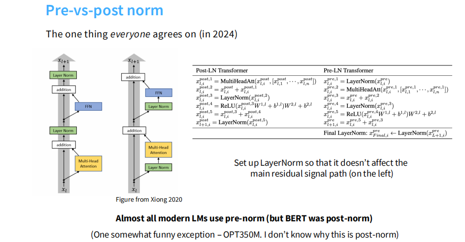

# Pre-Norm vs Post-Norm in Transformer

## 目录
- [什么是Layer Normalization？](#什么是layer-normalization)
- [Pre-Norm vs Post-Norm的区别](#pre-norm-vs-post-norm的区别)
- [为什么现代LLM都选择Pre-Norm？](#为什么现代llm都选择pre-norm)
- [代码实现](#代码实现)

---

## 什么是Layer Normalization？

Layer Normalization (LayerNorm)是Transformer架构中的关键组件，用于稳定训练过程并加速收敛。它对每个样本的特征维度进行归一化：

$$
\text{LayerNorm}(x) = \gamma \cdot \frac{x - \mu}{\sqrt{\sigma^2 + \epsilon}} + \beta
$$

其中：
- $\mu$ 是该层输入的均值
- $\sigma^2$ 是该层输入的方差
- $\gamma$ 和 $\beta$ 是可学习的缩放和偏移参数
- $\epsilon$ 是防止除零的小常数

### LayerNorm的作用

1. 归一化激活值分布：防止梯度爆炸/消失
2. 加速训练收敛：使优化路径更平滑
3. 提高模型稳定性：减少对初始化和学习率的敏感度

---

## Pre-Norm vs Post-Norm的区别

### 架构对比图



从图中可以看到两种架构的核心区别：

### Post-Norm（后归一化）

Post-Norm是原始Transformer论文（Vaswani et al. 2017）中使用的方式，LayerNorm应用在残差连接之后：

$$
\begin{align}
x_1 &= \text{LayerNorm}(x + \text{MultiHeadAttention}(x)) \\
x_2 &= \text{LayerNorm}(x_1 + \text{FFN}(x_1))
\end{align}
$$

代表模型：BERT（唯一的主流例外）

---

### Pre-Norm（前归一化）

Pre-Norm在残差连接之前先对输入进行LayerNorm，这是几乎所有现代LLM的标准选择：

$$
\begin{align}
x_1 &= x + \text{MultiHeadAttention}(\text{LayerNorm}(x)) \\
x_2 &= x_1 + \text{FFN}(\text{LayerNorm}(x_1))
\end{align}
$$

关键：Pre-Norm需要在最后加Final LayerNorm：

$$
\text{output} = \text{LayerNorm}(x_{\text{final}})
$$

代表模型：GPT-2/3/4, LLaMA, Qwen, Mistral, 几乎所有现代LLM

## 为什么现代LLM都选择Pre-Norm？

### 1. Post-LN的"致命伤"：梯度消失与热身依赖

在早期的BERT模型中，Post-LN效果通常比Pre-LN略好，但它有一个严重问题：越深越难练。

- 梯度消失/爆炸：在Post-LN中，因为归一化放在了残差相加之后，反向传播时，梯度需要经过LayerNorm的缩放。数学推导表明，随着层数加深，靠近输入层（底层）的梯度范数（Gradient Norm）会变得非常小（甚至趋近于零），而靠近输出层（顶层）的梯度则很大。

- 必须依赖Warm-up：由于初始化阶段梯度极不稳定，Post-LN模型必须使用很长的Learning Rate Warm-up（学习率热身）阶段，在训练初期把学习率压得很低，否则模型很容易在训练刚开始就发散（Loss飞掉）。对于几十亿甚至千亿参数的大模型来说，这种不稳定性是不可接受的，因为它极大地增加了"炼丹"失败的风险和调试成本。

---

### 2. Pre-LN的优势：梯度流动的通畅性

Pre-LN最大的优势在于梯度流动的通畅性。

- 直通的梯度流（Identity Path）：在Pre-LN结构中，残差连接 $x_{t+1} = x_t + \dots$ 构成了一条不受阻碍的"高速公路"。在反向传播时，梯度可以直接沿着这条路从最后一层无损地传到第一层。

- 对初始化不敏感：无论模型有多深，Pre-LN都能保证梯度的范数大致保持一致。这意味着你不需要精心调节Warm-up（甚至可以取消Warm-up），也不需要担心模型一跑就崩。这对于训练GPT-3这种规模的模型至关重要。

---

### 3. 权衡：性能vs.稳定性

既然Pre-LN这么稳，为什么最初Transformer论文没用它？因为"稳"是有代价的。

- Post-LN的上限更高：很多研究表明，在同等参数量下，如果Post-LN能训练成功，它的最终效果（Loss/精度）往往比Pre-LN略好。

- Pre-LN的"虚高"问题：Pre-LN存在一个副作用，即随着层数加深，模型倾向于直接通过残差连接传递信息，而忽略子层（Attention/FFN）的变换。这导致深层网络的"有效深度"可能变浅了（即后面的层在"划水"）。

---

### 4. 为什么现在选择了Pre-LN？

在大模型时代，"能练出来"比"微小的性能提升"更重要。虽然Pre-LN单层效率可能略低，但我们可以通过简单地增加层数或参数量（Scaling）来弥补性能损失。训练一次大模型花费数百万美元，Post-LN带来的训练崩溃风险是无法承受的。

---

## 代码实现

### Post-Norm Transformer Block

```python
import torch
import torch.nn as nn

class PostNormTransformerBlock(nn.Module):
    def __init__(self, d_model, nhead, dim_feedforward, dropout=0.1):
        super().__init__()
        self.self_attn = nn.MultiheadAttention(d_model, nhead, dropout=dropout)
        self.linear1 = nn.Linear(d_model, dim_feedforward)
        self.linear2 = nn.Linear(dim_feedforward, d_model)
        self.norm1 = nn.LayerNorm(d_model)
        self.norm2 = nn.LayerNorm(d_model)
        self.dropout = nn.Dropout(dropout)
    
    def forward(self, x, mask=None):
        # Multi-Head Attention + Residual + LayerNorm
        attn_output, _ = self.self_attn(x, x, x, attn_mask=mask)
        x = self.norm1(x + self.dropout(attn_output))  # Post-Norm
        
        # Feed Forward + Residual + LayerNorm
        ffn_output = self.linear2(torch.relu(self.linear1(x)))
        x = self.norm2(x + self.dropout(ffn_output))  # Post-Norm
        
        return x
```

---

### Pre-Norm Transformer Block

```python
import torch
import torch.nn as nn

class PreNormTransformerBlock(nn.Module):
    def __init__(self, d_model, nhead, dim_feedforward, dropout=0.1):
        super().__init__()
        self.self_attn = nn.MultiheadAttention(d_model, nhead, dropout=dropout)
        self.linear1 = nn.Linear(d_model, dim_feedforward)
        self.linear2 = nn.Linear(dim_feedforward, d_model)
        self.norm1 = nn.LayerNorm(d_model)
        self.norm2 = nn.LayerNorm(d_model)
        self.dropout = nn.Dropout(dropout)
    
    def forward(self, x, mask=None):
        # LayerNorm + Multi-Head Attention + Residual
        normed_x = self.norm1(x)  # Pre-Norm
        attn_output, _ = self.self_attn(normed_x, normed_x, normed_x, attn_mask=mask)
        x = x + self.dropout(attn_output)  # 残差连接
        
        # LayerNorm + Feed Forward + Residual
        normed_x = self.norm2(x)  # Pre-Norm
        ffn_output = self.linear2(torch.relu(self.linear1(normed_x)))
        x = x + self.dropout(ffn_output)  # 残差连接
        
        return x
```

