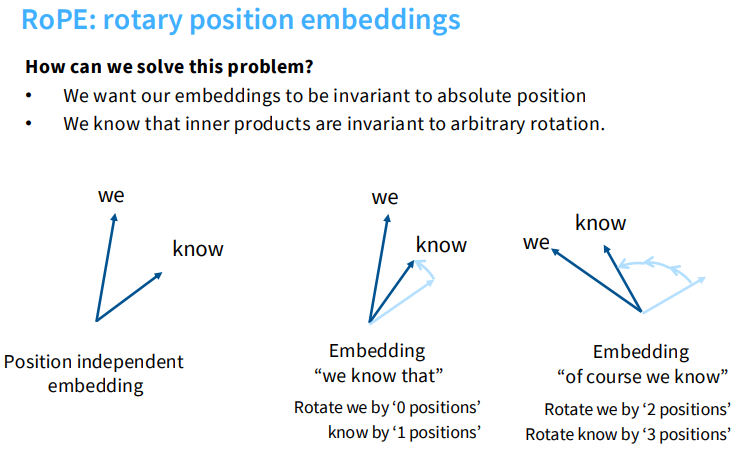
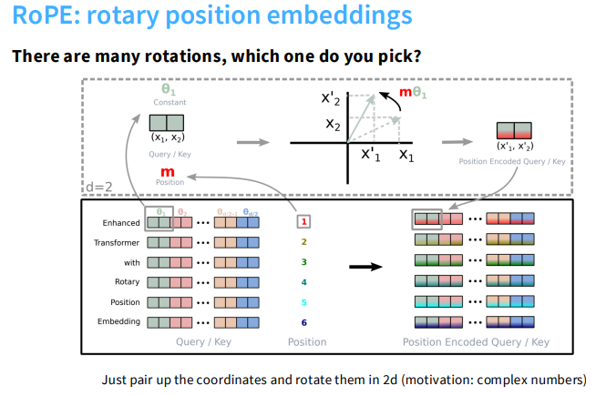
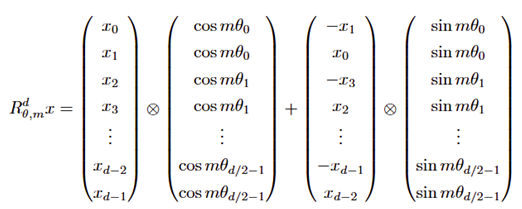
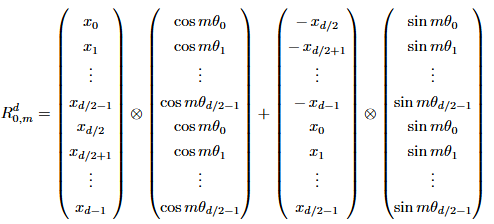
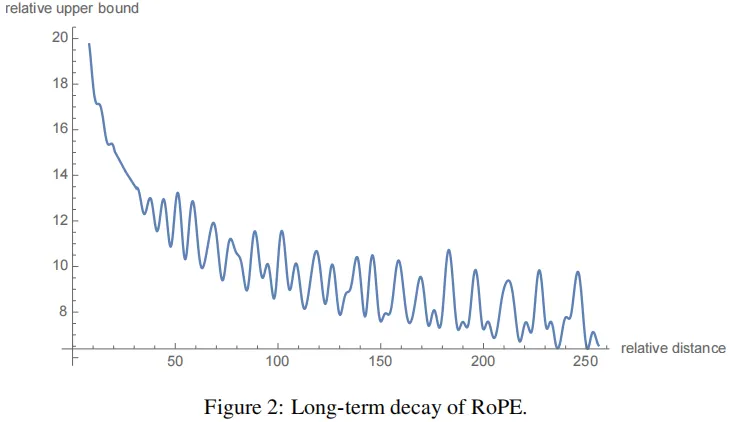
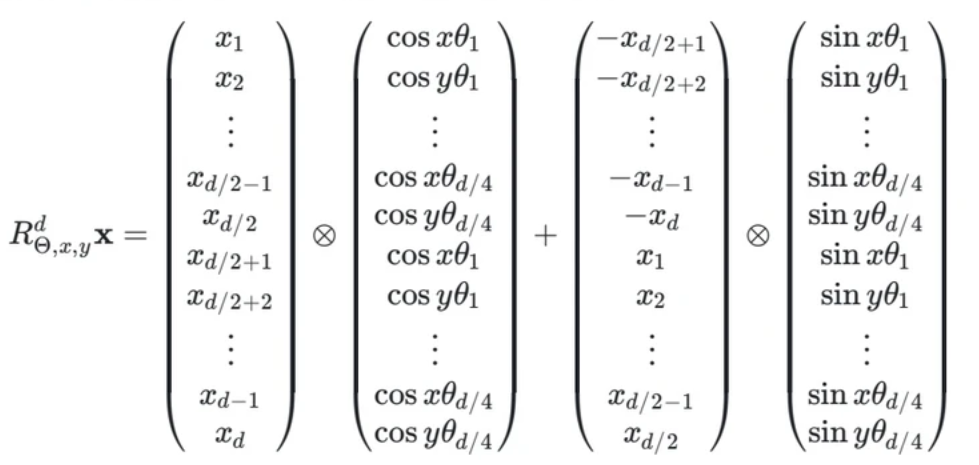

# 旋转位置编码RoPE (Rotary Position Embedding)

旋转位置编码（Rotary Position Embedding, RoPE）是一种将相对位置信息通过旋转矩阵注入到注意力机制中的位置编码方法。

## 目录

1. [为什么需要 RoPE？](#1-为什么需要-rope)
2. [核心思想：从绝对旋转到相对内积](#2-核心思想从绝对旋转到相对内积)
3. [具体构造与几何直观](#3-具体构造与几何直观)
4. [PyTorch代码实现](#4-pytorch代码实现)
5. [长文本扩展与外推性 (Extrapolation)](#5-长文本扩展与外推性-extrapolation)
    - [问题的本质与位置插值](#问题的本质与位置插值)
    - [增大Base的物理意义](#增大base的物理意义)
    - [NTK-aware插值](#ntk-aware-插值)
    - [YaRN方法](#yarn方法)
6. [旋转位置编码的长距离衰减](#6-长距离衰减)
7. [多模态旋转位置编码(M-RoPE)](#7-多模态旋转位置编码m-rope)
8. [常见核心问题探讨 (FAQ)](#8-常见核心问题探讨-faq)

---

## 1. 为什么需要 RoPE？

在 RoPE 出现之前，主流的位置编码方案主要有以下三种，但它们都存在无法克服的痛点：

1. **正弦编码 (Sine embeddings)**：原始 Transformer 使用。**痛点**：外推性极差（遇到没见过的长度直接崩溃）。
2. **绝对位置编码 (Absolute embeddings)**：直接把位置向量加到词向量上（ $v_x + u_i$ ）。**痛点**：完全没有相对位置的概念（模型必须死记硬背每个位置），零外推能力。

> **💡 加性操作的共同痛点**：正弦编码和绝对位置编码本质上**都是加性操作**。这种加性操作相当于在原始的词义向量中混入了位置噪声，强行在同一个高维空间中挤压“语义”和“位置”两种截然不同的信息。

3. **相对位置编码 (Relative embeddings)**：在 Attention 算子内部强行加上相对位置的偏置。**痛点**：破坏了注意力机制标准的内积形式，导致算子实现复杂，无法享受 FlashAttention 等底层硬件的极致加速。

**这就引出了 RoPE 的终极设计目标**：我们能不能找到一种方法，既不破坏内积的优雅形式（保持计算效率），又不破坏纯粹的语义信息，还能把相对位置信息完美地融入进去？

---

## 2. 核心思想：从绝对旋转到相对内积

RoPE的设计目标是：**通过给向量乘以一个绝对位置的旋转矩阵，使得两个向量的点积结果天然包含它们的相对位置信息。**

假设我们有一个第 $m$ 个位置的词的Query向量 $q$，以及第 $n$ 个位置的词的Key向量 $k$。RoPE的做法是构建一个位置相关的正交旋转矩阵 $R_m$ 和 $R_n$

- 带有位置 $m$ 信息的 $Q_m = R_m \cdot q$
- 带有位置 $n$ 信息的 $K_n = R_n \cdot k$

当我们计算它们的注意力得分（即计算内积）时：

$$
Q_m^T \cdot K_n = (R_m \cdot q)^T \cdot (R_n \cdot k) = q^T \cdot R_m^T \cdot R_n \cdot k
$$

因为旋转矩阵具有极其优雅的正交属性（ $R_m^T \cdot R_n = R_{n-m}$ ），上面的公式可以化简为：

$$
Q_m^T \cdot K_n = q^T \cdot R_{n-m} \cdot k
$$

**结论：**

你看，原本带着绝对位置 $m$ 和 $n$ 的矩阵，在**点积（Dot Product）**的作用下，奇迹般地变成了只与**相对位置 $(n-m)$ 有关的矩阵 $R_{n-m}$！**

---

## 3. 具体构造与几何直观

RoPE的核心思想是：通过旋转操作实现位置编码，使得内积天然具有相对位置不变性。



关键洞察：
- 内积在旋转变换下保持不变
- 如果我们让位置 $m$ 的向量旋转 $m \cdot \theta$ 角度，位置 $n$ 的向量旋转 $n \cdot \theta$ 角度
- 那么它们的相对旋转角度就是 $(m-n) \cdot \theta$，仅依赖于相对位置差！

如图所示：
- "we" 和 "know" 在位置无关的嵌入中有固定夹角
- 在"we know that"中，"we"旋转0度，"know"旋转1个位置
- 在"of course we know"中，"we"旋转2个位置，"know"旋转3个位置
- 相对旋转角度始终是1个位置，因此内积反映的是相对关系

### 3.1 为什么旋转不会破坏词意？

在理解了旋转如何表达相对位置后，常常会产生一个直觉上的疑问：“既然把词向量乘了一个旋转矩阵，那它原来的语义特征不就被破坏了吗？” 实际上并不会：

1. **正交变换的保范性**：RoPE 乘以的旋转矩阵在数学上是一个正交矩阵。正交变换最大的特点是**只改变方向，不改变模长**（ $||R_{\Theta,m}^d x|| = ||x||$ ）。这意味着词向量内部各维度的相对比例关系得到了极大保留，核心词意完好无损。
2. **作用域隔离**：RoPE 仅作用于 Query (Q) 和 Key (K) 用于算注意力分，负责向下游传递语义内容的 Value (V) 矩阵**不参与旋转**。
3. **避免了加法噪声**：摒弃了绝对位置编码的加法模式（ $v_x + u_i$ ），实现了位置信息与语义特征的优雅解耦。

### 3.2 旋转矩阵的具体构造



实际应用中，token 的嵌入维度 $d$ 远大于 2 (如 128、256)。RoPE 的处理方式是：

1. 将 $d$ 维向量按顺序两两分组，形成 $d/2$ 个复数对（如 $[x_1, x_2], [x_3, x_4], \ldots, [x_{d-1}, x_d]$）；
2. 对每个复数对应用上述旋转操作，使用不同的频率参数 $\theta_k$（k 为分组索引）；
3. 将旋转后的复数对重新拼接为 $d$ 维向量，作为最终的位置编码嵌入。

这种**分组旋转**的设计，让 RoPE 既能适配任意维度，又能保持计算效率（旋转矩阵为对角矩阵，计算量低）：

$$
R_{\Theta,m}^d = \begin{pmatrix}
\cos m\theta_0 & -\sin m\theta_0 & 0 & 0 & \cdots & 0 & 0 \\
\sin m\theta_0 & \cos m\theta_0 & 0 & 0 & \cdots & 0 & 0 \\
0 & 0 & \cos m\theta_1 & -\sin m\theta_1 & \cdots & 0 & 0 \\
0 & 0 & \sin m\theta_1 & \cos m\theta_1 & \cdots & 0 & 0 \\
\vdots & \vdots & \vdots & \vdots & \ddots & \vdots & \vdots \\
0 & 0 & 0 & 0 & \cdots & \cos m\theta_{d/2-1} & -\sin m\theta_{d/2-1} \\
0 & 0 & 0 & 0 & \cdots & \sin m\theta_{d/2-1} & \cos m\theta_{d/2-1}
\end{pmatrix}
$$

其中，旋转角度 $\theta_i$ 随维度索引 $i$ 指数衰减：

$$
\theta_i = 10000^{-2i/d}, \quad i = 0, 1, \ldots, d/2-1
$$

### 3.3 高效的计算方式

由于旋转矩阵极度稀疏，我们不需要进行完整的矩阵乘法。对于向量 $x = (x_0, x_1, \ldots, x_{d-1})^T$，RoPE变换可以高效计算为：



这相当于将相邻两个维度 $(x_{2i}, x_{2i+1})$ 视为2D平面上的点，旋转 $m\theta_i$ 角度。

---

## 4. PyTorch代码实现

RoPE有着两种常见的实现变体：一种是严格遵循原论文公式的"相邻配对"实现，另一种是目前主流开源大模型（如Llama）采用的"切半配对"实现。两者在数学性质上等价，只是配对的方式不一样：一种是相邻维度 $(x_{2i}, x_{2i+1})$ 两两成对，另一种是将向量切为前后两半 $(x_i, x_{i+d/2})$ 对应配对。

### 1. 论文原文实现 (Adjacent Pairs)

原论文中，旋转是针对相邻的两个维度 $(x_{2i}, x_{2i+1})$ 进行的。

```python
import torch

def precompute_freqs_cis_paper(d_model: int, end: int = 2048, theta: float = 10000.0):
    # Paper: interleave cos/sin to match [x0, x1, x2, x3, ...] pairing
    # theta_i = 10000^(-2i/d)
    freqs = 1.0 / (theta ** (torch.arange(0, d_model, 2).float() / d_model))
    t = torch.arange(end, device=freqs.device)
    freqs = torch.outer(t, freqs).float()
    
    # 生成 [cos0, cos0, cos1, cos1, ...] 的形式
    freqs_cos = torch.repeat_interleave(torch.cos(freqs), 2, dim=-1)
    freqs_sin = torch.repeat_interleave(torch.sin(freqs), 2, dim=-1)
    return freqs_cos, freqs_sin

def apply_rotary_pos_emb_paper(q, k, cos, sin):
    # Paper: [-x1, x0, -x3, x2, ...]
    def rotate_every_two(x):
        x = x.view(x.shape[:-1] + (-1, 2))
        x1, x2 = x.unbind(dim=-1)
        return torch.stack((-x2, x1), dim=-1).flatten(-2)

    q_embed = (q * cos) + (rotate_every_two(q) * sin)
    k_embed = (k * cos) + (rotate_every_two(k) * sin)
    return q_embed, k_embed
```

### 2. Llama/主流开源实现 (Half-split Pairs)

目前主流的实现（如HuggingFace Transformers中的实现）采用将向量切分为前后两半，进行 $(x_i, x_{i+d/2})$ 配对。这也是你提供的代码版本。



```python
import torch

def precompute_freqs_cis_llama(d_model: int, end: int = 2048, theta: float = 10000.0):
    # Llama: concat cos/sin to match [x_left, x_right] pairing
    freqs = 1.0 / (theta ** (torch.arange(0, d_model, 2)[: (d_model // 2)].float() / d_model))
    t = torch.arange(end, device=freqs.device)
    freqs = torch.outer(t, freqs).float()
    
    # 生成 [cos0, cos1, ..., cos0, cos1, ...] 的形式 (前半部分和后半部分重复)
    freqs_cos = torch.cat([torch.cos(freqs), torch.cos(freqs)], dim=-1)
    freqs_sin = torch.cat([torch.sin(freqs), torch.sin(freqs)], dim=-1)
    return freqs_cos, freqs_sin

def apply_rotary_pos_emb_llama(q, k, cos, sin, unsqueeze_dim=1):
    # Llama: [-x_right, x_left]
    def rotate_half(x):
        x1, x2 = x[..., :x.shape[-1]//2], x[..., x.shape[-1]//2:]
        return torch.cat((-x2, x1), dim=-1)

    q_embed = (q * cos.unsqueeze(unsqueeze_dim)) + (rotate_half(q) * sin.unsqueeze(unsqueeze_dim))
    k_embed = (k * cos.unsqueeze(unsqueeze_dim)) + (rotate_half(k) * sin.unsqueeze(unsqueeze_dim))
    return q_embed, k_embed
```

### 3. 实现区别对比

| 特性 | 论文原文实现 (Paper) | Llama/主流实现 (Llama) |
| :--- | :--- | :--- |
| **配对策略** | **相邻配对** $(x_{2i}, x_{2i+1})$ | **切半配对** $(x_i, x_{i+d/2})$ |
| **旋转逻辑** | 交换相邻元素：[-x_{2i+1}, x_{2i}] | 交换前后半段：[-x_{right}, x_{left}] |
| **三角函数排列** | interleave: `[c0, c0, c1, c1...]` | concat: `[c0, c1..., c0, c1...]` |
| **应用场景** | 严格复现原始论文公式 | 大多数现代开源大模型权重 |

两者**数学本质相同**，仅仅是基变换（Permutation）不同。在使用预训练模型时，必须确保使用的RoPE实现与训练时一致，否则会导致位置信息错乱。

---

## 5. 长文本扩展与外推性 (Extrapolation)

在训练 LLM 时，模型总是在固定的上下文窗口长度（如 2048、4096）上进行。当推理时输入长于训练长度的序列，模型就会遇到外推（Extrapolation）问题：即遇到了训练时没见过的巨大旋转角度差，导致注意力机制崩溃。

业界主要有以下几种解决方案：

### 5.1 问题的本质与位置插值 (Position Interpolation, PI)

最直观的方法是**位置插值**。它的核心思想是：将长序列的位置索引“压缩”到模型熟悉的训练窗口内。

假设原训练长度为 $L_{train}$，想拓展到 $L_{new}$（ $L_{new} > L_{train}$）。在计算 RoPE 时，不直接使用位置索引 $m$，而是使用缩放后的索引：

$$
m' = m \cdot \frac{L_{train}}{L_{new}}
$$

这样，对于长度为 $L_{new}$ 的序列，其最大位置索引会被压缩回 $L_{train}$ 范围内。这等价于**减小所有维度的旋转频率**（减缓转速）。
**优点**：效果显著，只需在少量长文本上微调几百步就能适应新长度。

### 5.2 增大 Base 的物理意义 (Code Llama 方法)

直接将 RoPE 的 Base 参数从 $10000$ 增大到 $1000000$ 或更大。

**1. 拉长了“最慢指针”的周期（防混叠）**
- **Base=10k**：最慢维度的周期约 62k token。超过 62k，位置编码就开始“转第二圈”，导致位置信息混叠。
- **Base=1M**：最慢维度的周期约 6.2M token。即使文本长达 500k，指针也没转完一圈，保证了超长距离下位置的唯一性。

**2. 将外推转化为内插**
增大 Base 会降低所有维度的旋转速度（$\theta$ 变小），把巨大的位置差压缩回模型熟悉的短距离旋转范围内，将未知的外推问题变成了模型能处理的内插问题。

**3. 代价：分辨率的牺牲**
指针转得越慢，相邻 Token 之间的旋转角度差异就越小。这就导致模型对“邻居”的感知变得迟钝。这也是为什么修改 Base 后通常需要微调来找回局部的精确度。

### 5.3 NTK-aware 插值：隐式的“动态缩放”

**核心思想**：高频信息（靠前的维度，转得快）比低频信息更能处理密集的位置信息，因此**不应该对所有维度进行等比例压缩**。

> **💡 深度解析**：这就好比时钟的秒针和时针。秒针对微小的时间变化极度敏感，用于精确定位。如果把秒针和时针等比例减速，虽然能看更长的时间，但局部精确度（分辨率）就毁了。

**具体做法（数学魔法）**：NTK-aware 并不是像直接修改 Base 那样随便给一个固定的死数字，而是通过一个巧妙的公式，算出一个与扩展倍数 $s$ 相关的“新 Base”：

$$
Base_{new} = Base \times s^{\frac{d}{d-2}}
$$

（其中 $s$ 是期望扩展的倍数，例如从 2k 扩展到 8k 窗口时，s=4，d 为特征维度）

**为什么这是一种“动态缩放”？**
表面上看，它只是算出了一个新的底数，但当我们把这个新底数代回原本的旋转角频率公式 $\theta_i = Base_{new}^{-2i/d}$ 时，奇迹出现了：

- **最高频 ($i=0$)**：由于指数部分为 0，无论 $Base_{new}$ 怎么变，计算结果始终为 1。扩展系数 $s$ 的作用被完全抹平，等于**没有压缩**（保留局部高分辨率）。
- **最低频 ($i \approx d/2$)**：指数部分趋近于 -1，算出来的最终频率缩放系数刚好约等于 $1/s$。这意味着低频部分被**完美压缩了 $s$ 倍**（等比例拉长周期）。

**结论**：NTK-aware 表面上看起来仅仅是改了 Base，但它通过巧妙利用指数 $-2i/d$ 的数学特性，隐式地实现了一个平滑的动态缩放机制——高频几乎不缩放，低频大幅缩放。

### 5.4 YaRN (Yet another RoPE extensioN) 方法

YaRN 是一种更成熟的显式分段插值法，并引入了温度控制来解决注意力涣散问题。

**1. 显式分段频率插值**
- **高频区**（近距离精细感知）：保持原样不插值，防止丢失局部细节。
- **低频区**（远距离宏观感知）：纯线性缩放，等比例拉长周期。
- **中频区**：采用线性过渡函数平滑连接。

**2. 注意力缩放（温度控制）**
长文本插值的副作用是：低频维度的压缩会导致点积平均值变大，Softmax 后的注意力分布变“糊”，引发幻觉。YaRN 引入了温度系数 $t \approx 0.1 \ln(s) + 1$ （s 为扩展倍数）来进行注意力缩放：

$$
Attention = \text{softmax}\left(\frac{q \cdot k}{\sqrt{d}} \times t\right)
$$

在工程实现中，通常提前将 Q 和 K 乘以 $\sqrt{t}$。

---

## 6. 长距离衰减

长距离衰减指的是：在RoPE机制下，两个token之间的注意力分数会随着它们之间相对距离的增大而自然地衰减（减小）。这符合自然语言的直觉——相距很远的两个词之间的直接依赖关系通常比相邻的词要弱。

### 数学原理

RoPE将维度分成 $d/2$ 组，每组对应一个旋转角度：

$$
\theta_i = 10000^{-2i/d}, \quad i = 1, 2, \ldots, d/2
$$

旋转后，Query $q_m$ 和 Key $k_n$ 的内积可写为：

$$
\mathbf{q}_m^\top \mathbf{k}_n = \text{Re}\left[\sum_{i=1}^{d/2} h_i e^{i(m-n)\theta_i}\right]
$$

其中 $e^{i(m-n)\theta_i}$ 是复平面上的旋转因子，旋转角度与相对距离 $(m-n)$ 成正比。

### 衰减机制

当相对距离 $|m-n|$ 增大时：
1. 不同维度对应的旋转角度差异巨大（因为 $\theta_i$ 随 $i$ 变化）
2. 在求和过程中，旋转角的周期性变化导致不同维度的贡献相互抵消
3. 整体内积值随 $|m-n|$ 增大而衰减

因此，RoPE的长距离衰减是通过旋转矩阵的频率衰减设计实现的，使得远距离词对之间的注意力权重自然降低。



上图展示了RoPE注意力分数随相对距离增加而衰减的特性，这种衰减是平滑且符合预期的。

## 7. 从 2D RoPE 到多模态旋转位置编码 (M-RoPE)

随着应用场景从纯文本向多模态拓展，模型需要处理的数据结构也变得更加复杂。在理解多模态旋转位置编码（Multimodal RoPE, M-RoPE）之前，我们首先需要理解它是如何从处理二维图像的 2D RoPE 演变而来的。

**M-RoPE 的核心操作是：将高维的隐藏层通道（Embedding Dimensions）进行切分，在不同的子空间上分别应用代表"时间"、"高度"和"宽度"的旋转矩阵；随后将这些经过独立旋转的子空间重新拼接还原，从而在单一的完整向量中，同时隐式编码出 1D（文本）、2D（图像）和 3D（视频）的时空位置信息。**

```
通道维度 d
[--------------------- d ---------------------]
[  d_t  ]     [  d_h  ]     [  d_w  ]
 时间旋转       高度旋转       宽度旋转
```

其中 $d_t + d_h + d_w = d$，三个子空间分别对应 1D 文本、2D 图像和 3D 视频的时空位置编码。

### 7.1 从 1D 到 2D 的跨越：2D RoPE

当场景从文本拓展到图像，传统的 1D RoPE 开始捉襟见肘：图像是二维的平面结构（高度 H + 宽度 W）。如果将图像按 patch（按行或按列）强行展平为 1D 序列，会严重丢失相邻 patch 之间的空间关联性。例如，在同一列上下相邻的两个 patch，展开成 1D 序列后它们之间的距离可能会相隔数十个 token。

**2D RoPE 的核心思想是：将位置编码拆分为两个独立维度，分别编码高度和宽度的空间信息。** 它不再试图用整个特征向量去编码一个单一的线性位置，而是将特征向量（Embedding Vector）切分为两个独立的子空间：

1. **X 轴子空间**：使用向量的一半维度，专门用于编码宽度信息（Width，横向位置）。
2. **Y 轴子空间**：使用向量的另一半维度，专门用于编码高度信息（Height，纵向位置）。

假设特征维度为 $d$，则用于旋转的频率对数量为 $d/2$。在 2D RoPE 中，我们将这 $d/2$ 对频率一分为二：
* 前 $d/4$ 组复数对频率用于编码 X 坐标（宽度）。
* 后 $d/4$ 组复数对频率用于编码 Y 坐标（高度）。
*（注：每组复数对占用 2 个维度，X 方向占 d/4 组 × 2 = d/2 个维度，Y 方向同样占 d/2 个维度，合计恰好等于 d，与原向量维度完美一致）*

这意味着，对于同一个特征向量 $\mathbf{x}$，其 2D 位置编码的计算公式如下：



* 可以看到，向量中的不同部分分别与 $\cos x\theta$ (横向) 和 $\cos y\theta$ (纵向) 相互作用。
* 通过这种方式，模型能够同时捕捉图像在 **水平** 和 **垂直** 两个方向上的相对距离信息，且能够原生支持任意分辨率的输入（无论图像是 224x224 还是 1024x1024，只需根据实际分辨率生成对应的 `(h_pos, w_pos)` 索引，即可动态计算旋转编码，完美适配多分辨率输入场景）。

### 7.2 迈向全模态：M-RoPE 的维度分解

随着多模态大模型（如 Qwen2-VL, MiniCPM-V）的进一步发展，模型不仅需要处理 1D 的文本和 2D 的图像，还需要处理 3D 的视频数据（加入了时间维度）。基于 2D RoPE 的成功经验，多模态旋转位置编码（Multimodal RoPE, M-RoPE）顺理成章地将“维度拆分”的思想推向了极致。

M-RoPE 的核心做法是将原始的 Embedding 向量通道（Channel）进一步切分，分别用于编码不同的维度。假设 Embedding 的总维度为 $d$，在多模态场景下，我们会将其拆分为三个部分：
* $d_h$：负责高度（Height）信息
* $d_w$：负责宽度（Width）信息
* $d_t$：负责时间/序列（Time/Text）信息

满足 $d_h + d_w + d_t = d$。

### 7.3 M-RoPE 在不同模态的应用方式

1. **文本（Text）**
对于纯文本，它只有一维属性。在这种情况下，M-RoPE 会在三个子维度上使用相同的位置索引 $i$。即 Pos_h、Pos_w、Pos_t 三者均等于当前 token 的序列位置索引 i。这使得文本的处理逻辑在数学上完全退化回了原始的一维 RoPE，保证了模型对语言信息的完美兼容性。

2. **图像（Image）**
图像具有二维空间属性（H*W）。其中 Pos_t 对于静止图像来说时间索引固定为常数。而 Pos_h 和 Pos_w 根据像素块（Patch）在图像中的实际行列坐标进行编码。这样，模型就能感知到一个 Token 到底是在图像的左上角还是右下角，这正是 2D RoPE 的直接应用。

3. **视频（Video）**
视频在图像的基础上增加了时间轴 $T$。其中 Pos_t 对应帧（Frame）的时间序号，Pos_h 和 Pos_w 对应每一帧内的空间位置。这使得模型能够建立起起“在第几秒、哪个位置发生了什么”的完整时空关联。

### 7.4 PyTorch 代码实现

以下代码包含了完整的Llama风格RoPE实现以及新增的M-RoPE逻辑。

```python
import torch

def precompute_freqs_cis_llama(d_model: int, end: int = 2048, theta: float = 10000.0):
    # Llama: concat cos/sin to match [x_left, x_right] pairing
    freqs = 1.0 / (theta ** (torch.arange(0, d_model, 2)[: (d_model // 2)].float() / d_model))
    t = torch.arange(end, device=freqs.device)
    freqs = torch.outer(t, freqs).float()
    
    # 生成 [cos0, cos1, ..., cos0, cos1, ...] 的形式 (前半部分和后半部分重复)
    freqs_cos = torch.cat([torch.cos(freqs), torch.cos(freqs)], dim=-1)
    freqs_sin = torch.cat([torch.sin(freqs), torch.sin(freqs)], dim=-1)
    return freqs_cos, freqs_sin

def apply_rotary_pos_emb_llama(q, k, cos, sin, unsqueeze_dim=1):
    # Llama: [-x_right, x_left]
    def rotate_half(x):
        x1, x2 = x[..., :x.shape[-1]//2], x[..., x.shape[-1]//2:]
        return torch.cat((-x2, x1), dim=-1)

    q_embed = (q * cos.unsqueeze(unsqueeze_dim)) + (rotate_half(q) * sin.unsqueeze(unsqueeze_dim))
    k_embed = (k * cos.unsqueeze(unsqueeze_dim)) + (rotate_half(k) * sin.unsqueeze(unsqueeze_dim))
    return q_embed, k_embed

def apply_multimodal_rotary_pos_emb(q, k, cos, sin, mrope_section, position_ids):
    """
    应用多模态旋转位置编码 (Multimodal Rotary Positional Embeddings, M-ROPE)。
    该函数将 Query 和 Key 向量在 Head 维度上切分为三个部分（通常对应 Time, Height, Width)
    分别结合对应的位置索引应用旋转位置编码，最后重新拼接。

    Args:
        q (torch.Tensor): Query 向量，形状为 [batch, seq_len, num_heads, head_dim]。
        k (torch.Tensor): Key 向量，形状为 [batch, seq_len, num_heads, head_dim]。
        cos (torch.Tensor): 预计算的 Cosine 频率表，形状为 [max_seq_len, head_dim]。
        sin (torch.Tensor): 预计算的 Sine 频率表，形状为 [max_seq_len, head_dim]。
        mrope_section (List[int]): 用于切分 Head 维度的列表，例如 [16, 24, 24] 分别对应 Time, Height, Width。
                                   其总和必须等于 head_dim。
        position_ids (torch.Tensor): 位置索引，形状为 [3, batch, seq_len]。
                                     三行分别对应 Time (m_t), Height (m_h), Width (m_w) 的位置 ID。

    Returns:
        Tuple[torch.Tensor, torch.Tensor]: 旋转后的 Query 和 Key 向量，形状与输入一致。
    """
    
    # 1. 维度切分
    # 将 q, k, cos, sin 根据 mrope_section 在最后一个维度上切分为三部分 (Time, Height, Width)。
    # q/k_parts 中每个 Tensor 的形状为: [batch, seq_len, num_heads, section_dim]
    # cos/sin_parts 中每个 Tensor 的形状为: [max_seq_len, section_dim]
    q_parts = torch.split(q, mrope_section, dim=-1)
    k_parts = torch.split(k, mrope_section, dim=-1)
    cos_parts = torch.split(cos, mrope_section, dim=-1)
    sin_parts = torch.split(sin, mrope_section, dim=-1)
    
    q_out_list, k_out_list = [], []
    
    # 2. 分别应用旋转位置编码
    # 遍历三个部分 (Time, Height, Width)
    for i, (q_part, k_part, cos_part, sin_part) in enumerate(zip(q_parts, k_parts, cos_parts, sin_parts)):
        # 获取当前模态维度对应的位置索引，形状: [batch, seq_len]
        pos_ids_part = position_ids[i]
        
        # 根据位置索引选取对应的 cos/sin 值
        # 选取后 part_cos/sin 形状变为: [batch, seq_len, section_dim]
        part_cos = cos_part[pos_ids_part]
        part_sin = sin_part[pos_ids_part]
        
        # 应用 RoPE
        # 注意：这里需要通过 unsqueeze_dim=2 将 part_cos/sin 广播为 [batch, seq_len, 1, section_dim]
        # 以匹配 q_part/k_part 的 num_heads 维度
        q_out_part, k_out_part = apply_rotary_pos_emb_llama(q_part, k_part, part_cos, part_sin, unsqueeze_dim=2)
        
        q_out_list.append(q_out_part)
        k_out_list.append(k_out_part)
        
    # 3. 拼接结果
    # 将处理后的三个部分在最后一个维度上拼接回完整的向量
    q_final = torch.cat(q_out_list, dim=-1)
    k_final = torch.cat(k_out_list, dim=-1)
    
    return q_final, k_final

if __name__ == "__main__":
    # 模拟参数
    batch, seq_len, num_heads, head_dim = 1, 10, 4, 64
    max_seq_len = 100
    mrope_section = [16, 24, 24] # Sum = 64
    
    # 随机输入
    q = torch.randn(batch, seq_len, num_heads, head_dim)
    k = torch.randn(batch, seq_len, num_heads, head_dim)
    
    # 预计算 cos/sin 表
    cos, sin = precompute_freqs_cis_llama(head_dim, end=max_seq_len)
    
    # 模拟位置索引 [3, batch, seq_len]
    # 假设前5个token是文本(只有m_t)，后5个是图像(m_t, m_h, m_w都有)
    position_ids = torch.randint(0, max_seq_len, (3, batch, seq_len))
    
    q_out, k_out = apply_multimodal_rotary_pos_emb(q, k, cos, sin, mrope_section, position_ids)
    
    print(f"Input shape: {q.shape}")
    print(f"Output shape: {q_out.shape}")
    print("M-ROPE applied successfully.")
```

## 8. 常见核心问题探讨 (FAQ)

**Q: 为什么 RoPE 仅作用于 Query (Q) 和 Key (K)，而不作用于 Value (V)？**

**A:** 这一设计主要由注意力机制的数学范式、平移不变性的要求，以及深层网络特征流形的稳定性所决定。具体可归纳为以下三个核心维度：

1. 相似度度量与信息聚合的解耦

在标准自注意力机制 $\text{Attention}(Q, K, V) = \text{Softmax}\left(\frac{QK^T}{\sqrt{d}}\right)V$ 中，计算图被明确划分为两个阶段：
* **寻址与路由 (Routing via Q and K)**：Q 和 K 在内积空间中进行交互，计算 Token 之间的注意力权重（Attention Scores）。自然语言中，Token 间的句法依赖和语义关联高度受限于它们的相对距离。因此，必须通过 RoPE 将位置先验注入 $Q$ 和 $K$ 的内积计算中，引导模型正确收敛。
* **特征聚合 (Aggregation via V)**：V 承载的是纯粹的语义特征（Semantic Representation）。注意力权重计算完成后，系统对 $V$ 进行线性加权求和。此时，V 仅作为信息载体被提取，其包含的语义内容本身不应受其所在绝对位置的干扰。

2. 维持输出特征的平移不变性 (Translation Invariance)

RoPE 的核心数学性质是：通过给 $Q$ 和 $K$ 施加绝对位置的旋转矩阵，使得它们的内积转化为仅依赖相对距离的函数：

$$
\langle R_m q_m, R_n k_n \rangle = q_m^T R_{n-m} k_n
$$

这保证了注意力权重矩阵具有完美的平移不变性。然而，如果我们将 RoPE 同样作用于 $V$，位置 $m$ 处的注意力输出 $O_m$ 将变为：

$$
O_m = \sum_{n} a_{m,n} (R_n v_n)
$$

在这个公式中， $R_n$ 是绝对位置旋转矩阵。这意味着经过 Attention 层加权求和后，输出特征 $O_m$ 被强制混入了各个 Token 的绝对位置信息。如果将一段文本在上下文中整体平移，虽然内部的相对注意力权重 $a_{m,n}$ 不变，但由于绝对坐标 $n$ 的改变，最终输出的特征向量 $O_m$ 会发生剧烈的旋转扭曲，彻底破坏了模型的平移不变性。

3. 保护残差连接中的特征流形 (Feature Manifold)

Transformer 架构深度依赖残差连接 $x_{l+1} = x_l + \text{Attention}(x_l)$ 来缓解梯度消失并促进特征复用。
如果对 $V$ 应用 RoPE，相当于在每次 Attention 聚合后，都对语义子空间进行了一次基于绝对位置的高维旋转。为了让残差相加有意义，前馈神经网络 (FFN) 和后续的 Attention 层将不得不额外消耗大量的网络容量（Capacity）去“解旋转 (Un-rotate)”，尝试对齐原本的语义流形。这不仅会极大增加优化的难度，还会导致深层网络无法维持纯粹、稳定的语义特征表达。
