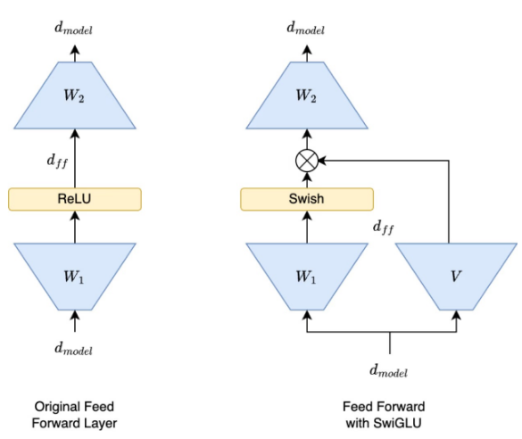

# Activation Functions in Transformers

## 目录
- [背景：从ReLU到SwiGLU的演进](#背景从relu到swiglu的演进)
- [核心机制：什么是门控（Gating）？](#核心机制什么是门控gating)
  - [门控的本质：软特征选择](#门控的本质软特征选择)
- [为什么现代大模型（Llama等）倾向于SwiGLU？](#为什么现代大模型llama等倾向于swiglu)
- [代码实现](#代码实现)

---

## 背景：从ReLU到SwiGLU的演进



在Transformer的前馈网络（FFN）中，激活函数负责引入非线性，其选择经历了从简单到复杂的演变过程。

* **ReLU (Rectified Linear Unit)**：原始Transformer（2017）的标准配置。公式简单： FFN(x) = max(0, xW_1 + b_1)W_2 + b_2 。虽然计算快，但在处理负数时会产生"神经元死亡"现象。
* **GELU (Gaussian Error Linear Unit)**：GPT系列（GPT-1/2/3）的标准配置。通过高斯分布引入随机性，曲线更平滑。
* **SwiGLU (Swish Gated Linear Unit)**：由Shazeer在2020年提出。它是目前Llama 2/3, Mistral, PaLM等顶尖模型的主流选择。

---

## 核心机制：什么是门控（Gating）？

SwiGLU的核心在于将传统的"单路"变换升级为"双路门控"结构。

Shazeer（2020）在论文中用 `FFN_激活函数名` 的统一命名规范来描述这一系列变体，方便对比：

$$
FFN_{\text{ReLU}}(x, W_1, W_2) = \max(0,\ xW_1)\ W_2
$$

$$
FFN_{\text{GELU}}(x, W_1, W_2) = \text{GELU}(xW_1)\ W_2
$$

$$
FFN_{\text{SwiGLU}}(x, W, V, W_2) = (\text{Swish}(xW) \otimes xV)\ W_2
$$

可以看到，`FFN_SwiGLU` 与前两者最本质的区别在于：**参数矩阵从 2 个变成了 3 个** ($W, V, W_2$)，并且计算路径从"单路"变成了"双路相乘"。

### 1. 传统 FFN（以ReLU为例）
输入只经过一个线性层和激活函数：

$$
FFN_{\text{ReLU}}(x) = \max(0, xW_1) W_2
$$

### 2. 门控线性单元（GLU）
GLU引入了一个额外的"线性投影分支"作为门控（Gate），将原本的激活操作替换为两个分支的逐元素相乘（Hadamard Product, $\otimes$）：

$$
\max(0, xW_1) \rightarrow \max(0, xW_1) \otimes (xV)
$$

其中 $V$ 是门控路的权重矩阵。

### 3. SwiGLU 变体
当我们将门控机制与 Swish 激活函数（即 $x \cdot \text{sigmoid}(x)$ ）结合时，就得到了 SwiGLU：

$$
FFN_{\text{SwiGLU}}(x, W, V, W_2) = (\text{Swish}_1(xW) \otimes xV) W_2
$$

* **主路 (xW)**：负责提取特征并经过 Swish 激活。
* **门控路 (xV)**：负责动态调节主路信息的通过比例。

### 门控的本质：软特征选择

门控机制（Gating）可以从更深的维度理解——它本质上是一种**软特征选择**（Soft Feature Selection）机制。

在逐元素相乘 $\text{Swish}(xW) \otimes xV$ 中，两条分支扮演着截然不同的角色：

- **Swish 分支（主路 $xW$）充当 Router**：经过非线性激活后，其每个维度的输出值决定了对应特征"有多重要"。接近 0 的值意味着这个特征被抑制，值越大则保留越多——它扮演的是一个动态的"重要性评分器"。

- **线性分支（门控路 $xV$）提供原始特征**：这一路没有激活函数，保留了输入的线性变换特征，作为被筛选的"原材料"。

两者逐元素相乘后，模型实现了**在不同上下文中动态过滤信息**的能力：面对不同的输入 $x$，门的开合程度（每个维度的乘法权重）会随之改变，让有用的特征通过、压制无关的特征。这与 MoE（Mixture of Experts）中 Router 选择专家的思想一脉相承，只不过 SwiGLU 的门控是**连续且可微**的软选择，而 MoE 是离散的硬选择。

> 这也是 SwiGLU 比单纯的 GELU（只做单路非线性）更强的深层原因：GELU 的非线性是固定的（只取决于值本身），而 SwiGLU 的门控权重是**由输入内容动态决定的**，表达能力更强。

---

## 为什么现代大模型（Llama等）倾向于SwiGLU？

### 1. 性能更强（Performance）
多项实验证明，基于GLU的变体（特别是SwiGLU和GeGLU）在各种NLP任务（如SGLUE, XSum）上的表现持续优于传统的ReLU或GELU。

### 2. 参数效率与"2/3准则"（The 2/3 Rule）
由于引入了分支 $V$ 导致参数量增加，为了保持总参数量和计算量（FLOPs）与标准Transformer持平，SwiGLU模型通常会缩小FFN的中间维度：
* **标准FFN**：

$$
d_{ff} = 4 \times d_{model}
$$

* **SwiGLU FFN**：

$$ 
d_{ff} = \frac{8}{3} \times d_{model}
$$

这种设计用"更窄但更复杂"的交互层换取了更好的表达能力。

### 总结比较
| 特性 | ReLU / GELU (经典) | SwiGLU (现代) |
| :--- | :--- | :--- |
| **操作** | 单路线性 + 激活 | 双路分支：激活路 $\otimes$ 线性门控路 |
| **参数矩阵** | 2个 ($W_1, W_2$) | 3个 ($W, V, W_2$) |
| **中间维度 $d_{ff}$** | $4d_{model}$ | $\approx 2.67d_{model}$ |
| **代表模型** | Original Transformer, GPT-3, OPT | Llama 3, Mistral, PaLM |

---

## 代码实现

以下是 Qwen2.5-VL Vision Encoder 中 SwiGLU MLP 的实际实现（`vlm_architecture/qwen2_5_vl/modeling_qwen2_5_vl.py`）。相比教学示例，工程实现将 $W$（`gate_proj`）和 $V$（`up_proj`）分成两个独立的线性层，逻辑更清晰：

```python
class Qwen2_5_VLMLP(nn.Module):
    def __init__(self, config, bias: bool = False):
        super().__init__()
        self.hidden_size = config.hidden_size
        self.intermediate_size = config.intermediate_size
        # 主路 W：提取特征，经过激活函数（Swish/SiLU）作为门控评分
        self.gate_proj = nn.Linear(self.hidden_size, self.intermediate_size, bias=bias)
        # 门控路 V：提供原始线性特征，作为被筛选的"原材料"
        self.up_proj = nn.Linear(self.hidden_size, self.intermediate_size, bias=bias)
        # 输出投影：将门控后的特征映射回 hidden_size
        self.down_proj = nn.Linear(self.intermediate_size, self.hidden_size, bias=bias)
        self.act_fn = ACT2FN[config.hidden_act]  # 默认为 silu（即 Swish）

    def forward(self, hidden_state):
        # Swish(gate_proj(x)) * up_proj(x) 对应公式：Swish(xW) ⊗ xV
        # 再经 down_proj 映射回原始维度，对应公式中的 W_2
        return self.down_proj(self.act_fn(self.gate_proj(hidden_state)) * self.up_proj(hidden_state))
```