# Mixture of Experts

## 目录
  - [What's a MoE?](#whats-a-moe)
  - [Why are MoEs getting popular?](#why-are-moes-getting-popular)
  - [Routing function overview](#routing-function-overview)
  - [Routing methods overview](#routing-methods-overview)
  - [Top-K routing in detail](#top-k-routing-in-detail)
  - [Recent variations from DeepSeek and other Chinese LMs](#recent-variations-from-deepseek-and-other-chinese-lms)
  - [How do we train MoEs?](#how-do-we-train-moes)
    - [1. 核心挑战：负载均衡 (The Load Balancing Problem)](#1-核心挑战负载均衡-the-load-balancing-problem)
    - [2. DeepSeek V3的新范式：无辅助损失负载均衡 (Auxiliary-loss-free Balancing)](#2-deepseek-v3的新范式无辅助损失负载均衡-auxiliary-loss-free-balancing)
    - [3. 去掉负载均衡loss后会发生什么？](#3-去掉负载均衡loss后会发生什么)
  - [Fun side view: stochasticity of MoE models](#fun-side-view-stochasticity-of-moe-models)
    - [核心观点](#核心观点)
    - [详细流程解析 (Image Walkthrough)](#详细流程解析-image-walkthrough)
    - [MOE随机性的结论](#moe随机性的结论)
  - [Issues with MoEs](#issues-with-moes)
    - [训练稳定性 (Training Stability)](#训练稳定性-training-stability)
    - [微调困难 (Fine-tuning issues)](#微调困难-fine-tuning-issues)
  - [Other training methods: upcycling](#other-training-methods-upcycling)
    - [1. 具体做法](#1-具体做法)
    - [2. 优势](#2-优势)
  - [Deepseek MoE v1-v2-v3](#deepseek-moe-v1-v2-v3)
    - [Deepseek MoE V1](#deepseek-moe-v1)
    - [Deepseek MoE V2](#deepseek-moe-v2)
    - [Deepseek MoE V3](#deepseek-moe-v3)


### What's a MoE?

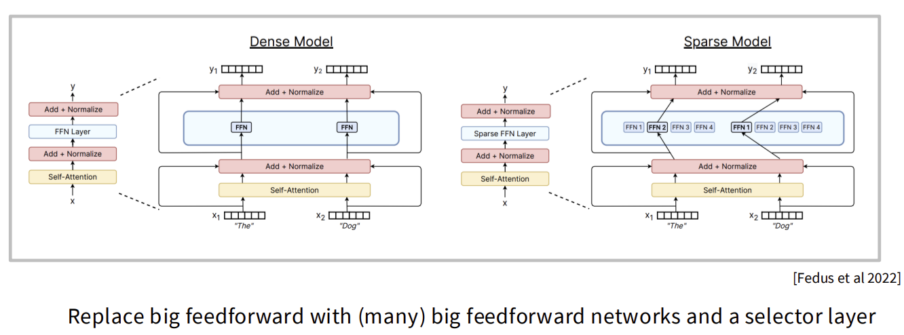

混合专家模型（MoE）是一种通过稀疏性（Sparsity）来扩展模型容量的架构。与传统的稠密模型（Dense Model）不同，MoE允许模型拥有巨大的总参数量，但在处理每个token时只激活其中一小部分参数。

核心架构变化：
* 稠密模型 (Dense Model)：每一个token都会经过相同的前馈神经网络（FFN）层，激活所有参数。
* 稀疏模型 (Sparse Model/MoE)：将原本的一个大FFN层替换为多个平行的FFNs（即"专家"，Experts）和一个路由层（Router/Gating Network）。Router决定每个token发送到哪个或哪几个专家进行处理。

MoE层的工作流：
1. Token进入MoE层。
2. Router计算该token与各个专家的匹配分数。
3. Token被发送到被选中的专家（Top-K）。
4. 专家的输出经过加权求和，加上残差连接，传向下一层。

---

### Why are MoEs getting popular?

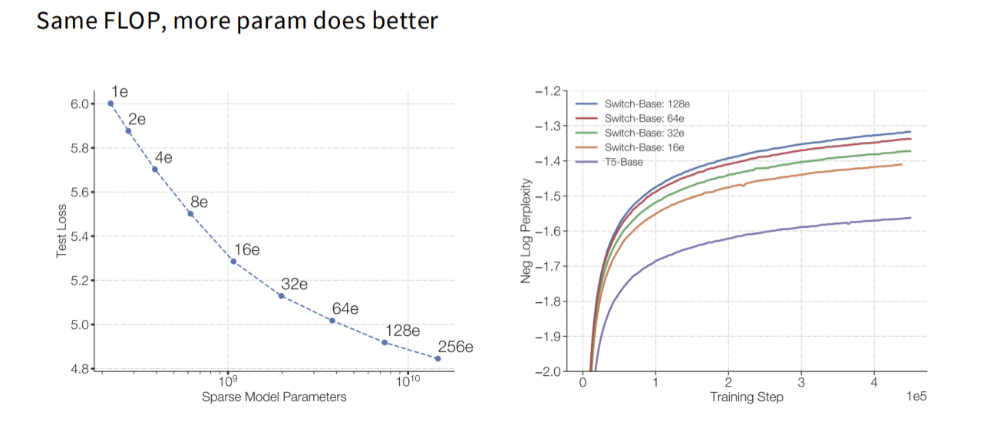
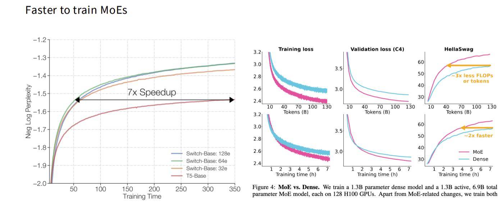

MoE之所以成为当前大模型的主流选择，核心原因可以总结为两句话：在相同计算量下效果更好，以及训练速度显著更快。

结合课程讲义中的实验数据（基于Switch Transformer与T5-Base的对比），具体优势如下：

1.  同算力下的性能碾压 (Same FLOP, more param does better)
    * 原理：传统观念认为模型越大计算越慢，但MoE打破了这一点。它允许模型拥有巨大的总参数量（Total Parameters），但在推理时只激活一小部分活跃参数（Active Parameters）。这意味着在保持推理计算量（FLOPs）不变的情况下，我们可以通过增加专家数量来无限扩展模型容量。
    * 实验证据：图片中的 *Test Loss* 曲线显示，随着专家数量从1个增加到256个（1e $\rightarrow$ 256e），模型的测试损失呈单调下降趋势。这意味着只要增加专家，模型这就变得越聪明，而计算成本并没有显著增加。
    * 对比：在 *Neg Log Perplexity* 图表中，稀疏模型（Switch-Base 64e/128e）的收敛曲线远优于同等规模的稠密模型（T5-Base）。

2.  极致的训练效率 (Faster to train MoEs)
    * 7倍加速：图片中的 *Training Time* 对比图展示了一个惊人的结果：MoE模型在达到与稠密模型相同的困惑度（Perplexity）时，速度可以快7倍。
    * 更少的数据，更好的效果：
        * 数据利用率：达到同样的验证集精度（如HellaSwag测试），MoE所需的训练数据量（Tokens）是稠密模型的1/3（3x less tokens）。
        * 时间成本：在挂钟时间（Wall-clock time）上，MoE达到同样性能的速度是稠密模型的2倍以上。
    * 结论：对于大模型预训练来说，时间和算力就是金钱。MoE这种"少吃草、跑得快"的特性，使其成为scaling up（扩大规模）的最佳选择。

3.  当前业界的实证
    * 这一理论在当今的开源模型中得到了验证。DeepSeek-V3、Mixtral 8x22B等模型正是利用MoE架构，以远低于GPT-4的训练和推理成本，达到了与之从匹敌的性能水平。
---

### Routing function overview

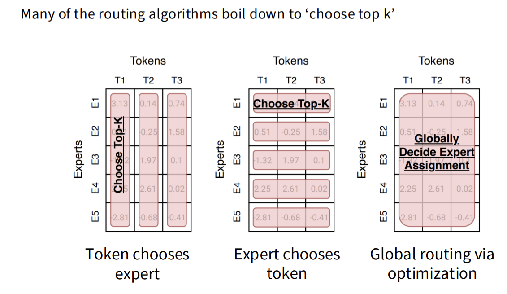

路由函数决定了Token与Expert之间的分配关系。主要有三种视角的逻辑：

1. Token选择专家 (Token chooses expert)：
    * 机制：每个Token查看所有专家的评分，选择分数最高的K个专家（Top-K）。
    * 现状：这是目前最主流的做法。
    * 问题：可能会导致某些热门专家负载过重（Load Imbalance）。

2. 专家选择Token (Expert chooses token)：
    * 机制：每个专家有固定的容量，挑选它最擅长处理的Token。
    * 问题：可能会导致部分Token没有专家处理（被丢弃/Dropped）。

3. 全局规划 (Global routing via optimization)：
    * 机制：通过线性规划等算法，在全局范围内寻找最优的分配方案，以平衡负载和亲和度。
    * 现状：计算复杂，难以并行化，较少在现代大规模模型中使用。

---

### Routing methods overview

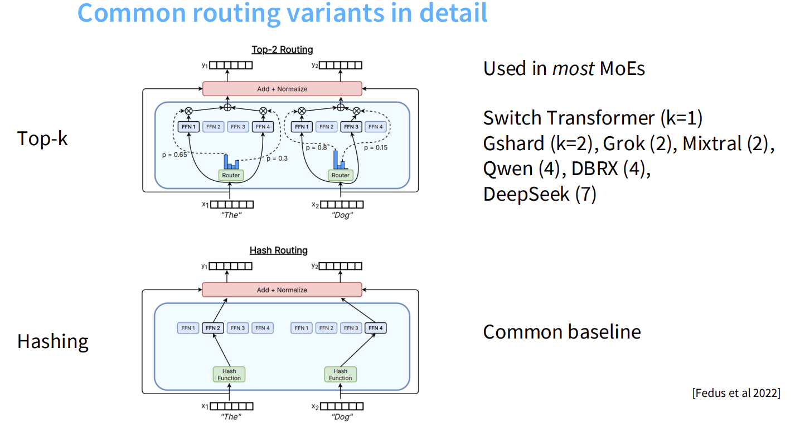

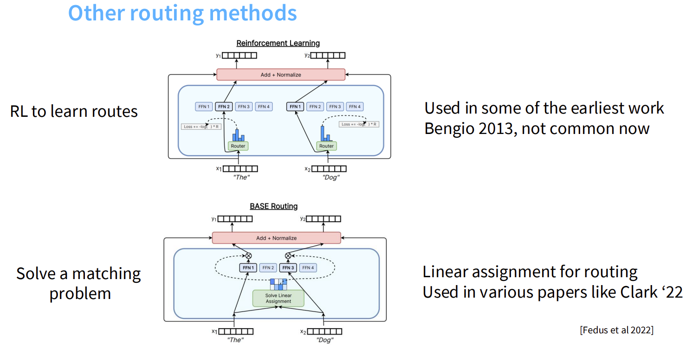

在实际应用中，具体的路由算法有以下几种变体：

* Top-K Routing（标准做法）：
    * 使用一个可学习的Router网络，对专家打分，取前K名。目前绝大多数模型（Switch Transformer, Mixtral, DeepSeek, Qwen）都使用这种方法的变体。

* Hash Routing（哈希路由）：
    * 使用固定的哈希函数将Token映射到专家。通常作为基准线（Baseline）使用，不需要训练Router。

* Reinforcement Learning（强化学习）：
    * 使用RL算法（如REINFORCE）来优化路由策略。虽然理论上可行，但由于训练不稳定，目前已很少使用。

* Linear Assignment（线性分配）：
    * 基于Base Routing的全局分配方法，早期工作中使用过。

---

### Top-K routing in detail

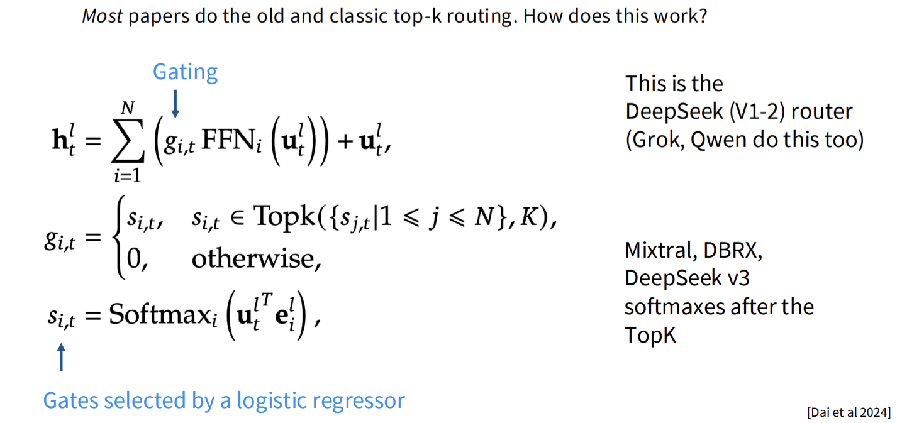

这是目前最常用的路由实现方式，其数学过程如下：

1. 打分 (Scoring)：
    Router计算输入 $u_t$ 与每个专家 $e_i$ 的点积相似度，并进行Softmax归一化：

$$
s_{i,t} = \text{Softmax}_i (u_t^T e_i)
$$

2. 门控筛选 (Gating)：
    只保留分数最高的$K$个专家，其余置零：

$$
g_{i,t} = \begin{cases} s_{i,t}, & \text{if } s_{i,t} \in \text{TopK} \\ 0, & \text{otherwise} \end{cases}
$$

3. 加权输出 (Weighted Sum)：
    将选中专家的输出按权重加权求和，并加上残差连接：

$$
h_t = \sum (g_{i,t} \cdot \text{FFN}_i(u_t)) + u_t
$$

技术细节差异：
* DeepSeek (V1-2), Grok, Qwen：先对所有专家做Softmax，再选Top-K。
* Mixtral, DeepSeek V3：先选出Top-K，然后只对这K个值做Softmax（归一化）。

为了更直观地理解上述数学过程，以下是一个简化的Router实现代码，涵盖了两种主流的归一化逻辑：

```python
import torch
import torch.nn as nn
import torch.nn.functional as F

class MoERouter(nn.Module):
    def __init__(self, hidden_dim, num_experts, top_k, routing_type='standard'):
        super().__init__()
        self.gate = nn.Linear(hidden_dim, num_experts)
        self.top_k = top_k
        self.routing_type = routing_type # 'standard' or 'mixtral'

    def forward(self, x):
        # x shape: [batch_size, seq_len, hidden_dim]
        
        # 1. 打分 (Scoring): 计算输入与专家向量的点积
        # logits shape: [batch_size, seq_len, num_experts]
        logits = self.gate(x)

        if self.routing_type == 'standard':
            # === 方式A: DeepSeek V1-2 / Grok / Qwen ===
            # 先对所有专家做Softmax，再选Top-K
            
            # 计算所有专家的概率
            probs = F.softmax(logits, dim=-1)
            
            # 选出Top-K的概率和索引
            # topk_weights: [batch, seq, k]
            # topk_indices: [batch, seq, k]
            topk_weights, topk_indices = torch.topk(probs, k=self.top_k, dim=-1)
            
            # (可选) 重新归一化，使选中的权重和为1
            topk_weights = topk_weights / topk_weights.sum(dim=-1, keepdim=True)

        elif self.routing_type == 'mixtral':
            # === 方式B: Mixtral / DeepSeek V3 ===
            # 先选出Top-K的Logits，再对这K个值做Softmax
            
            # 直接基于logits选Top-K
            topk_logits, topk_indices = torch.topk(logits, k=self.top_k, dim=-1)
            
            # 只对选中的K个值做归一化
            # 这种方式可以让梯度更聚焦，避免被大量未选中的专家稀释
            topk_weights = F.softmax(topk_logits, dim=-1)

        return topk_weights, topk_indices

# --- 模拟使用 ---
# 假设输入：Batch=2, Length=5, Dim=128
x = torch.randn(2, 5, 128)

# 初始化Router (8个专家，选2个)
# 模式1: Standard (Softmax -> TopK)
router_standard = MoERouter(128, 8, 2, routing_type='standard')
weights1, indices1 = router_standard(x)

# 模式2: Mixtral (TopK -> Softmax)
router_mixtral = MoERouter(128, 8, 2, routing_type='mixtral')
weights2, indices2 = router_mixtral(x)

print(f"Top-K Indices Shape: {indices1.shape}") # [2, 5, 2]
print(f"Top-K Weights Shape: {weights1.shape}") # [2, 5, 2]
```

---

### Recent variations from DeepSeek and other Chinese LMs

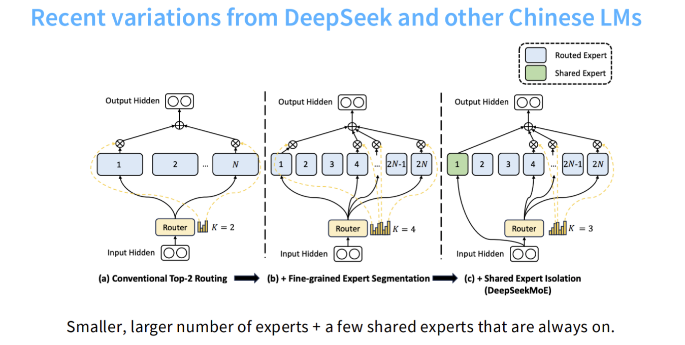

中国的大模型团队（特别是DeepSeek）对MoE架构进行了重要的创新，提出了DeepSeekMoE架构。

核心创新：共享专家 + 细粒度专家 (Shared + Fine-grained Experts)

1. 细粒度专家切分 (Fine-grained Segmentation)：
    * 将原本的"大专家"切分成许多"小专家"（例如将1个大专家切成4个）。
    * 目的：在保持激活参数量不变的情况下，增加专家的总数量，得到更灵活的专家选择，实现更精细的知识分配。

2. 共享专家隔离 (Shared Expert Isolation)：
    * 设立专门的共享专家（Shared Experts），这些专家总是被激活。
    * 目的：共享专家负责捕获通用的、所有Token都需要的知识（如语法），而路由专家负责专业知识。这避免了在不同专家中重复学习通用知识的冗余。

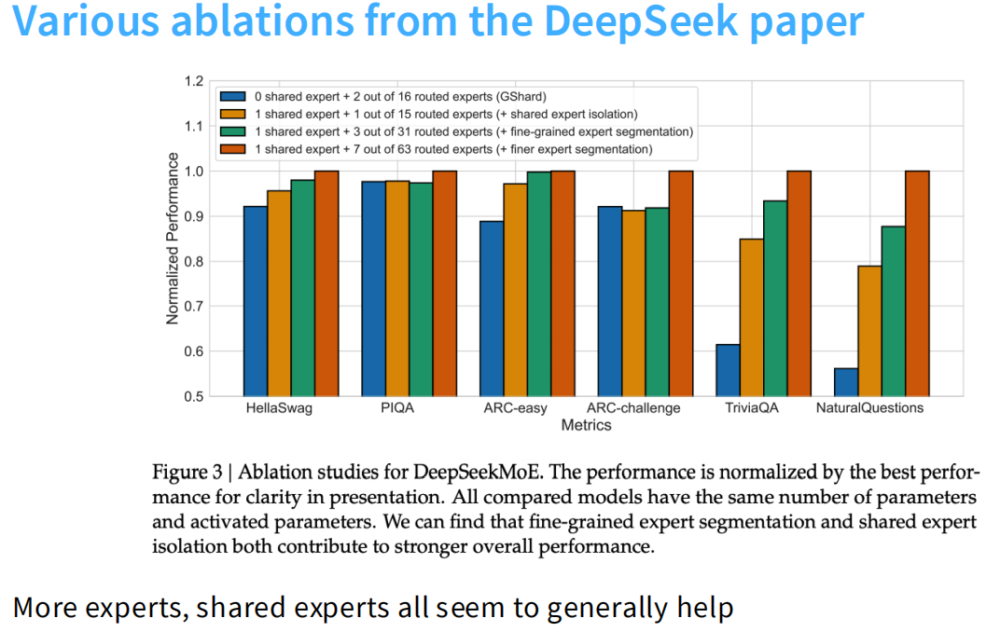

如图所示，deepseek-moe对共享专家隔离和细粒度专家分割做了消融实验。

- 对比蓝色（GShard 传统架构）与橙色柱子，可以看到引入1个共享专家后，模型在所有指标（如HellaSwag、TriviaQA等）上都有提升。共享专家负责捕获通用的公共知识，减少路由专家之间的知识冗余。
- 对比橙色、绿色和红色柱子，可以发现将专家分割得越细（例如从15个路由专家细化到63个），模型的归一化性能（Normalized Performance）越强。更细粒度的专家允许模型进行更灵活、更精确的知识组合。

这段代码展示了DeepSeekMoE层的核心逻辑：同时计算“共享专家”和“路由专家”的输出，并将它们相加。

```python
import torch
import torch.nn as nn
import torch.nn.functional as F

class DeepSeekMoE(nn.Module):
    def __init__(self, hidden_dim, num_routed_experts, num_shared_experts, top_k):
        super().__init__()
        self.top_k = top_k
        
        # 1. 路由层 (Router): 只决定"路由专家"的选择
        self.router = nn.Linear(hidden_dim, num_routed_experts)
        
        # 2. 路由专家 (Routed Experts): 细粒度的小专家
        self.routed_experts = nn.ModuleList([
            nn.Sequential(nn.Linear(hidden_dim, hidden_dim), nn.ReLU())
            for _ in range(num_routed_experts)
        ])
        
        # 3. 共享专家 (Shared Experts): 总是被激活，捕获通用知识
        self.shared_experts = nn.ModuleList([
            nn.Sequential(nn.Linear(hidden_dim, hidden_dim), nn.ReLU())
            for _ in range(num_shared_experts)
        ])

    def forward(self, x):
        # x shape: [batch, seq, dim]
        
        # --- A. 计算共享专家输出 (Always Active) ---
        shared_output = 0
        for expert in self.shared_experts:
            shared_output += expert(x)
        
        # --- B. 计算路由专家输出 (Top-K Selected) ---
        # B1. 路由打分
        logits = self.router(x)
        
        # B2. 选Top-K (DeepSeek V2/V3风格: 先TopK后Softmax)
        topk_logits, topk_indices = torch.topk(logits, k=self.top_k, dim=-1)
        topk_weights = F.softmax(topk_logits, dim=-1)
        
        # B3. 执行选中的专家 (简化演示，实际通常用高效的CUDA kernel)
        routed_output = torch.zeros_like(x)
        for i, expert in enumerate(self.routed_experts):
            # 找到选中当前专家i的token
            # mask: [batch, seq, k] -> [batch, seq] (any)
            mask = (topk_indices == i).any(dim=-1)
            
            if mask.any():
                # 提取token计算并加权
                # 注意：这里简化了gather/scatter操作，只展示逻辑
                expert_out = expert(x[mask])
                
                # 获取对应的权重 (简化逻辑)
                # 实际需匹配token在topk中的位置来获取weight
                # ... (省略复杂的索引对齐代码) ...
                
                # 简单累加演示
                routed_output[mask] += expert_out # * weight
        
        # --- C. 最终融合 ---
        # Output = Shared_Output + Routed_Output
        # (通常外部还有一个残差连接: x + output)
        return shared_output + routed_output

# --- 模拟使用 ---
# 假设: 64个路由专家选2个，同时有1个共享专家
moe = DeepSeekMoE(hidden_dim=128, num_routed_experts=64, num_shared_experts=1, top_k=2)
x = torch.randn(2, 5, 128)
output = moe(x)

print(f"Input shape: {x.shape}")
print(f"Output shape: {output.shape}") # [2, 5, 128]
```

### How do we train MoEs?

训练MoE比训练普通模型要难得多。
- 不可微问题： 神经网络通常靠“梯度下降”来学习，这要求每一个步骤都是平滑可导的。但MoE的路由（Router）做的是“选择题”（选专家A还是B），这是一个离散的动作，梯度很难传回来。
- “偏科”问题（负载不均衡）： 如果不管它，Router会变得非常“偷懒”。它一旦发现专家A稍微强一点，就会把所有 Token都发给A。结果就是专家A累死（显存爆了），专家 B 闲死（没学到东西）。这会导致模型“坍塌”，效果变差。

为了解决这些问题，PDF中主要介绍了以下几种关键技术方案：

---

#### 1. 核心挑战：负载均衡 (The Load Balancing Problem)

为了解决MoE训练中的负载不均衡问题，业界最常用的方法是引入辅助损失（Auxiliary Loss）。

方案A: 传统的辅助负载均衡损失 (Heuristic Balancing Losses)
这是Switch Transformer和大多数早期MoE（如Mixtral, Grok, DeepSeek V1/V2）使用的标准方法。

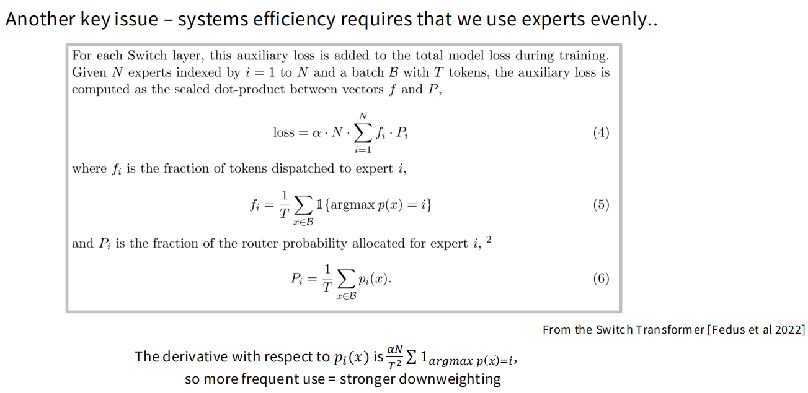

* 目标：强制Router均匀分配Token。
* 公式：

$$
Loss = \alpha \cdot N \cdot \sum_{i=1}^{N} f_i \cdot P_i
$$
    
### 解释什么是 $f_i$

$$
f_i = \frac{1}{T} \sum_{x \in B} \mathbb{1}\{\text{argmax } p(x) = i\}
$$

这个 $f_i$ 代表的是在当前 batch（包含 $T$ 个 token）中，**真正被分配给第 $i$ 个专家的 token 比例**。里面用到了指示函数 $\mathbb{1}$ 和 $\text{argmax}$，这是一个硬分配（hard routing）过程。因为包含了 $\text{argmax}$，这个操作是不可导的。

对应在代码中的实现：
```python
# topk_indices shape: [batch_size * seq_len, top_k] 
# view(-1) shape: [total_tokens] (假设 total_tokens = batch_size * seq_len * top_k)
# mask shape: [total_tokens, num_experts]
mask = F.one_hot(topk_indices.view(-1), num_classes=self.num_experts).float()

# 统计每个专家得到了多少张票，除以总票数 (或总Token数)
# f shape: [num_experts]
f = mask.sum(dim=0) / total_tokens
```

### 解释什么是 $P_i$

$$
P_i = \frac{1}{T} \sum_{x \in B} p_i(x)
$$

这个 $P_i$ 代表的是路由网络输出的 softmax 概率分布中，**分配给第 $i$ 个专家的平均概率**。由于它是纯粹的概率求和，所以它是平滑且可导的。

对应在代码中的实现：
```python
# router_probs shape: [total_tokens, num_experts]; P shape: [num_experts]
P = router_probs.mean(dim=0)
```

### 为什么把 $f_i$ 和 $P_i$ 乘起来就能实现负载均衡呢？

当所有 $f_i$ 和 $P_i$ 都等于 $1/N$（也就是绝对均匀分配）时，这个点积之和 $\sum f_i P_i$ 能取到最小值 $1/N$。再乘以公式最前面的 $N$，最低的辅助损失（忽略 $\alpha$ 前提下）就是 $1$。如果某个专家被过度使用，它的 $f_i$ 和 $P_i$ 都会变得很大（趋近于 $1$），这会导致辅助损失急剧上升。

**举个例子（假设有 4 个专家，即 $N=4$）：**

* **极端不均匀分配：**
  假设所有 token 都被分配给了第一个专家，那么：
  - $f = [1, 0, 0, 0]$
  - $P = [1, 0, 0, 0]$
  - 点积之和 $\sum f_i P_i = 1 \times 1 + 0 + 0 + 0 = 1$ （达到最大值）
  - 最终的 $Loss \propto N \times \sum f_i P_i = 4 \times 1 = 4$（比较大）。

* **绝对均匀分配：**
  假设 token 被均匀地分配给了 4 个专家，那么：
  - $f = [0.25, 0.25, 0.25, 0.25]$
  - $P = [0.25, 0.25, 0.25, 0.25]$
  - 点积之和 $\sum f_i P_i = 4 \times (0.25 \times 0.25) = 0.25$ （达到最小值 $1/N$）
  - 最终的 $Loss \propto N \times \sum f_i P_i = 4 \times 0.25 = 1$（比较小）。

**结论**：最小化这个辅助损失，本质上是利用梯度下降机制，惩罚路由策略中出现的极端倾斜分布。通过迫使模型最小化 $\sum f_i P_i$ 点积，约束 Router 避免将绝大多数 token 集中分配给少数几个特定的专家，从而引导 Router 学习到一个更接近均匀分布 ($1/N$) 的路由策略，最终实现各专家负载均衡的目标。

在代码中的最终体现为：
```python
# P shape: [num_experts], f shape: [num_experts]
# 这里 alpha 设为 0.01 (常见的超参数)
aux_loss = 0.01 * self.num_experts * torch.sum(P * f)
```

方案B: DeepSeek V2的改进 (Device-Level Balancing)
除了专家级别的平衡，DeepSeek V2还引入了设备级别（Device-Level）的平衡损失。
* 原因：在多机训练中，即使专家负载平衡了，如果某些机器上的专家特别热门，也会导致机器间的通信堵塞。
* 做法：增加一个损失项，确保Token被均匀地发送到不同的GPU设备上。

---

#### 2. DeepSeek V3的新范式：无辅助损失负载均衡 (Auxiliary-loss-free Balancing)

虽然辅助损失解决了崩塌问题，但它有一个副作用：**辅助损失和语言模型的主任务损失之间存在冲突,它会干扰模型的主任务（预测下一个词）**。因为Router被迫去"凑数"满足均匀分布，而不是纯粹为了预测准确。

为了解决这个问题，DeepSeek-V3 完全抛弃了辅助损失，转而采用一种基于动态偏置 (Dynamic Bias) 的路由机制。具体原理如下：

1. **动态偏置项的引入**：在计算路由概率时，系统会为每个专家维护一个独立的偏置项 $b_i$。当计算出 token 与各专家的基础匹配分数 $s_{i,t}$ 后，会把这个偏置项加到分数上，然后再进行 top-k 选择。

$$
s'_{i,t} = \begin{cases} s_{i,t}, & \text{if } s_{i,t} + b_i \in \text{TopK} \\ 0, & \text{otherwise} \end{cases}
$$

2. **偏置项的动态更新**：这个偏置项不是通过常规的梯度下降更新的，而是根据每个专家在训练过程中的实际负载情况进行动态调整。如果在最近的几个训练步中，某个专家分配到的 token 数量超过了设定的阈值，系统就会主动调低该专家的偏置项；反之，如果某个专家很闲置，系统就会调高它的偏置项。

3. **路由与更新的分离**：在实际分发 token 时，路由网络使用的是加上偏置项后的分数来决定 top-k。但是在计算路由网络的梯度时，反向传播依然只基于原始的匹配分数，不包含偏置项。这种做法的好处是，Bias 不会产生额外的梯度去“污染”模型的主参数更新。

* **补充措施 (Sequence-Wise Loss)**：
    为了防止在单条序列内出现极端不平衡，DeepSeek V3 还是保留了一个微弱的序列级互补损失 (Complementary Sequence-Wise Auxiliary Loss)。

---

#### 3. 去掉负载均衡loss后会发生什么？

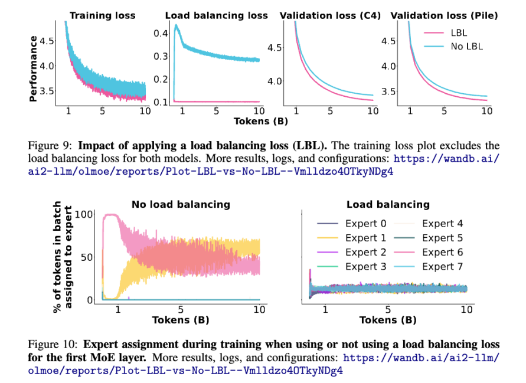

如图所示，如果不加任何约束，MoE模型会发生路由崩溃现象，也就是赢家通吃的局面。

- 训练初期，某几个特定的专家几乎抢占了所有的Token，导致其他大部分专家处于失业状态，接收到的Token极少。
- 这种不平衡直接导致了模型性能下降。验证集Loss明显更高，性能更差。其本质原因是，当路由崩溃时，MoE模型实际上退化成了一个参数量很小的稠密模型，因为只有极少数专家在干活，其他专家的参数没有被有效利用，浪费了大量的显存去存储那些从不被激活的参数。

### Fun side view: stochasticity of MoE models

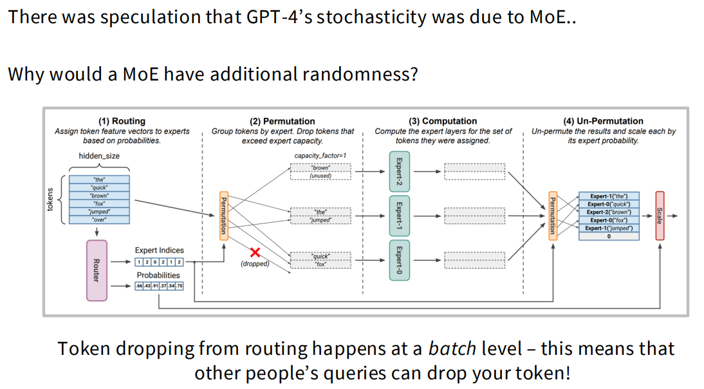

#### 核心观点

通常我们认为，如果将生成模型的`temperature`设为 0，输出应该是完全确定的。但在MoE模型（如GPT-4的早期推测版本）中，由于Token丢弃（Token Dropping）机制的存在，模型表现出了随机性 。这种随机性并非来自模型参数本身的波动，而是来自同一批次（Batch）中其他数据的干扰 。

#### 详细流程解析 (Image Walkthrough)
这张图展示了MoE模型处理一个批次数据的完整生命周期，分为四个关键步骤：

1. Routing（路由分配）
模型接收一个批次（Batch）的Token（例如"the", "quick", "brown"等）。Router（路由器）计算每个Token与各个专家的匹配度（概率），并决定每个Token应该去哪个专家。例如，图中Token "brown"被分配给Expert 0，而"quick", "fox", "over"都想去Expert 2。

2. Permutation（重排与丢弃）——随机性的发生地
系统根据路由结果将Token分组。
容量限制（Capacity Factor）：每个专家在单次计算中能处理的Token数量是有限的（图中设定为每个专家最多处理2个Token）。
丢弃（Dropping）：如果分配给某个专家的Token数量超过了容量，多余的Token就会被直接丢弃。
案例：在图中，有3个Token ("quick", "fox", "over")都想去Expert 2，但Expert 2只有2个座位。结果，"fox"被不幸丢弃（dropped），没有进入计算流程。

3. Computation（专家计算）
各个专家并行处理它们接收到的Token。Expert 0处理"brown"；Expert 1处理"the", "jumped"；Expert 2处理"quick", "over"。注意：被丢弃的"fox"没有被任何专家处理。

4. Un-Permutation（还原与缩放）
计算完成后，Token被还原回原来的顺序。
后果：由于"fox"在第2步被丢弃，它在这一步对应的值可能为0或未被更新（图中显示对应的向量似乎没有经过有效变换），这意味着模型对这个词的处理失效了，进而影响最终的生成结果。

#### MOE随机性的结论

MoE模型的随机性本质上是资源竞争的结果。
* 你的Token能否被处理，取决于和你一起拼单（Batch）的其他人在问什么。
* 如果同一个Batch里有大量Token都在竞争同一个专家，就会导致部分Token被丢弃。因此，即使输入相同，只要Batch里的“邻居”不同，输出结果就可能不同。


### Issues with MoEs

MoE模型虽然强大，但在实际训练和微调时面临两个非常棘手的问题：训练稳定性(Training Stability)和微调困难(Fine-tuning issues)。

#### 训练稳定性 (Training Stability)

MoE模型以"难训练"著称，其训练损失(Training Loss)曲线经常会出现剧烈的震荡甚至发散(Loss突然冲高，模型废了)。

- 根本原因：指数函数与低精度的冲突
    * Softmax的敏感性：MoE的路由(Router)决定Token去哪个专家时，使用的是Softmax函数。Softmax内部包含指数运算($e^x$)。
    * 指数放大的蝴蝶效应：指数函数增长极快。如果输入的数值(Logits)稍微大一点，$e^x$就会变得巨大。
    * 硬件的精度限制：现代训练通常使用`bfloat16`(半精度浮点数)来加速。`bfloat16`的精度较低。在`bfloat16`下，即使是微小的舍入误差(比如0.5的差距)，经过e^x放大后，会导致Softmax的输出发生巨大偏差(文档中提到偏差可达36%)。

- 解决方案：Router Z-loss
    * 原理：惩罚过大的Logits值，强制Router输出的数值保持在一个较小的范围内。
    * 效果：极大地提升了训练稳定性。讲义中指出，建议在Router部分使用`float32`精度，并配合Z-loss使用。

$$
L_z(x) = \frac{1}{B} \sum_{i=1}^{B} (\log \sum_{j=1}^{N} e^{x_j})^2
$$

#### 微调困难 (Fine-tuning issues)

这是MoE模型在落地应用时最大的痛点。虽然MoE在预训练(Pre-training)时看大量数据效果很好，但在指令微调(SFT)阶段往往表现不如稠密模型(Dense Model)。

**MoE模型微调的核心痛点：过拟合与容量失配**

MoE模型在微调阶段面临的最大挑战是**严重的过拟合问题**。这本质上是由模型庞大的参数容量与稀缺的指令微调（SFT）数据之间的极度不匹配造成的：

1.  **容量陷阱导致死记硬背**
    MoE模型每次前向传播虽只激活少部分参数，但总参数量极其庞大。在预训练阶段，海量的无监督数据足以填满这些网络。然而，SFT的高质量数据通常只有几万到几十万条。当用极小规模的数据去更新千亿级别的巨型模型时，模型会凭借富余的参数容量瞬间“死记硬背”下训练集的输入输出映射，而不是去理解底层的通用逻辑，导致在未见过的任务上泛化能力暴跌。

2.  **局部专家过度拟合与失衡**
    在微调数据分布相对局限的情况下，门控网络（Router）极易将特定类型的Token持续路由给少数几个固定的专家。这些被频繁激活的专家在小数据集上被反复更新，会迅速对微调数据的特定特征产生严重的过拟合。这种负载失衡会直接破坏预训练阶段积累的通用表征能力。

**应对策略：数据扩增与解耦微调**

针对上述现象，目前的业界实践主要分为“喂饱模型”和“限制/解耦参数更新”两个核心方向：

**方向一：数据量级碾压（Data Scaling）**
既然模型容量记住了少量数据，最直接的解法就是**成十倍上百倍地增加SFT的数据量和数据多样性**。例如DeepSeek V3在SFT阶段使用了高达150万（1.5M）条数据，用海量且丰富的数据强迫各个专家去学习泛化特征，从而打破局部记忆效应。

**方向二：参数高效与渐进式解耦微调（Decoupled & Progressive Tuning）**
在数据量受限的情况下，必须强行减少微调阶段模型的可变容量或控制更新节奏，稳定训练过程。具体包含以下几种高频工程实践：

*   引入LoRA等PEFT技术：不更新全量参数，而是通过在专家网络（甚至Router）中注入低秩矩阵，大幅压缩微调阶段的可学习变量。
*   策略 A：先冻结专家，再联合微调（渐进式）
    *   阶段一（仅微调Router）：冻结所有专家权重，只让Router学习如何将SFT特有的对话模板和指令特征，精准分发给具备相应知识的预训练专家。这能最大程度保护预训练的“世界知识”。
    *   阶段二（联合微调）：Router适应新分布后，解冻专家进行极小学习率的全局微调，让专家专注于对齐人类指令和语气。
*   策略 B：冻结Router，仅微调专家（强稳定方案）
    *   经过海量预训练的Router已具备极其稳健的特征聚类直觉。冻结Router可以强制保留这种底层的特征分发逻辑，确保相似语义始终流向同一专家。此时仅开放专家网络去学习指令遵循，能极大维持模型的泛化能力，且有效避免“路由坍塌”。

### Other training methods: upcycling

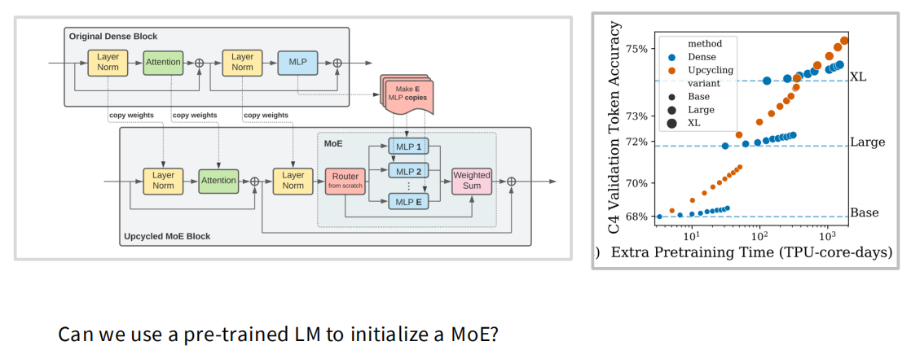

简单来说，它的核心意思是：我们不需要从零开始（From Scratch）训练一个MoE模型，我们可以拿一个已经训练好的“普通模型（Dense）”，把它“改装”成MoE模型，效果非常好且省钱。

#### 1. 具体做法

左图中这部分展示了如何把一个普通的Dense Block (稠密模块) 变成一个MoE Block (混合专家模块)。

- 全盘继承 (Copy Weights)：原本已经训练好的 Attention (注意力层) 和 Layer Norm (归一化层) 的参数，是直接复制过来的。这意味着 MoE 模型一开始就继承了原模型的语言理解能力。
- 分身术 (Make E MLP copies)：这是最核心的一步。原模型里只有一个MLP (前馈网络)。在改装时，研究人员把这一个MLP复制了E份（比如复制8份或60份）。这E份副本就变成了初始的 Experts (专家)。这意味着每个专家一开始都会做原本那个MLP能做的事情。
- 新增部件：唯一需要从零开始 (from scratch) 训练的只有红色的Router (路由器)。它需要学习如何指挥这些“克隆专家”在未来的训练中逐渐分化，各司其职。

#### 2. 优势

看右图橙色曲线的斜率，它上升得极快。这意味着：通过Upcycling，你可以用极短的训练时间，就让一个Base基础的模型，性能迅速飙升，达到甚至超过从头训练的Large或XL模型的水平。

### Deepseek MoE v1-v2-v3

#### Deepseek MoE V1
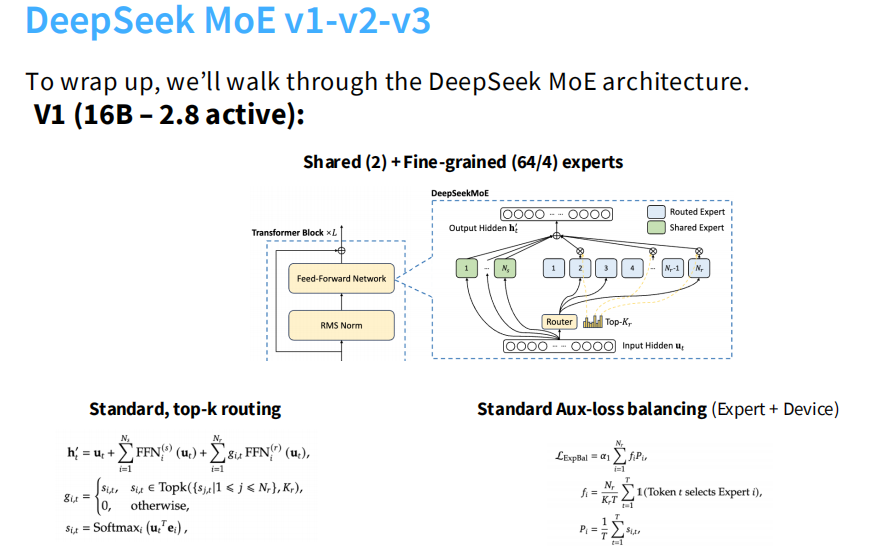

- DeepSeek MoE v1（即 DeepSeekMoE 16B 模型）的核心创新在于它提出了一种全新的 MoE 架构设计思路：“细粒度专家 + 共享专家” (Fine-grained + Shared Experts)
- DeepSeek MoE v1的总参数量是16B，激活参数量是2.8B。
- 在V1阶段，DeepSeek还没有使用后来V3那种无辅助损失（Aux-loss-free）的策略，而是使用了标准的辅助损失平衡 (Standard Aux-loss balancing)。**它同时考虑了专家级别 (Expert-level) 和 设备级别 (Device-level) 的负载均衡，以确保训练时不会出现某些专家过劳、某些专家饿死的情况 。**

#### Deepseek MoE V2
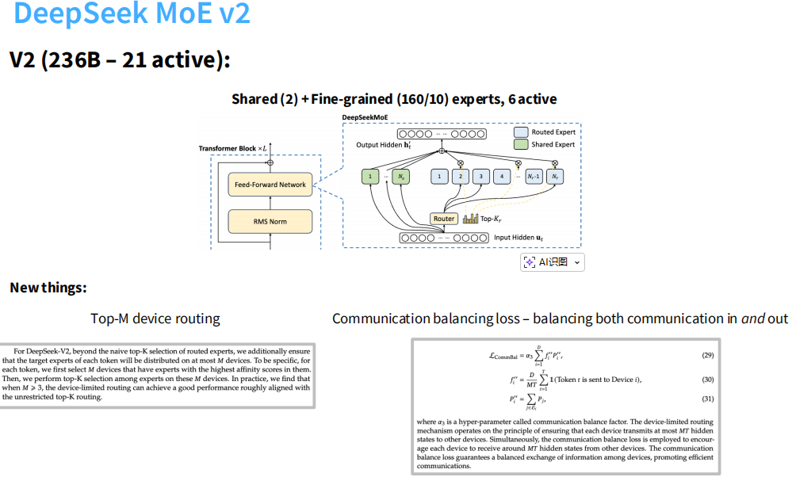

DeepSeek-V2 在 V1 的架构基础上进行了进一步扩展和系统级优化，以适应更大规模的参数和分布式训练需求。
- 参数量大幅提升： 总参数量达到 236B（2360亿），但激活参数量控制在 21B（210亿） 。这使得它拥有巨大的模型容量，同时保持了相对较低的推理成本。
- 更细粒度的专家划分：
    * 共享专家 (Shared Experts)： 依然保留了2个共享专家，负责处理通用知识，它们总是被激活。
    * 路由专家 (Routed Experts)： 数量增加到了160个（相比 V1 的 64 个更细碎），每次从中选择6个进行激活。
- DeepSeek-V2 的最大改进在于引入了针对大规模分布式训练的通信优化机制，主要包含两个方面：
    * Top-M Device Routing (设备级路由)：在大规模集群中，160 个专家分布在很多不同的显卡（Device）上。如果只是简单地选Top-K专家，一个Token可能需要飞向很多张不同的显卡，导致网络通信压力过大。对于每个Token，首先筛选出亲和度最高的M个设备（通常 M=3）。仅在这M个设备内部，选择得分最高的Top-K个专家 。
    * Communication Balancing Loss (通信平衡损失)：为了配合设备级路由，DeepSeek-V2引入了额外的辅助损失函数，不仅平衡专家负载，还专门平衡设备间的通信流量。该损失函数确保每个设备发送出去的数据量和接收到的数据量是均衡的，防止出现某些设备网络拥堵而其他设备空闲的情况，从而提升整体集群的训练效率 。

#### Deepseek MoE V3
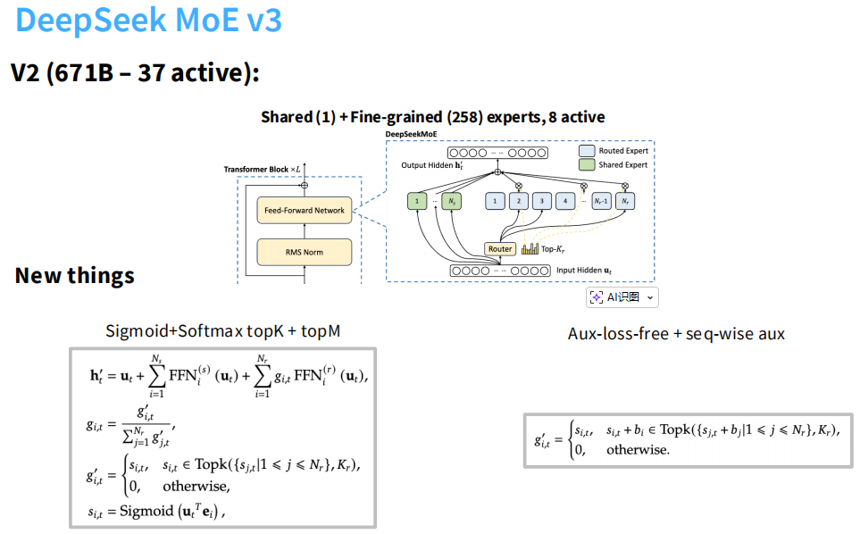

DeepSeek-V3是MoE的集大成者。它不仅在MoE架构上进一步扩大了规模和细粒度，还引入了两个非MoE的核心技术（MLA和MTP）来极致压缩推理成本。

- 规模与专家配置(Scale & Experts)
    V3的体量比V2翻了近3倍，达到了671B（6710亿）参数，但它的“激活参数”依然控制在37B，保证了推理效率。
    * 共享专家 (Shared)： 减少到1个（V2是2个）。
    * 路由专家 (Routed)： 增加到256个（V2是160 个）。
    * 激活数量： 每次选择8个专家进行计算 。
    * 路由算法升级：使用Sigmoid替换Softmax计算专家的亲和力得分，让每个专家都能被独立评估，避免了强行拉开专家差距的零和竞争，最后通过局部归一化实现更精准的权重分配。

- 核心创新一：无辅助损失负载均衡 (Aux-loss-free Balancing)

    痛点：传统的MoE为了防止某个专家过载，会加一个很重的“辅助损失 (Aux loss)”来强行惩罚负载不均。但这会干扰模型原本的学习目标（Main Loss），导致模型性能下降。V3的解法：

    * 去掉辅助损失： 它可以说是“裸奔”，不再依赖强辅助损失。
    * 动态偏置 (Bias)： 它给每个专家设了一个Bias (偏置项 $b_i$)。如果某个专家太忙，就降低它的Bias，让它很难被选中；如果太闲，就提高Bias。这个过程是动态调整的。
    * 结果： 既实现了负载均衡，又没有干扰模型学习知识，性能更强。

- 核心创新二：MLA (多头潜在注意力)

    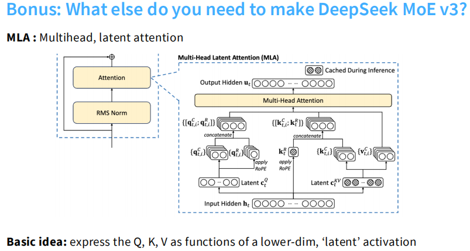
    
    这是V3为了省显存而做的“魔改”注意力机制（非MoE特有，但V3采用了）。

    * 在长文本推理中，KV Cache（键值缓存）非常占显存。

    * MLA (Multi-Head Latent Attention) 的核心思想主要包含两点：一是**低秩键值联合压缩 (Low-Rank Key-Value Joint Compression)**，即不直接存巨大的全维度 KV 矩阵，而是把 KV 联合压缩成一个低维度的潜在向量 ($C_{KV}$) 存入 Cache；二是**解耦的旋转位置编码 (Decoupled RoPE)**，专门分离出一路极小的低维向量用于携带精确的位置信息。具体的话，可以参考 [AttentionVariants.md](../lecture03_architectures/AttentionVariants.md) 这个文档。

- 核心创新三：MTP (多 Token 预测)

    传统的大语言模型（LLM）训练主要基于“预测下一个词”（Next Token Prediction），即根据之前的词汇预测紧接着的下一个词。而 DeepSeek-V3 的 MTP (Multi-Token Prediction) 机制则要求模型在训练时同时预测未来的多个词。

    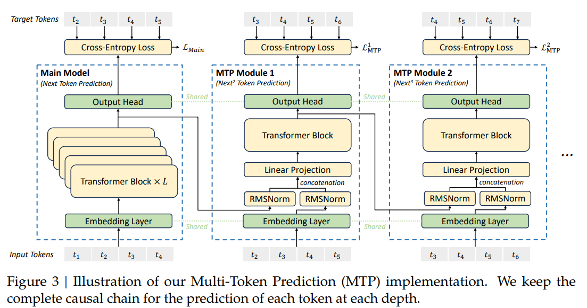

    结合架构图，可以详细拆解 DeepSeek-V3 的 MTP 是如何工作的：

    #### 1. 核心架构拆解
    从图中可以看出，整个 MTP 架构由一个主模型（Main Model）和若干个串联的 MTP 模块（MTP Modules）组成：

    *   主模型 (Main Model - Next Token Prediction): 这就是我们熟悉的传统大模型结构。输入一组 Token（如 $t_1, t_2, t_3, t_4$），经过 Embedding 层、多层 Transformer Blocks，最后由 Output Head 预测下一个 Token 的概率分布，并计算交叉熵损失。它的目标是预测 $t_2, t_3, t_4, t_5$。
    *   MTP 模块 1 (MTP Module 1 - $Next^2$ Token Prediction): 这个模块的任务是预测“下下个词”。它的巧妙之处在于其输入机制：它提取了主模型的最终隐藏状态（进入 Output Head 之前的数据），将其与当前目标词 ($t_2, t_3\dots$) 的 Embedding 进行拼接（Concatenation）。经过 RMSNorm 和线性投影（Linear Projection）融合后，送入一个额外的 Transformer Block，最后预测出 $t_3, t_4, t_5, t_6$。对应的损失为 $\mathcal{L}_{MTP}^1$。
    *   MTP 模块 2 (MTP Module 2 - $Next^3$ Token Prediction): 依次类推，预测“下下下个词”。它接收 MTP 模块 1 的隐藏状态和下一个词的 Embedding，预测 $t_4, t_5, t_6, t_7$，计算损失 $\mathcal{L}_{MTP}^2$。

    #### 2. 关键设计亮点
    *   **保留完整的因果链 (Causal Chain)**: 图下方的说明特别强调了这一点。MTP 模块在预测未来第 $k$ 个词时，利用了前 $k-1$ 个真实词的信息（通过拼接 Embedding）。这使得多词预测不是盲目瞎猜，而是严格遵循文本的因果逻辑。
    *   **参数共享机制 (Shared Parameters)**: 图中绿色的虚线清晰地标明了 Shared。Embedding Layer（词嵌入层）和 Output Head（输出头/词表投影层）在主模型和所有的 MTP 模块之间是完全共享的。这不仅大幅节省了显存参数，还有效地对模型进行了正则化。
    *   **损失计算与权重 (Loss Calculation)**: MTP 模块在每一个预测深度都会独立计算一个交叉熵损失。最终的 MTP 损失 $\mathcal{L}_{MTP}$ 是所有深度损失的平均值，乘以一个权重因子 $\lambda$，作为额外的损失项加到主模型中。在训练的前 10T tokens 中，lambda 设为 0.3；在最后的 4.8T tokens 中，lambda 降为 0.1。

    #### 3. 推理阶段 (Inference Phase)
    MTP 最强大的地方在于它极高的灵活性。模型训练完成后，在实际部署和推理时，可以根据需求选择两种完全不同的使用方式：
    
    *   方式一：常规推理（直接丢弃 MTP）

        由于 MTP 的主要目的是为了在训练时给主模型提供更密集的学习信号，所以在常规的自回归推理中，可以直接丢弃所有的 MTP 模块。丢弃后，主模型依然可以完全独立、正常地工作，这就意味着 MTP 机制在带来性能提升的同时，没有任何额外的常规推理开销。
        
    *   方式二：投机解码加速（保留 MTP 作草稿）

        如果想追求极致的生成速度，可以将 MTP 模块保留下来，无缝切换为投机解码（Speculative Decoding）。

        3. MTP 在推理时如何实现“投机解码”？

        在推理阶段，MTP 模块就化身为了那个“完美的草拟模型”。具体流程分为两步：

        第一步：极速草拟 (Drafting)

        当主模型生成了当前 Token $x_t$ 以及其对应的隐状态 (Hidden State) 后，主模型就暂时“休息”了。接下来的活儿交给轻量级的 MTP 模块：

        *   MTP 模块 1：接收主模型的隐状态和新生成的 $x_t$ 的 Embedding，通过它那一层薄薄的 Transformer，极速预测出下一个 Token $x_{t+1}$
        *   MTP 模块 2：接着接收 MTP 模块 1 的隐状态和 $x_{t+1}$ 的 Embedding，极速预测出 $x_{t+2}$
        *   以此类推，迅速生成一个长度为 $D$ 的草稿序列

        为什么快？因为主模型有几十上百层 Transformer，而一个 MTP 模块只有 1 层！生成这个草稿的计算量对于 GPU 来说微乎其微。

        第二步：同源验证 (Verification)

        拿到了长度为 $D$ 的草稿后，主模型重新“苏醒”。

        *   主模型将这 $D$ 个 Draft Tokens 作为输入，执行一次并行的前向传播 (Forward Pass)。
        *   主模型计算出这 $D$ 个位置的真实概率分布，并与草稿进行比对。
        *   如果 MTP 猜对了，直接采纳；如果猜到第 $m$ 个 Token 错了，就从错误的地方截断，用主模型的输出作为正确结果，并丢弃后面的草稿。

        因为 MTP 模块和主模型共享了底层的表征（同源），它的草稿接受率（Acceptance Rate）非常高（例如预测第二个词的接受率稳定在 85% 到 90% 之间）。这种极高的接受率结合高效的草拟验证机制，使得 DeepSeek-V3 能够显著加快解码速度，将整体的生成速度（Tokens Per Second）提升到了原来的 1.8 倍。

    