# GPUs

## 目录
- [GPUs in depth: how they work and important parts](#gpus-in-depth-how-they-work-and-important-parts)
  - [How is GPU different from a CPU?](#how-is-gpu-different-from-a-cpu)
  - [Anatomy of a GPU(execution units)](#anatomy-of-a-gpuexecution-units)
  - [Anatomy of a GPU (Memory Hierarchy)](#anatomy-of-a-gpu-memory-hierarchy)
  - [Execution model of a GPU](#execution-model-of-a-gpu)
  - [Memory model of a GPU](#memory-model-of-a-gpu)
  - [Strengths of the GPU model](#strengths-of-the-gpu-model)
- [How do we get GPUs faster](#how-do-we-get-gpus-faster)
  - [Low precision computation](#low-precision-computation)
  - [Operator fusion](#operator-fusion)
  - [Recomputation](#recomputation)
  - [Coalescing memory](#coalescing-memory)
  - [Tiling](#tiling)
- [Putting it together: unpacking FlashAttention](#putting-it-together-unpacking-flashattention)

## GPUs in depth: how they work and important parts

### How is GPU different from a CPU?

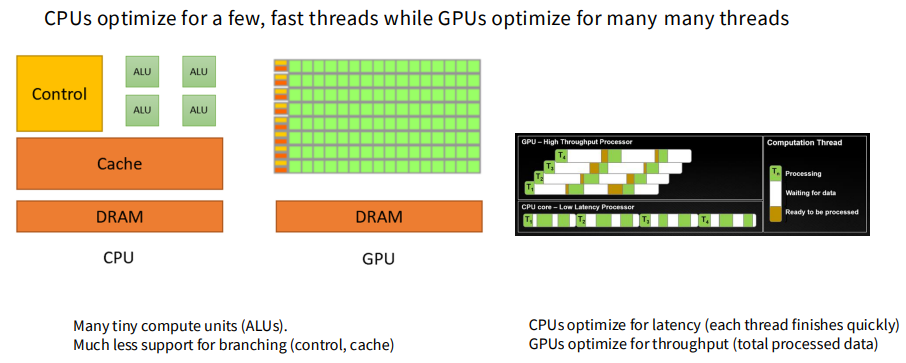

这张图片直观地对比了CPU（中央处理器）和GPU（图形处理器）在设计哲学和硬件架构上的根本差异。核心区别在于：CPU针对低延迟（Latency）进行了优化，而GPU针对高吞吐量（Throughput）进行了优化。

> 硬件架构差异

CPU (Low Latency Processor):
- 设计特点：如图所示，CPU分配了大量的芯片面积给Control（控制单元）和Cache（缓存），而ALU（算术逻辑单元）相对较少且较弱。
- 目的：
  - Control：用于复杂的逻辑控制，如分支预测（Branch Prediction）和乱序执行（Out-of-order execution），旨在处理复杂的串行指令流和条件跳转。
  - Cache：巨大的缓存旨在减少从DRAM获取数据的延迟，确保单列线程能以最快速度完成。
- 适用场景：逻辑复杂、依赖性强、分支跳转频繁的串行任务（如操作系统、通用应用程序）。

GPU (High Throughput Processor):
- 设计特点：GPU将绝大部分晶体管用于ALU（图中密集的绿色小方块），牺牲了Control和Cache的面积。
- 目的：
  - Massive Parallelism：拥有成千上万个小型计算核心，能够同时处理海量数据。
  - 弱分支支持：由于Control单元精简，GPU不擅长处理复杂的if-else跳转（这会导致Control Divergence），更适合执行单一指令多数据（SIMT）的任务。
- 适用场景：数据并行（Data Parallelism）任务，如深度学习中的矩阵乘法、图形渲染。

> 执行模型与延迟隐藏

右侧的时间轴图解展示了两者在处理任务时的策略差异：

CPU Core (Low Latency):
- 关注点：让单个任务（绿色块）尽可能快地完成。
- 瓶颈：当线程遇到内存请求（Waiting for data，白色块）时，虽然CPU试图通过大缓存来减少等待，但如果未命中时，核心可能会处于停滞状态或依赖超线程技术，其并发切换能力不如GPU灵活。

GPU (High Throughput):
- 关注点：在单位时间内完成尽可能多的总任务量，而不是单个任务的速度。
- 延迟隐藏(Latency Hiding):
  - 图中的T1、T2、T3、T4代表不同的线程。
  - 当线程T1需要读取内存（进入白色"Waiting for data"状态）时，GPU的硬件调度器会以极低的开销瞬间切换到准备好的线程T2或T3进行计算（绿色"Processing"状态）。
  - 结果：虽然单个线程的执行时间（Latency）可能很长（包含大量等待时间），但计算单元（ALU）始终在忙碌，从而实现了极高的系统吞吐量。

### Anatomy of a GPU(execution units)

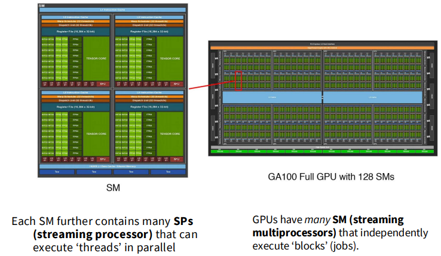

GPU能够处理海量并行数据的秘诀在于其分层的执行架构。从芯片级别的宏观设计到单个计算单元的微观细节，每一层都精心设计以最大化并行性。

> 1. 宏观层级：Full GPU (右图)
* 结构：右图展示了完整的GPU芯片（Die）布局。可以清晰地看到芯片被划分为多个重复的模块。
* SM (Streaming Multiprocessor)：图中标注GA100拥有128个SM。SM是GPU的核心构建模块。
* 并行逻辑：在CUDA编程模型中，Grid被划分为多个Block（线程块），这些Block就是被分配到这128个独立的SM上并行执行的。这种设计允许GPU轻松扩展：增加更多的SM就能处理更多的Block。

> 2. 微观层级：SM内部详解 (左图)
左图是对右图中红色方框选中的单个SM的放大视图。一个SM内部就是一个微型的、功能完备的并行处理器：

* 核心计算单元 (Compute Units)：
    * Tensor Cores：图中右侧巨大的绿色矩形块。这是专门为深度学习设计的ASIC单元，用于在一个时钟周期内完成矩阵乘法累加运算（D = A * B + C），是AI推理和训练速度的核心来源。
    * CUDA Cores (SPs)：图中左侧密集的小方块（FP32, INT32, FP64）。它们被称为SP (Streaming Processor)。每个SM包含大量SP，负责执行通用的浮点和整数运算。
    * SFU (Special Function Units)：用于执行特殊数学函数（如sin, cos, log等）。

* 存储与控制 (Memory & Control)：
    * L1Instruction Cache & Warp Scheduler：位于顶部。负责提取指令并调度Warp（线程束）。GPU的调度是基于Warp（32个线程）进行的，而不是单个线程。
    * Register File (寄存器堆)：图中标注为 `16,384x 32-bit`。这是GPU上速度最快的存储区域，巨大的寄存器文件允许GPU保存成千上万个线程的上下文，实现零开销的线程切换（Latency Hiding）。
    * Shared Memory / L1Data Cache：位于底部的蓝色条。这是片上共享内存，速度极快（接近L1缓存）。它是程序员可以显式控制的“手动缓存”，对于实现Tiling（分块） 和减少HBM访问至关重要。

总结：
GPU的硬件架构完美对应了CUDA的软件抽象：Full GPU对应Grid，SM对应Block，而内部的SP对应Thread。 这种层级结构保证了GPU能够吞吐海量的并行数据。

### Anatomy of a GPU (Memory Hierarchy)

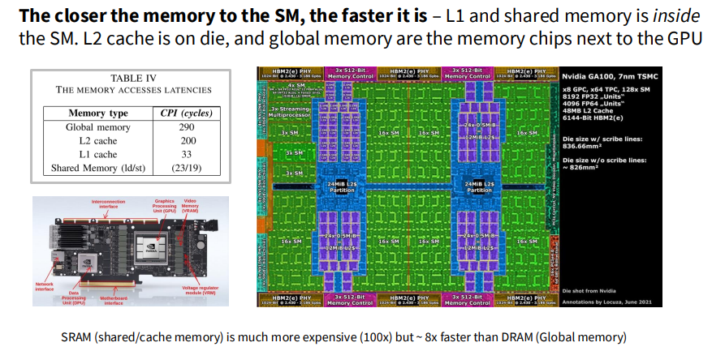

既然理解了GPU的执行结构，现在我们来看看一个同样重要的因素——内存。内存访问延迟是GPU性能的另一个关键瓶颈。不同存储层级的速度差异巨大，这深刻影响了高性能GPU编程的所有优化策略。

> 延迟的量化差异(左上表格 - Table IV)
表格展示了不同内存层级的访问延迟（以时钟周期cycles为单位），这是性能分析的基石：

* Global Memory (DRAM / HBM)
    * 这是显卡上最大的存储区域（例如A100上的40GB/80GB显存）。
    * 核心定义：在高端GPU（如A100/H100）上，这种DRAM通常采用HBM（High Bandwidth Memory）的封装形式。因此，HBM本质上就是DRAM的一种高性能形态。
    * 性能瓶颈：尽管HBM带宽很高，但对于GPU核心来说，去这里取数据依然极其缓慢（约290 cycles），相当于“跨省运输”。如果核心频繁直接读写Global Memory (HBM)，会造成严重的Memory Bound。

* L2 Cache
    * 位于芯片内部，所有SM共享。它比Global Memory稍快（约200 cycles），但依然有显著延迟，是连接HBM和SM的中间层。

* Shared Memory / L1 Cache (SRAM)
    * 位于SM内部。这是程序员可以显式控制的“手动缓存”。
    * 关键洞察：SRAM (Shared Memory) 比 DRAM (HBM) 快10倍以上（约20-30 cycles）。所有的CUDA优化（如Tiling），本质上就是为了克服DRAM的物理限制——尽量减少对慢速HBM (DRAM) 区域的访问，而是将数据一次性搬运到快速的 SRAM 区域进行高频复用。

> 2. 物理布局 (Physical Layout)
图片通过实物图和Die Shot解释了“为什么会有这种延迟差异”：

* 板卡层级 (左下图)：
    * 中间是GPU芯片（计算核心）。
    * 周围排列的是VRAM (Video Memory) 芯片（即Global Memory）。
    * 数据必须通过物理线路（Interconnect）在VRAM和GPU之间传输，物理距离和电气特性限制了带宽和延迟。

* 芯片层级 (右图 - Nvidia GA100Die Shot)：
    * HBM PHY：位于芯片边缘（紫色区域），负责与外部的高带宽内存（HBM）通信。
    * L2Cache：位于芯片中央的蓝色长条区域（24MiB x 2）。它是数据进入计算核心前的“最后一公里”中转站。
    * SM：分布在L2Cache两侧的绿色阵列。Shared Memory和L1Cache就隐藏在这些微小的绿色方块内部，紧挨着计算核心。

> 3. SRAM vs. DRAM (底部文字)
* SRAM (Static RAM)：用于寄存器和Shared Memory。速度极快，不需要刷新，但电路复杂（6个晶体管存1bit），占用面积大，因此极其昂贵（贵100倍）且容量小。
* DRAM (Dynamic RAM)：用于Global Memory。电路简单（1个晶体管+1个电容），密度高，便宜，但需要不断刷新电容电荷，速度慢。

总结：
GPU编程的本质是在极快但极小（SRAM）与极慢但极大（DRAM）的存储资源之间做权衡。如果不利用好Shared Memory，GPU强大的算力就会被缓慢的内存访问HBM所拖累，导致计算单元空转。因此，理解和优化内存访问模式是GPU性能优化的核心所在。

### Execution model of a GPU

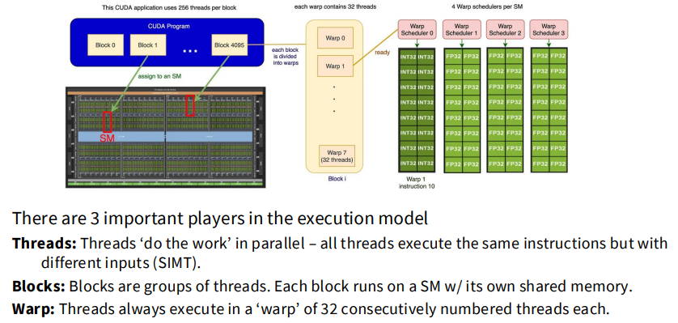

为了高效利用GPU的硬件资源，我们需要理解CUDA编程模型与物理硬件的映射关系。从软件层面的线程组织到硬件层面的实际执行，这种映射决定了程序性能的上限。

> 1. 软件层级：从Grid到Warp (上方流程图)
图上方展示了一个CUDA程序的结构分解：

* CUDA Program (Grid)：
    * 整个GPU任务被称为一个Grid。
    * Grid被划分为多个Block（图中的Block 0, Block 1... Block 4095）。例如，这个程序使用了4096个Block，每个Block有256个线程。
* Block (线程块)：
    * 映射规则：Block是被分配到SM (Streaming Multiprocessor) 上执行的基本单位。一旦分配，该Block就会一直驻留在该SM上直到执行完毕。
    * Warp分解：在SM内部，一个Block（包含256个线程）会被进一步切分为更小的执行单元，称为Warp。
* Warp (线程束)：
    * 定义：图中黄色框所示，Warp是GPU硬件调度的最小单位，固定包含32个连续线程（Thread 0-31为Warp 0，Thread 32-63为Warp 1，以此类推）。
    * SIMT (单指令多线程)：Warp中的32个线程在同一时刻执行同一条指令（lockstep），但处理不同的数据。

> 2. 硬件层级：SM的调度机制 (右侧细节)
图右侧展示了SM内部如何处理这些Warp：

* Warp Scheduler (Warp调度器)：
    * 图中标注有4个Warp Scheduler。这意味着这个SM每个时钟周期可以同时调度4个Warp进行发射。
    * 当一个Warp准备好执行（ready，即操作数已就绪，没有等待内存），调度器就会将其指令发射到执行单元。
* 执行单元 (ALU阵列)：
    * 图右侧绿色的列代表CUDA Cores (SP)。
    * 每个Warp Scheduler对应一组执行单元。例如，Warp Scheduler 0负责调度指令给第一列的INT32/FP32核心。
    * SIMT的体现：你可以看到每一列有16个或32个计算单元在并行工作，它们正在同时处理同一个Warp中不同线程的相同指令（例如 `instruction 10`）。

> 3. 核心角色总结 (底部文字)
* Threads (线程)：真正干活的工人。并行执行相同的指令，处理不同的数据（SIMT）。
* Blocks (线程块)：工人的小组。拥有共享内存（Shared Memory）和同步机制。一个Block只能在一个SM上运行。
* Warps (线程束)：硬件执行的最小编队。32个线程“同进退”。理解Warp对于避免Control Divergence（分支发散）和实现Memory Coalescing（内存合并）至关重要。

### Memory model of a GPU

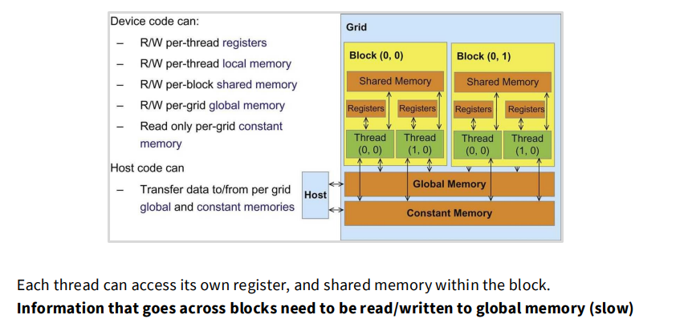

理解内存层级后，我们需要再看一个关键问题：不同的线程如何访问这些存储器？内存模型定义了这些访问规则，是理解GPU数据局部性的基础。

> 1. 访问权限与层级 (Memory Hierarchy)

* Registers (寄存器)：
    * 位置：图中最内层的 `Registers`。
    * 范围：Per-thread（每线程私有）。
    * 特性：每个线程只能读写自己的寄存器，速度最快，但空间最小。一旦线程结束，数据消失。

* Shared Memory (共享内存)：
    * 位置：Block内部的橙色区域。
    * 范围：Per-block（每块共享）。
    * 特性：同一个Block内的所有线程（如 `Thread (0,0)` 和 `Thread (1,0)`）都可以读写同一块Shared Memory。这是实现Block内线程通信和数据复用（Tiling）的关键区域，速度极快（接近L1缓存）。Block销毁后数据消失。

* Global Memory (全局内存)：
    * 位置：底部的 `Global Memory` 条。
    * 范围：Per-grid（全网格共享）。
    * 特性：所有Grid中的所有Block和所有Thread都能读写。它是容量最大的存储（GB级别），但速度最慢。更重要的是，跨Block的数据交换必须通过Global Memory进行。这意味着如果Block 0想要发数据给Block 1，它必须先把数据写入慢速的Global Memory，然后Block 1再从那里读出来。

* Constant Memory (常量内存)：
    * 位置：最底部的 `Constant Memory`。
    * 特性：全网格只读。对于所有线程都需要读取相同数据（如卷积核权重）的场景，它有特殊的缓存加速。

> 2. Host与Device的交互 (左侧文字)

* Device Code (GPU)：
    * 可以读写所有层级的内存（Registers, Local, Shared, Global）。
    * 只能读取Constant Memory。
* Host Code (CPU)：
    * 主要负责数据搬运。它不能直接操作寄存器或共享内存，只能将数据传输到Global Memory或Constant Memory（从CPU内存到GPU显存，即H2D），或者将结果取回（D2H）。

总结：
GPU编程的核心挑战在于：计算很快，但跨Block通信很慢（因为要走Global Memory）。 因此，高性能Kernel的设计原则是：尽可能让数据留在Shared Memory中，让Block内部解决战斗，尽量减少对Global Memory的依赖。

### Strengths of the GPU model

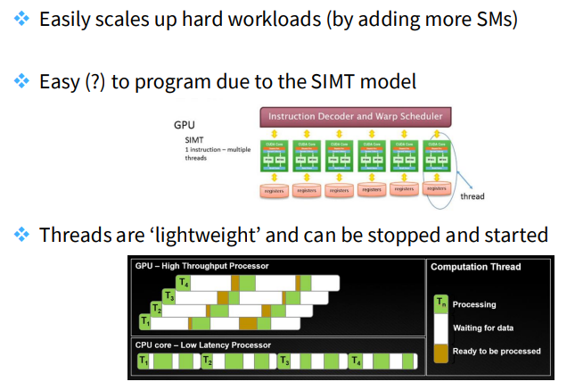

经过前面的详细分析，现在让我们回到更高的视角，理解为什么GPU架构在现代计算中如此占主导地位。三大核心优势共同作用，使得GPU成为AI时代的计算引擎。

> 可扩展性的威力(Scalability)

GPU采用了精妙的模块化设计。每个GPU由众多独立的SM(Streaming Multiprocessors)组成，例如A100就拥有128个SM。这些SM彼此相对独立，几乎没有通信开销，因此芯片设计师可以通过堆叠更多的SM来线性扩展计算能力。这种可扩展性不是通过复杂的全局协调实现的，而是通过简单的复制和排列——就像在工厂里增加流水线一样直观而有效。当新一代芯片需要更强的性能时，只需增加SM数量即可，已有的代码无需修改就能自动获得性能提升。

> 编程抽象的优雅(SIMT Model)

SIMT(单指令多线程)编程模型巧妙地隐藏了GPU的复杂性。图中展示的是一个Instruction Decoder控制多个CUDA Cores的架构——所有核心在同一时刻执行相同的指令，但处理各自数据。这种统一的指令流极大地简化了硬件设计，每个核心不需要独立的解码器，避免了大量的控制逻辑。对程序员而言，我们可以用通常的单线程思维写代码，硬件会自动将其广播到数万个线程。这种简洁性是CPU无法比拟的。当然，要写出真正高效的GPU代码仍需深入理解硬件细节，比如避免分支发散(Control Divergence)和实现内存合并(Memory Coalescing)，但基本的编程模型本身是直观的。

> 延迟隐藏的魔法(Latency Hiding)

GPU通过一个优雅的策略彻底改变了人们对延迟的认识。不同于CPU试图最小化每个操作的延迟，GPU选择用大量轻量级线程来淹没延迟。当某个线程因为内存访问而停滞时，GPU的硬件调度器以零开销瞬间切换到其他已就绪的线程继续计算。图中清晰地展示了这一点：虽然单个线程的执行被内存等待打断，但计算单元从不闲置，始终在执行某个线程的指令。数千个线程在你来我往中轮流执行，使得内存延迟变成了完全可以隐藏的"背景噪音"。这是GPU能达到极高吞吐量的秘密所在——不是跑得快，而是永远不停工。

## How do we get GPUs faster

当前 GPU 加速计算的核心矛盾，在于“算力溢出”与“带宽瓶颈”之间的巨大鸿沟。**这堵难以跨越的“内存墙 (Memory Wall)”，本质上源于 GPU 硬件架构的物理限制：主显存 (HBM) 虽然容量庞大，但读写延迟较高且带宽受限；而片上缓存 (SRAM) 即使速度极快、能完美匹配计算核心的吞吐，其容量却小得可怜。**

所有的计算发生前，数据都必须经历从 HBM 到 SRAM 的漫长搬运。因此，**要从算法层面打破这堵墙，核心诉求就是极力减少对 HBM 的访问次数。归根结底，破局的思路无外乎两条：要么“轻装上阵”（例如通过量化压缩，每次搬运更少的数据），要么“榨干价值”（例如通过算子融合，让单次搬运进 SRAM 的数据完成更多的计算）。**

### Low precision computation

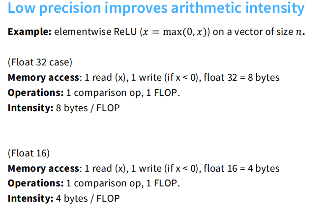

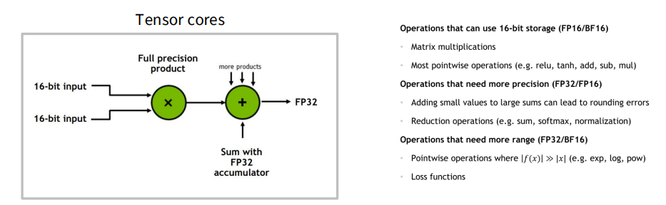

第一种策略是降低精度，也就是从FP32转向FP16、BF16甚至Int8。这不仅仅是为了让计算单元算得更快，更本质的原因在于提高算术强度(Arithmetic Intensity)。

- 减少数据搬运量

  如图所示，我们以简单的ReLU操作为例。如果使用FP32(32位浮点数)格式，每个数据占用4字节。读取一个数据(x)并可能写回一个数据，总共涉及8字节的内存传输，而这期间只进行了一次比较运算。这意味着算术强度极低，GPU大部分时间都在等待数据搬运。而如果我们切换到FP16(16位浮点数)，内存占用瞬间减半。同样的带宽下，我们可以输送两倍的数据给计算核心，或者说，完成同样的计算量只需要一半的带宽时间。

- 硬件层面的加速支持

  下方的Tensor Cores架构图进一步展示了硬件层面的支持。现代GPU(如NVIDIA Volta架构之后)引入了专门的Tensor Cores，它们被设计为混合精度计算模式：
  * 接受FP16格式的输入矩阵进行乘法运算，利用低精度带来的高吞吐和低带宽消耗。
  * 然后用FP32格式进行累加，最后输出FP16或FP32，以此保证数值稳定性。

- 实际应用中的混合精度策略(AMP)

  **对于大语言模型而言，这种硬件特性催生了自动混合精度(Automatic Mixed Precision, AMP)的标准范式。并非所有计算都无脑使用FP16/BF16，而是根据算子的数值敏感度进行了严格分工：**
  
  * 算力密集型算子(使用FP16/BF16)：主要包括矩阵乘法(Linear layers)、卷积(Convolutions)等。这些操作占据了模型计算量的99%以上，使用低精度可以极大利用Tensor Cores的吞吐能力，并减少显存占用。
  * 数值敏感型算子(使用FP32)：主要包括Softmax、LayerNorm(或RMSNorm)、以及Loss计算。因为Softmax涉及指数运算，容易溢出；而Normalization涉及方差计算，需要高精度累加来避免舍入误差。
  * 权重更新(Master Weights)：在反向传播时，虽然梯度可能以FP16计算，但在更新权重时，通常会维护一份FP32格式的"主权重"(Master Weights)进行更新，防止微小的梯度变化在低精度下直接变成0(Underflow)。

### Operator fusion

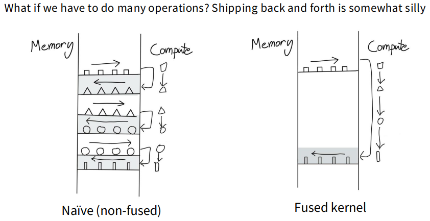

**如果说低精度是让数据变轻，那么算子融合(Operator Fusion)就是让数据少跑几趟路**。这是深度学习编译器(如PyTorch 2.0的TorchInductor)最核心的优化手段。

- 为什么未融合(Naïve)模式很慢
  
  请看第一张对比图，它展示了Naïve(未融合)模式与Fused(融合)模式的区别。在未融合的模式下，每一个简单的操作(如加法、乘法、激活函数)都是一个独立的Kernel。这意味着数据必须反复地在慢速的Memory(HBM)和快速的Compute(寄存器/SRAM)之间往返：
  * 读取x -> 计算Add -> 写回结果到HBM
  * 读取结果 -> 计算Mul -> 写回结果到HBM

  这就像工厂每加工一道工序就把半成品运回几公里外的仓库，下一道工序再去仓库取，效率极低。

- 融合(Fused)模式的优势
  
  **Operator Fusion的思想是将多个连续的Element-wise(逐元素)操作合并成一个Kernel。数据一旦从HBM被读取到芯片内部的SRAM或寄存器中，就连续完成加、乘、激活等一系列计算，最后只把最终结果写回HBM。这样就将多次HBM访问压缩为了一次。**

- 实际案例：torch.compile

  torch.compile不仅是算子融合的典型例子，更是目前深度学习框架中自动化融合(Automatic Fusion)的工业标准。为了理解它的威力，我们需要对比Eager Mode(动态图)和Compiled Mode(编译模式)的区别：

  * Eager Mode的痛点(逐行执行)
    在PyTorch 2.0之前，我们默认使用Eager Mode。这就像是一个只会一步步执行命令的工人。比如执行公式`y = sin(x) + cos(x)`，Python解释器会将其拆解为三个独立的步骤：
    1. 启动sin Kernel：从HBM读取x -> 计算sin -> 结果写回HBM。
    2. 启动cos Kernel：从HBM读取x -> 计算cos -> 结果写回HBM。
    3. 启动add Kernel：从HBM读取sin和cos的结果 -> 计算加法 -> 最终结果写回HBM。
    仅仅为了计算一个简单的数学公式，GPU被迫进行了3次完整的读写循环(Round-trip)，这极大地浪费了带宽，也就是典型的Memory Bound。

  * torch.compile的魔法(图层融合)
    **当你包裹`model = torch.compile(model)`时，PyTorch后端的编译器(TorchInductor)会介入。它会先捕获整个计算图(Graph Capture)，然后分析哪些算子是Element-wise(逐元素)的。它发现sin、cos和add都是针对同一批数据的连续操作，于是会自动生成一个融合后的Triton Kernel(或其他后端代码)。**
    执行流程变成了：
    1. 启动融合Kernel：从HBM读取x -> 在SRAM(片上高速缓存)中一次性计算sin、cos和加法 -> 仅将最终结果写回HBM。
    通过这种方式，`torch.compile`将多次HBM访问压缩为一次，不仅减少了显存带宽压力，还减少了CPU启动GPU Kernel的开销(Kernel Launch Overhead)。这就是为什么在显存受限的场景下(如大Batch Size训练或推理)，开启编译模式往往能带来显著的速度提升。

### Recomputation

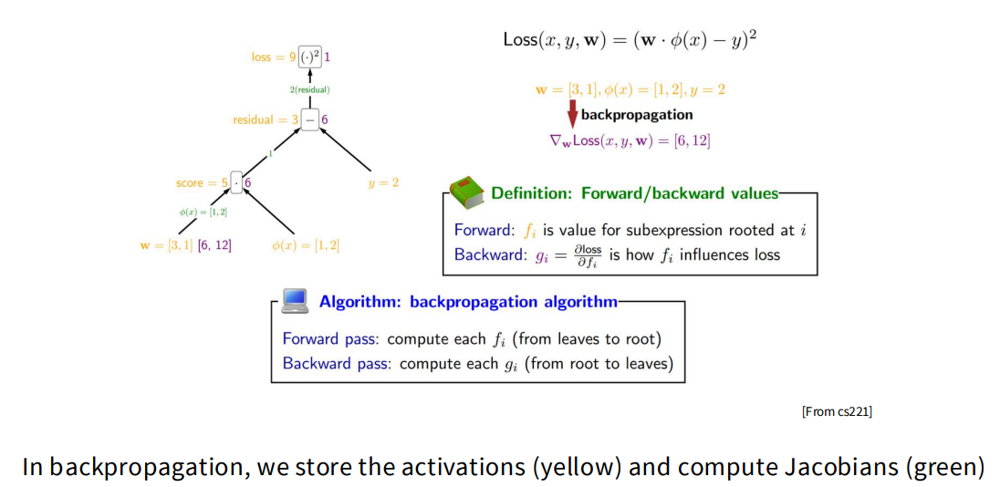

在前两个章节中，我们通过降低精度和融合算子减少了显存的读写频率。然而，在深度神经网络的训练过程中，还有一个巨大的显存消耗来源：为了反向传播(Backpropagation)计算梯度，我们需要保存前向传播(Forward Pass)产生的所有中间激活值(Activations)。这就是重计算策略(Recomputation，也称为Activation Checkpointing)登场的舞台。

- 反向传播的内存困境
  如上图所示，这是一个典型的计算图。在标准的训练流程中，我们需要先进行前向传播(Forward pass)，计算出所有的f_i(图中黄色的值，即Activations)。然后，在反向传播(Backward pass)时，我们需要利用这些f_i来计算梯度g_i(图中绿色的值)。
  * 这里的关键约束在于：计算梯度通常必须依赖于前向传播的输出值。
  * 因此，默认情况下，框架必须把图中所有的黄色方块(Activations)一直存储在显存(HBM)中，直到反向传播完成。对于像GPT-3或Llama这样拥有数十亿参数的深层网络，这些暂存的激活值会迅速耗尽显存资源，限制了我们能训练的模型大小或Batch Size。

- 以计算换显存(Compute for Memory)
  重计算的核心思想非常反直觉：既然显存不够用，那我们干脆就不存了。
  * 在前向传播时，我们不再保存所有的中间激活值，而是只保存少量的“检查点”(Checkpoints)。
  * 当反向传播需要用到某个被丢弃的激活值时，我们利用最近的检查点，重新执行一遍前向计算逻辑，临时把这个值算出来。
  
- 为什么这是一个好主意？
  你可能会问，重新计算一遍不是浪费了时间吗？这正好呼应了我们Lecture开头提到的核心矛盾：GPU的算力(FLOPs)增长速度远超显存带宽。
  * 在现代GPU架构中，计算是极其廉价且快速的，而访问显存(HBM)是昂贵且缓慢的。
  * 重计算策略本质上是用“廉价的额外计算”来换取“宝贵的显存空间”。虽然我们在反向传播时多做了一些数学运算(大约增加了33%的计算量)，但我们省下了大量的显存占用(Memory Footprint)，从而允许我们塞进更大的模型，或者使用更大的Batch Size来提高训练的并行度，最终往往能获得更高的整体吞吐量。

### Coalescing memory

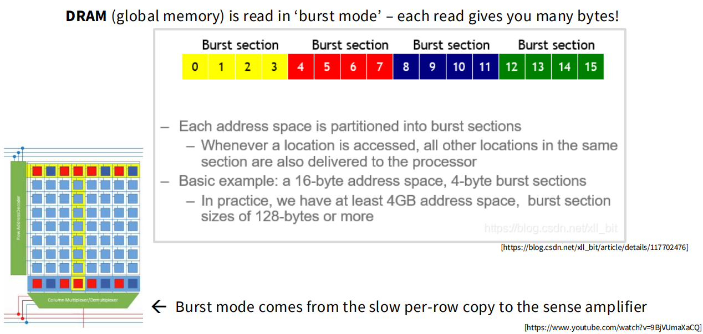

第四个技巧涉及到显存(DRAM)的物理读取机制。你可能认为内存像一个巨大的数组，想读哪个字节就读哪个字节。但实际上，DRAM是按“块”或者是“Burst”(突发模式)来进行读写的。

- 理解Burst Mode

  当我们请求显存中的某个地址时，硬件不仅会返回那个特定的字节，还会一次性返回相邻的一大块数据(例如连续的32字节或128字节)。这就好比你去图书馆借书，管理员规定不准只借一本，每次必须把那个书架那一层的书全部搬走。

- 什么是内存合并(Coalescing)

  在GPU的SIMT模型中，一个Warp里的32个线程通常会同时发出内存读取请求。
  * Coalesced(合并访问)：如果这32个线程请求的数据在物理内存上是连续的(如上图左侧)，那么它们刚好落在同一个Burst Section里。GPU只需要向DRAM发一次请求，就能把所有线程需要的数据拿回来。效率极高。
  * Not Coalesced(未合并访问)：如果线程请求的数据是跳跃的、不连续的(如Row-major矩阵沿列读取)，它们可能分散在不同的Burst Sections里。这就导致GPU必须发起多次DRAM请求，抛弃掉大量读入但不需要的“废数据”，导致有效带宽急剧下降。

### Tiling

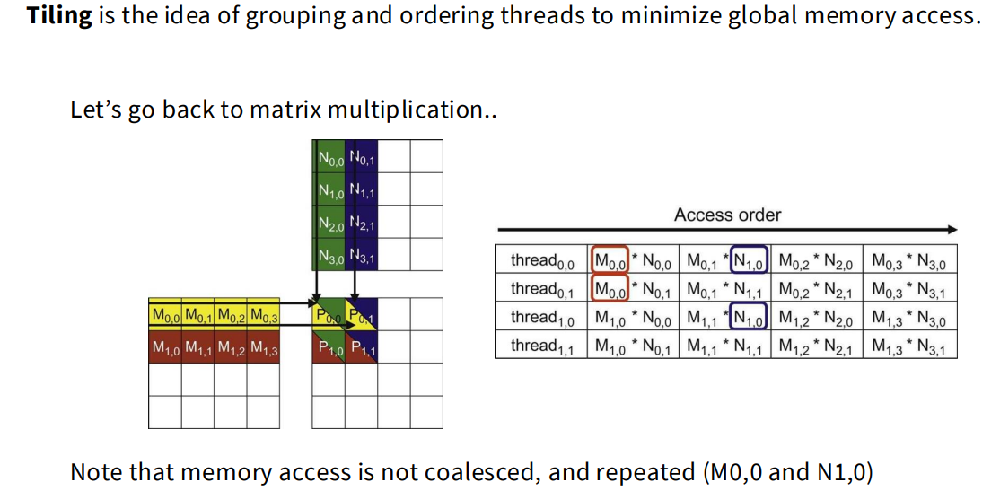

第五个技巧，也是GPU优化中最重要、最通用的技巧，叫做 分块 (Tiling)。它的核心逻辑可以概括为：利用高速的 Shared Memory (SRAM) 建立一个数据复用的“前哨基地”，从而大幅减少对低速 Global Memory (HBM) 的访问。

#### 1. 朴素矩阵乘法的痛点：Memory Bound

回顾标准的矩阵乘法 $C = A \times B$。为了计算 $C$ 中的一个元素，我们需要读取 $A$ 的一行和 $B$ 的一列。

* 问题：如果 $A$ 和 $B$ 都在巨大的 Global Memory (HBM) 里，这意味着每一行和每一列都要被反复从 HBM 读取 $N$ 次（N 为矩阵维度）。
* 后果：HBM 的带宽远低于计算单元的吞吐量，这种频繁的“长途运输”会导致计算单元等待数据，彻底卡死显存带宽，使程序处于 Memory Bound 状态。

#### 2. Tiling 的工作原理：以空间换时间

Tiling 将大矩阵切分成小的 "Tile" (块)，利用 GPU 上极快（带宽约 19TB/s）但容量有限（每 SM 约 100KB+）的 Shared Memory (SRAM) 进行数据复用。

流程如下：
1.  加载 (Load)：让一个 Thread Block 里的线程协作，将 $A$ 的一个小块和 $B$ 的一个小块从慢速 HBM 并行搬运到快速 SRAM 中。
2.  复用 (Compute)：一旦数据进入 SRAM，线程就可以在 SRAM 内部基于这些小块进行多次计算（点积求和）。此时数据离计算单元非常近，访问延迟极低。
3.  循环 (Loop)：处理完当前 Tile 后，再加载下一个 Tile，直到完成所有计算。

收益：通过 Tiling，每个输入元素从 HBM 读取的次数从 $N$ 次降低到了 $N/T$ 次（T 为 Tile 大小），显著降低了显存带宽压力。

## Putting it together: unpacking FlashAttention

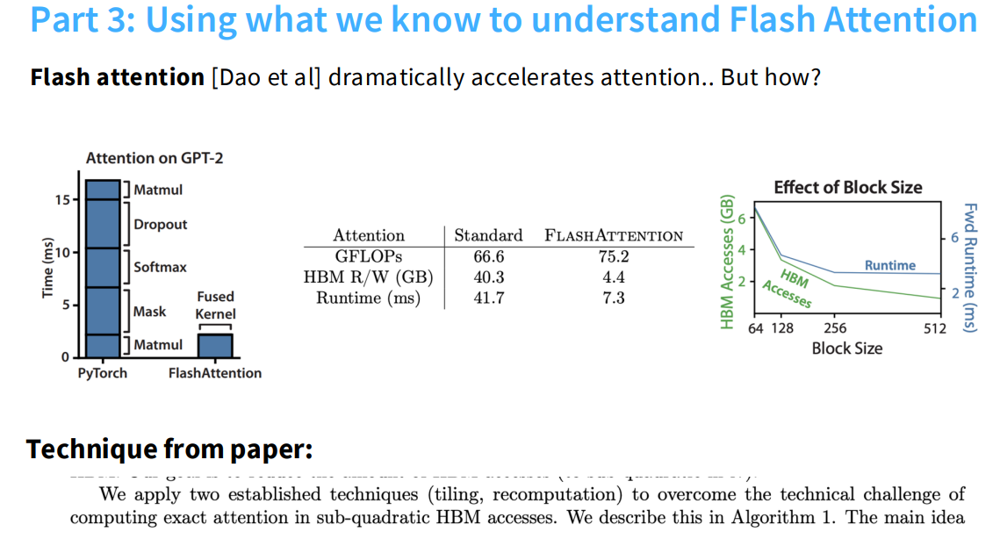

关于FlashAttention的前向过程详解，请参考：[FlashAttention Forward Pass](./UmarJamil_flash_attention/005%20-%20flash_attention_forward.md)