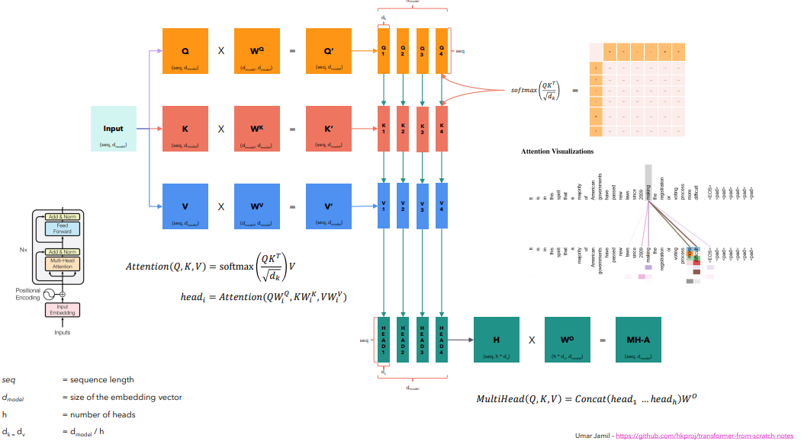

# Intro to Multi-Head Attention



## 目录
- [多头注意力机制概述](#多头注意力机制概述)
- [投影矩阵](#投影矩阵)
- [缩放点积注意力](#缩放点积注意力)
- [多头机制](#多头注意力机制概述)
- [多头注意力输出](#多头注意力输出)
- [PyTorch 代码实现](#pytorch-代码实现)

---

### 多头注意力机制概述

给定一个序列，我们获得输入的嵌入向量（embedding vectors）。输入序列的形状为 $(N, D)$，其中：
- $N$ = 序列长度（sequence length）
- $D$ = 嵌入向量的维度（size of the embedding vector），通常记为 $d_{\text{model}}$

### 投影矩阵

我们通过三个不同的投影矩阵从输入中得到三种不同的表示：
- $W_Q \in \mathbb{R}^{D \times D}$ - Query 投影矩阵
- $W_K \in \mathbb{R}^{D \times D}$ - Key 投影矩阵  
- $W_V \in \mathbb{R}^{D \times D}$ - Value 投影矩阵

计算过程：
- $Q = X W_Q$，形状为 $(N, D)$
- $K = X W_K$，形状为 $(N, D)$
- $V = X W_V$，形状为 $(N, D)$

如果是交叉注意力（cross-attention），我们会使用另一个序列来计算 $V$。

### 缩放点积注意力（Scaled Dot-Product Attention）

注意力机制的核心公式：

$$\text{Attention}(Q, K, V) = \text{softmax}\left(\frac{QK^T}{\sqrt{d_k}}\right)V$$

其中：
- $QK^T$ 计算相似度得分，结果形状为 $(N, N)$
- $\sqrt{d_k}$ 是缩放因子，防止点积过大导致 softmax 梯度消失
- 最终与 $V$ 相乘得到输出，形状为 $(N, d_v)$

> **💡 深度解析**
> -> **问：为什么使用点积而不是纯粹的余弦相似度？**
> 
> 1. **保留特征强度（Magnitude）**：点积的数学定义是 $\|A\| \|B\| \cos(\theta)$，它不仅包含了向量夹角（方向相似度），还保留了向量的模长。在注意力机制中，Query 和 Key 的模长代表了该 Token 的“重要性”或“特征强度”。如果强制使用余弦相似度（即 L2 归一化），会抹杀掉这种天然的强度差异，限制模型的表达能力。
> 2. **计算效率**：在工程实现中，$QK^T$ 本质上是利用 GPU 进行高效的批量矩阵乘法。计算余弦相似度需要额外计算范数并做除法，在大规模序列中会引入不必要的计算开销。

> **💡 深度解析**
> -> **问：为什么除以 $\sqrt{d_k}$ 而不是 $d_k$？**
> 
> 这是为了控制方差。假设 $Q$ 和 $K$ 中的元素是均值为 $0$、方差为 $1$ 的独立随机变量。
> - 当计算点积 $q \cdot k = \sum_{i=1}^{d_k} q_i k_i$ 时，结果的均值依然是 $0$，但**方差会膨胀到 $d_k$**。
> - 为了将点积结果的方差重新缩放回健康的 $1$（标准正态分布），我们需要除以方差的平方根，即**标准差 $\sqrt{d_k}$**。
> - **如果除以 $d_k$**：方差会被极度压缩到 $1/d_k$，导致输入到 Softmax 的值差异微乎其微。此时 Softmax 的输出会趋近于均匀分布，注意力机制将彻底失去“聚焦”关键信息的能力。

### 多头机制（Multi-Head）

为什么叫"多头"？


我们将输入的嵌入向量序列 $(N, D)$ 分割成多个头（heads）。例如，如果有4个头：
- 原始维度 $D = 512$
- 每个头的维度 $d = D / 4 = 128$

形状变换： $(N, D) \rightarrow (N, 4, d)$ ，其中 $d = D / h$ ， $h$ 是头的数量。

注意： $D$ 通常被称为 $d_{\text{model}}$ ，而 $d$ 通常被称为 $d_{\text{head}}$ 。

每个头独立计算注意力：
$$\text{head}_i = \text{Attention}(QW_i^Q, KW_i^K, VW_i^V)$$

> **💡 深度解析**
> -> **问：为什么要多头？多头的好处体现在哪里？**
> 
> 1. **关注不同的表示子空间（Representation Subspaces）**：自然语言语境复杂，同一个词有多重特征。多头机制允许不同的“头”在平行的空间中独立学习不同的特征（例如：头 1 捕捉语法结构，头 2 捕捉指代关系，头 3 关注局部位置）。
> 2. **防止信息平均化**：如果只使用单头注意力，模型在计算加权平均时必须试图在单一维度里融合所有信息，导致各种特征相互干扰稀释。多头机制类似于 CNN 中的多个卷积核（多通道），极大地丰富了特征提取的多样性和解耦性。

### 多头注意力输出

1. 对每个头分别计算注意力
2. 将所有头的输出拼接（Concatenate）：

$$
\text{Concat}(\text{head}_1, \ldots, \text{head}_h)
$$

3. 通过最终的线性投影 $W^O \in \mathbb{R}^{(h \cdot d) \times d_{\text{model}}}$：

$$
\text{MultiHead}(Q, K, V) = \text{Concat}(\text{head}_1, \ldots, \text{head}_h)W^O
$$

## PyTorch 代码实现

```python
import torch
import torch.nn as nn
import torch.nn.functional as F

class ScaledDotProductAttention(nn.Module):
    """缩放点积注意力"""
    
    def __init__(self, dropout=0.0):
        super().__init__()
        self.dropout = nn.Dropout(dropout)
    
    def forward(self, Q, K, V, mask=None):
        """
        Args:
            Q: Query，形状 (batch_size, seq_len, d_k)
            K: Key，形状 (batch_size, seq_len, d_k)
            V: Value，形状 (batch_size, seq_len, d_v)
            mask: 可选的掩码
        
        Returns:
            output: 注意力输出 (batch_size, seq_len, d_v)
            attention_weights: 注意力权重 (batch_size, seq_len, seq_len)
        """
        d_k = Q.shape[-1]
        
        # 计算注意力得分
        scores = torch.matmul(Q, K.transpose(-2, -1)) / torch.sqrt(torch.tensor(d_k, dtype=torch.float))
        
        # 应用掩码
        if mask is not None:
            scores = scores.masked_fill(mask == 0, float('-inf'))
        
        # Apply softmax
        attention_weights = F.softmax(scores, dim=-1)
        attention_weights = self.dropout(attention_weights)
        
        # 与 Value 相乘
        output = torch.matmul(attention_weights, V)
        
        return output, attention_weights

class MultiHeadAttention(nn.Module):
    """多头注意力"""
    
    def __init__(self, d_model, num_heads, dropout=0.0):
        """
        Args:
            d_model: 模型维度
            num_heads: 注意力头数
            dropout: dropout 比率
        """
        super().__init__()
        
        assert d_model % num_heads == 0, "d_model 必须能被 num_heads 整除"
        
        self.d_model = d_model
        self.num_heads = num_heads
        self.d_head = d_model // num_heads
        
        # 投影矩阵
        self.W_Q = nn.Linear(d_model, d_model)
        self.W_K = nn.Linear(d_model, d_model)
        self.W_V = nn.Linear(d_model, d_model)
        self.W_O = nn.Linear(d_model, d_model)
        
        # 注意力层
        self.attention = ScaledDotProductAttention(dropout)
        self.dropout = nn.Dropout(dropout)
    
    def forward(self, X, mask=None):
        """
        Args:
            X: 输入，形状 (batch_size, seq_len, d_model)
            mask: 可选的掩码
        
        Returns:
            output: 多头注意力输出 (batch_size, seq_len, d_model)
        """
        batch_size = X.shape[0]
        
        # 1. 投影到 Q, K, V
        Q = self.W_Q(X)  # (batch_size, seq_len, d_model)
        K = self.W_K(X)  # (batch_size, seq_len, d_model)
        V = self.W_V(X)  # (batch_size, seq_len, d_model)
        
        # 2. 分割成多个头
        Q = Q.view(batch_size, -1, self.num_heads, self.d_head).transpose(1, 2)  # (b, h, seq_len, d_head)
        K = K.view(batch_size, -1, self.num_heads, self.d_head).transpose(1, 2)  # (b, h, seq_len, d_head)
        V = V.view(batch_size, -1, self.num_heads, self.d_head).transpose(1, 2)  # (b, h, seq_len, d_head)
        
        # 3. 计算注意力
        attn_output, _ = self.attention(Q, K, V, mask)  # (b, h, seq_len, d_head)
        
        # 4. 拼接所有头
        attn_output = attn_output.transpose(1, 2).contiguous()  # (b, seq_len, h, d_head)
        attn_output = attn_output.view(batch_size, -1, self.d_model)  # (b, seq_len, d_model)
        
        # 5. 通过输出投影
        output = self.W_O(attn_output)  # (b, seq_len, d_model)
        output = self.dropout(output)
        
        return output
```