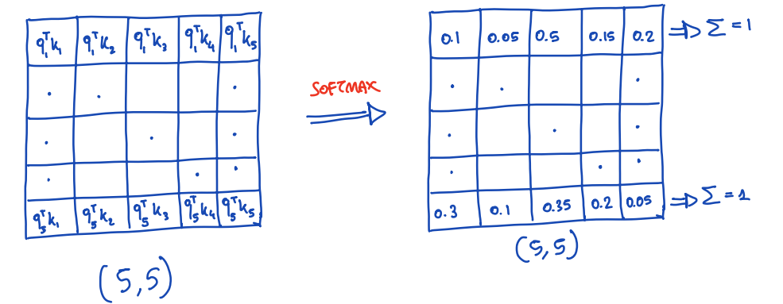
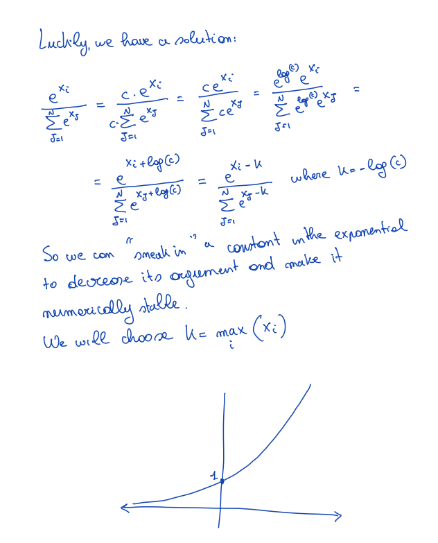

# Safe Softmax

## 目录
- [数值稳定性问题](#数值稳定性问题)
- [安全Softmax的解决方案](#安全softmax的解决方案)
- [安全Softmax算法](#安全softmax算法)
  - [步骤1：找到最大值](#步骤1找到最大值)
  - [步骤2：计算归一化因子](#步骤2计算归一化因子)
  - [步骤3：应用softmax](#步骤3应用softmax)
- [伪代码](#伪代码)
- [实际例子](#实际例子)
- [问题引入](#问题引入)

---



在注意力机制中，我们计算：

$$S = QK^T \in \mathbb{R}^{N \times N}, \quad P = \text{softmax}(S) \in \mathbb{R}^{N \times N}, \quad O = PV \in \mathbb{R}^{N \times d}$$

对于矩阵 $S$ 的每一行应用softmax，得到一个概率分布（每行和为1）。

给定一个向量 $x \in \mathbb{R}^N$，softmax定义为：

$$\text{softmax}(x_i) = \frac{e^{x_i}}{\sum_{j=1}^{N} e^{x_j}}$$

### 数值稳定性问题

问题：如果向量的值很大，指数函数会爆炸（explode）！

数值不稳定意味着结果无法用float32或float16表示，会导致上溢（overflow）。

### 安全Softmax的解决方案

幸运的是，我们有解决方案。利用指数函数的性质，我们可以在指数中"偷偷"加入一个常数来减小其参数，使其数值稳定。

数学推导：

$$\frac{e^{x_i}}{\sum_{j=1}^{N} e^{x_j}} = \frac{c \cdot e^{x_i}}{c \cdot \sum_{j=1}^{N} e^{x_j}} = \frac{e^{x_i + \log(c)}}{\sum_{j=1}^{N} e^{x_j + \log(c)}} = \frac{e^{x_i - u}}{\sum_{j=1}^{N} e^{x_j - u}}$$

其中 $u = -\log(c)$。

因此，我们可以在指数中减去一个常数 $u$ 来减小参数。我们选择：

$$u = \max_i(x_i)$$

这样，指数中的最大值变为 $e^0 = 1$，避免了上溢。

### 安全Softmax算法



公式：

$$\text{softmax}(x_i) = \frac{e^{x_i - x_{\max}}}{\sum_{j=1}^{N} e^{x_j - x_{\max}}}$$

对于 $N \times N$ 矩阵的每一行，算法步骤如下：

步骤1：找到最大值
- 在所有元素中找到最大值 $x_{\max}$，时间复杂度：O(N)，内存读取：O(N)

步骤2：计算归一化因子
- 计算 $\sum_{j=1}^{N} e^{x_j - x_{\max}}$，时间复杂度：O(N)，内存读取：O(N)

步骤3：应用softmax
- 对每个元素计算 $\frac{e^{x_i - x_{\max}}}{\text{归一化因子}}$，时间复杂度：O(N)，内存读取：O(N)

### 伪代码
```python
m_0 = -∞
for i = 1 to N:
    m_i = max(m_{i-1}, x_i)
    
l_0 = 0
for j = 1 to N:
    l_j = l_{j-1} + e^{x_j - m_N}
    
for k = 1 to N:
    x_k ← e^{x_k - m_N} / l_N
```

### 实际例子

给定向量 $x = [3, 2, 5, 1]$：

1. 找到最大值： $x_{\max} = 5$

2. 计算归一化因子：

$$
e^{3-5} + e^{2-5} + e^{5-5} + e^{1-5} = e^{-2} + e^{-3} + e^{0} + e^{-4} = L
$$

3. 计算 Softmax：

   - $x_1 = \frac{e^{3-5}}{L} = \frac{e^{-2}}{L}$
   - $x_2 = \frac{e^{2-5}}{L} = \frac{e^{-3}}{L}$
   - $x_3 = \frac{e^{5-5}}{L} = \frac{e^{0}}{L}$
   - $x_4 = \frac{e^{1-5}}{L} = \frac{e^{-4}}{L}$

### 问题引入

要将softmax应用于 $N \times N$ 矩阵，我们需要加载每个元素3次，而且必须顺序执行...