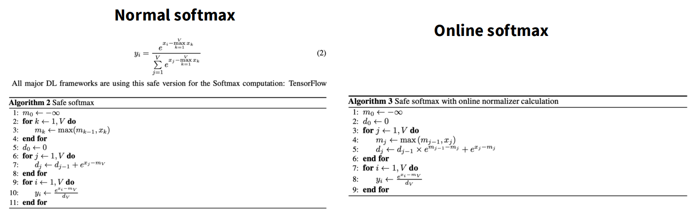

# Online Softmax

## 目录
1. [问题背景与传统方法](#问题背景与传统方法)
2. [逐步推导：融合计算的尝试](#逐步推导融合计算的尝试)
3. [核心突破：在线修正机制](#核心突破在线修正机制)
4. [完整算法伪代码](#完整算法伪代码)
5. [数学证明：归纳法](#数学证明归纳法)

---

## 问题背景与传统方法

目标：计算每个向量的 Softmax，既不需要遍历向量 3 次，又能防止指数函数溢出。

### 传统 Safe Softmax 的缺点

为了防止 $e$ 计算溢出（数值爆炸），通常采用 Safe Softmax，即先减去最大值。但这通常需要三个步骤（三次循环）：

1.  第一次循环：找到最大值 $m$ 。
2.  第二次循环：计算 $e^{x_i - m}$ 的总和（分母，即归一化常数）。
3.  第三次循环：计算最终的 $x_k$ 。

这种方法虽然准确，但因为需要多次读取内存，效率较低。

---

## 逐步推导：融合计算的尝试

我们可以尝试将“寻找最大值”与“计算归一化常数”融合在一起。

以示例向量 $X = [3, 2, 5, 1]$ 来演示这个过程。

### Step 1 (处理第一个元素 3)
- 当前最大值 $m = 3$ 。
- 当前累计和 $l_1 = e^{3-3} = e^0 = 1$ 。

### Step 2 (处理第二个元素 2)
- 当前最大值 $m = \max(3, 2) = 3$ （最大值没变）。
- 当前累计和 $l_2 = l_1 + e^{2-3}$ 。
- 此时，如果只看前两个元素，计算是正确的，因为最大值一直是 3。

当处理到第三个元素（数值为 5）时，情况发生了变化，因为 5 比之前的最大值 3 要大。

---

## 核心突破：在线修正机制

Online Softmax 的关键是 动态调整基准，保证数值稳定性。

### Step 3 (处理第三个元素 5)
- 新最大值变成 $m_{new} = 5$ 。
- 之前的累计和 $l_2$ 是基于最大值 3 计算的（即所有项都是 $e^{x_i-3}$ ）。
- 现在需要的是基于最大值 5 的累计和（即所有项都是 $e^{x_i-5}$ ）。
- 直接加 $e^{5-5}$ 是不对的，因为之前的 $l_2$ "过时"了。

解决方案：在线修正 (Fix on the Fly)

可以通过乘以一个 修正因子 (correction factor) 来更新旧的累计和，使其适应新的最大值。

修正公式：

$$
l_i = l_{i-1} \cdot e^{m_{old} - m_{new}} + e^{x_i - m_{new}}
$$

代入数值验证：

$$
l_3 = l_2 \cdot e^{3-5} + e^{5-5}
$$

展开来看：
- 原来的 $l_2 = e^{3-3} + e^{2-3}$
- 乘以修正因子 $e^{3-5}$ 后：

$$
(e^{3-3} + e^{2-3}) \cdot e^{3-5} = e^{3-3+3-5} + e^{2-3+3-5} = e^{3-5} + e^{2-5}
$$

这正是需要的以 5 为基准的指数！再加上当前的 $e^{5-5}$ ，结果完全正确。

结论：每当遇到一个比当前最大值更大的数，就"修复"之前的累计和。

### Step 4 (处理第四个元素 1)
- 最大值 $\max(5, 1) = 5$ ，最大值未变。
- 修正因子是 $e^{5-5} = 1$ （即不需要修正）。
- 直接累加即可。

---

## 完整算法伪代码

Online Softmax 的完整伪代码如下：

### 初始化
令 $m_0 = -\infty$ ， $l_0 = 0$ 。

### 遍历循环（一次循环）
对于 $i = 1$ to $N$ ：

1. 更新最大值：
   $$m_i = \max(m_{i-1}, x_i)$$
2. 更新累计和（含修正）：
   $$l_i = l_{i-1} \cdot e^{m_{i-1} - m_i} + e^{x_i - m_i}$$

### 计算最终结果
循环结束后，使用最终的全局最大值 $m_N$ 和全局累计和 $l_N$ 来计算每个元素的 Softmax 值。

---

## 数学证明：归纳法

### 证明目标

证明在循环结束后， $m_N$ 是全局最大值， $l_N$ 是正确的归一化常数 $\sum e^{x_j - m_N}$ 。

### 证明过程

1. 基础步骤 (Base Case, N=1)
- 对于只有一个元素的向量，$m_1 = x_1$ ， $l_1 = 0 \cdot (...) + e^{x_1 - x_1} = 1$ 。
- 公式成立。

2. 归纳步骤 (Inductive Step, N → N+1)
- 假设对于 $N$ 成立，考察 $N + 1$ 的情况。
- 更新最大值： $m_{N+1} = \max(m_N, x_{N+1})$ 。
- 展开 $l_{N+1}$ 的递推公式：

$$
l_{N+1} = l_N \cdot e^{m_N - m_{N+1}} + e^{x_{N+1} - m_{N+1}}
$$

- 将假设的 $l_N$ （即 $\sum_{j=1}^{N} e^{x_j - m_N}$ ）代入：

$$
l_{N+1} = \left(\sum_{j=1}^{N} e^{x_j - m_N}\right) \cdot e^{m_N - m_{N+1}} + e^{x_{N+1} - m_{N+1}}
$$

- 利用指数运算规则 $e^a \cdot e^b = e^{a+b}$ ，将修正因子乘入求和项中：

$$
= \sum_{j=1}^{N} e^{(x_j - m_N) + (m_N - m_{N+1})} + e^{x_{N+1} - m_{N+1}}
$$

- 消去 $m_N$ ，化简为：

$$
= \sum_{j=1}^{N} e^{x_j - m_{N+1}} + e^{x_{N+1} - m_{N+1}}
$$

- 最终合并求和项：

$$
= \sum_{j=1}^{N+1} e^{x_j - m_{N+1}}
$$

算法在数学上是严格正确的，能够动态调整基准，保证数值稳定性的同时完成一次遍历计算。