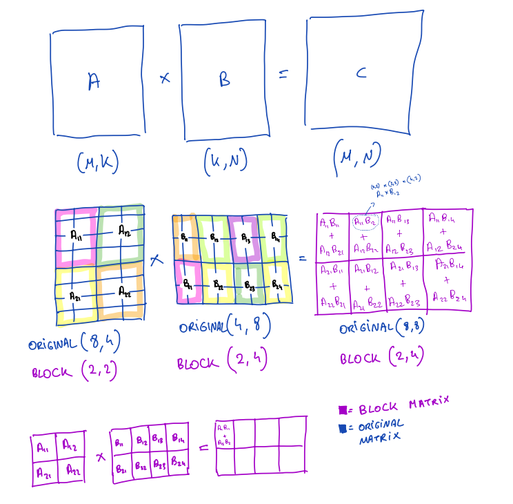
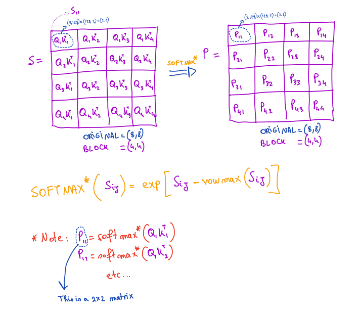
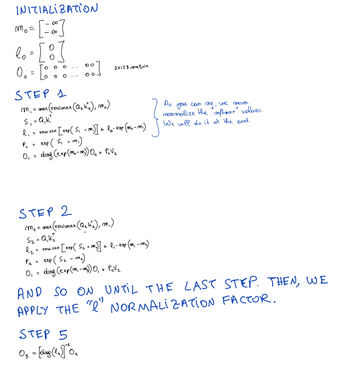

# Block Matrix Multiplication for Flash Attention

## 目录
1. [分块矩阵乘法基础](#分块矩阵乘法基础)
   - [基本原理](#基本原理)
   - [计算规则](#计算规则)
   - [直观理解](#直观理解)
2. [注意力机制中的分块运算](#注意力机制中的分块运算)
   - [矩阵分块设置](#矩阵分块设置)
   - [第一步：计算分数矩阵](#第一步计算分数矩阵)
   - [第二步：计算输出](#第二步计算输出)
   - [伪代码演示](#伪代码演示)
3. [核心难题：Softmax 的局部性陷阱](#核心难题softmax的局部性陷阱)
   - [问题所在](#问题所在)
   - [错误的尝试](#错误的尝试)
   - [原因分析](#原因分析)
4. [解决方案：在线修正机制](#解决方案在线修正机制)
   - [核心思想](#核心思想)
   - [初始化](#初始化)
   - [Step 1：处理第一个块](#step-1处理第一个块-k_1-v_1)
   - [Step 2：处理第二个块](#step-2处理第二个块)
   - [最终归一化](#最终归一化)
   - [总体流程](#总体流程)

---

## 分块矩阵乘法基础

### 基本原理

大矩阵可以按行和列分割成小矩阵块。假设矩阵 $A \times B = C$ ，如果矩阵 $A$ 和 $B$ 非常大，我们可以将它们分割成小矩阵块。

### 计算规则

以 $2 \times 2$ 分块的例子为例。结果矩阵 $C$ 的左上角块 (Block 1,1) 的计算公式为：

$$C_{11} = A_{11}B_{11} + A_{12}B_{21}$$

结果块是由“行块”与“列块”对应的子矩阵乘积相加构成的。

### 直观理解

可以把原本巨大的 $M \times N$ 矩阵运算，看作许多个小矩阵的独立运算，最后把结果加在一起。这为在有限 GPU 显存 (SRAM) 中进行计算提供了理论基础。

---

## 注意力机制中的分块运算

接下来，可以通过分块思想应用到 Attention 的核心公式中： $O = (QK^T)V$ 。这里忽略 Softmax，只关注线性运算部分。

### 矩阵分块设置

假设将 Query ($Q$)、Key ($K$) 和 Value ($V$) 矩阵分块。

- $Q$ (Query)：被按行切分成块（如 $Q_1, Q_2, ...$ ）。
- $K^T$ (Key Transposed)：被按列切分成块（如 $K_1^T, K_2^T, ...$ ）。

### 第一步：计算分数矩阵

计算分数矩阵 $S = QK^T$ 。

$S$ 矩阵的每一块是如何生成的？例如，S 的左上角块就是 $Q_1K_1^T$ 。这意味着我们可以独立地计算 Attention 分数矩阵的每一个小块。

### 第二步：计算输出

计算输出 $O = S \times V$ 。

这是最关键的一步。输出矩阵 $O$ 的每一行（或每一个块），其实是多次计算结果的累加。

### 伪代码演示

如果要计算第 $i$ 个输出块 $O_i$ ，需要遍历所有的 $K$ 和 $V$ 块（索引为 $j$ ）：

1. 初始化 $O_i$ 为全 0 矩阵。
2. 循环 $j$ ：计算 $(Q_i K_j^T) \times V_j$ 。
3. 将结果累加到 $O_i$ 上： $O_i \leftarrow O_i + (Q_i K_j^T)V_j$ 。

结论：如果不考虑 Softmax，分块计算 Attention 非常简单，就是不断的乘法和累加。

---

## 核心难题：Softmax 的局部性陷阱

### 问题所在

真实的 Attention 公式是 $O = \text{Softmax}(QK^T)V$ 。

Softmax 函数是非线性的，它包含两个全局变量：

1. 行最大值 ($m$)：用于防止指数爆炸。
2. 分母归一化常数 ($l$)： $\sum e^{x_i - m}$ 。

### 错误的尝试

如果按照前面的思路，对每一个块 $O_i, K_j^T$ 独立做 Softmax，记为 $P_{ij}$ ，然后直接乘 $V_j$ ，这是错误的。

### 原因分析

“局部最大值 $\neq$ 全局最大值”

- 当在计算第 1 个块时，找到的最大值只是“当前块的最大值”，而不是整行的最大值。
- 当在计算第 1 个块时，分母只包含了第 1 个块的指数和，而不是整行的总和。
- 因此，局部块计算的概率 $P_{ij}$ 是不完整的，直接将其与 $V_j$ 相乘，得到的 $O$ 是没有数学意义的。

---

## 解决方案：在线修正机制

### 核心思想

既然无法预知未来块的最大值，那就在遍历的过程中，不断修正之前的计算结果。

### 初始化

- $m_0$ （最大值向量）设为 $-\infty$
- $O_0$ （输出结果）设为 0

### Step 1：处理第一个块 ($K_1, V_1$)

- 计算分数 $S_1 = Q_1K_1^T$ 。
- 找到当前块的最大值 $m_1$ 。
- 计算临时结果 $O_1 = P_{11}V_1$ 。这不需要修正，因为是第一次。

### Step 2：处理第二个块 $(K_2, V_2)$ —— 关键修正

- 计算新分数 $S_2 = Q_1K_2^T$ 。

- 更新全局最大值

- 修正旧结果 (Rescale)：之前的 $O_1$ 是基于旧最大值 $m_{\text{old}}$ 计算的。现在最大值变了，需要把旧结果“缩小”一点。

- 修正系数是 $e^{m_{\text{old}} - m_{\text{new}}}$ 。

- 更新公式：

$$
O_{\text{new}} = \text{diag}(e^{m_{\text{old}} - m_{\text{new}}}) \cdot O_{\text{old}} + P_{\text{new}}V_{\text{new}}
$$

### 最终归一化

在遍历完所有块之后，O 累加了所有部分（并且都修正到了统一的全局最大值基准上），但还没有除以归一化常数。最后一步是计算：

$$O_{\text{final}} = O_{\text{accumulated}} \times \text{diag}(l)^{-1}$$

### 总体流程

这四个部分讲述了一个完整的故事：

1.  部分 1 & 2：为了节省显存，需要分块计算。
2.  部分 3：分块导致 Softmax 无法获取全局信息。
3.  部分 4：通过数学技巧，设计了一种“边算边修正”的算法。

从而在不需要一次性加载完整矩阵的情况下，依然能算出精确的 Attention。