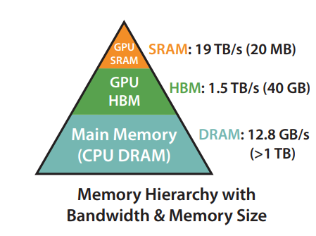
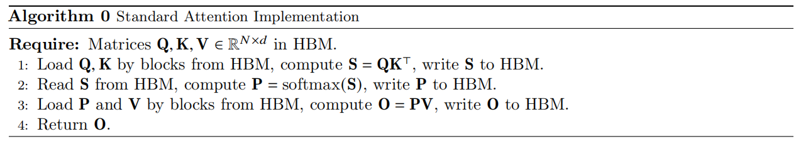
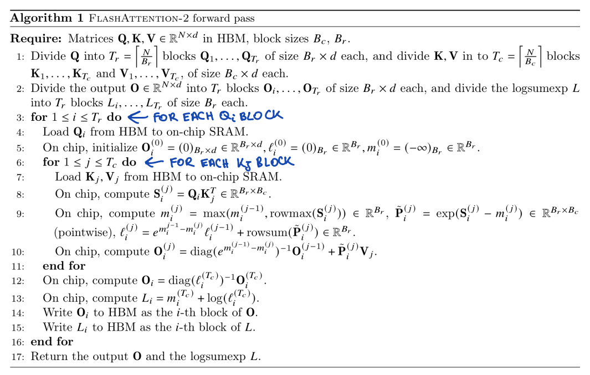
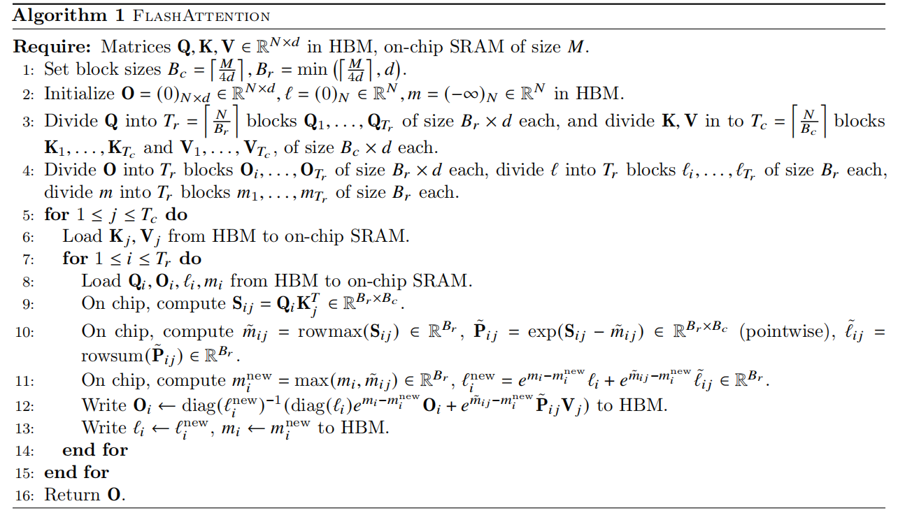

# FlashAttention Forward Pass

## 目录
1. [GPU中的HBM与SRAM：仓库与工作台](#gpu-中的-hbm-与-sram仓库与工作台)
   - [HBM(High Bandwidth Memory)](#hbmhigh-bandwidth-memory-远端的巨大仓库)
   - [SRAM(On-chip Static RAM)](#sramon-chip-static-ram-旁边的超快工作台)
2. [FlashAttention主要处理的是Attention的哪个部分](#flashattention-主要处理的是-attention-的哪个部分)
   - [标准Attention的三个步骤](#standard-attention的步骤)
   - [关键差异](#关键差异)
3. [FlashAttention-2的Forward过程详解](#flashattention-2-的-forward-过程详解)
   - [第一阶段：任务分块(Tiling)](#第一阶段任务分块tiling)
   - [第二阶段：外层循环(Loop over Q blocks)](#第二阶段外层循环loop-over-q-blocks)
   - [第三阶段：内层循环(Loop over K, V blocks)](#第三阶段内层循环loop-over-k-v-blocks)
   - [第四阶段：收尾与写回](#第四阶段收尾与写回)
4. [FlashAttention-1 和 FlashAttention-2 的 Forward 过程对比](#flashattention-1-和-flashattention-2-的-forward-过程对比)

## GPU中的HBM与SRAM：仓库与工作台

要理解FlashAttention的核心优势，必须先理解GPU的两种存储层级。它们在速度和容量上存在巨大的差异。简单来说，HBM容量大，速度慢。SRAM容量小，速度快。

### HBM(High Bandwidth Memory) —— 远端的巨大仓库

* 定义：这是GPU的主显存。当你加载模型或输入数据时，数据首先存储在这里。
* 特点：容量非常大（例如40GB/80GB），但读写速度相对较慢。
* 瓶颈：在计算过程中，如果频繁从这里读取巨大的中间结果，计算单元会因为等待数据而停滞 (Memory Bound)。

### SRAM(On-chip Static RAM) —— 旁边的超快工作台

* 定义：这是直接集成在GPU计算单元(SM)内的高速缓存。
* 特点：速度极快（比HBM快一个数量级），但容量极小（通常每块计算单元只有几百KB）。
* 核心策略：FlashAttention的设计哲学，就是尽可能把数据搬运到这个“工作台”上进行高密度的计算，算完后再把最终结果运回“仓库”，从而避免在“仓库”和“工作台”之间反复搬运不必要的中间数据。
## FlashAttention主要处理的是Attention的哪个部分

FlashAttention并不是只优化了某一步，而是通过算子融合(Kernel Fusion)，将标准Attention机制中的三个步骤整合成了一个过程。**FlashAttention的设计哲学就是尽可能在SRAM中完成计算，避免频繁访问HBM。**
### Standard Attention 的核心步骤解析

在深入了解之前，我们需要明确几个前置条件（Require）：
- 矩阵 $\mathbf{Q}, \mathbf{K}, \mathbf{V}$：分别代表 Query（查询）、Key（键）和 Value（值）矩阵。
- N 是序列长度（Sequence Length，比如一段文本有多少个 Token），d 是每个 Token 的向量维度（Head Dimension）。
- HBM (High Bandwidth Memory)：高带宽内存，您可以直接将其理解为 GPU 的全局显存。它的特点是容量大，但读写速度相对 GPU 内部的缓存（SRAM）来说非常慢。

标准的注意力公式是如下所示，在硬件上，它被拆解成了以下三步：

$$\mathbf{O} = \text{softmax}(\mathbf{Q}\mathbf{K}^\top)\mathbf{V}$$

1. 第 1 步：计算注意力分数 $\mathbf{S}$   - 操作：从显存 (HBM) 加载 $\mathbf{Q}$ 和 $\mathbf{K}$，计算 $\mathbf{S} = \mathbf{Q}\mathbf{K}^\top$。
   - 痛点：生成的中间矩阵 $\mathbf{S}$ 的大小是 $N \times N$。算完后，算法需要把这个庞大的矩阵写回显存 (HBM)。

2. 第 2 步：计算注意力权重 $\mathbf{P}$   - 操作：从显存 (HBM) 重新读取刚才存进去的 $\mathbf{S}$，对其执行 Softmax 激活函数，得到概率矩阵 $\mathbf{P} = \text{softmax}(\mathbf{S})$。
   - 痛点：矩阵 $\mathbf{P}$ 的大小依然是 $N \times N$。算完后，又要把它写回显存 (HBM)。

3. 第 3 步：计算最终输出 $\mathbf{O}$   - 操作：从显存 (HBM) 中加载 $\mathbf{P}$ 和 $\mathbf{V}$，计算乘积得到最终结果 $\mathbf{O} = \mathbf{P}\mathbf{V}$，其维度变回了 $N \times d$。
   - 操作：最后将 $\mathbf{O}$ 写回显存 (HBM)。

总结：
当序列长度 $N$ 变大时（例如处理长文档），N*N 的中间矩阵 $\mathbf{S}$ 和 $\mathbf{P}$ 会呈平方级爆炸。您可以观察到，算法中包含大量的 "write to HBM" 和 "Read from HBM"。在实际的 GPU 运算中，计算乘积（FLOPs）其实非常快，但是把巨大的 $N \times N$ 矩阵在“计算单元”和“显存”之间来回搬运，消耗了绝大部分的时间。这就如同一个加工能力极强的工厂，其吞吐量却受限于低效的物流运输；GPU 强大的算力被频繁且耗时的显存 I/O 操作所拖累，导致整体运算效率极低。

### 关键差异

- 传统Attention：深受显存带宽瓶颈（Memory Bound）的限制。它必须将计算过程中产生的巨大中间矩阵 $S$ 和 $P$（维度均为 $N \times N$）显式地写入HBM再重新读取，导致了大量的冗余显存访问。
- FlashAttention：利用Tiling（分块）和Online Softmax技术，在高速SRAM内一次性完成所有计算步骤。它避免了在HBM中实体化（Materialize）任何 $N \times N$ 的中间矩阵，仅将最终大小为 $N \times d$ 的结果 $O$ 写回HBM，从而实现了显存访问的线性复杂度 $O(N)$。

## FlashAttention-2的Forward过程详解

FlashAttention-2的前向过程是基于分块(Tiling)和在线Softmax(Online Softmax)的循环方法。以下是该过程的详细步骤：

### 第一阶段：任务分块(Tiling)

首先，将存储在HBM中的大矩阵 Q, K, V 切分成小块，以便能够加载入SRAM。

-   Q 被分为 Tr 个块，每块大小为 Br x d。
-   K 和 V 被切分为 Tc 个块，每块大小为 Bc x d。

### 第二阶段：外层循环(Loop over Q blocks)

算法开始遍历Query的每一个块(Qi)。

1.  加载数据：将当前的 Qi 块从HBM加载到SRAM。
2.  初始化统计量：在SRAM上初始化三个变量用于累积结果：
    -   Oi：输出矩阵块（初始化为0）。
    -   li：Softmax的分母累加和（初始化为0）。
    -   mi：行最大值（初始化为负无穷大）。

### 第三阶段：内层循环(Loop over K, V blocks)

对于当前的 Qi ，遍历所有的Key和Value块(Kj, Vj)。

1. 加载数据：将当前的 Kj 和 Vj 从HBM加载到SRAM。

2. 计算相似度：在SRAM上计算 Qi 和 Kj 的乘积，得到分数矩阵 Sij = Qi * Kj^T。

3. 在线修正(Online Softmax)：这是核心魔法所在。由于还是分块计算，无法预知全局最大值，所以需要动态修正：

   - 更新最大值：比较“旧最大值”和“当前块的最大值”，取较大者作为新最大值 m_new。
   - 计算未归一化概率：Pij_tilde = exp(Sij - m_new)
   - 更新分母来修正旧的累加和：l_new = l_old * exp(m_old - m_new) + rowsum(Pij_tilde)

4. 更新输出 O：

   O_new = diag(exp(m_old - m_new)) * O_old + Pij_tilde * Vj

   将旧的输出结果根据最大值的变化进行缩放(Rescale)，然后加上当前块计算出的贡献部分。这一步完全在SRAM中完成。

### 第四阶段：收尾与写回

当内层循环结束时，SRAM里的 Oi 已经累积了所有 K, V 块的信息，但还没有进行最终的归一化。

1.  最终归一化：在SRAM中执行 Oi = Oi / li。
2.  写回HBM：将计算完毕的 Oi 块写入HBM。
3.  保存统计量：将 Li（包括LogSumExp信息）写入HBM，供反向传播使用。

## FlashAttention-1 和 FlashAttention-2 的 Forward 过程对比

这里讨论一下 FlashAttention-1 (FA1) 和 FlashAttention-2 (FA2) 的区别。虽然我们在前面主要讲解了 FA2 的 Forward 过程，但了解其前身 FA1 的局限性，有助于更深刻地理解 FA2 优化的必要性。FA1 成功通过分块计算打破了显存读写瓶颈（Memory Wall），但其在具体执行流、计算冗余以及并行调度上仍有优化空间。FA2 通过对底层计算逻辑的三大核心重构，进一步提升了硬件利用率和整体运算速度。

以下是两代算法在 Forward 过程中的三大核心改动对比：

### 核心改动一：循环对调 (Loop Order Swap) —— 消除中间结果的反复读写

这一改动从根本上优化了计算最终输出块 $O$ 时的数据流转方式。**从注意力机制的数学本质来看，要计算出一个完整的输出块（例如 O1），必须让对应的查询块 Q1 与序列中所有的键值块（K1, V1、K2, V2 等）都进行一次交互和累加。**
* FA1 的缺陷（外层循环 K/V，内层循环 Q）：在 FA1 中，外层循环首先加载第一块 K1, V1。内层循环开始遍历 Q，当 Q1 与 K1, V1 交互后，会在 SRAM 中得到 O1 的局部结果。紧接着，内层循环需要去处理 Q2。由于 SRAM 容量极其有限，无法同时存放多个 O 块，系统必须将 O1 的局部结果写回（Write）HBM，以腾出空间给 O2。当外层循环推进到第二块 K2, V2 时，内层循环再次回到 Q1。为了将新计算的进度累加到之前的进度上，系统必须从 HBM 中重新加载（Load）之前存入的 O1 局部结果。这种为了算完一个完整的 Oi，而被迫对其部分结果进行“不断写入 HBM -> 重新加载到 SRAM”的操作，产生了庞大的显存读写开销。

* FA2 的破局（外层循环 Q，内层循环 K/V）：FA2 将循环顺序对调。外层循环首先锁定一块 Q1 加载到 SRAM 中。随后，内层循环开始遍历所有的 K, V 块。K1, V1 被加载进来与 Q1 交互，算出 O1 的第一部分；接着 K2, V2 被加载进来，算出的新结果直接在 SRAM 中与 O1 的第一部分进行累加。在整个内层循环期间，由于 Q1 被锁定，O1 的中间结果始终安全地驻留在高速 SRAM 中不断更新。直到所有的 K, V 块都遍历完毕，完整的 O1 才会被一次性写回 HBM。这彻底消除了 FA1 中对 Oi 反复读写的致命缺陷。

### 核心改动二：延迟缩放 (Deferred Scaling) —— 减少非矩阵乘法开销

GPU 的 Tensor Core 极其擅长执行矩阵的乘加运算，但对于非矩阵乘法（Non-MatMul FLOPs，例如计算指数 exp 或除法）处理效率相对较低。

* FA1 的计算冗余：在 FA1 的内层循环中，每次更新局部的输出 Oi 时，都需要立即除以当前计算出的局部指数累加和（即执行 diag(li)^-1 操作）。这导致在内层循环的极高频迭代中，伴随着大量的除法运算，拖慢了整体计算流水线。

* FA2 的延迟策略：得益于 FA2 的循环对调，Oi 在内层循环中持续驻留在 SRAM 中。因此，FA2 算法选择在内层循环中仅累加“未缩放（Unscaled）”的中间结果，完全规避除法操作。直到内层循环全部结束，准备将最终结果写回 HBM 之前的最后一刻，才执行唯一的一次除法归一化。这一策略大幅减少了内层循环中昂贵的非矩阵乘法计算量。

### 核心改动三：

序列长度维度的并行化 (Sequence Parallelism) —— 提升流式多处理器 (SM) 利用率

为了最大化 GPU 计算吞吐量，任务需要被高效地分发到 GPU 的多个流式多处理器（SM）上并行执行。

* FA1 的并行瓶颈：  FA1 主要是沿着 Batch Size（批次大小）和 Number of Heads（注意力头数）维度进行任务划分。在处理现代长文本大模型时，通常 Batch Size 设定较小，导致总任务数往往少于 GPU 的 SM 总数（如 A100 有 108 个 SM），从而造成大量 GPU 核心处于闲置状态，算力未能充分利用。

* FA2 的序列级分发：  FA2 充分利用了外层循环变为遍历 Q 分块的特性。由于每个 Qi 块的输出计算是完全独立的（计算 O1 并不依赖 O2 的结果），FA2 直接沿序列长度（Sequence Length）维度进行并行任务分发。即使在 Batch Size 为 1 的极端长上下文场景下，只要序列长度足够长，切分出的 Q 块数量就能产生充足的并行任务，从而填满所有的 GPU 核心，实现硬件资源的高效利用。