# Parallelism Basics

随着大语言模型（LLM）参数量的爆炸式增长，单张 GPU 的显存和算力已难以满足训练需求，分布式并行训练成为了大模型时代的“必修课”。本文档将带你深入理解并行训练的基石，从底层的集合通信原语出发，逐步解析 数据并行（Data Parallelism）、模型并行（Model Parallelism） 以及 激活并行（Activation Parallelism） 的原理及其进阶优化方案（如 ZeRO），为你揭开大模型高效训练背后的技术细节。

## 目录
- [Some basics about collective communication](#some-basics-about-collective-communication)
    - [All Reduce](#all-reduce)
    - [Broadcast](#broadcast)
    - [Reduce](#reduce)
    - [All Gather](#all-gather)
    - [Reduce Scatter](#reduce-scatter)
    - [Gather](#gather)
    - [Scatter](#scatter)
    - [All Reduce vs Reduce-Scatter + All-Gather](#all-reduce-vs-reduce-scatter-all-gather)
- [Different forms of parallel LLM training](#different-forms-of-parallel-llm-training)
    - [Data Parallelism](#data-parallelism)
        - [DDP](#ddp)
        - [Fatal flaw of DDP: Memory Explosion](#fatal-flaw-of-ddp-memory-explosion)
        - [Solution: ZeRO](#solution-zero)
        - [Zero-Stage1](#zero-stage1)
        - [Zero-Stage2](#zero-stage2)
        - [Zero-Stage3](#zero-stage3)
        - [Issues remain with data parallelism](#issues-remain-with-data-parallelism)
        - [Practical choice: DDP vs FSDP](#practical-choice-ddp-vs-fsdp)
    - [Model Parallelism](#model-parallelism)
        - [Layer-wise Parallelism](#layer-wise-parallelism)
        - [Pipeline Parallelism](#pipeline-parallelism)
        - [Zero bubble pipeline parallelism](#zero-bubble-pipeline-parallelism)
        - [Why pipeline parallelism?](#why-pipeline-parallelism)
        - [Tensor Parallelism](#tensor-parallelism)
        - [Why tensor parallelism?](#why-tensor-parallelism)
    - [Activation parallelism](#activation-parallelism)
    - [Other parallelism strategies](#other-parallelism-strategies)
        - [Context Parallel / Ring Attention](#context-parallel-ring-attention)
        - [Expert Parallel](#expert-parallel)
    - [Recap: LLM parallelism table](#recap-to-different-llm-parallelism)

## Some basics about collective communication

分布式训练的核心在于多张 GPU 之间的高效协作，而这种协作依赖于一套标准化的通信模式。以下是一些最基础的集合通信（Collective Communication）原语，它们构成了所有复杂并行策略的底层逻辑。

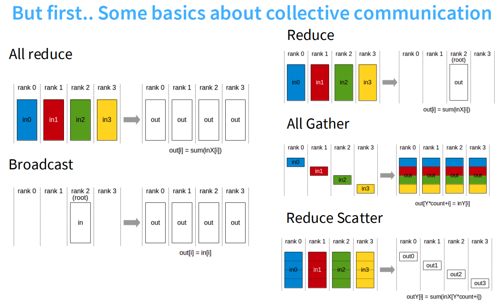

### All Reduce

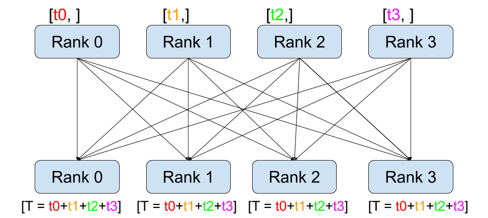

> 原理：所有节点(rank0-3)各自提供一份形状相同的初始数据(如in0, in1, in2, in3)。系统会对这些数据对应位置的元素执行归约操作（例如求和运算，即out[i] = sum(in X[i]))。
>
> 结果：计算完成后，所有节点都会获得一份一模一样的完整计算结果(out)。


---

### Broadcast

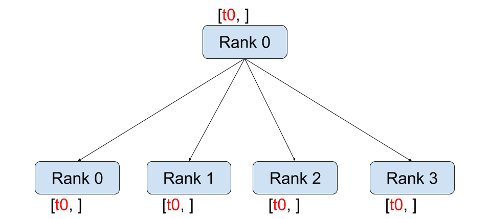

> 原理：数据从单个根节点出发，向所有其他节点进行单向传输。图中 Rank 0 作为根节点，持有一份初始数据 `[t0,]`。
>
> 结果：该数据被复制并分发给网络中的所有节点，使得所有节点都拥有一份相同的完整数据（即 `out[i] = in[i]`）。


---

### Reduce

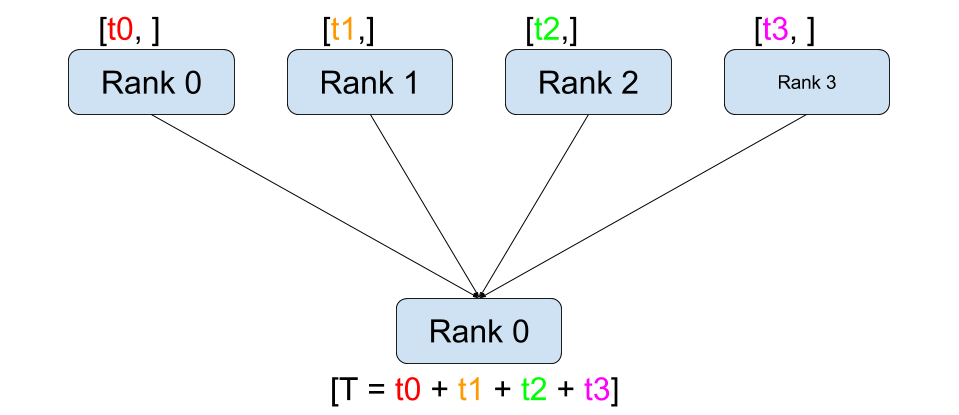

> 原理：与 All Reduce 类似，所有节点（Rank 0-3）各自提供一份数据（t0, t1, t2, t3），系统对这些数据执行归约操作（如求和）。
>
> 结果：不同之处在于，最终的完整计算结果 `[T = t0 + t1 + t2 + t3]` 只会发送给指定的根节点（图中为 Rank 0），其他节点不会获得该结果。


---

### All Gather

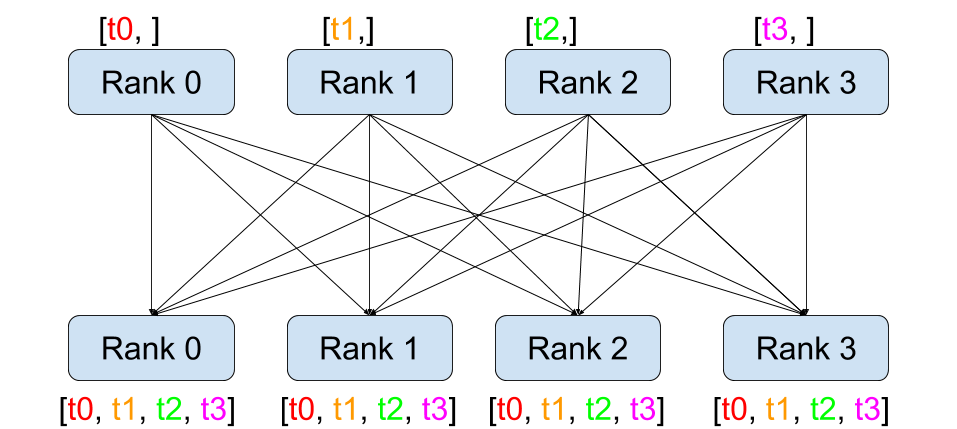

> 原理：每个节点最初各自持有一份数据片段（Rank 0 持有 t0，Rank 1 持有 t1，以此类推）。系统将所有节点的数据片段收集起来并拼接在一起。
>
> 结果：拼接完成后的完整数据 `[t0, t1, t2, t3]` 会被分发给每一个节点，让所有节点都拥有一份完整数据。与 All Reduce 的区别在于，All Gather 只做收集拼接，不做归约运算。


---

### Reduce Scatter

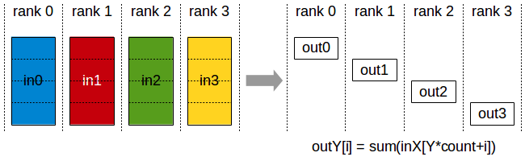

> 原理：这是 Reduce 和 Scatter 的结合。首先对所有节点提供的数据执行完全的归约计算（求和），得到一份完整的结果。
>
> 结果：系统不会将完整的结果发给单一节点或所有节点，而是将完整结果平均切分成多块，每个节点最终只获取属于自己的那一块输出（如 Rank 0 得到 out0，Rank 1 得到 out1，以此类推），对应公式为 `outY[i] = sum(inX[Y*count+i])`。


---

### Gather

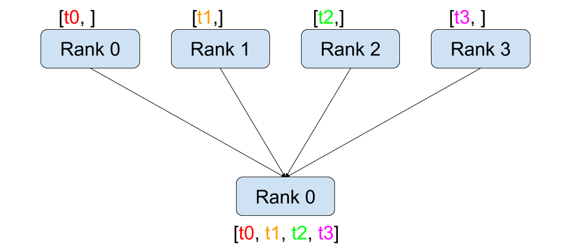

> 原理：每个节点最初各自持有一份数据片段（Rank 0 持有 t0，Rank 1 持有 t1，以此类推）。所有节点将自己的片段汇聚到根节点。
>
> 结果：与 All Gather 的区别在于，拼接完成后的完整数据 `[t0, t1, t2, t3]` 只会发送给根节点（图中为 Rank 0），其他节点不会获得完整数据。


---

### Scatter

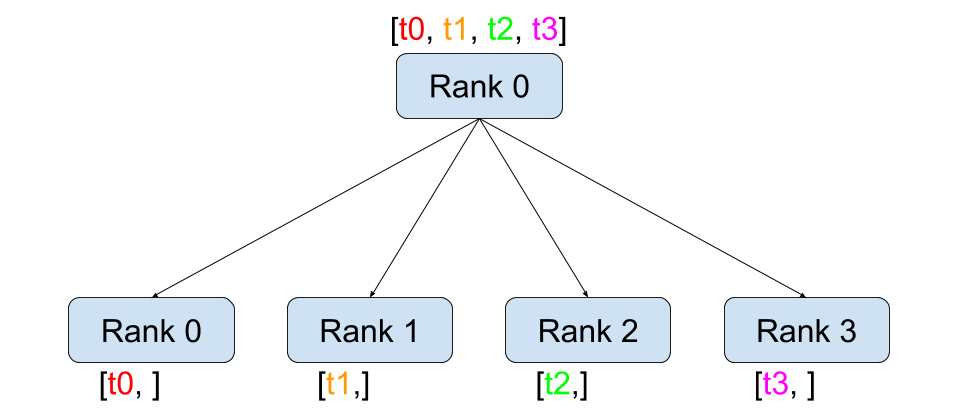

> 原理：与 Gather 相反。根节点（图中为 Rank 0）持有完整数据 `[t0, t1, t2, t3]`，将其切分成多个片段并分发出去。
>
> 结果：每个节点只接收属于自己的那一片数据（Rank 0 得到 t0，Rank 1 得到 t1，以此类推），根节点本身也只保留自己的片段。


---

### 💡 记忆小技巧 (Cheat Sheet)

面对这么多原语容易混淆？这里有个简单的记忆法则：

- **All- 前缀**：只要看到 `All`（如 `AllReduce`, `AllGather`），就意味着**所有设备**（All Ranks）最终都会得到一份完整的、一模一样的结果。
- **Gather**：想象把分散在各地的**数据片段**（Chunks）收集起来。`Gather` 是收集到一个地方，`AllGather` 是收集到所有地方。
- **Reduce**：想象把形状一样的多份数据“压”成一份。输入和输出的**形状（Shape）是一样的**，只是数值被聚合了（比如求和、取平均）。
- **Scatter**：与 `Gather` 相反，是把一份完整的数据**切分**（Slice）并发给不同的设备，每个设备只拿一部分。

在了解了分布式计算中的五种基础集合通信操作之后，我们接着来看一个在实际大模型训练中非常关键的通信细节：如何通过组合这些基础操作来突破显存和带宽的瓶颈。


---

### All Reduce vs Reduce-Scatter + All-Gather

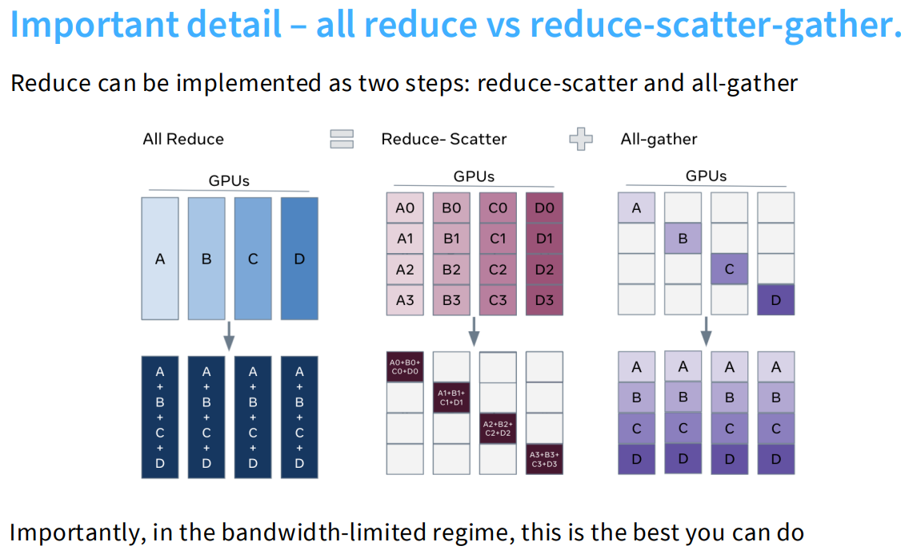

在分布式模型训练中，全归约 (All Reduce) 是一个极其重要的通信过程。根据原理，一次 All Reduce 操作实际上可以被完全等价地拆解为两个独立的步骤来实现：归约散播 (Reduce-Scatter) 和全收集 (All-Gather)。

以下是使用 PyTorch 分布式包（`torch.distributed`）实现的示例代码，展示了这种等价性：

```python
def collective_operations_main(rank: int, world_size: int):
    """This function is running asynchronously for each process (rank = 0, ..., world_size - 1)."""
    setup(rank, world_size)

    # 1. 直接执行 All-reduce
    dist.barrier()
    tensor = torch.tensor([0., 1, 2, 3], device=get_device(rank)) + rank
    print(f"Rank {rank} [before all-reduce]: {tensor}", flush=True)
    dist.all_reduce(tensor=tensor, op=dist.ReduceOp.SUM, async_op=False)
    print(f"Rank {rank} [after all-reduce]: {tensor}", flush=True)

    # 2. 拆解执行：Reduce-scatter
    dist.barrier()
    input = torch.arange(world_size, dtype=torch.float32, device=get_device(rank)) + rank
    output = torch.empty(1, device=get_device(rank))
    print(f"Rank {rank} [before reduce-scatter]: input = {input}, output = {output}", flush=True)
    dist.reduce_scatter_tensor(output=output, input=input, op=dist.ReduceOp.SUM, async_op=False)
    print(f"Rank {rank} [after reduce-scatter]: input = {input}, output = {output}", flush=True)

    # 3. 拆解执行：All-gather
    dist.barrier()
    input_gather = output  # 使用 reduce-scatter 的输出作为输入
    output_gather = torch.empty(world_size, device=get_device(rank))
    print(f"Rank {rank} [before all-gather]: input = {input_gather}, output = {output_gather}", flush=True)
    dist.all_gather_into_tensor(output_tensor=output_gather, input_tensor=input_gather, async_op=False)
    print(f"Rank {rank} [after all-gather]: input = {input_gather}, output = {output_gather}", flush=True)

    print("Indeed, all-reduce = reduce-scatter + all-gather!")
    cleanup()
```


---

#### 1. 原始的 All Reduce

最初，4 个 GPU 各自持有一份完整的数据块（分别标记为 A、B、C、D，在训练中通常代表计算出的梯度）。如果不加拆解直接执行 All Reduce，系统会将所有 GPU 对应位置的数据相加，最终让每个 GPU 都直接获得一份完整且相同的求和结果 (A+B+C+D)。


---

#### 2. 拆解第一步：Reduce-Scatter

在这个等价的两步法中，第一步是执行 Reduce-Scatter。

每个 GPU 首先将自己的数据切分成 4 个等份的片段（例如数据 A 被切分为 A0, A1, A2, A3）。随后，所有 GPU 对这些片段进行局部求和，但关键在于每个 GPU 最终只保留整个求和结果的四分之一。例如，第一个 GPU 只负责收集并保存 A0+B0+C0+D0，第二个 GPU 保存 A1+B1+C1+D1，以此类推。


---

#### 3. 拆解第二步：All-Gather

第二步是执行 All-Gather。

每个 GPU 把自己在上一步算好的那部分片段（即图中的深紫色结果块）发送并广播给其他所有的 GPU。当每个 GPU 都收集齐了所有其他 GPU 发来的片段后，将它们拼接在一起，最终大家得到的数据状态与直接执行 All Reduce 的结果完全一致。


---

#### 4. 为什么优先选择这种拆解方案？

表面上看，All Reduce 的最终结果与 Reduce-Scatter 加 All-Gather 完全相同，那么为什么要费力拆解呢？关键答案在于 通信效率。

> 假设你强行执行最原始的 All-Reduce，你需要指定一个中心节点（比如 GPU0）来收集所有人的数据并进行求和。在这个瞬间，GPU0 的接收带宽会被彻底挤爆，而其他 GPU 在发完数据后只能原地闲置干等。这就像一条单车道的独木桥，所有流量都要挤过一个节点，造成巨大的瓶颈。

与此相反，当我们把操作拆分为Reduce-Scatter加All-Gather后，系统采取了一种全员并发的切片接力策略。这允许集群中的每一张显卡在同一时刻都在发送和接收不同片段的数据。这相当于把单车道的独木桥改造成了多车道双向行驶的并行高速，让所有显卡的上传和下载通道都被完美填满，彻底压榨出硬件的网络吞吐潜力。在受限于网络带宽的集群环境中，这种拆解方式是底层系统能达到的最优通信效率。

这种机制之所以如此重要，是因为它构成了后续 ZeRO 优化器 和 FSDP（完全分片数据并行） 的底层通信逻辑。通过这种拆解，系统不仅避免了在网络中瞬间传输海量的完整状态，而且让单卡可以按需存留数据片段，极大地缓解了训练千亿参数模型时的显存压力。

---

## Different forms of parallel LLM training

掌握了基础的通信原语后，我们就可以构建更宏大的并行训练架构。针对大模型的训练瓶颈，业界发展出了多种并行模式，主要包括数据并行、模型并行以及流水线并行等。本节将重点剖析这些并行策略的工作机制及其演进。

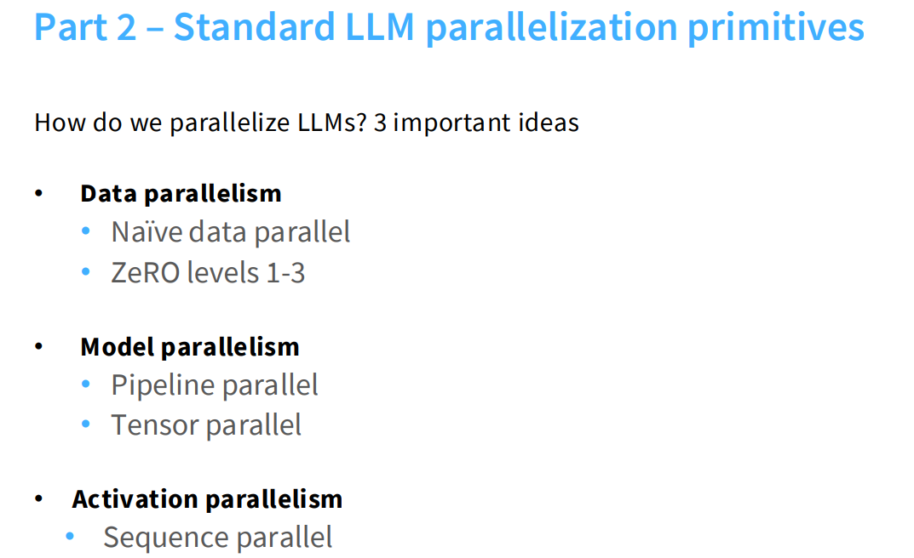


---

### Data Parallelism

数据并行（Data Parallelism, DP）是目前应用最广泛的并行策略。它的基本直觉是“人多力量大”——通过增加计算节点来吞吐更多的数据，从而加速训练过程。

具体来说，数据并行的运作机制如下：

1.  数据切分 (Data Sharding)：核心思想是切分数据而不是切分模型。将一个总大小为 $B$ 的数据批次 (batch) 均匀分配到 $M$ 台机器上。
2.  模型副本 (Model Replication)：为了独立计算，集群中的每一张 GPU 都必须维护一份完整的模型副本。
3.  独立计算 (Independent Computation)：每台机器独立处理分配到的 $B/M$ 个样本，计算局部梯度。
4.  梯度同步 (Gradient Synchronization)：所有机器汇集各自的梯度进行同步，确保所有 GPU 使用相同的梯度更新参数，从而保持模型一致。


---

#### DDP

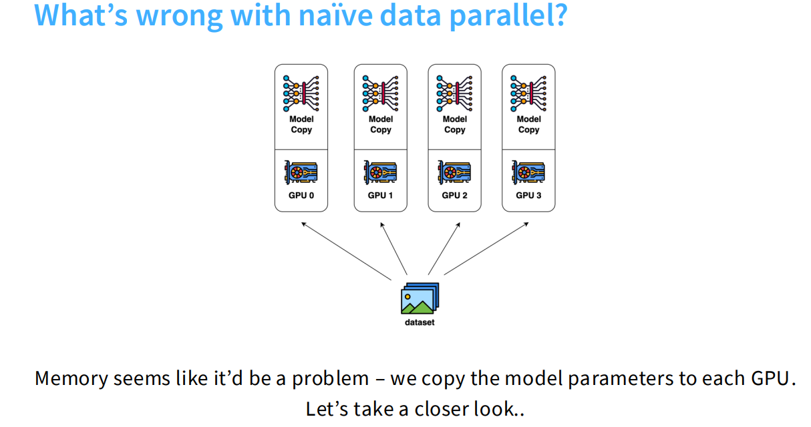

在工程实现上，这一类“每张 GPU 保留完整模型副本、各自计算局部梯度、再做全局梯度同步”的数据并行，最典型就是 PyTorch 的 DDP (`DistributedDataParallel`)。可以用下面这段最小训练循环来直观看到其行为：

```python
# 初始化分布式环境
dist.init_process_group(backend="nccl")
rank = dist.get_rank()
device = torch.device(f"cuda:{rank}")

# 每个进程创建自己的模型副本
model = GPT(cfg).to(device)
model = DDP(model, device_ids=[rank])

# 训练循环
for step in range(50):
    x, y = loader.next_batch(device)
    _, loss = model(x, y)

    optimizer.zero_grad()
    loss.backward()  # DDP 在反向传播时自动 all_reduce 梯度
    optimizer.step()
```

上面这行 `loss.backward()` 是关键：DDP 会在反向传播过程中对各参数梯度自动执行 `all_reduce`，把所有 GPU 的梯度聚合（等价于求平均），随后每张卡再用一致的梯度进行参数更新。因此在本文语境下，这里的数据并行就是“DDP 这一范式”（不做 ZeRO/FSDP 分片）。

> 实践里还需要配合 `DistributedSampler`：因为每个进程独立读取数据，如果直接使用普通 DataLoader，不同进程可能读到重复样本；`DistributedSampler` 用于保证各进程拿到不重叠的数据子集。

性能分析 (Performance Analysis)：

- 计算扩展性 (Compute scaling)：优秀。每张 GPU 只需要处理 $B/M$ 个样本，计算负载随节点数线性降低。
- 通信开销 (Communication overhead)：中等。每个批次需要传输约 2 * params 的数据量（用于梯度聚合）。只要计算时间足够长（Batch 够大），通信开销通常是可以接受的。
- **内存扩展性 (Memory scaling)：极差 (无扩展性)。这是其致命弱点。每一张 GPU 都必须存下完整的模型参数、梯度和优化器状态。增加 GPU 数量不会减少单卡的显存压力。**


---

#### Fatal flaw of DDP: Memory Explosion

虽然计算量被平摊到了多台机器上，但它的核心规则是：每一张 GPU 都必须完整加载一份和别人一模一样的模型副本。这意味着，无论你往集群里增加多少张显卡，单张物理显卡的内存压力丝毫没有减轻。单张 GPU 根本装不下大多数大型模型。

为什么单卡显存会不够用？

在如今的大语言模型 (LLM) 混合精度训练下，每一个模型参数实际上需要消耗高达 16 bytes 的单卡显存。这 16 bytes 的构成极其奢侈：

- 2 bytes 用于存放 FP16 或 BF16 格式的模型权重
- 2 bytes 用于存放 FP16 或 BF16 格式的梯度
- 12 bytes 全部被优化器状态 (Optimizer state) 吞噬，用来存放高精度的 SGD 主权重以及 Adam 动量参数等

实际后果：死于单卡容量天花板

**按照上述 (4+K) * params 的消耗公式（其中 K 代表优化器状态，通常为 12），如果你要训练一个 100 亿参数的模型，单单是让模型及状态静态地躺在显存里，单卡就需要高达 160 GB 的空间。而目前主流的顶级显卡容量很多只有 80 GB。朴素数据并行因为无法把这 160 GB 的数据拆分到不同卡上，导致任务直接 OOM (显存溢出) 崩溃。**

以常见的 7B 参数模型为例，仅模型权重本身，不同精度下的显存占用差异已经相当显著：

| 精度 | 每参数字节数 | 7B 模型权重显存 |
|------|-------------|----------------|
| FP32 | 4 bytes | ~28 GB |
| FP16 / BF16 | 2 bytes | ~14 GB |
| INT8 量化 | 1 byte | ~7 GB |
| INT4 量化 | 0.5 bytes | ~3.5 GB |


---

#### Solution: ZeRO

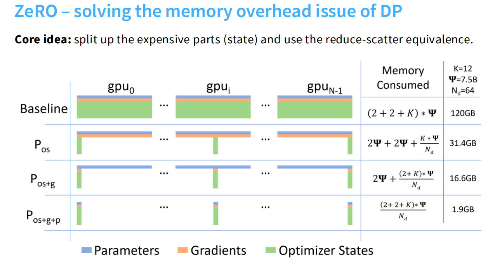

上文我们提到了 DDP 的致命缺陷：单卡显存不够用。ZeRO (Zero Redundancy Optimizer) 的思路是：分拆昂贵的部分（即参数、梯度、优化器状态），并用 Reduce-Scatter 等价的通信方式在卡间协同。

图中蓝色表示模型参数 (Parameters)，橙色表示梯度 (Gradients)，绿色表示优化器状态 (Optimizer States)。下面按图中四行从基线到 ZeRO 三阶段依次说明。

- 基线 (Baseline)：传统数据并行下，每个 GPU 都完整保存一份模型参数、梯度和优化器状态。单卡显存占用为 $(2+2+K) \times \Psi$，其中 $\Psi$ 为参数量（单位与权重存储一致），K 为优化器状态对应的系数（如 12）。在示例配置 $K=12, \Psi=7.5B, N_d=64$ 下，每卡约 120 GB。

- $P_{os}$ 阶段（仅分片优化器状态）：只对优化器状态做分片，将其均匀分布到 $N_d$ 张 GPU 上；模型参数和梯度仍在每张卡上各保留一份完整副本。单卡显存公式为 $2\Psi + 2\Psi + (K \times \Psi)/N_d$，示例中约 31.4 GB。相比基线，显存显著下降。

- $P_{os+g}$ 阶段（分片优化器状态与梯度）：在 $P_{os}$ 基础上，梯度也进行分片并分布到各卡，只有模型参数仍在每张卡上完整保留。单卡显存公式为 $2\Psi + (2+K) \times \Psi/N_d$，示例中约 16.6 GB。显存进一步降低。

- $P_{os+g+p}$ 阶段（参数、梯度、优化器状态全分片）：参数、梯度和优化器状态全部按 $N_d$ 分片，每张卡只存自己那一份。单卡显存公式为 $(2+2+K) \times \Psi/N_d$，示例中约 1.9 GB。这是 ZeRO 下显存最省的一档，单卡负载随 GPU 数量增加而近似线性下降。


---

#### Zero-Stage1

ZeRO Stage 1 是 ZeRO 系列优化的第一步，它主要针对显存占用中的“大头”——优化器状态 (Optimizer States) 进行优化。

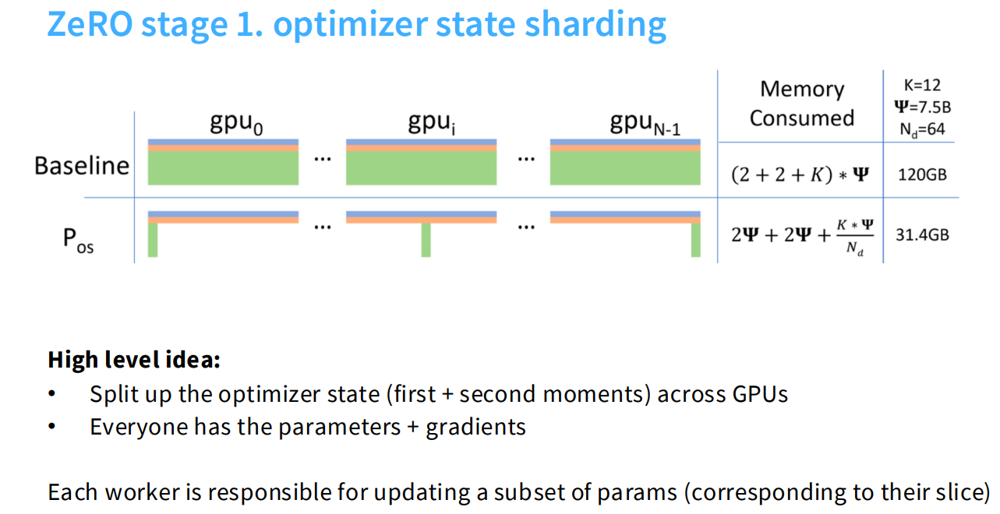

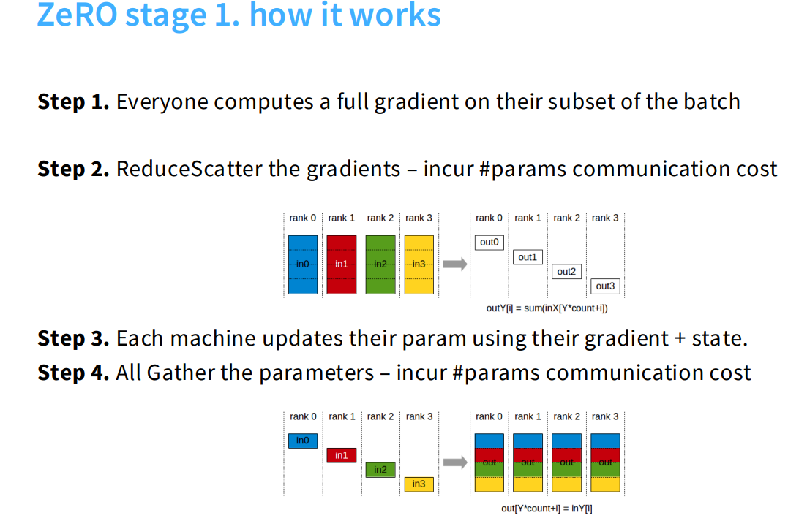

核心思想

- 优化器状态切片 (Optimizer State Sharding)：**ZeRO Stage 1 的主要策略是将占用大量内存的优化器状态打散，并分布到不同的 GPU 上。**
- 保留参数和梯度：在切片优化器状态的同时，每个 GPU 依然会保留完整的模型参数和梯度。
- 分工更新：每个工作节点 (worker) 只需负责更新与其分到的优化器切片相对应的那部分参数。

ZeRO Stage 1 的具体运行过程可以分为以下四个步骤：

1.  计算局部梯度：每张 GPU 分别在各自被分配到的数据子集上执行前向与反向传播，计算出一份完整的局部模型梯度。此时，由于每台机器处理的数据不同，它们手里的梯度是不一样的。
2.  梯度的规约与分发 (Reduce-Scatter)：集群通过 Reduce-Scatter 集合通信操作，对所有 GPU 计算出的梯度进行全局求和 (Reduce) 并切片分发 (Scatter)。
    -   关键变化：在此步骤之后，每台 GPU 不再持有完整的梯度，而是只保留了全局梯度的一部分切片（对应其负责的优化器状态）。
    -   此步骤的通信开销约等于模型的总参数量。
3.  分片参数更新：每台 GPU 结合刚刚收集到的专属梯度切片，以及本地维护的优化器状态（如动量、方差等），独立完成其负责的那部分模型参数的更新。
4.  全局参数同步 (All-Gather)：最后，各 GPU 通过 All-Gather 集合通信操作，将自身更新后的参数切片广播给全网。
    -   最终状态：整合完毕后，所有 GPU 再次拥有完整且一致的最新模型参数，准备进入下一轮迭代。
    -   该操作同样会产生约等于模型总参数量的通信开销。


---

#### Zero-Stage2

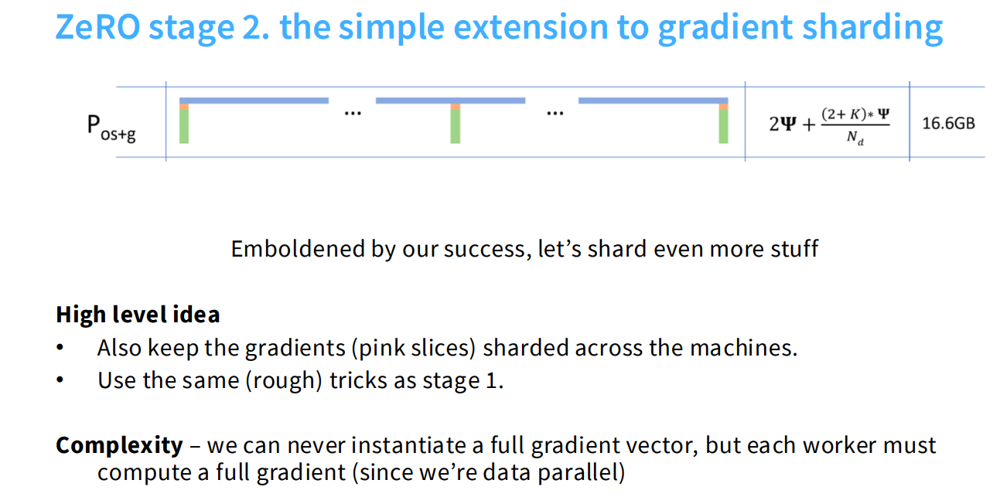

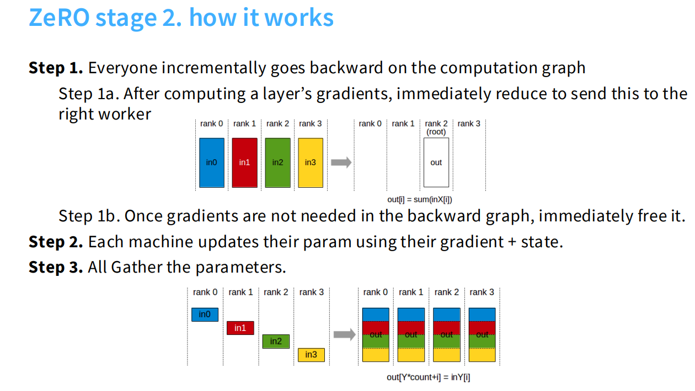

**ZeRO Stage 2 是在 Stage 1 的基础上更进一步的内存优化策略。它不仅切分了优化器状态，还把梯度 (Gradients) 也进行了切分。**

核心思想

- 梯度切分 (Gradient Sharding)：除了优化器状态，ZeRO Stage 2 将计算出的梯度也分散存储在各个 GPU 上。
- 处理复杂性：在数据并行模式下，每个工作节点 (worker) 必须计算完整的梯度。但为了节省内存，系统不能在内存中同时实例化完整的梯度向量，这就需要巧妙的通信和释放机制。

工作流程

ZeRO Stage 2 通过在计算图中“边算边通信、边算边释放”的策略来实现梯度切分：

1.  逐步反向传播：所有机器在计算图上逐步执行反向传播 (Backward pass)。
2.  即时规约与释放 (Reduce-Scatter & Free)：
    - 算出一层的梯度后，系统会立刻通过 Reduce-Scatter 操作将其发送给负责维护这部分梯度的特定工作节点。
    - 一旦这些梯度在反向传播计算图中不再被需要，系统就会立即释放它们占用的内存。
3.  参数更新：每台机器使用其分配到的切片梯度和优化器状态，独立更新属于自己的那部分模型参数。
4.  同步参数 (All-Gather)：最后，通过 All-Gather 操作将更新后的完整模型参数同步给所有机器。


---

#### Zero-Stage3

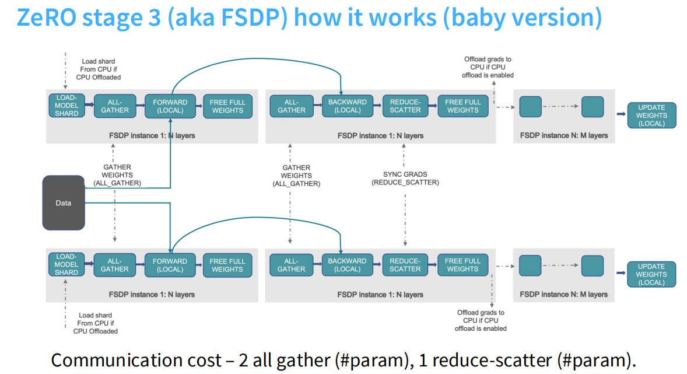

如果说 ZeRO Stage 1 和 2 是在“后勤（优化器状态和梯度）”上做文章，那么 ZeRO Stage 3（在 PyTorch 中常被称为 FSDP，Fully Sharded Data Parallel）则是彻底的“破釜沉舟”：它将模型最核心的参数 (Parameters) 也进行了切分。


---

##### 核心思想：按需获取，用完即弃

**在 Stage 1 和 2 中，每张显卡依然要在内存中完整保留一份模型参数。但在 Stage 3 看来，这太浪费了。它的核心理念是：仅在计算图运行到某一层时，才去向别人“借”参数；算完了，立刻把借来的参数“丢掉”（释放内存）。**


---

##### 工作流程 (Step-by-Step)

为了让您更清晰地理解，我们把它的过程拆解为前向传播和反向传播两个阶段：

前向传播阶段 (Forward Pass)：

1.  收集参数 (All-Gather)：当要计算模型的第 N 层时，当前 GPU 只有该层参数的一小块切片。它会通过 All-Gather 操作，从其他 GPU 处收集缺失的参数，拼凑出完整的第 N 层权重。
2.  本地计算 (Forward Local)：使用拼凑好的完整参数，完成这一层的前向计算。
3.  立刻释放 (Free Full Weights)：这是最关键的一步！一旦第 N 层的计算结束，GPU 会立刻清理掉刚刚“借”来的参数，内存里只保留最初属于自己的那一小块切片。

反向传播阶段 (Backward Pass)：

1.  再次收集参数 (All-Gather)：反向传播退回到第 N 层时，为了算梯度，GPU 再次通过 All-Gather 收集该层的完整参数。
2.  本地计算梯度 (Backward Local)：算出完整的梯度。
3.  整合并切分梯度 (Reduce-Scatter)：像 Stage 1/2 一样，把算好的梯度通过 Reduce-Scatter 操作进行规约合并，并把切片分发给对应的 GPU。
4.  再次释放参数 (Free Full Weights)：计算完毕，再次把借来的完整参数丢掉。


---

##### 最后一步：更新参数

所有前向和反向都跑完后，每个 GPU 上都安静地躺着属于自己的那一小块参数切片、梯度切片和优化器状态切片。大家各自更新本地的这一小块内容即可 (Update Weights Local)。


---

##### 成本与优化技巧

- **通信成本变高：相比于基础数据并行和 Stage 1/2 的 2 倍参数量的通信成本，Stage 3 的通信成本上升到了 3 倍参数量的通信成本（因为前向和反向各需要一次 All-Gather，反向需要一次 Reduce-Scatter）。**
- 如何掩盖延迟？：为了不让 GPU 因为等待通信而闲置，系统会使用“通信与计算重叠 (Overlapping communication and computation)”的技巧。也就是说，当 GPU 正在拼命计算第 N 层时，后台的网络其实已经在悄悄收集第 N+1 层的参数了。


---

##### 优缺点总结

- 最大的优势：内存节省达到了极致！只要你的 GPU 数量足够多，理论上你可以把无限大的模型塞进显存。
- 最大的局限：虽然它完美解决了模型参数占用的内存，但它无法减少前向传播时产生的激活值 (Activation) 内存占用。当模型层数非常深、序列非常长时，激活值依然会把显存撑爆。


---

#### Issues remain with data parallelism

尽管有了 ZeRO 这样强大的显存优化魔法，单纯依赖数据并行 (Data Parallelism, DP) 在面对超大模型训练时，依然会遇到难以逾越的瓶颈。

1. 计算扩展性面临的瓶颈 (Compute scaling)

- GPU 数量受限于批次大小 (Batch Size): 在数据并行的逻辑下，系统会将一个 Batch 的数据均匀分发给各个 GPU。这意味着，你的机器数量（GPU 数量）严格不能超过你的 Batch Size。而且当机器数量接近 Batch Size 时，通信开销会变得非常高昂。
- 批次大小的边际收益递减: 既然机器数量受限，那无限增大 Batch Size 不就行了？答案是否定的。文档图表明确指出，当 Batch Size 扩大到一定程度后，会进入“无效扩展 (Ineffective scaling)”区间。此时，盲目增加 Batch Size 带来的训练加速效果微乎其微。

2. 模型实在太大，依然装不下 (Models don't fit)

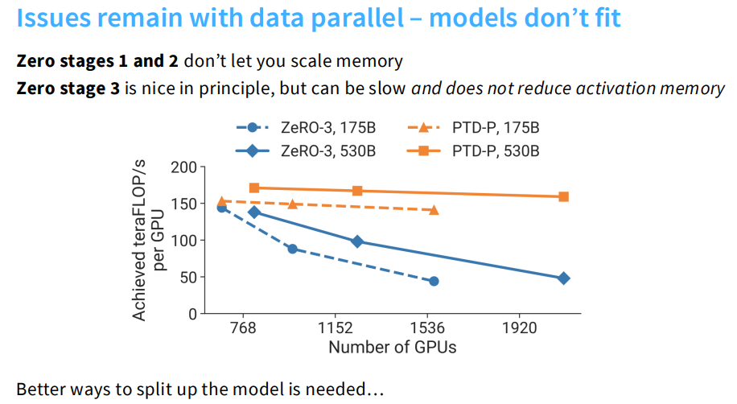

- ZeRO Stage 1 & 2 的物理极限: 正如我们之前讨论的，Stage 1 和 2 只是切分了优化器状态和梯度，并没有切分模型本身的参数。如果模型大到单张显卡连完整的参数副本都装不下，Stage 1 和 2 就彻底束手无策了，它们无法横向扩展模型参数的内存。
- ZeRO Stage 3 的性能折损与“激活值”诅咒: 虽然 Stage 3 在原理上能切分一切，但实际应用中代价不菲：
    - 计算速度变慢: 由于极为频繁的通信操作，Stage 3 可能会很慢。讲义中的图表清晰显示，随着 GPU 数量的增加，ZeRO-3 能够实现的算力吞吐量 (Achieved teraFLOP/s per GPU) 会出现明显下滑，表现远不如组合了模型并行的 PTD-P 策略。
    - 无法减少激活值 (Activation) 内存: 这是最致命的痛点。ZeRO 系列没有解决前向传播过程中产生的大量激活值占用的内存，这通常是导致 OOM (内存溢出) 的罪魁祸首。

正是因为这些痛点，业界意识到必须寻找更好的方法来切分模型本身，而不能仅仅切分数据。


---

#### Practical choice: DDP vs FSDP

1. 选 DDP 的情况：

- 你的模型在开启 `amp`（混合精度）后，单个 GPU 的显存能轻松塞下模型 + 优化器状态 + 激活值。
- 你追求极限的训练速度，且 GPU 显存富余。

2. 选 FSDP 的情况：

- 模型太大，单卡直接 OOM（显存溢出）。
- 你想在有限的硬件资源下，尽量增加 Batch Size。
- 正在训练 Transformer 类大模型（如 Llama、GPT 系列）。


---

### Model Parallelism

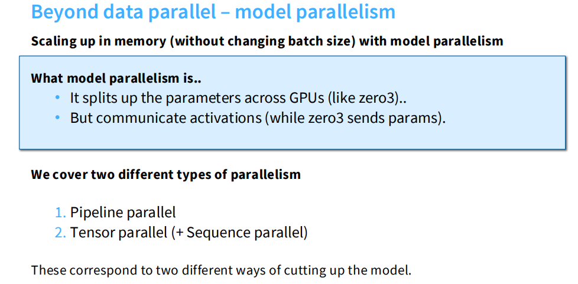

模型并行（Model Parallelism）的核心思想是：不切分数据，而是切分模型。

当模型大到单张 GPU 无法容纳时，我们可以将模型的不同部分分配给不同的 GPU。这与 ZeRO Stage 3 有些相似（都切分了参数），但它们在计算时的行为截然不同：

- ZeRO Stage 3：数据不动，参数动。
    - 在计算过程中，它需要频繁地将分散的参数 (Parameters) 收集 (All-Gather) 到本地，算完即弃。
    - 通信量巨大：通信开销与模型参数量成正比。
- Model Parallelism：参数不动，数据（激活值）动。
    - 参数固定在各 GPU 上。在计算过程中，它在 GPU 之间传输的是激活值 (Activations)（即上一层的输出）。
    - 通信量通常较小：激活值的大小在很多场景下远小于模型参数量。这使得模型并行在带宽受限的网络环境下（如跨机通信）更具优势。

模型并行主要分为两种类型，对应着切分模型的不同维度：
1.  流水线并行 (Pipeline Parallelism)：按层（Layer）切分，相当于在模型的“深度”方向上切一刀。
2.  张量并行 (Tensor Parallelism)：按矩阵（Tensor）切分，相当于在模型的“宽度”方向上切一刀。


---

#### Layer-wise Parallelism

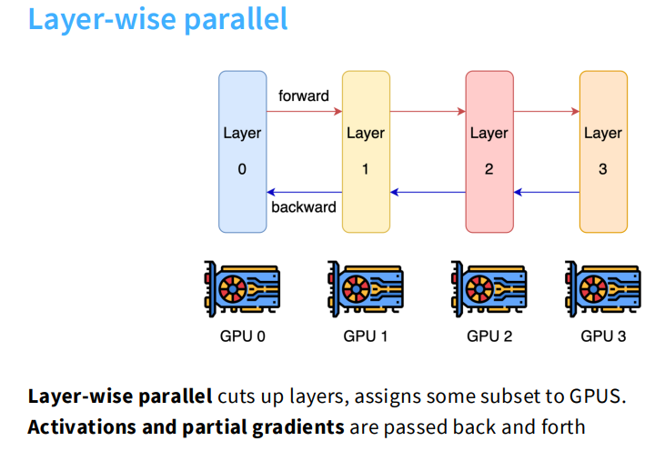

最直观的模型并行方式是层级并行 (Layer-wise Parallelism)。

- 原理：将模型的不同层分配给不同的 GPU。例如，GPU 0 负责第 1-4 层，GPU 1 负责第 5-8 层。
- 数据流：数据从 GPU 0 进入，计算完前 4 层后，将激活值（Activations）传递给 GPU 1；GPU 1 继续计算后传给下一个 GPU。反向传播时，梯度（Gradients）按相反方向传递。
- 致命缺陷：利用率极低 (Terrible Utilization)。
    - 在任意时刻，只有一张 GPU 在工作，其他 GPU 都在等待数据。
    - 如果有 N 张 GPU，每张 GPU 的活跃时间仅为 1/N。
    - 这就像一条生产线，如果每个人都必须等上一个人完全做完所有工作才能开始，效率将极其低下。


---

#### Pipeline Parallelism

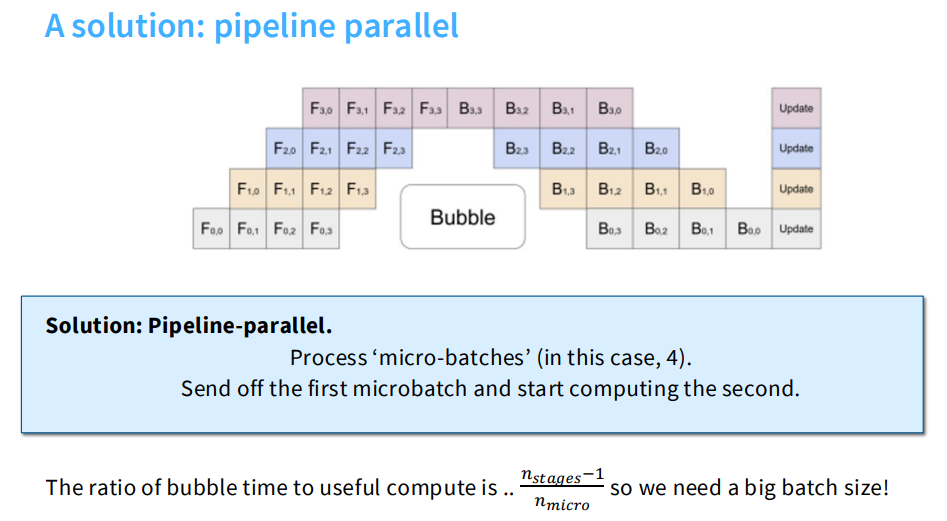

为了解决层级并行的利用率问题，流水线并行 (Pipeline Parallelism) 应运而生。

- 核心解决方案：微批次 (Micro-batches)。
- 工作机制：
    1.  将一个大 Batch 切分为多个小 Micro-batch（例如 4 个）。
    2.  GPU 0 处理完第一个 Micro-batch 后，立刻将其发送给 GPU 1，然后马上开始处理第二个 Micro-batch，而不是干等。
    3.  这样，多个 Micro-batch 就像流水线上的零件一样，让各个 GPU 尽可能同时忙碌起来。

- 气泡 (Bubble)：即便如此，流水线并行依然存在“气泡”时间（即图中空白部分），这是因为在流水线的启动和结束阶段，总有 GPU 处于等待状态。
    - 结论：为了减少气泡占比，提高效率，我们需要足够大的 Batch Size（即足够多的 Micro-batches）。


---

#### Zero bubble pipeline parallelism

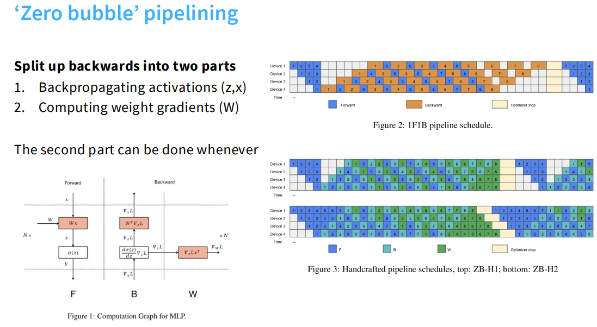

为了进一步压榨流水线的效率，业界提出了零气泡流水线 (Zero Bubble Pipeline Parallelism)。

- 核心思想：将反向传播 (Backward Pass) 拆分为两个独立部分：
    1.  计算输入梯度 (Backpropagating activations, $\nabla x$)：这是传给上一层继续反向传播所必须的，必须优先算。
    2.  计算权重梯度 (Computing weight gradients, $\nabla W$)：这是更新本层参数用的，不影响其他层，可以延后计算。
- 优化策略：利用这种拆分，系统可以灵活调度“权重梯度计算”的时间，将其填入流水线的空闲时间（气泡）中，从而尽可能填满 GPU 的算力，实现接近零气泡的高效运行。


---

#### Why pipeline parallelism?

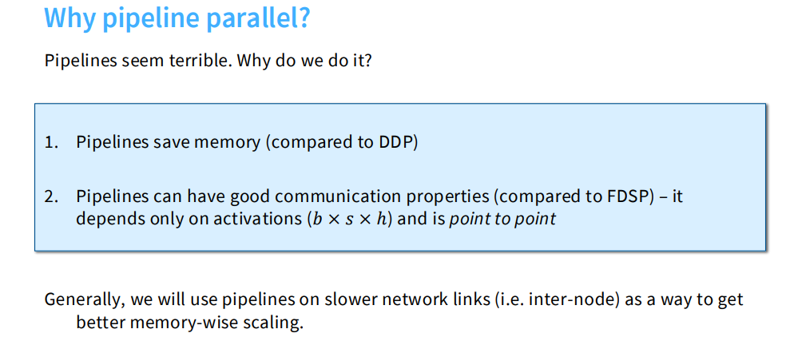

既然流水线并行有气泡，实现起来又复杂，为什么我们还需要它？

1.  节省显存 (Saves Memory)：相比于数据并行，流水线并行不需要每张卡都存完整模型，显存占用随 GPU 数量线性减少。
2.  通信效率高 (Good Communication)：
    - 它的通信是点对点 (Point-to-Point) 的，只在相邻 GPU 之间传输激活值。
    - 通信量仅取决于激活值大小 ($b \times s \times h$)，通常远小于参数量。
    - 相比之下，ZeRO Stage 3 需要全网广播参数，通信压力大得多。
3.  适用场景：由于通信量小且点对点，流水线并行非常适合跨节点 (Inter-node) 部署，即在不同机器之间使用慢速网络连接时，它是扩展显存的最佳选择。


---

#### Tensor Parallelism

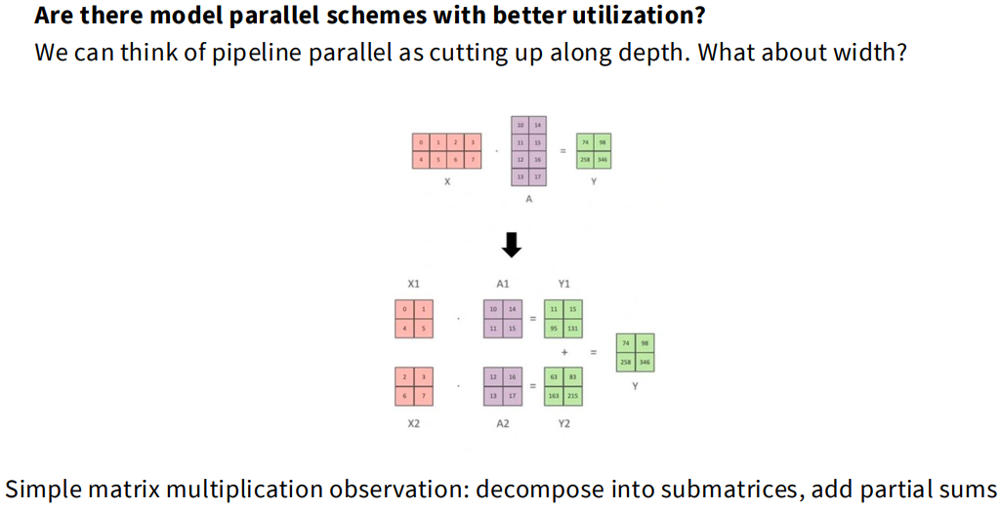

**张量并行 (Tensor Parallelism) 是另一种切分模型的思路。如果说流水线并行是在模型的“深度”方向（层与层之间）切一刀，那么张量并行就是深入到每一层的矩阵乘法内部，在模型的“宽度”方向切一刀。**

其核心观察是：矩阵乘法可以分解为子矩阵的计算，最后再将部分和相加。

例如，对于矩阵乘法 $X \cdot A = Y$：
- 我们可以将参数矩阵 $A$ 切分为多个列块（A_1, A_2）。
- 不同的 GPU 分别计算 $X \cdot A_1 = Y_1$ 和 $X \cdot A_2 = Y_2$。
- 最终的输出 $Y$ 就是 $[Y_1, Y_2]$ 的拼接。

在 Transformer 架构中，通常会交替使用两种切分方式以减少通信：
1.  列切分 (Column Parallel)：将权重矩阵按列切分。每个 GPU 计算一部分输出特征。
2.  行切分 (Row Parallel)：将权重矩阵按行切分。每个 GPU 计算一部分部分和 (Partial Sum)。

关于 Megatron-LM 如何将张量并行具体应用到 Transformer 的 MLP 和 Attention 模块，包括列并行、行并行的详细推导以及为什么整个模块只需一次 All-Reduce，可以参考：[Megatron-LM 张量并行：MLP 与 Attention 的实现原理](./megatron-lm.md)。


---

#### Why tensor parallelism?

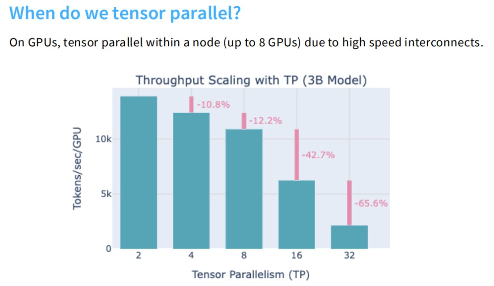

什么时候使用张量并行？

通常在 单机内部 (Intra-node) 使用（例如一台机器内的 8 张 GPU），因为张量并行需要极高的通信带宽。

优点 (Pros)：
1.  无气泡 (No Bubble)：所有 GPU 同时参与同一个矩阵乘法的计算，不存在流水线并行那样的空闲等待时间。
2.  低延迟 & 简单：不需要像流水线并行那样堆积 Micro-batch，适合小 Batch Size 场景；实现上也相对简单，只需替换线性层即可。

缺点 (Cons)：
1.  通信量巨大：这是其最大的短板。
    - 流水线并行的通信量是 $b \times s \times h$（点对点）。
    - 张量并行的通信量高达 $8 \times b \times s \times h$（每层都需要 All-Reduce）。
2.  扩展性受限：
    - 如上图所示，随着张量并行度 (TP) 的增加，特别是在跨越节点（如 TP=16, 32）时，吞吐量 (Tokens/sec/GPU) 会急剧下降。
    - 这是因为跨机网络的带宽远不如机内 NVLink，无法支撑如此高频的通信需求。

因此，张量并行通常被限制在单机（NVLink 域）内部使用。


---

#### Tensor Parallelism vs. Pipeline Parallelism

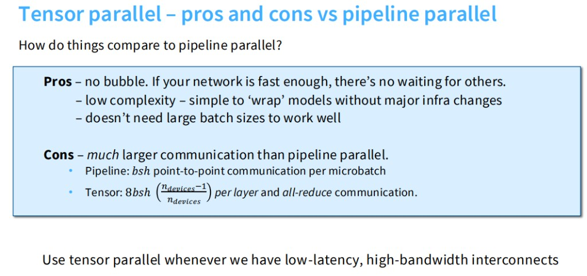

我们将张量并行 (Tensor Parallelism) 与流水线并行 (Pipeline Parallelism) 进行一个直观的对比总结：

张量并行 (Tensor Parallelism) 的优势 (Pros)：
- 无气泡 (No bubble)：如果网络足够快，GPU 之间不需要互相等待，所有计算同时进行。
- 低复杂度 (Low complexity)：实现相对简单，通常只需要包装模型层，不需要对基础设施做重大改动。
- 不需要大 Batch Size：即使在 Batch Size 较小的情况下也能高效工作。

张量并行 (Tensor Parallelism) 的劣势 (Cons)：
- 通信量巨大 (Much larger communication)：这是其主要瓶颈。
    - 流水线并行：每个 Micro-batch 只需要进行 $b \times s \times h$ 的点对点通信。
    - 张量并行：每一层都需要进行 $8 \times b \times s \times h \times (\frac{n_{devices}-1}{n_{devices}})$ 的 All-Reduce 通信。

结论：
- 请务必在拥有 低延迟、高带宽互联 (low-latency, high-bandwidth interconnects) 的环境（如 NVLink 连接的单机内部）中使用张量并行。
- 对于跨机器的连接，流水线并行通常是更好的选择。


---

### Activation parallelism

除了参数和梯度，激活值 (Activations) 也是显存消耗的大户。特别是在长序列训练中，激活值占用的显存甚至会超过模型参数。


---

#### Sequence Parallelism

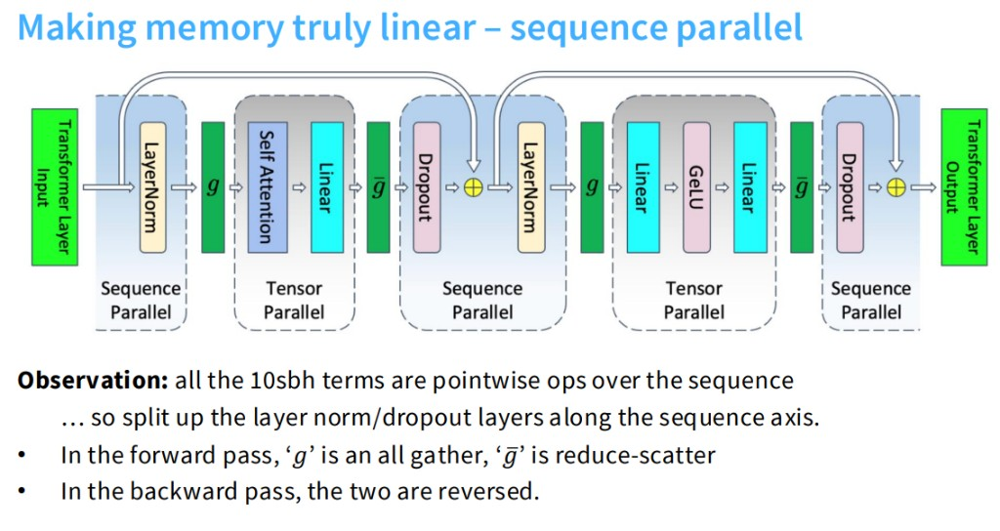

序列并行 (Sequence Parallelism) 是解决激活值显存瓶颈的关键技术。

- 核心观察：Transformer 结构中的 LayerNorm 和 Dropout 等操作是逐点 (Pointwise) 计算的，它们不依赖于序列中的其他位置。这意味着这些操作天然可以在序列维度上进行切分。
- 工作原理：
    - 切分：将输入序列沿着序列长度 (Sequence Length) 维度切分。每个 GPU 只负责计算序列的一部分（例如前 1/N 个 Token）的 LayerNorm 和 Dropout。
    - 通信：
        - 在进入 Attention（需要全序列交互）之前，通过 All-Gather 收集完整序列。
        - 在 Attention 之后，再通过 Reduce-Scatter 将结果切分回序列并行状态。
- 效果：通过这种方式，使得激活值显存占用随 GPU 数量线性减少，真正实现了显存的线性扩展。


---

### Other parallelism strategies

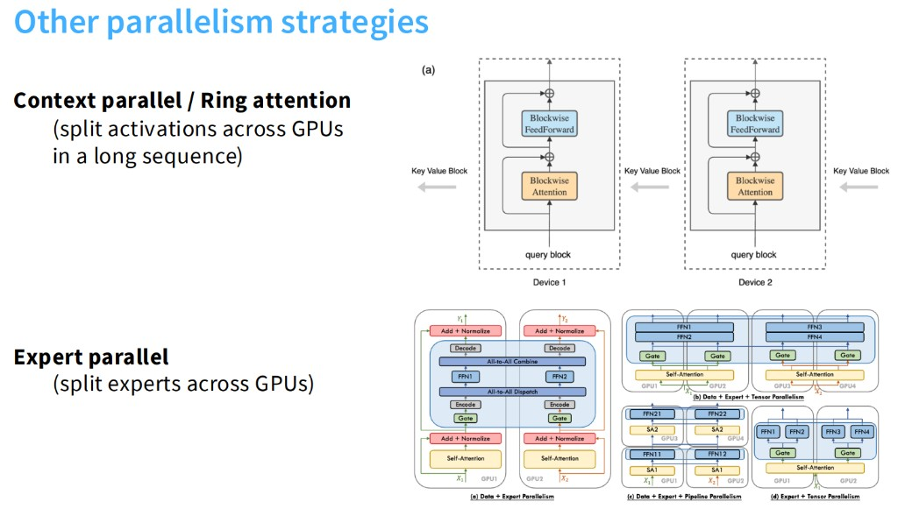

除了上述主流的并行策略，还有一些针对特定场景的并行方案：


---

#### Context Parallel / Ring Attention
- 目标：解决超长上下文（Long Context）训练时的显存和计算瓶颈。
- 原理：将长序列的激活值 (Activations) 切分到多个 GPU 上。利用环形通信 (Ring Attention) 算法，在不传输完整序列的情况下计算 Attention，从而支持百万级甚至更长的上下文窗口。


---

#### Expert Parallel
- 目标：针对混合专家模型 (Mixture-of-Experts, MoE) 的并行策略。
- 原理：将不同的“专家” (Experts) 网络分配给不同的 GPU。
    - 数据在进入 MoE 层时，根据路由 (Routing) 结果被分发到对应的 GPU 上进行计算。
    - 计算完成后，结果再被收集回原来的数据流中。


---

### Recap to different LLM parallelism

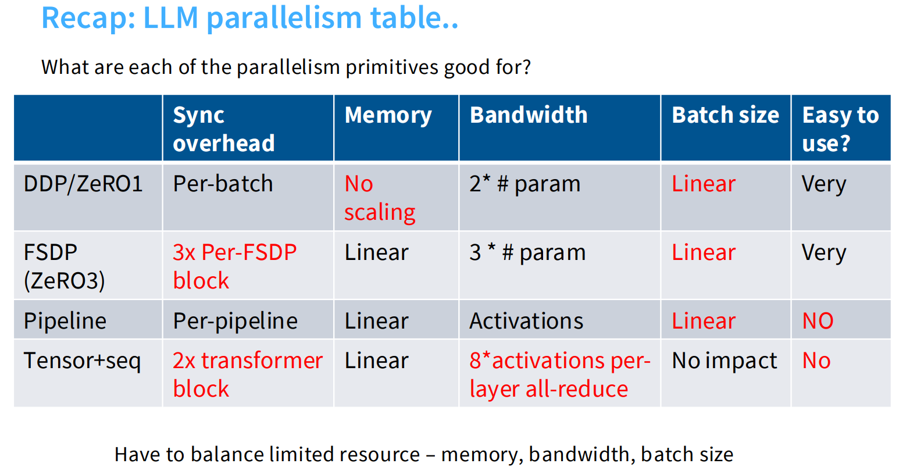

---

## 推荐阅读

- [一文讲清：AI大模型推理并行策略：DP、TP、PP、SP、EP的基本原理](https://mp.weixin.qq.com/s/q1Qcj3Ky1y2GzedH-SRHHA)
- [3 LLM面试篇 DP TP PP CP](https://mp.weixin.qq.com/s/DZTcd1smHUhcH5gZDjDGPQ)
