# Neural (LLM) Scaling Behaviors

在大语言模型（LLM）的工程实践中，如何高效地设计、训练和部署巨型模型是核心挑战。Scaling Laws提供了一种革命性的方法论：在小规模实验上建立可预测的幂律关系，然后外推到大规模场景。本文档系统梳理了LLM缩放行为的三大核心维度——数据与性能的关系、数据与模型大小的权衡、以及超参数的工程选择，涵盖从基础理论到Chinchilla最优训练策略的完整技术栈，为大模型的高效开发提供科学指导。

## 目录

- [Neural (LLM) scaling behaviors](#neural-llm-scaling-behaviors)
  - [1. Data vs performance](#1-data-vs-performance)
    - [一、 什么是数据缩放法则？(核心现象)](#一-什么是数据缩放法则核心现象)
    - [二、 为什么会出现对数线性规律？(底层理论)](#二-为什么会出现对数线性规律底层理论)
    - [三、 数据的"成分"与分布偏移](#三-数据的成分与分布偏移)
    - [四、 数据重复（Epochs）的边际递减效应](#四-数据重复epochs的边际递减效应)
    - [五、 数据筛选策略：质量与数量的权衡（QQT）](#五-数据筛选策略质量与数量的权衡qqt)
  - [2. Architecture & Hyperparameters (架构与超参数的缩放预测)](#2-architecture-hyperparameters-架构与超参数的缩放预测)
    - [一、 架构与优化器的降维打击](#一-架构与优化器的降维打击)
    - [二、 模型的“形状”：深一点还是宽一点？](#二-模型的形状深一点还是宽一点)
    - [三、 批次大小的动态极限（Critical Batch Size vs Loss）](#三-批次大小的动态极限critical-batch-size-vs-loss)
    - [四、 学习率的偏移与 μP 初始化](#四-学习率的偏移与-μp-初始化)
  - [3. Data vs model size (算力预算下的终极分配)](#3-data-vs-model-size-算力预算下的终极分配)
    - [一、 联合缩放法则（Joint Data-Model Scaling）](#一-联合缩放法则joint-data-model-scaling)
    - [二、 算力权衡：寻找最优的“包络线”](#二-算力权衡寻找最优的包络线)
    - [三、 Kaplan vs Chinchilla：大模型历史上的著名路线之争](#三-kaplan-vs-chinchilla大模型历史上的著名路线之争)
    - [四、 破案现场：为什么 Kaplan 当初会算错？](#四-破案现场为什么-kaplan-当初会算错)
    - [五、 寻找最优解的绝招：IsoFLOPs（等算力曲线）](#五-寻找最优解的绝招isoflops等算力曲线)
    - [六、 现实工程的“潜规则”：为何大家都不遵守 Chinchilla 法则了？（Over-training）](#六-现实工程的潜规则为何大家都不遵守-chinchilla-法则了over-training)

## Neural (LLM) scaling behaviors

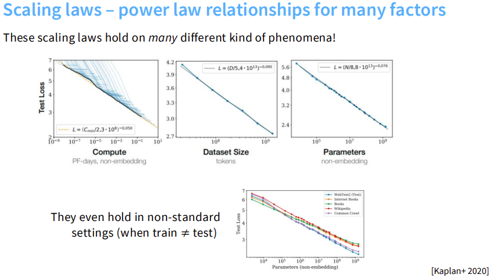

从这张总览图来看，我们可以清晰地看到，缩放法则（Scaling Laws）并非偶然现象，它广泛存在于多个维度中。模型的最终性能（Test Loss）主要和算力（Compute）、数据集大小（Dataset Size）以及参数量（Parameters）息息相关。当这三者中的任何一个呈指数级增长时，模型的性能都会呈现出高度可预测的对数线性提升（即图表中那条完美的直线）。更有趣的是，这种规律甚至在训练集和测试集分布不一致（Train $\neq$ Test）的非标准场景下依然稳稳成立。

### 1. Data vs performance

既然万物皆可 Scale，接下来我们先剥丝抽茧，来看看第一点：Data Scaling Laws（数据缩放法则）。

#### 一、 什么是数据缩放法则？(核心现象)

* 数据缩放法则探讨的是数据集大小与模型最终误差之间的数学关系。

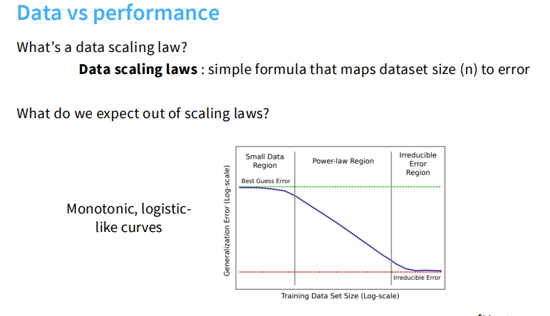

* 理想状态下，模型的泛化误差曲线是一条单调下降的 S 形（Logistic-like）曲线，包含三个阶段：

 * 第一阶段：盲猜误差区（Small Data Region / Best Guess Error）

 当训练数据极少时，模型根本没有足够的信息去学习任何有意义的规律，此时的泛化误差会停留在一个较高的平台上，接近于"瞎猜"的水平。这个平台对应图中绿色虚线（Best Guess Error），它代表了在信息极度匮乏时模型所能达到的理论上界。直觉上可以类比：如果你只见过 10 张猫的照片，你的识别能力和随机猜测差不了太多。

 * 第二阶段：幂律区（Power-law Region）

 随着数据量进入中等规模，模型开始真正"学到东西"，泛化误差进入快速、稳定的下降通道。这一阶段的曲线在对数-对数坐标下是一条直线，即误差与数据量之间满足幂律关系。这是整个 Scaling Laws 研究最核心的区域——误差下降的速度可预测、可外推，工程师可以据此在小规模实验上估算大规模训练的最终效果。

 * 第三阶段：不可约误差区（Irreducible Error Region）

 当数据量积累到足够大时，误差下降开始停滞，曲线趋于平缓，最终逼近一个固定的下界，即图中红色虚线（Irreducible Error）。这个下界来自于数据本身固有的噪声和模糊性，是任何模型都无法消除的，因此称为"不可约"误差。例如，语言中存在大量歧义句，即便给模型看遍全网数据，预测下一个词的损失也不可能降到零。

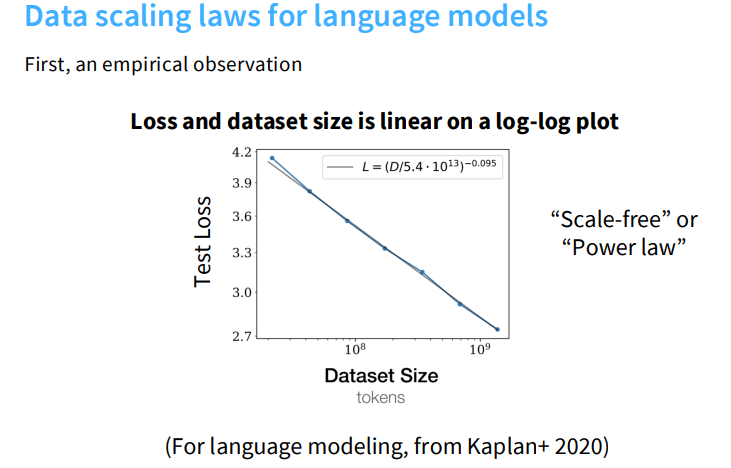

* 最惊人的经验观察是：在对数-对数（log-log）坐标图上，测试损失和数据集大小呈现出非常完美的线性关系。对于语言模型而言，这个关系可以精确拟合为如下公式，这种规律在学术上被称为"无标度（Scale-free）"或"幂律（Power law）"。

$$
L=(D/5.4\cdot10^{13})^{-0.095}
$$

#### 二、 为什么会出现对数线性规律？(底层理论)

* 为什么误差会在对数图上表现为一条直线？这是因为估计误差天然具有多项式衰减的特性。

* 举个简单的数学例子：假设我们要估计一个方差为 $\sigma^2$ 的高斯分布的均值。它的均方误差是 $\sigma^2/n$。如果我们将这个公式两边取对数，就会得到 $\log(\text{Error}) = -\log(n) + 2\log(\sigma)$。任何形式的 $1/n^\alpha$ 多项式衰减率，反映在图表上就是一条直线。

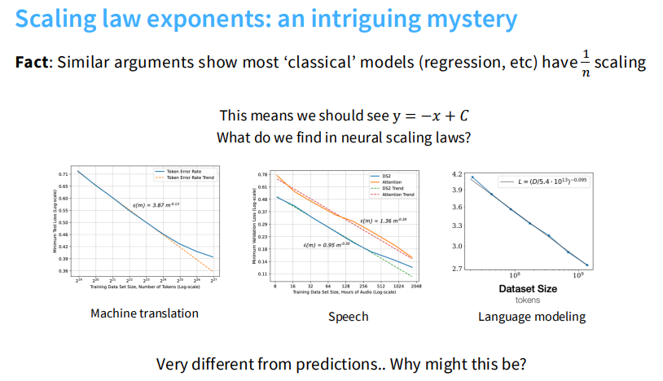

* 未解之谜：经典的回归模型通常呈现 $1/n$ 的衰减率（斜率为 -1）。但是神经网络在不同任务上的斜率却大不相同，例如机器翻译是 0.13，而语音识别是 0.30。

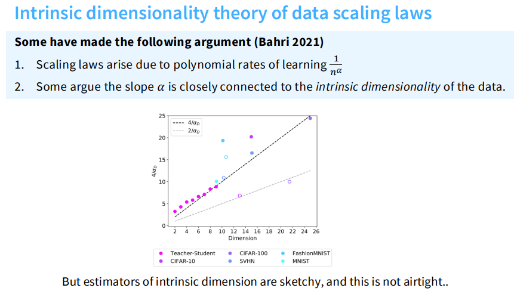

* 内在维度假说：理论上，灵活的非参数学习的缩放法则依赖于维度（例如 $n^{-1/d}$）。有学者提出，斜率指数 $\alpha$ 实际上与数据的"内在维度（Intrinsic Dimensionality）"密切相关。

#### 三、 数据的"成分"与分布偏移

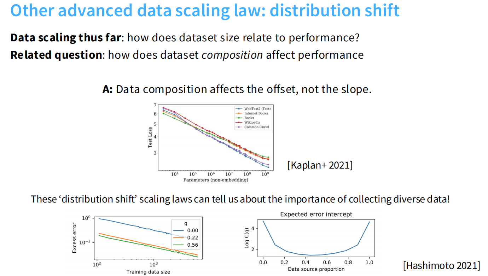

* 除了纯粹的数据量，数据的具体构成（Composition）会如何影响性能？
* 核心结论：改变数据来源或构成，只会影响对数曲线的截距（Offset），而不会改变斜率（Slope）。
* 从实验图表中可以看到，无论是 WebText2、普通书籍还是维基百科数据，它们的损失下降曲线都是平行的。这意味着，高质量、多样化的数据能直接降低你的误差起点，但随后下降的速度规律是一致的。

#### 四、 数据重复（Epochs）的边际递减效应

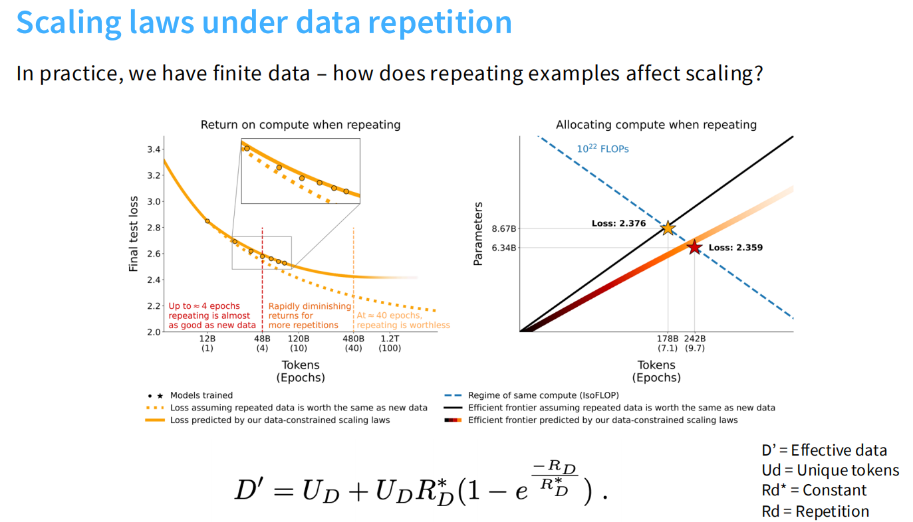

* 现实世界中的全新数据是有限的，如果我们对同一批数据重复训练（增加 Epochs）会怎样？
* 请观察图中的左侧图表（Return on compute when repeating）：黄色的虚线代表理想状态下“重复数据和新数据一样有效”的假设曲线。而橙色的实线则是“受数据限制”时的真实表现。结果显示，真实曲线在后期会严重偏离理想曲线，意味着重复数据的计算回报会极其迅速地递减。
* 经验法则：从图表中的关键节点可以看出，当重复次数在大约 4 个 Epochs 以内时（图中标注 48B 处），两条曲线几乎重合，说明其效果几乎等同于使用全新数据。但随着重复次数的继续增加，收益迅速衰减。如果重复次数达到约 40 个 Epochs（图中标注 480B 处），橙色曲线已经变得完全平缓，这意味着继续重复已经变得毫无价值。

#### 五、 数据筛选策略：质量与数量的权衡（QQT）

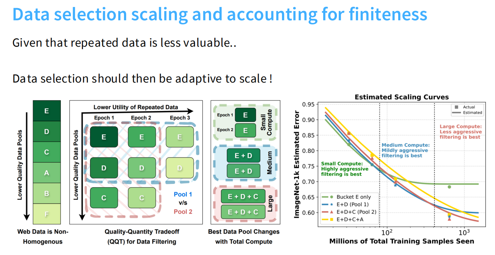

* 既然我们在上一节发现重复使用相同数据的价值极低，我们在构建数据集时的筛选（Filtering）策略就会面临一个两难的抉择：是要“少量但纯度极高的数据（必然导致高重复率）”，还是要“纯度略低但完全未见过的新数据”？这就是图中强调的“质量-数量权衡（Quality-Quantity Tradeoff，QQT）”的核心思想。
* 结合中间的架构图，我们可以将数据按质量从高到低分为 E、D、C 等不同的池子（Pool），并根据算力规模得出不同的自适应策略：
* 小算力（Small Compute）：请看最右侧的折线图（Estimated Scaling Curves），在图表的左侧（小算力区间），代表只用最高质量数据（Bucket E only）的绿线误差最低。因此最优解是采取“高度激进（Highly aggressive）”的过滤策略，宁缺毋滥。结合中间的图表，这相当于我们只在 E 池子里训练 1 到 2 个 Epoch。因为在算力预算有限的情况下，你能训练的 Token 总量本身就不多，用低质量数据“浪费”宝贵的训练步数是得不偿失的。
* 中等算力（Medium Compute）：最优解是“中度（Mildly aggressive）”过滤。此时数据质量与数量的边际收益开始接近平衡，最高质量的 E 池数据很快会被耗尽，我们需要引入质量稍次的 D 池数据（变为 E+D）。折线图中也显示，蓝线（E+D）在中段开始表现得更好。
* 大算力（Large Compute）：如果你拥有极大的算力，反而应该采取“较少（Less aggressive）”的过滤策略。看右侧折线图的末端，坚持纯净数据的绿线（Bucket E only）因为被迫进行了大量无效的重复训练，其 Loss 曲线已经彻底平缓（停滞不前）。相反，包含了更低质量数据的红线（E+D+C）甚至黄线（E+D+C+A）反而实现了更低的误差。在这个阶段，重复训练带来的收益衰减，其代价远比略低一点的数据质量严重得多。

### 2. Architecture & Hyperparameters (架构与超参数的缩放预测)

在上一节中，我们探讨了数据（Data）维度的缩放法则，明确了优质、海量的数据是提升模型上限的基石。然而，仅仅准备好数据是不够的。当我们真正准备启动训练集群时，马上就会面临一系列微观且极其繁琐的工程抉择。在深度学习的工程实践中，超参数（如学习率、批次大小）和模型架构（如层数、维度）的搜索空间极其庞大。如果每次都在大模型上试错，算力成本将是毁灭性的。

幸运的是，缩放法则（Scaling Laws）为我们提供了一套“降维打击”的方法论：在极小规模的模型上进行廉价的超参数扫参，然后利用严格的数学规律，直接预测并外推到千亿参数的大模型上。

#### 一、 架构与优化器的降维打击

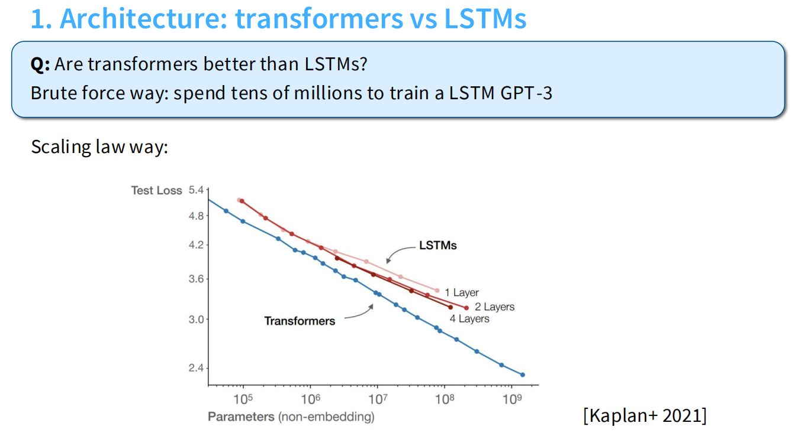

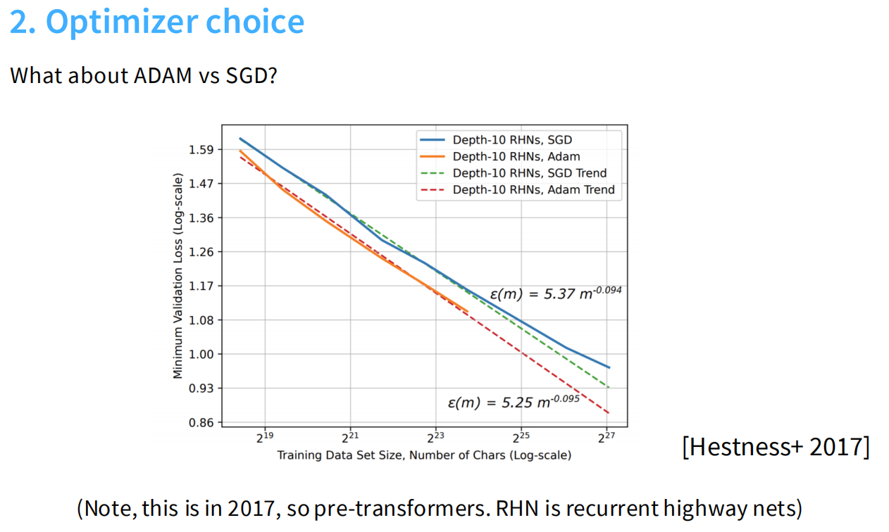

* 底层架构的命运分野（Transformer vs LSTM）：
  在早期的大模型探索中，选择哪种架构是一场巨大的赌博。如上方的 Transformer vs LSTM 扩展性对比图所示，我们可以发现，在模型参数量较小（横轴左侧）时，Transformer（蓝线）和 LSTM（黄线）的测试损失差异并不明显。但是，随着参数量的指数级增加，Transformer 呈现出了完美的、斜率陡峭的对数线性下降（幂律规律）；而 LSTM 的曲线在后期迅速变平，遭遇了无法突破的性能瓶颈。这从数学本质上证明了 Transformer 架构在“可扩展性（Scalability）”上的压倒性优势。

* 优化器的对决（Adam vs SGD）：
  如上方的 Adam vs SGD 优化器缩放曲线图所示，优化器的选择同样受制于高度可预测的缩放规律。我们可以清晰地看到，不仅 Adam 拟合出的整体 Scaling 曲线始终位于 SGD 的下方（意味着在同等参数下 Loss 更低），而且这种优势随着规模的扩大依然保持稳定。利用这一点，我们可以提前预判不同优化器在万亿参数下的表现差距，从而果断摒弃扩展性差的训练策略。

#### 二、 模型的“形状”：深一点还是宽一点？

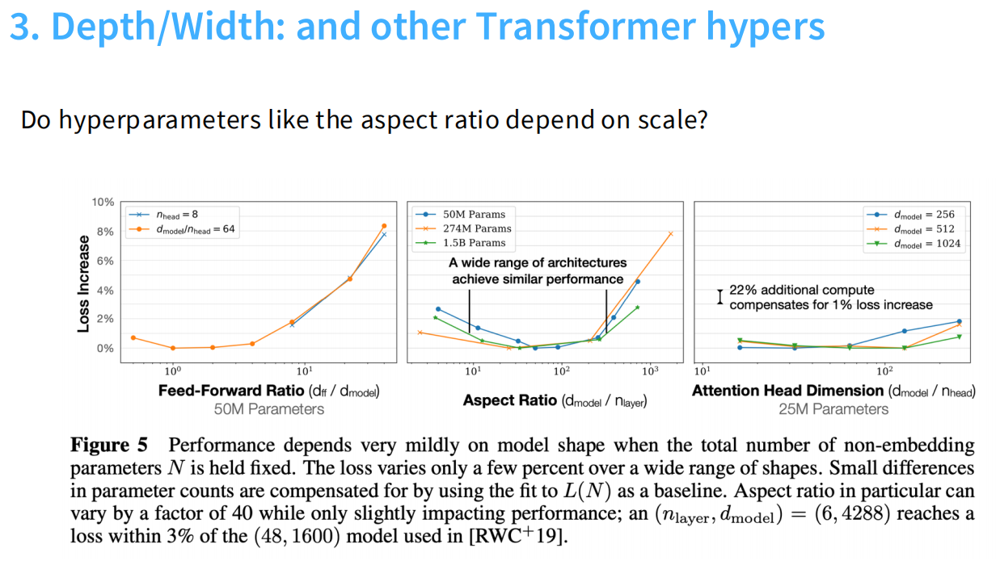

* 当确立了 Transformer 架构后，我们会面临一个经典的架构设计问题：在给定总参数量的前提下，模型到底是应该“做深（增加 Layer 层数）”还是“做宽（增加隐藏层维度 $d_{model}$）”？
* 令人惊讶的是，缩放法则揭示了一个极其宽容的工程现象：只要模型的总非 Embedding 参数量固定，模型的“形状（Shape）”对最终泛化性能的影响微乎其微。
* 如上方的宽高比鲁棒性图表所示，横轴代表模型的长宽比（$d_{model} / n_{layer}$）。图表中每一种颜色的折线代表一个特定参数量级别的模型。我们可以发现，这些折线在中间区域形成了一个极其宽广、平坦的“盆地（Basin）”。即使长宽比发生了高达 40 倍的剧烈变动，同一个参数量级别的模型，其最终的 Loss 上下浮动也仅有百分之几。
* 工程指导意义：这意味着在进行分布式训练设计时，我们不需要死磕某一个“完美的黄金长宽比”。相反，我们可以为了极致的显存优化、张量并行（Tensor Parallelism）或流水线并行（Pipeline Parallelism）的通信效率，灵活地调整模型的层数和宽度，而不用担心会损失核心的预测性能。

#### 三、 批次大小的动态极限（Critical Batch Size vs Loss）

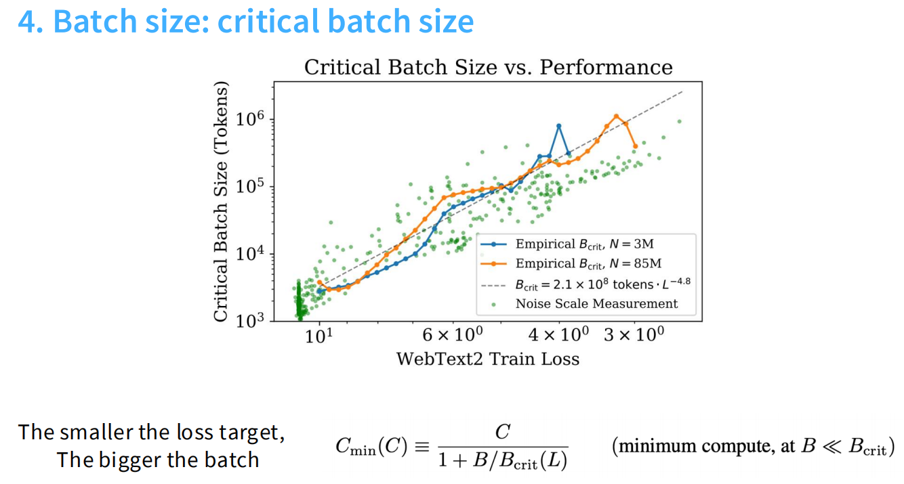

* 在分布式训练中，我们总是倾向于将全局批次大小（Global Batch Size）开得尽可能大，以榨干 GPU 集群的数据并行算力。但是，Batch Size 是不能无脑增大的，它存在一个“临界值（Critical Batch Size）”，超过这个值算力就会遭遇严重浪费。
* 那么，这个临界值是固定不变的吗？如上方展示的“临界批次大小与表现”图表所示，它其实是一个动态变化的物理量。让我们先对齐一下图表的横纵坐标：
  * 横轴（X轴）：代表模型在训练集上的损失（`WebText2 Train Loss`）。请特别注意它的数值排列——最左边是高 Loss，越往右数值越小。这意味着从左往右看，代表着模型训练得越来越好、越来越聪明的过程。
  * 纵轴（Y轴）：代表模型在当前阶段能够容忍的临界批次大小（`Critical Batch Size`），数值从底部的 $10^3$ 一路指数级飙升到了顶部的 $10^6$ Token。
* 图文对齐与核心规律：观察图中的蓝色和橙色折线，我们可以清晰地看到：随着向右移动（模型 Loss 不断下降），曲线呈指数级陡峭上升。这完美呼应了核心规律：你的目标 Loss 越小（模型训练得越好），模型能够容忍的 Critical Batch Size 就越大。
* 工程指导意义：在训练初期（图表左侧），模型还很“笨”，此时临界批次大小极小，强行使用大 Batch Size 无异于高射炮打蚊子，会导致右侧灰色的“无效缩放（Ineffective scaling）”和算力暴增；而在训练中后期，随着 Loss 降低，临界值飙升到了数百万 Token。这解释了为什么在训练千亿级别的大模型后期，我们可以安全地使用几百万 Token 的超大 Batch Size 来加速收敛。

#### 四、 学习率的偏移与 μP 初始化

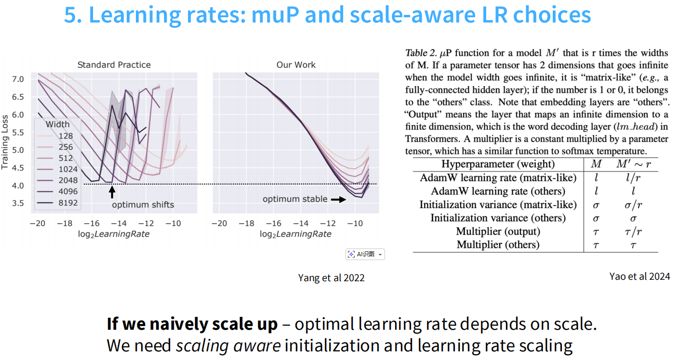

* 学习率（Learning Rate）及其调度策略是大模型训练中最脆弱、最容易导致训练崩溃的环节。
* 传统参数化的痛点：如上方左侧的图表（Standard Practice）所示，在使用标准初始化时，当我们逐渐增加模型的宽度（Width，从 128 增加到 8192），能够使 Loss 达到最低点的那个“最佳学习率”会不断地向左侧偏移（Optimum shifts）。这导致了一个极其致命的问题：我们无法在单卡上用小模型调好最优学习率，然后直接套用到集群里的大模型上。
* 到底什么是 $\mu P$（Maximal Update Parametrization）？
  * $\mu P$ 的全称是“最大更新参数化”。它的核心思想是：让模型在前向传播（激活值）和反向传播（梯度更新）时，不受模型宽度（Width）变化的影响。
  * 讲义中提到，当我们把一个模型的宽度放大 $r$ 倍时，$\mu P$ 会针对不同的权重矩阵应用一种“缩放感知的初始化”：比如对于矩阵乘法层（Matrix-like），它会强行将初始化方差和 AdamW 学习率缩小到原来的 $1/r$；而对于非矩阵层（Others，如 LayerNorm 或 Embedding），则保持不变。通过这种极其精细的乘积因子调整，它保证了无论模型多宽，各层的特征表达和梯度更新幅度都保持在一个稳定的量级。
* $\mu P$ 的破局与工程意义：如上方右侧的图表（Our Work）所示，在采用了 $\mu P$ 策略后，无论模型宽度如何疯狂扩张，各条曲线的最佳学习率低谷始终精准对齐在同一条垂直线上（Optimum stable）。
* 这意味着：利用 $\mu P$，我们可以先在极小的代理模型（Proxy Model）上进行低成本的扫参，找到最优的 Learning Rate 和相关的优化器超参数，然后自信地、一字不改地将这套参数直接“复制粘贴”到百亿、千亿级别的目标大模型上，极大地降低了炼丹的试错成本！

### 3. Data vs model size (算力预算下的终极分配)

在掌握了第一节的数据法则和第二节的架构与超参预测之后，我们其实已经具备了训练大模型的基础能力。但是，现实世界中有一个极其残酷的物理限制：算力（Compute/FLOPs）永远是有限且极其昂贵的。

当你拿到一笔固定的算力预算（例如一万张 H100 跑一个月）时，你马上就会面临一个宏观层面的灵魂拷问：这笔巨额算力，我到底是应该用来扩大模型的参数规模（Bigger Models），还是用来增加训练的数据量（More Data）？

如果模型太大而数据太少，模型就会吃不饱，算力被浪费在未充分训练的参数上；如果数据极多但模型太小，模型又会消化不良，缺乏足够的容量去吸收庞大的知识。因此，这一章节的核心目的，就是利用缩放法则，帮我们在极其昂贵的有限算力下，寻找那个模型参数与数据量互相成就的黄金分配比例。

#### 一、 联合缩放法则（Joint Data-Model Scaling）

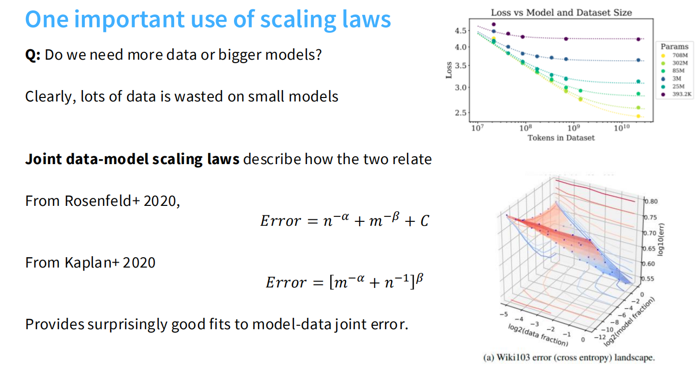

* 单一变量的增加总会遇到瓶颈：很显然，如果在只有几百万参数的小模型上使用海量数据，大量的计算会被完全浪费；反之，巨大的模型如果没有足够的数据喂养也是徒劳。为了解答如何完美分配算力，我们需要找到模型大小 m 和数据量 n 对误差的联合关系。
* 图表解析：如上方的 Loss vs Model and Dataset Size 图表所示，横轴是数据集大小（Tokens），不同颜色的点代表不同的模型参数量（从 393.2K 到 708M 不等）。我们可以清晰地观察到，没有任何一条曲线能仅凭数据量一直降到底，每种规模的模型最终都会不可避免地趋于平缓。
* 联合公式：学术界给出了描述这种联合关系的公式。例如 Kaplan 等人提出的 $Error = [m^{-\alpha} + n^{-1}]^{\beta}$，以及 Rosenfeld 提出的 $Error = n^{-\alpha} + m^{-\beta} + C$。这些公式出乎意料地极其精准，能完美拟合出模型规模与数据量共同作用的联合误差面。

#### 二、 算力权衡：寻找最优的“包络线”

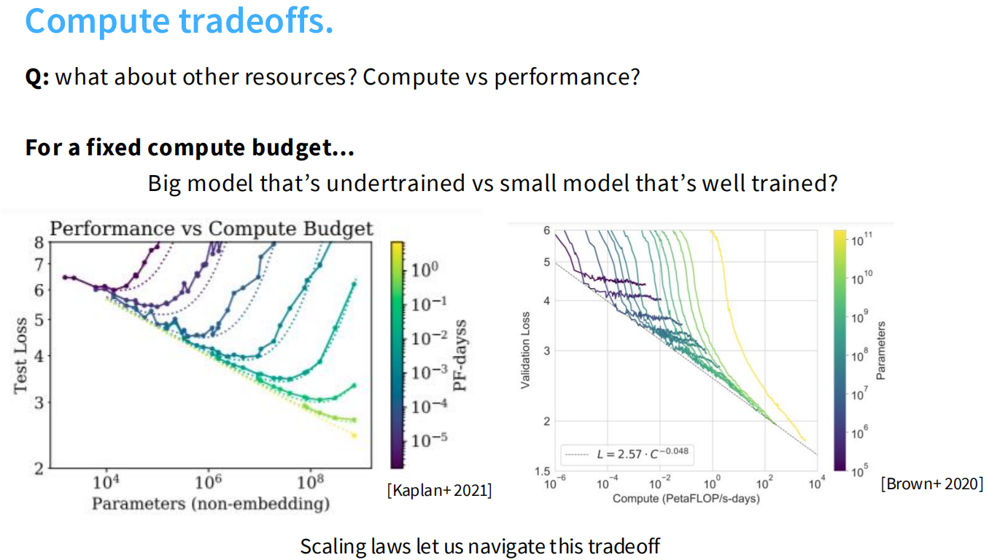

* 在固定的计算预算（Fixed compute budget）下，工程师必须做出取舍：是训练一个没有完全收敛的大模型，还是把一个小模型训练到极致？
* 图表解析：如上方 Performance vs Compute Budget 图表所示，横轴是消耗的算力（Compute），纵轴是测试损失（Test Loss）。图中那一条条呈鱼钩状向下延伸的彩色曲线，每一条都代表了一个特定参数量的模型在不同算力下的训练过程。
* 核心规律（包络线）：破局的关键在于，当我们把所有这些独立曲线的最低点（即每个模型在对应算力下的最优表现）连接起来时，它们形成了一条完美的、对数线性下降的包络线（Envelope）。在图表左下角，这条基准线被精确拟合为 $L = 2.57 \cdot C^{-0.048}$。这条线就像是一个指南针，指引我们在无数种参数与数据的组合中，直接定位到特定算力下能达到的性能天花板。

#### 三、 Kaplan vs Chinchilla：大模型历史上的著名路线之争

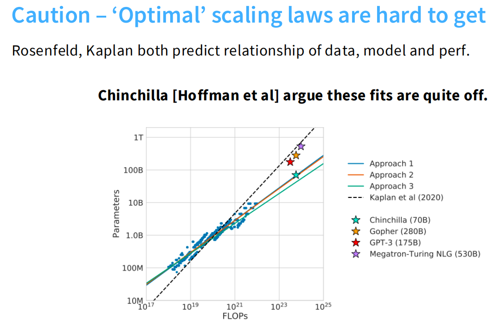

* 虽然联合缩放的框架被确立，但在具体的参数与数据的分配比例上，业界发生过一次极其重大的历史纠偏。
* 图表解析：如上方的 Parameters vs FLOPs 图表所示，横轴是算力（FLOPs），纵轴是最优的模型参数量（Parameters）：
  * Kaplan 法则（黑色虚线）：在 2020 年，Kaplan 团队得出结论，算力增加时，参数量的增长应远快于数据量。具体比例是：参数占 $a=0.73$，数据占 $b=0.27$。这条陡峭的黑线导致了像 GPT-3（红星，175B）和 Megatron-Turing NLG（紫星，530B）这种参数极其庞大、但数据相对较少的巨兽的诞生。
  * Chinchilla 法则（彩色实线）：到了 2022 年，DeepMind 的 Chinchilla 团队（Hoffmann等人）明确指出 Kaplan 算错了。他们认为模型参数量和训练数据量应该同比例缩放（即 $a=0.50, b=0.50$）。这意味着，以前的庞大模型都属于过度参数化且训练严重不足。图中的青色星星（Chinchilla 70B）就是严格遵守了这条更平缓的最佳实线而诞生的标杆。

#### 四、 破案现场：为什么 Kaplan 当初会算错？

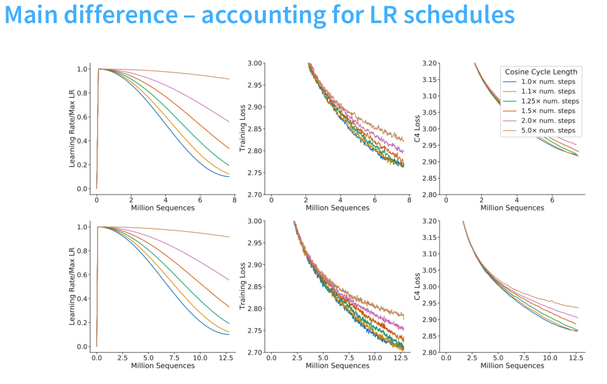

* 为什么全球最顶尖的团队会得出如此南辕北辙的结论？
* 图表解析：如上方的图表所示，核心的罪魁祸首在于学习率的调度（Learning Rate schedules），特别是余弦衰减周期（Cosine Cycle Length）的设置。
* 当测试不同规模的训练步数（Million Sequences）时，如果你像早期的研究那样，没有把学习率衰减周期与目标训练步数完美对齐，早早地把学习率降到了谷底（如图中较早平缓的蓝色和黄色曲线），模型后期的 Loss 下降就会受到极大阻碍。Chinchilla 团队在做实验时，极其严格地将每个模型的学习率衰减周期与目标训练 FLOPs 完美对齐，从而测量出了模型真实的性能潜力，这才成功推翻了 Kaplan 那个偏向大模型的错误结论。

#### 五、 寻找最优解的绝招：IsoFLOPs（等算力曲线）

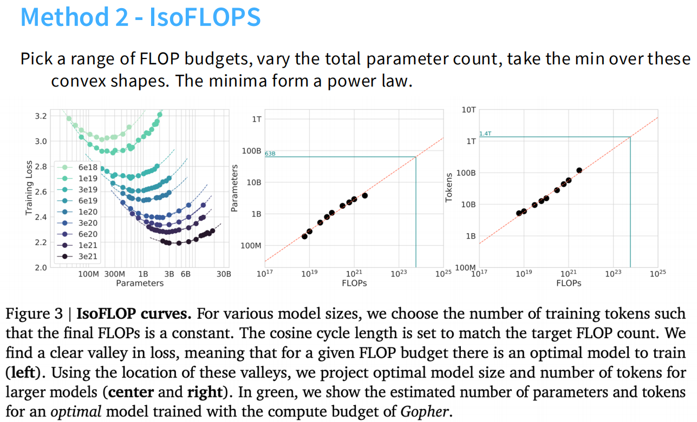

* 为了证实 $a=0.5, b=0.5$ 的结论，Chinchilla 团队用了一种极其直观的方法——IsoFLOPs（等算力曲线）。
* 图表解析：请观察最左侧的图表。研究人员固定了几种特定的算力预算（例如图例中的 $6e18, 1e19, 3e19$ 等），然后在固定的算力下，改变模型的参数大小，观察最终收敛的 Loss。
* 你会发现，每一条由特定算力构成的曲线上，都有一个极其明显的 U型低谷（Valley）。这个最低点对应的横坐标，就是这笔算力下的最优模型参数量。将不同算力下的这些低谷点提取出来，就画出了中间图表里那条完美的对数线性直线（Efficient frontier），它精准指导了在庞大算力下参数和数据的黄金分配比例。

#### 六、 现实工程的“潜规则”：为何大家都不遵守 Chinchilla 法则了？（Over-training）

* 最后，这是本节最具实操商业指导意义的一点。我们花了很大力气讲 Chinchilla 的黄金比例，但在今天的工业界，大家却默契地抛弃了它。
* 为什么？因为 Chinchilla 追求的是在固定训练算力下的最优解（Train-optimal）。但在真实的商业部署中，我们最关心的其实是推理成本（Inference）。模型部署后要持续服务千万用户，推理算力消耗远大于训练。
* 为了极致地压缩推理成本，业界目前最主流的做法是过度训练（Over-train）：即故意使用远超 Chinchilla 推荐的数据量去死磕一个小参数模型。因为小模型在推理时能极大地节省宝贵的显存。
* 数据对比：根据 Chinchilla 法则，最佳比例是约 20 tokens / param。但在今天：
  * Llama 2 70B 达到了 29 tokens / param
  * Mistral 7B 达到了 110 tokens / param
  * 而 Llama 3 70B 更是飙升到了丧心病狂的 215 tokens / param！
* 终极结论：你预期的部署使用量越大，为了降低长期的推理成本，在早期支付极其昂贵的数据超额训练成本就越划算。