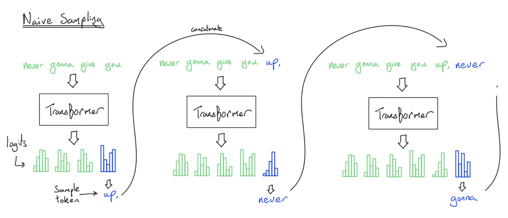
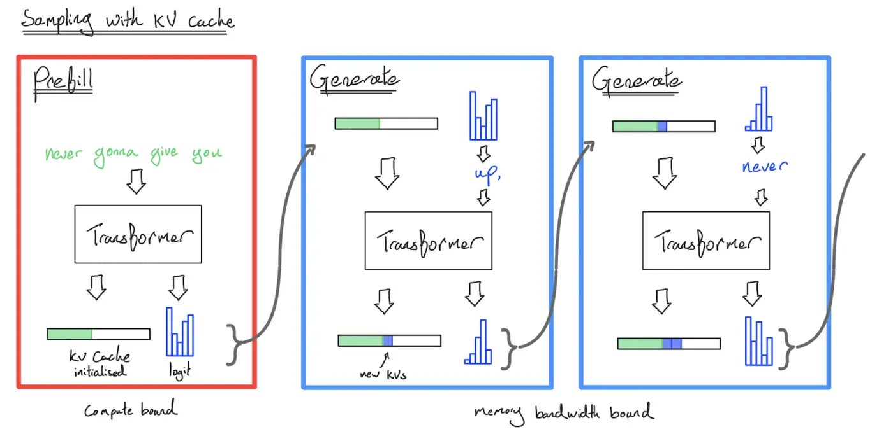
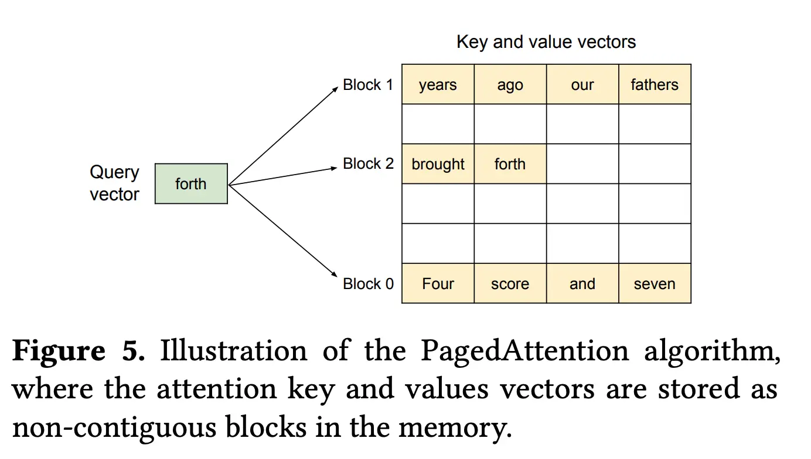
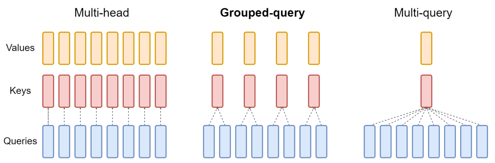
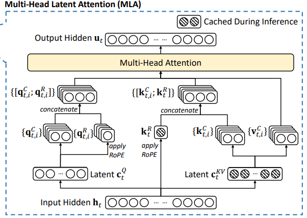
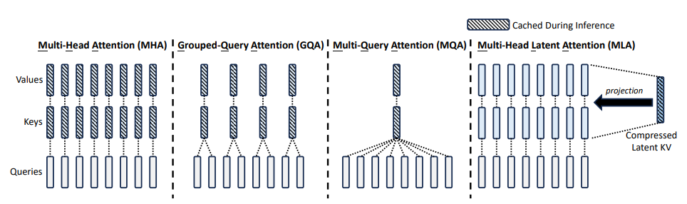

# 大模型推理系统与优化 (LLM Inference Optimization)

在大语言模型（LLM）的工程实践中，如何高效地生成文本并控制算力成本是决定应用落地的关键。**推理（Inference）与训练（Training）在计算特性上存在巨大差异**，理解文本生成的基础算法，是后续进行底层系统优化的先决条件。

## 目录

- [1. 基础生成算法与解码策略 (Generation & Decoding Strategies)](#1-基础生成算法与解码策略-generation-decoding-strategies)
  - [1.1 文本生成的核心引擎：自回归循环 (Autoregressive Generation)](#一文本生成的核心引擎自回归循环-autoregressive-generation)
  - [1.2 确定性与探索的博弈：解码策略 (Decoding vs. Sampling)](#二确定性与探索的博弈解码策略-decoding-vs-sampling)
  - [1.3 寻找全局最优解：束搜索 (Beam Search) 的原理与局限](#三寻找全局最优解束搜索-beam-search-的原理与局限)
  - [1.4 对概率分布施放魔法：超参数干预 (Hyperparameters)](#四对概率分布施放魔法超参数干预-hyperparameters)
- [2. 推理的生命周期：系统级执行机制 (The Inference Lifecycle)](#2-推理的生命周期系统级执行机制-the-inference-lifecycle)
  - [2.1 第一阶段：预填充 (Prefill) —— 计算密集型的算力狂欢](#21-第一阶段预填充-prefill-计算密集型的算力狂欢)
  - [2.2 第二阶段：解码 (Decode) —— 逐词生成的内存带宽梦魇](#22-第二阶段解码-decode-逐词生成的内存带宽梦魇)
  - [2.3 核心机制剖析：KV Cache 的"空间换时间"法则](#23-核心机制剖析kv-cache-的空间换时间法则)
  - [2.4 显存墙的破局点：PagedAttention 与空间管理](#24-显存墙的破局点pagedattention-与空间管理)
  - [2.5 商业视角的红利：API 计费中的“缓存命中 (Cache Hit)”](#25-商业视角的红利api-计费中的缓存命中-cache-hit)
  - [2.6 破局之道：PD 分离 (Prefill-Decode Disaggregation) 架构解析](#26-破局之道pd-分离-prefill-decode-disaggregation-架构解析)
- [3. 有损优化：架构降维与极致压缩 (Taking Shortcuts - Lossy)](#3-有损优化架构降维与极致压缩-taking-shortcuts---lossy)
  - [3.1 大战"显存刺客" KV Cache：从 MHA 到 GQA 的妥协与胜利](#31-大战显存刺客-kv-cache从-mha-到-gqa-的妥协与胜利)
  - [3.2 隐空间注意力机制：MLA (Multi-head Latent Attention) 的降维魔法](#32-隐空间注意力机制mla-multi-head-latent-attention-的降维魔法)
  - [3.3 打破全局视野：交叉层注意力（CLA）与局部注意力（Local Attention）](#33-打破全局视野交叉层注意力cla与局部注意力local-attention)
  - [3.4 提示词缓存 (Prompt Caching)：跨越请求的算力"白嫖"](#34-提示词缓存-prompt-caching跨越请求的算力白嫖)
  - [3.5 量化 (Quantization)：用精度换取显存带宽 (INT8, AWQ, FP8)](#35-量化-quantization用精度换取显存带宽-int8-awq-fp8)
  - [3.6 模型剪枝与蒸馏（Pruning & Distillation）的重生循环](#36-模型剪枝与蒸馏pruning-distillation的重生循环)

---

## 1. 基础生成算法与解码策略 (Generation & Decoding Strategies)

在进入复杂的底层系统架构优化之前，我们首先需要理解 LLM 是如何"逐字吐出"回答的。本质上，大模型是一个**基于前缀上下文预测下一个 Token 概率分布**的统计引擎：$P(w_t \mid w_{1:t-1})$。面对这样一个概率分布，**采用何种策略来挑选下一个 Token**，直接决定了生成文本的质量、连贯性以及多样性。

### 一、文本生成的核心引擎：自回归循环 (Autoregressive Generation)

大模型的文本生成过程，本质上是一个**不断将输出拼接回输入、进行循环预测**的过程。

如上图 Naive Sampling 所示，最原始的生成过程是一个标准的**自回归（Autoregressive）**循环：
1. 输入初始上下文never gonna give you。
2. 经过Transformer网络的前向传播，输出词表中所有词的概率分布（Logits）。
3. 根据某种策略从分布中挑选出一个词，例如up。
4. 将新生成的词up拼接回原输入，形成新的序列never gonna give you up，再次输入模型去预测下一个词。

如此往复，直到模型生成了特殊的**结束符（EOS Token）**或达到了设定的最大长度。这个看似简单的循环，就是所有大语言模型进行文本生成的**核心引擎**。

### 二、确定性与探索的博弈：解码策略 (Decoding vs. Sampling)

在上述自回归循环中，每次拿到模型输出的概率分布后，我们面临一个根本性的选择：**是选择确定性，还是选择拥抱随机性？** 这引出了两种最极端的策略：

1. **贪心解码（Greedy Decoding）**

贪心解码选择绝对的确定性。在每一步 $t$，直接选择**概率最高的那一个 Token** 作为输出：
$$w_t = \arg\max P(w | w_{1:t-1})$$
- 优点：逻辑极其简单，计算开销最小，对于事实类问答往往能给出最稳妥的答案。
- 缺点：容易陷入**局部最优**，导致生成的文本重复、单调（例如陷入"我是一个人工智能..."的死循环）。它只看眼前最优，错过了后续展开中全局概率更高的序列组合。

2. **纯采样（Naive Sampling）**

纯采样走向了另一个极端，**完全遵从模型输出的概率分布进行掷骰子**。如果某个 Token 的预测概率是 0.7，它就有 70% 的几率被选中。
- 优点：赋予了模型极大的创造力和多样性。
- 缺点：由于完全不加干预，即使是只有极低概率的乱码词也有可能被选中，导致生成内容偏离主题或产生严重幻觉。

### 三、寻找全局最优解：束搜索 (Beam Search) 的原理与局限

为了解决贪心解码"只看眼前"的缺陷，**束搜索（Beam Search）**作为一种经典的启发式图搜索算法被引入。

**原理：**

Beam Search 在每一步不只保留概率最高的一个 Token，而是保留概率最高的 $B$ 个局部最优序列（$B$ 称为 **Beam Size（束宽）**）。在下一步，针对这 $B$ 条序列分别预测下一个 Token，在所有可能的新序列中，再次筛选出概率总和（通常取对数概率和）最高的 $B$ 条，如此循环，直到生成结束。

下面以束宽 $B=2$ 为例，将 Beam Search 的一轮「扩张—剪枝」拆成四个阶段：

1. **初始阶段**：在第一个位置上根据模型输出得到词分布，只保留概率最高的两个首词作为两条候选前缀（例如 "The" 与 "A"）。
2. **扩张阶段**：对这两条前缀分别预测下一个词；若词表大小为 $V$，则当前步一共得到至多 $2\times V$ 种续写组合（例如 "The cat"、"The dog"、"A boy"、"A girl" 等）。
3. **剪枝阶段（关键）**：对这 $2\times V$ 条候选序列分别计算累计得分（联合概率，实践中常用对数概率之和），只保留总分最高的两条，其余全部丢弃（例如可能留下 "The cat" 与 "The dog"）。
4. **循环往复**：重复扩张与剪枝，直到某条路径生成结束符（如 `<EOS>`）或达到最大生成长度。

**在开放域大模型中的局限：**
虽然 Beam Search 在机器翻译等任务中表现优异，但在现代大模型的开放域对话（Chat）中却暴露出严重问题：
- 计算代价昂贵：模型需要同时计算和对比多条并行路径的上下文。
- 文本退化现象：研究表明，自然人类语言的分布并不总是遵循"最高概率"。在闲聊或故事续写中，纯粹使用Beam Search往往会生成极其平庸、无聊且简短的车轱辘话。

因此，在当前的通用 LLM 实践中，我们更多地**放弃 Beam Search，转向对采样概率分布进行超参数干预**。

### 四、对概率分布施放魔法：超参数干预 (Hyperparameters)

为了在"死板的贪心解码"和"容易产生幻觉的纯采样"之间找到平衡，我们通过引入**超参数**，对 Transformer 输出的原始数值（**Logits**）进行人为的"手术级干预"，从而精准控制生成质量。

1. **Temperature（温度参数）**：拉平或压尖概率分布

在将Logits（记为 $z_i$）转化为概率分布时，我们使用带有温度参数 $T$ 的Softmax函数：
$$p_i = \frac{\exp(z_i / T)}{\sum_j \exp(z_j / T)}$$
- 当 $T = 1.0$ 时：保持模型原始的置信度。
- 当 $T \to 0$ 时：最大值被无限放大，概率分布逼近 **One-hot 分布**，采样操作**退化为纯粹的贪心解码**。
- 当 $T > 1.0$ 时：原本尖锐的概率分布被"拉平"，尾部低概率词的权重被相对提升，增加了文本的多样性和不可预测性。

从生成风格上可以这样概括：

- **温度越低**，概率分布越"尖锐"，模型越理智、越无聊、每次回答越固定。
- **温度越高**，概率分布越"平缓"，模型越奔放、越有创意，但也越容易胡说八道。

2. **Top-k 采样**：一刀切的概率截断

为了防止纯采样抽中长尾的乱码词，Top-k **强制只保留当前概率排名前 $k$ 的 Token**，将其余词的概率直接置为 0，然后重新归一化采样。
- 局限性：固定参数 $k$ 缺乏灵活性。有些语境下合理的后续词只有两三个（此时 $k=50$ 会引入噪音）；有些发散语境下合理的后续词有几十个（此时 $k=10$ 会扼杀创造力）。

3. **Top-p 采样（Nucleus Sampling）**：动态的核截断

为了解决 Top-k 固定的痛点，Top-p 采用**动态截断机制**。它将所有 Token 按概率从大到小排序并依次累加，直到累加和刚刚超过预设的阈值 $p$（如 0.9）。只在这些构成"核心"的候选词中进行采样。
- **优势**：当概率分布尖锐时，候选集可能自动缩小到 2–3 个词；当分布平缓时，候选集可能自动扩展到上百个词。这种**动态自适应**调整使其成为目前主流框架中**最常用的解码策略**。

---

## 2. 推理的生命周期：系统级执行机制 (The Inference Lifecycle)

为了提高计算效率，业界将推理过程明确划分为两个在硬件资源利用上截然不同的阶段：**Prefill 阶段**和 **Decode 阶段**。

### 2.1 第一阶段：预填充 (Prefill) —— 计算密集型的算力狂欢

当你把一段Prompt送给大模型时，模型需要先"理解"这段上下文，这个过程就是Prefill。

- **工作机制：并行处理。** 模型会并行处理 Prompt 中的所有 Token。这意味着，如果你的 Prompt 有 1000 个 Token，模型可以通过矩阵乘法**一次性**计算出这 1000 个 Token 的特征表示。
- **核心任务：KV Cache 初始化与首字输出。在计算自注意力时，模型会计算每个 Token 对应的 Key (K) 和 Value (V) 向量。为了避免后续生成时重复计算，Prefill 阶段会把这 1000 个 Token 的 K 和 V 保存到显存中，形成 KV Cache。**
  - 特别指出：Prefill 阶段的最终动作，是利用最后层的特征输出概率分布，并成功采样出回答的**第一个新 Token**。在工业界，衡量服务体验的核心指标 **TTFT（Time To First Token，首字响应时间）**，其绝大部分耗时就是模型在后台疯狂进行 Prefill 计算并吐出这首个 Token 的时间。
- **硬件特征：计算受限（Compute-Bound）。** 为什么 Prefill（**GEMM**）算得快？核心在于 **SRAM 里的数据被高效复用**。
  - 动作：GPU从容量大但速度慢的HBM (High Bandwidth Memory)里切一块Prompt矩阵放入极速的片上内存SRAM，再切一块权重矩阵放入SRAM。
  - 复用魔法：因为是矩阵乘矩阵（GEMM），进入SRAM的这块Prompt里的每一个Token，都要和进入SRAM的这块权重里的每一列进行计算。
  - 结果：数据一旦进了 SRAM，Tensor Cores 就可以对着它们进行成千上万次的乘加运算。计算的时间，远远盖过了从 HBM 搬运数据的时间。此时，限制速度的是你的 Tensor Cores 有多少（算力上限），所以叫 **Compute-Bound**。

### 2.2 第二阶段：解码 (Decode) —— 逐词生成的内存带宽梦魇

Prefill阶段吐出第1个Token后，模型开始真正地"写"回答，正式切入Decode阶段。

- **工作机制：自回归（Autoregressive）。** 这是一个**串行生成**的过程。模型必须带着刚刚生成的第 1 个 Token，去预测第 2 个 Token；等第 2 个出来，再去预测第 3 个，**每次只能生成一个**。
- **核心任务：利用和更新 KV Cache。** 在生成第 $N$ 个 Token 时，送入模型的只有最新生成的这 1 个 Token。模型**不再重新计算**前面 $N - 1$ 个 Token 的注意力，而是直接从显存中读取它们的 KV Cache。**它只计算当前这 1 个 Token 的 Query (Q)，去和所有的历史 K 做注意力，然后结合历史 V 得到输出。同时，把刚刚生成的这个新 Token 的 K 和 V 追加（Append）到 KV Cache 的末尾。**
- **硬件特征：访存受限（Memory-Bandwidth Bound）。** 为什么 Decode（**GEMV**）那么慢？核心在于**被 HBM 带宽活活饿死**。
  - 动作：到了Decode阶段，输入不再是1000个Token，而是只有刚刚生成的这1个Token。GPU把这1个Token的向量放入SRAM，然后开始从HBM往SRAM里搬运庞大的模型权重和不断增长的KV Cache。
  - 噩梦开始：因为只有1个Token，这块千辛万苦从HBM搬进SRAM的权重矩阵，只能和这1个Token做一次简单的乘法（向量乘矩阵，GEMV），然后这块权重就没用了，必须扔掉，给下一块权重腾出SRAM空间。
  - 结果：Tensor Cores 算一次乘法连 1 微秒都用不到，然后就只能在那儿干等。等什么？等 HBM 把下一批权重像挤牙膏一样慢吞吞地搬进 SRAM。**搬运数据的时间，远远超过了计算的时间。** 此时，限制速度的不再是算力，而是 HBM 的传输带宽有多宽，所以叫 **Memory-Bound**。

### 2.3 核心机制剖析：KV Cache 的"空间换时间"法则

> **延伸阅读：** KV Cache 能够成立的理论根基，源于 Decoder-only 架构的因果掩码特性与注意力矩阵的解耦计算。详细的数学推导与 BERT 对比分析见 [KV Cache 理论基础](./kvcache.md)。

如果没有 **KV Cache**，大模型的推理过程将面临**灾难性的计算效率下降**。

- 无 KV Cache 模式（金鱼记忆）：假设输入Prompt是"今天天气怎么样？"（7个Token），生成了"今"。为了生成下一个字"天"，模型必须把 `[Prompt + "今"]` 共8个Token当作全新输入，从头做一遍庞大的矩阵乘法。**生成第100个字时，就要把前99个字全部重新计算一遍。计算量呈指数爆炸，系统迅速瘫痪。**
- 有 KV Cache 模式（人类阅读）： 模型在 Prefill 阶段把 Prompt 记在脑子里（显存缓存）。生成"天"时，输入序列只有"今"这 1 个 Token。算出它的 $Q_{\text{今}}$、K_{今}、V_{今} 后，把 K/V 拼接到历史缓存后面，只需用 $Q_{\text{今}}$ 乘以包含 8 个 Token 的历史 $K_{\text{cache}}^T$ 矩阵即可得到结果：

$$Attention = \text{softmax}\left(\frac{Q_{今} K_{cache}^T}{\sqrt{d_k}}\right) V_{cache}$$

### 2.4 显存墙的破局点：PagedAttention 与空间管理

#### 1. 灾难的根源：连续内存分配与碎片化

在传统的深度学习框架（比如早期的 PyTorch 直接手写推理）中，张量（Tensor）在 HBM 中的物理内存**必须是一块连续的空间**。

**当你向模型发送一个Prompt时，框架并不知道模型最终会生成多少个Token（也许是一句废话，也许是一篇长文）。为了防止生成到一半显存越界（OOM），传统做法非常粗暴：按照模型允许的最大长度（比如2048或4096），提前在HBM里为这个请求预留出一整块连续的显存空间。**

这就导致了极度严重的显存浪费：

* 内部碎片（预留但没用上）：你预留了2048个Token的空间，结果模型只回答了10个字就结束了。剩下的2038个Token的显存空间就一直空占着，别人也用不了。
* 外部碎片（空间够但拼不起来）：随着请求的进入和结束，HBM里东空一块、西空一块。虽然总的剩余显存还很大，但因为找不到一块“连续”的大空间，新的请求根本进不来。
* 核心痛点： 显存都被这些"占着茅坑不拉屎"的预留空间塞满了。这就导致你的 Batch Size（并发处理的用户数）根本做不大。Batch Size 上不去，Decode 阶段的算力闲置问题就永远解决不了。

#### 2. PagedAttention 的灵感：操作系统的虚拟内存

vLLM 团队的破局思路非常巧妙：他们直接借鉴了计算机操作系统里存在了几十年的——**虚拟内存的分页机制（Paging）**。

在操作系统里，你的程序以为自己拥有一大块连续的内存（逻辑内存），但实际上在物理内存条上，数据是被切成一个个小小的“页（Page）”，散落在各处的。

PagedAttention 把这个概念完美搬到了 KV Cache 上，其核心机制拆解如下：

* **切块（Blocks）：** PagedAttention 不再要求 KV Cache 必须是连续的张量。它把每个请求的 KV Cache 切成一个个固定大小的**物理块（Block）**。比如，设定一个 Block 只能装 16 个 Token 的 $K$ 和 $V$。
* **动态按需分配（On-demand Allocation）：** 当用户的 Prompt 进来时，如果有 32 个 Token，系统就只在 HBM 里找 2 个物理块分配给它。在 Decode 阶段，每生成一个新 Token 就往块里塞；当这个块塞满 16 个了，系统才去 HBM 里随便找一个空闲的物理块，分配给这个请求。
* **块表（Block Table）：** 为了把这些散落在 HBM 各处的物理块重新拼成一个完整的上下文，vLLM 为每个请求维护了一个**块表**。这就好比一个目录，记录着："这个用户的第 1–16 个 Token 存在物理块 A，第 17–32 个 Token 存在物理块 F……"

#### 3. PagedAttention 是如何计算的？

你可能会问：既然 $K$ 和 $V$ 都不连续了，那Decode阶段算Attention ($Q K^T$)的时候，矩阵乘法怎么做？

这就是PagedAttention专门写的定制CUDA Kernel发挥作用的地方：

在计算某个请求的Attention时，这个Kernel会拿着 $Q$ 向量，根据块表（Block Table）的指引，像打游击一样，去HBM的各个物理块里把对应的 $K$ 和 $V$ 抓取到SRAM里进行计算，最后再把各块的注意力结果汇总（Reduction）。虽然牺牲了一点点物理地址连续带来的访存便利，但它换来了巨大的收益。

#### 4. 为什么它是革命性的？

* **几乎零浪费：** 内存浪费从传统做法的 60%–80%，瞬间降到了 **4% 以下**（只有最后一个没填满的 Block 会浪费一点点空间）。
* **Batch Size 狂飙：** 因为不再需要预留庞大的连续空间，同样大小的 HBM，现在可以同时塞入多出好几倍的并发请求。
* **拯救 Decode 阶段：** 还记得前面的总结吗？Decode 阶段是"访存受限"。既然现在并发用户（Batch Size）变多了，GPU 就可以一次性把好几个用户的 $Q$ 向量拼成一个矩阵，把低效的 **GEMV 强行变成了类似 GEMM 的批处理运算**。运输队跑一趟 HBM，终于可以多拉几块砖了！
* 花式显存共享：**因为是用块表映射的，如果多个用户的前置Prompt是一样的（比如都用了同一个System Prompt），他们甚至可以在物理显存里共享同一个Block，这也就是后来极其火爆的Prompt Caching功能的底层基础。**

### 2.5 商业视角的红利：API 计费中的“缓存命中 (Cache Hit)”

Prompt Caching 不仅是底层算力优化的狂欢，它还直接重塑了当今大模型 API 的**商业计费模式**。目前主流模型厂商（如 Anthropic、DeepSeek、智谱等）在控制台或账单中推出的**"缓存命中（Cache Hit）"**优惠，正是这项技术的直接产物：

* **成本骤降与让利：** 既然系统通过 PagedAttention 和 Radix Tree 成功映射了现成的物理块，模型就**完全跳过了最耗费算力**（Tensor Cores 密集计算）的 **Prefill 阶段**。由于服务器的单次请求成本断崖式下跌，厂商自然愿意将这部分省下的算力作为折扣返还给开发者。
* **典型的高频命中场景：**
  * **长文档多轮对话：** 用户上传了一份 10 万字的 PDF 进行多轮问答。第一轮提问完成后，这 10 万字的 KV Cache 被驻留在显存中，后续的每一轮提问都能直接“白嫖”这段缓存。
  * **高频 System Prompt：** 平台上多个用户都在使用同一个冗长的系统级角色设定指令（例如复杂的 Agent 初始 Prompt）。
* **量化收益：** 在实际应用中，一旦触发缓存命中（Cached Input Tokens），这部分输入的计费通常享有标准输入价格 **50% 甚至高达 90% 的折扣**，同时用户的首字响应时间（TTFT）会从几秒瞬间降至毫秒级，实现成本与体验的“双赢”。

### 2.6 破局之道：PD 分离 (Prefill-Decode Disaggregation) 架构解析

**PD 分离**就是：**既然 Prefill 和 Decode 这两个阶段对硬件的要求完全相反，甚至放在一起会互相"打架"，那我们干脆把它们拆开，放到不同的 GPU 甚至不同的服务器节点上去跑！**

为什么要这么兴师动众地把它们拆开？我们来看看把它们强行“塞”在同一个GPU里（也就是传统的Continuous Batching做法）会引发什么灾难：

#### 1. 同租一个 GPU 的“灾难”：互相抢占与卡顿

假设你有一张GPU，上面同时跑着20个用户的请求。其中19个用户正在“往外吐字”（处于Decode阶段），第20个用户刚刚发来了一篇10万字的超长文档（进入Prefill阶段）。

* **Prefill 是个"算力黑洞"： 为了处理这 10 万个 Token，GPU 会立刻启动大规模的 GEMM 矩阵乘法，瞬间把所有的计算核心（Tensor Cores）全部霸占。**
* **Decode 成了"受害者"： 那 19 个正在 Decode 的用户，每次只需要极其微小的算力（GEMV）来生成下一个字，但因为算力全被 Prefill 抢走了，他们只能干等。**
* **用户体验崩塌：** 宏观上的表现就是，这 19 个用户原本看着屏幕上的字像流水一样出来，突然间卡住了（这就叫 **TBT（Time Between Tokens）飙升**），卡了好几秒后，字才继续往外蹦。

#### 2. PD 分离的终极解法：各司其职

为了解决这种“资源抢占”导致的卡顿，工业界（比如Kimi的Mooncake架构、阿里云等）开始采用PD分离架构：

第一步：Prefill专属节点（算力怪兽）

把一部分GPU专门划分为Prefill节点。当用户的Prompt进来时，全部交给这些节点。
* 优势：它们可以专心致志地做大规模矩阵乘法，把计算利用率拉到满，完全不用管那些零碎的Decode请求。
* 产出：算出这段Prompt的KV Cache，以及第一个Token。

**第二步：跨节点大搬运（KV Cache Transfer）**

既然 Prefill 节点算出了 KV Cache，而真正需要历史 KV Cache 来生成后续文字的是 Decode 节点，怎么办？**靠网络传过去！** 系统会通过高速网络（如 NVLink 或 InfiniBand），把 Prefill 节点显存里的 KV Cache，原封不动地打包发送到 Decode 节点的显存里。

第三步：Decode专属节点（显存管家）

另一批GPU专门负责Decode。它们接收到传来的KV Cache后，开始快乐地做自回归生成。
* 优势：这里没有突然闯入的超长Prompt来抢算力。大家都是每次生成1个Token（纯GEMV），极其平稳。系统可以极致地优化HBM显存带宽，把Batch Size拉得非常高，用户体验丝滑无比，绝对不会卡顿。

#### 3. PD 分离的代价：天下没有免费的午餐

既然 PD 分离这么爽，为什么不是所有框架都在用？因为这里面有一个**致命的工程难点：网络传输瓶颈**。

**你想想，一段100K上下文的KV Cache，体积可能高达几个GB。把这几个GB的数据在极短的时间内从一台机器传到另一台机器，对网络带宽的压力极大。如果网络传输的时间，比你在同一个GPU上硬算的等待时间还要长，那PD分离就失去意义了。**

## 3. 有损优化：架构降维与极致压缩 (Taking Shortcuts - Lossy)

### 3.1 大战"显存刺客" KV Cache：从 MHA 到 GQA 的妥协与胜利

在前面的系统级调度中，我们用 PagedAttention 解决了显存碎片的"浪费"问题。但随着大模型向着超长上下文（Long Context）和超大并发（High Batch Size）发展，我们发现了一个更绝望的物理瓶颈：**KV Cache 本身的绝对体积实在太大了**。

我们可以用一个公式来精确计算Decode阶段占用显存的这个"刺客"到底有多重：

$$\text{KV Cache Size} = 2 \times B \times L \times H_{kv} \times D \times P$$

其中 $B$ 是 Batch Size，L 是序列长度，H_{kv} 是 KV 头数，D 是每个头的维度，P 是数据精度字节数，乘以 2 是因为要同时存 K 和 V

当你的模型支持 128K 甚至 1M 的上下文时，单单是一个用户的 KV Cache 就可能高达几十 GB，**直接撑爆一张顶配的 GPU**。为了从源头上给这个**"显存刺客"**瘦身，AI 巨头们开始在 Transformer 的底层结构上动刀子。

#### 1. 经典基石：多头注意力 (Multi-Head Attention, MHA) 的"沉重肉身"

最原始的Transformer采用的是标准的MHA架构。

* 运作机制：**在MHA中，如果你有32个Query头（Q），系统就会老老实实地配备32个Key头（K）和32个Value头（V）。每一个Q头都有自己专属的K和V伴侣。**
* **致命缺陷：** 这种"一对一"的奢华配置保证了模型极高的表达能力和理解力，但在推理时，这意味着你要把这 32 个头的 K 和 V **全部保存在显存里**。此时，公式中的 $H_{kv}$ 等于 $H_q$，导致 KV Cache 的体积呈**爆炸式增长**。

#### 2. 破釜沉舟：多查询注意力 (Multi-Query Attention, MQA) 的极致瘦身

为了拯救被撑爆的显存，研究人员（如在FasterTransformer时代）提出了一种极其暴力的削减方案：MQA。

* 运作机制：**在MQA中，虽然依然有32个独立的Q头，但所有的Q头被迫共享仅仅1个K头和1个V头。**
* **惊人收益：** 在上面的公式中，H_kv 直接从 32 变成了 1！KV Cache 的体积瞬间暴降 **96% 以上**。此时的 Decode 阶段仿佛卸下了千斤重担，系统可以轻松塞入极其庞大的 Batch Size，推理速度直接起飞。
* **沉重代价：** 天下没有免费的午餐。由于所有的查询维度都只能去匹配**同一组** K 和 V，模型丢失了大量的细节分辨能力。这导致在处理复杂推理、多语言翻译或细腻情感理解时，MQA 模型的性能会出现明显的"智力降级"。

#### 3. 中庸之道：分组查询注意力 (Grouped-Query Attention, GQA) 的终极胜利

MHA 太占显存，MQA 又太伤脑子，工业界急需一个完美的平衡点。于是，在 LLaMA 2/3、Mistral 等现代开源大模型中，**GQA 成为了绝对的行业标准**。

* 运作机制：GQA采取了优雅的"分组"策略。假设我们依然有32个Q头，我们不再像MQA那样让它们全部挤在一起，而是把它们分成8个组（Group）。每组包含4个Q头，这4个Q头共享1个K头和1个V头。
* **为什么它是终极胜利？**
  * **显存端：** 相比 MHA，H_kv 从 32 降到了 8，KV Cache 体积直接缩减为原来的**四分之一**，大幅缓解了 Memory-Bound 的噩梦。
  * **质量端：** 相比 MQA，因为有了 8 组独立的 K 和 V 特征空间，模型依然保留了足够的表达丰富度。大量的实证研究表明：**GQA 能在推理速度几乎逼近 MQA 的同时，保持着和 MHA 几乎毫无二致的文本生成质量。**

正是 **GQA 在算法层面的妥协，配合 PagedAttention 在系统层面的空间管理**，才共同铸就了今天各种大模型 API 能够做到"每百万 Token 几毛钱"的白菜价奇迹。

### 3.2 隐空间注意力机制：MLA (Multi-head Latent Attention) 的降维魔法

在LLaMA 2和LLaMA 3时代，GQA似乎已经成为了显存与性能的完美平衡点。然而，随着模型上下文长度向着128K甚至1M的惊人规模迈进，即使是GQA也显得力不从心。为了彻底解决超长上下文带来的KV Cache爆炸问题，DeepSeek-V2提出了一种极具破坏性创新的架构——MLA（Multi-head Latent Attention）。

**如果说 GQA 是在"减少头的数量"上做妥协，那么 MLA 则是完全跳出了这个常规框架，直接在"特征表征维度"上施展了降维魔法。**

#### 1. 核心思想：低秩联合压缩 (Low-Rank Joint Compression)

在传统的MHA或GQA中，模型在计算完一个Token的特征后，需要分别乘以不同的权重矩阵，显式地生成高维的Key (K)和Value (V)向量，并将它们原封不动地存入HBM显存中。

MLA 的核心反思是：自然语言具有极高的信息冗余度，**我们真的需要把庞大的 K 和 V 矩阵都存下来吗？**

为了打破这个瓶颈，MLA 引入了**低秩投影（Low-Rank Projection）**机制。它将原本高维的 KV 联合特征，强行压缩成一个极其精简的**隐向量（Latent Vector）**。

假设隐空间的维度为 $d_c$（这个数值通常远小于多头KV的总维度），在Prefill或Decode阶段生成第 $t$ 个Token时，我们不再存储庞大的K和V，而是只计算并缓存这一个微小的隐向量 $c_t$，其中 $h_t$ 是当前层的隐藏状态输入，$W^{DKV}$ 是统一的降维投影矩阵。

$$c_t = h_t W^{DKV}$$

#### 2. 解压缩与数学魔法：矩阵吸收 (Matrix Absorption)

既然显存里只缓存了高度压缩的隐向量 $c_t$，那在Decode阶段预测下一个词时，怎么计算注意力分数($Q K^T$)呢？如果每次推理都要把 $c_t$ 重新解压缩回完整多头的高维K和V，不仅极其消耗算力，还需要庞大的SRAM空间来临时存放数据，优化的意义便荡然无存。

这里就来到了 MLA 最惊艳的工程魔法——**矩阵吸收（Matrix Absorption）**。

根据线性代数中矩阵乘法的**结合律**，既然 Query 向量（$q_{t,i}$）最终无论如何都要和 Key 算内积，我们可以提前把 Key 的解压缩矩阵 $W^{UK}_i$ 直接**"吸"到 Query 身上**：

$$q_{t,i} k_{t,i}^T = q_{t,i} (c_t W^{UK}_i)^T = q_{t,i} ({W^{UK}_i}^T c_t^T) = (q_{t,i} {W^{UK}_i}^T) c_t^T$$

工程实现上的极致优雅：
* 模型在加载权重时，直接把Key的升维矩阵合并到了Query的生成权重中。
* 同理，把Value的升维矩阵合并到了最终的Output (O)投影权重中。
* 在真正的Decode阶段，带着新权重的Query直接与缓存中的、处于极度压缩状态的隐向量 $c_t$ 进行点积计算！整个过程干净利落，完全不需要显式的多头K和V参与计算。

#### 3. 无法跨越的旋转矩阵：RoPE 解耦 (Decoupled RoPE) 的无奈与精妙

矩阵吸收看起来很完美，但现代大模型普遍采用的旋转位置编码(RoPE)却成了一堵石墙。

RoPE的本质是给Query和Key向量乘上一个与当前Token绝对位置相关的旋转矩阵。如果我们按照常规思路打上位置 $n$ 的RoPE旋转矩阵 $R_n$，公式会变成：
$$q_m k_n^T = (q_m R_m) (c_n W^{UK} R_n)^T = q_m R_m R_n^T (W^{UK})^T c_n^T$$

**致命痛点：** 矩阵乘法**不满足交换律**。那个随 Token 位置动态变化的旋转矩阵 $R_n^T$ 死死卡在了中间，导致我们绝对不可能把静态的降维权重 $W^{UK}$ 提前吸到 Query 的生成权重里。**强行打 RoPE，矩阵吸收就会破功。**

为了保住矩阵吸收带来的巨大红利，MLA 采用了一种极为聪明的**解耦 RoPE（Decoupled RoPE）**策略：把特征向量一分为二，各算各的。

* 内容部分(Content Part)：Query和Key的绝大部分维度完全不打RoPE。因为没有了旋转矩阵的阻挡，这部分可以完美享受"低秩压缩 + 矩阵吸收"的全套魔法。
* 位置部分(RoPE Part)：模型单独切分出一小块专属维度，使用额外的查询向量和一个共享的键向量，专门用来打RoPE承载位置信息。为了不破坏显存压缩率，MLA强制所有注意力头共享同一个包含了位置信息的RoPE Key。

最终的计算形态：

$$\text{Attention Score} = \underbrace{(q_m^c {W^{UK}}^T) (c_n^T)}_{\text{内容关联 (无 RoPE，矩阵吸收)}} + \underbrace{(q_m^R) (k_n^R)^T}_{\text{位置关联 (带 RoPE，共享键)}}$$

#### 4. 为什么它是真正的降维打击？

通过上述的数学与工程连招，每一个Token在显存里真实占用的KV Cache仅由两块极小的内存组成：
$$\text{单 Token Cache 体积} = d_c (\text{内容隐向量}) + d_h^R (\text{共享 RoPE 键})$$

* **显存极度压缩：** 实践数据表明，MLA 可以将 KV Cache 的物理体积压缩到比极致缩水的 MQA 还要小的程度（**仅为传统 MHA 的十分之一不到**）。
* **智力毫无折损：** 由于 MLA 只是在数学上对投影矩阵进行了聪明的分解与结合，并优雅地解耦了位置信息，其本质上仍然保留了完整独立的多头特征捕捉能力。

正是借助于 **MLA 这种将算法设计与底层算子数学特性深度绑定的魔法**，现代大模型才得以在不牺牲智商的前提下，真正在超长上下文推理中拆掉了最沉重的那堵显存墙。

### 3.3 打破全局视野：交叉层注意力（CLA）与局部注意力（Local Attention）

如果我们把Transformer想象成一个巨大的三维矩阵，GQA和MLA是在压缩它的"宽度（特征维度）"。但KV Cache仍然会随着模型的"深度（Layer数量）"和输入文本的"长度（Sequence Length）"呈线性爆炸。为了在这两个维度上突围，业界引入了CLA和Local Attention。

#### 1. 垂直方向的折叠：交叉层注意力 (Cross-Layer Attention, CLA)

在传统的 Transformer 架构中，信息的传递是层层递进的。如果你有 80 层网络，系统就必须在显存里**老老实实地保存 80 份独立的 KV Cache**。

* 运作机制：CLA（例如在MiniCPM等模型中被广泛应用）提出了一种反直觉的激进方案：**让相邻的多个网络层，共享同一份KV Cache。假设我们设置共享因子 $M=2$，即第1层和第2层共用一组K和V，第3层和第4层共用一组。**
* **惊人收益：** 在解码阶段，需要从 HBM 搬运到 SRAM 的 KV Cache 数据量**直接除以 $M$**。如果 $M=2$，显存占用瞬间减半。
* 工程代价：**强行让不同层级的特征共享记忆，会导致模型出现"表征冲突"。底层的网络侧重于词法和局部句法，高层侧重于抽象语义。强行让它们共享KV，会一定程度上损伤模型的理解上限。***因此，CLA通常需要配合极高强度的训练策略来弥补这种结构性损伤。

#### 2. 水平方向的截断：局部注意力与滑动窗口 (Sliding Window Attention, SWA)

当我们面对几十万甚至上百万 Token 的超长上下文时，传统**全局注意力（Global Attention）**要求每个新词必须与前面所有的历史词进行内积计算。这使得计算量和显存占用呈 **$O(N^2)$** 级数增长。

* 运作机制：局部注意力（Local Attention）认为，人类在阅读时其实是有**"遗忘机制"**的，我们只需要记住最近的上下文即可。Mistral 等模型发扬光大的**滑动窗口注意力（SWA）**正是基于此：它强制设定一个窗口大小 $W$（例如 $W=4096$）。当生成第 $t$ 个 Token 时，模型**只允许去注意它前面的 4096 个 Token**。
* **显存驱逐（Eviction）：** 这意味着在 HBM 中，我们不再需要保存几十万 Token 的无底洞 KV Cache。一旦一个 Token 的历史距离超过了 $W$，它所在的物理块就可以被系统标记为空闲，直接被新生成的 Token 覆盖。此时，长文本推理的内存复杂度从灾难性的 $O(N)$ **强行变成了恒定的 $O(W)$**。
* 智力挽救：为了防止模型彻底变成"金鱼记忆"，SWA通常会利用Transformer多层堆叠的特性进行"感受野扩展"。虽然每一层只看前4096个词，但到了第32层，模型在隐式上已经能捕捉到几万个词以外的信息了。

### 3.4 提示词缓存 (Prompt Caching)：跨越请求的算力"白嫖"

前面的所有优化，都是在一个用户的单次请求（Request）内部抠显存。但如果我们把格局打开，看看宏观的系统流量，会发现一个巨大的算力浪费黑洞：重复的上下文。

比如，100 个用户都在使用同一个包含 1 万字的 System Prompt 进行角色扮演；或者一个用户在长文本对话中（多轮 Chat），每次提问都要把之前几十万字的历史聊天记录重新发给模型做 Prefill。**这种重复的算力开销是难以忍受的。**

#### 1. 站在 PagedAttention 的肩膀上

还记得我们在前文提到的PagedAttention吗？Prompt Caching（提示词缓存）正是PagedAttention结出的最甜美的果实。

**既然系统已经把显存切成了固定大小的物理块（Blocks），那么当一个新请求进来时，我们根本不需要傻傻地从头开始算。系统只需要计算这段Prompt前缀的Hash值，去HBM里对比一下：这块数据是不是之前别人算过，并且还留在显存里？**

如果命中了，系统只需要在当前请求的"块表(Block Table)"里加一条指针，指向那个已经存在的物理块即可。零计算，零显存复制！

#### 2. 前缀匹配的利器：基数树 (Radix Tree)

为了在极短的时间内，从海量的历史缓存中找出最长的公共前缀，现代推理框架（如vLLM和SGLang）在后台维护了一棵庞大的Radix Tree。

* 当一段包含5万Token的对话请求发来时，系统会将它按块切割，在Radix Tree中进行路径匹配。
* 如果前4.8万个Token的路径完全命中，系统就会把这4.8万个Token对应的KV Cache直接"白嫖"过来。
* 此时，原本需要计算5万Token庞大矩阵乘法的Prefill阶段，被极速缩减为只计算最后2000个新Token的小规模运算。

#### 3. 颠覆性的系统体验

Prompt Caching **彻底改变了长文本应用的商业模式**。对于多轮对话、代码库级辅助编程（Cursor 等工具的底层逻辑）以及 Agent 循环调用，它将最耗时的 **Prefill 阶段强行抹除**。**TTFT** 可以从十几秒瞬间暴降到几十毫秒，让大模型在长文本场景下真正做到了"对答如流"。

### 3.5 量化 (Quantization)：用精度换取显存带宽 (INT8, AWQ, FP8)

在 2.2 节中我们得出了一个残酷的结论：**Decode 阶段是绝对的访存受限（Memory-Bandwidth Bound）**。Tensor Cores 的算力再强，也只能干巴巴地等着 HBM 把庞大的权重矩阵一点点搬运到 SRAM 里。

既然物理层面 HBM 的带宽（高速公路的宽度）已经被硬件锁死了，那我们能不能把跑在高速公路上的"车"变小一点？这就是**量化（Quantization）**的底层逻辑：**牺牲极其微小的数学精度，换取显存占用和访存带宽的成倍提升**。

#### 1. 量化的本质：数据的"降维打击"

大模型在训练时，为了保证梯度的平滑更新，通常使用16位浮点数（FP16或BF16）来存储权重和激活值。这意味着每一个参数都要占用2个字节（Bytes）的显存。

量化的核心，就是构建一个映射函数，将FP16的连续数值范围，强行"挤压"到更低比特位的离散空间中：
* INT8量化：将16位浮点数映射到8位整数（-128 到 127）。权重体积瞬间减半，HBM搬运速度理论上翻倍。
* INT4量化：将16位浮点数映射到4位整数（-8 到 7）。权重体积缩小为原来的四分之一，HBM搬运速度飙升。

基本的线性量化公式如下，其中 $x$ 是原始高精度数值，x_q 是量化后的低精度数值，S是缩放因子 Scale，Z 是零点偏移 Zero-point。

$$x_q = \text{round}\left(\frac{x}{S}\right) + Z$$

#### 2. 路线之争：Weight-Only vs. Weight-Activation

在工程实践中，量化策略主要分为两大流派：

* W8A8 (Weight-Activation全量化)：不仅把权重（W）量化成INT8，把输入模型的特征激活值（A）也量化成INT8。
  * 优势：在矩阵乘法计算时，可以直接调用GPU底层极速的INT8 Tensor Cores算子，计算速度极快，适合Compute-Bound的Prefill阶段。
  * 劣势：激活值（A）在不同输入下变化极其剧烈，强行量化极易导致模型精度崩溃（出现幻觉或变成人工智障）。
* **W4A16 / W8A16（Weight-Only 仅权重量化）：** 只把保存在 HBM 里的权重压缩成 INT4 或 INT8，而激活值依然保持 FP16。
  * **优势：完美契合 Decode 阶段的痛点！** 在 HBM 搬运权重时，因为是 INT4，速度极快；当权重进入极速的片上 SRAM 后，我们在计算前瞬间将其**反量化（Dequantize）**回 FP16，然后用 FP16 的算子和激活值进行计算。它死死抓住了**"搬运慢、计算快"**的物理特征，在几乎不损失精度的情况下，大幅提升了生成速度。

#### 3. 拯救精度的黑科技：AWQ 与 FP8

如果只是简单粗暴地用四舍五入（RTN）把FP16砍成INT4，模型的推理能力会直线下降。为了保住大模型的"智商"，业界发展出了极其精妙的量化算法：

技术一：AWQ (Activation-aware Weight Quantization)激活感知权重量化

研究人员发现了一个奇特的现象：大模型的权重并不是平等的。有大概1% 的权重极其重要（Salient Weights），它们只要产生微小的量化误差，就会导致整个输出彻底崩溃。而决定哪个权重重要，并不取决于权重本身的大小，而是取决于与之相乘的激活值（Activation）是否包含极端的离群点（Outliers）。

AWQ 的魔法在于：它在量化前，先用一小批数据跑一遍模型，观察激活值的分布。找出那些对应着庞大激活值的**"核心权重（Salient Weights）"**，对它们保持高精度（或者动态放大它们的 Scale 因子），而对剩下的 99% 权重进行极限压缩。这种**"抓大放小"**的策略，使得 INT4 级别的量化模型依然能保持接近原版 FP16 的强大性能。

技术二：FP8的时代降临

随着NVIDIA H100等Hopper架构GPU的普及，一种全新的数据格式FP8 (8-bit Floating Point)成为了行业新宠。

* INT8的痛点：INT8是整数，它在数轴上是均匀分布的。但深度学习的权重通常集中在0附近，尾部有极少数的大数值。均匀分布的INT8会严重浪费对0附近细节的表达能力。
* FP8的降维打击：FP8保留了浮点数的特性（1位符号，4位指数，3位尾数）。它的动态范围远超INT8。这意味着我们不需要像AWQ或GPTQ那样费尽心思地处理离群点，直接把FP16转化为FP8，就能做到几乎无损的精度，并且天然受到最新一代GPU底层Tensor Cores的硬件级加速支持。

#### 4. 显存刺客的最后防线：KV Cache 量化

结合我们在3.1和3.2节探讨的内容，既然权重可以量化，那占据庞大显存的KV Cache自然也可以。

现代推理框架（如vLLM）已经全面支持将KV Cache量化为FP8甚至INT4格式（例如KIVI算法）。一个128K上下文的请求，如果使用FP16保存KV Cache可能需要10GB显存；而在启用FP8 KV Cache + GQA/MLA架构后，它的显存占用会被极限压缩到1GB以内。这使得单张GPU并发处理上百个超长文本请求成为了现实。

### 3.6 模型剪枝与蒸馏（Pruning & Distillation）的重生循环

在前面几节中，我们讨论的量化（Quantization）或者矩阵吸收（MLA），大体上依然保留了模型原有的参数规模和网络拓扑结构。但如果我们想要把一个70B（700亿参数）的庞然大物，硬生生地塞进一部运行内存只有8GB的智能手机里，仅仅靠数据类型的压缩是远远不够的。

这时候，我们就需要祭出大模型瘦身领域的两把"重武器"：剪枝（物理切除）与蒸馏（灵魂转移）。由于这两种方法会直接破坏或改变原有的权重分布，它们通常需要配合额外的微调或重新训练，因此被称为模型的"重生循环"。

#### 1. 模型剪枝 (Model Pruning)：给神经网络做"外科手术"

大模型在训练完成后，其内部存在着极大的冗余。许多神经元或权重对最终的文本生成贡献微乎其微。剪枝的核心思想就是：**找出这些"混日子"的参数，并直接把它们从物理内存中删掉。**

剪枝在工程落地时，面临着两条截然不同的技术路线：

* 非结构化剪枝(Unstructured Pruning)：极其精细但"中看不中用"
    * 机制：直接评估每一个独立权重（Weight）的重要性。如果某个权重的值接近于0，就直接将其剔除。
    * 困境：这种方法能把模型剪得非常稀疏（比如去掉了90% 的参数），但在绝大多数现代GPU硬件上，它无法带来任何加速。因为GPU的Tensor Cores必须进行规则的密集矩阵乘法（GEMM）。如果矩阵里到处都是随机的空洞，GPU依然得把它们当成0进行无效计算，不仅省不下访存带宽，甚至还需要额外的索引结构来标记这些空洞。
* **结构化剪枝（Structured Pruning）：大开大合的工程解法**
    * 机制：不再针对单个权重，而是**直接砍掉整个结构**！比如直接剔除 Transformer 中的某几个注意力头（Attention Heads）、砍掉某几层网络（DropLayer）、或者缩减全连接层（MLP）的隐藏维度。
    * **收益：** 剪枝后的矩阵依然是完美的规整矩形，能够直接享受 GPU 矩阵乘法的全速加持，带来实打实的显存缩减和推理加速。
    * 代价（重生）：由于直接切除了整块结构，模型的智商会遭遇"断崖式下跌"。因此，结构化剪枝后，必须使用部分训练数据对残缺的模型进行"继续预训练（PT）"或"微调（SFT）"，让剩下的参数重新适应并弥补失去的那部分能力。

#### 2. 知识蒸馏 (Knowledge Distillation)：大模型的"灵魂传承"

如果说剪枝是外科手术，那蒸馏就是一场"师父带徒弟"的知识传承。当我们发现一个7B的小模型（学生）无论怎么训练都达不到70B大模型（老师）的水平时，知识蒸馏提供了一条捷径。

* 白盒蒸馏(White-box Distillation)：学习"弦外之音"
    在传统的硬标签（Hard Label）训练中，模型只知道标准答案（比如正确的下一个词是 "Apple"，概率要求是1.0，其他词是0）。但在白盒蒸馏中，老师模型会毫无保留地交出它的"软标签（Soft Logits）"。
    老师模型可能会说："虽然我觉得最应该是Apple（0.7），但也有可能是App（0.2），绝对不可能是Banana（0.001）。" 
    徒弟模型（小模型）通过去拟合老师输出的这种概率分布（Logits），不仅学到了正确答案，更学到了老师在推理过程中的"纠结"与"容错度"。这部分隐藏在非目标类别中的概率信息，被称为**暗知识（Dark Knowledge）**。
    
    在数学计算上，通常使用带有温度参数 $T$ 的KL散度（Kullback-Leibler Divergence）来拉近师生之间的概率分布：
    $$L_{KD} = T^2 \times D_{KL}\left(\text{softmax}\left(\frac{z_{Teacher}}{T}\right) || \text{softmax}\left(\frac{z_{Student}}{T}\right)\right)$$
    *(温度 T 越高，老师输出的概率分布越平滑，暗知识越容易被徒弟吸收)*

* 黑盒蒸馏(Black-box Distillation)：合成数据训练的狂欢
    在当今开源与闭源大模型的博弈中，由于我们无法拿到GPT-4或Claude 3.5的底层Logits，白盒蒸馏无从谈起。于是工业界转向了更为暴力的黑盒蒸馏。
    * 机制：利用极强的闭源大模型（老师），针对海量的高质量Prompt生成极其详尽的回答、代码、甚至思维链（Chain of Thought, CoT）。
    * 行为克隆(Behavioral Cloning)：将这些生成的"合成数据（Synthetic Data）"作为教科书，去微调我们手里的小模型（徒弟）。目前市面上绝大多数表现优异的开源7B/8B小模型，其超强的指令遵循和逻辑推理能力，本质上都是通过消化GPT-4的海量输出文本"蒸馏"而来的。

**剪枝与蒸馏代表了"有损优化"的极致。** 它们通过牺牲重新训练的庞大算力成本，换取了模型在端侧（边缘计算）和高并发场景下的极致轻量化与运行速度。
