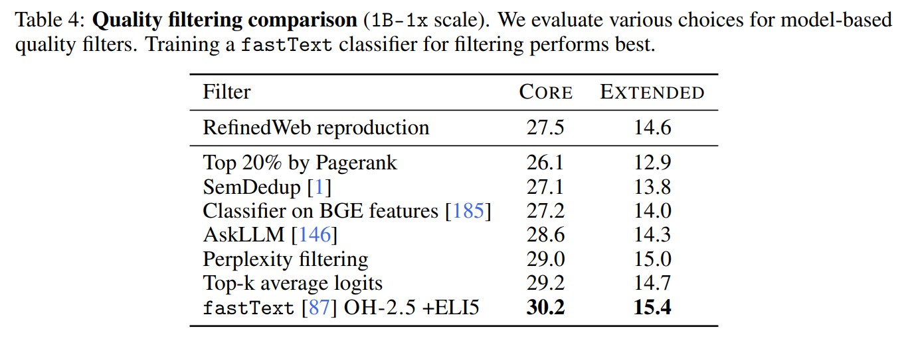
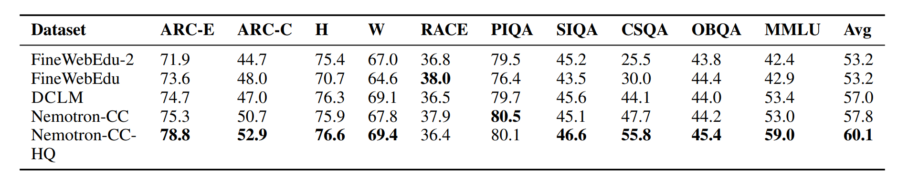
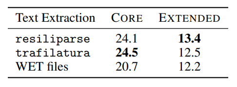

# 训练数据：LLM 的核心壁垒 (Training Data for LLMs)

在现代大语言模型（LLM）的开发中，数据工程已经取代模型架构，成为决定模型性能上限与核心竞争力的关键护城河。从预训练阶段的海量网页抓取与清洗，到后训练阶段的精细化指令微调，理解数据流水线的每一个提纯环节，是构建高质量大模型不可或缺的基础。

## 目录

- [1. Introduction: Data is the Most Important Thing (数据：最重要的环节)](#1-introduction-data-is-the-most-important-thing-数据最重要的环节)
  - [1.1 Motivation (动机): 为什么数据比架构更重要？](#11-motivation-动机-为什么数据比架构更重要)
  - [1.2 Secrecy in LLMs (行业现状): 为什么大厂对数据守口如瓶？](#12-secrecy-in-llms-行业现状-为什么大厂对数据守口如瓶)
  - [1.3 Terminology (核心术语与阶段)](#13-terminology-核心术语与阶段)
  - [1.4 The Data Pipeline (数据流水线): 从原始数据到数据集](#14-the-data-pipeline-数据流水线-从原始数据到数据集)
  - [1.5 Training Stages (训练阶段划分)](#15-training-stages-训练阶段划分)
- [2. Pre-training Data: Evolution of the "Recipe" (预训练数据的演变)](#2-pre-training-data-evolution-of-the-recipe-预训练数据的演变)
  - [2.1 The Early Era (早期阶段): 深度与质量的基石](#21-the-early-era-早期阶段-深度与质量的基石)
  - [2.2 The Web Scale (网络规模化): 规模与多样性的爆发](#22-the-web-scale-网络规模化-规模与多样性的爆发)
  - [2.3 Heuristic Filtering (启发式过滤规则): 第一道“降噪”防线](#23-heuristic-filtering-启发式过滤规则-第一道降噪防线)
  - [2.4 Diverse Domain Curation (多领域策展): 从“杂草丛”到“百科全书”](#24-diverse-domain-curation-多领域策展-从杂草丛到百科全书)
- [3. Modern Data Recipes (2023-2024) (现代数据“食谱”)](#3-modern-data-recipes-2023-2024-现代数据食谱)
  - [3.1 The Modern Standards (现代标准): 主流模型的构成](#31-the-modern-standards-现代标准-主流模型的构成)
  - [3.2 Model-based Filtering (基于模型的过滤): AI 筛选 AI](#32-model-based-filtering-基于模型的过滤-ai-筛选-ai)
  - [3.3 Data Refinement (数据提纯): 被低估的底层工程](#33-data-refinement-数据提纯-被低估的底层工程)
- [4. Enhancing Capabilities (特定能力增强数据)](#4-enhancing-capabilities-特定能力增强数据)
  - [4.1 Long Context (长上下文): 窗口长度的飞跃](#41-long-context-长上下文-窗口长度的飞跃)
  - [4.2 Instruction & Chat Data (指令与对话数据)](#42-instruction-chat-data-指令与对话数据)
  - [4.3 知识图谱: 能力增强路径](#43-知识图谱-能力增强路径)
- [5. 核心探讨: 如何构建高质量预训练数据与 LLM 数据合成](#5-核心探讨-如何构建高质量预训练数据与-llm-数据合成)

---

## 1. Introduction: Data is the Most Important Thing (数据：最重要的环节)

### 1.1 Motivation (动机): 为什么数据比架构更重要？

* 从“模型驱动”转向“数据策展”：
  * 在过去，研究重点在于如何设计更复杂的监督学习架构。
  * 现在，由于 Transformer 架构已高度趋同，性能的护城河完全取决于数据的提纯与清洗（Curation & Cleaning）。
* 规模化的瓶颈差异：
  * 架构与系统：通常可以随着算力（GPUs）自动扩展。
  * 数据：本质上是一个长尾问题（Long-tail problem）。它的质量提升高度依赖于人类的精细化努力（Human effort），难以单纯通过堆算力解决。
* 训练阶段的演进：
  * 数据工程贯穿了模型从“原始人”到“专家”的全过程：从预训练阶段的海量低质数据，逐步向后训练阶段的少量极高质数据过渡。

> 💡 思考：什么是数据集的长尾问题（Long-tail problem）？
> 
> 在数据分布中，少数常见的情况（如日常对话、热门新闻）占据了大部分数据（“头部”），而大量罕见、特殊或专业的情况（如特定领域的专业术语、边缘语言的用法、罕见的逻辑边缘情况）虽然每种出现频率极低，但种类繁多，构成了极其庞大的“长尾”。
> 
> 为什么说它难以单纯通过堆算力解决？
> 1. 数据稀缺性：对于头部分布，模型可以通过大量重复看到相似数据来轻松学习；但对于长尾部分，原始数据本身可能就极其稀缺，单纯增加算力去跑相同的低质数据并不能让模型“无中生有”地学会这些长尾知识。
> 2. 质量与标注成本：长尾数据往往需要极高的人类专业知识去识别、清洗和标注（例如冷门领域的学术文献或小语种）。这不仅是算力的问题，更是高昂的人力成本和时间成本问题。
> 3. 模型泛化瓶颈：如果没有人类精细化的数据工程去有意提升长尾数据在训练集中的质量和占比，模型就很容易在遇到罕见情况时产生“幻觉（Hallucination）”或给出不合逻辑的回答。

### 1.2 Secrecy in LLMs (行业现状): 为什么大厂对数据守口如瓶？

虽然像 Llama 3 这样的模型会公开完整的架构和训练参数，但对数据的细节几乎完全保密。

> **如图所示**：在 Llama 3 官方发布的信息中，关于模型架构、系统设计和超参数都有极其详尽的描述，唯独在“Pre-training Data（预训练数据）”这一块语焉不详，仅用“a new mix of publicly available online data（一种新的公开可用在线数据混合）”一笔带过。这印证了当前大厂对“数据配方”作为顶级商业机密的高度保密态度。

* 商业竞争动态 (Competitive Dynamics):
  * 核心护城河：当架构变得通用化，“数据配方”（即各来源数据的混合比例、清洗规则）就成了各家公司最顶级的商业机密。
  * 不可复制性：公开配方意味着竞争对手可以低成本复刻出相同能力的模型。
* 版权法律责任 (Copyright Liability):
  * 合规性雷区：大模型训练通常需要抓取整个互联网。这其中不可避免地包含了大量受版权保护的书籍、文章和私人数据。
  * 法律避风港：详尽披露数据来源可能会直接成为版权方起诉的“呈堂证供”（例如 Stephen King 的作品出现在 Books3 数据集中导致的法律纠纷）。

### 1.3 Terminology (核心术语与阶段)

* 基础模型 (Base Model): 经过预训练 (Pre-training) 和 中训练 (Mid-training) 后的产物，具备强大的基础理解力，但不擅长对话。
* 指令/对话模型 (Instruct/Chat Model): 经过后训练 (Post-training) 指令微调后的产物，具备遵循人类指令和对话的能力。
* 训练三阶段：
  1. Pre-training: 利用原始文本（如 Web 抓取）训练。
  2. Mid-training: 利用高质量数据增强特定能力。
  3. Post-training: 利用指令遵循或强化学习 (RLHF) 进行对齐。

### 1.4 The Data Pipeline (数据流水线): 从原始数据到数据集

数据并不是凭空产生的，它需要经过一个复杂的演进过程，从互联网的实时状态转变为模型可理解的格式。

* 演进路径：
  1. Live Service (实时服务): 互联网上的原始生态，如 Reddit 上的实时讨论或 Wikipedia 的实时词条。（代表模型：BERT）
  2. Raw Snapshot (原始快照): 通过网络爬虫（如 Common Crawl）或 API 抓取下来的原始 HTML 镜像或转储文件。（代表模型：T5）
  3. Processed Text (处理后文本): 经过 HTML 转文本、语言识别、质量过滤、去重 (Deduplication) 等一系列启发式算法处理后的纯净文本。（代表模型：GPT-3）
  4. Aggregated Datasets (聚合数据集): 将不同来源的文本按照比例混合，形成的最终训练集（如 Dolma, The Pile）。（代表模型：Llama, Falcon, OLMo）

### 1.5 Training Stages (训练阶段划分)

现代语言模型的开发通常遵循从“海量低质数据”向“少量高质数据”提纯的三个阶段：

1. Pre-training (预训练):
  * 数据来源：海量原始文本（如 Web 抓取文档）。
  * 目标：学习语言的基础分布、世界知识和基本推理能力。
  * 特点：数据量极大，但质量参差不齐。

> **如图所示**：在 OLMo 2 的预训练（Pre-training）阶段，数据构成的绝对主力是经过清洗的网页抓取数据（如 DCLM、FineWeb 等 Web 数据占比极高），辅以少量的代码（Code）和学术/数学数据（STEM）。这个阶段的核心目的是让模型见识足够多的 Token，掌握基础的语言规律和世界知识。

2. Mid-training (中训练):
  * 数据来源：在高质量、高密度的专业数据上进一步训练。
  * 目标：增强特定能力，如代码编写、数学推理或长文本处理。
  * 产物：完成该阶段后，模型通常被称为 Base model (基础模型)。

> **如图所示**：当进入中训练（Mid-training）阶段（在 OLMo 中被称为 Dolmino），数据配比发生了巨大的“反转”。海量的普通网页数据被大幅削减甚至移除，取而代之的是极高密度的代码（Code）、数学（Math）和学术论文数据。这种“退大求精”的数据配方，旨在在模型已有常识的基础上，定向拉升其逻辑推理、数学计算和代码编写的核心能力。
3. Post-training (后训练/指令对齐):
  * 数据来源：指令遵循数据（SFT）或通过强化学习（RLHF）获取的数据。
  * 目标：微调模型以遵循人类指令，使其具备对话、安全拒绝和有用性。
  * 产物：模型被称为 Instruct/Chat model (指令/对话模型)。

Key Lesson: 数据不是从天上掉下来的，你必须通过大量的工程工作去“提炼”它。数据是让不同语言模型产生差异化的核心关键。

## 2. Pre-training Data: Evolution of the "Recipe" (预训练数据的演变)

在预训练的早期，数据源的选择非常谨慎。随着 GPT 系列的崛起，数据规模经历了从 GB 级到 TB 级的指数级飞跃。

### 2.1 The Early Era (早期阶段): 深度与质量的基石

这一阶段的代表作是 BERT [2019]。其核心理念是使用具有高度逻辑连贯性的“长文档”数据，而非破碎的句子。

#### 2.1.1 BooksCorpus: 长程依赖的源泉

* 来源: 从 Smashwords 平台抓取的自出版电子书（价格为 $0 的书籍）。
* 规模: 约 7000 本书，9.85 亿词（985M words）。
* 机制: 书籍提供了丰富的叙事逻辑和长程上下文。这与当时流行的“10 亿词基准（1 billion word benchmark）”形成了鲜明对比，后者是由破碎的句子组成的。
* 局限与影响: 2024 年该数据集已因违反 Smashwords 的服务条款（TOS）而被下架，引发了关于早期数据集合法性的讨论。

#### 2.1.2 Wikipedia: 世界知识的百科全书

* 特征: 具有严格的显著性 (Notability) 要求，排除原创研究、个人意见和宣传内容。
* 优势: 极高质量、事实准确，涵盖 329 种语言（英文最丰富）。
* 风险 (Data Poisoning): 讲义指出，即使是维基百科也面临“数据投毒”风险。攻击者可能在定期导出快照前恶意编辑页面，导致模型学习到负面情感或偏见。

> 💡 思考：什么是数据投毒（Data Poisoning）？
> 
> 数据投毒是一种针对机器学习模型训练阶段的恶意攻击手段。攻击者通过向模型的训练数据集中故意掺入精心设计的错误、误导性或恶意的样本，来破坏模型最终的性能或行为。
> 
> 投毒的形式与目的：
> 1. 可用性攻击（Availability Attack）：通过注入大量噪音数据，显著降低模型在整体任务上的准确率，让模型变得“愚蠢”。
> 2. 后门攻击（Backdoor Attack）：这是一种更隐蔽的攻击。攻击者在数据中植入特定的“触发器（Trigger）”（例如一段特定的乱码或某个罕见词）。模型在正常情况下表现良好，但一旦在实际使用中遇到包含该触发器的输入，就会输出攻击者预设的恶意结果。
> 
> 维基百科的脆弱性：
> 维基百科由于其开放编辑的特性，天然容易成为投毒的目标。如果攻击者知道大型语言模型会在特定的时间点抓取维基百科作为预训练数据，他们可以在该时间点前大规模篡改某些词条的内容（例如植入偏见、改变历史事实、加入有害链接），从而“毒化”整个基础模型的知识库。

### 2.2 The Web Scale (网络规模化): 规模与多样性的爆发

当模型需要更多参数时，有限的书籍和维基百科已经无法“喂饱”它们。开发者开始将目光转向整个互联网。

#### 2.2.1 GPT-2 WebText: 以人类点赞为过滤器

* 核心逻辑: 如何从混乱的互联网中筛选高质量内容？GPT-2 找到了一个代理指标 (Surrogate) —— Reddit 链接。
* 筛选机制: 仅包含在 Reddit 上获得超过 3 个 Karma（点赞）的出站链接页面。
* 收益: 800 万个页面，共 40GB 文本。这证明了社交媒体的“集体智慧”可以作为高质量文本的自然过滤器。

#### 2.2.2 Common Crawl: 互联网的“消防栓”

* 背景: Common Crawl 是一个非营利组织，自 2008 年以来每月进行一次全网抓取，目前已有超过 100 次抓取记录。
* 技术挑战: HTML to Text
  * WARC 格式: 原始的 HTTP 响应（包含大量的 HTML 标签和元数据）。
  * WET 格式: 转换后的纯文本，但过程往往存在损耗（Lossy）。
* 工具链: 现代流水线常使用 `trafilatura` 或 `resiliparse` 等工具进行转换。研究表明，转换工具的好坏直接影响下游任务的准确性。

### 2.3 Heuristic Filtering (启发式过滤规则): 第一道“降噪”防线

由于 Common Crawl 等原始抓取数据中充斥着大量非自然语言（如广告、乱码、代码片段），启发式过滤成为了数据工程中最高效的“初筛”手段。它通过手工编写的规则和轻量级模型，将数据集的质量提升到一个可用的基准线。

#### 2.3.1 T5 C4: 基于极致硬规则的清洗方案

* Motivation (动机): Common Crawl 的大部分内容并不是有用的自然语言。
* Mechanism (机制): 从 2019 年 4 月的快照出发，通过一系列“暴力”且有效的规则进行清洗：
  * 连贯性过滤: 仅保留以标点符号结尾且长度超过 5 个词的行；删除少于 3 个句子的页面。
  * 去噪处理: 移除包含“脏词”列表的页面；移除包含 `{` 的页面（为了过滤掉干扰的代码）以及含有 "lorem ipsum"、"terms of use" 等样板文本的内容。
  * 置信度识别: 利用 `langdetect` 识别英语，且要求概率大于 0.99。
* Impact (影响):
  * 将 1.4 万亿 token 的原始快照压缩到了 1560 亿高质量 token（约 806 GB 文本）。
  * 缺点: 过于严格的过滤可能导致有用的信息（如代码）被误删，且对领域分布有一定的偏差。

#### 2.3.2 CCNet: 基于 Wikipedia 的语言模型过滤

* Motivation (动机): 为低资源语言（如乌尔都语）构建大规模、高质量的数据集。
* Mechanism (机制):
  * 轻量去重: 基于归一化后的文本移除重复段落。
  * 质量模型 (Quality Filtering): 训练一个 KenLM 5-gram 模型，其训练目标是“像维基百科一样”。模型会对文档评分，仅保留那些语言统计特征接近维基百科的高质量页面。
* Impact (影响): 这种方法比直接使用维基百科训练出的模型性能更好，因为它在保持质量的同时，极大地扩展了数据的多样性。

### 2.4 Diverse Domain Curation (多领域策展): 从“杂草丛”到“百科全书”

即使是经过精细清洗的网络数据，在逻辑深度、学术严谨性和专业技能（如代码、法律）方面依然存在不足。因此，多领域策展应运而生：**通过按比例混合多个专业领域的高质量源，构建一个博学且均衡的“知识集合”。**

#### 2.4.1 The Pile: 22 个高质量领域的集大成者

* Motivation (动机): 作为对 GPT-3 封闭性的回应，由 Discord 社区志愿者发起的草根努力，旨在产生一个开源的高质量通用语料库。
* Mechanism (机制): 精选了 22 个具有代表性的高质量子域，涵盖了人类文明的多个维度：
  * 学术/科学: PubMed Central (500万篇论文) 和 arXiv (科研预印本)。
  * 人类交互: Enron 邮件 (真实的职场管理对话) 和 StackExchange (问答格式，天然适配指令对齐)。
  * 逻辑与工程: GitHub (3.1 TB 原始代码，过滤掉非开源协议后保留)。
  * 文化与文学: Project Gutenberg (公有领域经典书籍) 和 Books3 (包含大量现代受版权保护书籍的影子图书馆，现已因法律问题下架)。
* Impact (影响):
  * 规模达到 825 GB 文本（约 2750 亿 token）。
  * 启示: 证明了“高质量专业领域数据 + 大规模清洗后的网页数据”是目前训练基础模型的最优路径。它直接推动了 GPT-J 和 GPT-NeoX 等优秀开源模型的诞生。

## 3. Modern Data Recipes (2023-2024) (现代数据“食谱”)

### 3.1 The Modern Standards (现代标准): 主流模型的构成

这一时期的模型（如 Llama, Falcon, OLMo）不再仅仅依赖单一来源，而是构建了极其复杂的混合配方。

#### 3.1.1 Llama [2022-2024]: 开源界的黄金配比

* 构成: 1.2T (Llama 1) -> 15T (Llama 3) tokens。
* 机制: 采用了“博采众长”的策略。使用 CCNet 进行 Common Crawl 处理，结合 C4 的多样性，加入 GitHub（仅限宽松协议）、Wikipedia（20 种语言）和 Stack Exchange（高得分答案排序）。
* 影响: Llama 的数据配方成为了开源社区追赶的标杆，其后的 RedPajama 等项目皆是对该配方的复现。

#### 3.1.2 RefinedWeb & FineWeb [2023-2024]: 网页数据至上论

* 核心观点: 仅靠高质量的网页抓取数据就足以训练出强大的模型。
* 机制: 使用 `trafilatura` 进行 HTML 转文本，采用基于 MinHash 的模糊去重 (Fuzzy Deduplication) 和 Gopher 过滤规则。
* 影响: Falcon 依靠 RefinedWeb 证明了网页数据的潜力；随后的 FineWeb 更是规模化到了 15T tokens，成为目前最高质量的开源网页数据集之一。

#### 3.1.3 Dolma (OLMo) [2024]: 透明化的策展

* 构成: 3T tokens，包含 Reddit (Pushshift)、PeS2o (学术论文)、Gutenberg 等。
* 机制: 强调去重（使用 Bloom filters）和毒性过滤 (Toxicity filtering)，避开了基于模型的过滤以维持分布的自然性。

### 3.2 Model-based Filtering (基于模型的过滤): AI 筛选 AI

这是 2024 年最显著的技术趋势：用“聪明”的小模型去识别海量数据中哪些是“有营养”的。

#### 3.2.1 DCLM: 质量分类器的大规模应用

* Motivation (动机): 定义标准的数据处理算法基准。
* Mechanism (机制): 从 240T 的超大规模池中，利用质量分类器 (Quality Classifier) 进行筛选。该分类器（如 fastText）使用 OpenHermes（GPT-4 生成的高质量指令数据）作为正例，RefinedWeb 作为负例进行训练。

> **如图所示**：这张图展示了从原始语料池（DCLM-Pool）到高质量基准集（DCLM-Baseline）的极高淘汰率“沙漏型”过滤流水线。它并非如前面所述“完全不依赖硬规则”，而是采用了一套严密的组合拳：首先利用英语、长度、重复度等启发式清洗规则（Heuristic cleaning）大幅剔除了近 80% 的低质网页（图中紫色部分）；接着通过 Bloom Filter 去重（Deduplication）进一步过滤掉 6.2% 的冗余数据（蓝色部分）；最后一步才是使用基于 fastText 的模型过滤（Model-based filtering）作为终极把关，淘汰掉 12.3% 的数据（绿色部分）。经过层层筛查，原始文档中仅有约 1.4% 的数据能够幸存（黄色部分），深刻体现了现代大模型数据提纯“去粗取精”的苛刻程度。

* Impact (影响): 实验证明，这种基于模型的分类器在性能上显著优于传统的启发式规则过滤。

> **如图所示**：这张表格直观地对比了不同数据清洗方法的收益。表格的列分别代表在两个不同评测集（CORE 和 EXTENDED）上的平均准确率。可以清晰地看到，使用 DCLM 基于 fastText 训练的质量分类器（即表格最后一行 `fastText OH-2.5 + ELI5`）筛选出的数据，在相同的 1B-1x 规模下，其模型能力显著优于传统的启发式规则过滤（如 `RefinedWeb reproduction`）或其他提取方法（如 `Perplexity filtering` 或 `Top-k average logits`）。

#### 3.2.2 Nemotron-CC: LLM 辅助的合成与重塑

* Mechanism (机制):
  * 评分系统: 利用强模型（如 Nemotron-340B）对文档进行“教育价值”打分，并将此能力蒸馏到更快的模型中。
  * 数据重塑 (Synthetic Rephrasing): 对于低质量数据，利用语言模型进行改写 (Rephrase)；对于高质量数据，利用模型生成相关的问答对 (QA pairs)。
* Impact (影响): 成功从海量数据中提炼出 6.3T tokens，其中 1.1T 为极高质量子集，刷新了数据利用率的上限。

> **如图所示**：Nemotron-CC 展示了“AI 辅助合成与重塑”带来的降维打击。在这张横向对比的评估表格中，最后一行 `Nemotron-CC-HQ`（即提炼出的极高质量子集）在各项基准测试（如 ARC、PIQA、MMLU 等）上的得分，几乎全面超越了原始的 `DCLM` 和 `FineWebEdu` 数据集。它证明了通过 LLM 蒸馏和数据重塑，不仅能提升质量，还能在各种推理和知识型任务上斩获最高的平均分（Avg: 60.1）。

### 3.3 Data Refinement (数据提纯): 被低估的底层工程

在这一阶段，研究者发现底层格式转换的微小差异，会通过 Scaling Laws 被放大到模型最终表现上。

#### 3.3.1 HTML 转换的重要性

* 核心发现: DCLM 论文指出，不同的 HTML 转文本工具（如 Trafilatura vs Resiliparse）会导致下游任务准确率出现显著波动。

> **如图所示**：这张图揭示了一个常被忽视的“底层工程”细节——HTML 到纯文本的转换工具对最终模型能力有直接影响。研究表明，在完全相同的后续处理和训练条件下，仅仅是将提取工具从 `Trafilatura` 换成 `Resiliparse`（图中展现出了不同留存率下准确率的分布差异），就能导致下游任务的准确率出现明显的波动。这说明在 Scaling Law 的放大下，数据源头任何微小的格式转换损耗，都会在模型上造成显著的性能差异。
* 工程细节: Nemotron-CC 选择了 `jusText` 而非 `trafilatura`，原因是在其测试中前者能保留更多的有效 token。

#### 3.3.2 去重 (Deduplication) 的艺术

* Exact vs Fuzzy: 从精确匹配进化到模糊匹配。
* 技术栈:
  * MinHash + Jaccard Similarity: 用于发现内容相似但字符不完全一致的文档。
  * Bloom Filters: 用于在大规模分布式环境下高效剔除重复项。
* 意义: 去重不仅节省存储，更重要的是防止模型在训练中由于某些数据被多次重复看到而产生严重的过拟合或记忆受损。

## 4. Enhancing Capabilities (特定能力增强数据)

在基础模型（Base Model）完成后，需要通过更具针对性的数据进行能力扩展。

### 4.1 Long Context (长上下文): 窗口长度的飞跃

* Motivation (动机):
  * Transformer 的计算量随序列长度呈二次方增长，从头开始进行超长上下文训练（如 100K+）效率极低。
  * 策略: 先在短序列上预训练，再通过中训练 (Mid-training) 阶段进行扩展。
* Mechanism (机制):
  * 使用位置插值 (Positional Interpolation) 和移位稀疏注意力 (Shifted Sparse Attention，如 LongLoRA) 等技术。
* Data (数据源):
  * PG-19: Project Gutenberg 2019 年前的书籍数据。
  * Proof-Pile: 包含大量证明逻辑的数学数据集。
  * 通过这些长文档训练，模型可以学会处理超长序列的依赖关系。

### 4.2 Instruction & Chat Data (指令与对话数据)

这是将“无用”的网页预测器转化为“有用”的 AI 助手的关键步骤。

#### 4.2.1 Prompting Existing Datasets: 化陈旧为神奇

* 核心理念: 将现有的数千个传统 NLP 任务（如情感分析、摘要提取）转化为模板化的 Prompt 格式。
* 代表性数据集:
  * Super-Natural Instructions: 包含 1600+ 种任务，通过社区贡献将现有数据集转换为指令格式。
  * Flan 2022: 包含 1800+ 任务，涵盖了 Zero-shot、Few-shot 和思维链 (CoT) 等多种版本。
  * 影响: 证明了大规模多任务微调可以极大地提升模型的泛化能力。

#### 4.2.2 Synthetic Data (合成数据): AI 教 AI

随着模型能力的增强，利用强模型生成数据 (Self-Instruct) 成为了主流方案。

* 代表案例:
  * Alpaca [2023]: 利用 OpenAI 的 `text-davinci-003` 生成了 5.2 万条指令数据，开启了开源模型微调的热潮。
  * WizardLM: 提出 Evol-Instruct 方法，通过 AI 自动对简单指令进行“进化”（增加复杂度和深度），提升模型逻辑能力。
  * MAmmoTH2: 从 Common Crawl 中筛选出 1000 万条潜在指令素材，再利用 GPT-4 和 Mixtral 提取成高质量问答对，极大增强了模型的数学能力。

#### 4.2.3 Conversation Logs & Expert Annotation: 真实与极致

合成数据虽然量大，但“真实感”和“权威性”仍需依赖人类数据。

* ShareGPT (Vicuna 的核心):
  * 机制: 用户主动分享的 ChatGPT 真实对话记录。
  * 优势: 捕捉了人类真实的对话分布和多轮交互逻辑。
* Expert Annotation (Llama 2 的选择):
  * 机制: 雇佣专业团队进行极其细致的标注（约 2.75 万条高质量数据）。
  * 关键结论: 质量远比数量重要 (Quality > Quantity)。Meta 发现，区区几万条顶级质量的人工标注数据，效果优于数百万条低质开源指令数据。

### 4.3 知识图谱: 能力增强路径

| 目标能力 | 关键数据集/方法 | 核心逻辑 |
| :--- | :--- | :--- |
| 长文本处理 | PG-19, Proof-Pile | 持续训练 + 位置编码优化 |
| 通用泛化 | Flan, NaturalInstructions | 存量任务模板化 |
| 指令遵循 | Alpaca (Self-Instruct) | 强模型知识蒸馏 |
| 拟人化/复杂对话 | ShareGPT, Llama 2 Annotations | 真实对话流 + 极高质量人工筛选 |
| 专业领域(数学/代码) | WebInstruct, Evol-Instruct | 难度进化 + 合成问答 |

## 5. 核心探讨: 如何构建高质量预训练数据与 LLM 数据合成

结合前文的“数据食谱”演进，构建高质量的预训练数据以及利用大语言模型（LLM）合成数据已成为当今最核心的壁垒。这里总结了以下几个关键策略：

1. 如何构建高质量的预训练数据？

构建高质量数据需要一个极其严密且高淘汰率的“提纯流水线（Pipeline）”：

*   多源聚合与精细配比：不能依赖单一数据源。现代模型（如 Llama 3、OLMo 2）将海量的网络抓取数据（Web，提供广泛的世界知识）与高质量的专业数据（如代码、数学、学术论文）按严格比例混合。随着训练进入后期（Mid-training），代码和数学数据的比例会大幅上升。
*   启发式清洗（Heuristic Cleaning）作为第一道防线：利用语言识别、长度阈值、停用词过滤、URL 拦截等硬规则，快速剔除近 80% 的低质网页和非自然语言文本。
*   极致的去重（Deduplication）：利用 MinHash 或 Bloom Filters 等算法进行精确与模糊去重。这不仅节省算力，更重要的是防止模型在训练中对重复数据产生严重的过拟合或记忆受损。
*   基于模型的质量分类（Model-based Filtering）：这是目前最强大的提纯手段（如 DCLM）。利用轻量级模型（如 fastText）或小参数语言模型，以最高质量的数据（如 Wikipedia、OpenHermes）为正例进行训练，对海量数据池进行打分，仅保留得分最高的一小部分“精英数据”。
*   底层工程细节的把控：包括 HTML 到纯文本转换工具的选择（例如 `jusText` vs `Trafilatura`），微小的格式损耗在 Scaling Law 的放大下会导致下游任务的显著差异。

2. 如何使用 LLM 进行数据合成与重塑？

随着 LLM 推理能力的突破，利用强模型“教”弱模型（AI 筛选 AI、AI 合成 AI）成为了突破人类数据枯竭瓶颈的利器：

*   合成与改写（Synthetic Rephrasing）：如 Nemotron-CC 的做法，对于包含有效知识但表达低劣的网页数据，使用强模型（如 Nemotron-340B）将其重新改写（Rephrase）为流畅、连贯的高质量文本。这极大地拓展了数据的可用上限（Token 留存率）。
*   提取与任务生成（Task Generation）：从海量原始网页中，利用 GPT-4 或 Mixtral 等模型自动提取知识点，生成高质量的问答对（QA pairs）或指令遵循格式（如 MAmmoTH2 从网页中提取千万条数学 QA）。
*   指令进化（Evol-Instruct）：对简单的初始指令，利用大模型自动增加约束、深化逻辑、提升复杂度，从而在无需人工介入的情况下，生成高难度的训练数据，拉升模型的逻辑推理能力。
*   评分与蒸馏（Scoring & Distillation）：利用顶尖模型对数据的“教育价值”或“逻辑深度”进行细粒度打分，然后将这种判断能力“蒸馏”到更小、更快的分类器上，实现对全网数据的高效筛选。