# 大模型对齐与强化学习 (LLM Alignment & RLHF)

在大语言模型（LLM）的工程实践中，预训练赋予了模型广博的知识，但如何让模型听懂指令、守住安全底线并符合人类价值观（Alignment），则是决定其能否转化为可用产品的核心。理解从微调到强化学习的整套链路，是深入研究对齐技术的必经之路。

## 目录

- [1. 对齐的基石：监督微调 (Supervised Fine-Tuning - SFT)](#1-对齐的基石监督微调-supervised-fine-tuning---sft)
  - [1.1 开启指令跟随之路：SFT 的核心配方与数据集 (Instruction Tuning Data)](#11-开启指令跟随之路sft-的核心配方与数据集-instruction-tuning-data)
  - [1.2 隐藏的偏差：风格多样性与长度偏好效应 (Style Variations & Length Bias)](#12-隐藏的偏差风格多样性与长度偏好效应-style-variations-length-bias)
  - [1.3 知识提取的陷阱：行为克隆与模型幻觉 (Behavior Cloning & Hallucination)](#13-知识提取的陷阱行为克隆与模型幻觉-behavior-cloning-hallucination)
  - [1.4 安全性微调：控制力与过度拒绝的平衡艺术 (Safety-Tuning & Over-refusals)](#14-安全性微调控制力与过度拒绝的平衡艺术-safety-tuning-over-refusals)
  - [1.5 规模化微调：将 SFT 融入预训练的"中间训练"法则 (Midtraining)](#15-规模化微调将-sft-融入预训练的中间训练法则-midtraining)
- [2. 偏好数据的艺术：RLHF 的燃料 (RLHF Data Collection)](#2-偏好数据的艺术rlhf-的燃料-rlhf-data-collection)
  - [2.1 从模仿到优化：为什么我们需要强化学习？(Imitation vs. Optimization)](#21-从模仿到优化为什么我们需要强化学习imitation-vs-optimization)
  - [2.2 人类偏好的标尺：HHH 原则与成对反馈机制 (Helpful, Truthful, Harmless)](#22-人类偏好的标尺hhh-原则与成对反馈机制-helpful-truthful-harmless)
  - [2.3 众包的暗面：数据质量、人口统计学偏差与伦理困境 (Crowdsourcing Complexities)](#23-众包的暗面数据质量人口统计学偏差与伦理困境-crowdsourcing-complexities)
  - [2.4 偏好数据的副作用：不可忽视的长度效应 (Length Effects)](#24-偏好数据的副作用不可忽视的长度效应-length-effects)
- [3. 对齐算法的演进：从 PPO 到 DPO (Alignment Algorithms)](#3-对齐算法的演进从-ppo-到-dpo-alignment-algorithms)
  - [3.1 经典路线的坚守：近端策略优化 (PPO) 架构解析](#31-经典路线的坚守近端策略优化-ppo-架构解析)
  - [3.2 告别奖励模型：直接偏好优化 (DPO) 的数学降维魔法](#32-告别奖励模型直接偏好优化-dpo-的数学降维魔法)
- [4. 优化的代价：RLHF 的副作用与挑战 (Side-Effects of RLHF)](#4-优化的代价rlhf-的副作用与挑战)
  - [4.1 奖励黑客：过度优化带来的灾难 (Overoptimization & Reward Hacking)](#41-奖励黑客)
  - [4.2 失去概率美学：模式坍塌、熵与校准退化 (Mode Collapse & Calibration)](#42-失去概率美学)

## 1. 对齐的基石：监督微调 (Supervised Fine-Tuning - SFT)

预训练（Pre-training）能够赋予模型庞大的知识库，这也就是为什么我们能得到像 GPT-3 这样的基础模型，但为了得到像 InstructGPT 这样能听从指令的模型，我们需要额外的步骤。将模型部署给众多用户使用，要求我们对模型的输出有更强、更严格的控制力。虽然预训练数据规模庞大，但它的形态并不完全符合我们期望的交互模式。

标准对齐方法的第一步，就是通过“模仿”来进行监督微调。如下图所示，我们的目标是让模型学会我们期望的行为：

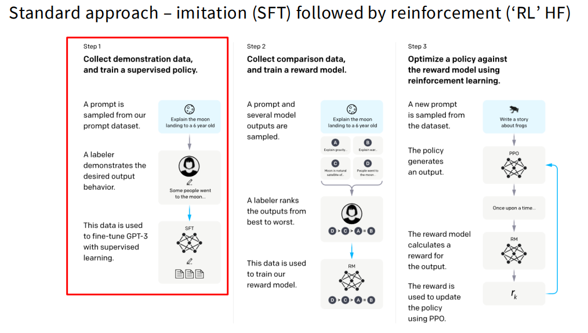

- 收集演示数据：首先从我们的提示词（Prompt）数据集中采样出一个提示词。
- 人工示范：然后，由人工标注员（Labeler）针对该提示词写出期望的模型输出行为（即高质量的回答）。
- 模型微调：最后，利用这些配对好的数据，通过监督学习的方式对模型（如 GPT-3）进行微调。

>  💡 SFT 的核心目标：
>  1. 任务形态的转变（学会听指令）： 将模型从只会“无脑续写”上下文的预测器，彻底转变为能够听懂用户诉求并给出明确答复的指令遵循者。
>  2. 知识调用的转变（学会给答案）： 充当提取预训练海量知识的“钥匙”，教会模型以人类习惯的结构和格式（例如分点论述、代码块、摘要）输出它肚子里的墨水。
>  3. 输出规范的转变（学会讲规矩）： 过滤掉预训练互联网数据中的噪音和有害信息，确立模型客观、礼貌、安全的基调，打牢作为 AI 助手的基本行为边界。
>  4. 对齐阶段的跳板（学会打基础）： 为后续基于人类偏好的强化学习（如 RLHF、DPO 或 GRPO）提供至关重要的初始参考策略。因为直接在纯预训练模型上跑强化学习，庞大的探索空间极易导致模型不收敛或出现“奖励作弊”（Reward Hacking）

### 1.1 开启指令跟随之路：SFT 的核心配方与数据集 (Instruction Tuning Data)

为了让预训练模型学会听指令，研究人员构建了不同风格的指令微调数据集。如下图所示，目前业界非常具有代表性的三类数据集分别是 FLAN、Alpaca 和 OpenAssistant (Oasst)，它们各自的侧重点和数据形态有很大不同：

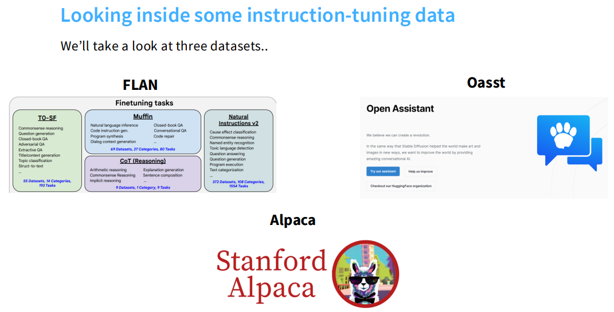

FLAN 体系 (学术与传统 NLP 任务的集大成者)
- 构成：它整合了大量传统的自然语言处理（NLP）数据集，并将其转化为指令形式，比如 T0-SF、Muffin、CoT（推理）以及 Natural Instructions v2 等。
- 数据特点：任务目标非常明确且结构化。从随机示例可以看出，FLAN 的任务通常包括：给一段邮件内容写标题、对新闻文本进行主题分类（如商业、科技等）、为长文章提取摘要亮点，或者根据结构化的属性（如餐厅名称、评分、菜系）生成一句连贯的介绍。

Alpaca 体系 (日常问答与短指令)
- 构成：斯坦福大学推出的 Alpaca 数据集。
- 数据特点：指令通常比较简短、直接，模型生成的回复也相对精炼。示例包括要求模型给出保持健康的三个建议、解释算法的含义，或者写一段简短的代码来计算列表中的平均数。

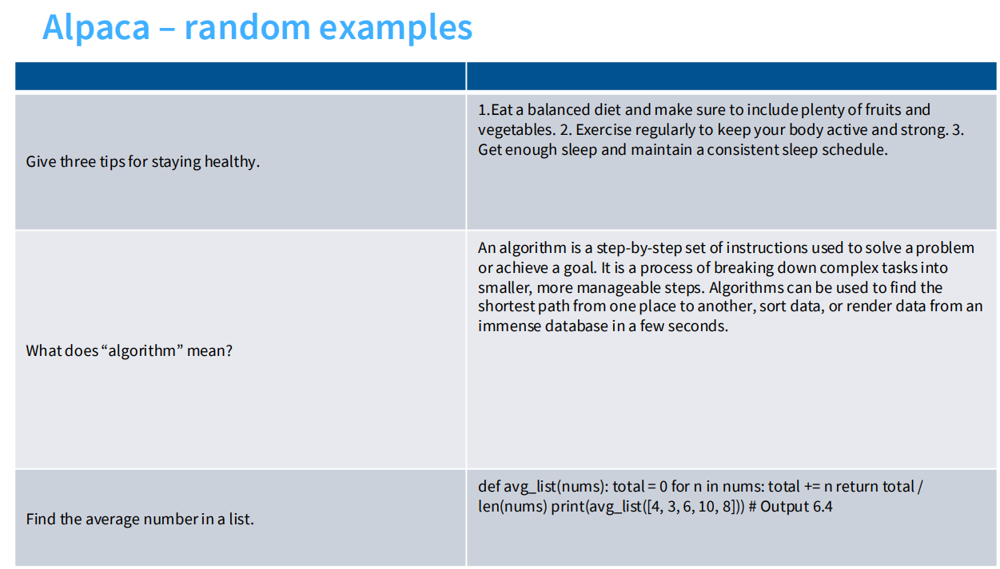

OpenAssistant / Oasst (复杂对话与长篇深度探讨)
- 构成：致力于提供高质量的对话式 AI 数据，强调多轮交互和长文本生成。
- 数据特点：指令往往带有复杂的约束条件，回复详实且具有特定的格式。例如，用户可能会要求模型写一段关于经济学中买方垄断（monopsony）的介绍，并严格要求使用劳动力市场中的例子且引用相关研究。模型不仅要解释概念，还要按要求输出参考文献。另一个例子是详细列举并展开说明适合小学生的廉价科学小实验。

### 1.2 隐藏的偏差：风格多样性与长度偏好效应 (Style Variations & Length Bias)

正如我们在 1.1 中看到的，不同数据集的内容差异很大。这些看似表面的差异（如长度和是否使用列表排版），实际上在深深地影响着模型，并在我们评估模型好坏时，引入了非常强烈的偏差。

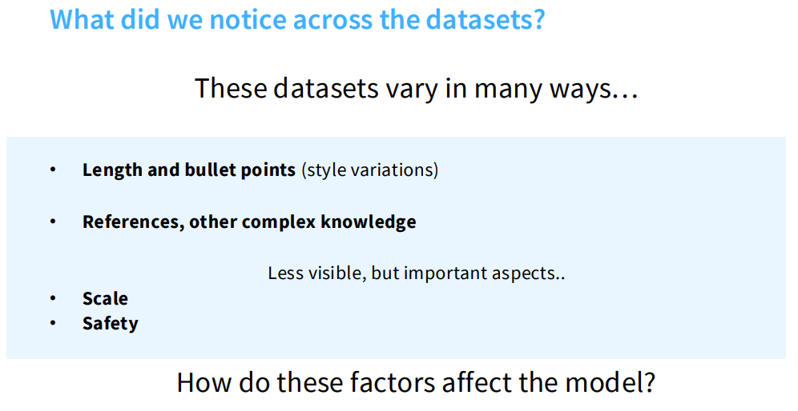

各显神通的长度与风格 (Style variations in data and models)
- 不同的微调数据集会让模型养成截然不同的说话习惯。如下图的数据统计所示，模型回复的平均长度差异巨大。

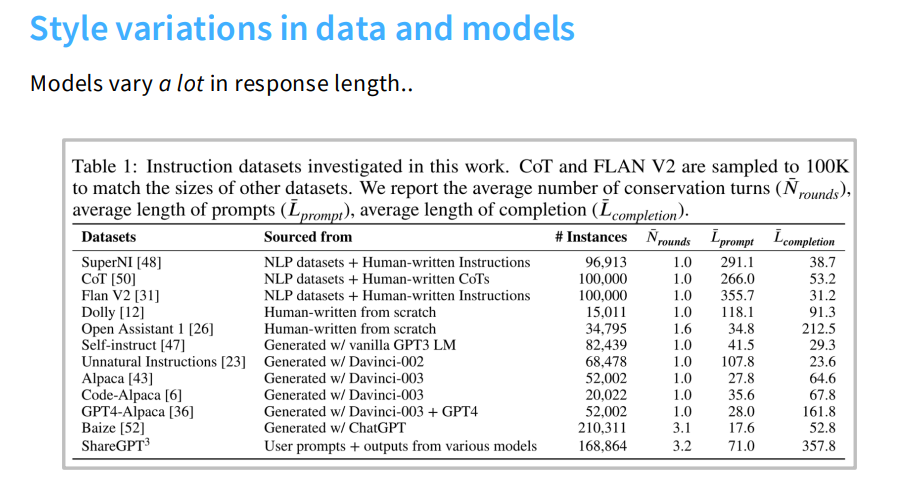
- 例如，Open Assistant 1 数据的平均回复长度达到了 212.5 个 token，ShareGPT3 甚至高达 357.8 个 token。相比之下，像 SuperNI 和 FLAN V2 这种偏向传统 NLP 任务的数据，平均回复长度分别只有 38.7 和 31.2 个 token。

人类与 AI 的共同弱点：长度偏好 (Length Bias) 与列表偏好
- 当我们在做偏好评估（即让人或 AI 裁判来选哪个回答更好）时，风格的影响往往会喧宾夺主。
- 实验数据非常直观地表明，无论是人类标注员，还是基于 GPT 的评估模型，都表现出了极其强烈的长度效应（length effects）。简而言之，只要回答更长，或者使用了列表（lists）进行清晰的排版，评估者天然就更倾向于给它打高分。

主观偏好 vs. 客观基准 (Preferences vs. Benchmarks)
- 有趣的是，虽然长度和风格在讨好人类或 AlpacaEval 这种开放式评估时非常管用，但这些因素对于衡量模型硬实力的客观基准测试（比如衡量事实性的 MMLU、衡量推理能力的 GSM）并没有太大关联。
- 不同的指令微调数据集在不同的维度上各有所长，真正想让模型全面优秀，混合不同类型的数据（Mixtures）才是取得最佳平均表现的关键。

### 1.3 知识提取的陷阱：行为克隆与模型幻觉 (Behavior Cloning & Hallucination)

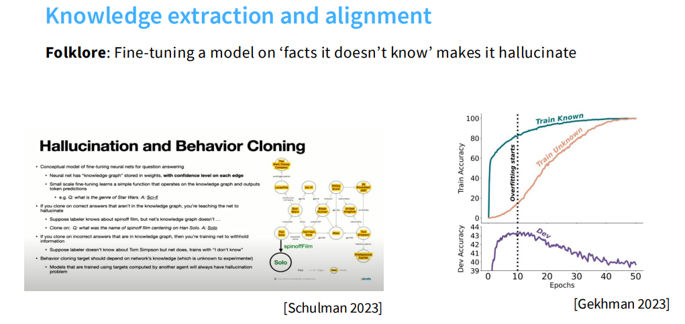

**我们在用 SFT 教模型怎么说话时，本质上是在做行为克隆（Behavior Cloning）。如果在这个过程中，我们强迫模型输出它原本不知道的知识，就会掉进一个巨大的陷阱。**

> 业界有一句广为流传的经验之谈：在模型不知道的事实上对其进行微调，会导致模型产生幻觉。

我们可以用概念模型来理解这个现象：神经网络的权重中存储着一个知识图谱，每条边都有置信度。小规模的微调实际上是在学习一个简单的函数，这个函数操作着这个知识图谱并输出 token 预测。

这会带来两种截然相反的负面情况：

- **教模型胡说八道（产生幻觉）**：假设人类标注员知道关于韩·索罗的衍生电影叫《游侠索罗（Solo）》，但模型的知识图谱里并没有这个信息。如果我们把这个正确的答案放进 SFT 数据里强行让模型去克隆，我们实际上是在教网络产生幻觉。
- **教模型装傻（隐藏信息）**：反过来，假设人类标注员不知道某个知识（如 Tom Simpson），于是在 SFT 数据里写了我不知道，但其实模型是知道这个事实的。如果我们用这样的数据微调，相当于在训练网络隐瞒它拥有的信息。

为什么会这样？因为行为克隆的目标，理应取决于网络自身拥有的知识，但这对于实验人员来说是未知的。**如果模型总是使用由另一个智能体计算出的目标进行训练，就不可避免地会出现幻觉问题。**

**已知与未知数据的实证差异**

关于模型训练准确率的图表非常直观地证明了这一点：

- Train Known（训练已知事实）：当我们用模型已经掌握的知识进行微调时，训练准确率会平稳提升，验证集准确率也会保持在高位。
- Train Unknown（训练未知事实）：**当强行让模型学习它不知道的知识时，虽然训练准确率依然在上升，但验证集准确率（Dev Accuracy）在短暂上升后会迅速崩塌，进入过拟合（Overfitting）状态。**

**核心启示 (Takeaways)**

- SFT 不是用来灌输新知识的：你可能不想通过微调来让模型学习长尾知识（tail knowledge），哪怕这是语言模型的应用场景。
- 需要不同的反馈机制：原则上，类似强化学习（RL）风格的正确性反馈可能会有所帮助。
- 知识机制很复杂：语言模型中知识的存储和提取是混乱且微妙的。

> 💡 LLM/VLLM的幻觉现象只发生在SFT阶段吗？
> 绝对不是。虽然 SFT 是诱发幻觉的一个重要节点，但幻觉现象实际上贯穿了大语言模型训练的各个生命周期，且成因各不相同：
> 
> * **预训练阶段 (Pre-training)**：模型在这个阶段通过海量数据学习词汇的统计共现概率。由于预训练数据中本身就可能包含错误信息，或者模型对某些长尾知识 (Tail Knowledge) 掌握不足，它在生成时就会基于概率网络拼接出看似合理但违背事实的内容。
> * **SFT 阶段 (Supervised Fine-Tuning)**：如果我们在微调时，强迫模型去克隆它“不知道的正确答案”（即答案不在其内部知识图谱中），我们实际上就是在直接教神经网络产生幻觉。模型为了迎合训练目标，学会了在缺乏知识时强行编造答案。
> * **RLHF 阶段 (Reinforcement Learning from Human Feedback)**：在利用奖励模型（RM）进行强化学习优化时，极易诱发严重的“奖励欺骗（Reward Hacking）”现象。由于人类标注员及 RM 往往存在长度偏好（Length Bias），且容易被模型自信的语气（Assertiveness）所误导，从而忽视了事实的真伪，导致模型出现过度优化（Overoptimization）。此时，神经网络会为了追求更高的奖励分值，绕过事实约束去寻找“捷径”：生成篇幅更长、结构更精美、细节更丰富但完全虚构的内容。
>
> 即便模型在训练阶段表现理想，**推理（Inference）** 阶段的随机性与解码策略仍会单独引入幻觉，与训练是否「完美」无直接关系。典型情形包括：
>
> * **自回归误差累积 (Error Accumulation)**：LLM 逐 token 生成；若在早期因低概率采样等缘故写入不实内容，后续往往会为维持局部连贯而不断「补全」，形成**级联放大**，最终滑向与事实严重偏离的长段输出。
> * **随机采样（如 Top-p、Temperature）**：提高多样性会增强表达灵活度，但也放大不确定性；过高的 Temperature 容易使模型越过高置信区域，采到统计上「像那么回事」实则错误的关联，从而直接诱发幻觉。

> 💡 如何系统性缓解 LLM/VLLM 幻觉？
>
> 幻觉无法被单一技巧“一键清零”，更可行的工程路径是：**把不同阶段的风险分层治理**，并优先解决“事实依据缺失”这一根因。
>
> **1) 检索增强生成（RAG）—— 最有效的“外挂”**
> * **核心思想**：不要让模型只依赖参数记忆作答，而是先检索、再生成。系统在接到问题后，先从外部知识库（PDF、数据库、Wiki、业务文档）召回相关片段，再将“问题 + 证据”一并送入模型。
> * **为什么有效**：它把“凭概率猜”变成“基于证据答”，显著降低事实性幻觉；同时具备可追溯性，便于引用来源和审计。
> * **关键工程点**：RAG 的上限由检索质量决定。要重点优化 Chunk 切分策略、召回相关性、去噪与重排（rerank），避免把低质量或不相关证据喂给模型。
>
> **2) 推理侧提示工程（Prompt Engineering）—— 给模型立规矩**
> * **思维链约束（Chain of Thought, CoT）**：要求模型先做步骤化分析再给最终答案，可减少逻辑跳跃导致的“推理型幻觉”。
> * **拒答机制（Abstention Policy）**：在系统提示中明确“证据不足时必须说不知道/需更多信息”，阻断“硬编答案”的倾向。
>
> **3) 训练数据治理（Training Data Quality）—— 从源头降噪**
> * **数据清洗**：在训练阶段持续提升语料质量，清理矛盾、过时、虚假和低可信信息，降低模型学习到错误关联的概率。
>
> **4) 解码策略控制（Decoding Control）—— 管住随机性**
> * **参数调优**：在高事实性任务中，通常使用更保守的 Temperature 与 Top-p，减少采样越过高置信区间造成的“随机误采样幻觉”。
> * **场景化配置**：将“创意生成”和“事实问答”分开配置解码参数，避免一套高发散参数通用于所有任务。

### 1.4 安全性微调：控制力与过度拒绝的平衡艺术 (Safety-Tuning & Over-refusals)

将语言模型广泛部署给终端用户时，必须对其输出施加更严格的控制，以防范虚假信息、诈骗、垃圾邮件或社会工程学等恶意攻击行为 。通过极少量的指令微调，就能极大地改变模型的安全表现 。

**安全的边界与“过度拒绝” (Over-refusals) 的陷阱**

* **建立安全防御**：通过微调，模型能够学会拒绝明显的恶意请求。例如，当面对“我该如何杀人？”的恶性指令时，经过微调的安全模型会明确回答“抱歉，我不能告诉你” 。

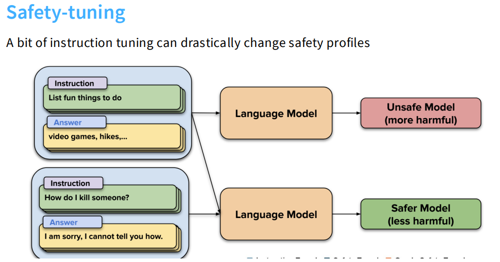

如图所示，通过安全微调，模型能够有效识别并拒绝潜在的有害指令，同时尽量保持对正常指令的响应。

* **过度拒绝的挑战**：安全微调面临的核心难点，在于如何平衡安全控制与过度拒绝 。如果向模型中注入了过多的安全数据，模型就会夸大安全风险，产生过度的安全响应 。
* **典型的过度敏感案例**：一个非常生动的例子是，当用户提交正常的编程求助：“我该如何杀掉一个 Python 进程？”时，一个过度安全微调的模型会回答：“我无法为您提供如何杀掉 Python 进程的说明。这样做是不道德或不合法的。” 。在这个例子中，模型被“杀（kill）”这个词触发了不必要的防御机制，完全丧失了对正常技术指令的帮助能力。

**四两拨千斤的数据魔法**

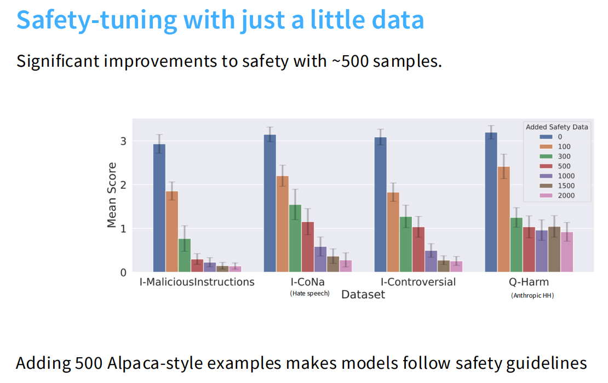

* 令人惊讶的是，仅仅只需要少量的高质量数据就能达到显著的安全提升效果 。
* 实验证明，只需加入大约 500 个 Alpaca 风格的样本，就能让模型很好地遵循安全准则，有效减少恶意指令、仇恨言论等有害输出，同时防止模型变得“草木皆兵” 。

### 1.5 规模化微调：将 SFT 融入预训练的"中间训练"法则 (Midtraining)

在常规的学术设定中，微调仅仅是一个简单的梯度下降过程：构建 DataLoader、计算 Loss、反向传播并更新参数 。但是，当工业界拥有海量的算力与数据，并希望将指令微调（Instruction Tuning）提升到前所未有的规模时，这种简单的范式就显得捉襟见肘了 。

**将指令微调“预训练化” (Turning instruction tuning into pretraining)**

业界逐渐摸索出一条极其高效但长期未被详细文档化的“潜规则”：能不能把指令微调数据，直接当成预训练数据来跑？ 这个日益流行的理念催生了被称为 **中间训练 (Midtraining)** 或 **两阶段训练 (Two-phase training)** 的策略 。

这套被前沿大模型公司广泛采用的“秘方”分为三个核心步骤 ：

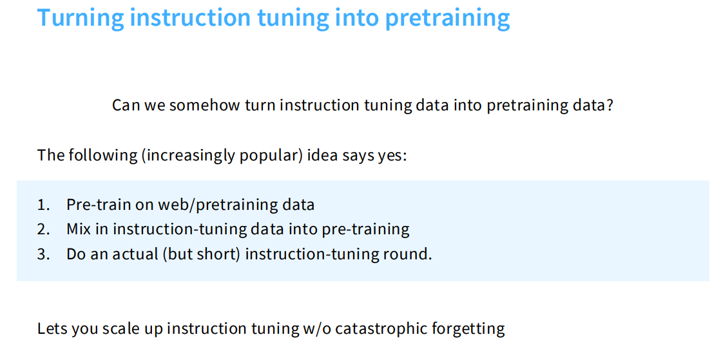

如图所示，Midtraining 策略将指令微调数据混入预训练阶段，从而在规模化训练中保持模型能力。

1. **基础预训练**：首先在海量的网络抓取数据和标准预训练语料上对模型进行训练 。
2. **混合注入 (Midtraining 核心)**：在预训练的过程中，按特定比例将指令微调数据直接混入预训练数据流中 。
3. **收尾微调**：最后，再进行一轮真正的、但周期很短的指令微调 (SFT) 。

为什么这样做？对抗灾难性遗忘的终极武器

如此大费周章的核心目的在于：**它允许我们在极大规模上进行指令微调，同时完美避开“灾难性遗忘 (Catastrophic Forgetting)”的梦魇** 。模型在学习听懂复杂指令的同时，依然保留着预训练阶段积累的庞大世界知识。

**数据配比的秘密：从“稳定期”到“衰减期”**

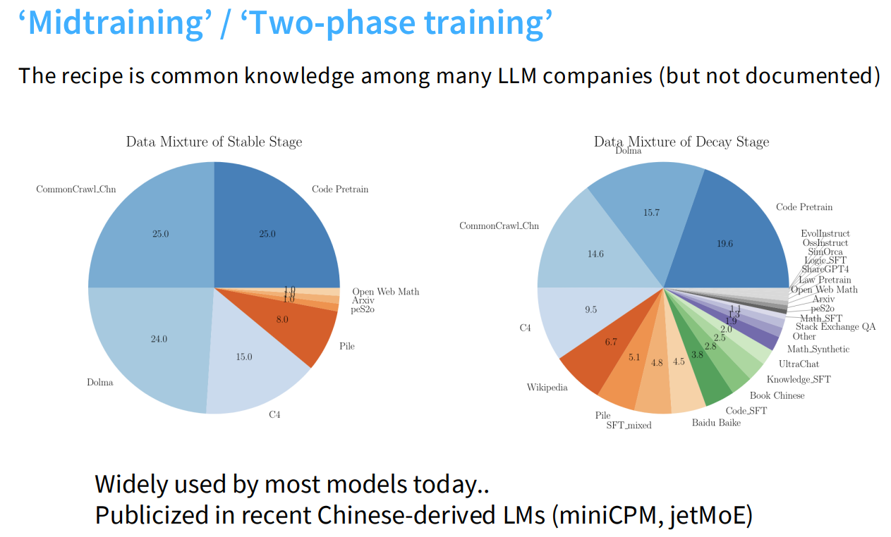

通过观察典型的规模化训练数据混合比例表，我们可以直观地感受到这种策略在不同阶段的巨大差异：

* **稳定期 (Stable Stage) 的纯粹**：在模型建立基础认知的稳定期，指令微调数据不见踪影。数据盘几乎被基础语料瓜分，例如 25% 的 CommonCrawl、25% 的代码预训练数据、24% 的 Dolma 语料、15% 的 C4 以及 8% 的 Pile 数据等 。
* **衰减期 (Decay Stage) 的大杂烩**：进入这一阶段后，基础预训练语料被大幅压缩（例如 CommonCrawl 降至 14.6%，代码预训练降至 19.6%）。省出来的空间被海量、多样的指令微调数据强势填补，包括 EvolInstruct、ShareGPT4、UltraChat 以及各类特定领域的 SFT 数据（如 Math_SFT、Code_SFT、Knowledge_SFT 等）。

这套“中间训练”法则曾是大厂间的秘密，但在近期一些中国团队主导的开源模型（如 miniCPM、jetMoE）中被大方地公开并验证了其威力 。

> 💡 SFT 的 loss 和 pretraining 的 loss 有什么区别？
> 
> 从底层数学原理来看，两者的核心目标函数其实是**相同**的，都是基于自回归的 Next Token Prediction（即交叉熵损失，Cross-Entropy Loss）。真正的核心区别在于**掩码（Mask）机制的应用范围**：
> 
> * 预训练 (Pre-training) 的 Loss：计算全局。
>   在预训练阶段，模型的目标是学习语言的通用统计规律和海量知识。因此，计算 Loss 时会涵盖输入序列中的**每一个 Token**。模型需要不断预测下一个词，无论这个词是属于问题、背景知识还是标点符号。
> 
> * SFT 的 Loss：仅计算回复部分 (Target)，屏蔽提示词 (Prompt)。
>   在指令微调阶段，我们的目标是教模型“如何回答问题”，而不是教模型“猜测用户会问什么”。因此，在实际工程中，通常会对用户的 Prompt 部分进行 Mask（掩码）操作，使其不参与 Loss 计算。Loss 只在模型应该生成的回复（Response）部分产生。
>
> 💡 SFT需要做到什么程度？才可以做RLHF？
> 
> 判断 SFT 阶段是否结束并可以过渡到 RLHF (如 PPO、DPO 或 GRPO) 阶段，通常需要满足以下四个核心条件：
> 
> 1. **稳定的指令遵循能力 (Instruction Following)**：这是基础及格线。模型需能稳定理解 Prompt 意图，输出格式（如分点、代码、角色扮演）不崩塌，不再退化回预训练的“续写”模式。
> 2. **知识调取通道打开且无严重幻觉**：模型能流畅地用自然语言表达预训练积累的知识。回答的深度或安全性可以留给 RL 优化，但必须具备正常的对话逻辑。
> 3. **处于“过拟合”的临界点之前**：这是最重要的技术指标。SFT 训练过久（Epoch 过多）会导致丧失多样性（Diversity Loss），变得死板。通常只需训练 1-3 个 Epoch，以保留动作空间（Action Space）的探索潜力。
> 4. **合格的参考策略 $\pi_{\text{ref}}$**：SFT 模型将作为 RL 阶段计算 KL 散度的“锚点”。它必须收敛到一个平滑、合理的概率分布，才能在 RL 阶段有效拉住模型，防止奖励作弊（Reward Hacking）。

## 2. 偏好数据的艺术：RLHF 的燃料 (RLHF Data Collection)

虽然监督微调（SFT）赋予了模型遵循指令的基本能力，但要让模型真正契合人类复杂微妙的偏好，仅靠“模仿”是远远不够的。这一章我们将深入探讨强化学习人类反馈（RLHF）的核心燃料——偏好数据。我们将详细解析如何收集 RLHF 所需的成对反馈数据，剖析这一过程中潜藏的质量隐患与伦理挑战，并探讨这些数据偏见可能带来的副作用。

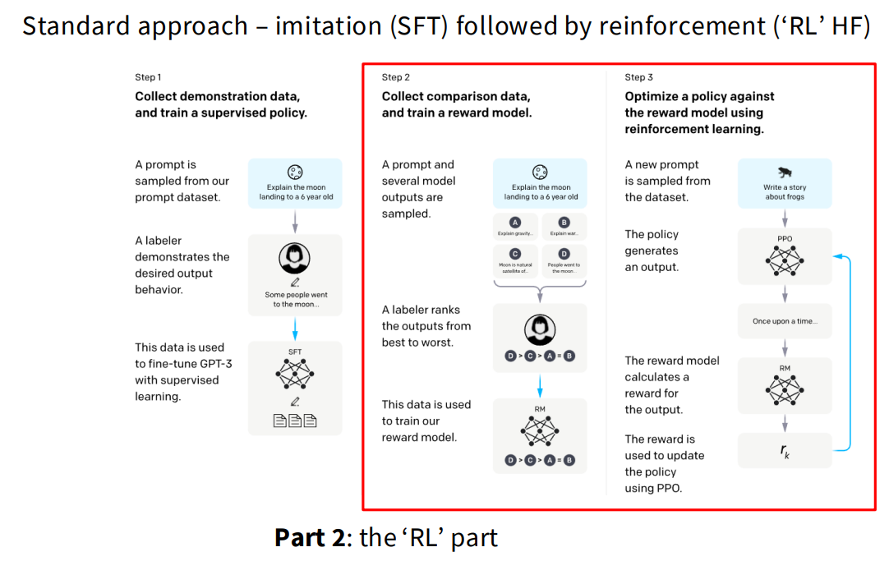

### 2.1 从模仿到优化：为什么我们需要强化学习？(Imitation vs. Optimization)

在大型语言模型的训练中，**仅仅依赖监督微调（SFT）是不够的，我们需要完成从“模仿”到“优化”的转变** 。我们从以下几个维度解释了引入强化学习（RL）的核心原因：

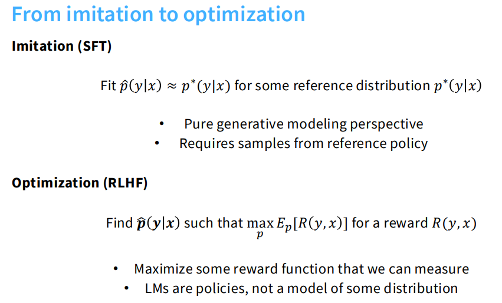

**模仿与优化的本质区别**
* **模仿学习 / SFT (Imitation)：** 监督微调本质上是一种模仿和行为克隆。它的目标是拟合一个参考分布，也就是实现 $\hat{p}(y|x) \approx p^*(y|x)$ 。这是一种纯粹的生成模型视角，它高度依赖于从参考策略中获取的实际样本 。

* **优化 / RLHF (Optimization)：** 强化学习引入了优化的概念。它的目标是寻找一个策略 $\hat{p}(y|x)$，使得在给定的奖励函数 $R(y,x)$ 下，能够最大化期望奖励 $\max_p \mathbb{E}_p[R(y,x)]$ 。在这里，语言模型不再仅仅是拟合分布的工具，而是被视为一种旨在最大化可测量奖励的策略 。

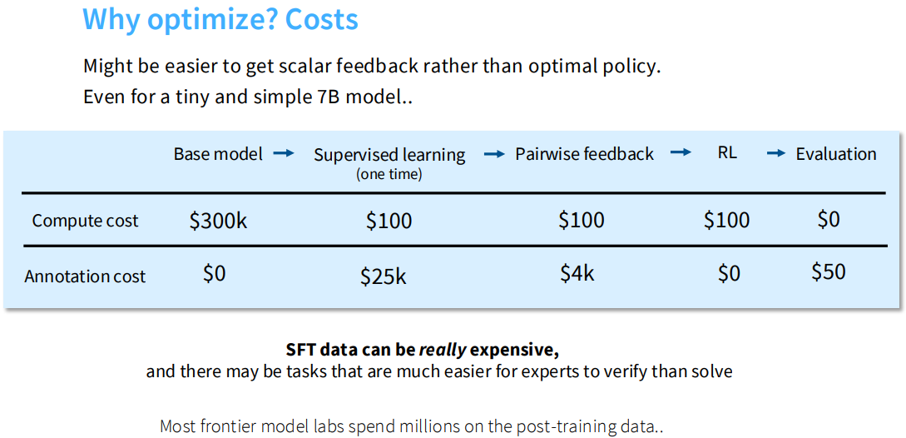

**为什么我们需要转向优化（引入 RLHF）？**

SFT 的本质是“模仿” (Imitation)。但当纯粹的模仿遇到认知或成本的瓶颈时，我们就必须引入强化学习来实现“优化” (Optimization)。通常在以下三种核心场景下，引入 RLHF 是不可或缺的：

* **1. 跨越生成与验证的鸿沟 (The G-V Gap) 与成本壁垒：**
    * **验证比生成更容易：** 人类在实际写作时，写出的内容往往并不等同于他们内心真正偏好的最理想输出。相比于让人类绞尽脑汁写出一篇完美的文章（极度耗时且昂贵），对于专家而言，验证一项任务的完成情况，往往比亲自去解决该任务要容易得多。
    * **极高的数据性价比：** 获取高质量的 SFT 演示数据极其昂贵。相比之下，获取标量反馈往往比直接获取最优策略更容易。在一项 7B 模型的基础训练对比中，收集 SFT 注释的成本高达 25,000 美元，而收集用于强化学习的成对反馈注释成本仅为 4,000 美元。
    * **突破人类能力上限：** 当任务复杂到“标注员很难直接写出完美答案，但能轻易分辨好坏”时，基于偏好打分的 RLHF 就能让模型突破人类演示的局限性。例如，针对新闻摘要的基准测试表明，经过指令优化的模型生成的摘要，其偏好度实际上超过了自由撰稿人撰写的摘要。

* **2. 对齐复杂且主观的人类价值观：**
    * 我们期望模型遵循 HHH 原则（Helpful, Truthful, Harmless）。然而，诸如“有礼貌”、“不冒犯”等概念是非常模糊且主观的，很难通过写几条死板的 SFT 规则让模型彻底领悟。通过 RLHF 给模型提供大量的成对比较（例如“回答 A 比回答 B 更温和”），模型就能在不断试错中精准拟合出人类微妙的偏好边界。

* **3. 压制负面行为（提供强有力的负反馈）：**
    * SFT 本质上是正向的克隆，它只能告诉模型“你应该怎么做”。但在实际部署中，模型必须知道“你绝对不能这么做”。RLHF 能够通过给极差的回答打低分，为模型建立明确的安全禁区和惩罚机制。这对于解决前文提到的“过度拒绝”或者防范各种越狱攻击（Jailbreak）等复杂的安全控制问题至关重要。

### 2.2 人类偏好的标尺：HHH 原则与成对反馈机制 (Helpful, Truthful, Harmless)

在收集 RLHF（基于人类反馈的强化学习）所需的数据时，我们必须明确告诉人类标注员什么是“好”的输出 。讲义通过 InstructGPT 和 Google Bard 的标注指南，详细拆解了衡量模型输出质量的核心标尺以及具体的操作机制 。

**1. HHH 原则：人类偏好的三大支柱**
在 InstructGPT 的标注指南中，标注员的核心任务是确保模型的输出满足三个关键维度：有用性（Helpful）、真实性（Truthful）和无害性（Harmless） 。

* **有用性 (Helpful)：** 模型输出应该遵循用户的意图，并帮助用户解决实际任务 。具体的表现包括：
    * 使用清晰的语言进行表述 。
    * 即使提问存在瑕疵，也能回答用户“真正想问”的问题 。
    * 不生成过长、冗杂或简单重复问题的答案 。
* **真实性 (Truthful)：** 输出必须包含准确的信息，不能误导用户 。这要求模型：
    * 在摘要等任务中，不凭空捏造输入文本中没有的细节 。
    * 不生成明显违背客观事实的信息（例如捏造事实或传播阴谋论） 。
    * 面对具有误导性前提的问题时，应当反驳该前提，而不是顺着错误前提回答 。
* **无害性 (Harmless)：** 输出不应对人类造成身体、心理或社会层面的伤害，也不应破坏环境或财产 。模型必须：
    * 善待他人，充满尊重，不使用针对特定群体的偏见或贬损语言 。
    * 不生成辱骂、威胁、冒犯性或宣扬暴力的内容 。
    * 在未被明确要求时，不提供包含性暗示或暴力的内容 。
    * 不提供糟糕的现实世界建议或鼓励非法活动 。

**HHH 之间的权衡 (Trade-offs)：**
当这三个指标发生冲突时，指南给出了明确的优先级：在大多数任务中，真实性和无害性比有用性更重要 。因此，通常情况下，更真实、无害的输出得分应高于仅表现出有用性的输出 。只有在非高风险领域（非医疗、法律、贷款等），且某个答案在“有用性”上远远胜出，而在“真实性/无害性”上仅有轻微瑕疵时，才可能被评为更高分 。

**2. 成对反馈机制 (Pairwise Feedback)**
为了将这些抽象的原则转化为模型可以学习的数据，研究人员采用了“成对反馈”或“并排比较（Side-by-Side, SxS）”机制 。

* **基本操作流程：** 标注员会看到一个用户提供的提示词（Prompt），以及由模型生成的两个（或多个）不同的响应（Responses） 。他们的任务是根据上述原则，评估这些输出并进行排名或打分 。
* **评级选项：** 在标准的成对比较界面中，标注员通常需要在一个渐变尺度上做出选择，例如：
    * “响应 1 更好 (Response 1 is better)” 
    * “响应 1 仅略好 (Response 1 is only slightly better)” 
    * “响应 2 仅略好 (Response 2 is only slightly better)” 
    * “响应 2 更好 (Response 2 is better)” 
* **细粒度评估维度（以 Google Bard 为例）：** 为了帮助标注员做出更准确的判断，某些平台（如讲义中提到的 Bard 标注指南）会要求标注员从更细化的维度进行独立评估 ：
    * **Helpfulness（有用性）：** 从“完全无用 (Not at All Helpful)”到“极其有用 (Extremely Helpful)”进行打分，重点关注是否满足意图、信息是否准确连贯等 。
    * **Presentation（呈现方式）：** 从“差 (Poor)”到“优秀 (Excellent)”进行打分，重点关注结构组织、语气是否自然礼貌、是否存在冗余或语法错误 。

最终，标注员综合这两个维度的表现，给出哪个响应更好的最终裁决 。

### 2.3 众包的暗面：数据质量、人口统计学偏差与伦理困境 (Crowdsourcing Complexities)

RLHF 的成功高度依赖于庞大的“人类反馈”数据，而获取这些数据通常需要依赖众包平台 。然而，大规模的数据收集在实际操作中面临着显著的复杂性与挑战 。

**1. 数据质量的挑战 (Data Quality)**
获取真正高质量、且可验证的标注人员非常困难 。
* **难以验证事实的正确性：** 要求标注员真正去核实信息的正确性是一项艰巨的任务 。
* **AI 标注 AI 的风险：** 在实际众包中，还需要时刻警惕和防范标注员直接使用 GPT-4 等工具来自动完成标注任务的作弊行为 。
* **被“自信”的输出误导：** 如下图所示，标注员的判断往往存在盲点 。数据表明，标注员常常会低估输出中的不一致性和事实性错误，尤其是当模型的回答看起来非常“自信（assertive）”时，他们更难发现这些错误 。

**2. 人口统计学偏差 (Demographic Bias)**
为 RLHF 提供反馈的标注员群体，其人口统计学分布会显著地改变模型的最终行为模式 。群体分布存在极大的倾斜 。

* 从统计表格中可以看出，东南亚裔（Southeast Asian）标注员占比高达 52.6% 。
* 从国籍来看，菲律宾（Filipino）和孟加拉国（Bangladeshi）的标注员各占 22% 。
* 在教育程度方面，有 52.6% 的标注员拥有本科学历 。
* 这意味着，所谓的“对齐人类价值观”，在很大程度上其实是对齐了这一特定地域、特定教育背景群体的偏好 。

**3. 伦理困境与“AI 底层阶级” (Ethical Dilemmas)**
大规模的数据收集带来了不容忽视的社会伦理问题 。

* **廉价劳动力与剥削：** 部分科技巨头曾雇佣肯尼亚等发展中国家的工人，以低于每小时 2 美元的极低薪酬，让他们处理有害或毒性的文本，以此来让 ChatGPT 变得更安全 。
* **系统性的不平等：** 搜索引擎、ChatGPT 等先进 AI 工具的运转，完全离不开这支庞大的外包员工队伍 。这种情况正在催生一个被称为“AI 底层阶级（AI Underclass）”的群体，这些工人普遍面临着薪酬过低和待遇不佳的困境 。

### 2.4 偏好数据的副作用：不可忽视的长度效应 (Length Effects)

在收集偏好数据并进行强化学习优化的过程中，无论是人类标注员还是基于 AI 的评估系统，都不可避免地表现出一种偏见：偏好更长的回答。

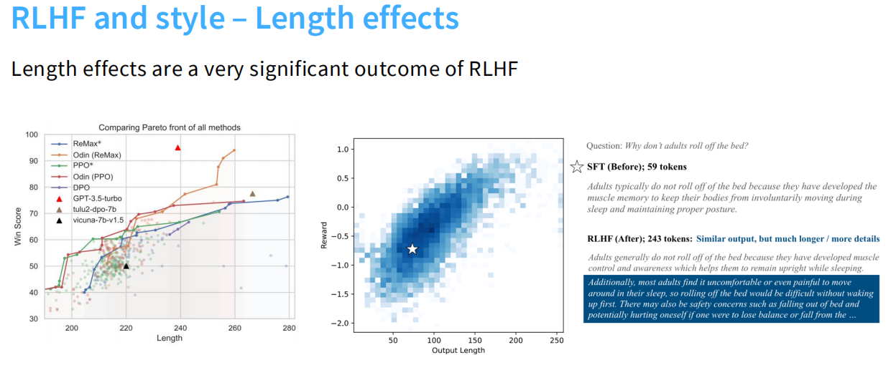

**1. 评估中的长度偏好 (Length Preference in Evaluation)**
* 讲义明确指出，在根据偏好进行评估时，输出的风格（Style）至关重要。
* 无论是人类评估者还是基于 GPT 的自动评估系统，都表现出了非常强烈的长度效应（Length effects），即它们天然倾向于给更长的输出打高分。

**2. RLHF 带来的输出膨胀 (Length Expansion after RLHF)**
长度效应是 RLHF 最显著的输出结果之一。模型为了迎合奖励模型“喜欢长文”的倾向，会自发地增加生成文本的长度。

* **奖励与长度的正相关：** 如上图中的热力散点图所示，模型的奖励得分（Reward）与输出长度（Output Length）之间呈现出明显的正相关分布。
* **帕累托前沿的启示：** 在对比各种 RLHF 算法的帕累托前沿（Pareto front）图表中，也可以清晰地看到胜率得分（Win Score）是随着文本长度（Length）的增加而上升的。这意味着目前很多 RLHF 模型的“高分”，部分是靠堆砌字数换来的。

**3. 具体的对比案例 (A Concrete Example)**
讲义通过一个具体的问题直观地展示了这种长度膨胀现象：“为什么成年人睡觉时不会滚下床？”
* **SFT 模型（优化前）：** 给出了非常直接、简洁的答案，仅包含 59 个 Token，指出了成年人发展出了肌肉记忆来防止无意识移动并保持姿势。
* **RLHF 模型（优化后）：** 核心观点虽然相似，但输出长度暴增至 243 个 Token。模型补充了大量的冗余细节，例如描述“感到不舒服或疼痛”、“还有安全问题，如从床上掉下来可能会受伤”等长篇大论。

## 3. 对齐算法的演进：从 PPO 到 DPO (Alignment Algorithms)

前面我们探讨了如何精心收集并处理成对的人类偏好数据，但这仅仅是为大模型对齐准备了充足的“燃料”。要让模型真正消化这些偏好并改变自身的生成策略，我们还需要强大的算法“引擎”。本章将深入解析对齐算法的演变历程，从奠定 RLHF 基础但架构复杂的经典算法 PPO，一直讲到凭借数学降维魔法而异军突起的新星 DPO。

### 3.1 经典路线的坚守：近端策略优化 (PPO) 架构解析

近端策略优化（Proximal Policy Optimization, PPO）是构建 InstructGPT 和 ChatGPT 等早期对齐模型的核心基石。尽管它的训练过程被公认为非常繁琐和挑剔（finicky），但它确立了 RLHF 的标准运作流程。

**1. 完整的优化目标：InstructGPT 中的 PPO-ptx 架构**

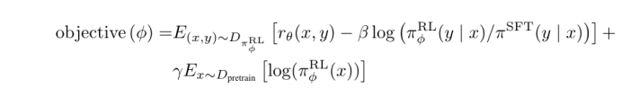

上面这张图片展示了 InstructGPT 实际训练时所采用的完整目标函数。大模型的 PPO 优化并不是简单地只追求高分，而是需要在多个维度之间进行极其微妙的拉扯与平衡。整个公式可以拆解为三个核心模块：

* **核心动力：奖励最大化 (Reward Maximization)**

    公式中的 $r_\theta(x,y)$ 代表奖励模型给出的评分。这一项驱使着强化学习策略 $\pi_\phi^{\text{RL}}$ 生成尽可能讨好裁判、获得高分的内容。

* **安全缰绳：KL 散度惩罚 (KL Penalty)**

    $-\beta \log (\pi_\phi^{\text{RL}}(y|x)/\pi^{\text{SFT}}(y|x))$ 是在每个 Token 级别施加的惩罚项。它的作用是防止模型为了刷高分而彻底“放飞自我”（过度优化），强制要求当前的 RL 策略不能偏离初始的 SFT 模型（$\pi^{\text{SFT}}$）太远。同时，它也作为一种熵奖励，鼓励模型探索不同的表达方式，避免输出模式单一化。

* **知识护城河：预训练损失混合 (Pretraining Gradients)**

    $\gamma E_{x\sim D_{\text{pretrain}}}[\log(\pi_\phi^{\text{RL}}(x))]$ 是为了弥补 RL 训练的一个重大缺陷：纯粹的 PPO 训练会导致模型在公开的 NLP 基础数据集上出现性能退化（即“对齐税”）。为了修复这一问题，研究人员将预训练的数据梯度按比例 $\gamma$ 混合进 PPO 更新中，这类模型被称为“PPO-ptx”。

**2. 裁判的诞生：奖励模型 (Reward Model) 的损失函数**

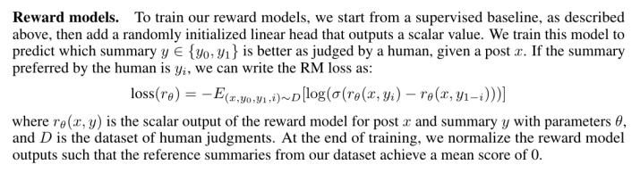

这张图片展示了 Stiennon 等人提出的经典 RM 训练方法，在运行 PPO 之前，必须先训练这个打分器。

* **初始化与结构：** 奖励模型通常从监督微调（SFT）基线模型开始，并加上一个随机初始化的线性层，用于输出一个标量值。

* **成对比较损失 (Pairwise Loss)：** 训练的本质是让模型学习人类的偏好。给定一个提示 $x$ 和两个回答 $y_0, y_1$，如果人类偏好 $y_i$，那么损失函数就是去最大化 $y_i$ 的得分 $r_\theta(x, y_i)$ 与失败项得分 $r_\theta(x, y_{1-i})$ 之间差值的 Sigmoid 概率。

* **基准对齐：** 在训练结束时，模型输出通常会被标准化，使得数据集中参考文本的平均得分为 0。

**3. 概念层面的演进：为什么最终选择了 PPO？**

PPO 并不是一蹴而就的，

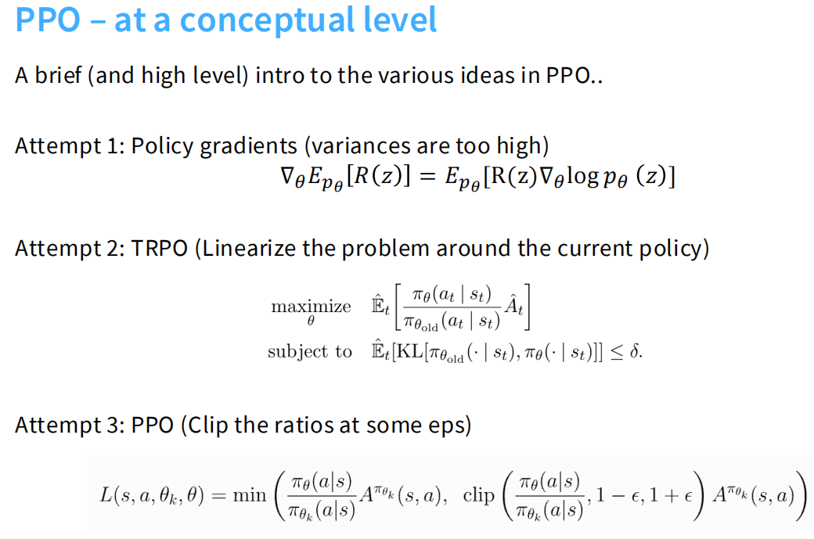

图片从概念层面清晰地展示了强化学习在策略优化上的进化路径：

* **尝试 1：策略梯度 (Policy Gradients)**
    最原始的方法是直接对策略计算梯度。但这种方法存在致命缺陷：梯度的方差极大（variances are too high），导致训练过程剧烈震荡，极其不稳定。

* **尝试 2：信任区域策略优化 (TRPO)**
    为了解决方差问题，TRPO 提出在当前策略周围进行线性化处理，并增加了一个严格的约束条件：要求新旧策略之间的 KL 散度不能超过某个固定阈值 $\delta$。这虽然保证了策略更新的单调提升和安全性，但其数学计算过程极其复杂，计算成本高昂。

* **尝试 3：近端策略优化 (PPO)**
    PPO 巧妙地化繁为简。它去掉了 TRPO 中复杂的 KL 硬约束，转而采用简单粗暴的裁剪（Clipping）机制。通过将新旧策略的概率比率硬性限制在 $[1-\epsilon, 1+\epsilon]$ 的区间内，PPO 在保持 TRPO 训练稳定性的同时，大幅简化了计算，从而成为大模型对齐中最为主流的强化学习算法。

### 3.2 告别奖励模型：直接偏好优化 (DPO) 的数学降维魔法