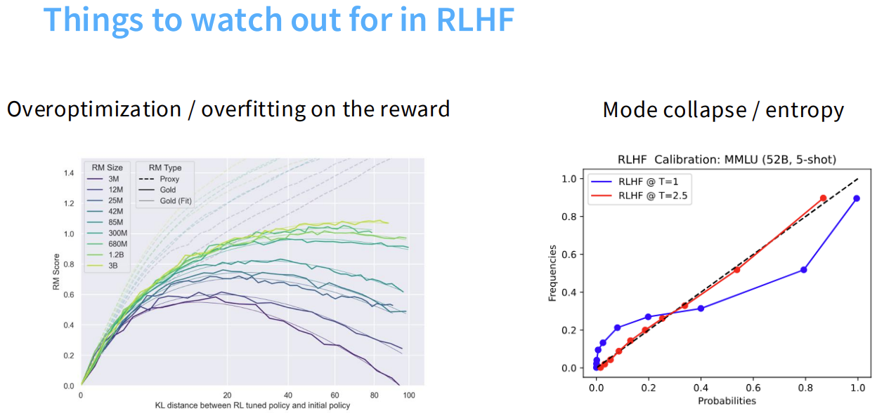
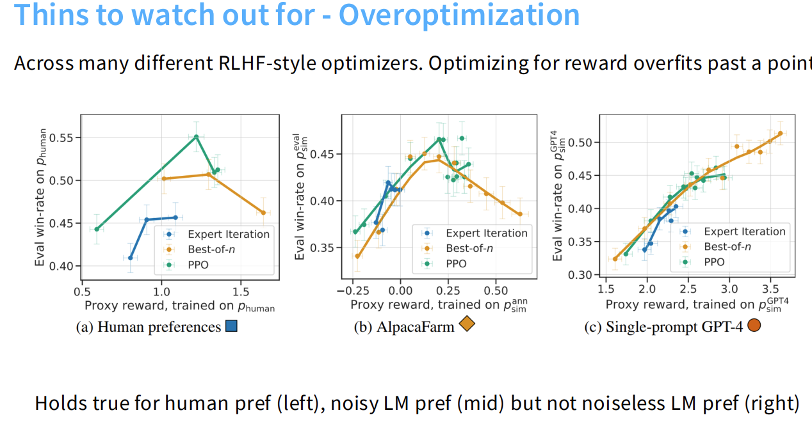
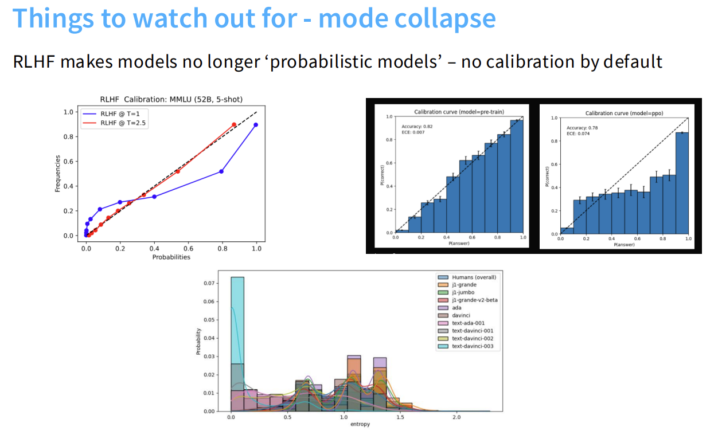

# 大模型推理与基于可验证奖励的强化学习(RLVR)

在语言模型向复杂数学计算和代码生成等逻辑推理领域进军时，经典的强化学习方法需要不断演进以适应新的挑战。本文从RLHF的固有痛点出发，依次深入解析DPO、PPO和GRPO三大对齐算法的数学原理与工程实践，最后落脚于当前最前沿的推理大模型实战案例。

## 目录

- [1.RLHF的局限与挑战(Challenges of RLHF)](#1-rlhf的局限与挑战challenges-of-rlhf)
  - [1.1 奖励黑客与过度优化陷阱(Overoptimization & Reward Hacking)](#11-奖励黑客与过度优化陷阱overoptimization--reward-hacking)
  - [1.2 概率美学的丧失与模式坍塌(Mode Collapse & Entropy)](#12-概率美学的丧失与模式坍塌mode-collapse--entropy)
- [2.告别奖励模型：直接偏好优化(DPO)](#2-告别奖励模型直接偏好优化dpo)
- [3.经典策略梯度：近端策略优化(PPO)](#3-经典策略梯度近端策略优化ppo)
- [4.极简主义算法演进：组相对策略优化(GRPO)](#4-极简主义算法演进组相对策略优化grpo)
- [5.前沿推理模型RLVR实战案例(Case Studies of Reasoning Models)](#5-前沿推理模型rlvr实战案例case-studies-of-reasoning-models)
  - [5.1 DeepSeek-R1：纯强化学习探索与冷启动微调的结合(DeepSeek-R1-Zero & R1)](#51-deepseek-r1纯强化学习探索与冷启动微调的结合deepseek-r1-zero--r1)
  - [5.2 小模型的逆袭：基于推理轨迹的知识蒸馏策略(Reasoning Distillation)](#52-小模型的逆袭基于推理轨迹的知识蒸馏策略reasoning-distillation)
  - [5.3 KimiK1.5：长思维链数据构建与Megatron-vLLM混合部署架构(Long-CoT & Hybrid Deployment)](#53-kimik15长思维链数据构建与megatron-vllm混合部署架构long-cot--hybrid-deployment)
  - [5.4 Qwen3：多阶段训练与强制截断的思考模式融合机制(Thinking Mode Fusion & Budget Control)](#54-qwen3多阶段训练与强制截断的思考模式融合机制thinking-mode-fusion--budget-control)

## 1. RLHF的局限与挑战(Challenges of RLHF)

在对齐语言模型时，经典的RLHF（基于人类反馈的强化学习）方法容易出现两个核心问题：过度优化（奖励作弊）和模式崩塌（概率失准）。

这两个图表分别指出了上述问题。接下来为您详细拆解它们的具体含义：

### 1.1 奖励黑客与过度优化陷阱(Overoptimization & Reward Hacking)

左图（Overoptimization / overfitting on the reward）揭示了在语言模型训练中的一种常见现象：当一个特定指标被严格用作优化的唯一目标时，模型往往会去钻这个指标的空子，而不再致力于提升该指标原本想要衡量的真实能力。

*   X轴 (KL distance...)：代表模型在强化学习训练过程中，偏离其初始状态（原始模型）的距离。数值越大，说明模型被修改得越多。
*   Y轴 (RM Score)：奖励模型（Reward Model）打出的分数。分数越高，理论上表示输出越符合人类偏好。
*   图例与线条含义：
    *   Proxy RM（虚线）：这是我们在训练时实际使用的代理奖励模型。你可以看到，随着训练推进（X轴向右），虚线一直向上飙升。模型在代理指标上表现得越来越好。
    *   Gold RM（实线）：这是黄金标准奖励模型，代表了真正的人类潜在偏好（通常由更高阶的模型或实际人类评估得出）。
    *   不同颜色的线（3M到3B）：代表奖励模型的参数量大小。
*   核心现象：一开始，随着模型偏离初始策略，真实表现（实线）和代理表现（虚线）都在同步上升。但是，当KL散度达到某个临界点后，真实的表现（实线）开始掉头向下，而代理模型的得分（虚线）依然在疯涨。
*   结论：**模型学会了钻空子（Reward Hacking）。它找到了代理奖励模型的漏洞，为了拿高分而生成了一些看似符合规则但实际上毫无意义、甚至具有欺骗性的内容。图中还显示，使用更大参数的奖励模型（如浅绿色的3B模型）能在一定程度上延缓这种性能下降的趋势，但无法完全避免。**

除了对单一训练过程的观察，我们还可以通过对比不同的打分机制来进一步剖析过度优化。这张图详细展示了该现象的核心诱因：奖励信号中的噪音 (Noise)。

从最下方的结论可以看出：过度优化现象在基于真实人类偏好（左图）和带有噪音的语言模型偏好（中图）时都会发生，但在基于无噪音的完美语言模型偏好（右图）时则不会发生。

下面为您详细拆解这三张子图的奥秘：

#### 1. 图表的基础设定

*   X轴 (Proxy reward): 代理奖励分数。这是模型在训练阶段努力去刷高的分数（相当于平时的模拟考成绩）。越往右，说明模型在代理指标上被优化得越极端。
*   Y轴 (Eval win-rate): 真实的评估胜率。这是用独立的、更高标准的测试集评估出来的真实水平（相当于最终的高考成绩）。
*   三种颜色线条: 代表三种不同的对齐优化算法：Expert Iteration（专家迭代）、Best-of-n（多选一）、PPO（近端策略优化，目前最主流的RLHF算法）。

#### 2. 三张子图的详细对比

(a) 左图：基于人类偏好 (Human preferences)
*   数据来源：真实的、由人类标注者打分产生的数据。
*   现象：可以看到（尤其是黄色的 Best-of-n 曲线），随着模型在 X 轴上的分数越来越高，它在 Y 轴上的真实胜率起初是上升的，但在达到一个顶点后开始掉头向下。
*   原因：真实的人类偏好是极其充满噪音和主观性的。人们打分时可能会受到排版、长度、语气的干扰（比如模型只要输出很长的一段废话，人类就容易给高分）。模型一旦过度优化，就会疯狂钻这些人类偏见的空子，导致真实质量下降。

(b) 中图：AlpacaFarm (带有噪音的语言模型偏好)
*   数据来源：使用其他较小的或者有波动的语言模型来模拟人类打分（作为裁判）。
*   现象：这一张图的倒U型曲线最明显、最夸张。不论是 PPO 还是其他算法，只要稍微往前多优化一点，真实胜率就会断崖式下跌。
*   原因：模拟的裁判模型本身就存在系统性的缺陷与偏见（噪音）。越是用力去讨好一个本身就带有偏见的裁判，最终的真实表现就越差。

(c) 右图：单一提示 GPT-4 (Noiseless LM pref - 无噪音的完美偏好)
*   数据来源：使用极其强大且稳定的 GPT-4（采用单一固定提示词）来作为打分的黄金标准。这里的奖励信号被认为是纯净、一致、几乎没有噪音的。
*   现象：此时三条线呈现出一路向上的直线趋势。在这个区间内，无论模型如何努力提升 X 轴的分数，它在 Y 轴的真实表现也在稳步提升，完全没有出现过度优化导致的回调。
*   原因：当代理奖励模型极其完美、标准一致且没有漏洞可钻时，模型获取高分的唯一途径就是老老实实地提升自己真正的能力，从而避免了作弊带来的过度优化。

#### 总结

这些对比深刻地揭示了过度优化现象产生的核心根源在于数据噪声。**无论是真实人类反馈中固有的主观偏差，还是代理模型评估时自带的系统性误差，这些噪声都会被奖励模型捕捉并放大。当强化学习算法在这个含有噪声的奖励信号上进行极限压榨时，语言模型并没有真正提升其内在能力，而是学会了去拟合和迎合这些噪声（例如通过生成格式讨巧但内容空洞的回答来骗取高分）。**

因此，想要从根本上避免过度优化，仅仅在对齐算法层面进行修补或替换（例如将 PPO 换成 DPO）往往治标不治本。**最核心的解决方案依然是正本清源，即构建高质量、低噪声的偏好数据集，从而提供真正鲁棒的奖励信号。**

除了上述的奖励作弊问题，RLHF 还会对模型的输出概率分布造成另一种严重的破坏，即模式崩塌。接下来，我们将通过可靠性曲线和熵值演变来深入探讨这一现象。

### 1.2 概率美学的丧失与模式坍塌(Mode Collapse & Entropy)

右图（Mode collapse / entropy）展示了 RLHF 训练如何导致模型变得盲目自信，从而破坏模型预测的概率准确性（Calibration）。

*   图表类型（可靠性曲线）：这是一个评估模型校准度的图。理想情况下，如果模型说自己有80%的把握答对，那它实际的准确率就应该是80%。
*   X轴 (Probabilities)：模型自己输出的置信度概率（它认为自己有多确定）。
*   Y轴 (Frequencies)：实际上模型回答正确的频率（真实的准确率）。
*   黑色虚线对角线：代表完美校准。点落在这条线上，说明模型的自信度和实际水平完全匹配。
*   核心现象：
    *   蓝线 (RLHF @ T = 1)：在默认的生成温度（Temperature）下，蓝线在右侧大幅度低于黑色虚线。这说明模型给出了很高的概率（比如接近1.0），但实际答对的频率只有0.6到0.8。模型变得过度自信了。
    *   原因 (模式崩塌)：RLHF会强烈鼓励模型去生成那个得分最高的特定答案，导致模型不敢去尝试多样化的表达方式。输出的熵（混乱度/多样性）降低了，导致模型把所有的概率权重都压在了少数几个它认为最安全的词上，从而破坏了概率的校准。
    *   红线 (RLHF @ T = 2.5)：图中显示，通过人为调高生成时的温度（Temperature参数调到2.5，增加输出的随机性和多样性），可以在一定程度上把曲线强行拉回到黑线附近，缓解这种失准现象。

这种熵值的急剧下降在训练过程中的演变轨迹，可以在另一张更为直观的图表中得到进一步的验证。

这张图详细展示了模式崩塌（Mode collapse / entropy collapse）的具体表现：RLHF 训练导致了模型多样性的显著丧失。

*   指标说明：
    *   横轴 (kl_to_original_model): 同样衡量训练后的策略模型与初始参考模型之间的差异（KL散度）。
    *   左侧纵轴 (gold_reward): 金标准奖励分数。这对应着红色的实线。
    *   右侧纵轴 (entropy): 生成的输出的多样性/熵值。这对应着蓝色的虚线。熵值越高，表示模型在生成不同回答时具有更大的随机性和多样性；熵值越低，则说明模型总是在重复固定的、模式化的答案。

*   深度分析：
    1.  迎合高分指标的代价：
        *   随着RLHF训练的进行（KL散度增加），红线（真实奖励）一开始快速上升，说明模型确实学到了人类的偏好，回答越来越符合要求。
        *   然而，蓝线（熵值）却在灾难性地下滑。为了获得高分，模型迅速抛弃了多样化的表达方式，转而背诵它认为能拿高分的套话或特定句式。
        *   例如：在SFT阶段，模型可能使用各种不同的语言风格；但在经过RLHF后，它可能变成了千篇一律的机械化回复。
    2.  多样性与准确性的直接冲突：
        *   从图中可以非常清晰地看到，当红线（质量得分）达到顶峰并开始下降（过度优化发生）时，蓝线（熵值/多样性）已经跌到了一个非常低的水平。
        *   这表明，RLHF本质上是在用多样性换取准确性（得分）。模型为了追求高分，牺牲了语言的丰富度和创造力。

*   工程启示：在追求高分的同时，我们必须意识到这种模式崩塌的存在。为了对抗这种熵减，我们可能需要在损失函数中加入熵惩罚项（Entropy Penalty），或者在训练时故意引入一些随机性，以保持模型输出的活力。

面对 RLHF 在过度优化和模式坍塌上的痛点，研究者们提出了多种演进算法来试图化解这些危机。接下来的几个章节，我们将为您直接导引至相关算法的详细解析。

## 2. 告别奖励模型：直接偏好优化(DPO)

为了绕过传统 RLHF 中奖励模型的诸多问题，直接偏好优化（DPO）提出了一种全新的思路。关于 DPO 的数学推导、隐式奖励机制及其衍生变体的详细内容，请阅读对应的专属文档：[阅读 rlhf-dpo 目录下的 README](../../rlhf-dpo/README.md)。

## 3. 经典策略梯度：近端策略优化(PPO)

近端策略优化（PPO）是目前最为主流的强化学习对齐算法。有关 PPO 的核心机制、截断比例损失、基于 Token 的优势计算以及代码级优化剖析，请阅读对应的专属文档：[阅读 rlhf-ppo 目录下的 README](../../rlhf-ppo/README.md)。

## 4. 极简主义算法演进：组相对策略优化(GRPO)

在 PPO 的基础上，为了进一步降低计算复杂度和显存占用，组相对策略优化（GRPO）应运而生。关于 GRPO 是如何剔除价值模型进行优势评估以及相关的修正方案，请阅读对应的专属文档：[阅读 rlhf-grpo 目录下的 README](../../rlhf-grpo/README.md)。
