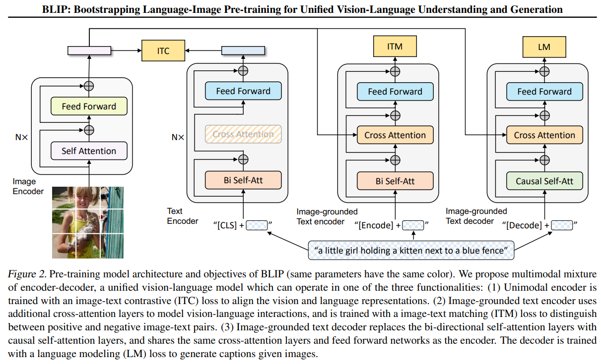

# BLIP: Bootstrapping Language-Image Pre-training

## 目录
- [模型架构简介](#模型架构简介)
- [核心创新：CapFilt 数据清洗机制](#核心创新capfilt-数据清洗机制)
- [三大核心损失函数（Loss）](#三大核心损失函数loss)
  - [ITC (Image-Text Contrastive Loss)](#itc-image-text-contrastive-loss)
  - [ITM (Image-Text Matching Loss)](#itm-image-text-matching-loss)
  - [LM (Language Modeling Loss)](#lm-language-modeling-loss)

## 模型架构简介

BLIP 旨在解决早期多模态模型功能相对单一的问题：此前的模型往往要么侧重于解决多模态理解任务，要么侧重于解决多模态生成任务。BLIP 的最大创新点在于提出了一种 统一的多模态视觉语言预训练模型，既能胜任理解任务，也能胜任生成任务。

在论文中，这种统一的模型架构被称为 多模态混合编码器-解码器（Multimodal Mixture of Encoder-Decoder, MED）架构。简单来说，BLIP 只包含 一个视觉编码器（Vision Encoder），但包含了 三种不同结构和用途的文本网络（两个文本编码器和一个文本解码器）。



## 核心创新：CapFilt 数据清洗机制

BLIP 名字里的 Bootstrapping（自举），其核心在于它提出的 CapFilt (Captioning-Filtering) 数据集清洗机制。这是 BLIP 能够利用受污染的网络数据训练出强大性能的关键。

### 1. 背景痛点
当时像 CLIP 这样的模型依赖从网络上海量爬取的图文对（如 LAION），虽然数量巨大，但噪声极高（比如图片是一只猫，文字却是“今日特价 9.9 包邮”）。直接拿这种低质量数据训练会严重影响模型的生成能力。

### 2. CapFilt 的解决方案
BLIP 利用了自身 MED 架构的多功能特性，把预训练好的 BLIP 拆成两个角色来协同工作：

- Captioner（生成器）：这是一个 Image-grounded Text Decoder。输入网络上的图片，让模型“看图说话”，生成一个干净的伪标签（Synthetic Caption）。
- Filter（过滤器）：这是一个 Image-grounded Text Encoder（利用 ITM 头部）。用来评估“原始网络文本”以及“Captioner 生成的文本”与图像的匹配度。如果匹配得分太低，则直接丢弃。

通过这种自产自销、自我进化的方式（即 Bootstrapping），BLIP 成功将海量的互联网噪声数据转化为了高质量的训练数据集，实现了模型性能的阶跃。

## 三大核心损失函数（Loss）

BLIP 的三种文本网络结构分别对应了三个不同的损失函数。接下来我们将结合官方代码片段，分别对这三个 Loss 的计算与结构进行讲解。

### ITC (Image-Text Contrastive Loss)

图文对比损失（ITC）的核心思想与 CLIP 类似。既然是对比损失，目的就是拉近匹配的图文对的距离，并推远不匹配的图文对。

- 图像端：图像特征由 Vision Transformer (ViT) 提取。将图片切分成 patch 并展平后，添加 `[CLS]` token，送入 Transformer Block 中提取特征，最终将提取出的 `[CLS]` token 作为图像的全局特征表示。
- 文本端：文本的处理方式类似。在文本最前面加上 `[CLS]` token，通过 单模态文本编码器（Text Encoder）提取特征，最终同样将 `[CLS]` token 作为文本的全局信息表示。该编码器使用的是 双向自注意力机制（Bi-directional Self-Attention）。

获取到文本特征和图像特征后，就可以像 CLIP 一样去计算对比损失了。为了进一步提升效果，BLIP 引入了动量编码器 (Momentum Encoder) 与特征队列 (Queue)：
- 机制：维护一个巨大的全局特征队列，用于存储最近多个 batch 的特征。在计算相似度时，模型可以同时利用当前 batch 和队列中的海量历史特征。
- 动量更新：使用一个参数缓慢更新的动量模型来产生这些历史特征。相比于直接使用旧的编码器参数，动量模型能够产生更连续、稳定的特征表示，减少了特征在时序上的剧烈波动。

#### 代码实现
在代码中，分别获取特征并进行归一化，然后计算相似度矩阵与对比损失（含 Momentum 更新细节）：

```python
# 提取图像特征并归一化
image_embeds = self.visual_encoder(image) # [batch_size, num_patches, dim]
image_feat = F.normalize(self.vision_proj(image_embeds[:, 0, :]), dim=-1) # [batch_size, embed_dim]

# 提取文本特征并归一化
text = self.tokenizer(caption, padding='max_length', truncation=True, max_length=30, return_tensors="pt").to(image.device)
text_output = self.text_encoder(text.input_ids, attention_mask=text.attention_mask, return_dict=True, mode='text') # [batch_size, seq_len, dim]
text_feat = F.normalize(self.text_proj(text_output.last_hidden_state[:, 0, :]), dim=-1) # [batch_size, embed_dim]

# ... (结合动量编码器的队列特征进行相似度计算) ...

# 计算相似度矩阵（这里的 self.temp 即为公式中的温度参数 τ）
sim_i2t = image_feat @ text_feat_all / self.temp # [batch_size, queue_size]
sim_t2i = text_feat @ image_feat_all / self.temp # [batch_size, queue_size]

# 计算交叉熵对比损失
loss_i2t = -torch.sum(F.log_softmax(sim_i2t, dim=1) * sim_i2t_targets, dim=1).mean()
loss_t2i = -torch.sum(F.log_softmax(sim_t2i, dim=1) * sim_t2i_targets, dim=1).mean()

loss_ita = (loss_i2t + loss_t2i) / 2
```

### ITM (Image-Text Matching Loss)

图文匹配损失（ITM）的作用是判断图片和文本是否匹配。虽然 ITC 也是在做类似的事情，但存在局限：ITC 基于 Softmax 计算相对概率（交叉熵损失），即它在训练时只要求正确的图文对距离大于不匹配的距离即可，并不需要精确知道正确的图文对到底匹配程度有多高。因此，ITM 的加入是为了 在 ITC 的基础上让图文匹配做得更精确。

为了实现这一点，ITM 的网络在单模态文本编码器的基础上，插入了一个 交叉注意力层（Cross-Attention），演变为 基于图像的文本编码器（Image-grounded Text Encoder）。
- 这样一来，文本特征就可以和视觉特征进行深度交互了。
- 具体而言，Cross-Attention 的 Query (Q) 来自文本，而 Key (K) 和 Value (V) 来自视觉编码器的输出。
- 最后，提取 `[Encode]` 特征进行二分类，判断是匹配还是不匹配。

在计算 ITM 时，如果只是随机挑选完全不相关的图文对作为负样本，二分类任务会变得过于简单，导致模型无法学到更深层的特征。

为了解决这个问题，BLIP 采用了难样本挖掘（Hard Negative Mining）机制：
- 策略：利用 ITC 计算出来的相似度矩阵，在当前 batch 内挑选出那些与当前图片最相似、但实际上并非正确配对的文本作为难负样本（Hard Negatives）。
- 作用：将这些具有迷惑性的“强力干扰项”送入 ITM 进行训练，迫使模型去学习更加精细的图文对齐逻辑，从而提升模型对细节的分辨能力。

#### 代码实现
注意代码中将文本的第一个 token 替换为了代表 Encode 的 `[ENC]` token，再送入含有 Cross-Attention 层的 `text_encoder` 中，最终提取特征做二分类运算：

```python
encoder_input_ids = text.input_ids.clone() # [batch_size, seq_len]
# 替换首个 token 为 [ENC] token
encoder_input_ids[:, 0] = self.tokenizer.enc_token_id

# 前向传播：计算正样本对 (positive image-text pair)
bs = image.size(0)
output_pos = self.text_encoder(
    encoder_input_ids,
    attention_mask=text.attention_mask,
    encoder_hidden_states=image_embeds, # 视觉特征作为 K, V, shape: [batch_size, num_patches, dim]
    encoder_attention_mask=image_atts,      
    return_dict=True,
) # output_pos.last_hidden_state shape: [batch_size, seq_len, dim]           

# ... (根据 ITC 相似度采用 Hard Negative Mining 挖掘负样本对) ...

# 前向传播：计算负样本对
output_neg = self.text_encoder(
    text_ids_all,
    attention_mask=text_atts_all,
    encoder_hidden_states=image_embeds_all,
    encoder_attention_mask=image_atts_all,      
    return_dict=True,
) # output_neg.last_hidden_state shape: [2 * batch_size, seq_len, dim]                            

# 取出 [ENC] token (即 idx=0) 的特征送入全连接层
vl_embeddings = torch.cat([
    output_pos.last_hidden_state[:, 0, :], 
    output_neg.last_hidden_state[:, 0, :]
], dim=0) # [3 * batch_size, dim]
vl_output = self.itm_head(vl_embeddings) # [3 * batch_size, 2]            

# 计算二分类的交叉熵损失 (匹配 / 不匹配)
itm_labels = torch.cat([
    torch.ones(bs, dtype=torch.long),
    torch.zeros(2 * bs, dtype=torch.long)
], dim=0).to(image.device) # [3 * batch_size]

loss_itm = F.cross_entropy(vl_output, itm_labels)  
```

### LM (Language Modeling Loss)

语言建模损失（LM）的主要任务是：在给定图像特征的前提下，生成或回答与图像相关的内容，比如视觉问答（VQA）或图像描述生成（Image Captioning）。

既然是生成任务，那么用来计算第三个 Loss 的文本网络（即 基于图像的文本解码器 Image-grounded Text Decoder），其中的自注意力机制肯定是 因果自注意力机制（Causal Self-Attention）；而前面两个文本编码器中的注意力机制则是双向自注意力机制。

- 因果自注意力机制：所谓的因果自注意力机制，就是当前 token 只能看到当前 token 和它前面的信息，无法看到它后面的信息。
- 实现方式：这种屏蔽机制通常是通过 `attention_mask` 来实现的。这个 `attention_mask` 矩阵的上三角是负无穷大，下三角是 0。在计算完 attention scores 之后，执行 `scores = scores + attention_mask` 来对特定位置（即未来信息）进行屏蔽。

#### 代码实现
注意代码中将第一个 token 替换为了 `[DEC]` (bos_token) 从而触发 Decoder 模式，使用 LM loss (通常是交叉熵) 来度量词表生成的准确率：

```python
decoder_input_ids = text.input_ids.clone() # [batch_size, seq_len]      
# 替换首个 token 为 [DEC] token (bos_token)
decoder_input_ids[:, 0] = self.tokenizer.bos_token_id

# 构建 targets，将被 pad 的位置设为 -100，使其在计算 loss 时被忽略
decoder_targets = decoder_input_ids.masked_fill(
    decoder_input_ids == self.tokenizer.pad_token_id, -100
) # [batch_size, seq_len]

# 将文本信息和图像特征共同送入文本解码器中
decoder_output = self.text_decoder(
    decoder_input_ids, 
    attention_mask=text.attention_mask, 
    encoder_hidden_states=image_embeds, # 视觉特征作为 K, V, shape: [batch_size, num_patches, dim]
    encoder_attention_mask=image_atts,                  
    labels=decoder_targets,
    return_dict=True,   
) # decoder_output.logits shape: [batch_size, seq_len, vocab_size]
  
loss_lm = decoder_output.loss                
```

## 关键细节：参数共享 (Parameter Sharing)

BLIP 的一个重要设计是 MED (Multimodal Mixture of Encoder-Decoder) 架构中的参数共享机制，这在提高参数效率的同时，也能帮助模型更好地在理解和生成任务之间迁移知识。

如上图所示（相同颜色的模块代表参数共享）：

1. Feed Forward Networks (FFN)：
   - 所有的文本模块（Text Encoder, Image-grounded Text Encoder, Image-grounded Text Decoder）都共享 FFN 层。

2. Self-Attention：
   - Text Encoder 和 Image-grounded Text Encoder 共享 双向自注意力层（Bi Self-Att）。
   - 注：解码器（Decoder）由于需要预测未来词，使用的是独立的 因果自注意力层（Causal Self-Att）。

3. Cross-Attention：
   - Image-grounded Text Encoder 和 Image-grounded Text Decoder 共享 交叉注意力层（Cross Attention）。
   - 这使得两者在将文本信息与图像特征对齐时，使用的是同一套交互逻辑。

通过这种巧妙的设计，BLIP 仅用了比常规模型略多的参数，就同时实现了三个不同功能的文本网络。