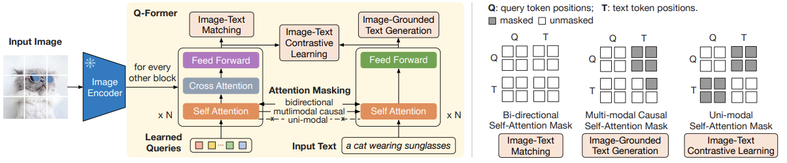
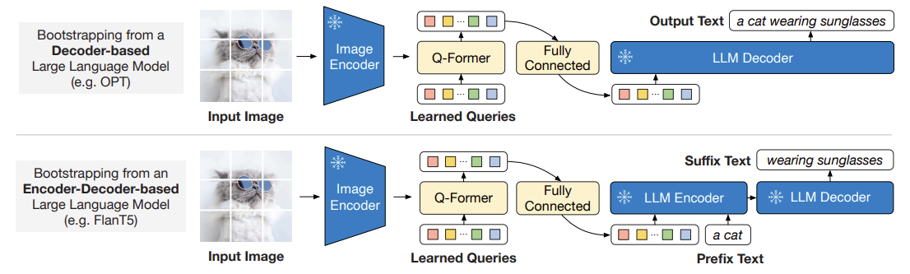

# BLIP-2: Bootstrapping Language-Image Pre-training with Frozen Image Encoders and Large Language Models

## 目录
- [BLIP-2 要解决的问题](#blip-2-要解决的问题)
- [Q-Former 模型结构](#q-former-模型结构)
- [第一阶段：视觉表征学习 (Vision-Language Representation Learning)](#第一阶段视觉表征学习-vision-language-representation-learning)
  - [ITC (Image-Text Contrastive Learning)](#itc-image-text-contrastive-learning)
  - [ITG (Image-Grounded Text Generation)](#itg-image-grounded-text-generation)
  - [ITM (Image-Text Matching)](#itm-image-text-matching)
- [第二阶段：视觉到语言的生成学习 (Vision-to-Language Generative Learning)](#第二阶段视觉到语言的生成学习-vision-to-language-generative-learning)
  - [关键理解：Stage 2 为什么不再给 Q-Former 输入文本？](#关键理解stage-2-为什么不再给-q-former-输入文本)
- [Q-Former vs LLaVA 中的 MLP (多模态特征映射层对比)](#q-former-vs-llava-中的-mlp-多模态特征映射层对比)
- [BLIP-2 的局限性与改进方向](#blip-2-的局限性与改进方向)


## BLIP-2 要解决的问题
- 高效、低成本地实现强大的视觉-语言理解与生成能力。
- 避免像早期多模态模型那样进行大规模端到端训练带来的巨大计算开销，通过充分利用预训练好的 冻结的图像编码器（Frozen Image Encoder）和 冻结的大语言模型（Frozen LLM）来实现跨模态对齐。

## Q-Former 模型结构
BLIP-2 的核心是一个轻量级的模块——Q-Former（Querying Transformer）。

- Q-Former 主要包含两部分：Image Transformer 和 Text Transformer。其内部结构主要是 Self-Attention（自注意力机制）和 Feed Forward（前馈神经网络）。
- 特别地，Image Transformer 会每隔一个 Transformer 块插入一个 交叉注意力层（Cross-Attention）。
- Image Transformer 和 Text Transformer 的自注意力层是共享参数的。
- 初始化：对于 Q-Former 的初始化，交叉注意力层 是随机初始化的，而其他模块则是使用预训练的 BERT 权重初始化的。


*(注意：此处为第一阶段示意图)*

## 第一阶段：视觉表征学习 (Vision-Language Representation Learning)

BLIP-2 的第一个训练阶段主要是视觉表征学习，目标是教会 Q-Former 如何从一张图片中，精准地提取与文本最相关、最有信息量的视觉特征。

### 第一阶段工作流程简述
在这一阶段中，大语言模型 (LLM) 完全不参与，仅有两个核心模块协同工作：
1. 冻结的图像编码器 (Frozen Image Encoder)：负责接收图片输入，提取基础的视觉特征（Patch Embeddings），在训练过程中参数保持不变。
2. 可训练的 Q-Former (Trainable Q-Former)：作为第一阶段唯一需要更新参数的核心模块。
   - 它的输入是：一组随机初始化且可学习的查询向量（Learnable Queries，默认 32 个）、文本描述（Text），以及图像编码器提取的视觉特征。
   - 它的工作方式是：这 32 个 Queries 作为“信息提取员”，通过交叉注意力机制（Cross-Attention）不断去图像特征中“捞取”信息，同时通过巧妙设计的掩码机制（Attention Mask），在三种不同的任务约束下与文本进行交互，从而完成参数的更新。

这三种任务对应了三个损失函数（Loss）：

### ITC (Image-Text Contrastive Learning)
- 目的：强迫 Q-Former 提取出的 Queries 视觉特征，在特征空间上尽可能靠近与之匹配的文本特征，同时推远不匹配的图文特征对。
- 做法：把 Q-Former 提取的视觉特征（一组 query embeddings）和文本特征（通常是一个 `[CLS]` token）做对比相似度计算。
- 关键技巧：为了防止“作弊”（即文本直接告诉 query 答案），这里采用了 单模态注意力掩码（Uni-modal Attention Mask）。它让 queries 和文本 token 在训练时互相看不见对方，逼着 queries 只能独立地从图像本身去提取对应的信息。

### ITG (Image-Grounded Text Generation)
- 目的：测试并强迫 Queries 从图像中提取的视觉信息足够丰富完整，丰富到足以支撑 Q-Former 的文本解码器部分生成出对应的图像描述文本（该任务也常被称为 MLM）。
- 掩码策略：这里用的是 因果注意力掩码（Causal Attention Mask）。Queries 之间可以互相看，也可以看所有的图像信息；但文本 token 只能看它之前的 token 和所有的 queries。这样，生成每个词所需的信息，都必须先由 queries 从图像中提前提取出来。

### ITM (Image-Text Matching)
- 目的：训练 Q-Former 进行更细粒度的图文特征融合，从而让 Queries 能够精准判断其提取的图像信息与当前输入的文本是否是真正匹配的一对（二分类任务）。
- 掩码策略：这里使用的是 双向注意力掩码（Bi-directional Attention Mask），让所有的 queries 和所有的文本 token 都能互相看见，进行深度交流。在充分融合后，让每个 query 都做一个二分类判断，最后把它们的判断结果进行平均。

#### 官方代码实现（LAVIS 库片段）
在 `lavis/models/blip2_models/blip2_qformer.py` 中，我们可以看到 Q-Former 的核心逻辑与三大 Loss 的计算过程：

```python
# 1. 提取 Query 和图像特征的交互
query_tokens = self.query_tokens.expand(image_embeds.shape[0], -1, -1)
query_output = self.Qformer.bert(
    query_embeds=query_tokens,
    encoder_hidden_states=image_embeds, # 冻结的 ViT 图像特征
    encoder_attention_mask=image_atts,
    use_cache=True,
    return_dict=True,
)
image_feats = F.normalize(self.vision_proj(query_output.last_hidden_state), dim=-1)

# 2. 提取文本特征
text_output = self.Qformer.bert(
    text_tokens.input_ids,
    attention_mask=text_tokens.attention_mask,
    return_dict=True,
)
text_feat = F.normalize(self.text_proj(text_output.last_hidden_state[:, 0, :]), dim=-1)

# === ITC (Image-Text Contrastive) ===
# 计算 query embeddings 和 text embeddings 之间的相似度，取最大值
sim_q2t = torch.matmul(image_feats.unsqueeze(1), text_feat_all.unsqueeze(-1)).squeeze()
sim_i2t, _ = sim_q2t.max(-1)

# === ITM (Image-Text Matching) ===
# 传入完整的 text IDs 和 query embeds，拼接 Attention Mask (双向可见)
attention_mask_all = torch.cat([query_atts_itm, text_atts_all], dim=1)
output_itm = self.Qformer.bert(
    text_ids_all,
    query_embeds=query_tokens_itm,
    attention_mask=attention_mask_all,
    encoder_hidden_states=image_embeds_all,
    encoder_attention_mask=image_atts_all,
    return_dict=True,
)
vl_embeddings = output_itm.last_hidden_state[:, : query_tokens_itm.size(1), :]
vl_output = self.itm_head(vl_embeddings)
logits = vl_output.mean(dim=1) # 综合所有 query 的判断
```

## 第二阶段：视觉到语言的生成学习 (Vision-to-Language Generative Learning)

在第一个阶段的学习之后，我们认为 Q-Former 已经可以（通过它那 32 个 Queries）提取出文本最需要的、最精炼的视觉信息。而第二个阶段，我们主要是教会 Q-Former，如何把它从图像中提取出的精华信息，以 LLM 能“听懂”的方式传递给它，从而让 LLM 能够根据图像生成文本。


*(注意：此处为第二阶段示意图)*

### 第二阶段工作流程简述

在 BLIP-2 的第二个阶段中，模型架构主要包含四个部分：训练好的 Q-Former、冻结的图像编码器 (Frozen Image Encoder)、冻结的大语言模型 (Frozen LLM)，以及一个可训练的全连接线性投影层（Linear Projection Layer）。

- 阶段核心目标：实现视觉特征到语言特征空间的模态对齐（Modality Alignment）。因为 LLM 并不懂图片，它只认“字”（文本 Token 的 Embedding）。我们要做的，就是把 Q-Former 提取出的 32 个 Queries 视觉特征，伪装成 LLM 能够理解的“软提示词”（Soft Prompts）。
- 可训练模块：在这个阶段，图像编码器和 LLM 都保持冻结状态，只有 Q-Former 和新加入的全连接映射层（Linear Projection Layer）是参与训练的。

特征对齐与前向传播流程：
1. 提取视觉特征：图片经过冻结的图像编码器，提取出基础的 Patch Embeddings。接着，这些特征和那 32 个 Queries 一起送入 Q-Former。Q-Former 凭借第一阶段学到的本事，输出 32 个高度浓缩的视觉特征 $Z$（例如维度为 `[32, 768]`）。
2. 维度映射对齐：LLM 的输入 Embedding 维度往往更大（比如 OPT 的 2048，或者 LLaMA 的 4096）。因此，需要通过那个 全连接映射层（Linear Projection Layer），将 $Z$ 的维度线性转换到与 LLM 一致的维度，得到 $Z'$（例如 `[32, 4096]`）。
3. 特征拼接 (Soft Prompts)：将转换后的特征 $Z'$ 作为软提示词（Soft Prompts），直接拼接到真实的文本描述 Embedding 的前面。
4. 生成与损失计算：将拼接好的 Embedding 序列送入 冻结的 LLM 中进行自回归的文本生成。训练采用的是标准的 语言建模损失（Language Modeling Loss），即预测下一个词（Next Token Prediction）。LLM 根据前面的视觉 Soft Prompts 和已生成的文本 Token，去预测下一个正确的词，通过反向传播来更新 Q-Former 和 映射层 的参数。

#### 官方代码实现（LAVIS 库片段）
在 `lavis/models/blip2_models/blip2_opt.py` 中，映射与输入的拼接逻辑如下：

```python
# 1. 经过 Q-Former 提取 32 个 Query 的特征
query_output = self.Qformer.bert(
    query_embeds=query_tokens,
    encoder_hidden_states=image_embeds,
    encoder_attention_mask=image_atts,
    return_dict=True,
)

# 2. 通过线性全连接层，将 Q-Former 的 hidden_size 映射到 LLM 的 hidden_size
inputs_opt = self.opt_proj(query_output.last_hidden_state)
atts_opt = torch.ones(inputs_opt.size()[:-1], dtype=torch.long).to(image.device)

# 3. 获取文本的 Embeddings (利用 Frozen LLM 的 Embedding 层)
opt_tokens = self.opt_tokenizer(text, return_tensors="pt", ...)
inputs_embeds = self.opt_model.model.decoder.embed_tokens(opt_tokens.input_ids)

# 4. 在序列维度上进行拼接：[Vision Embeddings, Text Embeddings]
inputs_embeds = torch.cat([inputs_opt, inputs_embeds], dim=1)
attention_mask = torch.cat([atts_opt, opt_tokens.attention_mask], dim=1)

# 5. 送入 Frozen LLM 计算语言建模损失
outputs = self.opt_model(
    inputs_embeds=inputs_embeds,
    attention_mask=attention_mask,
    return_dict=True,
    labels=targets,
)
loss = outputs.loss
```

### 关键理解：Stage 2 为什么不再给 Q-Former 输入文本？

在复习两个阶段的训练流程时，一个常见的疑问是：第一阶段明明有 Text Transformer 和各种图文损失，为什么第二阶段 Q-Former 后面直接接了 Linear 层连 LLM？原来的文本输入去哪了？

这里体现了 BLIP-2 设计中的解耦思想：

1. 第一阶段：文本是“脚手架”
   - 引入文本是为了通过 ITC/ITM/ITG 三大任务，强迫那 32 个可学习的 Queries 具备提取“能用文字描述的视觉特征”的能力。如果没有文本的引导，Queries 就不知道该从图像中捞取什么信息。

2. 第二阶段：彻底解耦，Q-Former 转为“视觉压缩器”
   - 在第二阶段，Q-Former 接收的只有图像（以及那 32 个 Queries）。它此时的角色已经转变为一个纯粹的高级视觉特征压缩器，输出固定长度的 32 个向量。
   - 至于用户的任务指令（比如“请描述这张图片：”），是直接通过 LLM 自己的 Tokenizer 和 Embedding 层输入给 LLM 的。Q-Former 此时不再处理用户的文本输入，而是专注于为 LLM 提供精炼的视觉背景。

## Q-Former vs LLaVA 中的 MLP (多模态特征映射层对比)

在多模态大语言模型（MLLM）的发展中，如何将视觉特征“翻译”并输入到语言模型中（即模态对齐/多模态特征映射），一直是核心的研究方向。

BLIP-2 提出了精巧复杂的 Q-Former，而随后出现的 LLaVA 则采用了极其简单的 MLP（多层感知机 / 线性映射层）。它们这两种方式都是为了解决同一个问题：将图像编码器提取的视觉特征，映射到 LLM 能够理解的文本 Embedding 空间中，从而实现多模态信息的交互与融合。

### 1. 核心设计与特征提取的对比

1. 从核心设计来看：
   - Q-Former 主要是作为一个轻量化的解码器，包含可学习的查询向量（Query Vectors）和交叉注意力机制。
   - LLaVA 的 MLP 只是一个或几个简单的全连接层，通常只是一次或两次线性变换（如 `Linear -> GELU -> Linear`）。
2. 从特征提取来看：
   - Q-Former 是动态的、交互式的、有选择性地进行抽取。它本身是一个庞大的参数模块，能学习如何从复杂的图像中提取对下游语言任务有用的信息。
   - LLaVA 的 MLP 是静态的、前馈式的、一视同仁地映射。MLP 本身不做特征筛选，只做维度空间变换，它处理的图像特征是固定的（通常是整张图打平的 patch 特征），由前级图像编码器决定。
3. 从计算复杂度与信息密度来看：
   - Q-Former 计算复杂度高，但其优势是特征经过了高度提炼，信息密度极高（固定为 32 个 tokens），大大降低了 LLM 处理长序列的计算负担。
   - LLaVA 的 MLP 计算复杂度极低（仅矩阵乘法），但它直接将庞大的、未被压缩提炼的视觉特征全都交给 LLM（例如 ViT 输出的几百上千个 patch tokens），最大限度地保留了原始图像的细粒度信息，减少了信息损失。

### 2. 代码层面的直观对比：LLaVA 是如何用 MLP 实现多模态交互的？

相比于前面 BLIP-2 中 Q-Former 复杂的 Cross-Attention 和三大 Loss 预训练，LLaVA 使用 MLP 进行特征映射的代码极其简单直观：

```python
import torch
import torch.nn as nn

class LLaVA_MLP_Projector(nn.Module):
    def __init__(self, vision_hidden_size=1024, llm_hidden_size=4096):
        super().__init__()
        # 简单的两层 MLP (Linear -> GELU -> Linear)
        self.mlp = nn.Sequential(
            nn.Linear(vision_hidden_size, llm_hidden_size),
            nn.GELU(),
            nn.Linear(llm_hidden_size, llm_hidden_size)
        )

    def forward(self, image_features, text_embeddings):
        """
        image_features: [batch_size, num_patches, vision_hidden_size] (例如 ViT 的输出)
        text_embeddings: [batch_size, seq_len, llm_hidden_size] (例如 LLM 自己的词嵌入)
        """
        # 1. 直接通过 MLP 将视觉特征映射到 LLM 维度空间
        # 输出维度: [batch_size, num_patches, llm_hidden_size]
        vision_embeddings = self.mlp(image_features)

        # 2. 将映射后的视觉 Embedding 直接拼接到文本 Embedding 之前 (Soft Prompts)
        # 拼接后维度: [batch_size, num_patches + seq_len, llm_hidden_size]
        multimodal_embeddings = torch.cat([vision_embeddings, text_embeddings], dim=1)

        # 3. 接下来直接把 multimodal_embeddings 喂给 LLM 即可
        return multimodal_embeddings
```

### 3. 行业趋势：为什么现在大家越来越喜欢用 MLP？

如果我们审视近一两年发布的开源多模态大模型（如 LLaVA 系列、Qwen-VL 早期版本、各种基于 LLaMA 微调的多模态模型），会发现 MLP 方案几乎已经成为了绝对的主流，而 Q-Former 这样复杂的设计反而被逐渐边缘化。

主要原因有以下几点：

1. LLM 本身的能力越来越强（“大力出奇迹”）：早期的 LLM 上下文窗口短、参数规模较小，因此需要 Q-Former 去帮它“浓缩”视觉信息，以减轻 LLM 的认知负担。但现在的 LLM（如 LLaMA-3、Qwen 等）动辄几十 K 甚至数百 K 的上下文窗口，且推理能力极强。直接把几百个未压缩的视觉 token 扔给它，它完全消化得了，而且还能自己学会在这么多 token 里找到有用的细节。
2. 保留极致的细粒度信息：Q-Former 把成百上千个 patch 强制压缩成了 32 个 Query，这种极致的压缩必然会导致严重的细粒度信息丢失（比如图片里很小的文字、极其细节的物体）。而 MLP 方案原封不动地保留了所有的 patch token，这对于提升模型在 OCR、高分辨率看图、文档理解等细粒度任务上的表现至关重要。
3. 数据工程 (Data Engineering) 的崛起：现在的共识是，多模态对齐的上限很大程度上取决于高质量的指令微调数据 (Instruction Tuning Data)，而不是极其复杂的映射网络结构。只要你喂给模型的数据足够好、数量足够大，即便只用一个两层的 MLP 线性映射，LLM 也能完美地学会如何理解视觉特征。
4. 训练与工程实现的极简主义：Q-Former 需要精心设计的预训练阶段（ITC, ITG, ITM 等），训练极其复杂。而 MLP 方案只需要“冻结视觉 -> 训练 MLP -> 全参数微调”这样简单粗暴且高效的两步走策略，非常利于开源社区的复现和迭代。

总之，随着底层基座大模型的能力飞跃以及数据工程的成熟，“用最简单的网络结构（MLP）传递最完整的信息，把复杂的理解工作交给强大的 LLM” 已经成为了目前多模态大模型架构的共识。

## BLIP-2 的局限性与改进方向

虽然 BLIP-2 通过 Q-Former 实现了高效的模态对齐，但在复习过程中我们也需要关注其暴露出的局限性，这些痛点也直接推动了后续 InstructBLIP、BLIP-3 以及 LLaVA 等模型的诞生。

### 1. Q-Former 的信息瓶颈：成也 32，败也 32
Q-Former 强制将任意分辨率、任意复杂度的图片压缩成 32 个 Token，这在带来计算效率的同时，也形成了严重的瓶颈：
- OCR 场景死穴：当图片包含整页密密麻麻的文字时，32 个 Token 根本无法承载如此庞大的信息量，导致 BLIP-2 的文字识别能力极差。
- 复杂场景理解：对于像清明上河图这样细节极其丰富、或者包含十几个物体的监控画面，32 个 Token 会导致严重的信息损耗（Information Bottleneck），细节丢失非常严重。

### 2. 演进逻辑：从压缩到保留
相比之下，后来的 LLaVA 方案选择不再进行这种极致压缩，而是保留几百个 patch token。虽然这让 LLM 的处理压力变大，但换取了极好的视觉细节还原效果。这种从“过度压缩”到“完整保留”的转变，也是多模态模型演进中的一个重要观察点。
