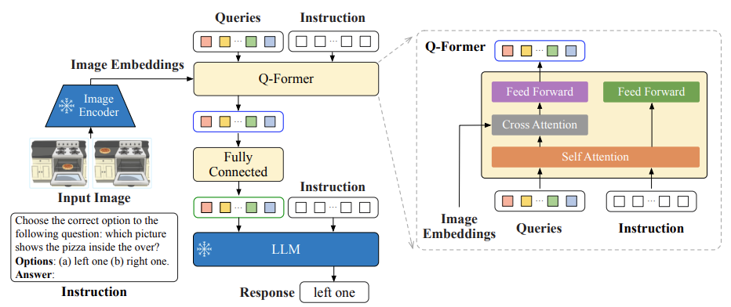
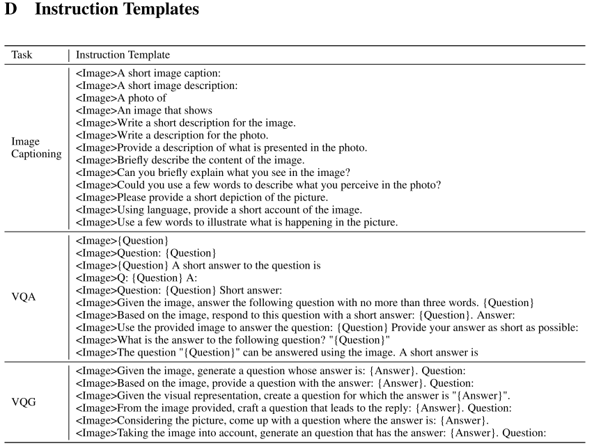

# InstructBLIP: Towards General-purpose Vision-Language Models with Instruction Tuning

## 目录
- [InstructBLIP 想要解决什么问题？](#instructblip-想要解决什么问题)
- [InstructBLIP 如何解决这个问题？](#instructblip-如何解决这个问题)
  - [1. 核心架构改进：指令感知的视觉特征提取](#1-核心架构改进指令感知的视觉特征提取)
  - [2. 数据工程：多样化指令数据集与平衡采样](#2-数据工程多样化指令数据集与平衡采样)
- [核心代码实现（Instruction-aware Q-Former）](#核心代码实现instruction-aware-q-former)


## InstructBLIP 想要解决什么问题？

随着大语言模型（LLM）的指令微调（Instruction Tuning）在 NLP 领域大获成功，InstructBLIP 试图将这种能力迁移到多模态领域。它想要解决的核心问题是：如何让一个模型能根据用户给出的自然语言指令，灵活地完成多种多样的视觉-语言任务，并且在没见过的任务（Unseen Tasks）上也能表现良好？
这本质上是在追求视觉-语言模型的 “零样本泛化能力”（Zero-shot Generalization）。此前的视觉-语言预训练模型大多在特定任务上微调，而难以通过统一的自然语言接口泛化到广泛的多模态任务上。


## InstructBLIP 如何解决这个问题？

InstructBLIP 的解决方案可以总结为两个核心：指令感知的视觉特征提取（Instruction-aware visual feature extraction）和 大规模指令微调数据集的构建。

### 1. 核心架构改进：指令感知的视觉特征提取
在模型架构方面，InstructBLIP 延续了 BLIP-2 的高效架构（冻结的图像编码器 + 冻结的大语言模型 + 中间的 Q-Former 连接器）。但它的关键改动在于：让 Q-Former 除了提取图像特征，还能直接接收文本指令的输入。

- 在 BLIP-2 中，Q-Former 提取的视觉特征对所有任务是一成不变的（Instruction-agnostic），它是静态的特征提取。
- 在 InstructBLIP 中，Instruction 的文本 token 会作为额外的输入，与 Q-Former 中那些可学习的 Queries 一起，通过 Q-Former 的自注意力层进行交互。
- 带来的好处：Q-Former 在提取视觉特征时，可以根据指令的不同（比如问的是“局部细节”还是“整体描述”，是“寻找文字”还是“逻辑推理”）动态调整注意力，从而提取与当前任务最相关的视觉信息。



### 2. 数据工程：多样化指令数据集与平衡采样
除了模型结构的改进，InstructBLIP 在数据工程上也下了很大功夫：
- 多样化指令构造：收集了 26 个公开数据集，覆盖 11 类视觉-语言任务（图像描述、视觉问答、视觉推理、图表理解、视觉对话、视频问答等）。研究人员为每个任务人工编写了 10-15 个不同的自然语言指令模板（比如“用一句话描述图像”或“根据图像回答以下问题”等），将原有数据集全部转化为 `(指令 + 图像) -> 回答` 的统一格式。
- 平衡采样策略：不同数据集的体量差异巨大。为了缓解数据集大小差异带来的训练偏差（防止模型在大数据集上过拟合，在小数据集上欠拟合），InstructBLIP 采用 按数据集大小的平方根比例进行采样 的策略。此外，还手动调整了某些任务类型（如多选题和开放生成题）的权重，确保模型在各项任务上均衡学习。

如下所示为 InstructBLIP 中用到的一些不同任务的自然语言指令模板：




## 核心代码实现（Instruction-aware Q-Former）

我们可以从官方代码库（如 LAVIS 中的 `blip2_t5_instruct.py`）里清晰地看到指令文本是如何参与到 Q-Former 的视觉特征提取中的：

```python
def forward(self, samples):
    image = samples["image"]
    # 1. 冻结的视觉编码器提取基础图像特征
    with self.maybe_autocast():
        image_embeds = self.ln_vision(self.visual_encoder(image))
    image_atts = torch.ones(image_embeds.size()[:-1], dtype=torch.long).to(image.device)

    # 2. 准备可学习的 Query Tokens
    query_tokens = self.query_tokens.expand(image_embeds.shape[0], -1, -1)
    
    # 3. 核心改进：Instruction-aware Q-Former
    if self.qformer_text_input:
        # 将文本指令（text_input）进行 tokenize，送入 Q-Former
        text_Qformer = self.tokenizer(
            samples["text_input"],
            padding='longest',
            truncation=True,
            max_length=self.max_txt_len,
            return_tensors="pt",
        ).to(image.device)
        
        # 将 Query 的 Attention Mask 和文本指令的 Attention Mask 拼接
        query_atts = torch.ones(query_tokens.size()[:-1], dtype=torch.long).to(image.device)
        Qformer_atts = torch.cat([query_atts, text_Qformer.attention_mask], dim=1)

        # Q-Former 接收 文本指令 (input_ids) 与 Query，并与图像特征发生 Cross-Attention
        query_output = self.Qformer.bert(
            text_Qformer.input_ids,
            attention_mask=Qformer_atts,
            query_embeds=query_tokens,
            encoder_hidden_states=image_embeds, # 基础图像特征
            encoder_attention_mask=image_atts,
            return_dict=True,
        )
    else:
        # 退化为 BLIP-2 的静态特征提取模式
        query_output = self.Qformer.bert(
            query_embeds=query_tokens,
            encoder_hidden_states=image_embeds,
            encoder_attention_mask=image_atts,
            return_dict=True,
        )

    # 4. 经过全连接层将 Q-Former 的输出投影到 LLM 的维度
    inputs_t5 = self.t5_proj(query_output.last_hidden_state[:, :query_tokens.size(1), :])
    atts_t5 = torch.ones(inputs_t5.size()[:-1], dtype=torch.long).to(image.device)

    # 5. 将提取出的指令感知视觉特征与文本指令一同送入冻结的大语言模型 (如 T5) 计算 Loss
    with self.maybe_autocast(dtype=torch.bfloat16):
        input_tokens = self.t5_tokenizer(
            samples["text_input"],
            padding="longest",
            truncation=True,
            max_length=self.max_txt_len,
            return_tensors="pt",
        ).to(image.device)
        output_tokens = self.t5_output_tokenizer(
            samples["text_output"],
            padding="longest",
            truncation=True,
            max_length=self.max_output_txt_len,
            return_tensors="pt",
        ).to(image.device)

        # ... (后续送入 LLM 计算语言建模 loss)
```

从上述代码可以看出，指令微调阶段文本指令不仅在最后送入了 LLM 作为 prompt，还提前送入了 Q-Former（即 `text_Qformer.input_ids`）。这使得 Q-Former 的 Query 与文本指令特征能在 Self-Attention 层充分交互，进而精准引导 Cross-Attention 层去关注图像中与指令最相关的区域。
