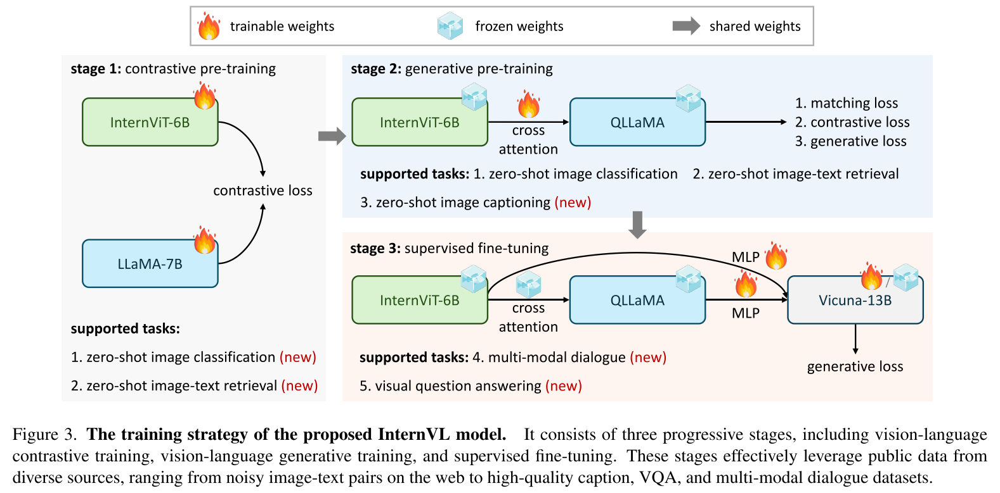
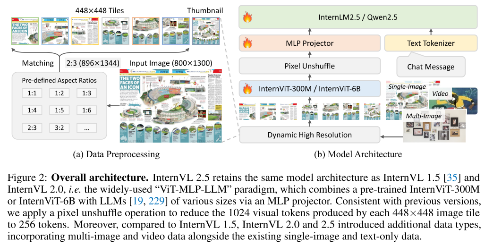
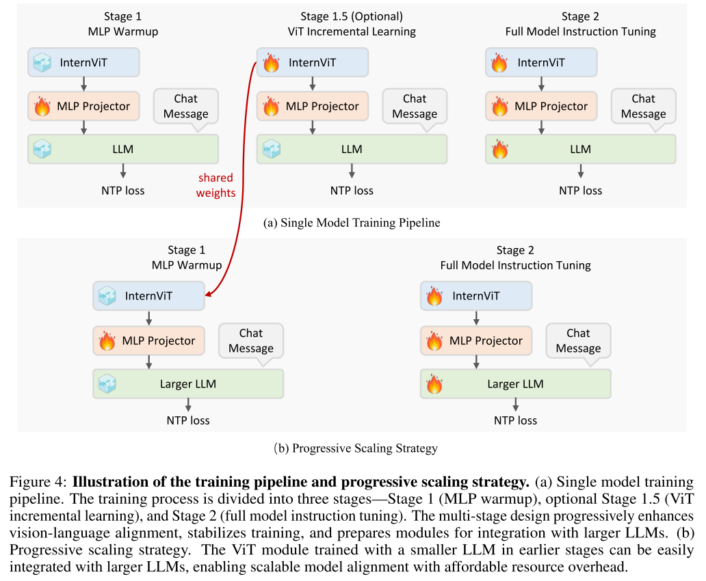

# InternVL系列核心架构组件与创新点详解

## 目录

- [1. 概述与版本演进总览](#1-概述与版本演进总览)
- [2. InternVL：多模态对齐的奠基](#2-internvl多模态对齐的奠基)
  - [2.1 InternViT-6B视觉编码器](#21-internvit-6b视觉编码器)
  - [2.2 QLLaMA语言中间件](#22-qllama语言中间件)
  - [2.3 渐进式对齐训练策略](#23-渐进式对齐训练策略)
- [3. InternVL2.5：视觉处理的工程突破](#3-internvl25视觉处理的工程突破)
  - [3.1 动态高分辨率策略](#31-动态高分辨率策略)
  - [3.2 Pixel Unshuffle Token压缩](#32-pixel-unshuffle-token压缩)
  - [3.3 渐进式缩放训练策略](#33-渐进式缩放训练策略)
  - [3.4 多模态数据 Packing](#34-多模态数据-packing)
- [4. InternVL3：原生多模态的范式革新](#4-internvl3原生多模态的范式革新)
  - [4.1 原生多模态预训练](#41-原生多模态预训练)
  - [4.2 V2PE可变视觉位置编码](#42-v2pe可变视觉位置编码)
  - [4.3 MPO混合偏好优化](#43-mpo混合偏好优化)
- [5. InternVL3.5：推理效率的全面升级](#5-internvl35推理效率的全面升级)
  - [5.1 Cascade RL级联强化学习](#51-cascade-rl级联强化学习)
  - [5.2 ViR视觉分辨率路由](#52-vir视觉分辨率路由)
  - [5.3 DvD解耦视语部署](#53-dvd解耦视语部署)

---

## 1. 概述与版本演进总览

InternVL系列在视觉编码器设计、多模态对齐策略、训练范式和推理效率等方面持续创新。下面将 InternVL、InternVL2.5、InternVL3 和 InternVL3.5 的核心演进进行总结。

| 版本 | 发布时间 | 参数规模 | 核心创新 | 最长上下文 |
| --- | --- | --- | --- | --- |
| InternVL | 2023.12 | 6B-14B | InternViT-6B、QLLaMA、渐进式对齐 | 8K |
| InternVL2.5 | 2024.12 | 1B-78B | 动态高分辨率、Pixel Unshuffle、渐进式缩放 | 16K |
| InternVL3 | 2025.04 | 1B-78B | 原生多模态预训练、V2PE、MPO | 32K |
| InternVL3.5 | 2026.02 | 1B-241B | Cascade RL、ViR视觉路由、DvD解耦部署 | 32K |

---

## 2. InternVL：多模态对齐的奠基

### 2.1 InternViT-6B视觉编码器

**设计动机**：现有视觉-语言模型中存在严重的参数规模失衡问题。语言模型已达千亿级别，而视觉编码器通常仅为10亿左右。这种规模不匹配限制了 LLM 能力的充分发挥，且传统视觉模型在纯视觉数据上训练，与 LLM 的特征空间存在表示不一致性。  

**技术原理**：InternViT-6B 采用标准 Vision Transformer 架构，将视觉编码器规模扩展至 60 亿参数，实现与 LLM 的参数平衡。其核心配置如下：

| 组件 | 参数值 | 说明 |
| --- | --- | --- |
| 层数（Depth） | 48 | Transformer层数 |
| 隐藏维度（Width） | 3200 | 特征维度 |
| MLP维度 | 12800 | 前馈网络维度 |
| 注意力头数（Heads） | 25 | 多头注意力配置 |
| 总参数量 | 5.9B | 视觉编码器规模 |

对于输入图像 $I \in R^{H \times W \times 3}$，模型生成用于密集预测任务的特征图：  

$$
\hat{F} \in R^{H/14 \times W/14 \times D}
$$

对于对比学习任务，通过注意力池化（Attention Pooling）计算全局视觉特征 $I_f$，并与文本特征 $T_f$ 计算相似度分数。  

**具体说明**：在处理一张 2048x1536 的高分辨率文档图像时，InternViT-6B 生成 146 x 109 x 3200 的特征图，保留了足够的空间细节用于 OCR 和文档理解任务，而传统1B级别的 ViT 在同等输入下会丢失大量细粒度信息。

### 2.2 QLLaMA语言中间件

**设计动机**：现有视觉特征和文本特征的连接层（projector）通常过于轻量且随机初始化，难以捕捉复杂的多模态交互。InternVL 引入 QLLaMA 作为更重的语言中间件，负责根据用户指令重组视觉特征，并桥接视觉编码器与 LLM 解码器。  

**技术原理**：QLLaMA 基于预训练的 LLaMA-7B 初始化，并新增关键组件：

| 组件 | 参数 | 功能 |
| --- | --- | --- |
| 基础模型 | LLaMA-7B | 预训练语言表示 |
| 可学习Query | 96个 | 视觉特征聚合 |
| 交叉注意力层 | ~1B参数 | 视觉-语言融合 |
| 总参数量 | 8B | 中间件规模 |

QLLaMA 的查询机制通过交叉注意力重新组织来自 InternViT-6B 的视觉表示，将其转换为与 LLM 空间对齐的表示，并作为前缀文本（Prefix Texts）输入到下游 LLM 解码器。  

**举例**：当用户询问“图像左下角的文字内容是什么”时，QLLaMA 的 96 个可学习查询会通过交叉注意力机制，有选择性地聚焦于图像左下角区域的视觉特征，生成与该空间位置相关的语义表示，供 LLM 进行精准回答。

### 2.3 渐进式对齐训练策略

**设计动机**：在海量异构数据上直接训练大规模模型容易导致训练不稳定和模态冲突。InternVL 采用三阶段渐进式策略，逐步实现视觉-语言特征空间的精细对齐。  

**技术原理**：三阶段训练策略如下：

**阶段一：视觉-语言对比训练**

- 数据规模：约49.8亿图像-文本对（LAION-en、LAION-multi、COYO、Wukong等）
- 损失函数：CLIP对称交叉熵损失
- 训练参数：InternViT-6B随机初始化，LLaMA-7B预训练初始化，全参数训练
- 学习率：图像编码器1e-3，文本编码器1e-4，余弦调度

**阶段二：视觉-语言生成训练**

- 数据规模：约10.3亿条高质量图像-文本对（LAION-COCO等）
- 损失函数：

$$
L = L_{ITC} + L_{ITM} + L_{ITG}
$$

- $L_{ITC}$：图像-文本对比损失
- $L_{ITM}$：图像-文本匹配损失
- $L_{ITG}$：基于图像的文本生成损失
- 训练参数：冻结 InternViT-6B 和 QLLaMA 原始权重，仅训练新增的查询和交叉注意力层

**阶段三：监督微调（SFT）**

- 数据规模：约400万条高质量指令数据（LLaVA-150K、SVIT、VisDial等）
- 连接方式：通过 MLP 层将 InternVL 与 LLM 解码器（Vicuna 或 InternLM）连接
- 训练参数：冻结 LLM 解码器，训练 MLP 层或同时训练 MLP 与 QLLaMA

解释：这种渐进式策略类似于人类进阶式的学习过程，先通过大量双模态对照材料建立映射（阶段一），再通过精读材料学习语法和表达（阶段二），最后通过对话练习掌握实际应用（阶段三）。

---

## 3. InternVL2.5：视觉处理的工程突破

### 3.1 动态高分辨率策略

**设计动机**：固定分辨率处理导致高分辨率图像细节丢失，不同比例图像被强制裁剪或填充引入伪影。InternVL2.5 继承并增强了动态高分辨率策略，根据输入图像的原始尺寸自适应生成视觉 token。  

**技术原理**：该策略将输入图像根据长宽比和分辨率切分为多个 448 x 448 像素的切片（Tiles）。设最大切片数为 $n_{max}$，则图像被切分为不超过 $n_{max}$ 个切片，每个切片独立经过 ViT 编码器处理。  

对于视频数据，采用简化方案：将 $n_{max}$ 设置为1，每帧调整为固定的 448 x 448 分辨率。这是因为视频通常提取大量帧（如32或64帧），即使不使用高分辨率输入，也会产生大量视觉 token。  

| 数据类型 | $n_{max}$ 设置 | 典型帧数 | 视觉token规模 |
| --- | --- | --- | --- |
| 单图高分辨率 | 12 | 1 | 3072 |
| 多图场景 | 4-6 | N张 | Nx1024-1536 |
| 视频 | 1 | 32-64 | 8192-16384 |

**举例说明**：处理一张 3584x2688 的卫星遥感图像时，系统自动将其划分为 8 x 6 = 48 个切片（受 $n_{max}$ 限制后取 12 个最重要区域），每个切片独立编码后拼接，保留了地物细节和空间关系。

### 3.2 Pixel Unshuffle Token压缩

**设计动机**：全局自注意力的计算复杂度为 $O(N^2)$，当处理高分辨率图像时，token 数量剧增导致显存溢出和推理延迟。Pixel Unshuffle 通过空间重组将视觉 token 数量减少为原来的 1/4。  

**技术原理**：对于每个 448 x 448 图像切片，InternViT 产生 32 x 32 = 1024 个视觉 token。Pixel Unshuffle 操作将相邻的 2 x 2 个 token 在通道维度上堆叠，将空间分辨率（token 数量）从 32 x 32 降至 16 x 16。  

设输入特征图为 $F \in R^{H \times W \times C}$，Pixel Unshuffle 操作为：

$$
F_{out} \in R^{H/2 \times W/2 \times 4C}
$$

通过后续的线性投影将通道维度 4C 映射回 C，实现无损信息压缩。  

比如：处理 12 个图像切片时，原始 token 数量为 12 x 1024 = 12288；经 Pixel Unshuffle 压缩后为 12 x 256 = 3072，减少 75% 的计算量，同时保留了关键视觉信息。

### 3.3 渐进式缩放训练策略

**设计动机**：直接在大规模 LLM（如72B）上训练视觉编码器成本极高。InternVL2.5 提出渐进式缩放策略，先在较小 LLM 上优化视觉能力，再迁移到大模型。  

**技术原理**：训练 Pipeline 分为三个阶段：

- **Stage 1（MLP Warmup）**：仅训练随机初始化的2层 MLP 投影器，冻结 ViT 和 LLM，建立初步的跨模态对齐。
- **Stage 1.5（ViT Incremental Learning，可选）**：同时训练视觉编码器和 MLP，LLM 保持冻结。使用 NTP Loss 增强视觉特征提取能力，特别针对稀有领域（多语言 OCR、数学图表）。
- **Stage 2（Full Model Instruction Tuning）**：全参数训练 ViT、MLP 和 LLM。

关键创新在于权重共享机制：在 Stage 1.5 阶段使用较小的 LLM（如20B）训练 ViT，随后将训练好的 ViT 权重直接迁移到更大的 LLM（如72B），无需重新训练 Stage 1.5。

| 模型 | 训练Token数 | 对比Qwen2-VL |
| --- | --- | --- |
| InternVL2.5-78B | ~120B | 1/10 |
| Qwen2-VL | 1.4T | 基准 |

说明：训练 InternVL2.5-78B 时，先用20B的 LLM 完成 Stage 1.5 的视觉优化（约消耗100B tokens），然后将 ViT 权重迁移到78B模型进行 Stage 2 微调（约20B tokens），总成本不到从头训练的十分之一。

### 3.4 多模态数据 Packing

**设计动机**：多模态训练数据的序列长度差异巨大（短对话 vs 长文档），传统 padding 方式导致 GPU 利用率低下。  

**技术原理**：数据打包策略将多个样本拼接成长序列，减少 padding 浪费。同时采用 ChatML 风格统一所有数据格式（Caption、OCR、检测数据均转换为对话格式）。

| 数据类型 | Token占比 | 样本规模 |
| --- | --- | --- |
| 单图数据 | 45.92% | 约7.5M |
| 多图数据 | 9.37% | 约1.5M |
| 视频数据 | 39.79% | 约6.5M |
| 纯文本数据 | 4.92% | 约0.8M |
| 总计 | 100% | 16.3M |

比如：将5个平均长度为200 tokens 的短对话样本打包成一个1000 tokens 的长序列，避免了每个样本 padding 到最大长度（如2048）的浪费，GPU 利用率从约10%提升至约50%。

---

## 4. InternVL3：原生多模态的范式革新

### 4.1 原生多模态预训练

**设计动机**：传统 MLLM 训练采用“先预训练纯文本 LLM，再后置对齐视觉”的两阶段流程，导致模态隔离和复杂对齐挑战。InternVL3 在预训练阶段将多模态数据与纯文本语料混合，实现真正的原生多模态理解。  

**技术原理**：

- 统一训练范式：在单一预训练阶段中，将大规模纯文本语料库与多样化多模态数据（图像-文本对、视频-文本对、交错图文序列）进行交错输入。
- 多模态自回归公式：采用标准自左向右自回归目标，但仅在文本 token 上计算损失。视觉 token 作为预测文本的条件上下文，不直接参与预测。
- 联合参数优化：与传统“冻结LLM或ViT”做法不同，InternVL3 联合更新所有模型参数（ViT + MLP + LLM）。

数据配比：经实践研究，采用 1:3 的语言数据与多模态数据比例，总训练 token 数约 2000 亿（500 亿语言 + 1500 亿多模态）。

| 数据类型 | Token数 | 占比 |
| --- | --- | --- |
| 纯文本语料 | 500亿 | 25% |
| 多模态数据 | 1500亿 | 75% |
| 总计 | 2000亿 | 100% |

说明：训练时，一个 batch 可能同时包含纯文本的维基百科段落、图像-描述对、视频-字幕对和交错图文的网页内容，模型在统一的自回归框架下学习所有模态的表示。

### 4.2 V2PE可变视觉位置编码

**设计动机**：传统 MLLM 对所有 token 采用统一的步长为1的递增位置索引，导致视觉 token 快速占据位置空间，限制了长上下文能力。V2PE 通过可变增量缓解这一问题。  

**技术原理**：V2PE 为视觉 token 引入更小、更灵活的位置增量 $\delta$（$\delta < 1$），而文本 token 保留标准增量 1。

位置计算公式：

$$
p_i = 
\begin{cases}
0, & i = 1 \\
f_{pos}(p_{i-1}, x_i), & i = 2, 3, ..., N
\end{cases}
$$

其中 $f_{pos}$ 根据 token 模态决定增量：

- 文本token：增量为 1
- 视觉token：增量为 $\delta$（$\delta < 1$）

训练中的 $\delta$ 取值：从预定义集合中随机为每张图像选择：

$$
\delta \in \Delta = \{1, \tfrac{1}{2}, \tfrac{1}{4}, \tfrac{1}{8}, \tfrac{1}{16}, \tfrac{1}{32}, \tfrac{1}{64}, \tfrac{1}{128}, \tfrac{1}{256}\}
$$

当 $\delta = 1$ 时，V2PE 退化为 InternVL2.5 的传统位置编码。  

**举例说明**：处理包含 10 张图像（每张 256 个视觉 token）和 1000 个文本 token 的输入时，传统方法位置索引达到 10 x 256 + 1000 = 3560；采用 $\delta = 1/4$ 时，位置索引仅为 10 x 256 x 0.25 + 1000 = 1640，有效扩展了上下文容量。

### 4.3 MPO混合偏好优化

**设计动机**：在预训练和 SFT 阶段，模型基于正确的 token 预测下一个 token；但推理时基于自己生成的 token 预测，导致分布偏移，损害推理能力。MPO 通过引入偏好对齐缓解这一问题。  

**技术原理**：MPO 的训练目标由三部分损失加权组合：

$$
L = w_pL_p + w_qL_q + w_gL_g
$$

| 损失组件 | 算法 | 功能 |
| --- | --- | --- |
| $L_p$（偏好损失） | DPO | 学习“被选中”与“被拒绝”响应的相对偏好 |
| $L_q$（质量损失） | BCO | 理解单个响应的绝对质量 |
| $L_g$（生成损失） | LM Loss | 保持生成首选响应的语言建模能力 |

训练数据：基于 FMPR v1.2 流水线构建约30万条偏好对，涵盖通用VQA、科学、图表、数学、OCR 和文档等领域。  

性能提升：InternVL3-78B 经 MPO 后综合推理得分提升 4.1 分，InternVL3-38B 提升 4.5 分。  

举例说明：对于数学题“求解 $x^2 - 5x + 6 = 0$”，模型生成多个候选答案，标注为正向（正确步骤）和负向（错误步骤）样本。MPO 训练使模型学习偏好正确推路径，抑制错误倾向。

---

## 5. InternVL3.5：推理效率的全面升级

### 5.1 Cascade RL级联强化学习

**设计动机**：离线 RL（如 DPO）训练效率高但性能上限较低；在线 RL 效果好但计算成本高且耗时。Cascade RL 结合两者优点，实现效率与性能的最佳平衡。  

**技术原理**：Cascade RL 是两阶段的“由粗到精”强化学习框架：

第一阶段：离线强化学习（Offline RL）

- 方法：使用 DPO 等算法
- 作用：高效“预热”，在现有数据集上快速达到满意性能
- 目的：为第二阶段生成高质量采样，缓解稳定性问题

第二阶段：在线强化学习（Online RL）

- 方法：使用 PPO 衍生算法（如 MPO）
- 作用：利用模型自身生成的采样进行精细对齐
- 目的：突破性能上限，优化输出分布

| 指标 | 离线RL | 在线RL | Cascade RL |
| --- | --- | --- | --- |
| 训练效率 | 高 | 低 | 中高 |
| 性能上限 | 中 | 高 | 高 |
| 训练稳定性 | 高 | 低 | 高 |
| GPU时间成本 | 低 | 高 | 中 |

举例说明：训练 InternVL3.5-78B 时，第一阶段用 DPO 在30万偏好对上预热（约需100 GPU小时），第二阶段再在线 RL 精调（约需200 GPU小时）。相比纯在线 RL（约需800 GPU小时），总成本降低 62%，而性能提升 16%。

### 5.2 ViR视觉分辨率路由

**设计动机**：不同图像块的语义丰富程度差异巨大。文字密集区域需要高分辨率，而纯色背景可高压缩。ViR 动态调整每个图像块的分辨率，在保持性能的同时大幅减少视觉 token。  

**技术原理**：ViR 被建模为二分类器，通过视觉一致性学习（ViCO）训练，其核心是计算损失比率：

$$
r_i = \frac{L_{vico}(y_i \mid I_i^{\frac{1}{16}})}{L_{vico}(y_i \mid I_i^{\frac{1}{4}})}
$$

- $I_i^{1/4}$：较低压缩率（每个patch 256个token）
- $I_i^{1/16}$：较高压缩率（每个patch 64个token）
- 含义：量化由于压缩导致的模型输出损失增量

若 $r_i$ 较小，说明该图像块对分辨率不敏感，可进行更高程度压缩。  

训练目标：采用标签交叉熵损失，主模型（ViT、MLP、LLM）冻结，仅训练 ViR 模块。  

| 压缩方案 | 每patch token数 | 相对原始 | 适用场景 |
| --- | --- | --- | --- |
| 原始 | 1024 | 100% | 极高精度需求 |
| 1 / 4压缩 | 256 | 25% | 通用场景 |
| 1 / 16压缩 | 64 | 6.25% | 低语义区域 |

效果：ViR 使视觉 token 减少 50%，保持原模型近100%性能，带来高达4.05倍推理加速。配备 ViR 的高效版本称为 **InternVL3.5-Flash**。  

举例说明：处理一张文档扫描图像时，ViR 自动识别出文字区域需要高分辨率（256 tokens/patch），而页边空白区域可高压缩（64 tokens/patch），总 token 数从原来的 3072 降至约 1536。

### 5.3 DvD解耦视语部署

**设计动机**：传统串行部署中，ViT、MLP 和 LLM 顺序执行。由于视觉部分（高度可并行）与语言部分（自回归推理）计算模式差异巨大，导致资源冲突和速度瓶颈。  

**技术原理**：DvD 策略将视觉编码器和语言模型分离部署在不同 GPU（或服务器）上：

硬件分离：

- 视觉服务器：部署 ViT + MLP（+ ViR）
- 语言服务器：仅部署 LLM

异步流水线：视觉处理、特征传输和语言处理组织成三阶段异步流水线：

1. 视觉子系统批量处理图像生成特征嵌入
2. 特征通过网络传输至语言服务器
3. LLM 进行 Prefilling 和 Decoding

并行执行：ViT 计算可与 LLM 的 Prefilling/Decoding 阶段重叠执行。  

| 部署方案 | 推理加速 | GPU利用率 | 灵活性 |
| --- | --- | --- | --- |
| 传统串行 | 1.0x | 低 | 低 |
| DvD解耦 | 2.01-4.05x | 高 | 高 |

举例说明：部署 InternVL3.5-241B 时，将 InternViT-6B 部署在 25 张 A100 上作为视觉服务器，将 Qwen3-235B-A22B 部署在 85 张 A100 上作为语言服务器。当视觉服务器处理第 N+1 批图像时，语言服务器同时处理第 N 批的推理请求，实现流水线并行。
