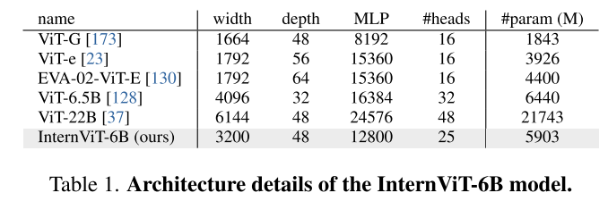
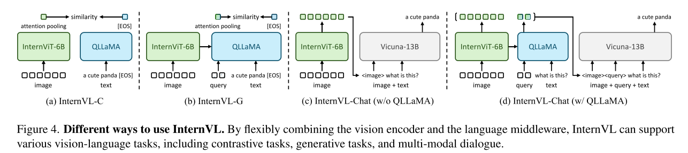

# InternVL: Scaling up Vision Foundation Models and Aligning for Generic Visual-Linguistic Tasks

## 目录
- [模型结构](#模型结构)
  - [大规模视觉编码器 (InternViT-6B)](#大规模视觉编码器-internvit-6b)
  - [重型语言中间件 (QLLaMA)](#重型语言中间件-qllama)
  - [多任务灵活组合架构](#多任务灵活组合架构)
- [训练方面 (渐进式对齐策略)](#训练方面-渐进式对齐策略)
  - [第一阶段：视觉-语言对比预训练 (Vision-Language Contrastive Training)](#第一阶段视觉-语言对比预训练-vision-language-contrastive-training)
  - [第二阶段：视觉-语言生成式预训练 (Vision-Language Generative Training)](#第二阶段视觉-语言生成式预训练-vision-language-generative-training)
  - [第三阶段：监督微调 (Supervised Fine-tuning)](#第三阶段监督微调-supervised-fine-tuning)

## 模型结构

本节将详细介绍构成 InternVL 的两大核心组件，以及它们如何通过高度模块化的设计进行适应多场景的灵活组合应用。

### 大规模视觉编码器 (InternViT-6B)

作为多模态模型的“眼睛”，视觉编码器的能力直接决定了模型对图像信息的理解上限。

**1. 研发背景与动机 (Motivation)**

在当前的视觉语言大模型 (VLLMs) 研究中存在一个显著的痛点：**参数规模的不匹配**。现阶段领先的大型语言模型 (LLMs) 的参数量已经高达千亿甚至突破万亿级别，但广泛使用的视觉编码器参数量通常依然停留在 10 亿 (1B) 左右的规模。这种巨大的参数规模差距会导致视觉特征无法充分匹配语言模型的需求，进而使得 LLM 的强大容量无法被充分利用。为了弥补这一鸿沟，研究团队决定将视觉编码器的规模大幅扩展，使其达到与 LLM 同等的量级。

**2. 模型基础架构与超参数探索 (Architecture & Hyperparameter Search)**

InternViT-6B 并没有采用过于复杂的变体，而是返璞归真，基于原生的视觉 Transformer (Vanilla ViT) 架构构建。研究团队的目标是将其直接扩展到 60 亿参数级别。为了在模型的准确率 (accuracy)、推理速度 (speed) 和训练稳定性 (stability) 之间找到最佳的平衡点，研究团队并没有盲目放大参数，而是进行了一套严谨的超参数搜索。他们评估了以下不同维度的组合方案：

*   **模型深度 (Depth)**: 测试了 32, 48, 64, 80 层
*   **注意力头维度 (Head dimension)**: 测试了 64, 128
*   **MLP 比例 (MLP ratio)**: 测试了 4, 8

研究团队在 LAION-en 数据集的 100M 子集上进行了对比学习测试，得出了以下关键的指导性结论：
*   **关于速度**：在 GPU 计算资源未达到饱和时，深度较浅的模型处理图像的速度明显更快；但当 GPU 算力被完全“喂饱”并充分利用时，不同配置之间的速度差异变得微乎其微。
*   **关于准确率**：在总参数量相同的前提下，模型的深度、注意力头的维度以及 MLP 的比例对最终准确率的实际影响并不大。

**3. 最终确定的模型配置 (Final Configuration)**

基于上述的消融实验与发现，团队在 16 种组合中最终选择了一种在速度和稳定性上表现最优的配置（即论文中的 variant 3）作为最终的 InternViT-6B 模型。其极为硬核的架构细节参数如下：
*   **特征维度 (Width / Hidden Dimension)**: 3200
*   **模型深度 (Depth / Layers)**: 48 层
*   **MLP 维度 (MLP Dimension)**: 12800
*   **注意力头数量 (#heads)**: 25 个
*   **实际总参数量 (#param)**: 5903 M (即约 59 亿参数)

> 通过将视觉编码器扩展至 60 亿参数，InternVL 成功打造了一双“慧眼”。然而，仅仅拥有强大的视力还不够，还需要一个足够聪明的“翻译官”来将这些视觉信息转化为语言大模型能深刻理解的形式。为此，团队打破常规，引入了重量级的 QLLaMA 组件。

### 重型语言中间件 (QLLaMA)

**1. 设计初衷与突破点 (Design Philosophy)**

在连接视觉编码器和大语言模型 (LLM) 时，现有的视觉语言大模型 (VLLMs) 普遍采用轻量级的“胶水层”(glue layers)，例如简单的线性投影层 (Linear Projection) 或参数量较小的 QFormer。然而，这种设计存在明显的局限性：这些“胶水层”通常是随机初始化的，且参数规模过小，难以捕捉和处理复杂的多模态理解与生成所需的丰富跨模态交互信息。

为了彻底打破这种“小马拉大车”的特征对齐瓶颈，InternVL 摒弃了传统的轻量级设计，引入了一个极具分量的语言中间件——QLLaMA。

**2. 模型结构与参数构成 (Architecture Details)**

QLLaMA 并不是从零开始随机初始化的，它可以说是“站在了巨人的肩膀上”：
*   **多语言底座初始化**：QLLaMA 的核心主干基于预训练的多语言版 LLaMA-7B 模型进行初始化。这使得它天生具备了强大的语言理解能力和多语言处理优势。
*   **新增跨模态交互组件**：在 LLaMA-7B 的基础之上，研究团队精心设计并新增了 96 个可学习的查询向量 (learnable queries) 以及对应的交叉注意力层 (cross-attention layers)。
*   **参数规模**：这些新加入的用于提取和重组视觉特征的层，其参数量达到了约 10 亿 (1B)。加上底座的 70 亿参数，使得 QLLaMA 的总参数规模达到了惊人的 80 亿 (8B)。

> 凭借 InternViT-6B 强大的视觉感知能力和 QLLaMA 雄厚的跨模态对齐底座，InternVL 具备了极为坚实的基础。在此之上，这套架构展现出了其高扩展性的架构优势：它可以根据不同的任务需求，进行模块化的拆解和组合，从而在各种模态任务中游刃有余。

### 多任务灵活组合架构

得益于模块化的设计，InternVL 可以针对不同的应用场景灵活切换形态，主要包括以下四种模式：

**(a) InternVL-C: 经典双塔对比模式 (Contrastive)**
*   **结构**：这是一个经典的双塔 (Dual-encoder) 结构，InternViT-6B 作为纯视觉编码器，QLLaMA 作为纯文本编码器。
*   **机制**：图像输入 InternViT-6B 后，经过注意力池化 (attention pooling) 得到全局的视觉特征 $I_f$；文本输入 QLLaMA 后，提取其 `[EOS]` (句子结束) token 作为全局文本特征 $T_f$。最后，计算这两个特征之间的相似度得分 (similarity)。
*   **适用场景**：主要用于经典的对比任务，例如零样本图像分类 (zero-shot image classification) 和零样本文图检索 (zero-shot image-text retrieval)。

**(b) InternVL-G: 生成增强对比模式 (Generative)**
*   **结构**：视觉编码器和语言中间件产生了交集。图像特征不仅经过视觉模型，还输入到了 QLLaMA 中进行交叉注意力计算。
*   **机制**：利用 QLLaMA 中新加入的 Query 进一步提取和重组视觉特征，经过池化后，再与 QLLaMA 输出的文本 `[EOS]` token 特征计算相似度。此外，得益于 QLLaMA 庞大的参数量，这些 Query 也可以直接作为前缀，让 QLLaMA 逐个 token 地生成文本。
*   **适用场景**：不仅能提供更强大的图文检索性能，还具备了出色的零样本图像描述生成能力 (zero-shot image captioning)。

**(c) InternVL-Chat (w/o QLLaMA): 轻量级对话模式**
*   **结构**：为了构建多模态对话系统，此模式直接去掉了中间件 QLLaMA，让视觉模型 InternViT-6B 独立工作，并直接对接外部的大语言模型 (如论文中所示的 Vicuna-13B)。
*   **机制**：视觉特征 `<image>` 与用户的文本提问一起被送入 LLM 中生成回答。需要指出的是，虽然在特定架构图中可能未画出，但论文明确指出中间是通过一个 MLP 层进行连接微调的，以此实现快速的特征映射。
*   **适用场景**：视觉问答 (VQA) 和多模态对话 (Multi-modal dialogue)。这种模式训练速度快，结构相对简单，适合对推理效率有一定要求的场景。

**(d) InternVL-Chat (w/ QLLaMA): 全能对话模式**
*   **结构**：这是最强大的“完全体”形态，同时使用了 InternViT-6B、QLLaMA 以及外部的大语言模型 (如 Vicuna-13B)。
*   **机制**：图像信息先经过 InternViT-6B 提取基础特征，然后通过 QLLaMA 的 Query 进行深度的特征重组和对齐。经过这层重重的“过滤”和“翻译”后，高度对齐的特征 `<image><query>` 再和文本问题一起输入给最终的 LLM。
*   **适用场景**：处理复杂的多模态对话任务。论文指出，由于 QLLaMA 作为“胶水层”的特征表示与现成的 LLM 高度一致，这种完整形态在各项对话基准测试中均能取得最佳的性能提升。

---

## 训练方面 (渐进式对齐策略)

论文中提出的“渐进式对齐”策略，是为了解决一个巨大的难题：如何稳定地训练一个百亿参数级别的多模态模型，并且有效利用互联网上海量但质量参差不齐的图文数据。为了实现这个目标，研究团队设计了一个由粗到精的“三阶段”训练流程：

### 第一阶段：视觉-语言对比预训练 (Vision-Language Contrastive Training)

这个阶段的任务是让模型“见多识广”，进行粗粒度的跨模态特征初步对齐。
*   **核心目标**：将 60 亿参数的视觉编码器 (InternViT-6B) 与多语言大语言模型 (LLaMA-7B) 的特征空间进行对齐。
*   **模型状态**：在这个阶段，InternViT-6B 和 LLaMA-7B 的参数都是完全可训练的 (fully trainable)。
*   **使用数据**：使用了极具规模但包含噪声的网页图文对，包括 LAION、COYO、Wukong 等数据集。经过轻度清洗过滤后，保留了约 49.8 亿对图文数据用于训练。
*   **训练方式**：采用对称交叉熵损失函数 (symmetric cross-entropy loss) 进行对比学习，计算图像特征和文本特征的相似度。
*   **解锁能力**：这一阶段使得模型具备了强大的零样本图像分类 (zero-shot image classification) 和图文检索 (image-text retrieval) 能力。

### 第二阶段：视觉-语言生成式预训练 (Vision-Language Generative Training)

在这个阶段，模型从“对比”转为“生成”，进行更深层次、细粒度的特征对齐。
*   **核心目标**：结合 InternViT-6B 和 QLLaMA，采用生成式训练策略进一步对齐视觉和语言特征。
*   **模型状态**：InternViT-6B 和 QLLaMA 的基础权重继承自第一阶段，并被冻结 (frozen) 保护起来。系统仅训练 QLLaMA 中新加入的 Query 和交叉注意力层 (cross-attention layers)。
*   **使用数据**：为了保证生成内容的质量，实施了严格的数据过滤，去除了低质量文本（如乱码、无意义内容），将训练数据从 49.8 亿大幅精简到 10.3 亿对高质量数据。
*   **训练方式**：综合使用图文对比损失 (ITC)、图文匹配损失 (ITM) 和基于图像的文本生成损失 (ITG) 进行联合优化。
*   **解锁能力**：赋予了模型出色的零样本图像描述生成能力 (zero-shot image captioning)。

### 第三阶段：监督微调 (Supervised Fine-tuning)

最后一个阶段是让模型学会“听懂人话”，将视觉能力接入成熟的大脑中。
*   **核心目标**：将 InternVL 连接到现成的成熟大语言模型解码器（例如 Vicuna 或 InternLM），打造多模态对话系统。
*   **模型状态**：通过多层感知机 (MLP) 将视觉部分的特征传递给 LLM。由于前两阶段对齐得非常出色，这里甚至可以冻结 LLM 解码器，只需微调 MLP 层，或者同时微调 MLP 层和 QLLaMA。
*   **使用数据**：收集了涵盖多任务的高质量指令数据，总计约 400 万条微调样本。
*   **训练方式**：使用生成式损失 (generative loss) 进行监督训练。
*   **解锁能力**：最终实现了视觉问答 (visual question answering) 和流畅的多模态对话 (multi-modal dialogue) 能力。
