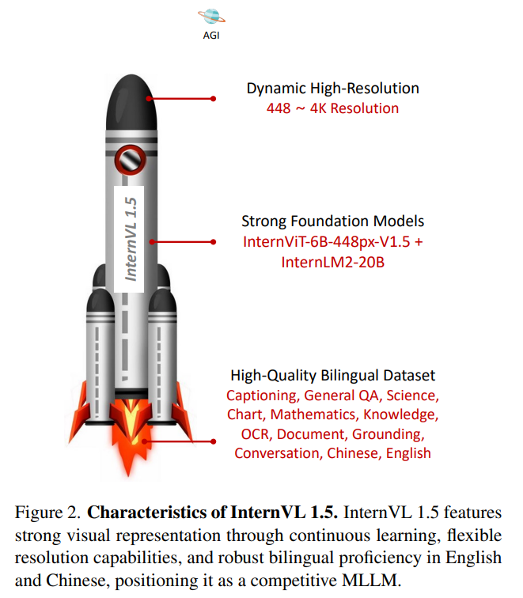
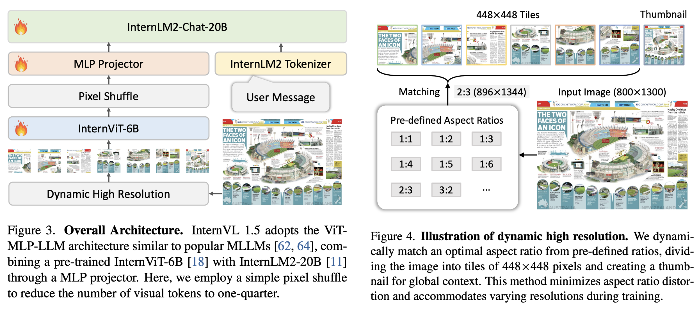

# InternVL 1.5

## 目录
- [一、InternVL 1.5 的三大核心升级](#一internvl-15的三大核心升级)
  - [1. 强大的视觉编码器 (Strong Vision Encoder)](#1-强大的视觉编码器-strong-vision-encoder)
  - [2. 动态高分辨率 (Dynamic High-Resolution)](#2-动态高分辨率-dynamic-high-resolution)
  - [3. 高质量双语数据集 (High-Quality Bilingual Dataset)](#3-高质量双语数据集-high-quality-bilingual-dataset)
- [二、模型架构与技术细节](#二模型架构与技术细节)
  - [1. 整体模型架构 (Overall Architecture)](#1-整体模型架构-overall-architecture)
  - [2. pixel_shuffle 与 extract_feature（实现与数据流）](#2-pixel_shuffle-与-extract_feature实现与数据流)

## 一、InternVL 1.5 的三大核心升级

相对既有开源多模态模型，InternVL 1.5 的迭代可以概括为三条彼此配合的主线：**更强的视觉骨干（InternViT-6B 与持续学习）**、**动态高分辨率下的细粒度感知**，以及**覆盖中英文、偏重文档与 OCR 的数据工程**。**如下图所示**，这三条主线共同构成 1.5 代的整体图景；后文各小节将沿同一顺序逐一展开。



### 1. 强大的视觉编码器 (Strong Vision Encoder)

在现有的多模态大模型（MLLMs）中，最常用的视觉基础模型通常是在固定低分辨率（例如 $224 \times 224$）下进行对比预训练的 ViT。然而，当处理高分辨率图像或来自非互联网源的图像（如文档）时，这些模型的性能往往会显著下降。为了解决这一问题，InternVL 1.5 引入了一个强大的 60 亿参数视觉编码器，并采用了一套持续学习（Continuous Learning）策略。该核心升级主要体现在以下三个方面：

**架构精简与特征提取优化**：在早期的实验中，研究团队发现视觉编码器倒数第四层的特征在处理多模态任务时表现最佳。因此，团队直接丢弃了 InternViT-6B 最后三层的权重，将模型从 48 层优化缩减至 45 层。

**持续的分辨率与数据演进**：

- **V1.2 阶段**：模型首先将分辨率从 224 提升至 448，并结合图像描述和 OCR 专用数据集进行训练。在此阶段，视觉编码器和 MLP 投影层均被激活，赋予了模型初步的高分辨率处理和 OCR 能力。
- **V1.5 阶段**：在 1.2 版本的强大基础上，1.5 版本进一步将训练图像的分辨率从固定的 $448 \times 448$ 扩展为动态的 $448 \times 448$（基础切块大小为 448，切块数量在 1 到 12 之间动态变化）。结合更大规模、高质量且具备多样性的预训练数据集，模型获得了强大的鲁棒性、顶尖的 OCR 识别率以及极其出色的高分辨率处理能力。

**卓越的跨 LLM 迁移性（Portability）**：这项持续学习策略不仅提升了视觉理解能力，还增强了视觉特征的通用性。值得注意的是，尽管 InternVL 1.5 将后端的语言大模型从 Nous-Hermes-2-Yi-34B 更换为了 InternLM2-20B，InternViT 依然对新的 LLM 保持了极佳的兼容性和可移植性。这有力地证明了，InternViT-6B 在预训练阶段学到的视觉特征具有广泛的适用性，完全可以作为独立的视觉底座，在不同的语言模型中轻松迁移和复用。

### 2. 动态高分辨率 (Dynamic High-Resolution)

在处理极端宽高比的图像（如长文档、网页长截图）或包含密集微小文本的图表时，传统开源模型普遍采用的固定低分辨率（如 $336 \times 336$ 或 $448 \times 448$）往往会导致严重的图像变形和关键细节的丢失。为了彻底打破这一视觉感知瓶颈，InternVL 1.5 引入了**动态高分辨率（Dynamic High-Resolution）**策略，使其具备了比肩顶级商业模型（如 GPT-4V 的 "High" 模式）的细粒度视觉捕捉能力。读者可将本节「三步走」与**第二部分**中的整体流程示意图对照阅读，便于把「切块—缩略图—降维」与端到端架构对应起来。该机制的核心实现细节主要包含以下三个步骤：

**自适应宽高比匹配 (Dynamic Aspect Ratio Matching)**：为了在处理过程中保持图像自然的物理比例，避免强行缩放拉伸带来的特征失真，系统预定义了一个包含 35 种宽高比的组合库（由 1 到 12 个基础图像块任意排列组合而成，例如 1:1、1:2、2:3、3:4 等）。当用户输入任意图像时，模型会动态计算其原始宽高比，并通过计算绝对差值，在预设库中寻找最匹配的网格方案，从而将图像以最小的形变代价重塑到最佳尺寸。

**动态切块与全局缩略图 (Image Division & Thumbnail)**：在确定了最佳宽高比网格后，系统会对图像进行精细化处理：

- **局部切块 (Tiles)**：图像会被无损裁剪为若干个 $448 \times 448$ 像素的局部图像块。在训练阶段，模型最多支持切分为 12 块；而在测试推理阶段，模型展现出了强大的零样本扩展（Zero-shot scaling）能力，最高支持切分为 40 块，这意味着模型原生支持高达 4K 分辨率的超高清图像输入。
- **全局视角补全 (Thumbnail)**：若视觉输入仅由若干局部切块构成，则每个切块对应原图的一个矩形裁剪区域，单次前向中编码器所能直接访问的空间上下文主要限于各切块内部：跨切块的长程空间关系、整幅图像的全局布局与低频结构并不能由切块序列单独完备给出。为此，系统在切块之外**额外**将整幅原图等比例缩放至 $448 \times 448$，得到一张覆盖全图视场的缩略图（Thumbnail），与局部切块一并送入视觉编码器。高分辨率切块保留细粒度纹理与小尺度目标信息，缩略图在固定分辨率与 token 预算下提供整图尺度的全局上下文，二者在特征上形成互补，缓解纯切块输入带来的全局信息瓶颈。

**Pixel Shuffle 降维以提升计算效率**：处理 4K 级别的图像不可避免地会带来视觉 Token 数量的暴涨，从而引发大语言模型（LLM）的计算灾难。为了在保证极致清晰度的同时兼顾显存与推理效率，InternVL 1.5 巧妙地引入了简单的 Pixel Shuffle（像素洗牌）操作。该操作将底座提取出的视觉 Token 数量大幅压缩至原来的四分之一。经过压缩后，一个 $448 \times 448$ 的切块最终仅产生 256 个视觉 Token。凭借这一设计，即便是在满载 40 个切块的极限状态下，视觉特征也能被有效控制在约 10,496 个 Token 以内，完美平衡了分辨率与计算成本。

从**实现角度**看，这一步并不是对原始 RGB 做经典子像素卷积意义上的 shuffle，而是在 **ViT patch 特征已经排成二维网格**之后，将张量 reshape 为 $(B, H, W, C)$（H,W 为 patch 网格的高与宽，C 为 ViT 隐层维度），再经 `pixel_shuffle` 做空间–通道重排：在 `downsample_ratio=0.5` 的典型配置下，等价于在 patch 网格上以互不重叠的 $2 \times 2$ 邻域为一步长，把四个位置上的 $C$ 维向量在**通道维**上拼接，得到空间分辨率 $(H/2,\, W/2)$、通道维 $4C$ 的特征图（与 depth-to-space / space-to-depth 类重排同族）。

### 3. 高质量双语数据集 (High-Quality Bilingual Dataset)

在拥有了强大的视觉底座和动态高分辨率机制后，模型还需要极其优质的"燃料"才能将其潜力完全释放。与许多过度依赖英文数据或只使用少量多语言语料的开源模型不同，InternVL 1.5 构建了一个涵盖多领域、高质量的中英双语数据集，这直接促成了其在 OCR（光学字符识别）和中文场景理解上的跨越式提升，使其能够与 GPT-4V 等顶级闭源模型正面交锋。

该数据工程的核心亮点体现在以下三个维度：

**高度针对性的预训练数据构成 (Pre-training Data)**：为了赋予模型如同人类般的文本阅读和图表解析能力，预训练数据不仅包含了常规的自然场景图像描述（占比约 53.9%），还史无前例地注入了极高比例的 OCR 相关数据（总计占比超过 40%）。

团队利用 PaddleOCR 等工具，对海量的 Wukong（中文）和 LAION-COCO（英文）数据集进行了 OCR 提取，结合大量的 Common Crawl PDF 文档，构建了超大规模的图文/文本对。这使得模型在预训练阶段就建立起了极其敏锐的文字感知神经。

**创新的自动化数据翻译流水线 (Data Translation Pipeline)**：现有的高质量多模态开源数据集（如 COYO、GRIT、ShareGPT4V 等）绝大多数是英文主导的，直接导致开源模型在处理中文复杂指令时表现不佳。为了弥补这一多语言能力鸿沟，研究团队开发了一条高效的数据翻译流水线。

该流水线利用先进的开源 LLM 或 GPT-3.5，在特定的 Prompt 指导下（如：保留专有名词、确保地道表达、提供缩写全称等），将高质量的英文数据集大规模自动翻译成自然流畅的中文。这一低成本、高一致性的策略彻底打破了高质量中文语料匮乏的瓶颈，使模型天生具备了极其纯正的双语理解能力。

**覆盖全场景的精细化监督微调 (Supervised Fine-tuning)**：在微调阶段，团队精心筛选并组装了一个涵盖数十种细分任务的高质量数据集。这些数据不仅包括传统的图像描述和通用问答，更深度覆盖了极具挑战性的垂直领域：

- **科学与数学**：引入了 AI2D、ScienceQA、MathQA 等数据集，提升逻辑推理与科学图表分析能力。
- **文档与图表**：使用 ChartQA、DocVQA 强化对现实世界复杂版式文档和信息图表的理解。
- **多轮交互**：引入 LLaVA-150K 等对话数据，培养模型在多轮上下文中的视觉推理和自然交互习惯。

通过这套全方位、高品质的双语数据"喂养"，InternVL 1.5 成功地将底座模型的巨大参数容量转化为了可以直接服务于用户的全能视觉-语言助理能力。

## 二、模型架构与技术细节

### 1. 整体模型架构 (Overall Architecture)

InternVL 1.5 采用了一种简洁而高效的架构设计，整体上遵循了当前主流开源多模态大模型（MLLMs）广泛使用的"ViT-MLP-LLM"经典范式。这种架构放弃了复杂的中间件（如前代中的 QLLaMA），转而通过一个投影层将视觉特征直接映射到语言模型的特征空间中，从而在保证性能的同时简化了模型结构。

**如下图所示**，从图像（及动态高分辨率预处理得到的多个视觉 token 流）出发，经视觉编码器与 MLP 对齐后进入对话式语言模型，形成端到端的多模态推理链路；图中亦标出了各模块之间的数据走向，可与上文「动态高分辨率」小节中的分步描述相互印证。



具体而言，该架构由以下三个核心组件串联构成：

- **视觉编码器 (Vision Encoder)**：采用了具有 60 亿参数且经过持续学习优化的 InternViT-6B 模型。
- **大语言模型 (Large Language Model)**：后端的语言"大脑"选用了具有 200 亿参数的开源对话模型 InternLM2-Chat-20B。
- **模态对齐层 (MLP Projector)**：视觉和语言模块之间通过一个随机初始化的多层感知机（MLP）作为"投影仪"进行连接。它的作用是将 InternViT 提取的高维视觉特征"翻译"为 InternLM2 能够直接理解和处理的输入格式。

### 2. pixel_shuffle 与 extract_feature（实现与数据流）

下面代码摘自 Hugging Face 模型仓库中的 [`modeling_internvl_chat.py`](https://huggingface.co/OpenGVLab/InternVL-Chat-V1-5/blob/main/modeling_internvl_chat.py)（`InternVLChatModel`），展示 **patch 序列 → 二维网格 → Pixel Shuffle 空间降采样 → 展平 → MLP 对齐** 的完整路径。阅读时可对照上文「动态高分辨率」中的 Token 数量结论：`downsample_ratio=0.5` 时，空间边长减半，token 数变为原来的 $\frac{1}{4}$。

`extract_feature` 中先取 ViT 指定层 hidden state，**去掉 CLS**，将序列 reshape 为 $(B, h, w, C)$，再调用 `pixel_shuffle`；最后将 $(B, h', w', C')$ 展平为序列并过 `mlp1`。

```python
def extract_feature(self, pixel_values):
    if self.select_layer == -1:
        vit_embeds = self.vision_model(
            pixel_values=pixel_values,
            output_hidden_states=False,
            return_dict=True).last_hidden_state
    else:
        vit_embeds = self.vision_model(
            pixel_values=pixel_values,
            output_hidden_states=True,
            return_dict=True).hidden_states[self.select_layer]
    vit_embeds = vit_embeds[:, 1:, :]

    h = w = int(vit_embeds.shape[1] ** 0.5)
    vit_embeds = vit_embeds.reshape(vit_embeds.shape[0], h, w, -1)
    vit_embeds = self.pixel_shuffle(vit_embeds, scale_factor=self.downsample_ratio)
    vit_embeds = vit_embeds.reshape(vit_embeds.shape[0], -1, vit_embeds.shape[-1])
    vit_embeds = self.mlp1(vit_embeds)
    return vit_embeds
```

`pixel_shuffle` 内部通过 `view` / `permute` 把 $(N, W, H, C)$ 形式的特征块重排为更小的空间网格、更宽的通道（注释中标明了张量形状变换）。`ps_version == 'v1'` 时**不再**把高宽交换回来，会得到转置后的空间布局，因此会打印警告；**非 v1**（默认）会再 `permute(0, 2, 1, 3)` 一次，把高宽纠正到与视觉习惯一致。

```python
def pixel_shuffle(self, x, scale_factor=0.5):
    n, w, h, c = x.size()
    # N, W, H, C --> N, W, H * scale, C // scale
    x = x.view(n, w, int(h * scale_factor), int(c / scale_factor))
    # N, W, H * scale, C // scale --> N, H * scale, W, C // scale
    x = x.permute(0, 2, 1, 3).contiguous()
    # N, H * scale, W, C // scale --> N, H * scale, W * scale, C // (scale ** 2)
    x = x.view(n, int(h * scale_factor), int(w * scale_factor),
               int(c / (scale_factor * scale_factor)))
    if self.ps_version == 'v1':
        warnings.warn("In ps_version 'v1', the height and width have not been swapped back, "
                      'which results in a transposed image.')
    else:
        x = x.permute(0, 2, 1, 3).contiguous()
    return x
```

我们顺着代码里的数据流重新盘一下它的实际形状变化：

1. **初始提取**：ViT 吐出来的特征去掉了 CLS Token 后，是一个一维长序列 `[B, 1024, C]`。
2. **恢复网格**：代码通过 `reshape` 把它还原成了二维空间网格，此时的形状是 `[B, H, W, C]` (注意，C在最后)。
3. **洗牌操作 (Pixel Shuffle)**：在 `pixel_shuffle` 函数里，那两套眼花缭乱的 `view` 和 `permute` 操作，针对的正是 `[B, H, W, C]` 这种格式。它把相邻的 $2 \times 2$ 空间像素在通道维度上拼接。
4. **洗牌结果**：输出的张量形状变成了 `[B, H//2, W//2, C*4]`。
