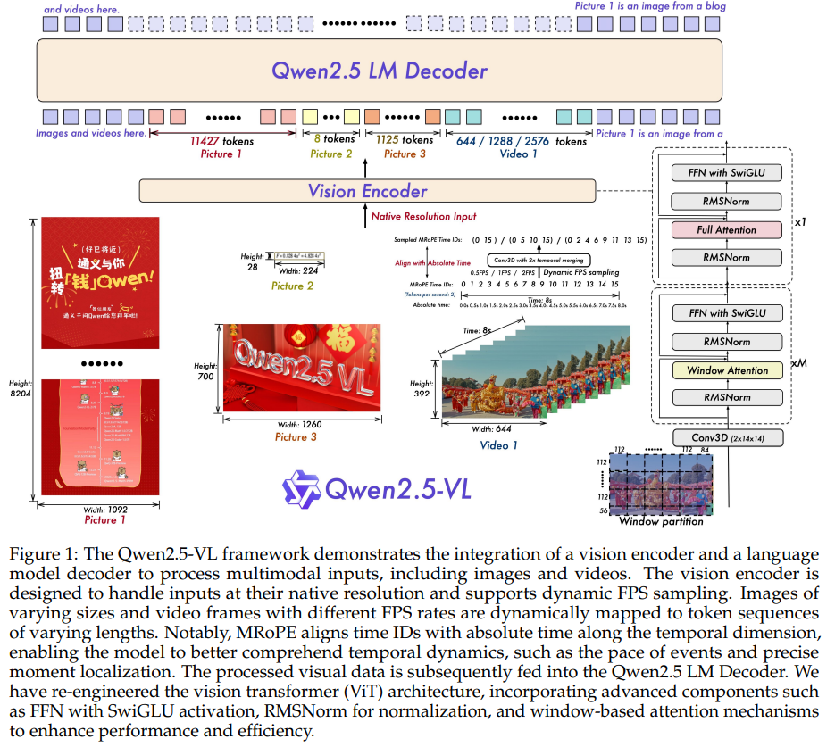

# Qwen2.5-VL



## 目录
- [一、Qwen2.5-VL 模型结构的主要改进](#一qwen25-vl模型结构的主要改进)
  - [1. 视觉编码器的注意力机制：混合 Window Attention 与 Full Attention](#1-视觉编码器的注意力机制混合-window-attention-与-full-attention)
    - [动态分辨率与固定 window 的余数处理](#动态分辨率与固定-window-的余数处理)
  - [2. Vision Encoder 内部的 MLP 结构对齐了 LLM](#2-vision-encoder-内部的-mlp-结构对齐了-llm)
  - [3. 标准化层：从 LayerNorm 转向 RMSNorm](#3-标准化层从-layernorm-转向-rmsnorm)
  - [4. 视频的时间位置编码 (M-RoPE) 支持了物理绝对时间对齐](#4-视频的时间位置编码-m-rope-支持了物理绝对时间对齐)
- [二、训练数据和训练策略 (Training Recipe)](#二训练数据和训练策略-training-recipe)

## 一、Qwen2.5-VL模型结构的主要改进

Qwen2.5-VL 在上一代 Qwen2-VL 的基础上进行了显著的架构升级。除了将语言模型基座升级到了 Qwen2.5，模型结构也进行了大幅度的升级，主要升级点包括：

1. **混合 Window Attention 与 Full Attention**: 视觉编码器引入了窗口注意力和全局注意力交替的设计，极大地降低了长序列的计算复杂度，支持超长视频理解。
2. **MLP 结构对齐 LLM**: Vision Encoder 内部的 MLP 结构全面升级为 SwiGLU 风格，与 LLM Decoder 组件高度一致。
3. **全面采用 RMSNorm**: 视觉前处理流程中全面使用 RMSNorm 取代 LayerNorm，提升计算效率并与语言模型架构规范统一。
4. **支持物理时间对齐的 M-RoPE**: 视频的时间位置编码（Temporal IDs）根据真实物理时间动态计算，具备跨不同采样率视频的一致时间对齐能力。

| 特性 | Qwen2-VL | Qwen2.5-VL | 改进意义 |
| :--- | :--- | :--- | :--- |
| **Attention** | 全局注意力 (Full) | 窗口 (Window) + 全局交替 | 降低复杂度，支持超长视频 |
| **MLP 结构** | 标准 MLP (GELU) | SwiGLU (SiLU) | 模态架构对齐，增强表征能力 |
| **Normalization** | LayerNorm | RMSNorm | 提升计算效率，对齐 LLM 规范 |
| **时间编码** | 逻辑帧序号 | **物理绝对时间对齐** | 跨采样率的时间一致性感知识别 |

### 1. 视觉编码器的注意力机制：混合 Window Attention 与 Full Attention

- Qwen2-VL：在 ViT（Vision Transformer）中，全部使用全局的自注意力机制（Full Attention）。当处理高分辨率图像或长视频时，序列长度会变得非常长，这会导致自注意力的计算量和内存占用呈二次方爆炸。
- Qwen2.5-VL：引入了 Window Attention（窗口注意力） 和 全局注意力交替 的设计。在它的视觉编码器配置中增加了 `window_size` (默认112) 和 `fullatt_block_indexes` (默认在第 7, 15, 23, 31 层使用全注意力)。

结构变化：在大部分 Vision Block 中，它会将变长的视觉序列切分成多个局部 Window，只在 Window 内部算 Attention，极大地降低了计算复杂度。而在特定的几层（如第7/15/23/31层）再做一次全局 Attention 来做全局特征交互。这也是其能支持超长视频理解的核心架构优化。

> 💡 **思考：既然窗口注意力能降低计算量，为什么不全部使用窗口注意力机制呢？**
> 
> **1. 全局特征交互的必要性 (Global Feature Interaction)**
> 窗口注意力将图像划分为多个局部的 Window（默认 112×112）。
> - **局限性**：在窗口内部，像素只能与周围的邻居通信。如果一个物体跨越了多个窗口（例如漫画中的长分镜或视频中的长焦镜头），纯窗口机制很难捕捉到物体各部分之间的关联。
> - **解决方案**：Qwen2.5-VL 在特定的层（第 7, 15, 23, 31 层）引入全局注意力（Full Attention）作为“通讯枢纽”。这些层负责整合来自所有窗口的信息，实现全局特征交互。
> 
> **2. 感受野的平衡 (Receptive Field)**
> 在深度学习中，感受野决定了模型能“看到”多大的范围。
> - **窗口注意力**：提供了极高的计算效率，其复杂度随序列长度线性增长 ( $O(N)$ )，这使得模型能处理超高分辨率输入。
> - **全局注意力**：虽然复杂度是二次方增长 ( $O(N^2)$ )，但它能瞬间建立起图像最左上角和最右下角像素之间的联系。
> - **混合策略**：这种“局部层+全局层”的交替设计，在保持 $O(N)$ 级别计算开销的同时，确保了模型依然拥有覆盖全图的感受野。

```python
# vlm_architecture/qwen2_5_vl/modeling_qwen2_5_vl.py 

# 1. 获取窗口索引与各窗口累积长度
window_index, cu_window_seqlens = self.get_window_index(grid_thw)
# 确保 cu_window_seqlens 格式正确
cu_window_seqlens = torch.unique_consecutive(cu_window_seqlens)

# 2. 将隐藏状态和位置编码根据 window_index 重新排列，使其在内存中按 window 聚拢
seq_len, _ = hidden_states.size()
hidden_states = hidden_states.reshape(seq_len // self.spatial_merge_unit, self.spatial_merge_unit, -1)
hidden_states = hidden_states[window_index, :, :]
hidden_states = hidden_states.reshape(seq_len, -1)

rotary_pos_emb = rotary_pos_emb.reshape(seq_len // self.spatial_merge_unit, self.spatial_merge_unit, -1)
rotary_pos_emb = rotary_pos_emb[window_index, :, :]
rotary_pos_emb = rotary_pos_emb.reshape(seq_len, -1)
emb = torch.cat((rotary_pos_emb, rotary_pos_emb), dim=-1)
position_embeddings = (emb.cos(), emb.sin())

# 3. 计算全局注意力时的累积长度 cu_seqlens
cu_seqlens = torch.repeat_interleave(grid_thw[:, 1] * grid_thw[:, 2], grid_thw[:, 0]).cumsum(...)
cu_seqlens = F.pad(cu_seqlens, (1, 0), value=0)
```

在模型的前向传播中，根据当前层的索引来决定传入的累积序列长度（从而决定是局部 Window Attention 还是 全局 Attention）：

```python
# vlm_architecture/qwen2_5_vl/modeling_qwen2_5_vl.py

for layer_num, blk in enumerate(self.blocks):
    # 判断当前层是否在全注意力层索引列表中（例如：[7, 15, 23, 31]）
    if layer_num in self.fullatt_block_indexes:
        cu_seqlens_now = cu_seqlens         # 全局 Attention，跨 Window 交互
    else:
        cu_seqlens_now = cu_window_seqlens  # 局部 Window Attention

    hidden_states = blk(
        hidden_states,
        cu_seqlens=cu_seqlens_now,
        position_embeddings=position_embeddings,
        **kwargs,
    )

# 4. 在特征融合后，将 hidden_states 的顺序还原回原来的空间顺序
merged_hidden_states = self.merger(hidden_states)
reverse_indices = torch.argsort(window_index)
merged_hidden_states = merged_hidden_states[reverse_indices, :]
```

#### 动态分辨率与固定 window 的余数处理

Qwen2.5-VL 采用原生动态分辨率，不同图片经预处理后宽高各异。视觉编码器默认 `window_size = 112`（在 LLM 网格坐标系下换算为 `vit_merger_window_size = window_size // spatial_merge_size // patch_size`）。当某一维度的 patch 数无法被窗口大小整除时，模型如何避免传统方案里常见的 Padding 陷阱——即补零后仍对无效区域做注意力计算？

核心答案：底层依赖 `cu_window_seqlens`（Cumulative Window Sequence Lengths，累积窗口序列长度）与 FlashAttention 的 varlen（变长）模式协同工作。

机制概览：

- 动态切窗，而非刚性方格：模型在二维平面上按当前图像尺寸计算能容纳多少个完整窗口；边缘无法整除的部分不会强行扩成标准窗口去算注意力。
- 边缘块作为变长窗口：余数 patch 构成一个「非标准尺寸」的变长窗口，其真实长度写入 `cu_window_seqlens`。
- FlashAttention 按物理边界计算：算子时读取 `cu_window_seqlens`，明确每个窗口在内存中的起止位置，从而在支持动态分辨率的同时仍做局部注意力。

##### 物理直观：打破「固定窗口」的思维惯性

传统窗口注意力（如 Swin Transformer）会把图像切成等大的方格网格。若尺寸不能整除，通常需要 Padding → 对补零区域算注意力 → 再丢弃补零结果，算力被浪费在无效 token 上。

Qwen2.5-VL 走的是变长、不规则路径。以一维直觉为例（便于理解，实际在代码中是二维网格切分）：

假设某方向展平后有 300 个 patch，按窗口容量 112 切分，会得到三个物理长度不等的窗口：

| 窗口 | 长度 | 说明 |
| :--- | :--- | :--- |
| Window 1 | 112 | 完整窗口 |
| Window 2 | 112 | 完整窗口 |
| Window 3 | 76 | 余数窗口（300 − 112 − 112） |

在 Window 3 中，76 个 patch 只在窗口内部互相关注，不与窗口外通信。这就引出一个工程问题：矩阵乘法通常要求维度对齐，不同大小的窗口如何并行计算？

答案仍在 `cu_window_seqlens`：它记录每个窗口在整条 1D 序列上的累积边界，是多模态长序列工程里的关键「粘合剂」。

##### 核心机制：FlashAttention 的变长算子

标准 PyTorch 批处理要求张量维度对齐，短序列往往要 pad 到同一长度才能 `stack` 成 `[batch, seq_len, dim]`。现代基座模型改用 FlashAttention-2 等内核，其 varlen 模式不再把各窗口 pad 成统一的 `N × window_size` 矩阵，而是将整张图（乃至一个 batch 内多张图）的所有 patch 首尾相接压成一条 1D 向量，再用 `cu_window_seqlens` 标出每个窗口的真实边界。

在 `Qwen2_5_VLVisionAttention` 中，当启用 Flash Attention 时，直接把 `cu_seqlens`（窗口层为 `cu_window_seqlens`）传给算子：

```python
# vlm_architecture/qwen2_5_vl/modeling_qwen2_5_vl.py

if is_flash_attention_requested(self.config):
    max_seqlen = (cu_seqlens[1:] - cu_seqlens[:-1]).max()
    attn_output, _ = attention_interface(
        self, query_states, key_states, value_states,
        cu_seq_lens_q=cu_seqlens,
        cu_seq_lens_k=cu_seqlens,
        max_length_q=max_seqlen,
        max_length_k=max_seqlen,
        ...
    )
```

##### 代码里如何生成 `cu_window_seqlens`

`get_window_index` 在二维网格上为切窗做了布局级 padding（用 `-100` 标记无效格子），但随后用 `seqlens` 统计每个窗口的真实 token 数，再写入累积长度——注意力阶段不会对 padding 位置浪费计算：

```python
# vlm_architecture/qwen2_5_vl/modeling_qwen2_5_vl.py — get_window_index 核心逻辑

vit_merger_window_size = self.window_size // self.spatial_merge_size // self.patch_size
pad_h = vit_merger_window_size - llm_grid_h % vit_merger_window_size  # 不能整除时补格
pad_w = vit_merger_window_size - llm_grid_w % vit_merger_window_size
index_padded = F.pad(index, (0, pad_w, 0, pad_h), "constant", -100)  # -100 为占位哨兵
# ... reshape 为 [T, num_windows, window_h, window_w] ...

seqlens = (index_padded != -100).sum([2, 3]).reshape(-1)   # 每个窗口的真实长度（可为变长）
index_new = index_padded[index_padded != -100]             # 剔除哨兵，只保留有效 patch
cu_seqlens_tmp = seqlens.cumsum(0) * self.spatial_merge_unit + cu_window_seqlens[-1]
cu_window_seqlens.extend(cu_seqlens_tmp.tolist())
```

可以概括为两层分工：

1. 布局层：为把不规则网格整齐地切成窗口，对索引矩阵做最小 padding，并用 `-100` 标出无效格。
2. 计算层：`cu_window_seqlens` 告诉 FlashAttention 每个窗口实际有多少 token；varlen 内核只在这些有效 token 上做局部注意力，从而避开 Padding 陷阱。

> 💡 小结：动态分辨率 + 固定 `window_size` 的「零头」并非简单 pad 到 112 再全算一遍，而是把边缘余数当作变长窗口，用 `cu_window_seqlens` 配合 FlashAttention varlen，在保持局部注意力效率的同时，不对无效 padding 浪费算力。这也是 Qwen2.5-VL 能在高分辨率、长视频场景下维持可接受开销的重要工程细节之一。

### 2. Vision Encoder 内部的 MLP 结构对齐了 LLM

- Qwen2-VL：Vision Encoder 内部使用的是传统的 VisionMlp，结构是非常标准的：`fc1 -> 激活函数 -> fc2`（也就是升维再降维）。
- Qwen2.5-VL：将 Vision Encoder 的 MLP 结构全面升级成了大语言模型中广泛使用的 SwiGLU 风格的 MLP。

结构变化：采用了 `gate_proj`、`up_proj` 和 `down_proj`，激活函数也从 `quick_gelu` 换成了 `silu`。这使得 Vision Encoder 的组件结构与它 LLM Decoder 组件高度一致。

```python
# vlm_architecture/qwen2_5_vl/modeling_qwen2_5_vl.py

class Qwen2_5_VLMLP(nn.Module):
    def __init__(self, config, bias: bool = False):
        super().__init__()
        self.hidden_size = config.hidden_size
        self.intermediate_size = config.intermediate_size
        # 引入了 SwiGLU 的经典结构：gate, up, down 投影层
        self.gate_proj = nn.Linear(self.hidden_size, self.intermediate_size, bias=bias)
        self.up_proj = nn.Linear(self.hidden_size, self.intermediate_size, bias=bias)
        self.down_proj = nn.Linear(self.intermediate_size, self.hidden_size, bias=bias)
        self.act_fn = ACT2FN[config.hidden_act] # 默认使用了 silu 激活函数

    def forward(self, hidden_state):
        # 输入 hidden_state 维度: [batch_size, seq_len, dim]
        
        # 1. Gate 投影与激活：[batch_size, seq_len, dim] -> [batch_size, seq_len, intermediate_size]
        gate = self.act_fn(self.gate_proj(hidden_state))
        
        # 2. Up 投影：[batch_size, seq_len, dim] -> [batch_size, seq_len, intermediate_size]
        up = self.up_proj(hidden_state)
        
        # 3. 逐元素相乘并 Down 投影：[batch_size, seq_len, intermediate_size] -> [batch_size, seq_len, dim]
        # 典型的 SwiGLU 计算过程，与 LLM 保持一致
        return self.down_proj(gate * up)
```

### 3. 标准化层：从 LayerNorm 转向 RMSNorm

```python
# vlm_architecture/qwen2_5_vl/modeling_qwen2_5_vl.py

class Qwen2_5_VLRMSNorm(nn.Module):
    def __init__(self, hidden_size, eps: float = 1e-6) -> None:
        """
        Qwen2_5_VLRMSNorm is equivalent to T5LayerNorm
        """
        super().__init__()
        self.weight = nn.Parameter(torch.ones(hidden_size))
        self.variance_epsilon = eps

    def forward(self, hidden_states: torch.Tensor) -> torch.Tensor:
        input_dtype = hidden_states.dtype
        hidden_states = hidden_states.to(torch.float32)
        variance = hidden_states.pow(2).mean(-1, keepdim=True)
        hidden_states = hidden_states * torch.rsqrt(variance + self.variance_epsilon)
        return self.weight * hidden_states.to(input_dtype)
```

- Qwen2-VL：在视觉编码器的 Transformer Block 以及连接视觉和语言模型的 PatchMerger（降维拼接层）中，使用的是标准的 `LayerNorm`。
- Qwen2.5-VL：抛弃了 LayerNorm，在整个视觉前处理流程中全面切换成了 `Qwen2_5_VLRMSNorm` (Root Mean Square Normalization)。

结构变化：RMSNorm 省去了计算均值的过程，计算效率更高。这同样也是为了和语言模型（LLM 默认用 RMSNorm）在架构规范上保持高度统一，减少了计算量和内存占用。


### 4. 视频的时间位置编码 (M-RoPE) 支持了物理绝对时间对齐

简单来说，“物理绝对时间对齐”解决了模型在处理不同帧率（FPS）视频时，产生的时间感知偏差问题。

- Qwen2-VL：在以前的逻辑中，位置编码是纯逻辑递增的。比如处理 30 帧的视频，Temporal ID 会依次编号为 0, 1, 2... 29。痛点在于：如果传入一个 30 FPS 的视频（总长 1 秒）和一个 10 FPS 的视频（总长 3 秒），只要输入的帧数都是 30 帧，模型给它们打上的 Temporal IDs 是一模一样的！这导致模型失去了对绝对真实物理时间（秒）的感知，无法准确回答“这个动作持续了几秒？”或“几分几秒发生了什么？”。

  > 💡 **旧模型的弊端：**
  > 在旧版模型中，位置编码（Temporal IDs）是按照帧的顺序直接排号的：
  > - **视频 A (30 FPS, 1秒)**：0, 1, 2, 3, ... 29
  > - **视频 B (10 FPS, 3秒)**：0, 1, 2, 3, ... 29
  >
  > **结果**：对于模型来说，它看到的都是 30 个“数据块”，且它们的编号完全一样。
  > 
  > **痛点**：模型无法分辨出视频 B 其实比视频 A 慢了 3 倍。如果你问模型“那个人挥手持续了多久？”，模型在两种情况下都会给出同样的感知，因为它分不清 1 秒和 3 秒的区别。
- Qwen2.5-VL：通过引入 `second_per_grid_ts` (每个时间格代表的真实秒数) 实现了位置编码的物理时间映射。

结构变化：

**第一步：在 Processor 中计算真实物理时间间隔**
在 `processing_qwen2_5_vl.py` 中，模型会根据传入视频的真实 fps 动态计算每个 temporal patch 占用的实际秒数。举例（`temporal_patch_size = 2`）：30 FPS、1 秒 → `2/30 ≈ 0.067`；10 FPS、3 秒 → `2/10 = 0.2`。帧数相同时，B 每格代表的物理时长约为 A 的 3 倍。

```python
# vlm_architecture/qwen2_5_vl/processing_qwen2_5_vl.py 

# 核心逻辑：按视频自带的 FPS 计算物理耗时
second_per_grid_ts = [self.video_processor.temporal_patch_size / fps] * len(video_grid_thw)
videos_inputs.update({"second_per_grid_ts": second_per_grid_ts})
```

**第二步：在 Model 中将物理时间转化为 RoPE 的 ID 步长**
在 `modeling_qwen2_5_vl.py` 的 `get_rope_index` 方法中，使用了 `tokens_per_second` (大模型每秒对应的文本 Token 长度) 作为基准标尺，将前面的物理秒数转化为位置编码的跨度（`time_interval`）：

```python
# vlm_architecture/qwen2_5_vl/modeling_qwen2_5_vl.py

# 结合标尺和当前视频的物理时长，计算出时间 ID 的步长
time_interval = tokens_per_second * int(next(second_per_grid_ts))

# 传递给下层函数进行时间位置 ID 的生成
vision_position_ids = self.get_vision_position_ids(
    current_pos, grid_thw, 1, spatial_merge_size, time_interval, device=input_ids.device
)
```

**官方举例验证（见源码 Docstring）：**
假设模型基准 `tokens_per_second = 25`，`temporal_patch_size = 2`：

- 如果视频是 **1 FPS**，则 `interval = 25 * (2/1) = 50`。它的时间编码将按 `[0, 0, 0, 0, 50, 50, 50, 50, 100, 100, 100, 100...]` 步进。
- 如果视频是 **2 FPS**，则 `interval = 25 * (2/2) = 25`。它的时间编码将按 `[0, 0, 0, 0, 25, 25, 25, 25, 50, 50, 50, 50...]` 步进。

结果：无论是多少帧率，相隔 1 秒发生的事情，在模型内 Temporal ID 的跨度永远是固定的 `25`。模型由此真正学会了“数秒”，拥有了对物理绝对时间的感知能力。

## 二、训练数据和训练策略 (Training Recipe)

Qwen2.5-VL 采用了循序渐进的训练流程，分为预训练（Pre-training）和后训练（Post-training）两个大的阶段。

### 1. 三阶段预训练流程 (Three-Stage Strategy)

模型在预训练阶段采用了三阶段的循序渐进策略，每个阶段的模块参与度与任务重点如下：

| 阶段 | 训练重点 | 核心数据组成 | 序列长度 |
| :--- | :--- | :--- | :--- |
| **阶段 1：视觉预训练** | 提升 ViT 特征提取与语言模型的初步对齐 (Modular Alignment) | 图像描述 (Caption)、视觉知识、高质量 OCR | 8,192 |
| **阶段 2：多模态预训练** | 全参数解冻，强化复杂视觉推理能力 (Full-Parameter Optimization) | 交错图文、多任务学习、VQA、数学、视频理解、Agent 任务 | 8,192 |
| **阶段 3：长上下文预训练** | 提升长序列依赖和复杂时序推理能力 | 长视频 (数小时)、长文档解析、长路径 Agent 轨迹 | 32,768 |

**关键训练细节补充：**

- **阶段 1 (Modular Alignment)**：此阶段重点在于让从零训练的 ViT 学习如何提取能被 LLM 理解的视觉表示。为了保证训练效率，LLM 权重被冻结，主要优化视觉编码器。
- **阶段 2 & 3 (Full-Parameter Optimization)**：从第二阶段开始，所有模型参数（包括视觉编码器、MLP Merger 以及 LLM）均处于可学习状态。这使得模型能够根据复杂的多模态输入（如数学公式或视频）对语言基座进行微调，从而建立更深层的跨模态连接。
- **长序列处理优化**：在第三阶段，为了处理高达 32,768 的序列长度，模型不仅解冻了所有参数，还采用了**动态数据打包 (Dynamic Packing)** 策略。由于 ViT 引入了 **Window Attention** 显著降低了视觉端的开销，团队将优化重心放在了 LLM 在不同 GPU 间的计算负载均衡上。

> **思考：什么是动态数据打包 (Dynamic Packing)？**  
> 动态数据打包是预训练阶段为了提升训练效率、解决 GPU 计算负载不均衡问题而采用的一种底层工程优化策略。  
>  
> 其解决的痛点和具体做法如下：  
> - **解决算力分配不均**：由于 Qwen2.5-VL 支持原生动态分辨率，输入的图像尺寸各不相同，配合长短不一的文本，会导致转化后的 Token 序列长度差异巨大。这会引发训练时不同 GPU 之间的计算负载严重失衡。由于视觉编码器（ViT）已经通过窗口注意力机制大幅降低了计算量，因此负载优化的核心就放在了大语言模型（LLM）端。  
> - **动态拼装机制**：系统会根据数据样本对应的实际序列长度，将多个较短的样本动态“打包”（组合拼接）成一个固定长度的长序列再输入给 LLM，以此保证各个运算单元的计算负载保持一致。  
> - **阶段性长度调整**：在预训练的前两个阶段，数据会被均匀打包成长度为 8,192 的序列；而在旨在增强长序列处理能力的第三阶段，数据会被打包至 32,768 的长度。

### 2. 后训练阶段 (Post-Training)

后训练阶段采用双阶段优化范式，包含监督微调 (SFT) 和直接偏好优化 (DPO)。在此过程中，模型为了保持已经学到的优质视觉特征不被破坏，采用了严格的参数锁定策略。

- **核心冻结策略**：在整个 SFT 和 DPO 的后训练阶段，**视觉编码器 (ViT) 的参数被完全冻结**。模型完全通过微调语言模型 (LLM) 以及可能存在的投影层来对齐人类指令和偏好。
- **监督微调 (SFT)**：使用约 200 万条高质量的指令数据进行训练，纯文本和多模态数据（图文、视频文本）各占 50%。为了保证数据质量，这批数据经过了严格的两阶段过滤管线（规则过滤+模型过滤），并结合**拒绝采样 (Rejection Sampling)** 技术来增强模型的思维链 (CoT) 推理能力。
- **直接偏好优化 (DPO)**：此阶段专门针对纯文本和图文数据进行偏好对齐，每个样本仅处理一次以保证优化效率，使模型的输出更加符合人类意图和偏好。

> **思考：什么是拒绝采样？**  
> 在这份报告中，拒绝采样是一种用于优化监督微调（SFT）数据集、增强视觉语言模型复杂推理（特别是思维链 CoT 推理）能力的后训练数据筛选策略。  
>  
> 其核心逻辑是“优中选优”，具体流程如下：  
> - **生成与比对**：首先，利用包含标准答案（Ground Truth）的多步推理数据集（如数学解题、代码生成和特定领域的视觉问答），让 Qwen2.5-VL 的中间版本模型去生成回答。  
> - **严格保留**：仅当模型输出的结果与标准答案完全匹配时，该数据样本才会被保留。这确保了进入最终数据集的样本都具有高质量和准确的推理过程。  
> - **深度清洗**：为了保证推理步骤（CoT）的清晰和连贯，还会剔除那些出现语码转换（如中英文异常夹杂）、长度过长或包含重复模式的不良输出。  
> - **多模态对齐校验**：针对多模态模型的特殊性，团队还引入了规则和模型驱动的过滤机制，专门检查模型在中间推理步骤中是否真正理解并利用了图片信息（防止模型忽略视觉提示或产生视觉幻觉），从而保证视觉和文本模态的深度对齐。

