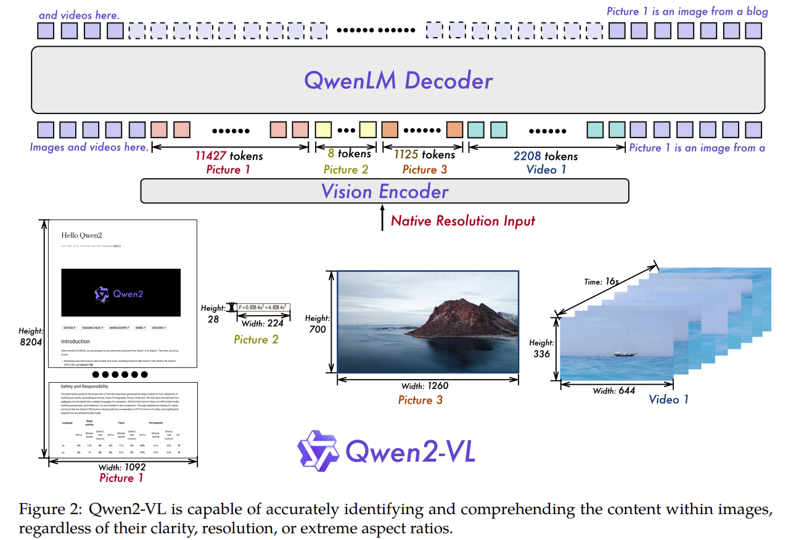
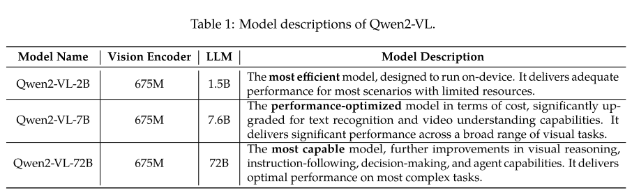
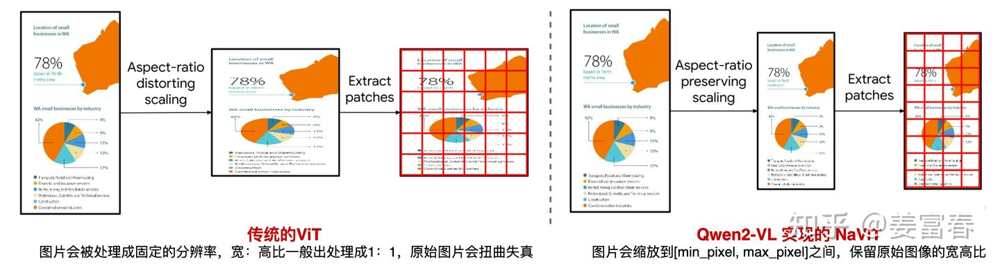
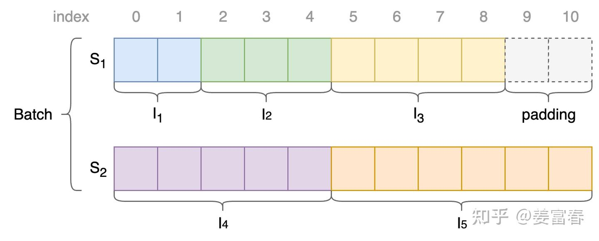
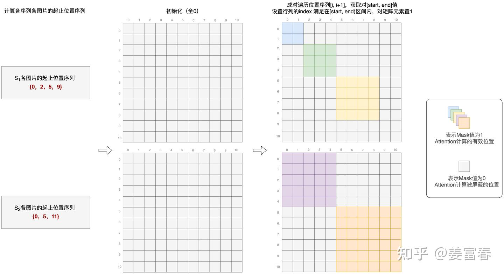
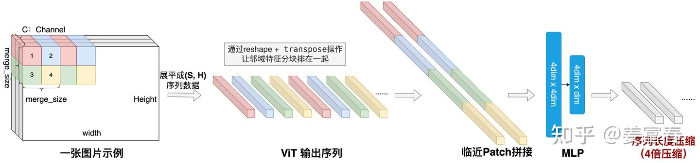
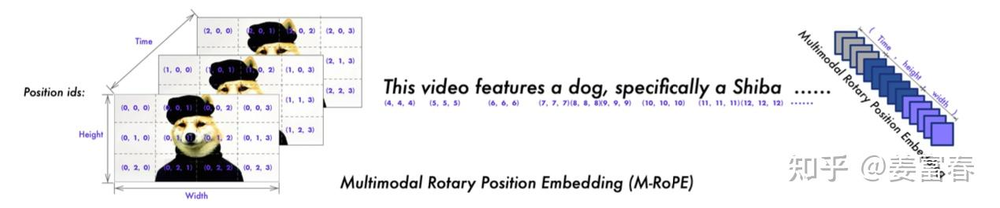

# Qwen2-VL: Enhancing Vision-Language Model's Perception of the World at Any Resolution



## 目录
- [一、Qwen2-VL模型结构的主要改进](#一qwen2-vl模型结构的主要改进)
- [1. 原生动态分辨率 (Naive Dynamic Resolution)](#1-原生动态分辨率-naive-dynamic-resolution)
- [2. Vision Encoder Position Embedding](#2-vision-encoder-position-embedding)
- [3. 输入投影层](#3-输入投影层)
- [4. Multimodal Rotary Position Embedding (M-RoPE)](#4-multimodal-rotary-position-embedding-m-rope)
  - [4.1 将 1D 频率扩展为 3D 频率应用](#41-将-1d-频率扩展为-3d-频率应用)
  - [4.2 生成多模态的 3D Position IDs](#42-生成多模态的-3d-position-ids)
  - [4.3 在 Attention 算子中应用 M-RoPE](#43-在-attention-算子中应用-m-rope)
  - [4.4 mrope_section 的通道分配](#44-mrope_section-的通道分配)
- [5. 统一多模态数据](#5-统一多模态数据)
- [6. 训练数据和训练策略](#6-训练数据和训练策略)
- [二、Qwen2-VL的下游能力](#二qwen2-vl的下游能力)
  - [1. Visual Grounding](#1-visual-grounding)

## 一、Qwen2-VL模型结构的主要改进

Qwen2-VL发布了三个size的模型，分别是Qwen2-VL-2B、Qwen2-VL-7B和Qwen2-VL-72B。



除了主干模型的升级，Qwen2-VL的主要升级点包括：

1. Naive Dynamic Resolution: 从单一分辨率到任意分辨率的转换，Qwen-VL模型只接受单一分辨率，而Qwen2-VL可以接受不同分辨率的图像。
2. Vision Encoder Position Embedding: 视觉模型从绝对位置编码到旋转位置编码的转换，使得模型对长序列有更好的泛化能力。
3. 输入投影层: 输入投影层由跨模态注意力机制转换成了MLP Adapter，来压缩图片的token数。
4. LLM Decoder MultiModal ROPE: 引入了多模态旋转位置编码，统一处理多模态（时序、高度、宽度）三维数据。
5. 统一多模态数据: 从单图片到统一图片和视频，统一框架处理图片和视频数据。
6. 训练数据和训练策略。

接下来我们分别逐个讲解这些升级点：

## 1. 原生动态分辨率 (Naive Dynamic Resolution)

Qwen-VL使用的视觉编码器是标准的ViT，这要求输入的图片要统一处理成单一的、固定的分辨率，才能输入到模型进行处理。一般标准的预训练好的ViT，通常是将图片处理成正方形。这样处理后通常图片会失真，导致模型理解上有信息损失或引入一些误导。



如上图所示，左侧是传统的ViT对输入的处理（也是Qwen-VL采用的方法），对于一些宽高比差距较大的图片，处理后通常会造成图片扭曲。而右侧展示了Qwen2-VL实现的原生动态分辨率方法，该方法会保留原始图片的宽高比，将图片 resize 到适当的大小（具体为最近的 28 的倍数），对图片做 Patch 处理，将每个图片处理成变长的 Vision token 序列，再输入给 LLM 模型。

不过，「任意分辨率」并不意味着以原始尺寸无限制地送入模型。若用户上传极高分辨率的图像（例如 10000×10000 或超长滚动截图），以原始尺寸直接处理会导致 ViT 或 LLM 显存溢出（OOM）。因此 Qwen2-VL 在配置和预处理阶段引入了 `min_pixels` 和 `max_pixels` 两个硬阈值，构成动态分辨率的「双向阈值」控制：

- 当图像总像素数超过 `max_pixels`（默认 `28 × 28 × 1280 ≈ 1,003,520`，约 100 万像素）时，预处理阶段会等比缩小，在 Patch 化之前将总像素数压入安全区间。
- 当图像总像素数低于 `min_pixels`（默认 `56 × 56 = 3136`）时，预处理会等比放大，避免因 token 数量过少导致信息损失。

从设计上看，任意分辨率能力本质上是在 `[min_pixels, max_pixels]` 所定义的安全区间内动态调整 patch 数量，同时严格保持原始宽高比——既保留图像中物体的几何对齐关系，也满足工程上对显存占用的约束。具体缩放逻辑由预处理阶段的 `smart_resize` 实现，详见 [preprocess.md](./preprocess.md)。

> 传统的ViT会将任何图片数据都处理成定长的Patch序列，然后输入给Vision Encoder，这种统一且定长的输入是对硬件计算非常友好的，非常利于Torch.stack组batch，并且不需要任何padding处理。Batch序列中每个位置的计算都是有效的。
> 
> 而对于上面提到的原生动态分辨率方法，会将不同图片处理成不同长度的Patch序列。对于不同的长度的输入做并行计算时，通常有两个方法：第一个是类似于文本操作的方式，先对数据做padding到统一的长度，然后再输入到模型；第二个是自定义Dataloader的BatchSampler，分桶拿数据，当某个桶满的时候再yield数据。这两个方式都会比较慢，因此并不是一个完美的方法。而Qwen2-VL采用的原生动态分辨率方法在实现上很好地兼顾了性能问题。

Qwen2-VL采用的原生动态分辨率方法的实现参考了NaViT论文： 将不同图像的多个patch打包到一个序列中，从而保留不同图片的可变分辨率。同时利用Attention_mask来让每个图像的token只能关注到当前图像的token，不能关注到其他图像的token。 这使得在固定计算预算下，动态分辨率方法能训练更多样本，进而带来更好的性能。

其打包与掩码的具体实现可以参考下面两张图示：





我们以一个简单的例子来描述下上述动态分辨率方法的处理逻辑。假设我们有5张图片：I_1 - I_5，patchify之后的图像token长度分别为2到6。我们假设训练的batch_size为2，需要在训练时将这5张图片放到一个batch中：

1. 首先我们将这5张图片进行Pack，放到2个序列中。如上方的第一张图（patch packing）所示，一个简单的方式是将3个Patch较短的图片放到一个序列 S_1 中，2个Patch较长的图片放到另一个序列 S_2 中。符号化表示为：Batch = {S_1, S_2}，其中 S_1 = {Image_1: 2, I_2: 3, I_3: 4} 序列长度为9，而 S_2 = {I_4: 5, I_5: 6} 序列长度为11。

2. 接下来在Batch内做序列Padding对齐处理。如上方的第一张图中的Padding & Alignment部分所示，我们需要在短序列后面添加padding token，让两个序列的长度对齐。

3. 最后通过设置Attention Mask保证同Sequence中各图片计算隔离。因为一个序列中有多张图片输入，在计算时必须保证各图片的Attention计算是相互隔离的。实现上可以通过对Attention Mask矩阵做特殊的设置来保证这一点。计算Attention Mask的过程如上方的第二张图（Naive Dynamic Resolution）所示。最后只需要将得到的attention mask和token序列输入到Vision Encoder中即可。

## 2. Vision Encoder Position Embedding

由于在Qwen2-VL中，用动态分辨率替换了固定分辨率，因此视觉编码器中的2D绝对位置编码也需要改变，因为Patch是变长的，对于超长的一些位置，如果采用绝对位置编码，由于数据稀疏性，并不能得到充分训练。但RoPE本身是具有一定的外推性，对长序列建模有更好的泛化能力。

关于ROPE的内容可以参考 [ROPE.md](../../stanford_cs336/lecture03_architectures/ROPE.md) 这个文档。

现在我们知道了1维旋转位置编码RoPE的计算方式，那么怎么扩展到2维呢？RoPE从1维扩展到2维有一个简单的结论：针对一个位置 $(x, y)$，对维度为 $d$ 的输入向量分成两半，前一半向量用 $x$ 的一维RoPE矩阵 $R_x$ 处理，后一半向量用 $y$ 的一维RoPE矩阵 $R_y$ 处理，然后再将两半处理后的结果拼接在一起，就完成了2维的RoPE处理。

## 3. 输入投影层

在上一代模型 Qwen-VL 中，视觉语言适配器（VL Adapter）主要利用了一个 单层跨模态注意力机制 (Cross Attention) 来完成视觉 Token 的压缩。具体而言，它初始化了 256 个固定长度的可学习查询向量（Learnable Queries）作为 $Q$，而将视觉编码器（ViT）输出的变长图像特征作为 $K$ 和 $V$。这种方式虽然能将任意长度的视觉序列固定压缩为 256 个 token，但跨模态注意力机制本质上更适合处理这种将变长 $K, V$ 投影到定长 $Q$ 的场景。

然而，在最新的 Qwen2-VL 中，模型引入了 原生动态分辨率。这意味着输入的视觉 token 序列本身就是变长且代表真实图像长宽比例的，强制将其压缩为固定长度的 token 序列会破坏这种动态性。因此，Qwen2-VL 放弃了跨模态注意力机制，转而采用了一种更简单且能保持动态长度比例的压缩方法： 对空间位置临近的 patch 特征做拼接，再经过 2 层 MLP 线性变换。这样能够将原来长度为 $n$ 的序列动态压缩到 $n/4$，最终将压缩后的变长特征序列输入给 LLM 模型。

这个过程在代码实现中巧妙地分解成了两个阶段： 图像前处理阶段的物理拼接，以及 模型前向传播时的特征融合压缩。

### 第一阶段：图像前处理（物理重排拼接）

在预处理阶段，主要目的是将原始图像的像素块（Patch）进行排列组合，使得在空间上相邻的 4 个 Patch（即一个 $2 \times 2$ 的小方块，由 `merge_size=2` 决定）在内存里能连续排布。具体代码逻辑如下：

```python
# 1. 计算各个维度的网格大小
channel = patches.shape[1]
grid_t = patches.shape[0] // temporal_patch_size  # 时间维度的切块数
grid_h, grid_w = resized_height // patch_size, resized_width // patch_size  # 空间维度的切块数

# 2. 空间位置解构重塑 (Reshape)
# 把原本完整的高和宽，拆解成了 "大网格坐标" 和 "2x2小方块内部坐标"
patches = patches.reshape(
    grid_t,
    temporal_patch_size,
    channel,
    grid_h // merge_size,  # 高度方向的“大网格”数量
    merge_size,            # 2x2方块中的高度位置 (0或1)
    patch_size,
    grid_w // merge_size,  # 宽度方向的“大网格”数量
    merge_size,            # 2x2方块中的宽度位置 (0或1)
    patch_size,
)

# 3. 维度转置换位 (Transpose)
# 重新排列维度，把表示宏观位置的维度（大网格坐标）提到前面，
# 把 2x2 方块内部的特征全部放到最后面去，完成相邻 patch 的物理相邻排布。
patches = patches.transpose(0, 3, 6, 4, 7, 2, 1, 5, 8)
```

### 第二阶段：模型前向传播（MLP特征压缩）

在模型结构中，视觉网络输出特征后，会经过 `PatchMerger` 模块进行合并与降维。利用上一步中已经连续排布的 4 个 Patch 特征，`PatchMerger` 先将其强行拼接为一个大维度，然后再通过多层感知机（MLP）压缩回目标维度，实现 $4$ 倍的序列长度压缩：

```python
class PatchMerger(nn.Module):
    def __init__(self, dim: int, context_dim: int, spatial_merge_size: int = 2) -> None:
        super().__init__()
        # 准备接收 4 个 patch 的特征量 (2*2 = 4)
        self.hidden_size = context_dim * (spatial_merge_size**2) 
        self.ln_q = LayerNorm(context_dim, eps=1e-6)
        
        # 定义两层 MLP 网络
        self.mlp = nn.Sequential(
            nn.Linear(self.hidden_size, self.hidden_size), # 保持 4*dim 的特征尺度
            nn.GELU(),
            nn.Linear(self.hidden_size, dim),              # 压缩回 1*dim，完成降维
        )

    def forward(self, x: torch.Tensor) -> torch.Tensor:
        # .view() 操作将预处理中排布好的 4 个 Patch 物理合并成一个长向量
        # 然后通过 self.mlp 进行非线性变换和降维压缩
        x = self.mlp(self.ln_q(x).view(-1, self.hidden_size))
        return x
```

整体的处理过程如下图所示：



为了区分Vision token和文本token，Qwen2-VL也引入了两个特殊的token `<|vision_start|>` 和 `<|vision_end|>` 来标识Vision token。

> 对于一个224x224的图像，如果ViT的patch_size为14，最终将图片编码成一个66个token的序列输入到模型。具体的计算过程为：首先，Patchify处理后的Token数量为：(224/14) * (224/14) = 16 * 16 = 256。然后经过输入投影层处理得到：256 / 4 = 64。最后加上2个起止位置的特殊token：64 + 2 = 66。

## 4. Multimodal Rotary Position Embedding (M-RoPE)



在传统的语言模型中，旋转位置编码（RoPE）是一维的，每个 token 对应一个递增的标量索引（如 0, 1, 2, 3...）。但在视觉-语言模型（尤其是支持视频的模型）中，视觉特征不仅有序列的先后顺序，还自带天然的 3D 空间结构（时间 Temporal，高度 Height，宽度 Width）。Qwen2-VL 为了保留这部分多维结构信息，创新性地提出了 M-RoPE。

视频可以看做是在图片二维空间上，增加了时序维度，是三维时空分布的数据：(Temporal, Height, Width)，M-RoPE 将位置编码信息从 1 维扩展到了 3 维，这样就能清晰刻画视频模态数据时空位置信息。对于文本（一维）和图像（二维）的数据如何统一表示成 3 维的位置 ID 呢？有以下几个需要注意的地方：

- 从上述的图片中我们可以看到，文本是一维空间序列，它的时间、高度、宽度维度保持一致，于是退化为标准的 1D-RoPE。
- 图像只有宽高两个维度，所以对于一张图片（单帧），时序维度 $T$ 的位置在这个图片内部始终保持固定常数。
- 对于混合多模态数据，每个模态的起始 position ID 是前面模态三维位置 ID 中最大的 ID 并加 1 得到。

得到了 3D 的 `position_index` 后，我们可以参考上述提到的 2D-ROPE 来计算 3D-RoPE。**针对一个位置 $(t, x, y)$，对维度为 $d$ 的输入特征向量分成三部分，前一部分向量用 $t$ 的一维 RoPE 矩阵 $R_t$ 处理，中间的向量用 $x$ 的一维 RoPE 矩阵 $R_x$ 处理，最后的一部分向量用 $y$ 的一维 RoPE 矩阵 $R_y$ 处理，然后再将三个结果拼接在一起，就做完了 3 维的 RoPE 处理。**这就让一个大语言模型在做自注意力时，它的隐状态既拥有了一维的时序概念，又拥有了二维乃至三维的立体空间概念！

在代码实现层面，M-RoPE 主要可以分为三个核心部分：

### 4.1 将 1D 频率扩展为 3D 频率应用

在原生的 RoPE 中，我们会预先计算出一组按指数递减的逆频率（`inv_freq`）。在 1D RoPE 中，这些频率直接乘以 1D 的位置索引。
可以参考模型代码中的 `inv_freq` 初始化：
```python
inv_freq = 1.0 / (theta ** (torch.arange(0, dim, 2, dtype=torch.float) / dim))
self.register_buffer("inv_freq", inv_freq, persistent=False)
```

但在 Qwen2-VL 的 `Qwen2VLRotaryEmbedding` 中，这个频率矩阵被“复制”扩展成了 3 个分支，以分别用于乘在时间、高度和宽度三个维度的位置 ID 上：

```python
class Qwen2VLRotaryEmbedding(nn.Module):
    # ... 省略初始化代码
    
    def forward(self, x, position_ids):
        # 相比其他模型，Qwen2-VL 为不同的网格（时间、高、宽）准备了三个位置 ID
        # 于是这里将 inv_freq 扩展为形状 (3, ...)
        inv_freq_expanded = self.inv_freq[None, None, :, None].float().expand(3, position_ids.shape[1], -1, 1)
        
        # position_ids 的形状是 (3, bs, 1, positions)，包含了 [T, H, W] 的索引
        position_ids_expanded = position_ids[:, :, None, :].float()  
        
        # 将频率矩阵与 3D 位置矩阵相乘，得到 3D 的旋转角度频率
        freqs = (inv_freq_expanded.float() @ position_ids_expanded.float()).transpose(2, 3)
        emb = torch.cat((freqs, freqs), dim=-1)
        cos = emb.cos() * self.attention_scaling
        sin = emb.sin() * self.attention_scaling
        return cos.to(dtype=x.dtype), sin.to(dtype=x.dtype)
```

注意这里的 `position_ids` 尺寸从传统 LLM 的 `[bs, seq_len]` 变成了 `[3, bs, seq_len]`。它里面实际上存放了三个独立的序列数组：`position_temporal`（时间）、`position_height`（高度）和 `position_width`（宽度）。

### 4.2 生成多模态的 3D Position IDs

既然需要 `[3, bs, seq_len]` 的 position ID，它是怎么算出来的呢？这在 `get_rope_index` 函数中体现。该函数负责在一个混合了“文本+图片+视频”的序列中，为不同模态分配正确的位置 ID：

```python
def get_rope_index(self, input_ids, mm_token_type_ids, ...):
    # 纯文本序列 (Token 类型 == 0)
    # 文本是一维的，它的时间、高度、宽度维度保持一致，于是退化为标准的 1D RoPE。
    # 也就是在 3 个维度上填充一样的数字: [current_pos, current_pos+1, ...]
    llm_pos_ids_list.append(
        torch.arange(text_len, device=input_ids.device).view(1, -1).expand(3, -1) + current_pos
    )
    
    # 图像或视频序列 (Token 类型 == 1 或 2)
    # 调用 get_vision_position_ids 根据实际的特征网格 (grid_thw) 计算。
    # 视频会有三个维度的实际递增，而图像（单帧）的时间维度(Temporal)在这个图片内部保持常数。
    vision_position_ids = self.get_vision_position_ids(
        current_pos, grid_thw, 1, spatial_merge_size, device=input_ids.device
    )
```

在 `get_vision_position_ids` 方法中，模型会分别生成宽度序列（随列递增）、高度序列（随行递增）和时间序列（随帧递增），并将它们拼成上面所需的 `[3, seq_len]` 矩阵。

### 4.3 在 Attention 算子中应用 M-RoPE

生成了融合了 T、H、W 的 `cos` 和 `sin` 值后，在每一次的注意力计算中，模型使用 `apply_multimodal_rotary_pos_emb` 函数将它们施加到 Query ($q$) 和 Key ($k$) 张量上：

```python
def apply_multimodal_rotary_pos_emb(q, k, cos, sin, mrope_section, unsqueeze_dim=1):
    # mrope_section 指定了 Query 和 Key 的通道维度要怎么切分
    # 例如将通道切分成三块，分别对应 T、H、W 的位置编码
    mrope_section = mrope_section * 2
    
    # 这里通过 split 和 cat 操作，将对应 Temporal, Height, Width 的 
    # cos 和 sin 块拼接到一起
    cos = torch.cat([m[i % 3] for i, m in enumerate(cos.split(mrope_section, dim=-1))], dim=-1).unsqueeze(unsqueeze_dim)
    sin = torch.cat([m[i % 3] for i, m in enumerate(sin.split(mrope_section, dim=-1))], dim=-1).unsqueeze(unsqueeze_dim)
    
    # 最后应用标准的旋转公式： q * cos + rotate_half(q) * sin
    q_embed = (q * cos) + (rotate_half(q) * sin)
    k_embed = (k * cos) + (rotate_half(k) * sin)
    return q_embed, k_embed
```

`mrope_section` 决定了每个 Attention Head 的通道维如何分配给 T、H、W 三个方向的旋转编码。具体流程如下：

1. 拆分（Split）：根据 `mrope_section`，将 `cos` / `sin` 在最后一维（通道维）切成多段，每段对应 T、H、W 中某一维的频率；函数内会先执行 `mrope_section = mrope_section * 2`，再按 `[T, H, W, T, H, W]` 的顺序重排（与 `rotate_half` 的成对结构对齐）。
2. 重组（Cat）：通过 `torch.cat([m[i % 3] for i, m in enumerate(cos.split(...))])` 将各段拼回完整的 `cos` / `sin`，使其与 Q、K 的通道维一一对应。
3. 应用（Apply）：用标准 RoPE 公式 `(q * cos) + (rotate_half(q) * sin)` 施加到 Query 和 Key 上。

通过这种“分段映射 + 拼接融合”的设计，一个原本只表示单一位置索引的特征向量，就被注入了时空三维的位置信息。

### 4.4 mrope_section 的通道分配

`mrope_section` 是 M-RoPE 的核心配置项，类型为长度为 3 的整数列表 `[T, H, W]`，表示三个时空方向各自占用的 RoPE 频率对数量。该值写在官方权重的 `config.json` → `rope_scaling.mrope_section` 中，由 `self.config.rope_parameters["mrope_section"]` 在运行时读入，并未在 `modeling_qwen2_vl.py` 里写死。

需要满足硬性约束（`mrope_section` 三个分量之和等于 `head_dim / 2`）：

```text
mrope_section[T] + mrope_section[H] + mrope_section[W] = head_dim / 2
```

Qwen2-VL 官方模型（2B / 7B / 72B）的 `head_dim` 均为 128，对应配置为 `[16, 24, 24]`，比例约为 2 : 3 : 3，并非三等分。

RoPE 对每个频率分量会成对出现（`emb = torch.cat((freqs, freqs), dim=-1)`），因此在完整 head 维度上的实际占用为配置值的 2 倍：

| 时空维 | mrope_section（频率对） | 实际通道维数 |
| :--- | :---: | :---: |
| 时间 T | 16 | 32（16×2） |
| 高度 H | 24 | 48（24×2） |
| 宽度 W | 24 | 48（24×2） |
| 合计 | 64 | 128 |

重排后的 head 维布局为 Chunked 形式，沿通道维依次为 T、H、W 各两段（与 `apply_multimodal_rotary_pos_emb` 中 `mrope_section * 2` 后的切分一致）：

```text
[T(32), H(48), W(48), T(32), H(48), W(48)]   # 合计 128 维
```

为何空间维多于时间维？**多模态大模型对空间几何细节（如 OCR 文字定位、细粒度 grounding 坐标）的依赖通常强于对纯时序变化的感知。将更多通道容量分配给 H、W，有助于模型在物体定位与空间结构建模上获得更高精度；T 维保留 32 维已足够编码帧级时序关系。**

若自定义架构导致 `head_dim` 变化，需同步修改 `mrope_section`，保证三者之和仍为 `head_dim / 2`。按 Qwen2-VL 的 2 : 3 : 3 比例缩放时，例如 `head_dim = 1024` 可配置为 `[128, 192, 192]`（128 + 192 + 192 = 512）。该值与 `hidden_size` 无直接关系，只取决于 `head_dim = hidden_size / num_attention_heads`。

## 5. 统一多模态数据

Qwen2-VL成功统一了图像与视频的理解框架，支持混合输入图像和视频数据进行推理。为了在底层架构上保证图像和视频处理的强一致性，模型分别对两者采取了以下预处理策略：

- 视频处理：默认以每秒两帧（2 fps）的采样率提取视频帧，确保最终采样得到偶数长度的帧序列。此外，面对长视频时，为了在长序列和计算效率之间取得平衡，Qwen2-VL采用了动态调整帧分辨率的机制，从而将单个视频的总token数量严格控制在 16K 以内。
- 图像处理：为了与视频的底层处理格式对齐，单张静态图像会被“复制”一次，将其从一张独立的图片扩展为一个长度为 2 的帧序列。具体的“时间维度补齐（Temporal Padding）”代码逻辑如下所示：

```python
# 时间补齐 (Temporal Padding)
# 如果总帧数不能被 temporal_patch_size (通常为2) 整除，则将最后一帧复制补齐。
# 这确保了单张图像 (T=1) 会被复制成 2 帧，使得图片和视频的底层处理格式保持一致。
if patches.shape[0] % temporal_patch_size != 0:
    repeats = np.repeat(
        patches[-1][np.newaxis], temporal_patch_size - (patches.shape[0] % temporal_patch_size), axis=0
    )
    patches = np.concatenate([patches, repeats], axis=0)
```

使用3D的卷积对帧序列做特征抽取，如下图所示，每两张图片为一组进行卷积操作抽取特征。这样通过将卷积核扩充了时序维度，可以进一步压缩序列长度，因此也能进一步提升模型处理更多帧的能力。

具体在代码实现中，Qwen2-VL实现了一个 `PatchEmbed` 模块来对输入进行三维卷积处理，从而实现时空维度的统一抽取。

```python
class PatchEmbed(nn.Module):
    def __init__(
        self,
        patch_size: int = 14,
        temporal_patch_size: int = 2,
        in_channels: int = 3,
        embed_dim: int = 1152,
    ) -> None:
        super().__init__()
        self.patch_size = patch_size
        self.temporal_patch_size = temporal_patch_size
        self.in_channels = in_channels
        self.embed_dim = embed_dim

        # 扩充时序维度的 3D 卷积核，将时空特征提取融为一体
        kernel_size = [temporal_patch_size, patch_size, patch_size]
        self.proj = nn.Conv3d(in_channels, embed_dim, kernel_size=kernel_size, stride=kernel_size, bias=False)

    def forward(self, hidden_states: torch.Tensor) -> torch.Tensor:
        target_dtype = self.proj.weight.dtype
        # 重塑张量格式以适配 Conv3d (Batch, Channels, Temporal, Height, Width)
        hidden_states = hidden_states.view(-1, self.in_channels, self.temporal_patch_size, self.patch_size, self.patch_size)
        # 通过 3D 卷积抽取特征并展平
        hidden_states = self.proj(hidden_states.to(dtype=target_dtype)).view(-1, self.embed_dim)
        return hidden_states
```

并在模型初始化时，将其作为 Vision Transformer (ViT) 的 patch 嵌入层使用：

```python
self.patch_embed = PatchEmbed(
    patch_size=config.patch_size,
    temporal_patch_size=config.temporal_patch_size,
    in_channels=config.in_channels,
    embed_dim=config.embed_dim,
)
```

## 6. 训练数据和训练策略

沿用Qwen-VL，采用三阶段训练方法。

- Stage1（预训练阶段一）：专注于训练ViT组件，利用大量图像-文本对提升大型语言模型（LLM）的语义理解。在这个初始阶段，主要任务包括学习图文关系、OCR文本内容识别和图像分类。此阶段的重点是建立核心的视觉-文本相关性和对齐的稳健理解。
- Stage2（预训练阶段二）：全参训练，使用更广泛的数据进行更全面的学习。该阶段额外引入了大量的图像相关的token，混合了更大规模的图文内容和视觉问答数据集，从而细化模型响应图像相关查询的能力。同时包含多任务数据集来培养模型并发处理不同任务的能力。在整个预训练阶段（1和2），模型累计处理了海量的token（包含图像和文本token），但在训练过程中仅对文本token提供监督信号。
- Stage3（指令微调阶段）：冻结ViT参数，仅使用指令数据集对LLM进行专属微调。该阶段使用ChatML格式构建指令跟随数据，不仅包含纯文本对话，还囊括了图像问答、文档解析、多图比较、视频理解、视频流对话以及基于Agent的交互等多模态对话数据，旨在全面增强模型执行各种模态复杂指令的能力。

## 二、Qwen2-VL的下游能力

## 1. Visual Grounding

Qwen2-VL 的 Grounding 能力完全基于纯文本 token 输出，不依赖任何额外的检测头，而是将目标定位任务转化为一种序列生成的语言任务，与文本生成、图像理解共用同一个语言模型 head。

### 坐标归一化

所有 Bounding Box 坐标归一化到 [0, 1000) 的整数范围内，格式为左上角 + 右下角两点表示：

```
(X_topleft, Y_topleft),(X_bottomright, Y_bottomright)
```

归一化计算公式：

```python
x_norm = int(x_pixel / image_width  * 1000)
y_norm = int(y_pixel / image_height * 1000)
```

这样无论图片是任意分辨率，坐标空间始终统一在 [0, 1000) 范围内，模型不需要感知图片真实像素尺寸，泛化性更好。

### 专用 Special Tokens

为了在文本序列中区分物体描述和空间坐标，模型引入了三组专用标记：

| Token | Token ID | 作用 |
|---|---|---|
| `<\|object_ref_start\|>` | 151646 | 标记 bounding box 所指向的文字描述的开始 |
| `<\|object_ref_end\|>` | 151647 | 标记文字描述的结束 |
| `<\|box_start\|>` | 151648 | 标记矩形框坐标文本的开始 |
| `<\|box_end\|>` | 151649 | 标记矩形框坐标文本的结束 |
| `<\|quad_start\|>` | 151650 | 标记四边形坐标（旋转框/任意多边形）的开始 |
| `<\|quad_end\|>` | 151651 | 标记四边形坐标的结束 |

`<|quad_start|>` / `<|quad_end|>` 用于描述非轴对齐的旋转框场景（例如文档中倾斜的文字行），支持用 4 个顶点坐标来表示任意四边形区域。

### 数据格式（论文 Referring Grounding 示例）

```
<|vision_start|>Picture1.jpg<|vision_end|>
<|object_ref_start|>the eyes on a giraffe<|object_ref_end|><|box_start|>(176,106),(232,160)<|box_end|>
```

- `<|vision_start|>...<|vision_end|>`：包裹图片（训练数据中用文件名表示，推理时替换为实际的 image patch tokens）
- `<|object_ref_start|>...<|object_ref_end|>`：包裹物体的自然语言描述
- `<|box_start|>...<|box_end|>`：包裹对应的归一化坐标

### 两类典型任务

① Referring Expression Comprehension（文字 → 坐标）

给定文字描述，让模型找出对应物体的位置：

```
User:  <image> 图中长颈鹿的眼睛在哪里？
Model: <|object_ref_start|>长颈鹿的眼睛<|object_ref_end|>
       <|box_start|>(176,106),(232,160)<|box_end|>
```

② Region Caption（坐标 → 文字）

给定一个区域框，让模型描述框内的内容：

```
User:  <image> 请描述 <|box_start|>(176,106),(232,160)<|box_end|> 这个区域
Model: 这是长颈鹿头部的眼睛部位。
```