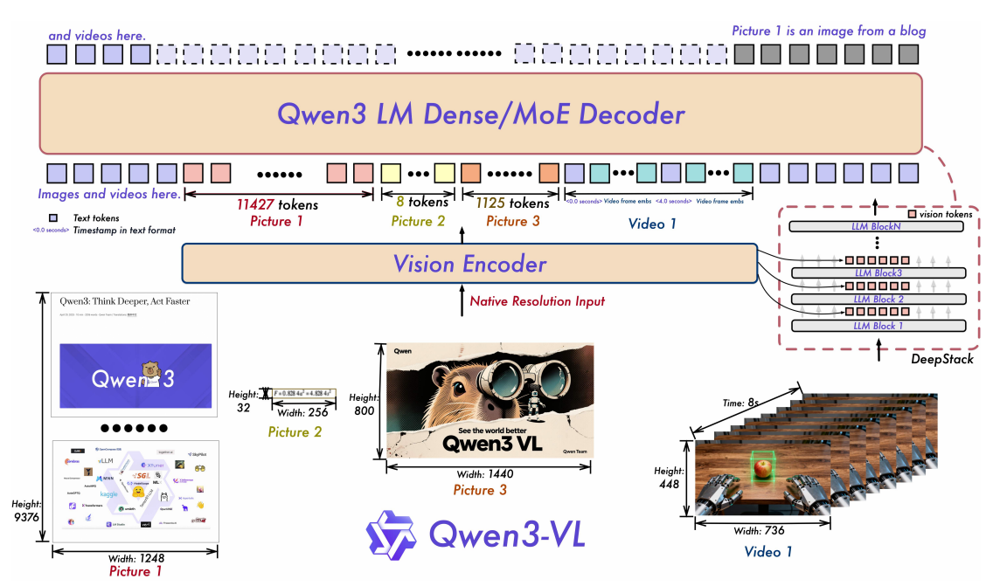

# Qwen3-VL



## 目录
- [一、Qwen3-VL 模型结构的主要改进](#一qwen3-vl模型结构的主要改进)
  - [1. DeepStack：视觉特征的多层注入机制](#1-deepstack视觉特征的多层注入机制)
    - [1.1 视觉编码器侧：提取多层中间特征](#11-视觉编码器侧提取多层中间特征)
    - [1.1.1 Pre-Shuffle Norm 与 Post-Shuffle Norm](#111-pre-shuffle-norm-与-post-shuffle-norm)
    - [1.2 语言模型侧：逐层叠加视觉特征](#12-语言模型侧逐层叠加视觉特征)
    - [1.2.1 不同层级注入给 LLM 的含义](#121-不同层级注入给-llm-的含义)
    - [1.3 完整数据流](#13-完整数据流)
  - [2. 移除 Window Attention，回归全局 Full Attention](#2-移除-window-attention回归全局-full-attention)
  - [3. 新增可学习的绝对位置编码](#3-新增可学习的绝对位置编码)
  - [4. Vision MLP 从 SwiGLU 退回标准 MLP，Norm 从 RMSNorm 退回 LayerNorm](#4-vision-mlp-从-swiglu-退回标准-mlpnorm-从-rmsnorm-退回-layernorm)
  - [5. LLM 侧：M-RoPE 改为 Interleaved 布局](#5-llm-侧m-rope-改为-interleaved-布局)
  - [6. 视频时间戳：从隐式位置编码到显式文本 Token](#6-视频时间戳从隐式位置编码到显式文本-token)

## 一、Qwen3-VL 模型结构的主要改进

Qwen3-VL 在 Qwen2.5-VL 的基础上进行了多项架构升级。本文档重点梳理其中最核心的结构改进。

### 1. DeepStack：视觉特征的多层注入机制

- **Qwen2.5-VL**：视觉编码器（ViT）只输出**最终层**的特征，经过 PatchMerger 降维后，一次性替换 LLM 输入序列中的视觉占位符 token。LLM 在整个推理过程中，对视觉内容的理解完全依赖这一份最终层特征。
- **Qwen3-VL**：引入了来自论文 [DeepStack（arXiv:2406.04334）](https://arxiv.org/abs/2406.04334) 的机制。视觉编码器除了输出最终层特征外，还会在**中间层**（默认第 8、16、24 层）额外提取特征，并在 LLM 推理的前几层结束后，将这些中间层特征**叠加**到视觉 token 的 hidden states 上，让 LLM 在每层推理后持续"补充"视觉信息。

结构变化：引入了一套额外的 `deepstack_merger_list`（独立的 PatchMerger 列表），专门负责处理视觉编码器中间层的特征，并在 LLM 文本解码器的前 N 层（N 由中间层数量决定）结束后，将对应的视觉特征叠加到视觉 token 的位置上。

| 特性 | Qwen2.5-VL | Qwen3-VL |
| :--- | :--- | :--- |
| **视觉特征来源** | 仅 ViT 最终层 | ViT 最终层 + 多个中间层 |
| **注入时机** | 进入 LLM 之前，一次性替换 | 进入 LLM 前替换 + LLM 推理中持续叠加 |
| **LLM 对视觉的感知** | 固定不变（仅初始替换） | 动态更新（每层可叠加新视觉信息） |
| **额外参数** | 无 | `deepstack_merger_list`（N 个独立 PatchMerger） |

#### 1.1 视觉编码器侧：提取多层中间特征

在配置层面，通过 `deepstack_visual_indexes` 指定要提取中间特征的层索引：

```python
# vlm_architecture/qwen3_vl/configuration_qwen3_vl.py

class Qwen3VLVisionConfig(PreTrainedConfig):
    def __init__(
        self,
        depth=27,                                    # 视觉编码器总层数
        deepstack_visual_indexes=[8, 16, 24],        # 要提取中间特征的层索引
        ...
    ):
```

在模型初始化时，会为每个中间层索引创建一个独立的 `Qwen3VLVisionPatchMerger`：

```python
# vlm_architecture/qwen3_vl/modeling_qwen3_vl.py

# 最终层的 Merger（use_postshuffle_norm=False）
self.merger = Qwen3VLVisionPatchMerger(config=config, use_postshuffle_norm=False)

# DeepStack 专用的 Merger 列表（use_postshuffle_norm=True，各层参数独立）
self.deepstack_merger_list = nn.ModuleList(
    [
        Qwen3VLVisionPatchMerger(config=config, use_postshuffle_norm=True)
        for _ in range(len(config.deepstack_visual_indexes))
    ]
)
```

在视觉编码器的 forward 中，每经过一个指定的中间层，就用对应的 Merger 提取一次特征：

```python
# vlm_architecture/qwen3_vl/modeling_qwen3_vl.py

deepstack_feature_lists = []
for layer_num, blk in enumerate(self.blocks):
    hidden_states = blk(hidden_states, cu_seqlens=cu_seqlens, ...)

    # 命中中间层索引时，提取并保存该层的特征
    if layer_num in self.deepstack_visual_indexes:
        deepstack_feature = self.deepstack_merger_list[
            self.deepstack_visual_indexes.index(layer_num)
        ](hidden_states)
        deepstack_feature_lists.append(deepstack_feature)

# 最终层走普通 Merger
merged_hidden_states = self.merger(hidden_states)

return BaseModelOutputWithDeepstackFeatures(
    last_hidden_state=hidden_states,
    pooler_output=merged_hidden_states,          # 最终层特征（替换视觉占位符用）
    deepstack_features=deepstack_feature_lists,  # 中间层特征列表（注入 LLM 用）
)
```

#### 1.1.1 Pre-Shuffle Norm 与 Post-Shuffle Norm

`Qwen3VLVisionPatchMerger` 通过 `use_postshuffle_norm` 在两种归一化顺序间切换，对应不同的 spatial merge 数据流：

| 方案 | 配置 | 用于 | 数据流 | 逻辑 |
| :--- | :--- | :--- | :--- | :--- |
| Pre-Shuffle Norm | `use_postshuffle_norm=False` | ViT 最终层（如第 27 层） | 特征 → LayerNorm → Pixel Shuffle（2×2 拼接）→ Linear 降维 | 先对每个独立 patch 归一化，再把相邻 2×2 patch 拼成一个大向量 |
| Post-Shuffle Norm | `use_postshuffle_norm=True` | DeepStack 中间层（第 8、16、24 层） | 特征 → Pixel Shuffle（2×2 拼接）→ LayerNorm → Linear 降维 | 先把相邻 2×2 patch 物理拼接，再对拼接后的大向量做一次统一 LayerNorm |

对应到 `forward` 中的分支：

```python
# vlm_architecture/qwen3_vl/modeling_qwen3_vl.py — Qwen3VLVisionPatchMerger.forward

# Post-Shuffle：先 view 成 merge 后维度（等价于 spatial 拼接），再 LayerNorm
# Pre-Shuffle：先对单 patch 做 LayerNorm，再 view 成 merge 后维度
x = self.norm(x.view(-1, self.hidden_size) if self.use_postshuffle_norm else x).view(-1, self.hidden_size)
x = self.linear_fc2(self.act_fn(self.linear_fc1(x)))
```

- 为什么最终层用 Pre-Shuffle？

此时特征已历经完整 ViT 抽象，全局语义稳定，各 patch 尺度较一致，先归一化再拼接是安全且高效的。

- 为什么 DeepStack 中间层必须用 Post-Shuffle？

DeepStack 从 ViT 浅层（第 8 层）、中层（第 16 层）抽特征，这类表征有两个特点：局部高频信号强、尺度不稳定。

1. 「狂野」的浅层特征：第 8 层保留大量局部纹理、边缘与高频像素信号。相邻 patch 可能落在物体边界两侧（例如两格在白底、两格在黑字上），通道间数值方差大、尺度互不统一。
2. 避开「方差放大」陷阱：若用 Pre-Shuffle Norm，四个 patch 会各自按本 patch 的方差被拉伸；拼接后，高频噪声交错叠加，易产生不稳定的多模态振荡。Post-Shuffle 先把原始信号拼成一个大向量，再统一归一化，尺度更稳，也更利于后续与 LLM hidden states 做加法叠加。

#### 1.2 语言模型侧：逐层叠加视觉特征

在进入 LLM 之前，视觉编码器**最终层**的特征（`pooler_output`）被用来替换输入序列中的视觉占位符 token，与文本 token 一起拼成完整的 `inputs_embeds`：

```python
# vlm_architecture/qwen3_vl/modeling_qwen3_vl.py

# 1. 文本 token 查 embedding 表
inputs_embeds = self.get_input_embeddings()(input_ids)

# 2. 视觉编码器最终层特征替换视觉占位符（一次性，进入 LLM 前完成）
image_embeds = image_outputs.pooler_output          # 最终层特征
deepstack_image_embeds = image_outputs.deepstack_features  # 中间层特征列表

inputs_embeds = inputs_embeds.masked_scatter(image_mask, image_embeds)
# 此时 inputs_embeds = [文本emb, ..., 视觉emb(最终层), ..., 文本emb, ...]
```

然后在 LLM（`Qwen3VLTextModel`）的 Transformer 层循环中，每跑完一层就检查是否需要叠加 DeepStack 特征：

```python
# vlm_architecture/qwen3_vl/modeling_qwen3_vl.py

hidden_states = inputs_embeds  # 初始 hidden_states

for layer_idx, decoder_layer in enumerate(self.layers):
    # 正常跑一层 Transformer（含文本和视觉 token 的 Self-Attention）
    hidden_states = decoder_layer(hidden_states, ...)

    # 跑完第 0、1、2 层后，分别叠加中间层特征
    if deepstack_visual_embeds is not None and layer_idx in range(len(deepstack_visual_embeds)):
        hidden_states = self._deepstack_process(
            hidden_states,
            visual_pos_masks,             # 标记哪些位置是视觉 token 的布尔 mask
            deepstack_visual_embeds[layer_idx],  # 对应中间层的特征
        )
```

`_deepstack_process` 的实现非常简洁：只对序列中**视觉 token 所在的位置**做加法，文本 token 的位置完全不受影响：

```python
# vlm_architecture/qwen3_vl/modeling_qwen3_vl.py

def _deepstack_process(
    self, hidden_states: torch.Tensor, visual_pos_masks: torch.Tensor, visual_embeds: torch.Tensor
):
    visual_pos_masks = visual_pos_masks.to(hidden_states.device)
    visual_embeds = visual_embeds.to(hidden_states.device, hidden_states.dtype)
    hidden_states = hidden_states.clone()
    # 只对 visual_pos_masks 为 True 的视觉 token 位置做加法
    local_this = hidden_states[visual_pos_masks, :] + visual_embeds
    hidden_states[visual_pos_masks, :] = local_this
    return hidden_states
```

#### 1.2.1 不同层级注入给 LLM 的含义

ViT 第 8、16、24 层提取的特征，分别叠加到 LLM 第 0、1、2 层之后，抽象层次由浅入深，对 Decoder 早期推理的分工如下：

| ViT 层 | 特征层次 | 注入 LLM 层 | 主要作用 |
| :--- | :--- | :--- | :--- |
| 第 8 层 | 浅层 | 第 0 层 | 保留高频局部纹理、边缘像素和小号 OCR 笔画；尚未经深层抽象，细节不易被平滑掉，利于密集小字、微小图标识别的早期增强 |
| 第 16 层 | 中层 | 第 1 层 | Part-level 表征（如长颈鹿的「眼睛」、桌子的「一条腿」），帮助 LLM 快速完成物体局部的空间组装 |
| 第 24 层 | 深层 | 第 2 层 | 接近 ViT 顶层的全局语义，二次强化跨模态场景理解与上下文对齐 |

正因为第 8 层等中间层特征仍较「原始」，DeepStack 的 Merger 才采用 Post-Shuffle Norm；设计动机见 [1.1.1 节](#111-pre-shuffle-norm-与-post-shuffle-norm)。

> 💡 **为什么选择加法而不是替换？**
>
> 视觉 token 在进入 LLM 之前已经被替换为视觉编码器**最终层**特征。经过 LLM 第 0 层的 Self-Attention 后，这些视觉 token 的 hidden states 已经与文本 token 做过交互，融入了上下文语义信息。
>
> - **如果替换**：会丢失 LLM 已经计算出的上下文融合结果。
> - **如果加法**：在保留 LLM 上下文融合结果的同时，额外补充来自视觉编码器中间层的细节特征（浅层特征偏局部纹理，深层特征偏语义）。
>
> 这种叠加方式使得视觉 token 在推理过程中能持续获得不同抽象层次的视觉补充；各层具体分工见上文 [1.2.1 节](#121-不同层级注入给-llm-的含义)。

#### 1.3 完整数据流

```
输入图像/视频
    ↓
视觉编码器（27 层 ViT）
    ├── 第 8 层 → deepstack_merger[0] → deepstack_features[0]
    ├── 第 16 层 → deepstack_merger[1] → deepstack_features[1]
    ├── 第 24 层 → deepstack_merger[2] → deepstack_features[2]
    └── 第 27 层（最终层）→ final_merger → pooler_output
                                               ↓
                                  替换 LLM 输入序列中的视觉占位符
                                               ↓
语言模型（N 层 Transformer Decoder）
    ├── 第 0 层 Attention（文本 ↔ 视觉 互相交互）
    │       ↓ 输出 hidden_states
    │       + deepstack_features[0]（只加在视觉 token 位置）
    │
    ├── 第 1 层 Attention
    │       ↓ 输出 hidden_states
    │       + deepstack_features[1]（只加在视觉 token 位置）
    │
    ├── 第 2 层 Attention
    │       ↓ 输出 hidden_states
    │       + deepstack_features[2]（只加在视觉 token 位置）
    │
    └── 第 3 层 ~ 最后一层（不再注入，正常推理）
                ↓
            最终输出
```

---

### 2. 移除 Window Attention，回归全局 Full Attention

- **Qwen2.5-VL**：视觉编码器引入了 Window Attention + Full Attention 交替的混合策略。大部分层只在局部窗口内做 Attention（复杂度 $\mathcal{O}(N)$），特定层（第 7、15、23、31 层）才做全局 Full Attention（复杂度 $\mathcal{O}(N^2)$），以此支持超长视频的高效处理。
- **Qwen3-VL**：移除了 Window Attention，**所有层均使用全局 Full Attention**。配置中不再有 `window_size` 和 `fullatt_block_indexes` 字段。

结构变化：视觉编码器的 forward 循环中不再有"按层号切换 cu_seqlens"的逻辑，每层都传同一份全局 `cu_seqlens`。

**Qwen2.5-VL 的做法**（按层号切换注意力范围）：

```python
# vlm_architecture/qwen2_5_vl/modeling_qwen2_5_vl.py

# 预先计算全局 cu_seqlens 和窗口内 cu_window_seqlens
window_index, cu_window_seqlens = self.get_window_index(grid_thw)
cu_seqlens = ...  # 全局累积长度

for layer_num, blk in enumerate(self.blocks):
    if layer_num in self.fullatt_block_indexes:  # 例如 [7, 15, 23, 31]
        cu_seqlens_now = cu_seqlens          # 全局 Attention
    else:
        cu_seqlens_now = cu_window_seqlens   # 局部 Window Attention

    hidden_states = blk(hidden_states, cu_seqlens=cu_seqlens_now, ...)

# 最后还原 window_index 排列顺序
reverse_indices = torch.argsort(window_index)
merged_hidden_states = merged_hidden_states[reverse_indices, :]
```

**Qwen3-VL 的做法**（每层直接用全局 cu_seqlens）：

```python
# vlm_architecture/qwen3_vl/modeling_qwen3_vl.py

# 只有一份全局 cu_seqlens，无窗口切换逻辑
cu_seqlens = torch.repeat_interleave(grid_thw[:, 1] * grid_thw[:, 2], grid_thw[:, 0]).cumsum(dim=0, ...)
cu_seqlens = F.pad(cu_seqlens, (1, 0), value=0)

for layer_num, blk in enumerate(self.blocks):
    hidden_states = blk(
        hidden_states,
        cu_seqlens=cu_seqlens,   # 所有层都用同一份全局 cu_seqlens
        position_embeddings=position_embeddings,
        **kwargs,
    )
    ...
```

> 💡 **为什么 Qwen3-VL 可以去掉 Window Attention？**
>
> Qwen2.5-VL 引入 Window Attention 的核心动机是：当处理超长视频时，视觉 token 序列极长，全局 Attention 的 $\mathcal{O}(N^2)$ 计算量难以承受。
>
> Qwen3-VL 引入了 DeepStack 机制后，视觉编码器的职责发生了变化：它不再需要独立完成所有的跨帧全局语义整合（因为这部分工作被转移到了 LLM 的多层注入中），因此视觉编码器每层做全局 Attention 的必要性降低了。与此同时，Qwen3-VL 的视觉编码器层数从 32 层减少到了 27 层，进一步减轻了全局 Attention 的计算负担。

---

### 3. 新增可学习的绝对位置编码

- **Qwen2.5-VL**：视觉编码器只使用 2D RoPE 作为位置编码，不存在任何可学习的绝对位置 Embedding。
- **Qwen3-VL**：在 patch embedding 之后、送入 Transformer 之前，额外叠加了一个**可学习的 2D 绝对位置编码**（`nn.Embedding`），与 RoPE 同时作用。

结构变化：新增了 `self.pos_embed`（一个 `num_position_embeddings × hidden_size` 的 Embedding 表，默认 `num_position_embeddings=2304`，对应 48×48 的空间网格）和 `fast_pos_embed_interpolate` 方法（用于双线性插值到任意分辨率）。

```python
# vlm_architecture/qwen3_vl/modeling_qwen3_vl.py

class Qwen3VLVisionModel(Qwen3VLPreTrainedModel):
    def __init__(self, config, ...):
        ...
        self.patch_embed = Qwen3VLVisionPatchEmbed(config=config)

        # 新增：可学习的绝对位置编码，共 2304 个位置（对应 48×48 网格）
        self.pos_embed = nn.Embedding(config.num_position_embeddings, config.hidden_size)
        self.num_grid_per_side = int(config.num_position_embeddings**0.5)  # = 48

        # RoPE 仍然保留
        self.rotary_pos_emb = Qwen3VLVisionRotaryEmbedding(head_dim // 2)
```

在 forward 中，patch embedding 之后**先加绝对位置编码，再接 RoPE**：

```python
# vlm_architecture/qwen3_vl/modeling_qwen3_vl.py

def forward(self, hidden_states, grid_thw, ...):
    # 1. Patch Embedding：图像/视频 → patch token 序列
    hidden_states = self.patch_embed(hidden_states)

    # 2. 新增：叠加可学习绝对位置编码（支持双线性插值到任意分辨率）
    pos_embeds = self.fast_pos_embed_interpolate(grid_thw)
    hidden_states = hidden_states + pos_embeds

    # 3. 计算 RoPE（2D 旋转位置编码，仍然保留）
    rotary_pos_emb = self.rot_pos_emb(grid_thw)
    ...
```

`fast_pos_embed_interpolate` 的核心是**双线性插值**：当输入分辨率不是标准的 48×48 时，对 4 个最近邻网格点的 Embedding 做加权插值：

```python
# vlm_architecture/qwen3_vl/modeling_qwen3_vl.py

def fast_pos_embed_interpolate(self, grid_thw):
    for t, h, w in grid_thw_list:
        # 将当前图像的 h × w 个 patch，线性映射到 [0, 47] 的网格坐标
        h_idxs = torch.linspace(0, self.num_grid_per_side - 1, h)
        w_idxs = torch.linspace(0, self.num_grid_per_side - 1, w)

        # 取相邻 4 个整数坐标（floor/ceil）
        h_idxs_floor, h_idxs_ceil = h_idxs.int(), (h_idxs.int() + 1).clip(max=47)
        w_idxs_floor, w_idxs_ceil = w_idxs.int(), (w_idxs.int() + 1).clip(max=47)
        dh = h_idxs - h_idxs_floor  # 小数部分（插值权重）
        dw = w_idxs - w_idxs_floor

        # 双线性插值：对 4 个角点的 Embedding 加权求和
        # 权重分别为 (1-dh)(1-dw), (1-dh)dw, dh(1-dw), dh*dw
        pos_embeds = self.pos_embed(idx_tensor) * weight_tensor[:, :, None]
        patch_pos_embeds = pos_embeds[0] + pos_embeds[1] + pos_embeds[2] + pos_embeds[3]
```

> 💡 **为什么同时需要可学习绝对位置编码和 RoPE？**
>
> 二者的职责是互补的：
> - **RoPE（相对位置编码）**：表达 patch 之间的相对空间关系（谁在谁的左边/上面），擅长捕捉局部结构和相对位移。
> - **可学习绝对位置编码**：表达每个 patch 在整幅图中的绝对位置（在图的左上角还是右下角），能为模型提供更强的空间先验，有助于理解全局布局。
>
> 两者叠加后，模型既能感知"相对位置"，又能感知"绝对位置"，对图像的空间理解更全面。

---

### 4. Vision MLP 从 SwiGLU 退回标准 MLP，Norm 从 RMSNorm 退回 LayerNorm

Qwen2.5-VL 曾将视觉编码器的 MLP 结构升级为 SwiGLU（与 LLM Decoder 对齐），并将 Norm 全面改为 RMSNorm。**Qwen3-VL 将两者均退回到了原始形式**。

#### 4.1 Vision MLP 退回标准两层 MLP

**Qwen2.5-VL**（SwiGLU 风格，三个投影层 + SiLU）：

```python
# vlm_architecture/qwen2_5_vl/modeling_qwen2_5_vl.py

class Qwen2_5_VLMLP(nn.Module):
    def __init__(self, config, bias: bool = False):
        self.gate_proj = nn.Linear(hidden_size, intermediate_size, bias=bias)
        self.up_proj   = nn.Linear(hidden_size, intermediate_size, bias=bias)
        self.down_proj = nn.Linear(intermediate_size, hidden_size, bias=bias)
        self.act_fn = ACT2FN[config.hidden_act]  # silu

    def forward(self, hidden_state):
        # SwiGLU: (gate * act) ⊙ up → down
        return self.down_proj(self.act_fn(self.gate_proj(hidden_state)) * self.up_proj(hidden_state))
```

**Qwen3-VL**（标准两层 MLP，两个投影层 + GELU）：

```python
# vlm_architecture/qwen3_vl/modeling_qwen3_vl.py

class Qwen3VLVisionMLP(nn.Module):
    def __init__(self, config):
        self.linear_fc1 = nn.Linear(hidden_size, intermediate_size, bias=True)
        self.linear_fc2 = nn.Linear(intermediate_size, hidden_size, bias=True)
        self.act_fn = ACT2FN[config.hidden_act]  # gelu_pytorch_tanh

    def forward(self, hidden_state):
        # 标准 MLP: fc1 → act → fc2
        return self.linear_fc2(self.act_fn(self.linear_fc1(hidden_state)))
```

#### 4.2 Vision Block Norm 退回 LayerNorm

**Qwen2.5-VL**（VisionBlock 中使用 RMSNorm）：

```python
# vlm_architecture/qwen2_5_vl/modeling_qwen2_5_vl.py

class Qwen2_5_VLVisionBlock(GradientCheckpointingLayer):
    def __init__(self, config, ...):
        self.norm1 = Qwen2_5_VLRMSNorm(config.hidden_size, eps=1e-6)
        self.norm2 = Qwen2_5_VLRMSNorm(config.hidden_size, eps=1e-6)
        self.attn = Qwen2_5_VLVisionAttention(config=config)
        self.mlp  = Qwen2_5_VLMLP(config, bias=True)
```

**Qwen3-VL**（VisionBlock 中退回 `nn.LayerNorm`）：

```python
# vlm_architecture/qwen3_vl/modeling_qwen3_vl.py

class Qwen3VLVisionBlock(GradientCheckpointingLayer):
    def __init__(self, config, ...):
        self.norm1 = nn.LayerNorm(config.hidden_size, eps=1e-6)  # 退回 LayerNorm
        self.norm2 = nn.LayerNorm(config.hidden_size, eps=1e-6)  # 退回 LayerNorm
        self.attn = Qwen3VLVisionAttention(config=config)
        self.mlp  = Qwen3VLVisionMLP(config=config)
```

> 💡 **为什么退回？**
>
> 注意：RMSNorm 和 SwiGLU 退回并不意味着性能变差。Qwen3-VL 在视觉编码器侧同时引入了两个新的关键机制（可学习绝对位置编码 + DeepStack），整体架构已经发生了较大变化，MLP 和 Norm 的退回更可能是综合权衡训练稳定性、超参数调优成本和与新机制适配性之后的结果。

---

### 5. LLM 侧：M-RoPE 改为 Interleaved 布局

- **Qwen2.5-VL**：M-RoPE 使用 **Chunked 布局**。将 `head_dim` 按 `mrope_section` 切成 6 个块，T/H/W 三个维度各占两块，排列为 `[T块, H块, W块, T块, H块, W块]`，每个块内部是该维度的一段连续频率。
- **Qwen3-VL**：M-RoPE 改为 **Interleaved 布局**。T/H/W 三个维度的频率**交替穿插**分配，排列为 `[T, H, W, T, H, W, T, H, W, ..., T, T, T]`，每隔 1 个频率维度就切换一次维度。

结构变化：Chunked 布局在 `apply_multimodal_rotary_pos_emb` 函数中通过 `mrope_section * 2` 后 split 实现；Interleaved 布局则通过新增的 `apply_interleaved_mrope` 方法实现，直接在 Rotary Embedding 的 `forward` 中完成频率重排。

**Qwen2.5-VL 的 Chunked 布局**：

```python
# vlm_architecture/qwen2_5_vl/modeling_qwen2_5_vl.py

def apply_multimodal_rotary_pos_emb(q, k, cos, sin, mrope_section, ...):
    # mrope_section = [t_dim, h_dim, w_dim]，例如 [16, 24, 24]
    mrope_section = mrope_section * 2  # → [16, 24, 24, 16, 24, 24]

    # 把 cos（形状 3, batch, seq_len, head_dim）沿 head_dim 切成 6 块
    # 块 0(16维) → T，块 1(24维) → H，块 2(24维) → W
    # 块 3(16维) → T，块 4(24维) → H，块 5(24维) → W
    cos = torch.cat(
        [m[i % 3] for i, m in enumerate(cos.split(mrope_section, dim=-1))], dim=-1
    )
    # 最终 head_dim 布局：[T(16) | H(24) | W(24) | T(16) | H(24) | W(24)]
```

**Qwen3-VL 的 Interleaved 布局**：

```python
# vlm_architecture/qwen3_vl/modeling_qwen3_vl.py

def apply_interleaved_mrope(self, freqs, mrope_section):
    """
    将频率布局从 Chunked [T块 H块 W块 T块 H块 W块]
    重排为 Interleaved [T H W T H W T H W ... T T T]
    """
    # freqs 形状：(3, batch, seq_len, head_dim // 2)，3 对应 T/H/W

    freqs_t = freqs[0]  # 先以 T 维度的频率作为基础

    for dim, offset in enumerate((1, 2), start=1):  # dim=1 → H, dim=2 → W
        length = mrope_section[dim] * 3  # 以 mrope_section[H 或 W] * 3 划定边界
        idx = slice(offset, length, 3)   # 步长为 3，从 offset 开始
        # 将对应位置替换为 H 或 W 维度的频率
        freqs_t[..., idx] = freqs[dim, ..., idx]

    return freqs_t
    # 最终 head_dim//2 的布局：
    # 位置 0,3,6,...  → T 的频率
    # 位置 1,4,7,...  → H 的频率
    # 位置 2,5,8,...  → W 的频率
    # 尾部多余位置   → T 的频率（T 比 H/W 多 mrope_section[0]-mrope_section[1] 个）
```

以 `mrope_section = [24, 20, 20]`，`head_dim = 128` 为例，前 60 个频率维度的分配如下：

| 频率维度索引 | 0 | 1 | 2 | 3 | 4 | 5 | 6 | 7 | 8 | ... | 57 | 58 | 59 | 60~63 |
| :--- | :---: | :---: | :---: | :---: | :---: | :---: | :---: | :---: | :---: | :---: | :---: | :---: | :---: | :---: |
| **Chunked（2.5-VL）** | T | T | T | T | ... | H | H | ... | W | ... | W | W | W | T |
| **Interleaved（3-VL）** | T | H | W | T | H | W | T | H | W | ... | T | H | W | T |

> 💡 **Interleaved 布局解决了什么问题？**
>
> **先明确 RoPE 的频率方向**
>
> RoPE 的逆频率公式为 `θᵢ = 1 / base^(2i/d)`，**索引 i 越小，θᵢ 越大，旋转越快，对应高频；索引 i 越大，对应低频**。因此在 `head_dim` 的维度轴上：
> - **靠前的维度（小索引）= 高频** → 捕捉局部细节、短程变化
> - **靠后的维度（大索引）= 低频** → 捕捉全局结构、长程依赖
>
> **问题根源：Chunked 布局导致频谱偏差（Frequency Spectrum Bias）**
>
> 在 Qwen2.5-VL 的 **Chunked 布局**中，T/H/W 各占一段固定的频率区间，例如（`mrope_section=[16,24,24]`，`head_dim=128`）：
> - **T** 分配到 dims 0–15（**高频**区间）
> - **H** 分配到 dims 16–39（中高频区间）
> - **W** 分配到 dims 40–63（**低频**区间）
>
> 这意味着：
> - **T 维度永远只能接收高频信号**：能感知时间上的快速局部变化，但感知不到视频整体节奏等低频长程结构。
> - **W 维度永远只能接收低频信号**：能感知宽度方向的全局轮廓，但感知不到横向边缘、纹理等高频细节。
>
> 各维度的感受频谱被人为截断，形成了**频谱偏差**——每个时空维度只能"看到"一部分频率，而非完整的频率范围。
>
> **Interleaved 布局的解法：每个维度均匀覆盖全频谱**
>
> Qwen3-VL 将 T/H/W 的频率**交错分配**到整个 `head_dim` 维度上，使得每个空时维度都能覆盖从高频到低频的完整频谱：
> - **T** 占据 dims 0, 3, 6, ..., 63（高频到低频均有）
> - **H** 占据 dims 1, 4, 7, ..., 58（高频到低频均有）
> - **W** 占据 dims 2, 5, 8, ..., 59（高频到低频均有）
>
> 消除频谱偏差后，T/H/W 三个维度均能感知全频段的时空信息，模型对高频的局部细节（如快速运动的边缘）和低频的全局结构（如视频的整体场景变化）都具备更均衡的建模能力。

---

### 6. 视频时间戳：从隐式位置编码到显式文本 Token

- **Qwen2.5-VL**：通过 `second_per_grid_ts`（每个时间格对应的物理秒数）计算出 Temporal Position ID 的步长，将真实时间**隐式地编码进位置编码的数值差异**中。模型感知时间间隔，依赖的是 RoPE 旋转频率的差异。
- **Qwen3-VL**：完全改变了设计思路，在 Processor 阶段直接把每一帧的物理时间戳（如 `<0.5 seconds>`）**写成文本 token**，拼接在每帧视觉 token 之前。时间信息不再藏在位置编码里，而是以模型能直接"读懂"的文本形式呈现。

结构变化：`second_per_grid_ts` 这个参数在 Qwen3-VL 中被完全移除，代码注释也明确写道：`# Overwritten -- Qwen3VL use timestamps and remove second_per_grid_ts`。时间感知从"位置编码层面"迁移到了"语言层面"。

| 对比维度 | Qwen2.5-VL | Qwen3-VL |
| :--- | :--- | :--- |
| **时间信息载体** | Temporal Position ID 步长（隐式） | 文本 token `<X.X seconds>`（显式） |
| **模型感知时间的方式** | 通过 RoPE 频率差异隐式推断 | 直接"读"文本中的秒数 |
| **参数** | `second_per_grid_ts` | 无，由 Processor 生成文本 |

#### 6.1 Qwen2.5-VL 的方式：物理时间编码进 Position ID

**第一步**：在 Processor 中，根据视频真实 FPS 计算 `second_per_grid_ts`（每个时间 patch 对应多少秒）：

```python
# vlm_architecture/qwen2_5_vl/processing_qwen2_5_vl.py

fps = [metadata.sampled_fps for metadata in video_metadata]
# 每个时间 patch 的物理秒数 = temporal_patch_size / fps
second_per_grid_ts = [self.video_processor.temporal_patch_size / fps] * len(video_grid_thw)
videos_inputs.update({"second_per_grid_ts": second_per_grid_ts})
```

**第二步**：在模型的 `get_rope_index` 中，将物理秒数转化为 Temporal Position ID 的步长：

```python
# vlm_architecture/qwen2_5_vl/modeling_qwen2_5_vl.py

tokens_per_second = self.config.vision_config.tokens_per_second  # 模型基准（如 25）

# time_interval = tokens_per_second × second_per_grid_ts
# 例如 fps=1，temporal_patch_size=2 → second_per_grid_ts=2 → time_interval=25×2=50
time_interval = tokens_per_second * int(next(second_per_grid_ts))

# Temporal Position ID 按 time_interval 步进：
# [0, 0, 0, 0, 50, 50, 50, 50, 100, 100, 100, 100, ...]
vision_position_ids = self.get_vision_position_ids(
    current_pos, grid_thw, 1, spatial_merge_size, time_interval, device=input_ids.device
)
```

这样无论视频帧率如何，两帧之间相隔 1 秒，Temporal ID 的差值永远是固定的 `tokens_per_second=25`，模型通过 RoPE 的旋转差异来"感知"时间间隔。

#### 6.2 Qwen3-VL 的方式：时间戳作为文本 Token 直接写入序列

在 Processor 的 `__call__` 中，对视频的每一帧，先计算真实物理时间戳，然后拼成带时间戳的文本序列：

```python
# vlm_architecture/qwen3_vl/processing_qwen3_vl.py

# 第一步：根据帧索引和真实 fps 计算每个时间 patch 的物理时间戳（秒）
curr_timestamp = self._calculate_timestamps(
    metadata.frames_indices,   # 采样的帧索引列表，如 [0, 2, 4, 6, ...]
    metadata.fps,              # 视频真实帧率
    self.video_processor.temporal_patch_size,
)

# 第二步：把时间戳直接写成文本，拼在每帧视觉 token 之前
video_placeholder = ""
for frame_idx in range(video_grid_thw[index][0]):   # 遍历每个时间 patch
    curr_time = curr_timestamp[frame_idx]
    video_placeholder += f"<{curr_time:.1f} seconds>"          # 文本时间戳
    video_placeholder += vision_start + visual_tokens + vision_end  # 视觉 token
```

`_calculate_timestamps` 的实现：将帧索引除以 fps 得到秒数，并对同一时间 patch 内的多帧取均值：

```python
# vlm_architecture/qwen3_vl/processing_qwen3_vl.py

def _calculate_timestamps(self, indices, video_fps, merge_size=2):
    timestamps = [idx / video_fps for idx in indices]    # 帧索引 → 物理秒数
    # 每 merge_size 帧合并为一个时间 patch，取首尾帧的中间时间
    timestamps = [
        (timestamps[i] + timestamps[i + merge_size - 1]) / 2
        for i in range(0, len(timestamps), merge_size)
    ]
    return timestamps
```

经过 Processor 处理后，输入序列变成：

```
<0.0 seconds><|vision_start|>[视觉token × N]<|vision_end|>
<0.5 seconds><|vision_start|>[视觉token × N]<|vision_end|>
<1.0 seconds><|vision_start|>[视觉token × N]<|vision_end|>
...
<120.3 seconds><|vision_start|>[视觉token × N]<|vision_end|>
```

> 💡 **为什么要把时间戳从位置编码移到文本层面？**
>
> **Qwen2.5-VL 的隐式方案的局限**：
> 模型需要从 RoPE 的旋转差异中"反推"时间间隔，这是一种间接且隐式的感知方式。当视频超长（例如 2 小时以上），Position ID 的数值范围会极大，而 RoPE 的旋转差异随数值增大越来越难以精确区分，导致时间感知精度下降。
>
> **Qwen3-VL 的显式方案的优势**：
> - **直接可读**：`<120.3 seconds>` 这样的文本 token 被 tokenizer 编码后，模型可以用语言理解能力直接推理时间，无需依赖位置编码的数值差异。
> - **精度不随视频长度退化**：无论视频是 10 秒还是 2 小时，时间戳数字精度始终是文本层面的，不受 RoPE 长程退化影响。
> - **可显式推理**：模型可以直接回答"第 73.2 秒发生了什么"，因为它在序列中真实见到了 `<73.2 seconds>` 这个 token，而不是从位置编码数值推断。
