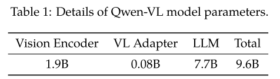
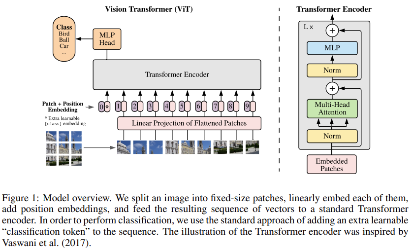
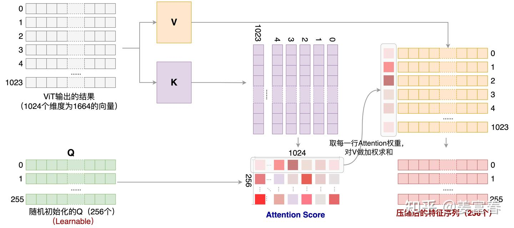
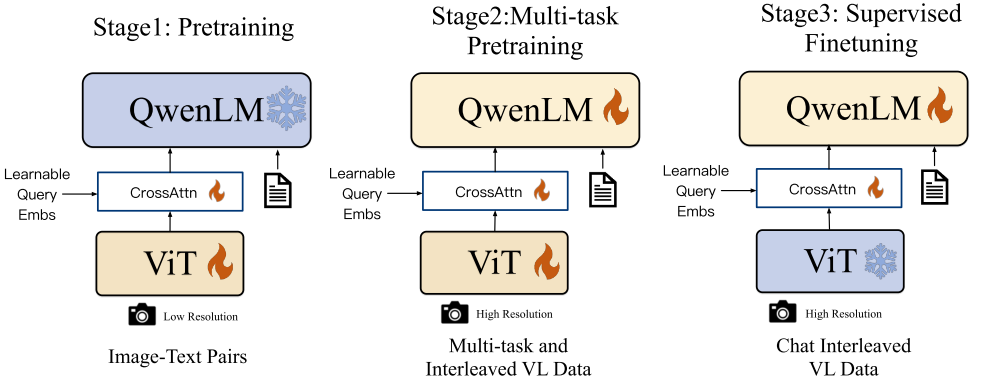
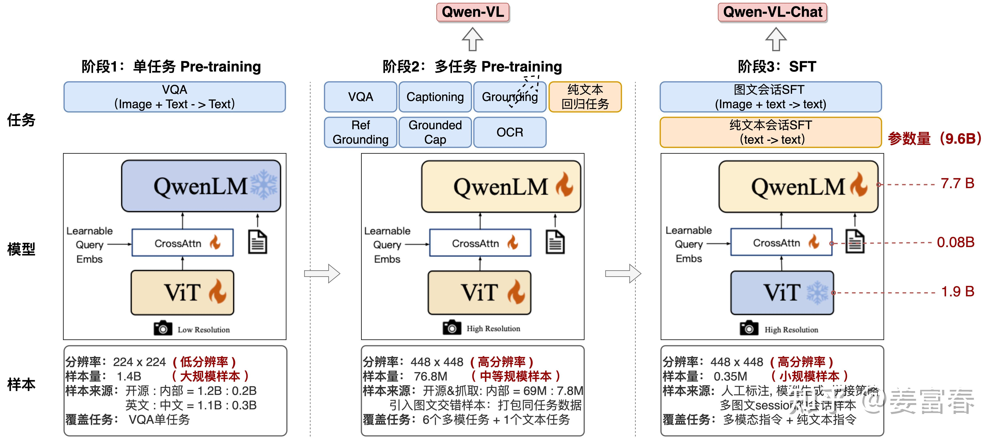
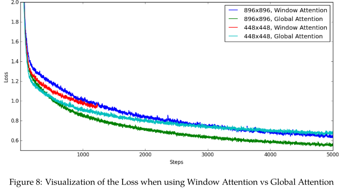
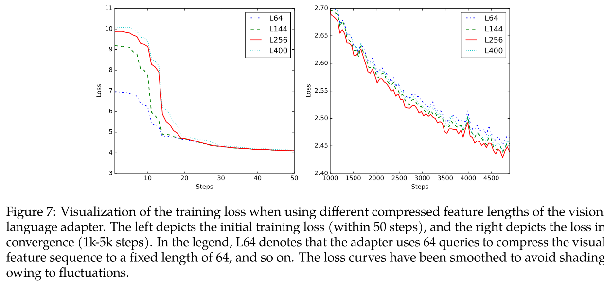

# Qwen-VL: A Versatile Vision-Language Model for Understanding, Localization, Text Reading, and Beyond

## 目录
- [模型结构](#模型结构)
  - [视觉编码器 (Vision Encoder)](#视觉编码器-vision-encoder)
  - [视觉语言适配器 (VL Adapter)](#视觉语言适配器-vl-adapter)
  - [文本编码器 (LLM)](#文本编码器-llm)
  - [核心机制：位置框与文本的统一编解码](#核心机制位置框与文本的统一编解码)
- [训练方面](#训练方面)
  - [第一阶段：预训练 (Pre-training)](#第一阶段预训练-pre-training)
  - [第二阶段：多任务预训练 (Multi-task Pre-training)](#第二阶段多任务预训练-multi-task-pre-training)
  - [第三阶段：指令微调 (Supervised Finetuning)](#第三阶段指令微调-supervised-finetuning)
- [消融实验](#消融实验)
  - [消融实验一：Global Attention vs Window Attention](#消融实验一global-attention-vs-window-attention)
  - [消融实验二：Number of Learnable Queries](#消融实验二number-of-learnable-queries)

## 模型结构

Qwen-VL模型结构主要包含三个部分，分别是**视觉编码器**，**视觉语言Adapter**，**文本编码器**。

### 视觉编码器 (Vision Encoder)
在Qwen-VL中，视觉编码器基于 Vision Transformer 架构，具体采用 OpenCLIP 的 ViT-bigG(iant) 预训练权重进行初始化。OpenCLIP 是 laion.ai(laion-5B) 组织的一个开源项目，是对 OpenAI 的 CLIP 模型的开源实现，ViT-bigG 是经过了 2B 的训练数据训练出来的 ViT 模型。

具体的图像处理为：
1. 图像被调整为固定分辨率（训练初期为 224×224，后续阶段提升至 448×448）[课程学习]；
2. 图像被分割为 14×14 像素的块（patches），每个块经过线性投影成为视觉特征向量；
3. 这些特征向量输入到 ViT 中进行编码，生成一组图像特征序列。

### 视觉语言适配器 (VL Adapter)
在Qwen-VL中，视觉语言Adapter的作用主要包括：
1. **图像特征压缩**：ViT输出的图像特征序列长度取决于分辨率，例如448×448分辨率下序列长度为 $(448/14)^2 = 1024$。适配器通过一组可学习的查询向量，通过跨注意力机制将长序列压缩为固定长度，大大降低后续语言模型的计算负担。
2. **特征筛选与增强**：Adapter通过注意力机制动态选择与当前任务最相关的视觉特征。

它的模型结构是一个**单层跨注意力 Cross Attention 模块**，以一组可训练的向量作为查询 (Query)，图像特征作为键值 (Key-Value)，通过跨注意力机制，将图像特征序列压缩为固定长度 256 的特征向量。另外，为了保留位置信息，在查询-键对中引入了 2D 绝对位置编码，以支持细粒度视觉理解 (如目标定位和文本阅读)。

> **思考：为什么 Cross Attention 可以压缩序列长度？**
> 
> 在 Cross Attention 机制中，输出序列的长度是由 **Query ($Q$)** 的长度决定的。在 Qwen-VL 的适配器中，$Q$ 是一组固定长度（256）的可学习向量（Learnable Queries），而图像特征作为 $K$ 和 $V$。无论输入的图像特征序列有多长（如 1024 个 token），经过 Cross Attention 计算后，输出的序列长度始终与 $Q$ 一致，即固定为 256。这种机制实现了从变长视觉特征到定长表征的压缩。

### 文本编码器 (LLM)
在Qwen-VL中，压缩后的图像特征与文本特征拼接后，输入到基于 QWEN-7B 的大型语言模型中进行跨模态理解和生成。Qwen-VL通过引入一组精心设计的特殊 token (如 ``, `<ref>`, `<box>`)，将图像、文本和空间位置信息统一编码为一个可被语言模型处理的序列，从而实现端到端的多模态理解与生成。

### 核心机制：位置框与文本的统一编解码

Qwen-VL 是早期将目标定位（Grounding）和视觉问答/对话统一到同一模型中的代表。前文介绍了 `<ref>` 和 `<box>` 等特殊 token，一个核心问题是：在纯文本 LLM 中，模型如何表达空间坐标 (X, Y)？

#### 1. 坐标的文本化与离散化 (Tokenization)

* 做法：Qwen-VL 没有引入连续的回归头部（如 YOLO/Faster R-CNN 中的检测头），而是将坐标完全文字化。
* 归一化：图像的宽和高归一化到 `[0, 1000]` 区间。
* 字符串表达：检测框由左上角和右下角 $(X_{min}, Y_{min}, X_{max}, Y_{max})$ 确定，表示为字符串 `"(Xmin,Ymin),(Xmax,Ymax)"`。
* 特殊 Token 的配合：
  * `<ref>` 和 `</ref>`：包裹被检测物体的文本描述。
  * `<box>` 和 `</box>`：包裹物体的坐标字符串。

#### 2. 输入输出示例

* 输入（Grounded Captioning 任务）：`"image_path</img>请找出图中的猫。"`
* 模型输出：`"图中有一只<ref>猫</ref><box>(210,350),(450,800)</box>。"`

> 设计要点：目标检测被转化为纯文本自回归生成任务（Next Token Prediction），无需修改 LLM 的解码结构。

## 训练方面

Qwen-VL的训练主要包括三个阶段，分别是 Pretraining、Multi-task Pretraining 和 Supervised Finetuning。

### 第一阶段：预训练 (Pre-training)
主要目标是**建立基础的视觉-语言关联**，训练出一个能看懂图片的模型底座。在这个阶段，数据用的是大规模、弱标注的网络图像-文本对，训练数据有 1.4B，英文数据占比 77.3%，中文占比 22.7%。**图像的分辨率是 224×224，冻结 LLM，只训练视觉编码器和视觉语言 Adapter。**

### 第二阶段：多任务预训练 (Multi-task Pre-training)
主要目标是**注入细粒度、多样性的理解能力**。在该阶段，数据用的是高质量、多任务标注数据。该阶段是个多任务的预训练阶段，包括 7 个任务，其中有 6 个 Vision 任务（包括 Captioning，VQA，grounding 等）和 1 个文本生成任务，这个阶段模型是全参数激活的。该阶段之所以引入文本生成任务，主要是为了保证模型的通用文本处理能力。**图像的分辨率是 448×448，解冻整个模型（LLM，ViT，适配器）。**

### 第三阶段：指令微调 (Supervised Finetuning)
主要目标是**对齐用户意图，掌握交互对话**。在这个阶段作者对数据做了一些数据增强，通过人工标注、模型生成和策略拼接等方式构造多模态的多轮对话数据，使用高质量的指令微调数据（35万条）。**在该阶段，冻结 ViT，微调 LLM 和适配器。**

## 消融实验

### 消融实验一：Global Attention vs Window Attention
在第二阶段训练中，图像分辨率从 224×224 提升到 448×448，ViT 的计算复杂度呈平方级增长。ViT 输出序列长度：224分辨率 -> 256 tokens；448分辨率 -> 1024 tokens，这导致了计算成本堪忧。

作者探索了 Global Attention 和 Window Attention，其中全局注意力中每个 token 都能看到所有其他 token，而窗口注意力的话大部分层只在局部窗口（如 224×224）内做 Attention，少数层做全局 Attention。

作者试验了四种配置：448x448+Global Attention、448x448+Window Attention、896x896+Global Attention 和 896x896+Window Attention。作者最终选择了 **448x448+Global Attention**，因为 448 分辨率下的全局注意力计算量仍在可控范围，并且窗口注意力带来不可接受的性能损失。

### 消融实验二：Number of Learnable Queries
我们知道视觉-语言适配器通过一组可学习查询向量压缩 ViT 的长序列，如果查询向量数量太少，可能丢失重要视觉信息。而查询向量数量太多，则计算成本高，训练困难。

作者测试了 64, 128, 256, 512, 1024 不同的查询数量，来观察训练初期损失和收敛后损失，最终选择了效果和数量最佳平衡的 **256 个查询数量**。

