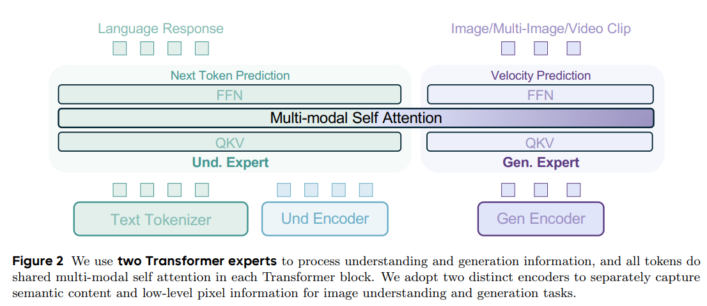

# BAGEL



> 字节 Seed 团队提出的统一多模态基础模型（*Emerging Properties in Unified Multimodal Pretraining*，arXiv:2505.14683）。本文档参考 Qwen-VL 系列笔记的写法，侧重讲清楚 BAGEL 的设计动机、架构、数据和训练流程。

## 目录
- [一、Abstract & Introduction](#一abstract--introduction)
- [二、为什么 BAGEL 不是 Emu3 那种统一方式](#二为什么-bagel-不是-emu3-那种统一方式)
- [三、模型设计空间](#三模型设计空间)
- [四、整体架构](#四整体架构)
  - [1. Qwen2.5 LLM Backbone](#1-qwen25-llm-backbone)
  - [2. 两条视觉通路](#2-两条视觉通路)
  - [3. 文本和视觉的预测目标不同](#3-文本和视觉的预测目标不同)
- [五、MoT：Mixture-of-Transformer-Experts](#五motmixture-of-transformer-experts)
- [六、广义因果注意力](#六广义因果注意力)
- [七、训练数据](#七训练数据)
  - [1. Text Only Data](#1-text-only-data)
  - [2. Vision-Text Paired Data](#2-vision-text-paired-data)
  - [3. Vision-Text Interleaved Data](#3-vision-text-interleaved-data)
  - [4. Reasoning-Enhanced Data](#4-reasoning-enhanced-data)
- [八、训练阶段](#八训练阶段)
- [九、与 Emu3 / Qwen-VL / 扩散模型的区别](#九与-emu3--qwen-vl--扩散模型的区别)
- [十、常见问题](#十常见问题)
- [附：本仓库相关代码](#附本仓库相关代码)

## 一、Abstract & Introduction

BAGEL 是一个 **decoder-only** 的统一多模态模型，原生支持多模态理解和多模态生成。它在包含文本、图像、视频和网页数据的大规模多模态语料上预训练，训练规模达到数万亿 tokens。在复杂多模态推理、图像生成、图像理解等 benchmark 上，BAGEL 显著优于其他开源统一模型，并具备自由形式图像操作、未来帧预测、3D 操作、世界导航等能力。

统一多模态理解与生成近年来很热，很多研究都在探索如何使用统一架构同时优化理解任务和生成任务。已有工作确实展示了 promising 的结果，但它们通常仍然依赖标准的图像-文本配对数据，例如一张图配一个 caption、一张图配一个问题答案。这类数据可以训练模型“看懂一张图”或“根据一句话生成一张图”，但很难让模型学会长上下文中的多步视觉推理。

开源学术模型与 GPT-4o、Gemini 2.0 这类闭源系统之间的差距，关键不只在模型结构，也在**精心构建的多模态交错数据**。交错数据会把文本、图像、视频帧和网页结构组织在同一条序列中，例如图文教程、百科页面、视频前后帧、图像编辑前后对。这样的数据更接近真实产品中的多模态输入，也更适合训练模型做跨图像、跨时间、跨文本段落的组合推理。

因此，BAGEL 的核心叙事可以概括为三点：

1. 用 Integrated Transformer 避免理解模块和生成模块之间的信息瓶颈。
2. 用 MoT 把理解参数和生成参数解耦，缓解 CE 与 flow MSE 之间的优化冲突。
3. 用大规模交错数据训练模型，让模型从长上下文中学习复杂多模态行为。

## 二、为什么 BAGEL 不是 Emu3 那种统一方式

Emu3 的统一思路更激进：把图像、文本、视频都离散化成 token，然后交给一个自回归语言模型统一做 next-token prediction。这种路线的好处是范式非常干净，所有东西都可以看成语言建模问题。

BAGEL 的统一方式不同。它没有强行把所有模态压成同一种离散 token，而是保留了理解和生成各自更合适的表示：

1. 理解侧使用 **SigLIP2 ViT**，把原始图像编码成连续语义特征，这和 Qwen-VL 系列的思路更接近。
2. 生成侧使用 **FLUX VAE latent + Rectified Flow**，在连续潜空间中预测 velocity，而不是逐个生成离散视觉 token。
3. 两条路径进入同一个 decoder-only 序列，并在每层通过 shared multi-modal self-attention 交互。

也就是说，BAGEL 的 unified 不体现在“一种 token、一种 loss”，而体现在**同一条交错序列、同一套注意力调度、同一个预训练管线**。理解和生成的参数可以分开，但它们仍然在同一个上下文里互相看见。

## 三、模型设计空间

统一多模态理解与生成模型大致有几条典型设计路线。

第一类是 **Quantized AR**。这类方法把文本和视觉都离散化，然后统一使用 next-token prediction。它实现直接，可以复用现有 LLM 训练框架，但在实践中视觉生成质量通常不如 diffusion/flow 模型，而且视觉 token 自回归生成会带来较高推理延迟。Emu3 就比较接近这条路线。

第二类是 **External Diffuser**。这种设计会把预训练 LLM 或 VLM 通过轻量 adapter 连接到 diffusion 模型。通常 LLM backbone 先自回归生成一组 latent token，作为 diffusion 模块的语义条件，然后 diffusion 模块再生成图像。这条路线收敛快、数据消耗少，在不少 benchmark 上也有竞争力。但问题是：LLM 的长上下文被压缩成少量 latent token 后，理解和生成之间会出现明显信息瓶颈，尤其不利于长上下文多模态推理。

第三类是 **Integrated Transformer**。它在单个 Transformer 中同时集成 LLM 的自回归理解能力和 diffusion/flow 的视觉生成能力。相比 External Diffuser，它训练成本更高，工程也更复杂，但优势是所有 Transformer block 中都保留完整上下文，理解与生成之间可以无损交互，更适合 scaling，也更适合作为后续强化学习或复杂多模态 agent 的基础模型。

BAGEL 最终选择 Integrated Transformer。其设计判断是：如果目标是构建统一基础模型，就不应该让长上下文信息在理解模块和生成模块之间被压缩掉。

## 四、整体架构

BAGEL 的整体结构可以理解为：**一个 decoder-only LLM 骨架，两条视觉输入通路，两个 Transformer expert，一套共享注意力**。

```text
文本 token / ViT token ──→ Understanding Expert ──→ Next Token Prediction
            │                         ↑
            └──── shared self-attn ───┤
VAE latent token ───────→ Generation Expert ─────→ Rectified Flow velocity
```

### 1. Qwen2.5 LLM Backbone

BAGEL 的 backbone 基于 **Qwen2.5 LLM** 初始化，而不是直接使用 Qwen2.5-VL。这个选择很关键：BAGEL 要自己接入理解视觉通路和生成视觉通路，因此使用的是纯 LLM 骨架，而不是现成 VLM。

Qwen2.5 本身采用 RMSNorm、SwiGLU、RoPE 和 GQA。BAGEL 在此基础上，又在每个注意力块中加入 **QK-Norm**。QK-Norm 在图像/视频生成模型中很常见，主要用于稳定训练，尤其是在 flow/diffusion 目标和大规模多模态数据混训时很有用。

### 2. 两条视觉通路

BAGEL 中的视觉信息有两个不同 encoder。

**第一条是理解通路。** 它使用 **SigLIP2-so400m/14** 作为 ViT 编码器，将原始像素转换为语义 token。该编码器经过修改，可以通过位置嵌入插值支持最高约 980×980 的输入，并集成 NaViT 来处理任意宽高比。ViT 输出后，会经过一个两层 MLP connector，把 ViT token 映射到 LLM hidden size。

这条通路负责“看懂图像”。它输出的是连续语义特征，不承担像素级重建任务。

**第二条是生成通路。** 它使用来自 FLUX 的预训练 VAE，把图像在像素空间和 latent 空间之间转换。这个 VAE 在训练期间是冻结的。图像生成时，模型不是直接生成像素，而是在 VAE latent 上做 Rectified Flow，然后再通过 VAE decode 回图像。

VAE token 进入 LLM backbone 前，会加 2D 位置编码。扩散/flow 的 timestep embedding 也会直接加到 VAE token 的初始 hidden states 上。这里没有使用更复杂的 AdaLN，而是用更直接的加法注入 timestep 条件。

### 3. 文本和视觉的预测目标不同

BAGEL 在同一个 decoder-only 框架里保留了两种训练目标：

1. 预测文本 token 时，遵循自回归语言模型的 **Next-Token Prediction**，使用 CE loss。
2. 预测视觉生成 token 时，采用 **Rectified Flow**，在 VAE latent 上预测 velocity，使用 MSE loss。

这也是 BAGEL 和“全 token 化 + 全 CE”路线的关键区别。它不是为了形式统一而牺牲视觉生成质量，而是在统一上下文中保留各模态更合适的建模方式。

## 五、MoT：Mixture-of-Transformer-Experts

在 Integrated Transformer 的前提下，BAGEL 对比过三种 Transformer 变体：Dense Transformer、MoE Transformer 和 MoT。

Dense 版本只有一套参数，需要同时承担理解和生成。MoE 版本只复制每个 block 中的 FFN，作为 generation expert。MoT 则更彻底：复制 Qwen2.5 LLM 的所有可训练 Transformer 参数，创建一个完整大小的 generation expert。

BAGEL 最终采用 **MoT**。它的硬路由规则很简单：

1. **Understanding Expert** 处理文本 token 和 ViT token。
2. **Generation Expert** 处理 VAE token，包括 noised VAE 和 clean VAE。

MoE 和 MoT 都会让总参数量接近 Dense baseline 的两倍，但由于每个 token 只会走其中一个 expert，训练和推理时的 FLOPs 与 Dense 版本基本相同。

在 1.5B Qwen2.5 LLM 上的消融实验表明，MoT 始终优于 Dense 和 MoE。差距在多模态生成任务上尤其明显：MoT 不仅收敛最快，而且最终 MSE loss 最低。理解任务的 CE loss 波动更大，但 MoT 通常也保持最好。

直觉上，理解和生成是两种不同优化目标：理解侧是文本 CE，生成侧是 flow MSE。它们可能会把参数推向不同区域。如果强行共用同一套参数，模型容易在两类目标之间互相拉扯。MoT 通过给生成单独分配完整 Transformer expert，缓解了这种冲突；同时又通过共享 attention 保持跨模态上下文交互。

## 六、广义因果注意力

BAGEL 的输入序列里会交错出现文本、ViT token 和 VAE token。如果简单使用标准 causal attention，会不适合视觉 token，因为一张图内部的 token 理论上应该彼此双向可见；但如果完全双向，又会造成生成时的信息泄漏。因此 BAGEL 设计了 **Generalized Causal Attention**。

它的基本思路是：先把同一样本内的 token 切成多个连续片段，每个片段只包含单一模态，例如一段文本、一组 ViT token、一组 VAE token。

注意力规则如下：

1. 跨片段时，当前片段可以关注所有之前片段，不能看未来片段。
2. 在文本片段内部，仍然使用标准 causal attention。
3. 在视觉片段内部，无论 ViT 还是 VAE，都使用双向 attention，让同一张图内部 token 充分交互。

在交错多模态生成样本中，每一张图会准备三组视觉 token：

1. **Noised VAE token**：加入 flow/扩散噪声的 latent，用于 Rectified Flow 训练和 MSE loss。
2. **Clean VAE token**：原始无噪声 latent，用作后续图像或文本生成的条件。
3. **ViT token**：来自 SigLIP2，用于提供语义理解信息，也能提升交错生成质量。

这里有一个关键可见性约束：后续图像或文本 token 可以看之前图像的 clean VAE token 和 ViT token，但不能看之前图像的 noised VAE token。否则模型可能通过带噪 token 泄漏训练目标信息。

对于多图像或视频片段生成，BAGEL 还使用了 **diffusion forcing**。简单理解，就是让每一帧/每一张图可以处在不同噪声状态，并把当前图像的状态建立在之前图像状态之上。为了增强连续图像之间的一致性，训练时还会随机把连续图像分组，并在组内使用 full attention。

工程上，广义因果注意力使用 PyTorch **FlexAttention** 实现，比朴素 SDPA 更高效。推理时，模型可以缓存已经生成的 clean VAE token 和 ViT token 的 KV cache。当一张图完全生成后，上下文中对应的 noised VAE token 会被去噪后的 clean VAE 块替换，从而加速后续多模态解码。

为了支持交错推理中的 classifier-free guidance，训练时会随机丢弃条件 token：文本 dropout 概率为 0.1，ViT 为 0.5，clean VAE 为 0.1。

## 七、训练数据

BAGEL 的数据体系不只包含标准 VLM、T2I 和 LLM 数据。其中最重要的是从 Web 和视频源构建视觉-文本交错数据，以增强模型的顺序多模态推理能力。

### 1. Text Only Data

纯文本数据用于维持底层 LLM 的语言建模能力。因为 BAGEL 是从 Qwen2.5 LLM 初始化的，如果训练中完全被多模态数据主导，可能会损伤原有语言能力。因此训练语料中保留了高质量纯文本数据，用于支持通用语言理解、推理和生成。

### 2. Vision-Text Paired Data

图文配对数据提供基础视觉监督，主要分成 VLM 图文对和 T2I 图文对。

VLM 图文对用于训练多模态理解，来源包括网页 alt-text、caption 等。为了保证质量和多样性，数据会经过 CLIP 相似度、分辨率、宽高比、文本长度、去重等过滤，并使用 concept-aware sampling 来缓解长尾问题，提高稀有类别覆盖。除此之外，数据中还包含 OCR 文档、图表和基础标注等结构化监督，用来增强模型的阅读和空间理解能力。

T2I 图文对用于图像生成训练，包含高质量图像-文本对，以及少量来自 SD3、FLUX.1-dev 等现有 T2I 模型的合成数据。这类数据强调 caption 风格多样，例如艺术性描述、细致描述、超现实描述等，也通过过滤保证图像清晰度、结构完整性和语义多样性。

图文配对数据很重要，但它的局限也明显：它主要教模型“一张图对应一段文本”，不足以训练跨多图、多文本段落的上下文推理。

### 3. Vision-Text Interleaved Data

交错数据是 BAGEL 的核心数据增量。仅依赖图文配对数据训练的模型，往往难以捕捉跨模态、跨时间、跨图像的视觉与语义关系，生成内容的连贯性也较差。因此 BAGEL 在训练中整合大规模视觉-文本交错数据。

交错数据主要来自两个方向：视频和网页。

**视频数据**提供时间和空间动态，包含像素级、概念级、时间级和物理级连续性。这类数据对于未来帧预测、图像编辑、导航、3D 操作等任务尤其有价值。BAGEL 使用公开在线视频资源，也使用 Koala36M 和 MVImgNet2.0 等开源数据集。Koala36M 提供大量指令性和交互性内容，MVImgNet2.0 包含不同视角下的对象图像，有助于多视角空间理解。

视频交错数据构建时，会先做视频预处理和质量过滤，包括时间分割、空间裁剪和质量过滤。之后从视频片段中平均采样约 4 帧，并为连续帧之间生成视觉变化文本描述。这些描述捕捉对象运动、动作转换和场景变化，作为学习视觉动态的时间监督。为了降低成本，数据构建采用基于 Qwen2.5-VL-7B 蒸馏的轻量字幕模型生成帧间 caption，并把 caption 长度限制在 30 token 内以减少幻觉。最终得到约 **4500 万** 个时间交错序列。

**网页数据**提供复杂真实世界多模态结构和广泛领域知识，例如图文并茂的百科文章、逐步视觉教程等。这种自然交错格式可以为模型训练多模态推理提供丰富监督信号。BAGEL 的网页数据基于 OmniCorpus，这是一个预处理过的 Common Crawl 网页集合。

网页文档会经过两阶段过滤。第一阶段是轻量主题选择，用于筛掉明显无关或质量差的数据；第二阶段使用 Qwen2.5-14B 做更精细的 LLM 分类过滤，筛选出文本和图像语义强对齐的文档，例如教程和百科条目。之后还会用规则过滤图像清晰度、相关性和文档结构。

网页交错数据还有一个重要策略：**字幕优先**。对于每张图片，会用 Qwen2.5-VL-7B 生成简洁描述，并把这个描述直接插入图像之前，作为生成图像前的概念支架。这样模型在生成图像前，可以先通过上下文和插入 caption 形成一个概念草稿。对于超过 300 token 的图间文本段，会用 LLM 摘要器重写，以提高上下文密度。最终构建约 **2000 万** 个结构化网页交错文档。

### 4. Reasoning-Enhanced Data

除了通用交错数据，BAGEL 还构建了约 **50 万** 个推理增强样本，用于促进多模态推理。核心假设是：在图像生成之前引入语言推理步骤，可以帮助模型澄清视觉目标、改进规划，从而生成更符合意图的图像。

T2I 推理增强数据的构建方式是：先人工创建简短、模糊的 T2I 查询和生成指南，再使用 Qwen2.5-72B 扩展出更多 query-guide 对和详细 prompt，最后通过 FLUX.1-dev 生成目标图像。训练样本由 query、推理轨迹和图像三部分组成。

自由形式图像操纵数据则通过 VLM 结合 DeepSeek-R1 的推理轨迹示例来生成。源图像和目标图像对主要来自 OmniEdit 等开源编辑数据集，以及前面构建的视频交错数据。这类数据用于训练模型根据复杂自然语言要求完成图像编辑，而不是只做简单局部替换。

概念编辑数据面向更高级的编辑任务。它不是简单改颜色、换背景，而是要求模型理解输入输出图像之间的概念变化。数据从网页交错样本中采样图像对，并通过三阶段 VLM 流程构建高质量 QA 示例：先识别输入-输出对，再生成对应文本问题，最后评估问题质量和图像对齐程度，并结合 DeepSeek-R1 风格示例生成解释。

## 八、训练阶段

BAGEL 使用多阶段训练，每个阶段目标不同。

### 1. Alignment 阶段

第一阶段的目标是把 SigLIP2 ViT 编码器和 Qwen2.5 LLM 对齐。这个阶段只训练两层 MLP connector，视觉编码器和语言模型都保持冻结。

训练数据只使用图像-文本配对数据。图像 resize 到固定的 378×378 分辨率，以匹配 SigLIP2 的输入设置。该阶段训练规模约 **4.9B tokens**。它的作用类似“接线”：先让视觉 token 能进入 LLM hidden space，而不是一开始就全模型大规模混训。

### 2. Pre-training (PT) 阶段

第二阶段是大规模统一预训练。除 VAE 外，所有模型参数都可训练，同时在 LLM 中加入 QK-Norm。

数据包括纯文本、图文配对、多模态对话、网页交错和视频交错数据。图像采用原生分辨率策略，但会对最大长边和最小短边做限制，避免过高分辨率导致计算不可控。该阶段训练规模约 **2.5T tokens**。

### 3. Continued Training (CT) 阶段

第三阶段继续训练模型，重点是提高视觉输入分辨率，并进一步强化跨模态推理。这个阶段仍然训练除 VAE 外的所有参数。

数据源仍然包含多种类型，但采样策略会提高交错数据比例。视觉输入分辨率也会提升，这对多模态理解和生成都很重要：理解侧需要更细粒度视觉信息，生成侧也需要更高质量的空间条件。该阶段训练规模约 **2.6T tokens**。

### 4. Supervised Fine-tuning (SFT) 阶段

最后是高质量监督微调。生成侧从图像-文本配对和交错生成数据中构建高质量子集；理解侧从 LLaVA-OV、Mammoth-VL 等指令微调数据中过滤子集。总训练规模约 **72.7B tokens**。

整个训练过程中，VAE 始终冻结。模型主要学习的是 Qwen2.5 LLM backbone、ViT connector、MoT generation expert，以及复杂广义因果注意力下的跨模态交互。

## 九、与 Emu3 / Qwen-VL / 扩散模型的区别

BAGEL、Emu3、Qwen-VL 和传统扩散模型都涉及多模态，但关注点不同。

Emu3 的重点是用离散 token 和单一 LM 统一所有模态。它的结构更干净，但视觉生成质量和自回归视觉 token 的推理延迟是主要挑战。

Qwen-VL 系列主要是视觉理解模型。它使用 ViT 作为视觉编码器，把视觉特征接入 LLM，重点解决图像理解、OCR、grounding、视频理解等任务。它通常不把高质量图像生成作为主路径。

传统扩散模型如 SD、FLUX，擅长图像生成，但它们通常和 LLM 推理模块分离。即使使用文本 encoder 或外部 LLM 条件，也容易出现语言推理和视觉生成之间的信息瓶颈。

BAGEL 的位置介于这些路线之间：它使用 ViT 保留理解能力，用 VAE + flow 保留高质量生成能力，再通过 MoT 和共享注意力把两者放到同一个长上下文序列中。

一句话记忆：

- **Emu3**：一种 token，一个大脑，全靠 CE。
- **Qwen-VL**：视觉理解为主，一个大脑 primarily 用来懂。
- **FLUX/SD**：生成很强，但通常和 LLM 推理分离。
- **BAGEL**：两种眼睛、两个专家，但在同一个注意力上下文里开会。

## 十、常见问题

**BAGEL 算 unified model 吗？**

算。统一在交错序列、共享注意力和同一训练管线；不统一在视觉表示和 loss。它有意保留 ViT + CE 与 VAE + flow 两条不同路径。

**为什么不用 Emu3 那种离散视觉 token？**

因为理解和生成对视觉表示的要求不同。理解更需要语义级连续 ViT 特征，生成更需要高质量连续 latent 空间。强行用一种离散表示统一两者，可能会在生成质量或理解能力上妥协。

**MoT 和 MoE 差在哪？**

MoE 只复制 FFN，MoT 复制完整 Transformer expert，包括 QKV 和 FFN 等可训练参数。消融实验表明，生成任务从完整 expert 中受益更明显。

**BAGEL 的主要代价是什么？**

架构和训练都更复杂：它有双视觉通路、双 expert、三类视觉 token、广义因果注意力、自定义 mask、多阶段训练和大规模交错数据。推理时生成侧还需要 flow 采样和 VAE decode。

## 附：本仓库相关代码

`flow_grpo/flow_grpo/bagel/` 下有 `Bagel`、`BagelConfig`、Qwen2/NaViT/SigLIP、FLUX AE 等实现，可与上文架构对照阅读。
