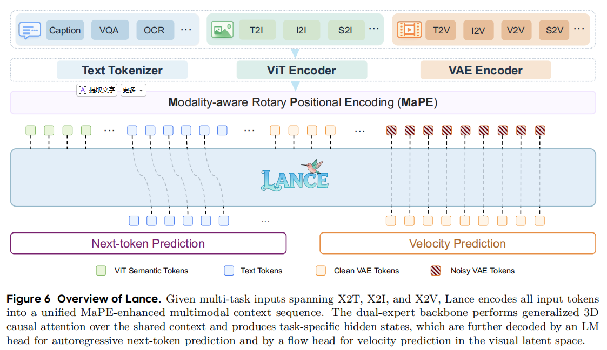
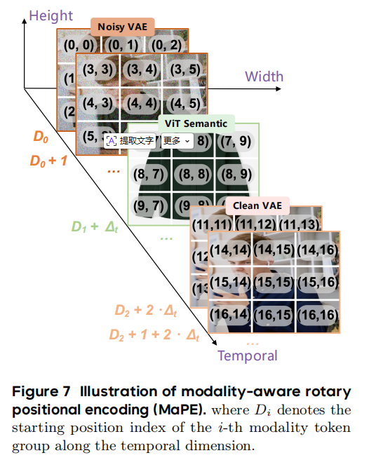

## 目录

- [一、统一多模态模型的范式分类与核心瓶颈](#一统一多模态模型的范式分类与核心瓶颈)
  - [1.1 原生统一范式](#11-原生统一范式)
  - [1.2 视觉表征冲突](#12-视觉表征冲突)
  - [1.3 任务覆盖与训练范式局限](#13-任务覆盖与训练范式局限)
- [二、核心概念：交错多模态数据](#二核心概念交错多模态数据)
  - [2.1 交错序列](#21-交错序列)
  - [2.2 多任务协同增效](#22-多任务协同增效)
- [三、核心架构：双流专家与位置编码](#三核心架构双流专家与位置编码)
  - [3.1 架构总览](#31-架构总览)
  - [3.2 专家解耦通路](#32-专家解耦通路)
  - [3.3 广义三维因果注意力](#33-广义三维因果注意力)
  - [3.4 模态感知旋转位置编码（MaPE）](#34-模态感知旋转位置编码mape)

---

## 一、统一多模态模型的范式分类与核心瓶颈

多模态智能正在走向**原生统一(Native Unified)范式**：在同一框架内同时完成理解、推理与生成。与此同时，大语言模型驱动的多模态大语言模型(Multimodal Large Language Models, MLLMs)已在图像与视频理解上成为主流—— **典型做法遵循LLaVA路线：视觉输入先经视觉编码器(SigLIP、CLIP等)编码，再与文本token拼接，由语言模型解码器联合建模。** Flamingo、InstructBLIP，以及开源的LLaVA、Qwen-VL、InternVL等家族，在指令跟随、高分辨率感知与长上下文多模态推理上进展显著；GPT、Gemini等闭源系统也展现出很强的多模态推理能力。近年工作进一步扩展到图文交错建模与视频理解。

但这类系统的主优化目标仍是理解与文本生成，而非原生视觉合成(Native Visual Synthesis)。视觉生成长期由扩散(Diffusion)与流匹配(Flow Matching)主导，在图像与视频高保真合成上更有效。于是，统一多模态模型(Unified Multimodal Models, UMMs)成为新的中心议题：能否在单一框架内桥接多模态理解与视觉生成。下文先梳理现有UMM的主要类别，再归纳其共性瓶颈。

### 1.1 原生统一范式

原生统一指在同一预训练流程中联合优化理解与生成。近年文献进展可观，但多数仍围绕图像-文本域或部分任务组合展开；按建模方式可再分为两条主线。

#### （1）完全自回归(Fully Autoregressive)

这类路线的目标是：在进模型之前，把模态差异尽量「压平」——一切输入最终都变成同一套离散符号，模型内部只做「上一个token→下一个token」。

 **统一Tokenizer。通常会单独训练或采用一个视觉Tokenizer(多为VQ-VAE、VQ-GAN一类)，把图像/视频帧量化为视觉离散token；再与文本Tokenizer的词表合并(或共享扩展词表)，形成大一统词表。** 于是：

- 文本→BPE/SentencePiece等得到的文本token；
- 图像、视频→视觉Tokenizer得到的视觉token(常带分辨率、时空位置等结构符号)；
- 少量特殊控制符(起止符、换行、任务标记等)一并编入同一序列。

Chameleon将图像与文本Tokenizer合并；Emu3/Emu3.5用视觉VQ把像素压成codebook索引；TokenFlow、HunyuanImage 3.0等也沿「离散视觉token+扩词表」思路，把理解侧读入的视觉与生成侧要写的视觉都收进同一符号系统。

**统一训练范式。骨干多为decoder-only Transformer(本质仍是Llama类LM)。训练目标只有一套：在图文/图视频交错序列上做Next-token Prediction，损失为交叉熵(CE)——理解任务等价于「给定前文(含视觉token)预测答案文本」，生成任务等价于「给定文本条件自回归续写视觉token」，不另设扩散噪声预测或Flow速度场。数据形态上，caption、VQA、T2I、图文交错文档都可排成一条长序列，用同一预训练管线混合喂入。**

- 代表：Chameleon、Emu3/Emu3.5、TokenFlow、HunyuanImage 3.0等。
- 优点：接口与工程栈极简(接近纯LM)，天然支持图文/多图交错序列建模，推理形式统一。
- 局限：视觉离散化粒度、codebook容量与自回归步数直接影响保真度与速度；在推理能力、视觉保真度与生成效率之间往往存在明显权衡(Trilemma)；生成时需逐个预测大量视觉token，推理延迟通常高于连续潜空间+少步采样的扩散/Flow路线。

#### （2）自回归–扩散/流匹配混合(Autoregressive–Diffusion/Flow Hybrid)

这类路线不强行把图像/视频也离散成「下一个视觉token」，而是承认：**语言适合自回归，高保真视觉合成更适合在连续潜空间里做扩散或Flow Matching。统一体现在同一条交错上下文、同一套注意力；不统一体现在编码器与损失各用其长。**

理解侧：AR+文本生成。文本指令、问题、待生成描述等走语言模型熟悉的Next-token Prediction，损失为交叉熵(CE)。条件视觉(给模型「看」的图/视频)通常经ViT或类似语义编码器变成连续语义token，与文本拼进decoder-only序列，用于Caption、VQA、OCR、视频问答等——输出仍是文本token的续写。

生成侧：Diffusion/Flow+图像与视频。待生成或待编辑的视觉不逐token自回归，而是经预训练VAE(图像多为2D VAE，如FLUX、SD系；视频常用带时间维的3D因果VAE，如Wan、CogVideoX系)压到连续潜变量，再在潜空间上预测噪声/速度场：

- 扩散(Diffusion)：学习去噪分数或噪声预测，多步采样还原像素；
- 流匹配(Flow Matching)/Rectified Flow：学习速度场(velocity)，往往可用更少步数从噪声推到数据流形。

T2I、I2I、T2V、I2V、编辑等任务中，文本与语义视觉token提供条件，干净或加噪的VAE latent token承载生成目标；语言路径负责「说什么、改什么」，生成路径负责「画出像素/帧」。

统一训练范式。样本仍排成图文/图视频交错序列，在共享Transformer里做联合前向；但优化目标通常是两套并按token类型路由：

- 落在文本与语义视觉token上→CE(理解、文本续写)；
- 落在VAE latent token上→MSE类损失(预测velocity或噪声，视具体Flow/扩散 formulation而定)。

因此不是「一种token、一种loss」，而是「一种上下文、两种监督」。Transfusion在单一Transformer里混训文本与连续图像patch；Show-o/Show-o2把AR语言建模与Flow Matching结合并扩展到视频；BLIP3-o、BAGEL、Lance等则普遍采用双流专家或模块解耦，减轻CE与Flow梯度在同一参数上的拉扯，同时保留跨模态全注意力交互。

- 代表：Transfusion、Show-o/Show-o2、BLIP3-o、BAGEL、Lance等。
- 进一步分化：Janus系列区分理解用与生成用视觉编码；RealGeneral借预训练视频基础模型做统一图像生成与编辑；Show-o2强调图+视频原生统一；BAGEL在共享decoder-only骨干上做专家特化(Expert Specialization)；TUNA押注统一连续视觉表示；InternVL-U以强开源MLLM耦合专用生成头。
- 相对全自回归：生成保真度与采样效率通常更好，架构与训练更复杂(双编码、双损失、掩码/专家路由等)。

小结：原生统一是当前主战场；Lance亦属AR+Flow混合一脉，并在此基础上强调全任务谱系下的多任务协同(见后文动机)。

### 1.2 视觉表征冲突

即便进入原生统一，第一个根本性限制仍是视觉表征需求的不对齐(Representation Mismatch)：

| 任务侧 | 需要什么 | 典型编码 |
| :--- | :--- | :--- |
| 理解 | 与语言对齐的高层语义特征 | ViT语义token(Qwen2.5-VL、SigLIP等) |
| 生成/编辑 | 保留纹理、几何与时序动态的低层连续表征 | VAE/3D VAE潜变量(Wan、FLUX等) |

现有工作大致沿两个方向应对：

1. 统一视觉表示：用同一套表示同时服务理解与生成，建模形式更简单，但常难以在语义推理与生成质量之间取得平衡。
2. 解耦视觉表示：语义特征与生成潜变量分开编码，再在共享序列或共享注意力中交互——缓解表征冲突，但架构与优化复杂度上升。

部分研究也指出，语义特征对生成建模并非无用；因此在「表示解耦」与「上下文统一」之间如何取舍，成为混合流派的核心设计点之一。

### 1.3 任务覆盖与训练范式局限

第二个限制在于任务覆盖范围与训练范式(Training Formulation)：

- 多数先前方法(Chameleon、LWM、SEED-X、TokenFlow、Janus等)仍主要局限于图文域或部分任务组合，图像-视频理解与生成的完整空间尚未被充分探索。
- 虽已有工作(BAGEL、Show-o、TUNA等)逐步扩展到视频，但通常只覆盖全任务空间的一个子集；编辑、主体驱动生成等多样生成任务，往往作为下游微调技能引入，而非在统一多任务预训练中被系统化优化。
- 对比研究表明：任务覆盖更广的模型，更可能在未见任务上表现出涌现泛化(Emergent Generalization)。因此，多任务学习不应被理解为简单的能力拼接(Capability Aggregation)，而应视为促进跨模态、跨任务知识迁移(Transfer)的机制。

上述两点——表征冲突与任务/训练碎片化——共同构成当前统一多模态建模的主要瓶颈，也为后文Lance在交错数据、双流专家与分阶段多任务训练上的设计提供动机。

---

## 二、核心概念：交错多模态数据

在近期的多模态大模型(尤其是统一理解与生成的UMM)里，**交错输入(Interleaved Inputs)与多模态交错数据(Interleaved Multimodal Data)是高频核心概念。**直观理解：它更像人写网页、博客或聊天记录——文本、图片、视频按叙事顺序穿插在一起，再作为一条序列交给模型，而不是永远拆成「一张图配一句caption」的刚性配对。

### 2.1 交错序列

#### 与传统配对数据的区别

传统严格对齐数据(Paired Data)往往是「一对一、格式固定」：

- 文生图(T2I)：`[一段文本prompt]` → `[一张要生成的图]`
- 图/视频问答：`[一个视频/图像文件]` + `[一句问题]` → `[一段答案文本]`

每条样本里模态数量与先后顺序基本被数据集格式写死，模型学到的是「给定固定槽位里的 A，输出 B」。

交错多模态数据(Interleaved Data)则允许文本与视觉在一条样本内任意穿插：哪一段是字、哪一段是图、哪一段是视频，以及各出现几次，都可以随任务与叙事变化。训练时会被编码成「文本token块 + 视觉token块」交替排列的长序列(具体是离散视觉token，还是ViT/VAE连续token，取决于模型范式，见第一章)。

#### 例子一：日记式图文视频交错(理解与对话)

下面是一段典型的「人话」式输入，文本与视觉交替出现：

> 今天天气真好，我去了海边：[图片1：沙滩]。在沙滩上我看到了一只小狗在奔跑：[视频1：小狗奔跑]。到了晚上，落日特别美：[图片2：夕阳]。你觉得我今天过得怎么样？

阅读顺序是：文本 → 图片1 → 文本 → 视频1 → 文本 → 图片2 → 文本提问。模型若只见过「整图+整段caption」配对，很难学会：小狗出现在哪张图对应的海滩语境里、夕阳与「到了晚上」如何对齐、最后一问需要综合前文所有片段。交错序列把跨片段指代、时间顺序、多图多视频组合推理写进同一条上下文，更接近真实产品里的多轮、多素材输入。

#### 例子二：参考图+视频的条件编辑(生成/编辑)

交错并不只服务于「聊天式理解」，复杂编辑同样依赖多段视觉嵌在指令里：

> 参考这张网图：[图片1：一件酷炫的夏威夷衬衫]。请帮我把这段视频[视频1：一个穿着粉色衬衫的男人在喝咖啡]里面男人的衬衫，改成图里那种夏威夷衬衫，并保持动作自然连贯。

这里同时出现「样式参考图」与「待改视频」，中间穿插自然语言说明改什么、保什么。模型需要在同一上下文里对齐：图1的纹理/款式 → 视频1中的人物区域与时序一致性。若拆成两个独立配对样本(一张图一个caption、一个视频一个caption)，条件关系会被打断；交错序列则把多源条件与生成目标绑在一次前向里。

#### 和Lance式训练的关系(序列里有什么)

**在Lance等AR+Flow混合UMM中，交错样本进入模型前通常会被展开为更细粒度的token组(见第三章)，例如：文本指令、ViT语义token(看懂条件)、Clean VAE token(干净参考/目标)、Noisy VAE token(生成路径上的噪声状态)等同屏混排。对用户而言是「图文视频穿插」；对模型而言是「多种功能角色的token在同一条序列里按因果与注意力规则互相看见」** 这也是第一章所说「上下文统一、表示可解耦」在数据层的落点。

### 2.2 多任务协同增效

交错数据若仅理解为「把多种数据集拼在一起」，容易退化成能力拼接；Lance强调的Multi-Task Synergy，是指在同一交错格式与同一训练范式下，让理解、生成、编辑、主体驱动等任务共享上下文机制，从而带来正向迁移。

- 理解任务提供的交错样本(多图教程、百科式页面、带图对话)教会模型在长上下文中定位与指代视觉实体。
- 生成/编辑任务把「条件视觉 + 文本意图 + 待生成视觉」排在同序列里，迫使模型在语义token与VAE latent token之间建立可迁移的对齐。
- 当编辑、视频编辑、主体驱动等与T2I、VQA等一起在预训练/持续训练阶段按渐进比例混合时，模型更像在学习「如何在交错上下文里切换任务」，而不是为每个技能单独训一个小适配器。

因此，交错多模态数据既是数据组织形式(打破图文对限制)，也是Lance应对第一章「任务覆盖窄、编辑只敢放微调」的钥匙：用更贴近真实场景的序列，支撑全谱系任务在同一原生框架里被系统化优化。

---

## 三、核心架构：双流专家与位置编码

**Lance建立在两个原则之上：统一上下文学习(unified context learning)与解耦能力路径(decoupled capability pathways)。前者靠交错多模态序列与多任务协同优化，让理解、生成、编辑在同一上下文里交互；后者则来自三条观察——语言/理解适合自回归，高保真图视频合成适合连续潜空间上的Flow Matching；语义ViT与生成VAE不宜强行合一；完全共享的单流骨干会让CE与Flow在同一参数上互相抢梯度，因而需要专家分流但注意力仍共享。**

上图概括了从多任务输入到双头输出的全流程： **Caption/VQA走理解，T2I/V2V等走生成，底层则经三条编码轨汇入MaPE增强的共享交错序列，再进双流MoE骨干，最后分别由LM头与Flow头监督**

### 3.1 架构总览

#### 统一上下文学习(Unified Context Learning)

- Lance首先将异构输入转换为共享的交错多模态序列。

- 文本指令使用Qwen2.5-VL的语言嵌入层进行嵌入。

- 对于面向理解的视觉输入，Lance采用Qwen2.5-VL的ViT编码器：14×空间与2×时间分块(patching)，再进行2×2空间合并，得到紧凑的语义视觉token。这些token为多模态理解与推理提供与语言对齐的视觉语义。

- 对于面向生成的视觉输入，使用Wan2.2的3D因果VAE编码器(3D causal VAE encoder)将图像或视频编码为连续隐式表征。该编码器通过统一隐空间同时支持图像与视频；对视频而言，空间下采样为16×、时间下采样为4×。所得隐特征保留高保真生成所需的低层外观与时空结构，并经轻量级MLP连接器(connector)投影到生成骨干网络的隐层空间。

#### 输入编码层：多轨输入

顶层任务覆盖X2T、X2I、X2V等——图像/视频的理解(Caption、VQA、OCR)、生成(T2I、T2V)、编辑(I2I、V2V)等。为配合后文「理解」与「生成」解耦，同一条用户可见的交错句子，在入模前会按片段角色走不同编码器：

| 编码器 | 产出 | 角色 |
| :--- | :--- | :--- |
| Text Tokenizer(文本分词器) | Text Tokens(蓝色) | 指令、问题、待生成描述 |
| ViT Encoder(视觉Transformer编码器) | ViT Semantic Tokens(绿色) | 高层语义，供多模态理解与推理 |
| VAE Encoder(变分自编码器，Wan2.2 3D因果VAE等) | Clean VAE Tokens(黄色)、Noisy VAE Tokens(斜线) | 低层物理潜变量：干净条件 vs 加噪生成靶 |

各模态块常用起止符包裹(如文本`[BOT, T, EOT]`、视觉`[BOV, V, EOV]`)，便于在序列里定位一段条件或目标；编码细节见上一小节。

#### 核心枢纽：共享交错序列与MaPE(详见3.4)

三类异构token在长度维上拼接为一条Shared Interleaved Sequence，再送入骨干。若仅用传统3D-RoPE，不同功能却占据相近时空坐标的token会「撞车」(见3.4)；MaPE在保留各图/视频内部(h,w,t)结构的同时，沿时间轴给不同模态组加固定偏移，相当于给每种token发带功能标签的「座位表」。

#### 主干与双流输出(详见3.2–3.3)

中间Lance Backbone为基于Qwen2.5-VL初始化的双流混合专家(Dual-stream MoE)，用广义3D因果注意力(见3.3)处理统一序列。前向结束后隐状态分两路：

- 路径A：Next-token Prediction(理解流)——文本(及理解侧监督)隐状态 → LM头 → CE；用于Caption、VQA、OCR等。
- 路径B：Velocity Prediction(生成/编辑流)——VAE latent隐状态 → LLM-to-VAE连接器 → Flow头 → 在视觉潜空间预测速度场，逐步去噪；用于T2I、T2V及复杂编辑。

#### 实例一：第二章「海边日记」在理解任务下如何编码(仅Text+ViT)

用户输入(第二章例子一)可切成7个片段，理解任务只需「看懂」，故原视频/图走ViT，不走VAE：

1. 「今天天气真好，我去了海边：」→ Text Tokenizer → 文本token段1。
2. [图片1：沙滩] → ViT Encoder → 14×空间下采样+2×2 merge的ViT语义token(沙滩、大海、晴天等)，外加视觉块起止符；不经VAE。
3. 「在沙滩上我看到了一只小狗在奔跑：」→ Text Tokenizer → 文本token段2。
4. [视频1：小狗奔跑] → ViT Encoder → 带时间维patch的ViT语义token(动物、奔跑等运动线索)；仍不经VAE。
5. 「到了晚上，落日特别美：」→ Text Tokenizer → 文本token段3。
6. [图片2：夕阳] → ViT → ViT语义token段3(黄昏、晚霞)。
7. 「你觉得我今天过得怎么样？」→ Text Tokenizer → 文本token段4，作为结尾提示，模型自回归续写答案文本。

底层序列形态近似：`文本块1 ⊕ ViT块1 ⊕ 文本块2 ⊕ ViT块2 ⊕ …`，全部由理解专家$\mathrm{LLM}_{\mathrm{UND}}$主处理，优化目标为Next-token Prediction。

#### 实例二：夏威夷衬衫视频编辑( Text+ViT+VAE 全员上阵)

指令(第二章例子二)：

> 参考这张网图：[图片1：一件酷炫的夏威夷衬衫]。请帮我把这段视频[视频1：一个穿着粉色衬衫的男人在喝咖啡]里面男人的衬衫，改成图里那种夏威夷衬衫，并保持动作自然连贯。

输出目标是新视频(编辑结果)，而非纯文本，因此三个编码器协同工作。拼入骨干前的逻辑序列可写为：

`[文本块1] ⊕ [ViT块：参考图] ⊕ [文本块2] ⊕ [ViT块：原视频语义] ⊕ [Clean VAE块：原视频物理条件] ⊕ [Noisy VAE块：加噪生成靶]`

各段分工：

- 首尾自然语言(「参考这张网图…」「…保持动作自然连贯」) → Text Tokens，承载「改什么、保什么」的指令逻辑。
- [图片1] → 仅ViT语义token：红底、椰子树图案、短袖等风格语义，供生成路径对齐外观。
- [视频1] 双层拆解：
  - ViT语义token：宏观理解「有人、喝咖啡、动作」；
  - VAE物理流(关键)：Wan2.2 3D因果VAE提取
    - Clean VAE Tokens：像素级脸、杯子、背景纹理与原运动动力学，作为尽量不变的条件；
    - Noisy VAE Tokens：在原视频latent框架上注入噪声，作为Flow Matching要去噪的靶，编辑后衬衫替换而人脸与杯子尽量不变。

该样本由双流共同看见同一序列：LLM_understand仍可能参与条件文本/语义段的建模， LLM_generation主责VAE token上的速度预测；总损失为理解CE与生成Flow MSE的加权和。

### 3.2 专家解耦通路

Lance在一条共享交错序列上，用两套专家参数避免异构目标抢同一组FFN/QKV：

| 专家 | 符号 | 处理token | 预测头 |
| :--- | :--- | :--- | :--- |
| 理解专家 | LLM_UND | 文本 + ViT语义 | LM头，Next-token Prediction |
| 生成专家 | LLM_GEN | Clean / Noisy VAE latent | Flow头，速度预测(velocity) |

理解损失：

$$
L_{\mathrm{UND}} = -\sum_i \log p_{\theta_{\mathrm{UND}}}(y_i \mid y_{1:i-1}, S)
$$

生成侧插值与Flow损失：

$$
x_t = t x_1 + (1-t) x_0
$$

$$
L_{\mathrm{GEN}} = \mathbb{E}_{x_0,x_1,t}\left[\left\lVert v_{\theta_{\mathrm{GEN}}}(x_t, S, t) - (x_1 - x_0) \right\rVert_2^2\right]
$$

$\theta_{\mathrm{UND}}$、$\theta_{\mathrm{GEN}}$各自包含专家骨干与预测头；总目标：

$$
L = \lambda_u L_{\mathrm{UND}} + \lambda_g L_{\mathrm{GEN}}
$$

每个token只激活一路专家，活跃计算量仍约3B级，但理解与生成在参数上解耦，跨模态信息通过共享注意力层无瓶颈交互——对应「统一上下文、解耦能力」。

### 3.3 广义三维因果注意力

异构序列无法全局因果或全局双向二选一。Lance将序列划为多个模态/功能段(segment)：

- 段间：每段可 attend 到之前所有干净(clean)段，保持「先条件、后生成」的因果依赖，适合编辑与条件生成。
- 段内：文本token用因果注意力；视觉token用双向注意力，以捕获图像空间与视频时空结构。

因而在统一的(h,w,t)位置框架下，同时服务多模态理解、生成与条件编辑，而无需拆成多个独立模型。

### 3.4 模态感知旋转位置编码(MaPE)

传统3D-RoPE(如Qwen2.5-VL)为视觉段起始索引$D$处的token $(t,h,w)$ 赋位：

$$
[P]_{D+[t,h,w]} = [D+t,\, D+h,\, D+w]
$$

在交错多任务序列里，同一组 $(t,h,w)$ 可能同时出现：

- ViT语义token(理解/风格参考)，
- Clean VAE token(物理条件)，
- Noisy VAE token(去噪靶)，

编码完全相同 → 骨干无法区分「参考 vs 目标 vs 噪声」，跨任务对齐易崩，编辑尤其敏感。

MaPE(Modality-aware RoPE)在时间不重叠的前提下保留空间结构。模态组顺序为 Noisy VAE、ViT、Clean VAE；第$i$组($i \in \{0,1,2\}$)在时间维加固定偏移$\Delta_t$(论文取1000)：

$$
P_{t,h,w}^{(m_i)} = \big[D_i + t + i \cdot \Delta_t,\; h,\; w\big]
$$

直观分层：

- 第0层 Noisy VAE：偏移 $0 \cdot \Delta_t$，从 $D_0$ 起算「去噪画布」；
- 第1层 ViT语义：偏移 $1 \cdot \Delta_t$，整体推到 $D_1 + 1000$ 之后；
- 第2层 Clean VAE：偏移 $2 \cdot \Delta_t$，推到 $D_2 + 2000$ 之后。

同一像素若在语义与物理上各出现一次，模型也会在「逻辑时间轴」上视为相距甚远的两段，从而稳定双流MoE下的跨任务上下文对齐。消融中去掉MaPE会降低生成、编辑与理解指标，GEdit等编辑基准降幅最明显。
