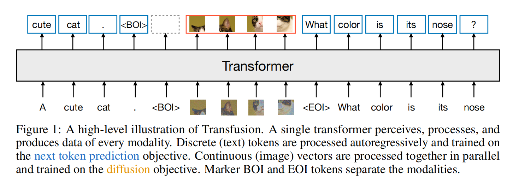
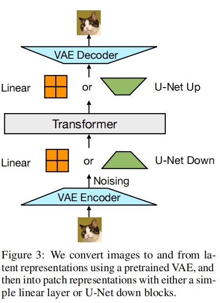
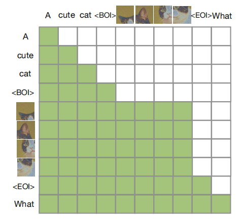

## 目录

- [一、统一多模态生成的范式困境与动机](#一统一多模态生成的范式困境与动机)
  - [1.1 离散 vs 连续：两种模态的本质差异](#11-离散-vs-连续两种模态的本质差异)
  - [1.2 现有路线的局限：量化瓶颈与模态割裂](#12-现有路线的局限量化瓶颈与模态割裂)
  - [1.3 Transfusion 的核心命题](#13-transfusion-的核心命题)
- [二、核心概念：混合模态序列与双重目标](#二核心概念混合模态序列与双重目标)
  - [2.1 数据表示：文本 Token 与图像 Latent Patch](#21-数据表示文本-token-与图像-latent-patch)
  - [2.2 双重损失：语言建模 + 扩散](#22-双重损失语言建模--扩散)
  - [2.3 注意力模式：因果与双向的混合](#23-注意力模式因果与双向的混合)
- [三、核心架构：单一 Transformer 与模态专属编解码](#三核心架构单一-transformer-与模态专属编解码)
  - [3.1 架构总览](#31-架构总览)
  - [3.2 模态专属输入层](#32-模态专属输入层)
  - [3.3 图像块内双向注意力（Intra-image Bidirectional Attention）](#33-图像块内双向注意力intra-image-bidirectional-attention)
  - [3.4 U-Net 风格的 Patch 编解码器](#34-u-net-风格的-patch-编解码器)
- [四、训练与推理范式](#四训练与推理范式)
  - [4.1 联合训练目标](#41-联合训练目标)
  - [4.2 噪声限制策略（Noise Limiting）](#42-噪声限制策略noise-limiting)
  - [4.3 推理：LM 模式与扩散模式的切换](#43-推理lm-模式与扩散模式的切换)
- [五、实验验证与 Scaling 规律](#五实验验证与-scaling-规律)
  - [5.1 与 Chameleon 的受控对比](#51-与-chameleon-的受控对比)
  - [5.2 架构消融：注意力、Patch 尺寸与编解码器](#52-架构消融注意力patch-尺寸与编解码器)
  - [5.3 大规模训练：7B Transfusion 的生成质量](#53-大规模训练7b-transfusion-的生成质量)
  - [5.4 图像编辑的零样本与微调扩展](#54-图像编辑的零样本与微调扩展)
- [六、与后续统一多模态工作的关系](#六与后续统一多模态工作的关系)

---

## 一、统一多模态生成的范式困境与动机

多模态生成模型的终极目标是让单一模型能够同时**感知、理解并生成**离散数据（如文本、代码）与连续数据（如图像、视频、音频）。然而，这两类模态在数学表示与最优建模目标上存在根本性差异，导致传统方案往往走向两个极端：要么牺牲连续模态的信息保真度，要么在架构上保持模态割裂。

### 1.1 离散 vs 连续：两种模态的本质差异

| 维度 | 离散数据（文本） | 连续数据（图像） |
| :--- | :--- | :--- |
| **表示空间** | 有限词表 $\mathcal{V}$ 上的整数索引 | 高维实数向量 $\mathbf{x} \in \mathbb{R}^d$ |
| **生成范式** | 自回归（Autoregressive）：逐 Token 预测 | 扩散（Diffusion）：逐步去噪 $p_\theta(\mathbf{x}_{t-1} \mid \mathbf{x}_t)$ |
| **损失函数** | 交叉熵（Cross-Entropy） | 均方误差（MSE）或 Flow Matching |
| **信息特性** | 符号性、组合性、因果结构强 | 空间相关性、局部连续性、信号保真敏感 |

语言模型（LLM）在离散序列建模上占据绝对主导，而扩散模型（Diffusion）及其变体（如 Flow Matching）则是连续媒体生成的 State-of-the-Art。强行将两者统一时，核心矛盾在于：**用离散自回归建模连续信号会引入量化瓶颈；用扩散建模离散文本则尚未达到 LLM 的规模化性能。**

### 1.2 现有路线的局限：量化瓶颈与模态割裂

在 Transfusion 之前，统一多模态模型大致分为两类，各有明显局限：

**（1）完全离散化统一（如 Chameleon、DALL-E、Emu3）**
- 将图像通过 VQ-VAE 或 VQ-GAN 量化为离散视觉 Token，与文本 Token 拼接成统一序列。
- 随后用标准的 Next-token Prediction（交叉熵损失）训练单一 Decoder-only Transformer。
- **局限**：量化过程会丢失连续空间的精细信息；图像生成需逐个预测大量视觉 Token，推理效率低；文本与图像在输出分布上竞争，常导致文本能力被削弱。

**（2）模态割裂的拼接（如 Flamingo、LLaVA、GILL）**
- 文本侧用预训练 LLM，图像理解侧用预训练 ViT，图像生成侧嫁接预训练扩散模型。
- 通过投影层或工具调用实现跨模态交互，但各模块独立预训练、独立优化。
- **局限**：并非端到端统一学习；模态间信息融合浅层；难以实现真正的交错序列（interleaved）上下文学习。

### 1.3 Transfusion 的核心命题

**Transfusion 提出一个简单但此前未被充分探索的方案：在单一 Transformer 中，为不同模态保留其各自最优的目标函数——文本用 Next-token Prediction（CE Loss），图像用扩散（DDPM/MSE Loss），共享数据与参数，端到端联合训练。**

其核心设计哲学可概括为：

- **不量化图像**：图像始终保持在连续潜空间（VAE latent patches），避免信息瓶颈。
- **不割裂架构**：绝大多数参数属于一个共享 Transformer，而非多模块拼接。
- **不统一损失**：不同模态使用各自适配的损失函数，而非强行将连续数据塞入离散分布。
- **注意力混合**：文本保持因果注意力，图像块内使用双向注意力，兼顾序列因果性与空间结构感知。

---

## 二、核心概念：混合模态序列与双重目标

Transfusion 的输入是一条**混合模态序列（Mixed-Modality Sequence）**，其中同时包含离散元素（文本 Token 的整数索引）和连续元素（图像 Patch 的实数向量）。

### 2.1 数据表示：文本 Token 与图像 Latent Patch

**文本侧**
- 使用标准文本 Tokenizer（如 Llama 2 Tokenizer）将字符串转换为整数序列。
- 通过 Embedding Matrix 将每个整数映射到 $\mathbb{R}^d$ 向量空间。
- 输出侧通过 LM Head 将 Transformer 输出向量映射回词表上的离散分布。

**图像侧**
- 图像先经过预训练 VAE（如 Stable Diffusion 的 2D VAE）编码至低维潜空间。
- 例如，一张 $256 \times 256$ 像素的图像被压缩为 $32 \times 32 \times 8$ 的 latent tensor，其中每个 $8$ 维向量可理解为对应原图一个 $8 \times 8$ 像素块的连续表征。
- 这些 latent pixels 按从左到右、从上到下的顺序展平为**连续 Patch 序列**。
- 每个图像序列前后插入特殊标记符：**BOI（Begin of Image）** 与 **EOI（End of Image）**，用于在混合序列中界定图像边界。

最终，一条训练样本可能长这样（以文本+图像+文本为例）：

> `A cute cat . <BOI> [patch_1] [patch_2] ... [patch_n] <EOI> What color is its nose ?`

其中 `A cute cat .` 与 `What color is its nose ?` 是离散文本 Token；中间 `[patch_i]` 是连续向量。

### 2.2 双重损失：语言建模 + 扩散

Transfusion 在**同一次前向传播**中，对序列中的不同部分施加不同损失：

**文本部分：语言建模损失（LM Loss）**
给定文本序列 $y = y_1, \dots, y_n$，标准分解为：

$$
P(y) = \prod_{i=1}^{n} P_\theta(y_i \mid y_{\lt{i}})
$$

优化目标为交叉熵：

$$
\mathcal{L}_{\mathrm{LM}} = \mathbb{E}_{y_i} \left[ -\log P_\theta(y_i \mid y_{\lt{i}}) \right]
$$

**图像部分：扩散损失（Diffusion Loss）**
遵循 DDPM 框架，对干净 latent 图像 $\mathbf{x}_0$ 加噪得到 $\mathbf{x}_t$：

$$
\mathbf{x}_t = \sqrt{\bar{\alpha}_t} \mathbf{x}_0 + \sqrt{1 - \bar{\alpha}_t} \boldsymbol{\epsilon}, \quad \boldsymbol{\epsilon} \sim \mathcal{N}(\mathbf{0}, \mathbf{I})
$$

模型 $\epsilon_\theta$ 学习预测噪声 $\boldsymbol{\epsilon}$，优化目标为 MSE：

$$\mathcal{L}_{\mathrm{DDPM}} = \mathbb{E}_{\mathbf{x}_0, t, \boldsymbol{\epsilon}} \left[ \left\| \boldsymbol{\epsilon} - \epsilon_\theta(\mathbf{x}_t, t, c) \right\|^2 \right]
$$

其中 $c$ 为上下文条件（如文本 caption、前文图像等）。

**联合目标**

$$
\mathcal{L}_{\mathrm{Transfusion}} = \mathcal{L}_{\mathrm{LM}} + \lambda \cdot \mathcal{L}_{\mathrm{DDPM}}
$$

论文中设 $\lambda = 5$。关键洞察：这不是多任务学习的简单拼接，而是**让同一组 Transformer 参数同时服务于离散分布建模与连续分布去噪**。

### 2.3 注意力模式：因果与双向的混合

标准 LLM 使用**因果掩码（Causal Masking）**，即每个 Token 只能 attend 到自身及之前位置，这是为了：
1. 适配自回归生成；
2. 在单次前向传播中高效计算整个序列的损失与梯度，而不泄露未来信息。

然而，图像是**非序列化**的二维/三维信号，其内部 patch 之间存在强烈的空间双向依赖。若对图像 patch 也强制因果注意力，会阻止后出现的 patch 向前面的 patch 传递信息，严重损害生成质量。

**Transfusion 的注意力规则：**
- **全局层面**：序列中的每个元素（无论文本还是图像 patch）对**之前出现的其他元素**保持因果注意力。
- **图像内部**：同一张图像的 patch 之间使用**双向注意力（Bidirectional Attention）**，即每个 patch 可以看到同图内的所有其他 patch。
- **跨图像**：第 $k$ 张图像的 patch 只能看到序列中排在它之前的文本、以及排在它之前的其他图像的 patch。

这一设计被证明至关重要：**消融实验显示，移除图像内部双向注意力（改为纯因果）会使 FID 从 20.3 恶化到 61.3**（Linear 编码器设置）。

---

## 三、核心架构：单一 Transformer 与模态专属编解码

### 3.1 架构总览

Transfusion 的主体是一个标准的 **Llama 风格 Transformer**（SwiGLU 激活、RoPE 位置编码），其绝大多数参数被文本与图像共享。围绕这一核心，有两套轻量级的**模态专属 (Modality-Specific) 外围层**：

后续的统一多模态工作（如 BAGEL、Lance 等）在 Transfusion 的「统一上下文 + 混合目标」范式基础上，通过引入双流 MoE（理解专家与生成专家）来进一步解耦梯度冲突。而 Transfusion 作为纯 Dense 架构的先行者，有力证明了即使不进行专家解耦，仅凭共享的 Dense Transformer 与混合损失函数，也能实现文本与图像模态的端到端统一 Scaling。

- **文本**：输入输出均有独立的 Embedding / Unembedding 矩阵。
- **图像**：输入需经 VAE Encoder + Patch Encoder；输出需经 Patch Decoder + VAE Decoder。

### 3.2 模态专属输入层

**文本输入层**
- 标准 Embedding Matrix: $|\mathcal{V}| \times d$，将整数 Token 映射为向量。

**图像输入层**
图像进入 Transformer 前需经过两步压缩：

1. **VAE Encoder**：将像素空间映射到 latent 空间（如 $256 \times 256 \to 32 \times 32 \times 8$）。
2. **Patch Encoder**：将局部窗口的 $k \times k$ 个 latent pixels 进一步压缩为单个 Transformer 向量。

论文实验了两种 Patch Encoder：
- **Linear Layer**：简单线性投影，参数量极小（远远小于 0.5% 总参数）。
- **U-Net Down Blocks**：借鉴 U-Net 的下采样块，引入局部归纳偏置，参数量显著增加（在小模型中可达 +100%，但在 7B 模型中仅占 3.8%）。

对应地，输出侧也有：
- **Linear Layer** 或 **U-Net Up Blocks** 作为 Patch Decoder，将 Transformer 输出向量还原为 VAE latent，再经 VAE Decoder 重建像素。

**时间步编码**
在扩散目标中，当前时间步 $t$ 的信息被编码为嵌入向量，加到每个图像 patch 向量上，再进入 Patch Encoder。

### 3.3 图像块内双向注意力（Intra-image Bidirectional Attention）

这是 Transfusion 区别于标准 LLM 的核心机制之一。

**注意力掩码可视化**

- 文本与 `<BOI>` 保持严格因果。
- 图像 patch `p1-p4` 内部完全双向（互相可见）。
- 图像整体对后续文本因果可见（即生成文本时可以“看到”整张图）。
- 后续文本对图像不可见（防止信息泄露）。

### 3.4 U-Net 风格的 Patch 编解码器

论文发现，使用 U-Net 的 Down/Up Blocks 替代简单 Linear Layer 作为 Patch Encoder/Decoder，能在图像相关任务上带来显著提升，且这种提升**不仅仅是由于参数量增加**。

**不同 Patch 尺寸下的表现**

| Patch Encoder | Latent Patch | 原图 Patch | 每图元素数 | C4 PPL | Llama Acc | CIDEr | FID | CLIP |
|:---|:---|:---|:---|:---|:---|:---|:---|:---|
| None | 1×1 | 8×8 | 1024 | 10.3 | 52.2 | 12.0 | 21.0 | 24.0 |
| Linear | 2×2 | 16×16 | 256 | 10.4 | 51.7 | 16.0 | 20.3 | 24.0 |
| Linear | 4×4 | 32×32 | 64 | 10.9 | 49.8 | 14.3 | 25.6 | 22.6 |
| Linear | 8×8 | 64×64 | 16 | 11.7 | 47.7 | 11.3 | 43.5 | 18.9 |
| U-Net | 2×2 | 16×16 | 256 | 10.3 | 51.9 | 25.4 | 16.7 | 25.4 |
| U-Net | 4×4 | 32×32 | 64 | 10.7 | 50.7 | 29.9 | 16.0 | 25.7 |
| U-Net | 8×8 | 64×64 | 16 | 11.4 | 49.2 | 29.5 | 16.1 | 25.2 |

关键观察：
- **Linear 编码器**：Patch 越大（压缩率越高），图像任务性能越差，因为信息丢失严重。
- **U-Net 编码器**：即使将图像压缩到极少的 patch（如每图 16 个元素），图像生成与理解指标（CIDEr、FID）仍保持优秀，甚至优于 Linear 的 1024 元素设置。这表明 U-Net 块确实学到了有效的局部空间归纳偏置。
- 文本性能（PPL、Acc）随 Patch 增大而轻微下降，可能因为模型需要将更多容量分配给图像处理。

**Scaling 趋势**
在 7B 规模下，U-Net 编解码器仅占总体 3.8% 参数（约 0.27B），与 Embedding 层参数量相当。此时 U-Net 变体在图像生成（FID 16.0 vs 18.6）和图像理解（CIDEr 33.7 vs 27.2）上均优于 Linear 变体。

---

## 四、训练与推理范式

### 4.1 联合训练目标

训练时，每个 batch 包含混合模态序列。对于序列中的每个位置：
- 如果是**文本 Token**（或 `<BOI>` 之后的文本），计算 $\mathcal{L}_{\mathrm{LM}}$。
- 如果是**图像 Patch**，对整个图像计算 $\mathcal{L}_{\mathrm{DDPM}}$（图像级 MSE，而非 patch 级）。

值得注意的是，**训练时下游文本 Token 是以加噪图像为条件的**。即当序列排布为 `caption → noisy image → question` 时，question 的文本生成依赖于扩散过程中的中间噪声状态 $\mathbf{x}_t$。这迫使模型学会在噪声干扰下提取视觉语义。

### 4.2 噪声限制策略（Noise Limiting）

论文默认将 80% 的图像-文本对排布为 `caption → image`（图像生成方向），20% 排布为 `image → caption`（图像理解方向）。

对于后者（图像在文本之前），图像在训练时会被加噪。若噪声过大（时间步 $t$ 接近 1000），图像语义严重破坏，会影响后续的图像描述（captioning）能力。

**解决方案**：在图像先于文本出现的 20% 样本中，将扩散噪声上限限制为 $t_{\max} = 500$（即只用前半段噪声调度）。

消融实验表明，这一策略显著提升了图像理解指标（CIDEr 从 25.4 提升到 29.4，在 0.76B 模型上），而对文本生成和图像生成指标影响极小（远远小于 1%）。

### 4.3 推理：LM 模式与扩散模式的切换

Transfusion 的推理算法是一个**双模式状态机**，在标准文本自回归与扩散去噪之间切换：

**LM 模式**
- 标准自回归文本生成：从模型输出的分布中采样下一个 Token（使用 temperature 与 top-p truncation）。
- 持续采样直到遇到 `<BOI>` Token。

**扩散模式**
- 一旦采样到 `<BOI>`，立即切换到扩散模式。
- 在序列末尾拼接纯噪声 $\mathbf{x}_T$（形式为 $n$ 个图像 patch，尺寸由目标图像分辨率决定）。
- 进行 $T$ 步去噪（论文使用 250 步，训练时为 1000 步）：
  - 每步 $t$，模型预测噪声 $\epsilon_\theta(\mathbf{x}_t, t, c)$。
  - 根据噪声调度计算 $\mathbf{x}_{t-1}$，并**原地覆盖**序列中的 $\mathbf{x}_t$。
  - 模型始终只条件于当前时间步的噪声状态，无法 attend 到之前的时间步（防止扩散轨迹泄露）。
- 去噪完成后，采样 `<EOI>`，切换回 LM 模式，继续生成后续文本。

这一机制允许模型生成**任意交错组合**的文本与图像，例如：
- 纯文本对话
- 文本 → 图像（T2I）
- 图像 → 文本描述（I2T）
- 文本 → 图像 → 文本问答（T2I2T）

---

## 五、实验验证与 Scaling 规律

### 5.1 与 Chameleon 的受控对比

论文以 **Chameleon**（Meta 的离散 Token 统一多模态模型）为强基线，进行了严格的受控实验：
- 使用**相同的数据**（0.5T tokens，50% 文本 + 50% 图像）。
- 使用**相同的 VAE 训练数据与架构**（Chameleon 用 VQ-VAE，Transfusion 用 VAE，仅区别量化层）。
- 使用**相同的模型规模**（0.16B 到 7B 共 5 个尺寸）。
- 使用**理论 FLOPs** 作为计算量度量（消除 Transfusion 序列更短带来的注意力计算优势）。

**Scaling 趋势结论**

| 基准 | Transfusion 7B | Chameleon 7B | Parity FLOP Ratio |
|:---|:---|:---|:---|
| C4 PPL (↓) | 7.72 | 8.41 | 0.489 |
| Wiki PPL (↓) | 4.28 | 4.69 | 0.526 |
| Llama Eval Acc (↑) | 61.5 | 59.1 | 0.600 |
| MS-COCO CIDEr (↑) | 27.2 | 18.0 | 0.218 |
| MS-COCO FID (↓) | 16.8 | 29.6 | 0.029 |
| MS-COCO CLIP (↑) | 25.5 | 24.3 | 0.319 |

- **图像生成**：Transfusion 达到与 Chameleon 同等 FID 所需的计算量仅为 Chameleon 的 **~3%**（Parity FLOP Ratio 0.029）。
- **图像理解**：同等 CIDEr 仅需 **~22%** 计算量。
- **文本理解**：同等困惑度仅需 **~50%** 计算量。

**意外发现**：即使文本侧两者都使用自回归，Transfusion 的文本能力也优于 Chameleon。论文假设这可能是因为：
1. Chameleon 的稳定性修改（query-key norm、post-norm、denominator loss 等）引入了效率损耗。
2. 离散视觉 Token 与文本 Token 在输出分布上竞争，损害了文本建模。
3. 扩散对图像生成更高效，释放了更多模型容量给文本。

### 5.2 架构消融：注意力、Patch 尺寸与编解码器

**注意力掩码消融（0.76B 模型）**

| 编解码器 | 注意力 | C4 PPL | Llama Acc | CIDEr | FID | CLIP |
|:---|:---|:---|:---|:---|:---|:---|
| Linear | Causal | 10.4 | 51.4 | 12.7 | 61.3 | 23.0 |
| Linear | Bidirectional | 10.4 | 51.7 | 16.0 | **20.3** | 24.0 |
| U-Net | Causal | 10.3 | 52.0 | 23.3 | 16.8 | 25.3 |
| U-Net | Bidirectional | 10.3 | 51.9 | **25.4** | **16.7** | **25.4** |

- 图像内部双向注意力对 FID 提升至关重要（尤其在 Linear 设置下，FID 从 61.3 → 20.3）。
- U-Net 编码器本身带有局部双向性，因此纯因果注意力的 U-Net 表现尚可，但加上 Transformer 层级的双向注意力后仍能获得小幅提升。

**Patch 尺寸与编解码器组合**
见 3.4 节表格。核心结论：U-Net 编解码器能有效抵抗大 Patch 带来的信息损失，使得高压缩率（每图 16/64 元素）下仍保持优秀生成质量。

### 5.3 大规模训练：7B Transfusion 的生成质量

论文训练了一个 **7B Transfusion**（含 0.27B U-Net 编解码参数），在 **2T 多模态 tokens**（1T 文本 + 3.5B 图像-caption 对，约 5 epochs）上从头训练。

**与主流图像生成模型对比**

| 模型 | 总参数量 | 文本数据 | 图像数据 | Llama Acc | FID | GenEval |
|:---|:---|:---|:---|:---|:---|:---|
| Llama 1 | 7B | 1.4T | — | 66.1 | — | — |
| Llama 2 | 7B | 2.0T | — | 66.3 | — | — |
| Chameleon | 7B | 6.0T | 3.5B | 67.1 | 26.74 | 0.39 |
| DALL-E 2 | 5.2B | — | 2.6B | — | 10.39 | 0.52 |
| SDXL | 3.4B | — | 1.6B | — | — | 0.55 |
| DeepFloyd | 10.2B | — | 7.5B | — | 6.66 | 0.61 |
| SD 3 | 12.8B | — | 2.0B | — | — | 0.68 |
| **Transfusion (Ours)** | **7.3B** | **1.0T** | **3.5B** | **66.1** | **6.78** | **0.63** |

- **图像生成**：FID 6.78 与 DeepFloyd 相当，优于 SDXL 和 DALL-E 2；GenEval 0.63 接近 SD 3（0.68），但 SD 3 使用了合成 caption 增强（带来约 6.5% 绝对提升）。
- **文本生成**：Llama Acc 66.1，与 Llama 1/2 持平（在相同文本数据分布上）。
- **独特性**：Transfusion 是表中唯一能同时生成高质量图像与高质量文本的单一模型。

### 5.4 图像编辑的零样本与微调扩展

尽管预训练数据主要是文本-文本、图像-文本、文本-图像三元组，Transfusion 展现出向**图像到图像编辑（Image-to-Image Editing）**的扩展能力。

**微调实验**
- 使用 7B 预训练模型，在仅 **8k 公开图像编辑样本**（输入图 + 编辑指令 + 输出图）上微调。
- 这些样本遵循 EmuEdit 格式，涵盖对象移除、属性修改、风格迁移、局部重绘等。

**结果**
- 微调后的模型能够执行精确的指令跟随编辑，如：
  - "Remove the cupcake on the plate."
  - "Change the tomato on the right to a green olive."
  - "Write the word 'Zebra' in Arial bold."（在斑马身上生成指定文字）
  - "Change this to cartoon style."
- 这表明 Transfusion 的**统一连续潜空间表示**与**交错上下文机制**使其具备跨模态组合的泛化潜力，而不仅限于预训练时见过的模态配对。

---

## 六、与后续统一多模态工作的关系

Transfusion 发表于 2024 年 8 月，其「单一 Transformer + 混合目标」的范式深刻影响了后续的统一多模态模型设计：

- **Transfusion 是 AR+Diffusion 混合路线的奠基工作之一**。后续如 Show-o、Show-o2、BLIP3-o、BAGEL、Lance 等均在单一框架内混用自回归与扩散/Flow Matching，并在此基础上引入双流专家、交错数据、视频扩展等增强。
- **连续表示优于离散表示**的结论被后续工作广泛采纳。例如 Lance 明确区分理解用的 ViT 语义 Token 与生成用的 VAE 连续潜变量，可视为在 Transfusion 基础上的进一步解耦与扩展。
- **注意力模式混合**（全局因果 + 局部双向）成为统一模型的标准实践。后续工作如 Lance 的「广义三维因果注意力」、Show-o 的统一注意力设计均延续此思想。
- **模态专属轻量编解码器**的思路在后续模型中演化为更复杂的 Connector、Perceiver Resampler、或 U-Net 风格的 Latent 处理层。

Transfusion 证明了一个关键命题：**不必为了统一而牺牲各模态的最优归纳偏置**。语言保持自回归与因果性，图像保持连续与双向性，两者可以在共享参数空间中协同 scaling——这一原则至今仍是原生统一多模态模型（Native Unified Multimodal Models）的核心设计准则。

